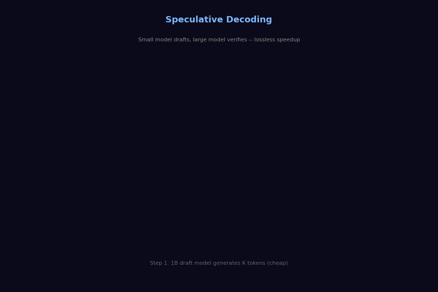
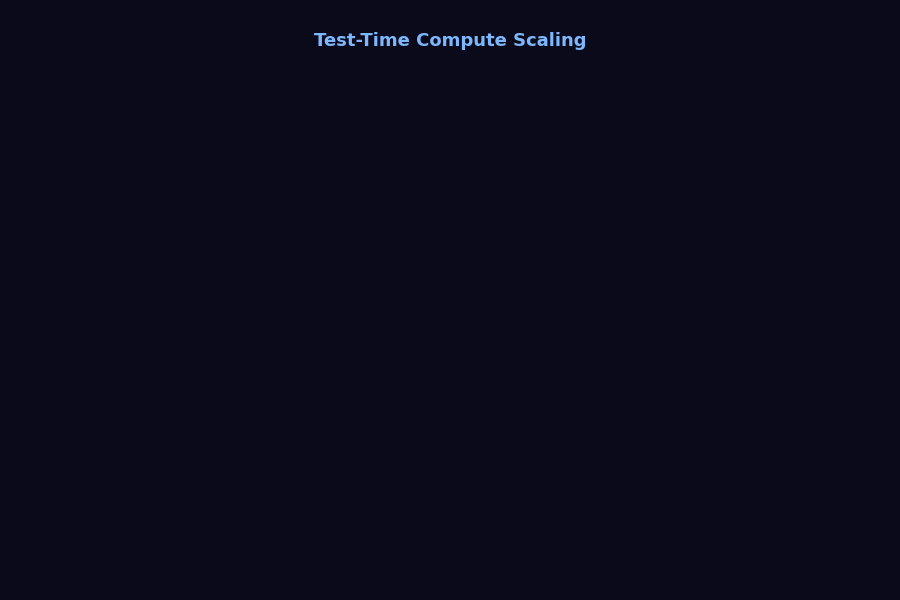
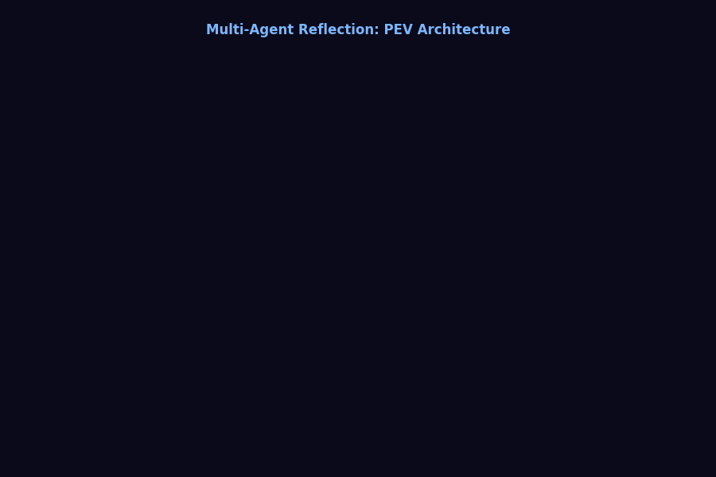

# Advanced AI Daily

> Daily advanced AI/ML tutorials | LLM Architectures &middot; Agent Systems &middot; New RL Paradigms

---

## Tutorial Index

| # | Topic | Date | Difficulty | GIF |
|---|-------|------|------------|-----|
| 01 | [GRPO - Group Relative Policy Optimization](tutorials/01-grpo.md) | Day 1 | Advanced |  |
| 02 | [MoE - Mixture of Experts Deep Dive](tutorials/02-mixture-of-experts.md) | Day 2 | Advanced |  |
| 03 | [Speculative Decoding](tutorials/03-speculative-decoding.md) | Day 3 | Advanced |  |
| 04 | [Test-Time Compute / Inference Scaling](tutorials/04-test-time-compute.md) | Day 4 | Advanced |  |
| 05 | [Multi-Agent Reflection](tutorials/05-multi-agent-reflection.md) | Day 5 | Advanced |  |

---

## Design Principles

- **Depth First**: No basic ML concepts -- straight to the frontier
- **Visual Driven**: Each concept comes with flowcharts + animated GIFs
- **Code Readable**: Python implementations, clean and commented
- **Daily Updates**: Automated via GitHub Actions fetching arXiv papers

---

## Subscribe

Star this repo and get notified on each update.

## Feedback & Contribute

Open an issue or submit a PR.

---

_Licensed under MIT_
