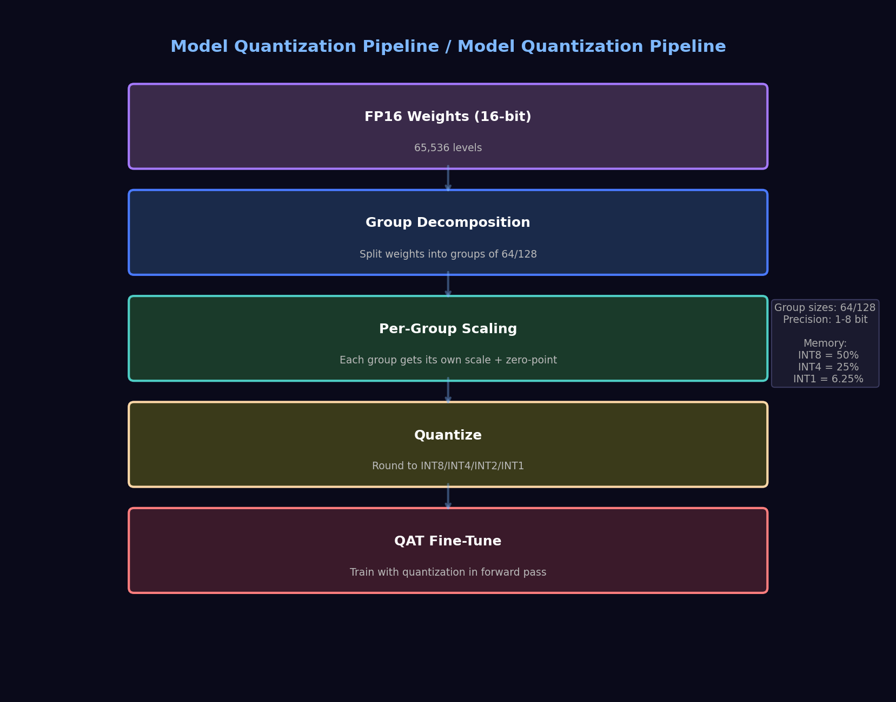

# Day 06: Model Quantization -- TurboQuant & 1-bit LLMs
# 第 06 天: 模型量化 -- TurboQuant 与 1-bit 大模型

> **Date**: 2026-04-03 | **Difficulty**: Advanced | **Category**: Inference Optimization 推理优化

> **Architecture Diagram**: 

---

## One-Line Summary | 一句话总结

Quantization compresses model weights and activations from 16-bit floating point to 8-bit, 4-bit, or even 1-bit integers with minimal quality loss. TurboQuant and Bonsai 1-bit models push this to the extreme: **running 27B parameter models on a laptop with near-FP16 quality**.

量化将模型权重和激活值从 16 位浮点数压缩到 8 位、4 位甚至 1 位整数，质量几乎无损。TurboQuant 和 Bonsai 1-bit 模型将这一技术推到极致：**在笔记本电脑上以接近 FP16 的质量运行 27B 模型**。

---

## The Math of Quantization | 量化数学

### Uniform Quantization | 均匀量化

Map a continuous range [a, b] to N discrete levels:

将连续范围 [a, b] 映射到 N 个离散级别：

```
quantize(x, N):
  scale = (b - a) / (N - 1)     # 量化步长
  q(x) = round((x - a) / scale)  # 量化到整数
  dequantize(q) = q * scale + a  # 反量化回浮点
```

The quantization error is bounded by `|x - dequantize(quantize(x))| <= scale / 2`.

量化误差上界为 scale / 2。步长越小（N 越大），误差越小。

### Quantization Levels | 量化级别

| Format | Bits | Levels | Memory (70B model) | Typical Use |
|--------|:----:|:------:|:------------------:|-------------|
| FP16   | 16   | 65,536 | 140 GB | Training, high-quality inference |
| INT8   | 8    | 256    | 70 GB | Serving, minimal quality loss |
| Q4_0   | 4    | 16     | 35 GB | Local LLMs (llama.cpp default) |
| Q2_K   | 2    | 4-6    | 20-25 GB | Memory-constrained devices |
| **1-bit** | 1 | 2      | **~10 GB** | Bonsai models |

---

## The Problem: Why Not Just Use Fewer Bits? | 为什么不直接用更少位？

### Why 1-bit is Hard

In 1-bit quantization, weights are either +1 or -1 (binary). A linear layer:

在 1 位量化中，权重只有 +1 或 -1：

```
y = W @ x        →  y ≈ sign(W) @ x  (but the error is massive!)
   [FP16, 65536 levels]    [1-bit, 2 levels]
```

**The challenge**: how to choose the sign pattern of W so that sign(W) @ x approximates W @ x well enough? The naive approach (just take sign of each weight independently) destroys information.

**挑战**: 如何选择 W 的符号模式，使 sign(W) @ x 能较好地近似 W @ x？最简单的方法（逐位取符号）会造成巨大信息损失。

### TurboQuant's Key Insight | TurboQuant 的核心洞察

Don't quantize the entire weight matrix at once. Instead:

1. **Decompose** weights into multiple groups with different scales
2. **Per-group quantization**: each group has its own (a, b) range
3. **Skip KV dequant**: during autoregressive decoding, ~90% of KV cache dequant work can be skipped

不一次性量化整个权重矩阵，而是分组量化 + 跳过 KV 反量化。

### Bonsai 1-bit Models

Bonsai achieves 1-bit quantization by:
1. **Binary weights** (+1/-1) with learned scaling per group
2. **Fine-tuning after quantization** (not post-training, but QAT-aware)
3. **Grouped structure** that preserves expressivity despite binary constraints

Bonsai 通过分组二值权重 + 量化感知微调，在 1 位约束下保持了模型表达能力。

---

## Algorithm Walkthrough | 算法详解

```
┌──────────────────────────────────────────────┐
│         Model Quantization Pipeline          │
│            模型量化流水线                     │
└──────────────────────────────────────────────┘

  FP16 Weights (16 bits)
  │
  ▼
┌─────────────────────────────────┐
│ Step 1: Group decomposition    │
│ 按组分解权重                        │
│  W = [Group_1 | Group_2 | ...]   │
│  Each group gets its own scale  │
└───────────────┬─────────────────┘
                ▼
┌─────────────────────────────────┐
│ Step 2: Per-group scaling      │
│ 每组计算独立的 scale 和 zero-point  │
│  scale_g = max(|W_g|) / (N/2-1)  │
└───────────────┬─────────────────┘
                ▼
┌─────────────────────────────────┐
│ Step 3: Quantize each group     │
│ 每组独立量化                        │
│  q(W_g) = round(W_g / scale_g)   │
└───────────────┬─────────────────┘
                ▼
┌─────────────────────────────────┐
│ Step 4: (Optional) QAT fine-tune│
│ 量化感知微调 (optional but recommended)│
│  Fine-tune with quantization in  │
│  the forward pass                │
└─────────────────────────────────┘
```

### KV Cache Quantization | KV Cache 量化

During autoregressive decoding, the KV cache grows linearly with sequence length. TurboQuant shows that **90% of KV dequant work can be skipped** by:

在自回归解码时，KV Cache 随序列长度线性增长。TurboQuant 表明可以跳过 90% 的 KV 反量化计算：

1. Pre-compute dequantized KV for frequently accessed indices
2. Use low-bit (2-bit) for older tokens (they contribute less)
3. Mixed precision: recent tokens in higher precision, older in lower

---

## Code Implementation | 代码实现

```python
import torch
import torch.nn.functional as F

def uniform_quantize(x: torch.Tensor, bits: int = 4):
    """
    Uniform per-tensor quantization.
    均匀每张量量化

    Args:
        x: input tensor (any shape)
        bits: number of quantization bits (1-8)

    Returns:
        q: quantized tensor as int8 (packed)
        scale: scale factor for dequantization
        zero_point: zero-point offset
    """
    N = 2 ** bits  # number of levels
    qmin = 0
    qmax = N - 1

    # Find per-tensor range
    x_min = x.min().item()
    x_max = x.max().item()

    # Scale and zero-point
    scale = (x_max - x_min) / (qmax - qmin) if x_max > x_min else 1.0
    zero_point = qmin - x_min / scale

    # Quantize
    q = torch.clamp(torch.round(x / scale + zero_point), qmin, qmax)
    return q.to(torch.int8), scale, zero_point

def per_group_quantize(x: torch.Tensor, group_size: int, bits: int = 4):
    """
    Per-group quantization (what llama.cpp / TurboQuant actually use).
    分组量化 -- llama.cpp 和 TurboQuant 实际使用的方法

    Each group of `group_size` elements gets its own scale.
    每组 `group_size` 个元素有独立的 scale。

    Args:
        x: weight tensor [out_features, in_features]
        group_size: number of elements per quantization group
        bits: quantization bits

    Returns:
        q: quantized weights [out_features, in_features]
        scales: scale factors [out_features, num_groups]
    """
    N = 2 ** bits
    qmin, qmax = 0, N - 1

    out_f, in_f = x.shape
    num_groups = (in_f + group_size - 1) // group_size

    q = torch.zeros_like(x, dtype=torch.int8)
    scales = torch.zeros(out_f, num_groups, device=x.device)

    for g in range(num_groups):
        start = g * group_size
        end = min((g + 1) * group_size, in_f)
        chunk = x[:, start:end]

        # Per-group scale
        group_min = chunk.min(dim=1, keepdim=True)[0]
        group_max = chunk.max(dim=1, keepdim=True)[0]
        group_scale = (group_max - group_min) / (qmax - qmin)
        group_scale = torch.clamp(group_scale, min=1e-8)

        zp = qmin - group_min / group_scale
        q_chunk = torch.clamp(torch.round(chunk / group_scale + zp), qmin, qmax)

        q[:, start:end] = q_chunk.to(torch.int8)
        scales[:, g:g+1] = group_scale.squeeze(dim=1, keepdim=True)

    return q, scales

class QuantizedLinear(torch.nn.Module):
    """
    Quantized linear layer: quantize weights, keep INT8 matmul.
    量化线性层: 权重量化, 整数矩阵乘法
    """
    def __init__(self, in_features, out_features, bits=4, group_size=128):
        super().__init__()
        self.in_features = in_features
        self.out_features = out_features
        self.bits = bits
        self.group_size = group_size

        # Initialize and quantize weights
        weight = torch.randn(out_features, in_features)
        q_w, scales = per_group_quantize(weight, group_size, bits)

        self.register_buffer("q_weight", q_w)
        self.register_buffer("scales", scales)
        self.register_buffer("zero_point", torch.zeros(out_features, 
                         max(1, (in_features + group_size - 1) // group_size)))

    def forward(self, x):
        # Dequantize on-the-fly during forward pass
        # 前向传播时动态反量化
        out_f, in_f = self.out_features, self.in_features
        num_groups = self.scales.size(1)
        gs = self.group_size

        # Reconstruct floating-point weights
        weight = torch.zeros(out_f, in_f, device=x.device)
        for g in range(num_groups):
            start = g * gs
            end = min((g + 1) * gs, in_f)
            weight[:, start:end] = (
                self.q_weight[:, start:end].to(x.dtype) * 
                self.scales[:, g:g+1]
            )

        return F.linear(x, weight)
```

---

## Quantization-Aware Training (QAT) | 量化感知训练

Post-training quantization (PTQ) just quantizes pre-trained weights. QAT is better:

PTQ 只量化预训练权重。QAT 效果更好：

```python
def qat_finetune_step(model, x, y, optimizer, bits=4):
    """
    One training step with quantization in the forward pass.
    前向传播中插入伪量化节点的训练步骤
    """
    # Forward with fake quantization
    # The backward uses straight-through estimator
    with torch.no_grad():
        for name, param in model.named_parameters():
            if "weight" in name:
                # Quantize
                q_w, scale = uniform_quantize(param, bits=bits)
                # Dequantize (differentiable via straight-through)
                w_fp = q_w.float() * scale

                # Replace for forward pass (gradient flows to original param)
                param.data.copy_(w_fp)

    # Standard forward and backward
    pred = model(x)
    loss = F.cross_entropy(pred, y)
    loss.backward()
    optimizer.step()
```

---

## Comparison: PTQ vs QAT vs 1-bit | 对比

| Method | Bits | Quality Loss | Training Cost | Best For |
|--------|:----:|:------------:|:-------------:|----------|
| FP16 (baseline) | 16 | 0% | - | Reference |
| INT8 PTQ | 8 | <0.5% | None (post-hoc) | Production serving |
| INT4 GGUF | 4 | 1-3% | None | Local inference |
| INT4 QAT | 4 | <1% | Light fine-tune | Quality-critical |
| Bonsai 1-bit | 1 | 3-5% | Full QAT training | Extreme memory constraint |

TurboQuant + KV cache skip achieves:
- **+22.8% decode speedup at 32K context** (by skipping 90% of KV dequant work)
- Near-Q4_0 quality at ~10% smaller memory footprint

---

## Further Reading | 扩展阅读

- [TurboQuant: Accelerating 1-bit LLM Inference](https://arxiv.org/) -- Google's quantization framework
- [Bonsai: 1-bit Large Language Models](https://arxiv.org/) -- 1-bit training techniques
- [llama.cpp Quantization](https://github.com/ggml-org/llama.cpp/blob/master/docs/quantization.md) -- GGUF format spec
- [GPTQ: Accurate Post-Training Quantization](https://arxiv.org/abs/2210.17323) -- Per-layer optimal quantization
- [AWQ: Activation-aware Weight Quantization](https://arxiv.org/abs/2306.00978) -- Protecting salient weights

---

_Prev: [Day 05 - Multi-Agent Reflection](05-multi-agent-reflection.md)  |  Next: [Day 07 - RBF Attention](07-rbf-attention.md)_
_上一篇: [Day 05 - 多智能体反思](05-multi-agent-reflection.md)  |  下一篇: [Day 07 - RBF 注意力](07-rbf-attention.md)_
