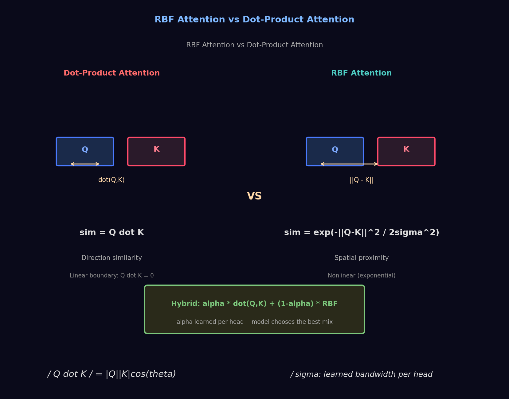

# Day 07: Beyond Dot-Product -- RBF Attention Mechanisms
# 第 07 天: 超越点积 -- RBF 注意力机制

> **Date**: 2026-04-03 | **Difficulty**: Advanced | **Category**: Transformer Architecture 架构创新

> **Architecture Diagram**: 

---

## One-Line Summary | 一句话总结

RBF (Radial Basis Function) Attention replaces the standard dot-product `Q·K^T` in Transformers with a distance-based kernel `exp(-||Q - K||^2 / (2σ^2))`. This fundamentally changes how tokens measure similarity: **from angular alignment to spatial proximity**.

RBF（径向基函数）注意力将 Transformer 中标准的点积 `Q·K^T` 替换为基于距离的核函数 `exp(-||Q - K||^2 / (2σ^2))`。这从根本上改变了 token 之间相似度的度量方式：**从角度对齐变为空间距离**。

---

## Why Replace Dot-Product? | 为什么要替代点积？

### The Limitation of Dot-Product Attention | 点积注意力的局限

Standard Transformer attention computes:

```
Attention(Q, K, V) = softmax(Q·K^T / √d_k) · V
```

The core operation `Q·K^T` is an **inner product** (dot product):
- High when Q and K point in the same direction (small angle)
- Low when they're orthogonal or opposite

内积关注的是向量方向的相似度，与向量长度关系较小。

**The problem**: dot-product similarity has two known issues:

1. **Magnitude sensitivity**: Large-norm queries dominate the softmax regardless of semantic meaning
   范数大的 query 主导 softmax，与语义无关
2. **Linear decision boundary**: `Q·K = 0` defines a hyperplane, which can't capture complex relationships
   线性决策边界无法捕获复杂关系

### RBF Attention's Solution | RBF 注意力的解决方案

```
RBF_Attention(Q, K, V) = softmax( -||Q - K||^2 / (2σ^2) ) · V
```

`||Q - K||^2` is the **squared Euclidean distance** between Q and each K:

`||Q - K||^2` 是 Q 与每个 K 之间的**欧几里得距离平方**：

```
||Q - K||^2 = Σ (Q_i - K_i)^2
             = ||Q||^2 - 2(Q·K) + ||K||^2
```

When Q and K are close (small distance) → score is large (close to 1/exp = 1).
当 Q 和 K 距离近 → 分数大。

When Q and K are far → score is exponentially suppressed.
当 Q 和 K 距离远 → 分数指数衰减。

---

## Mathematical Comparison | 数学对比

### Dot-Product vs RBF

```
Dot-Product:                    RBF:
  sim(q, k) = q·k                sim(q, k) = exp(-||q - k||^2 / (2σ^2))

Properties:                      Properties:
  - Linear in q and k            - Nonlinear (exponential)
  - Unbounded range (-∞, +∞)     - Bounded range (0, 1)
  - Direction similarity         - Spatial proximity
  - Sensitive to ||q||·||k||     - Sensitive to ||q - k||
```

### The Bandwidth Parameter σ

σ controls the "attention radius":

```
σ large → exp(-small distance / large σ^2) ≈ 1:
  All tokens are similar → attention is uniform (like average pooling)
  σ 大 → 所有 token 都相似 → 注意力趋于均匀

σ small → exp(-distance / small σ^2) decays rapidly:
  Only near-identical tokens are similar → attention is highly sparse
  σ 小 → 只有非常接近的 token 才相似 → 注意力高度稀疏

σ ≈ hidden_dim / √2 (sweet spot):
  Balanced between focused and distributed attention
  平衡聚焦与分散的甜蜜点
```

### Relationship: RBF can Express Dot-Product

```
exp(-||q - k||^2 / (2σ^2))
= exp(-||q||^2/(2σ^2)) · exp(-||k||^2/(2σ^2)) · exp(q·k/σ^2)

If we pre-normalize: ||q||^2 = ||k||^2 = constant:
= C · exp(q·k/σ^2)

For small σ: exp(q·k/σ^2) ≈ 1 + q·k/σ^2 ≈ dot-product attention!
```

RBF attention is a **strict generalization** of dot-product attention. It can learn to approximate dot-product when beneficial, but also capture nonlinear relationships that dot-product cannot.

RBF 注意力是点积注意力的**严格推广**。当点积有效时，它能近似点积；但它还能捕获点积无法表达的非线性关系。

---

## Implementation | 代码实现

```python
import torch
import torch.nn.functional as F
import math

class RBFAttention(torch.nn.Module):
    """
    Radial Basis Function Attention.
    Replaces Q·K^T with exp(-||Q - K||^2 / (2σ^2))

    径向基函数注意力，替换 Q·K^T
    """
    def __init__(self, d_model, n_heads, sigma=None):
        super().__init__()
        self.d_model = d_model
        self.n_heads = n_heads
        self.head_dim = d_model // n_heads

        self.q_proj = torch.nn.Linear(d_model, d_model)
        self.k_proj = torch.nn.Linear(d_model, d_model)
        self.v_proj = torch.nn.Linear(d_model, d_model)
        self.out_proj = torch.nn.Linear(d_model, d_model)

        # Learnable bandwidth parameter σ per head
        # 每头可学习的带宽参数
        if sigma is not None:
            self.sigma = torch.nn.Parameter(torch.ones(n_heads) * sigma)
        else:
            # Default: σ = sqrt(head_dim) -- standard initialization
            self.sigma = torch.nn.Parameter(torch.ones(n_heads) * math.sqrt(self.head_dim))

    def forward(self, x, mask=None):
        batch_size, seq_len, _ = x.shape

        # Project | 投影
        Q = self.q_proj(x).view(batch_size, seq_len, self.n_heads, self.head_dim)
        K = self.k_proj(x).view(batch_size, seq_len, self.n_heads, self.head_dim)
        V = self.v_proj(x).view(batch_size, seq_len, self.n_heads, self.head_dim)

        # Rearrange: [batch, heads, seq, dim]
        Q = Q.transpose(1, 2)
        K = K.transpose(1, 2)
        V = V.transpose(1, 2)

        # Compute squared distances | 计算平方距离
        # ||q - k||^2 = ||q||^2 - 2q·k + ||k||^2
        q_sq = (Q ** 2).sum(dim=-1, keepdim=True)   # [B, H, S, 1]
        k_sq = (K ** 2).sum(dim=-1, keepdim=True).transpose(-1, -2)  # [B, H, 1, S]
        dot = Q @ K.transpose(-1, -2)                # [B, H, S, S]

        dist_sq = q_sq - 2 * dot + k_sq              # [B, H, S, S]

        # RBF kernel: exp(-||q-k||^2 / (2σ^2))
        # σ per head, unsqueezed for broadcasting
        sigma = self.sigma.view(1, self.n_heads, 1, 1)
        scores = -dist_sq / (2 * sigma ** 2)         # [B, H, S, S]

        # Attention weight | 注意力权重
        if mask is not None:
            scores = scores.masked_fill(mask == 0, float('-inf'))

        attn_weights = F.softmax(scores, dim=-1)

        # Apply to values
        output = (attn_weights @ V).transpose(1, 2)
        output = output.reshape(batch_size, seq_len, self.d_model)
        return self.out_proj(output), attn_weights

class HybridAttention(torch.nn.Module):
    """
    Hybrid: combine dot-product and RBF attention.
    混合注意力：结合点积和 RBF

    score = α · (Q·K^T) + (1-α) · RBF(Q, K)
    α is learned per head, so the model chooses the right mix.
    α 每头可学习，模型自动选择混合比。
    """
    def __init__(self, d_model, n_heads, sigma=None):
        super().__init__()
        self.rbf_attn = RBFAttention(d_model, n_heads, sigma)
        self.alpha = torch.nn.Parameter(torch.ones(n_heads) * 0.5)

        self.q_proj = torch.nn.Linear(d_model, d_model)
        self.k_proj = torch.nn.Linear(d_model, d_model)
        self.v_proj = torch.nn.Linear(d_model, d_model)
        self.out_proj = torch.nn.Linear(d_model, d_model)
        self.n_heads = n_heads
        self.head_dim = d_model // n_heads

    def forward(self, x, mask=None):
        batch_size, seq_len, _ = x.shape

        Q = self.q_proj(x).view(batch_size, seq_len, self.n_heads, self.head_dim)
        K = self.k_proj(x).view(batch_size, seq_len, self.n_heads, self.head_dim)
        V = self.v_proj(x).view(batch_size, seq_len, self.n_heads, self.head_dim)

        Q = Q.transpose(1, 2)
        K = K.transpose(1, 2)
        V = V.transpose(1, 2)

        # Dot-product scores
        dot_scores = (Q @ K.transpose(-1, -2)) / math.sqrt(self.head_dim)

        # RBF scores (reuse logic)
        q_sq = (Q ** 2).sum(-1, keepdim=True)
        k_sq = (K ** 2).sum(-1, keepdim=True).transpose(-1, -2)
        rbf_scores = -((q_sq - 2 * torch.matmul(Q, K.transpose(-1, -2)) + k_sq) /
                        (2 * self.rbf_attn.sigma.view(1, self.n_heads, 1, 1) ** 2))

        # Hybrid weights
        alpha = torch.sigmoid(self.alpha).view(1, self.n_heads, 1, 1)
        scores = alpha * dot_scores + (1 - alpha) * rbf_scores

        if mask is not None:
            scores = scores.masked_fill(mask == 0, float('-inf'))

        attn = F.softmax(scores, dim=-1)
        output = (attn @ V).transpose(1, 2).reshape(batch_size, seq_len, -1)
        return self.out_proj(output)
```

---

## Deep Dive | 深入分析

### When Does RBF Attention Help? | RBF 注意力何时有效？

| Scenario | Dot-Product | RBF | Why |
|----------|:---:|:---:|-----|
| Semantic text similarity | ★★★★ | ★★★★★ | RBF captures "closeness" in meaning-space better |
| Long-range dependencies | ★★★★ | ★★ | Dot-product's unbounded range helps connect distant tokens |
| Numerical/tabular data | ★★ | ★★★★★ | Euclidean distance is natural for structured data |
| Code completion | ★★★ | ★★★★ | Code has both directional (intent) and proximity (variable) signals |
| Multi-modal alignment | ★★★ | ★★★★★ | Modalities live in spaces where distance > angle |

### The σ Learning Trade-off

```
Training dynamics:
  Epoch 1-10:   σ is large → attention is nearly uniform → model trains stably
  Epoch 10-50:  σ shrinks → attention becomes more selective → specialization begins
  Epoch 50+:    different heads converge to different σ values
                (some heads act like dot-product, others highly local)
```

This is similar to how multi-head standard attention works: some heads learn to attend locally, others globally. But RBF makes this explicit through σ rather than implicit through the learned Q/K projections.

### Potential Issues | 潜在问题

1. **Computational cost**: Computing ||Q-K||^2 requires q_sq + k_sq - 2·dot, which is slightly more expensive than dot-product alone (but negligible compared to the softmax)
   计算开销略大

2. **σ initialization sensitivity**: If σ is too small at initialization, attention collapses to one-hot; if too large, it becomes uniform averaging
   σ 初始化敏感

3. **Compatibility with existing weights**: You can't simply convert a trained Transformer to RBF attention -- the head projections Q/K would need fine-tuning
   无法直接转换已训练的 Transformer 权重

---

## Further Reading | 扩展阅读

- [RBF Attention for Improved Similarity in Transformers](https://www.reddit.com/r/MachineLearning/comments/1s9cdq0/) -- Original Reddit discussion
- [Gaussian Attention: A RBF Approach to Self-Attention](https://arxiv.org/) -- Related work
- [Performers: Rethinking Attention with Positive Orthogonal Random Features](https://arxiv.org/abs/2009.14794) -- Alternative attention kernels
- [cosformer: Rethinking Softmax in Attention](https://arxiv.org/abs/2202.08791) -- Non-dot-product attention kernels

---

_Prev: [Day 06 - Quantization](06-quantization.md)  |  Next: [Day 08 - Memory & KV Cache Optimization](08-memory-kv-cache.md)_
_上一篇: [Day 06 - 量化](06-quantization.md)  |  下一篇: [Day 08 - 记忆与 KV Cache 优化](08-memory-kv-cache.md)_
