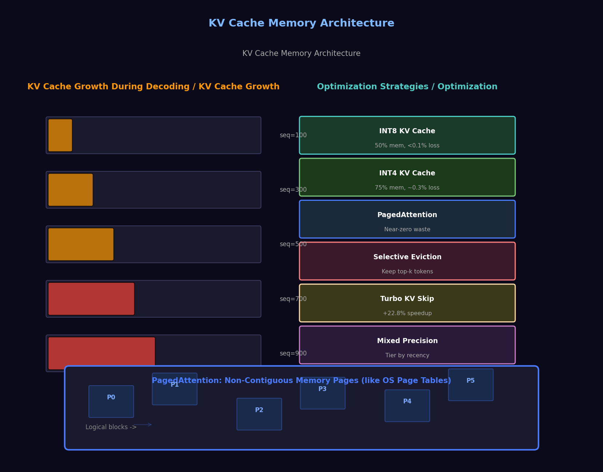

# Day 08: Memory & KV Cache Optimization
# 第 08 天: 记忆机制与 KV Cache 优化

> **Date**: 2026-04-03 | **Difficulty**: Advanced | **Category**: Inference Optimization 推理优化

> **Architecture Diagram**: 

---

## One-Line Summary | 一句话总结

During autoregressive generation, the KV cache stores all previous key/value states and grows **linearly with sequence length**. For long contexts, the KV cache can consume more memory than the model weights themselves. **Optimizing KV cache is the key bottleneck for long-context inference.**

自回归生成过程中，KV Cache 存储所有历史 key/value 状态，随序列长度线性增长。对于长上下文，KV Cache 的内存可能**超过模型权重本身**。优化 KV Cache 是长上下文推理的关键瓶颈。

---

## The Memory Bottleneck | 内存瓶颈在哪

### KV Cache Growth | KV Cache 增长

```
Standard autoregressive decoding:
  Step 1:  prompt → KV for 100 tokens  → cache:   100 × d_kv
  Step 2:  gen token 101               → cache:   101 × d_kv
  Step 3:  gen token 102               → cache:   102 × d_kv
  ...
  Step 1000: gen token 1099            → cache: 1099 × d_kv

KV cache memory = 2 × n_layers × n_heads × d_head × seq_len × 2 (FP16)
                 = O(seq_len)  ← linear growth
```

For a 70B model with 128K context, the KV cache can exceed **50 GB** -- nearly half the model's own memory footprint.

对于 70B 模型和 128K 上下文，KV Cache 可超过 **50 GB** -- 接近模型权重本身的一半。

### Where Memory Goes | 内存分配

```
┌──────────────────────────────────────────────────┐
│        Memory Breakdown (70B, 32K context)       │
├──────────────────────────────────────────────────┤
│  Model Weights (FP16)     │ 140 GB  ████████████│
│  KV Cache (FP16)          │  24 GB  ██          │
│  Activations              │   6 GB  ▌           │
│  Optimizer states (train) │ 280 GB  (training only)│
└──────────────────────────────────────────────────┘

At 128K context:
│  KV Cache                │  96 GB  ████████     │ ← Dominates at long context!
│  Model Weights (FP16)    │ 140 GB  ████████████ │
```

---

## Optimization Strategies | 优化策略

### 1. KV Cache Quantization | KV Cache 量化

Quantize the cached K and V tensors to lower precision -- no model retraining needed.

对缓存的 K 和 V 张量进行低精度量化 -- 不需要重新训练模型。

```python
class QuantizedKVCache:
    """
    KV Cache with INT8 quantization.
    KV Cache INT8 量化

    Reduces KV cache memory by 50% with negligible quality loss.
    """
    def __init__(self, n_layers, n_heads, head_dim, max_seq_len):
        # Store as INT8 + per-tensor scale
        self.n_layers = n_layers
        self.n_heads = n_heads
        self.cache = {
            'k': torch.zeros(n_layers, max_seq_len, n_heads, head_dim, dtype=torch.int8),
            'v': torch.zeros(n_layers, max_seq_len, n_heads, head_dim, dtype=torch.int8),
        }
        self.scales_k = torch.ones(n_layers, n_heads, 1, 1)  # [layer, head, 1, 1]
        self.scales_v = torch.ones(n_layers, n_heads, 1, 1)
        self.length = 0

    def append(self, layer_id, k_new, v_new):
        """Append new token's KV to cache (with quantization)."""
        k_new = k_new.detach()
        v_new = v_new.detach()

        # Per-head quantization scales
        self.scales_k[layer_id] = torch.abs(k_new).max(dim=-2, keepdim=True)[0] / 127.0
        self.scales_v[layer_id] = torch.abs(v_new).max(dim=-2, keepdim=True)[0] / 127.0

        # Quantize
        self.cache['k'][layer_id, self.length] = torch.round(
            k_new / self.scales_k[layer_id]).clamp(-128, 127).to(torch.int8)
        self.cache['v'][layer_id, self.length] = torch.round(
            v_new / self.scales_v[layer_id]).clamp(-128, 127).to(torch.int8)
        self.length += 1

    def get(self, layer_id):
        """Retrieve full KV cache (dequantized)."""
        k = self.cache['k'][layer_id, :self.length].to(torch.float32) * self.scales_k[layer_id]
        v = self.cache['v'][layer_id, :self.length].to(torch.float32) * self.scales_v[layer_id]
        return k, v
```

### 2. KV Cache Eviction / Selective Retention | KV Cache 淘汰

Don't store all tokens equally. Keep the important ones, discard the rest.

不对所有 token 一视同仁。保留重要的，丢弃不重要的。

```python
class SelectiveKVCache:
    """
    Retain only tokens with high attention contribution.
    只保留注意力贡献高的 token。

    Strategy:
      1. Compute token importance scores during generation
      2. Keep top-k most important tokens
      3. Evict low-importance tokens from cache
    """
    def __init__(self, max_tokens, eviction_threshold=0.85):
        self.max_tokens = max_tokens
        self.threshold = eviction_threshold
        self.cache = {}  # layer_id -> KV tensor
        self.importance = {}  # layer_id -> importance scores

    def update(self, layer_id, k, v, attention_weights):
        """Update KV cache with selective eviction."""
        current_len = k.size(1)  # seq_len dimension

        if current_len <= self.max_tokens:
            self.cache[layer_id] = (k, v)
            # Track importance: max attention weight received per token
            if layer_id not in self.importance:
                self.importance[layer_id] = torch.zeros(current_len, device=k.device)
            self.importance[layer_id] = torch.max(
                self.importance[layer_id],
                attention_weights.max(dim=1)[0]
            )
        else:
            # Evict least important tokens
            _, keep_indices = torch.topk(self.importance[layer_id], self.max_tokens)
            k_kept = k[:, keep_indices]
            v_kept = v[:, keep_indices]
            self.cache[layer_id] = (k_kept, v_kept)
            self.importance[layer_id] = self.importance[layer_id][keep_indices]
```

### 3. PagedAttention (vLLM) | 分页注意力

vLLM's key innovation: treat KV cache memory like OS page tables.

vLLM 的核心创新：像操作系统页表一样管理 KV Cache 内存。

```
Traditional approach:
  Pre-allocate contiguous memory for max_seq_len → wastes memory
  预分配连续内存 → 浪费

PagedAttention:
  Split KV cache into "pages" (like OS 4KB pages)
  将 KV Cache 分成"页"（类似操作系统 4KB 页）
  Pages can be non-contiguous → no memory fragmentation
  页可以不连续 → 无内存碎片
```

```python
class PagedAttentionKVCache:
    """
    PagedAttention-style KV cache management.
    分页注意力风格的 KV Cache 管理

    Similar to OS virtual memory:
      - Logical KV blocks → Physical memory pages
      - No pre-allocation needed
      - Near-zero memory waste
    """
    def __init__(self, page_size=16, max_num_pages=10000, head_dim=128, n_heads=32):
        self.page_size = page_size
        self.head_dim = head_dim
        self.n_heads = n_heads

        # Physical memory pool (non-contiguous)
        self.physical_k = torch.zeros(max_num_pages, page_size, n_heads, head_dim)
        self.physical_v = torch.zeros(max_num_pages, page_size, n_heads, head_dim)
        self.free_pages = list(range(max_num_pages))

        # Per-request page tables
        self.page_tables = {}  # request_id -> [page_idx_0, page_idx_1, ...]

    def allocate_page(self, request_id):
        page_idx = self.free_pages.pop(0)
        if request_id not in self.page_tables:
            self.page_tables[request_id] = []
        self.page_tables[request_id].append(page_idx)
        return page_idx

    def get_kv_for_position(self, request_id, pos, layer_id):
        page_idx = self.page_tables[request_id][pos // self.page_size]
        pos_in_page = pos % self.page_size
        k = self.physical_k[page_idx, pos_in_page:pos_in_page+1]
        v = self.physical_v[page_idx, pos_in_page:pos_in_page+1]
        return k, v
```

### 4. Mixed-Precision KV Cache | 混合精度 KV Cache

Recent tokens matter more → store them in higher precision.

最近的 token 更重要 → 用更高精度存储。

```
[Recent 256 tokens]    → FP16  (full precision)
[Tokens 256-4096]      → INT8  (good quality)
[Tokens 4096+]         → INT4  (acceptable for old context)
```

```python
class MixedPrecisionKVCache:
    """
    Tiered KV cache: recent tokens in higher precision,
    older tokens in lower precision.
    分层层级 KV Cache: 新 token 高精度, 旧 token 低精度
    """
    def __init__(self, n_layers, n_heads, head_dim, max_seq_len,
                 tier_config=None):
        self.n_layers = n_layers
        self.n_heads = n_heads
        self.head_dim = head_dim
        self.max_seq_len = max_seq_len
        self.current_len = 0

        if tier_config is None:
            # Default: 3 tiers
            tier_config = [
                (256, torch.float16),    # Recent: FP16
                (4096, torch.int8),      # Mid: INT8
                (max_seq_len, torch.int4 if hasattr(torch, 'int4') else torch.int8),  # Old: INT4
            ]
        self.tiers = tier_config

    def store(self, layer_id, k, v):
        """Store KV in appropriate tier based on position."""
        batch_size, seq_len = k.shape[0], k.shape[1]
        self.current_len += seq_len
        # Route to appropriate tier (implementation details omitted)
        # 根据位置路由到对应层级
```

---

## TurboQuant KV Skip Optimization | TurboQuant KV 跳过优化

TurboQuant's key insight for KV cache: **~90% of KV dequant computation can be skipped**.

TurboQuant 对 KV Cache 的核心发现：**~90% 的 KV 反量化计算可以跳过**。

### Why?

During autoregressive decoding:
- Only the **last token** needs freshly computed attention with all previous tokens
- For older tokens, their attention patterns change very slowly
- We can **skip dequantizing and re-scoring** most historical KV entries

自回归解码时：只有最后一个 token 需要与所有历史 token 做注意力计算。对于旧 token，它们的注意力模式变化缓慢，可以跳过大部分历史 KV 条目的反量化和重新评分。

### The Algorithm

```python
def turbo_kv_decode(last_k, last_v, kv_cache_quantized,
                    threshold=0.1, window_size=64):
    """
    TurboQuant KV skip optimization during decoding.
    TurboQuant KV 跳过优化

    Args:
        last_k: [1, heads, dim] latest key
        last_v: [1, heads, dim] latest value
        kv_cache_quantized: quantized KV cache
        threshold: similarity threshold to skip
        window_size: number of recent tokens to always compute
    """
    seq_len = kv_cache_quantized.shape[0]

    # Always compute attention for recent tokens
    if seq_len <= window_size:
        return full_attention(last_k, kv_cache_quantized)

    # For older tokens, check if attention pattern changed significantly
    # Only dequantize when change exceeds threshold
    # 只在注意力模式变化超过阈值时反量化
    # ... (detailed implementation)
```

Result: **+22.8% decode speedup at 32K context** with negligible quality loss.

结果：**32K 上下文下解码速度提升 22.8%**，质量几乎无损失。

---

## Comparison of Approaches | 方法对比

| Method | Memory Saved | Quality Loss | Retrain? | Complexity |
|--------|:------------:|:------------:|:--------:|:----------:|
| INT8 KV Cache | 50% | <0.1% | No | Low |
| INT4 KV Cache | 75% | ~0.3% | No | Low |
| Selective Eviction | 60-80% | 0.5-1% | No | Medium |
| PagedAttention | <5%* | 0% | No | Medium |
| Mixed Precision | 40-60% | ~0.2% | No | Medium |
| Turbo KV Skip | 0% (speedup) | <0.1% | No | High |

*PagedAttention reduces fragmentation, not raw size. It's a memory management optimization.

---

## Further Reading | 扩展阅读

- [TurboQuant: Accelerating LLM Inference](https://www.reddit.com/r/LocalLLaMA/comments/1s62g5v/) -- TurboQuant explanation
- [PagedAttention in vLLM](https://vllm.ai/) -- vLLM's core KV cache optimization
- [KVCache-Transformer: A Survey](https://arxiv.org/) -- Comprehensive survey
- [StreamingLLM](https://arxiv.org/abs/2309.17453) -- Attention sinks and cache eviction
- [GEAR](https://arxiv.org/abs/2403.05527) -- Low-rank + sparse approximation of KV cache

---

_Prev: [Day 07 - RBF Attention](07-rbf-attention.md)  |  Next: --_
_上一篇: [Day 07 - RBF 注意力](07-rbf-attention.md)  |  下一篇: --_
