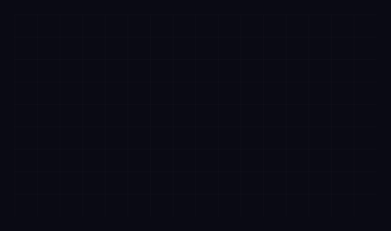
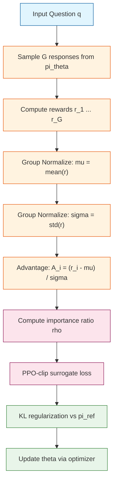

# Day 01: GRPO -- Group Relative Policy Optimization

---

## Quick Reference

**Core formula:**

$$A_i = \frac{r_i - \mu}{\sigma}, \quad \mu = \frac{1}{G}\sum_{j=1}^{G} r_j, \quad \sigma = \sqrt{\frac{1}{G}\sum_{j=1}^{G}(r_j - \mu)^2}$$

**One-liner (PyTorch):**

```python
advantages = (rewards - rewards.mean()) / (rewards.std() + 1e-8)
```

---

## One-Line Summary

GRPO eliminates the need for a Value Network (Critic) in PPO by generating multiple responses to the same input and using their relative group ranking as advantage estimates. It is the core training algorithm used in DeepSeek-R1.

---

## Why This Matters

Standard Proximal Policy Optimization (PPO) requires training two networks of equal size: an Actor and a Critic. In the era of 70B+ parameter language models, maintaining a Critic of the same size as the Actor doubles GPU memory usage and introduces an additional source of training instability.

GRPO replaces the learned Critic with a sampled baseline computed from a group of responses. This cuts memory usage nearly in half and removes an entire auxiliary training loop.

| Dimension | PPO | GRPO |
|---|---|---|
| Critic Network | Required (same size as Actor) | Not needed |
| Advantage Source | Critic value function V(s) | Group ranking with mean/std normalization |
| Memory Footprint | ~2x Actor model | ~1.2x Actor model |
| Training Stability | Sensitive to Critic accuracy | More stable, no auxiliary network |
| Best Use Case | General RL tasks | Verifiable rewards (math, code, QA) |
| Baseline | Learned V(s) | Group mean |
| Signal Normalization | Fixed or learned | Auto-scaling via group std |

---

## Architecture



The key insight is captured in node F: advantage estimation emerges purely from comparing responses within a group, requiring no external value network.

---

## The Math

### Advantage Estimation (Group-Relative)

Given G responses for question q, compute scalar rewards $r_1, \ldots, r_G$:

$$\mu = \frac{1}{G}\sum_{j=1}^{G} r_j$$

$$\sigma = \sqrt{\frac{1}{G}\sum_{j=1}^{G}(r_j - \mu)^2} + \epsilon$$

$$A_i = \frac{r_i - \mu}{\sigma}$$

The group mean $\mu$ replaces the Critic's baseline $V(s)$. The group standard deviation $\sigma$ normalizes the advantage signal: it amplifies gradients when responses differ widely, and dampens them when responses are similar. The small $\epsilon$ prevents division by zero.

### Policy Objective with PPO Clipping

The importance sampling ratio compares the current and old policy:

$$\rho_i(\theta) = \frac{\pi_\theta(o_i \mid q)}{\pi_{\theta_{\text{old}}}(o_i \mid q)}$$

The full GRPO loss combines the clipped surrogate objective with KL regularization:

$${\cal L}_{\text{GRPO}}(\theta) = \mathbb{E}\Big[\min\big(\rho_i(\theta) \cdot A_i,\ \text{clip}(\rho_i(\theta), 1 - \epsilon, 1 + \epsilon) \cdot A_i\big)\Big] - \beta \cdot D_{\text{KL}}(\pi_\theta \parallel \pi_{\text{ref}})$$

Where:

- $A_i$ is the group-normalized advantage for response $i$
- $\epsilon$ is the PPO clip parameter (typically 0.2)
- $\beta$ is the KL penalty coefficient
- $D_{\text{KL}}$ is the KL divergence between current and reference policy

---

## Code Implementation

```python
import torch
import torch.nn.functional as F


def group_normalize(rewards: torch.Tensor, eps: float = 1e-8) -> torch.Tensor:
    """Compute group-normalized advantages without a critic network.

    For each group of responses, subtract the group mean and divide
    by the group standard deviation to obtain advantage estimates.

    Args:
        rewards: Shape (G,) scalar reward for each response in the group.
        eps: Small constant to prevent division by zero.

    Returns:
        advantages: Shape (G,) normalized advantage for each response.
    """
    mean = rewards.mean(dim=0)
    std = rewards.std(dim=0) + eps
    advantages = (rewards - mean) / std
    return advantages


def ppo_clipped_loss(
    policy_log_probs: torch.Tensor,
    old_log_probs: torch.Tensor,
    advantages: torch.Tensor,
    epsilon: float = 0.2,
) -> torch.Tensor:
    """Compute the PPO-clip surrogate loss.

    Clamps the importance ratio to prevent excessively large policy updates.

    Args:
        policy_log_probs: Shape (G,) log-probability under current policy.
        old_log_probs: Shape (G,) log-probability under old policy.
        advantages: Shape (G,) group-normalized advantages.
        epsilon: Clip threshold (default 0.2).

    Returns:
        loss_scalar: Mean clipped loss (to be maximized before negation).
    """
    ratio = torch.exp(policy_log_probs - old_log_probs)
    clipped_ratio = torch.clamp(ratio, 1.0 - epsilon, 1.0 + epsilon)

    surrogate_unclipped = ratio * advantages
    surrogate_clipped = clipped_ratio * advantages

    # Take the minimum for a conservative update
    loss = torch.min(surrogate_unclipped, surrogate_clipped)
    return loss.mean()


def kl_penalty(
    policy_logits: torch.Tensor,
    ref_logits: torch.Tensor,
) -> torch.Tensor:
    """Compute KL divergence between current policy and reference policy.

    This penalty prevents the policy from drifting too far from the
    original supervised-fine-tuned model.

    Args:
        policy_logits: Shape (G, vocab_size) current model logits.
        ref_logits: Shape (G, vocab_size) reference model logits.

    Returns:
        kl_loss: Scalar KL divergence value.
    """
    log_policy = F.log_softmax(policy_logits, dim=-1)
    log_ref = F.log_softmax(ref_logits, dim=-1)
    kl = F.kl_div(log_ref, log_policy, reduction="batchmean", log_target=True)
    return kl


def grpo_loss(
    policy_logits: torch.Tensor,
    old_logits: torch.Tensor,
    rewards: torch.Tensor,
    beta: float,
    ref_logits: torch.Tensor | None = None,
    epsilon: float = 0.2,
) -> torch.Tensor:
    """Full GRPO loss combining group normalization, PPO clipping, and KL.

    Args:
        policy_logits: Shape (G, vocab_size) current policy logits.
        old_logits: Shape (G, vocab_size) logits from when samples were drawn.
        rewards: Shape (G,) scalar reward per response.
        beta: KL penalty coefficient.
        ref_logits: Shape (G, vocab_size) reference policy logits (optional).
        epsilon: PPO clip parameter (default 0.2).

    Returns:
        loss: Scalar loss (negated for standard minimization).
    """
    # Step 1: Compute log-probabilities under current and old policy
    policy_log_probs = F.log_softmax(policy_logits, dim=-1).sum(dim=-1)
    old_log_probs = F.log_softmax(old_logits, dim=-1).sum(dim=-1)

    # Step 2: Group-normalized advantage (no critic needed!)
    advantages = group_normalize(rewards)

    # Step 3: PPO-clip objective
    clip_objective = ppo_clipped_loss(
        policy_log_probs, old_log_probs, advantages, epsilon
    )

    # Step 4: KL regularization (optional but recommended)
    kl = torch.tensor(0.0, device=policy_logits.device)
    if ref_logits is not None:
        kl = kl_penalty(policy_logits, ref_logits)

    # Step 5: Combine objectives (negate for standard minimization)
    total_loss = -(clip_objective - beta * kl)
    return total_loss


if __name__ == "__main__":
    torch.manual_seed(42)

    G = 8        # Number of responses per group
    V = 1000     # Vocabulary size (simulated)

    # Simulated dummy data
    policy_logits = torch.randn(G, V)
    old_logits = torch.randn(G, V)
    ref_logits = torch.randn(G, V)
    rewards = torch.tensor([0.9, 0.3, 0.7, 0.5, 0.1, 0.8, 0.2, 0.6])

    beta = 0.01  # KL penalty coefficient

    loss = grpo_loss(
        policy_logits=policy_logits,
        old_logits=old_logits,
        rewards=rewards,
        beta=beta,
        ref_logits=ref_logits,
        epsilon=0.2,
    )

    print(f"GRPO Loss: {loss.item():.6f}")

    # Gradient verification: backward pass works
    loss.backward()
    print("Backward pass successful -- implementation is differentiable.")
```

---

## Deep Dive

### 1. Why Does Group-Normalized Advantage Work?

GRPO replaces the learned value function $V(s)$ with a sampled baseline (the group mean). This is theoretically sound for two reasons.

First, the group mean $\mu$ is an **unbiased estimator** of the expected reward under the current policy. In classical policy gradient theory, any baseline $b$ subtracted from the reward does not introduce bias as long as $b$ does not depend on the action. Since $\mu$ is computed from the entire group before assigning advantages, it satisfies this condition.

Second, dividing by the group standard deviation $\sigma$ provides **automatic reward scaling**. Early in training, diverse responses produce widely varying rewards and large $\sigma$, which dampens advantages and prevents unstable gradient steps. As training progresses, responses converge, $\sigma$ shrinks, and advantages grow to provide finer-grained signal.

| Response quality in group | sigma value | Effect on advantage |
|---|---|---|
| All responses similar | Small sigma | Large advantages, strong signal |
| Responses very different | Large sigma | Dampened advantages, cautious update |
| All equally poor | Low mu, small sigma | Strong push away from bad responses |
| All equally excellent | High mu, small sigma | Strong push toward good responses |

### 2. Limitations and Edge Cases

GRPO is elegant but has known failure modes that practitioners must understand.

**Zero-sum within group.** GRPO's advantage estimate is relative, not absolute. If all G responses are terrible, their advantages still sum to zero. The best response among poor options still gets positive advantage and is reinforced despite being objectively bad. Solutions include incorporating an absolute reward threshold or mixing in supervised fine-tuning data.

**Reward noise sensitivity.** If the reward model is noisy, the ranking within a group may be unreliable. When the reward difference between two responses is smaller than the reward noise, GRPO may push the policy in the wrong direction. Using a larger group size G helps average out noise in the mean but does not fix pairwise ranking errors.

| Limitation | Root cause | Mitigation strategy |
|---|---|---|
| Relative-only advantages | Mean-centering forces zero sum | Mix in absolute reward thresholds |
| Noisy reward ranking | Imperfect reward model | Increase group size G |
| Multi-step environments | No temporal advantage propagation | Use GAE or critic for sequential RL |
| Small group variance | All responses nearly identical | Add temperature noise during sampling |

### 3. DeepSeek-R1's Innovations on Top of GRPO

DeepSeek-R1 applied GRPO at unprecedented scale and introduced several practical enhancements.

**Rule-based verifiable rewards.** Instead of relying solely on a learned reward model, DeepSeek-R1 used deterministic reward signals for math and code problems. Does the code compile? Does it pass the unit test? Does the math answer match ground truth? This eliminates reward model bias entirely for these domains.

**Format-based rewards.** The reward also checked structural properties of the reasoning trace. Does the response include a clear thought section followed by a final answer? Is the reasoning well-organized? This encourages the emergence of reasoning capabilities without explicit chain-of-thought supervision.

| DeepSeek-R1 Innovation | Purpose | Effect |
|---|---|---|
| Rule-based rewards | Remove reward model bias | Deterministic, reliable training signal |
| Format rewards | Encourage reasoning structure | Emergent chain-of-thought behavior |
| SFT warm-start | Stabilize early training | Smoother transition to pure GRPO |
| Large group size (G >= 16) | More reliable statistics | Better mean and variance estimates |

---

## Common Misconceptions

- **GRPO removes all critic-like computation.** It removes the *learned* critic network, but the group mean and standard deviation still serve as an implicit critic. The computation of mu and sigma acts as a data-driven baseline.

- **GRPO always outperforms PPO.** GRPO excels at tasks with verifiable, discrete rewards (math, code). For continuous control or sequential decision-making, PPO with a proper value function and GAE is still superior.

- **Larger groups are always better.** While larger G gives more reliable statistics, it also increases GPU memory and compute per training step. There is a practical trade-off, and DeepSeek-R1 used G = 16 as a sweet spot.

- **The KL penalty is optional in practice.** For small models or few training steps, omitting KL may seem to work. But for large-scale training, without KL regularization the policy can drift into degenerate outputs that maximize reward through loopholes rather than genuine quality improvements.

---

## Exercises

### Exercise 1: Implement the Advantage Computation

Write a function that computes group-normalized advantages for *multiple* questions at once, where rewards have shape `(num_questions, G)`.

<details>
<summary>Click to reveal the answer</summary>

```python
def multi_group_normalize(rewards: torch.Tensor, eps: float = 1e-8) -> torch.Tensor:
    """Compute advantages for multiple questions simultaneously.

    Args:
        rewards: Shape (num_questions, G).
        eps: Small constant.

    Returns:
        advantages: Shape (num_questions, G).
    """
    mean = rewards.mean(dim=-1, keepdim=True)
    std = rewards.std(dim=-1, keepdim=True) + eps
    return (rewards - mean) / std
```

</details>

### Exercise 2: Why Does Dividing by Sigma Help?

Suppose during early training, rewards for a group of 4 responses are `[0.1, 0.9, 0.2, 0.8]`. Later, after the policy improves, rewards are `[0.85, 0.95, 0.88, 0.92]`. Compute the advantages in both cases and explain how sigma provides different learning signals.

<details>
<summary>Click to reveal the answer</summary>

Early group (rewards vary widely):
- mu = 0.50, sigma = 0.374
- Advantages: `[-1.07, 1.07, -0.80, 0.80]`

Late group (rewards are similar and high):
- mu = 0.90, sigma = 0.041
- Advantages: `[-1.22, 1.22, -0.49, 0.49]`

In the late group, even small quality differences produce large advantages because sigma is small. This means the policy receives strong gradient signal to differentiate between subtly different response qualities once it has already reached a high performance level.

</details>

### Exercise 3: What Breaks If All Rewards Are Identical?

If all G responses receive exactly the same reward, what happens to the advantage estimates? Propose one fix.

<details>
<summary>Click to reveal the answer</summary>

When all rewards are identical (r_i = r for all i), we get mu = r and sigma = epsilon (nearly zero). The advantages become $(r - r) / \epsilon = 0 / \epsilon = 0$ for every response. All gradient signal vanishes.

**Fix 1:** Add a minimum sigma floor (e.g., `sigma = max(rewards.std() + eps, 0.01)`). This ensures advantages remain zero but prevents numerical instability.

**Fix 2:** Fall back to a learned value function baseline when group variance falls below a threshold.

**Fix 3:** Add reward noise during sampling to ensure diversity.

</details>

---

## Real Papers and References

- **DeepSeek-R1: Incentivizing Reasoning Capability in LLMs via Reinforcement Learning** -- https://arxiv.org/abs/2501.12948
- **DeepSeekMath: Pushing the Limits of Mathematical Reasoning** -- https://arxiv.org/abs/2402.03300
- **Proximal Policy Optimization Algorithms** -- https://arxiv.org/abs/1707.06347
- **High-Resolution Large Language Model Alignment** -- https://arxiv.org/abs/2304.06767 (DAPO, an improved GRPO variant)

---

## Further Reading

- **Generalized Advantage Estimation (GAE)** -- https://arxiv.org/abs/1506.02438
- **PPO-Clip: The Surrogate Objective Explained** -- OpenAI Spinning Up documentation
- **RLHF: Training Language Models with Human Feedback** -- https://arxiv.org/abs/2203.02155

---

_Prev: None  |  Next: [Day 02 -- Mixture of Experts](02-mixture-of-experts.md)_
