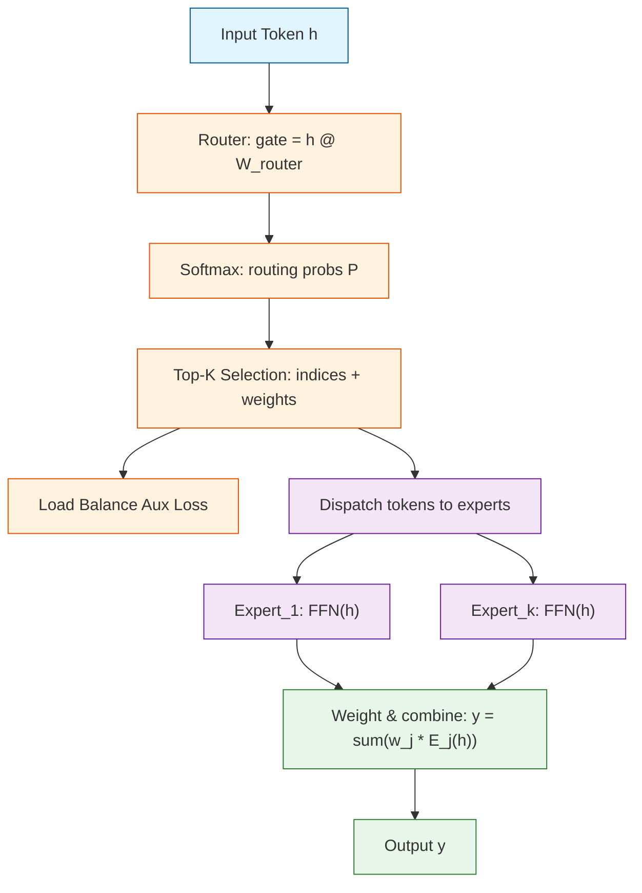

<video src="https://playitcooool.github.io/advanced-ai-daily/videos/02-moe.webm" autoplay loop muted playsinline width="800"></video>


# Day 02: Mixture of Experts (MoE)

---

## Quick Reference

**Core formula:**

$$y = \sum_{j=1}^{k} w_j \cdot \text{Expert}_{e_j}(h), \quad w_j = \frac{\text{softmax}(g)_j}{\sum_{m=1}^{k} \text{softmax}(g)_{e_m}}$$

**One-liner (PyTorch routing):**

```python
top_k_weights, top_k_indices = torch.topk(softmax(router(h)), k=2, dim=-1)
```

---

## One-Line Summary

Mixture of Experts replaces every feed-forward network layer with a pool of K independent expert networks and a trainable Router that selects only the top-k experts per token, enabling models to scale to trillions of parameters while keeping per-token computation constant and roughly equal to a dense model.

---

## Why This Matters

Traditional dense transformers scale both parameter count and per-token compute together: doubling parameters means doubling multiply-accumulate operations for every token. A 300-billion-parameter dense model requires 300 billion FLOPs per token per layer, which is prohibitively expensive for training and inference.

MoE decouples these two scales. You can store hundreds of billions of parameters across many experts, but each token only activates a small fraction of them. This gives you the representational capacity of a giant model with the compute cost of a much smaller one.

| Dimension | Dense Transformer | MoE Transformer |
|---|---|---|
| Parameters per layer | d_model x d_ff | N x d_model x d_ff (N experts) |
| Active params per token | d_model x d_ff | k x d_model x d_ff (k experts) |
| Total parameters | Scales linearly with model size | Scales with N (number of experts) |
| FLOPs per token | Fixed, proportional to all params | k/N of total parameters |
| Memory footprint | Proportional to active params | Proportional to total params |
| Training stability | Well-understood | Sensitive to routing collapse |
| Distributed training | Standard all-reduce | Expert parallelism + all-to-all |
| Real-world examples | LLaMA 3, Mistral 7B | Mixtral 8x7B, DeepSeek-V3 |

---

## Architecture



Each token follows a sparse path: the router selects only K out of N experts. The load balance auxiliary loss (node E) prevents routing collapse by encouraging uniform token distribution.

---

## The Math

### Router and Top-K Selection

For each input token $h$, the router computes selection scores across all $N$ experts:

$$\text{gate\_logits} = h \cdot W_{\text{router}}$$

where $W_{\text{router}}$ has shape $(d_{\text{model}}, N)$. The routing probabilities are obtained via softmax:

$$P = \text{softmax}\left(\frac{\text{gate\_logits}}{\tau}\right)$$

Top-K selection picks the $k$ highest-probability experts and re-normalizes:

$$T = \text{top-k}(P) = \{e_1, e_2, \ldots, e_k\}$$

$$w_j = \frac{P_{e_j}}{\sum_{m=1}^{k} P_{e_m}}$$

The temperature parameter $\tau$ controls routing sharpness. Lower temperature gives confident routing (one expert dominates). Higher temperature gives softer routing (multiple experts contribute more evenly).

### Expert Output Computation

The final output is the weighted sum of selected expert outputs:

$$y = \sum_{j=1}^{k} w_j \cdot \text{Expert}_{e_j}(h)$$

Each expert is a standard feed-forward network:

$$\text{Expert}_i(h) = \text{ReLU}(h \cdot W_{\text{gate}}^{(i)} + b_{\text{gate}}^{(i)}) \cdot W_{\text{down}}^{(i)}$$

Total forward FLOPs per token is approximately $k \cdot (2 \cdot d_{\text{model}} \cdot d_{\text{ff}})$, not $N \cdot d_{\text{ff}}$.

### Load Balancing Auxiliary Loss

Without an explicit load balance loss, routing tends to degenerate: a few popular experts receive most tokens while others remain underutilized. The auxiliary loss prevents this collapse:

$$f_i = \frac{\text{count of tokens routed to expert } i}{\text{total tokens}}$$

$$P_i = \text{mean routing probability for expert } i$$

$${\cal L}_{\text{aux}} = \alpha \cdot N \cdot \sum_{i=1}^{N} f_i \cdot P_i$$

where $\alpha$ is a weighting coefficient (typically 0.01). The loss is minimized when both $f_i$ and $P_i$ are uniform at $1/N$.

---

## Code Implementation

```python
import torch
import torch.nn as nn
import torch.nn.functional as F


class Expert(nn.Module):
    """A single expert network -- a standard gated feed-forward block.

    In practice, experts are typically SwiGLU or gated ReLU FFNs
    identical to those used in dense transformers.
    """

    def __init__(self, d_model: int, d_ff: int):
        super().__init__()
        self.w_gate = nn.Linear(d_model, d_ff, bias=False)
        self.w_down = nn.Linear(d_ff, d_model, bias=False)

    def forward(self, x: torch.Tensor) -> torch.Tensor:
        """Apply the expert FFN gate and down-projection.

        Args:
            x: Shape (batch * seq_len, d_model) input tokens.

        Returns:
            output: Shape (batch * seq_len, d_model).
        """
        return self.w_down(F.relu(self.w_gate(x)))


class MoELayer(nn.Module):
    """Mixture of Experts layer with Top-K routing and load balancing.

    This implements a simplified version of the Switch
    Transformer / Mixtral-style MoE layer.
    """

    def __init__(
        self,
        d_model: int,
        d_ff: int,
        num_experts: int,
        top_k: int = 2,
        capacity_factor: float = 1.25,
        aux_loss_weight: float = 0.01,
        noise_std: float = 0.0,
    ):
        """Initialize the MoE layer.

        Args:
            d_model: Model dimension.
            d_ff: Feed-forward hidden dimension per expert.
            num_experts: Total number of expert networks.
            top_k: Number of experts selected per token.
            capacity_factor: Expert capacity multiplier (1.0 = exact average).
            aux_loss_weight: Weight for load balancing auxiliary loss.
            noise_std: Noise standard deviation for routing (for training).
        """
        super().__init__()
        self.num_experts = num_experts
        self.top_k = top_k
        self.capacity_factor = capacity_factor
        self.aux_loss_weight = aux_loss_weight
        self.noise_std = noise_std

        # Router: linear projection to num_experts scores
        self.router = nn.Linear(d_model, num_experts, bias=False)

        # Create independent experts
        self.experts = nn.ModuleList(
            [Expert(d_model, d_ff) for _ in range(num_experts)]
        )

    def forward(
        self, x: torch.Tensor
    ) -> tuple[torch.Tensor, torch.Tensor]:
        """Forward pass through MoE layer.

        Args:
            x: Shape (batch, seq_len, d_model) input tokens.

        Returns:
            output: Shape (batch, seq_len, d_model) combined expert output.
            aux_loss: Scalar auxiliary loss for load balancing.
        """
        batch_size, seq_len, d_model = x.shape

        # Flatten to process all tokens uniformly
        flat_x = x.reshape(-1, d_model)  # (BT, d_model)

        # Step 1: Compute routing scores
        gate_logits = self.router(flat_x)  # (BT, num_experts)

        # Add noise during training for exploration
        if self.training and self.noise_std > 0:
            noise = torch.randn_like(gate_logits) * self.noise_std
            gate_logits = gate_logits + noise

        # Step 2: Routing probabilities via softmax
        routing_weights = F.softmax(gate_logits, dim=-1)  # (BT, num_experts)

        # Step 3: Load balancing auxiliary loss
        aux_loss = self.compute_auxiliary_loss(routing_weights)

        # Step 4: Top-K selection
        top_k_weights, top_k_indices = torch.topk(
            routing_weights, self.top_k, dim=-1
        )  # (BT, top_k)

        # Normalize selected weights so they sum to 1
        top_k_weights = top_k_weights / top_k_weights.sum(
            dim=-1, keepdim=True
        )

        # Step 5: Dispatch and compute
        output = torch.zeros_like(flat_x)  # (BT, d_model)

        # Process each expert separately
        for expert_idx in range(self.num_experts):
            # Find which tokens select this expert
            selected_mask = (top_k_indices == expert_idx)  # (BT, top_k)
            selected_positions = selected_mask.any(dim=-1)  # (BT,)

            if not selected_positions.any():
                continue

            # Collect tokens for this expert
            expert_input = flat_x[selected_positions]  # (n_tokens_i, d_model)

            # Collect the weights for these tokens
            expert_weights = (top_k_weights * selected_mask.float()).sum(
                dim=-1
            )  # (n_tokens_i,)

            # Compute expert output
            expert_output = self.experts[expert_idx](expert_input)

            # Weight by routing probability and scatter back
            expert_output = expert_output * expert_weights.unsqueeze(-1)
            output[selected_positions] += expert_output

        # Reshape back to original dimensions
        output = output.reshape(batch_size, seq_len, d_model)

        return output, aux_loss

    def compute_auxiliary_loss(
        self, routing_weights: torch.Tensor
    ) -> torch.Tensor:
        """Compute the load balancing auxiliary loss.

        This encourages uniform token distribution across experts
        to prevent expert collapse.

        Args:
            routing_weights: Shape (num_tokens, num_experts) routing probs.

        Returns:
            aux_loss: Scalar auxiliary loss value.
        """
        num_tokens = routing_weights.size(0)
        N = self.num_experts

        # f_i: actual fraction of tokens routed to expert i (based on top-K)
        _, top_k_indices = torch.topk(
            routing_weights, self.top_k, dim=-1
        )

        expert_counts = torch.zeros(N, device=routing_weights.device)
        for i in range(N):
            expert_counts[i] = (top_k_indices == i).float().sum()
        f = expert_counts / (num_tokens * self.top_k)

        # P_i: mean routing probability for expert i
        P = routing_weights.mean(dim=0)  # (num_experts,)

        # Loss: alpha * N * sum(f_i * P_i)
        aux_loss = self.aux_loss_weight * N * torch.sum(f * P)

        return aux_loss


class MoETransformerBlock(nn.Module):
    """Simplified transformer block with MoE FFN layer.

    Combines attention with the MoE-based FFN to form
    a complete transformer layer.
    """

    def __init__(
        self,
        d_model: int,
        n_heads: int,
        num_experts: int,
        d_ff: int,
        top_k: int = 2,
        capacity_factor: float = 1.25,
        aux_loss_weight: float = 0.01,
    ):
        super().__init__()
        self.self_attn = nn.MultiheadAttention(
            d_model, n_heads, batch_first=True
        )
        self.moe = MoELayer(
            d_model=d_model,
            d_ff=d_ff,
            num_experts=num_experts,
            top_k=top_k,
            capacity_factor=capacity_factor,
            aux_loss_weight=aux_loss_weight,
            noise_std=0.1,
        )
        self.norm1 = nn.LayerNorm(d_model)
        self.norm2 = nn.LayerNorm(d_model)

    def forward(
        self, x: torch.Tensor
    ) -> tuple[torch.Tensor, torch.Tensor]:
        """Forward pass with residual connections and layer norm.

        Returns:
            output: Shape (batch, seq_len, d_model).
            aux_loss: Scalar MoE auxiliary loss.
        """
        # Pre-LN residual attention
        attn_in = self.norm1(x)
        attn_out, _ = self.self_attn(attn_in, attn_in, attn_in)
        x = x + attn_out

        # Pre-LN residual MoE
        moe_in = self.norm2(x)
        moe_out, aux_loss = self.moe(moe_in)
        x = x + moe_out

        return x, aux_loss


if __name__ == "__main__":
    torch.manual_seed(42)

    # Small mockup configuration
    batch_size = 4
    seq_len = 32
    d_model = 256
    n_heads = 4
    num_experts = 8
    d_ff = 512
    top_k = 2

    # Create MoE transformer block
    block = MoETransformerBlock(
        d_model=d_model,
        n_heads=n_heads,
        num_experts=num_experts,
        d_ff=d_ff,
        top_k=top_k,
        capacity_factor=1.25,
        aux_loss_weight=0.01,
    )

    print(f"MoE Configuration:")
    print(f"  Num experts: {num_experts}")
    print(f"  Top-K routing: {top_k}")
    print(
        f"  Params per expert: "
        f"{sum(p.numel() for p in block.moe.experts[0].parameters())/1e6:.2f}M"
    )
    print(
        f"  Total MoE params: "
        f"{sum(p.numel() for p in block.moe.parameters())/1e6:.2f}M"
    )
    print(
        f"  Active params per token: "
        f"{sum(p.numel() for p in block.moe.experts[0].parameters())/1e6 * top_k:.2f}M"
    )
    print()

    # Random input
    x = torch.randn(batch_size, seq_len, d_model)

    print(f"Input shape: {x.shape}")

    # Forward pass
    block.train()
    output, aux_loss = block(x)

    print(f"Output shape: {output.shape}")
    print(f"Auxiliary loss (load balance): {aux_loss.item():.6f}")
    print()

    # Check that we can backprop (including aux loss)
    total_loss = output.sum() + aux_loss
    total_loss.backward()
    print("Backward pass successful -- MoE layer is fully differentiable.")

    # Demonstrate load balance: check token distribution
    expert_counts = torch.zeros(num_experts)
    with torch.no_grad():
        for _ in range(100):
            x = torch.randn(batch_size * seq_len, d_model)
            gate_logits = block.moe.router(x)
            _, indices = torch.topk(gate_logits, top_k, dim=-1)
            for e in range(num_experts):
                expert_counts[e] += (indices == e).float().sum()

    expert_counts /= expert_counts.sum()
    pct = ", ".join(f"{c:.1%}" for c in expert_counts.tolist())
    print(f"Expert utilization (100 batches): {pct}")
    print(
        f"Std deviation: {expert_counts.std().item():.4f} "
        f"(lower = better balance)"
    )
```

---

## Deep Dive

### 1. Why Doesn't Routing Collapse Always Happen?

The theoretical risk is that the optimizer discovers a lazy solution: route everything to one easy-to-train expert and stop learning. In practice, the auxiliary loss prevents this by directly penalizing non-uniform distributions.

But auxiliary loss alone is not enough. The key insight is that different experts naturally specialize on different types of tokens during training because they receive different gradient signals:

- **Math tokens** route to experts that learn arithmetic patterns.
- **Code tokens** route to experts that learn syntax structure.
- **Prose tokens** route to experts that learn language patterns.
- **Mixed tokens** route to generalist or fallback experts.

This specialization emerges naturally because the router learns to match token representations with expert capabilities, and each expert's weights are shaped by the specific subset of tokens it receives.

| Routing Outcome | Cause | Solution |
|---|---|---|
| Healthy (uniform ~12.5%) | Aux loss + noise + diverse data | None needed |
| Partial collapse (70/15/5/10) | Weak aux loss weight | Increase alpha |
| Full collapse (95/5/0/0) | No aux loss, no noise | Add both aux loss and routing noise |

### 2. Expert Parallelism in Distributed Training

When N experts cannot fit on a single GPU, MoE introduces specialized distributed training patterns. Expert Parallelism (EP) distributes different experts across different GPUs.

Tokens must be routed to the correct GPU via all-to-all communication, which becomes the primary bottleneck. DeepSeek-V3 further optimized this with DualPipe, overlapping computation and communication, and Highway Routing, allowing tokens to skip the MoE entirely when no expert is needed.

| Distributed Strategy | Communication Cost | Best For |
|---|---|---|
| Data Parallelism | All-reduce of gradients | Small models, few experts |
| Expert Parallelism | All-to-all token dispatch | Many experts, many GPUs |
| Hybrid TP + EP | Intra-node TP, inter-node EP | Large-scale production training |
| Pipeline Parallelism | Forward pass staging | Multi-node with narrow bandwidth |

### 3. MoE Variants: From Switch to DeepSeek-V3

Different MoE implementations make different engineering trade-offs.

**Switch Transformers** use Top-1 routing with a hard capacity limit. Experts can only process a fixed number of tokens per batch. Excess tokens are dropped. This simplifies distributed training but wastes computation on dropped tokens.

**Mixtral 8x7B** uses Top-2 routing with no capacity limit (capacity factor 1.0). Every selected expert processes all its assigned tokens. This avoids token dropping but requires more careful load balancing.

**DeepSeek-V3** uses 256 fine-grained experts with shared experts and multi-token prediction. Shared experts are activated for ALL tokens in addition to the top-k routed experts, capturing general-purpose patterns.

| Variant | Num Experts | Top-K | Capacity Limit | Notable Feature |
|---|---|---|---|---|
| Switch Transformer | Up to 2048 | 1 | Hard cap, token dropping | Pioneering sparse MoE |
| Mixtral 8x7B | 8 | 2 | None (1.0) | Open-source, battle-tested |
| DeepSeek-V3 | 256 | 6-8 | Fine-grained experts | Shared experts + highway routing |
| GShard | Up to 128 | 2 | Adaptive capacity | Google-scale MoE |

---

## Common Misconceptions

- **MoE is always faster than dense models.** While MoE uses fewer FLOPs per token, it requires loading all expert weights from memory. On a single GPU, MoE inference can be slower due to memory bandwidth constraints. The benefit is in representational capacity at constant compute cost, not raw speed.

- **More experts always means better quality.** Adding experts increases the parameter budget but also makes routing harder. If experts are too small (under-parameterized) or routing is too diffuse, quality can actually degrade. Mixtral found that 8 experts with top-2 was optimal for their 47B-parameter budget.

- **Expert parallelism means experts train independently.** Experts do receive different tokens, but the router gradient depends on all expert outputs. The router must learn to assign tokens appropriately, which requires gradients that flow through the selected experts. Training is not independent.

- **Token dropping is rare and can be ignored.** During training with unbalanced routing, token dropping rates of 10-30% are common if capacity factor is set too low. This directly impacts training quality. Always monitor drop rates and set capacity factors conservatively (1.25+).

---

## Exercises

### Exercise 1: Calculate FLOPs Savings

A dense transformer has d_model = 4096, d_ff = 14336. An MoE variant has the same d_model and d_ff per expert but with 8 experts and top-2 routing. Calculate the FLOPs ratio between MoE and dense for one FFN forward pass.

<details>
<summary>Click to reveal the answer</summary>

Dense FFN FLOPs per token: approximately 2 x d_model x d_ff = 2 x 4096 x 14336 = 117,436,928 FLOPs.

MoE FFN FLOPs per token: approximately 2 x k x d_model x d_ff = 2 x 2 x 4096 x 14336 = 117,436,928 FLOPs.

Wait -- the FLOPs per token are actually the SAME because we activate 2 experts of the same size as the single dense FFN. The key insight is that MoE's total parameters are 8x larger (8 x 4096 x 14336 = 939,524,096) but we still only compute 2/8 of them per token. So MoE gets 8x the parameter capacity at the same per-token compute cost.

</details>

### Exercise 2: Implement Noise Routing

Modify the MoE forward method to add Gumbel noise instead of Gaussian noise before the Top-K selection. Gumbel noise is computed as: `-log(-log(uniform(0, 1)))`.

<details>
<summary>Click to reveal the answer</summary>

```python
# Replace Gaussian noise with Gumbel noise
gumbel_noise = -torch.log(-torch.log(torch.rand_like(gate_logits) + 1e-20) + 1e-20)
gate_logits = gate_logits + noise_scale * gumbel_noise
routing_weights = F.softmax(gate_logits / temperature, dim=-1)
```

Gumbel noise is preferred for discrete selection tasks because it provides a smoother approximation of categorical sampling, making the gradient flow more stable during training.

</details>

### Exercise 3: What Happens with top_k = num_experts?

If you set top_k equal to the total number of experts, what MoE behavior do you observe? Why would this be useful?

<details>
<summary>Click to reveal the answer</summary>

When top_k = num_experts, ALL experts are activated for EVERY token. This makes the MoE layer equivalent to a dense FFN with N copies of the FFN summed with their softmax weights. The total FLOPs become Nx the single-expert cost.

This is primarily useful for:
1. **Baseline comparison**: Train a dense version to compare quality at full compute budget.
2. **High-resource inference**: When compute is not a constraint, activating all experts maximizes quality.
3. **Architecture validation**: Verify that the expert pool is diverse enough by checking if all-experts-activated improves over top-k.

</details>

---

## Real Papers and References

- **Switch Transformers: Scaling to Trillion Parameter Models** -- https://arxiv.org/abs/2101.03961
- **Mixtral of Experts** -- https://arxiv.org/abs/2401.04088
- **GShard: Scaling Giant Models with Conditional Computation** -- https://arxiv.org/abs/2006.16668
- **Outrageously Large Neural Networks** -- https://arxiv.org/abs/1701.06538 (original MoE concept)

---

## Further Reading

- **DeepSeek-V3 Technical Report** -- https://arxiv.org/abs/2412.19437
- **Sparse Mixture of Experts: A Survey** -- https://arxiv.org/abs/2209.00085
- **StableMoe: Stable Routing Strategy for MoE Architectures** -- https://arxiv.org/abs/2209.03852

---

_Prev: [Day 01 -- GRPO](01-grpo.md)  |  Next: [Day 03 -- Speculative Decoding](03-speculative-decoding.md)_
