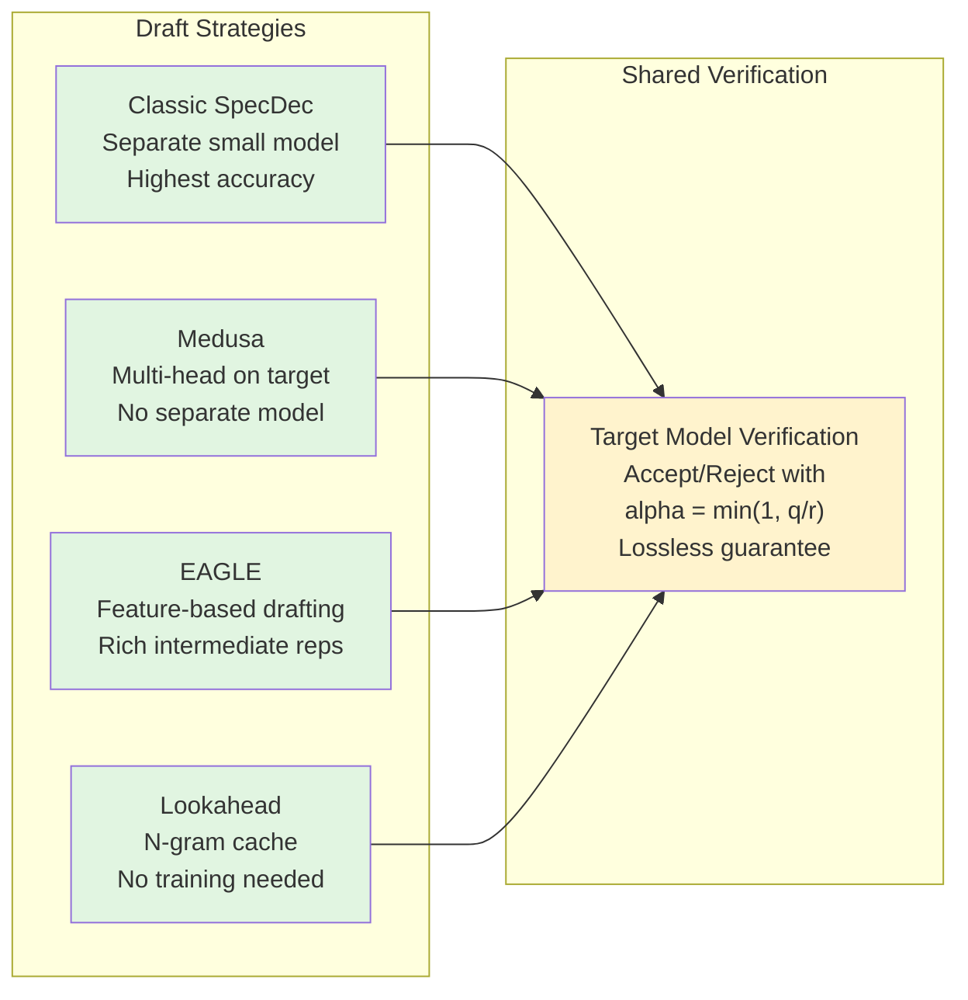

# Day 03: Speculative Decoding -- Lossless Inference Speedup

> **Watch the animation**: 

## Quick Reference

| Term | Definition |
|---|---|
| Draft Model | Small model (3-10x faster) that generates K candidate tokens autoregressively |
| Target Model | Large model that verifies all K candidates in a single forward pass |
| Acceptance Rate (alpha) | alpha_i = min(1, q_i / r_i) probability of accepting draft token i |
| K | Number of draft tokens generated per round |
| Residual Distribution | max(0, q - r) / Z -- sampled when a draft token is rejected to preserve exact distribution |

## One-Line Summary

Speculative decoding uses a small draft model to predict K candidate tokens in parallel, then uses the large target model to verify all K tokens in a single forward pass, accepting each token with probability mathematically guaranteed identical to sampling directly from the target model.

## Why This Matters

Autoregressive language models are fundamentally **memory-bandwidth bound**, not compute-bound. Streaming weights from GPU memory dominates latency; the actual matrix multiplication on one token's hidden state is tiny. Speculative decoding amortizes the expensive target-model weight stream across multiple tokens by letting a cheap draft model guess what's next and having the target model check all guesses at once. This yields **2x to 4x throughput improvement with zero quality loss**, because the output distribution is mathematically proven to match the target model exactly.

## Architecture

```mermaid
flowchart TD
    Context["Current Context\nx_1 ... x_t"] --> DraftGen["Draft Model\nK autoregressive forward passes\n<small, cheap, fast>"]
    DraftGen --> DraftOut["Draft Tokens & Probs\nx_t+1 to x_t+K\nwith probabilities r_1 to r_K"]
    DraftOut --> Verification["Target Model\n1 forward pass\nverifying K+1 positions\n<large, expensive>"]
    Verification --> TargetProbs["Target Probs\nq_1 ... q_K, q_K+1\nK+1 vocab distributions"]

    DraftOut --> AcceptCheck["Accept/Reject Loop\nfor i = 1 to K:\n  alpha_i = min(1, q_i / r_i)\n  accept if u < alpha_i"]
    TargetProbs --> AcceptCheck

    AcceptCheck --> AllAccepted{"ALL accepted?"}
    AllAccepted -->|Yes (0-K)| Bonus["Sample bonus token\nfrom q_K+1"]
    AllAccepted -->|No| Rejection["Rejection at position j\nSample residual:\np_adj = max(0,q-r)/Z"]
    Bonus --> Output["Output: K+1 new tokens"]
    Rejection --> OutputRej["Output: j-1 accepted +\n1 rejection sample"]

    OutputContext["New Context\nx_1 ... x_t + new tokens"] --> DraftGen

    style DraftGen fill:#e1f5e1
    style Verification fill:#ffe1e1
    style AcceptCheck fill:#fff3cd
```

## The Math

### Acceptance Probability

For each draft token $x_i$ at position $i$, the draft model assigns probability $r_i$ and the target model assigns probability $q_i$. The acceptance probability is:

$$\alpha_i = \min\left(1, \frac{q_i}{r_i}\right)$$

There are three cases:

| Case | Condition | Acceptance | Interpretation |
|---|---|---|---|
| 1 | $q_i > r_i$ | $\alpha_i = 1$ | Target is *more* confident -- always accept |
| 2 | $q_i \lessapprox r_i$ | $\alpha_i \approx 1$ | Close agreement -- almost always accept |
| 3 | $q_i \ll r_i$ | $\alpha_i < 1$ | Draft overconfident -- may reject |

### Distribution Exactness Proof

The fundamental theorem: speculative decoding produces outputs distributed **exactly** as if sampling directly from the target model alone.

When a draft token $x_i$ with draft probability $r_i$ is accepted at probability $\alpha_i = \frac{q_i}{r_i}$, the effective probability is:

$$P(\text{accept } x_i) = r_i \cdot \frac{q_i}{r_i} = q_i$$

When rejected, we sample from the residual distribution:

$$p_{\text{adj}}(x) = \frac{\max\left(0,\; q(x) - r(x)\right)}{Z}$$

where the normalization constant is:

$$Z = \sum_{x} \max\left(0,\; q(x) - r(x)\right)$$

The total probability of outputting token $x$ is then:

$$P(x) = \underbrace{r(x) \cdot \min\left(1, \frac{q(x)}{r(x)}\right)}_{\text{accepted}} + \underbrace{\left(1 - \sum_{y} r(y) \cdot \alpha(y)\right) \cdot \frac{\max(0, q(x) - r(x))}{Z}}_{\text{rejected and resampled}} = q(x) \quad \blacksquare$$

### Expected Acceptance Rate and Speedup

Assuming approximately constant acceptance rate $\alpha$, the expected number of accepted tokens per round is:

$$\mathbb{E}[N_{\text{accepted}}] = \sum_{i=1}^{K} \alpha^i \cdot \alpha^{i-1} = \frac{1 - \alpha^K}{1 - \alpha}$$

The total tokens produced per target forward pass is $\mathbb{E}[N_{\text{accepted}}] + 1$ (with $+1$ for the bonus token when all draft tokens are accepted).

| alpha (acceptance rate) | K=4: Expected tokens | Speedup |
|---|---|---|
| 0.95 | 6.7 | 6.9x |
| 0.90 | 4.0 | 4.1x |
| 0.80 | 2.9 | 3.1x |
| 0.70 | 2.2 | 2.5x |
| 0.50 | 1.0 | 1.4x |

### Optimal K Selection

$$K_{\text{optimal}} \approx \frac{-\log(0.1)}{-\log(\alpha)}$$

This gives the $K$ value where there is a 90% probability of at least one acceptance.

| Draft quality (alpha) | 0.5 | 0.7 | 0.8 | 0.9 | 0.95 |
|---|---|---|---|---|---|
| Recommended K | 1-3 | 3-5 | 4-7 | 5-10 | 8-12 |

In practice, $K = 3$ to $8$ is the sweet spot: beyond that, diminishing returns set in from compounding rejection probability.

## Full Python Implementation

```python
"""
Speculative Decoding -- Lossless Inference Acceleration
Day 03 Tutorial -- Advanced AI Daily
"""

import torch
import torch.nn.functional as F
import numpy as np


def speculative_verify(
    draft_tokens: torch.Tensor,
    draft_probs: torch.Tensor,
    target_logits: torch.Tensor,
    temperature: float = 1.0,
) -> tuple[torch.Tensor, int, int | None]:
    """
    Verify draft tokens against the target model's distribution.

    Implements the core verification algorithm of speculative decoding,
    which guarantees the output distribution is exactly identical to
    sampling from the target model alone.

    Args:
        draft_tokens: Shape (K,) token IDs generated by the draft model
        draft_probs: Shape (K,) probability the draft assigned to each prediction
        target_logits: Shape (K+1, vocab_size) logits from the target model
            for positions t+1 through t+K+1
        temperature: Sampling temperature (default 1.0)

    Returns:
        accepted_tokens: Token IDs accepted in this round
        n_accepted: Number of draft tokens accepted (0 to K)
        replacement_token: If rejection occurred, the token sampled from the
            residual distribution (None if all accepted)
    """
    K = draft_tokens.size(0)

    # Get target probabilities with temperature scaling
    target_probs = F.softmax(target_logits / temperature, dim=-1)  # (K+1, vocab)

    accepted_tokens: list[int] = []
    n_accepted = 0
    replacement_token: int | None = None

    # --- Verify each draft token sequentially ---
    for i in range(K):
        r_i = draft_probs[i].item()  # Draft's probability for its prediction
        q_i = target_probs[i, draft_tokens[i]].item()  # Target's probability

        # Acceptance probability: alpha_i = min(1, q_i / r_i)
        alpha_i = min(1.0, q_i / r_i) if r_i > 1e-10 else 0.0

        if torch.rand(1).item() < alpha_i:
            # ACCEPT this token
            accepted_tokens.append(draft_tokens[i].item())
            n_accepted += 1
        else:
            # REJECT this token -- sample from the residual distribution
            # p_adjusted(x) = max(0, q(x) - r(x)) / Z
            # where r(x) is nonzero only for the draft token

            r_expanded = torch.zeros_like(target_probs[i])
            r_expanded[draft_tokens[i]] = r_i

            adjusted = torch.clamp(target_probs[i] - r_expanded, min=0.0)
            adjusted_sum = adjusted.sum()

            if adjusted_sum > 1e-10:
                adjusted = adjusted / adjusted_sum
                replacement_token = torch.multinomial(adjusted, 1).item()
            else:
                # Edge case: just sample from target distribution
                replacement_token = torch.multinomial(target_probs[i], 1).item()
            break

    accepted_tensor = torch.tensor(accepted_tokens, dtype=torch.long)
    return accepted_tensor, n_accepted, replacement_token


def speculative_decoding_step(
    draft_model,
    target_model,
    context: torch.Tensor,
    max_draft_length: int = 4,
    temperature: float = 1.0,
) -> tuple[torch.Tensor, int]:
    """
    Perform one step of speculative decoding.

    The draft model generates max_draft_length candidate tokens
    autoregressively, and the target model verifies them in a single pass.

    Args:
        draft_model: Smaller model for drafting (must return logits)
        target_model: Large model for verification (must return logits)
        context: Shape (1, seq_len) current token sequence
        max_draft_length: Maximum number of draft tokens (K)
        temperature: Sampling temperature

    Returns:
        new_tokens: All tokens appended this round (0 to K+1 tokens)
        n_accepted: Number of draft tokens accepted
    """
    draft_tokens_list: list[int] = []
    draft_probs_list: list[float] = []

    current = context.clone()

    # --- Phase 1: Draft generation (autoregressive with small model) ---
    with torch.no_grad():
        for _ in range(max_draft_length):
            draft_logits = draft_model(current)  # (1, seq, vocab)
            next_logits = draft_logits[0, -1, :]
            next_probs = F.softmax(next_logits / temperature, dim=-1)

            # Sample a token from the draft distribution
            draft_token = torch.multinomial(next_probs, 1)
            draft_prob = next_probs[draft_token].item()

            draft_tokens_list.append(draft_token.item())
            draft_probs_list.append(draft_prob)

            current = torch.cat([current, draft_token.unsqueeze(0)], dim=-1)

    draft_tokens = torch.tensor(draft_tokens_list, dtype=torch.long, device=context.device)
    draft_probs = torch.tensor(draft_probs_list, dtype=torch.float32, device=context.device)

    # --- Phase 2: Target verification (one big forward pass) ---
    with torch.no_grad():
        target_input = torch.cat([context, draft_tokens.unsqueeze(0)], dim=-1)
        target_logits = target_model(target_input)  # (1, seq+K, vocab)

        # Extract logits for draft positions and one extra
        verify_logits = target_logits[0, -max_draft_length - 1:, :]

    # --- Phase 3: Acceptance/rejection ---
    accepted_tokens, n_accepted, replacement = speculative_verify(
        draft_tokens, draft_probs, verify_logits, temperature
    )

    # --- Build output tokens ---
    if replacement is not None:
        # Rejection occurred: append accepted tokens + replacement
        new_tokens = torch.cat([
            accepted_tokens,
            torch.tensor([replacement], device=context.device),
        ])
    else:
        # All K accepted + one bonus token from target
        bonus_logits = verify_logits[-1, :]  # Position t+K+1
        bonus_probs = F.softmax(bonus_logits / temperature, dim=-1)
        bonus_token = torch.multinomial(bonus_probs, 1)
        new_tokens = torch.cat([accepted_tokens, bonus_token])

    return new_tokens, n_accepted


class MockModel:
    """
    A mock model for demonstrating speculative decoding.
    In production, these would be actual Transformer models.
    """

    def __init__(self, vocab_size: int, hidden_size: int, is_large: bool = True):
        self.vocab_size = vocab_size
        self.hidden_size = hidden_size
        self.is_large = is_large
        self.proj = torch.nn.Linear(hidden_size, vocab_size)

        if is_large:
            print(f"  Target model: {vocab_size} vocab, {hidden_size} hidden (LARGE)")
        else:
            print(f"  Draft model:  {vocab_size} vocab, {hidden_size} hidden (small)")

    def forward(self, token_ids: torch.Tensor) -> torch.Tensor:
        """
        Simulated forward pass projecting token embeddings to logits.
        """
        batch, seq = token_ids.shape
        embeddings = token_ids.unsqueeze(-1).expand(-1, -1, self.hidden_size).float()
        positional_bias = torch.arange(seq, device=token_ids.device).unsqueeze(0).unsqueeze(-1)
        features = embeddings + 0.01 * positional_bias
        return self.proj(features)

    def __call__(self, x: torch.Tensor) -> torch.Tensor:
        return self.forward(x)


# ------------------------------------------------------------------
# Benchmark: Standard AR vs. Speculative Decoding
# ------------------------------------------------------------------
if __name__ == "__main__":
    torch.manual_seed(42)
    np.random.seed(42)

    vocab_size = 1000
    context_tokens = torch.tensor([[1, 2, 3, 4, 5]])

    # Create mock models with different capacities
    print("Initializing models...")
    draft_model = MockModel(vocab_size, hidden_size=64, is_large=False)
    target_model = MockModel(vocab_size, hidden_size=256, is_large=True)
    print()

    K = 4
    n_rounds = 10

    # --- Run speculative decoding ---
    print(f"Running speculative decoding (K={K}, {n_rounds} rounds)...")
    print("=" * 60)

    context = context_tokens.clone()
    all_spec_tokens: list[int] = []
    total_draft = 0
    total_accepted = 0

    for round_idx in range(n_rounds):
        new_tokens, n_accepted = speculative_decoding_step(
            draft_model, target_model, context,
            max_draft_length=K, temperature=1.0,
        )
        context = torch.cat([context, new_tokens.unsqueeze(0)], dim=-1)
        all_spec_tokens.extend(new_tokens.tolist())

        total_draft += K
        total_accepted += n_accepted

        bonus = 1 if new_tokens.shape[0] > n_accepted else 0
        print(
            f"  Round {round_idx + 1:2d}: drafted {K}, "
            f"accepted {n_accepted}+{bonus} = {new_tokens.shape[0]} tokens"
        )

    accept_rate = total_accepted / total_draft if total_draft > 0 else 0
    tokens_per_target = len(all_spec_tokens) / n_rounds

    print()
    print("Results:")
    print(f"  Total draft tokens:     {total_draft}")
    print(f"  Total accepted:         {total_accepted}")
    print(f"  Acceptance rate:        {accept_rate:.1%}")
    print(f"  Total tokens generated: {len(all_spec_tokens)}")
    print(f"  Target model calls:     {n_rounds} "
          f"(standard AR would need {len(all_spec_tokens)})")
    print(f"  Tokens per target pass: {tokens_per_target:.2f}")

    # Standard AR comparison
    print()
    print("Comparison with standard autoregressive:")
    print(f"  Standard AR: {len(all_spec_tokens)} target forward passes")
    print(f"  Speculative:{n_rounds} target passes + {total_draft} draft passes")
    print(f"  Draft model is ~{256 / 64:.0f}x smaller")
    draft_equiv = total_draft / (256 / 64)
    speedup = len(all_spec_tokens) / (n_rounds + draft_equiv)
    print(f"  Estimated speedup: {speedup:.2f}x")
```

## Variants of Speculative Decoding



| Variant | Draft Mechanism | Acceptance Rate | Training Required | Distribution Guarantee |
|---|---|---|---|---|
| Classic | Separate small model | High (70-90%) | Distillation needed | Exact |
| Medusa | Additional LM heads | Medium (40-60%) | Train K heads | Approximate |
| EAGLE | Feature-based MLP | High (60-85%) | Train feature net | Exact |
| Lookahead | N-gram cache | Variable (20-80%) | None | Exact |

## Deep Dive

### 1. The Fundamentality of Lossless Verification

The rejection sampling mechanism in speculative decoding is not a heuristic -- it is an exact mathematical construction. At each step, either:

- The draft token $x$ is accepted with probability $r(x) \cdot \frac{q(x)}{r(x)} = q(x)$, contributing the correct target probability
- The draft token is rejected, and the residual distribution $\frac{\max(0, q(x) - r(x))}{Z}$ captures exactly the remaining probability mass

This decomposition ensures $P(x) = q(x)$ for every output token, meaning the generated sequence is statistically indistinguishable from what the target model alone would produce.

### 2. Draft Model Design Principles

A good draft model must satisfy three constraints simultaneously:

- **Speed**: 3-10x faster than target model. If drafting takes too long, the savings from fewer target calls evaporate.
- **Alignment**: The draft's probability estimates should correlate with the target's, even if the top-1 token differs. High acceptance rate matters more than top-1 accuracy.
- **Calibration**: Overconfident drafts (assigning 99% to tokens the target rates at 0.1%) destroy acceptance rates. Well-calibrated, slightly conservative drafts perform best.

| Draft Strategy | Setup Cost | Acceptance | Best When |
|---|---|---|---|
| Distilled small model | Moderate | 70-90% | General inference with dedicated hardware |
| Same model, fewer layers | Low | 50-70% | Single-GPU, no extra model storage |
| N-gram cache | None | 20-80% | Repetitive/templated generation |
| Medusa heads | Low | 40-60% | Single-model deployment constraint |
| EAGLE features | Moderate | 60-85% | High-accuracy single-model deployment |

### 3. Temperature Effects on Acceptance

Temperature fundamentally shifts the acceptance landscape:

- **Low T ($\approx 0.1$)**: Both distributions concentrate on the top token. Acceptance becomes binary -- either perfect agreement ($\alpha \approx 1$) or near-certain rejection ($\alpha \approx 0$). High variance in speedup.
- **High T ($\approx 2.0$)**: Both distributions flatten. The ratio $q(x)/r(x)$ stays closer to 1 across tokens, but specific token agreement drops.
- **Sweet spot ($T = 0.5$ to $1.0$)**: Enough concentration for meaningful draft predictions, enough spread to maintain reasonable acceptance rates.

### 4. Engineering Considerations for Production

**KV Cache management**: The target model's KV cache must be built for $K+1$ positions simultaneously, but rejected positions must be evicted. Efficient implementations:
1. Fill KV cache for all $K+1$ positions
2. Keep only the first $n_{\text{accepted}}$ positions plus the bonus token
3. Invalidate and reuse the rejected position slots

**Batched decoding**: For serving, draft tokens from multiple requests can be batched and verified in parallel, with padding to the maximum $K$ in the batch.

**Asynchronous drafting**: Advanced systems run the draft model continuously in the background while the target model processes previous rounds, completely hiding the draft latency.

### Common Misconceptions

| Misconception | Reality |
|---|---|
| "Speculative decoding changes the output distribution" | False. The rejection sampling mechanism makes it mathematically exact. |
| "The draft model needs to be very accurate" | Not true. It needs good probability calibration, not high top-1 accuracy. |
| "Bigger K is always better" | No. Beyond K=8 the acceptance probability compounds unfavorably and memory overhead grows. |
| "Speculative decoding only works with a separate model" | Medusa, EAGLE, and Lookahead all work without separate models. |
| "Speculative decoding helps in all scenarios" | It hurts performance in compute-bound workloads (large batch serving), for very short sequences, or with poorly matched draft models. |

## Exercises

1. **Acceptance Rate Analysis**: Run the provided code with $K = 1, 2, 4, 8$ and plot the acceptance rate distribution. Does it match the theoretical expectation?
2. **Temperature Sweep**: Systematically vary temperature from 0.1 to 2.0 and measure the effective speedup. Find the optimal temperature for your draft model.
3. **Draft Model Comparison**: Implement Medusa-style multi-head drafting (single model, multiple output heads) and compare its acceptance rate to the separate-model approach.
4. **Batched Speculative Decoding**: Modify the implementation to handle multiple prompts with different $K$ values in a single batch. Measure throughput improvement.
5. **Adaptive K**: Implement a mechanism that dynamically adjusts $K$ based on the observed acceptance rate of the last 5 rounds. Compare against fixed-$K$ baseline.

## Further Reading

| Paper | Authors | Year | Key Contribution |
|---|---|---|---|
| [Fast Inference from Transformers via Speculative Decoding](https://arxiv.org/abs/2211.17192) | Chen et al. | 2022 | Original spec decoding algorithm with proof |
| [Medusa: Simple LLM Inference Acceleration](https://arxiv.org/abs/2401.10774) | Cai et al. | 2024 | Multi-head speculative decoding |
| [EAGLE: Feature-Based Speculative Sampling](https://arxiv.org/abs/2406.16858) | Li et al. | 2024 | Feature-based draft without separate model |
| [Lookahead Decoding](https://arxiv.org/abs/2402.02057) | Fu et al. | 2024 | N-gram cache based decoding acceleration |
| [Speculative Decoding: A Survey](https://arxiv.org/abs/2409.15385) | Various | 2024 | Comprehensive review of all methods |

---

_Prev: [Day 02 -- Mixture of Experts](02-mixture-of-experts.md)  |  Next: [Day 04 -- Test-Time Compute](04-test-time-compute.md)_
