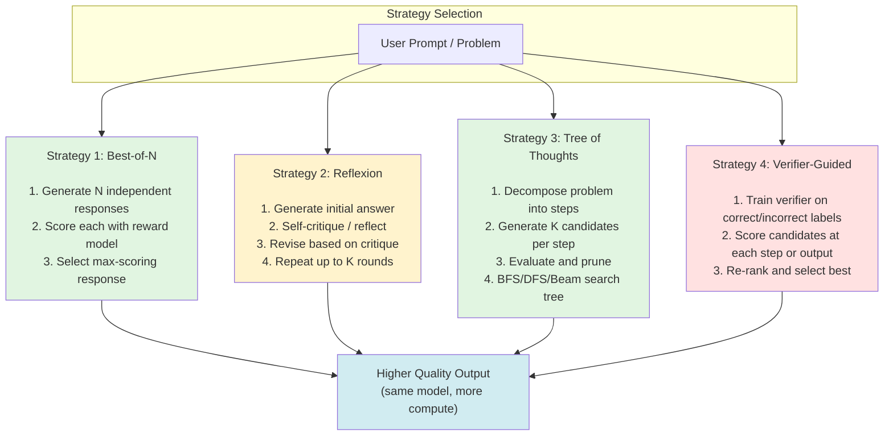
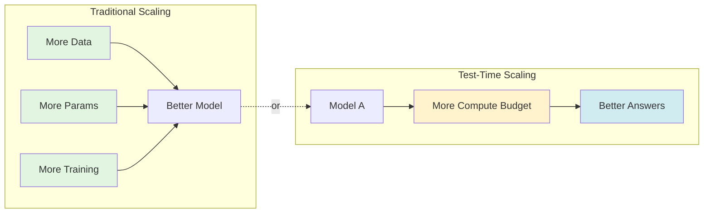

# Day 04: Test-Time Compute Scaling -- More Inference Budget, Better Output

> **Watch the animation**: 

## Quick Reference

| Term | Definition |
|---|---|
| Best-of-N | Generate N independent responses, score each, pick highest |
| Self-Correction / Reflexion | Generate, critique, revise -- iterative refinement loop |
| Tree of Thoughts (ToT) | Systematically search over a tree of possible reasoning paths |
| Verifier-Guided Decode | Use a trained reward/verifier model to score and guide generation |
| Process Reward | Score intermediate reasoning steps, not just final answer (PRM) |
| Outcome Reward | Score only the final answer / complete solution (ORM) |

## One-Line Summary

Test-time compute scaling allocates additional inference budget to a **fixed model** to produce higher quality outputs through strategies like Best-of-N sampling, self-correction loops, tree-structured reasoning search, and verifier-guided decoding -- trading latency for quality.

## Why This Matters

Traditional scaling laws focus on more data, more parameters, or more training compute. **Test-time compute scaling** opens a new dimension: spending extra compute at inference time to improve quality. This matters because:

1. It works with any pre-trained model -- no retraining needed
2. The compute budget is adjustable per-query, not fixed during training
3. Gains scale dramatically with well-designed strategies (especially on reasoning tasks)
4. It unlocks new capability tiers (e.g., a 7B model with test-time compute can outperform a raw 70B model on some tasks)
5. The trade-off is explicit and controllable: you choose latency vs. quality

## Architecture



## The Math

### Best-of-N: Probabilistic Scaling

Given a generator $P_\theta$ and a reward function $R$, we sample $N$ independent responses $y_1, ..., y_N \sim P_\theta(y | x)$ and select:

$$y^* = \arg\max_{i \in \{1,...,N\}} R(y_i, x)$$

The probability that the maximum reward exceeds a threshold $\tau$ is:

$$P\left(\max_i R(y_i, x) > \tau\right) = 1 - F_R(\tau)^N$$

where $F_R$ is the CDF of the reward distribution. As $N$ increases, this probability approaches 1. However, **diminishing returns** apply:

$$\frac{\partial}{\partial N} P = -F_R(\tau)^N \log F_R(\tau)$$

The marginal gain decays exponentially, explaining why doubling beyond $N \approx 32$-64 yields minimal improvement on most benchmarks.

### Self-Correction: Iterative Improvement

In the reflexion loop, let $f_\theta$ denote the model generating answers and $f_\theta^{\text{critic}}$ denote the critique function (which may be the same model with different prompting). After $k$ rounds:

$$y^{(k+1)} = f_\theta\left(x, y^{(k)}, f_\theta^{\text{critic}}(x, y^{(k)})\right)$$

The quality improvement at step $k$ is bounded:

$$Q(y^{(k+1)}) - Q(y^{(k)}) \to 0 \quad \text{as} \quad k \to \infty$$

The model can only improve as much as its own critique capability allows. If the model cannot detect its errors, self-correction converges to the same fixed point or, worse, reinforces model biases.

### Tree of Thoughts: Search Over Reasoning Paths

ToT formalizes reasoning as a tree search problem. At each depth $d$, we maintain a beam of $B$ candidate states $\{s_d^{(1)}, ..., s_d^{(B)}\}$. The value of a state is:

$$V(s_d) = \mathbb{E}[R(y) | \text{current reasoning trace } s_d]$$

At each expansion step, we generate $K$ candidate next thoughts per state and evaluate them:

$$s_{d+1}^{(j)} = f_\theta\left(\text{prompt}(s_d^{(i)})\right), \quad j \in \{1, ..., K\}$$

We then prune to the top-$B$ states:

$$\mathcal{B}_{d+1} = \text{Top}_B\left(\bigcup_{i=1}^B \{s_{d+1}^{(i,1)}, ..., s_{d+1}^{(i,K)}\}\right)$$

The total search space explored has size up to $(B \times K)^D$ for depth $D$, exponentially larger than a single generation path of size $1$.

### Process vs Outcome Reward Models

| | Outcome Reward Model (ORM) | Process Reward Model (PRM) |
|---|---|---|
| Scores | Final answer only | Each reasoning step |
| Supervision needed | Answer-level labels | Step-level labels |
| Discriminative power | Coarse | Fine-grained |
| Compute cost | Low (one call) | High (one call per step) |
| Error localization | Cannot pinpoint error step | Identifies where reasoning diverges |

A PRM assigns a score $s_t$ to each reasoning step $t$:

$$s_t = V_{\text{PRM}}(x, s_1, ..., s_t)$$

The overall solution score can be aggregated as:

$$S_{\text{solution}} = \frac{1}{T} \sum_{t=1}^T s_t \quad \text{or} \quad S_{\text{solution}} = \min_{t=1}^T s_t$$

Using the minimum is more conservative: a single bad reasoning step kills the entire solution, which aligns with how mathematical reasoning typically works (one wrong step invalidates the entire proof).

### Compute-Optimal Scaling

For a fixed inference compute budget $C$ (measured in forward passes), the optimal allocation balances sample count and per-sample compute:

$$C = N \times (c_{\text{generate}} + c_{\text{verify}})$$

where $c_{\text{generate}}$ is the cost per sample and $c_{\text{verify}}$ is the verification cost. The optimal strategy depends on the task's difficulty distribution and the model's capability ceiling.

Recent work by Wu et al. (2024) shows that there exists an optimal $N_{\text{optimal}}$ for each task difficulty, and that blindly increasing $N$ wastes compute when the model's capability ceiling limits the maximum achievable quality.

## Full Python Implementation

```python
"""
Test-Time Compute Scaling -- Inference-Time Intelligence
Day 04 Tutorial -- Advanced AI Daily
"""

from __future__ import annotations
from dataclasses import dataclass, field
from typing import Callable, List, Optional, Tuple


# ------------------------------------------------------------------
# Strategy 1: Best-of-N Sampling
# ------------------------------------------------------------------
def best_of_n(
    prompt: str,
    generator: Callable[[str, float], str],
    scorer: Callable[[str, str], float],
    n: int = 10,
    temperature: float = 0.7,
) -> Tuple[str, float, List[Tuple[str, float]]]:
    """
    Generate N independent responses and select the highest-scoring one.

    Args:
        prompt: Input question or problem statement
        generator: Callable(prompt, temperature) -> response string
        scorer: Callable(question, answer) -> float score
        n: Number of independent generations
        temperature: Sampling temperature (higher = more diverse)

    Returns:
        best_answer: Highest-scoring response
        best_score: Score of the best response
        all_scored: List of all (response, score) pairs
    """
    all_scored: list[tuple[str, float]] = []

    for i in range(n):
        response = generator(prompt, temperature)
        score = scorer(prompt, response)
        all_scored.append((response, score))

    # Sort by score descending
    all_scored.sort(key=lambda x: x[1], reverse=True)
    best_answer, best_score = all_scored[0]

    return best_answer, best_score, all_scored


# ------------------------------------------------------------------
# Strategy 2: Self-Correction / Reflexion
# ------------------------------------------------------------------
@dataclass
class ReflexionRound:
    """Represents one round of the reflexion loop."""

    round_number: int
    current_answer: str
    critique: str
    revised_answer: str


def reflexion_loop(
    prompt: str,
    generator: Callable[[str, float], str],
    max_rounds: int = 3,
    temperature: float = 0.7,
) -> Tuple[str, List[ReflexionRound]]:
    """
    Run a reflexion loop: generate, critique, revise iteratively.

    Args:
        prompt: Input question or problem statement
        generator: Callable(prompt, temperature) -> response string
        max_rounds: Maximum number of critique-revise cycles
        temperature: Sampling temperature

    Returns:
        final_answer: Answer after all reflexion rounds
        history: List of all reflexion rounds with critiques
    """
    # Initial generation
    current_answer = generator(prompt, temperature)
    history: list[ReflexionRound] = []

    for round_idx in range(1, max_rounds + 1):
        # Self-critique
        critique_prompt = (
            f"Problem: {prompt}\n\n"
            f"Your solution:\n{current_answer}\n\n"
            f"Review this solution carefully. Identify any errors, gaps, "
            f"or improvements. Be specific.\n\nCritique:"
        )
        critique = generator(critique_prompt, temperature=0.3)

        # Revision based on critique
        revision_prompt = (
            f"Problem: {prompt}\n\n"
            f"Your original solution:\n{current_answer}\n\n"
            f"Your critique of the solution:\n{critique}\n\n"
            f"Based on this critique, provide a revised and improved "
            f"solution.\n\nRevised Solution:"
        )
        revised = generator(revision_prompt, temperature)

        history.append(ReflexionRound(
            round_number=round_idx,
            current_answer=current_answer,
            critique=critique,
            revised_answer=revised,
        ))
        current_answer = revised

    return current_answer, history


# ------------------------------------------------------------------
# Strategy 3: Tree of Thoughts
# ------------------------------------------------------------------
@dataclass
class TreeNode:
    """A node in the Tree of Thoughts reasoning tree."""

    text: str
    parent: Optional["TreeNode"] = None
    evaluation: float = 0.0
    children: list["TreeNode"] = field(default_factory=list)
    depth: int = 0

    def trace(self) -> str:
        """Full reasoning trace from root to this node."""
        if self.parent is None:
            return self.text
        return self.parent.trace() + "\n" + self.text


class TreeOfThoughts:
    """
    Tree of Thoughts solver with beam search over reasoning paths.

    Implements the ToT method from Yao et al. (2023) using beam search
    to explore the most promising reasoning paths systematically.
    """

    def __init__(
        self,
        generator: Callable[[str, float], str],
        evaluator: Callable[[str, str], float],
        k: int = 5,
        beam_width: int = 3,
        max_depth: int = 5,
        temperature: float = 0.7,
    ):
        """
        Args:
            generator: Callable(prompt, temperature) -> response string
            evaluator: Callable(partial_trace, original_problem) -> float score
            k: Number of candidate thoughts to generate per node
            beam_width: Number of top nodes to keep at each level
            max_depth: Maximum tree depth (number of reasoning steps)
            temperature: Sampling temperature for generation
        """
        self.generator = generator
        self.evaluator = evaluator
        self.k = k
        self.beam_width = beam_width
        self.max_depth = max_depth
        self.temperature = temperature
        self.total_nodes_explored = 0

    def solve(self, problem: str) -> Tuple[str, int]:
        """
        Run Tree of Thoughts search and return the best reasoning path.

        Args:
            problem: The problem to solve

        Returns:
            best_trace: Full reasoning trace of the best path
            total_nodes: Total number of tree nodes explored
        """
        root = TreeNode(text=problem)
        beam: list[TreeNode] = [root]

        for depth in range(self.max_depth):
            next_beam: list[TreeNode] = []

            for node in beam:
                candidates = self._generate_candidates(node, problem)
                next_beam.extend(candidates)

            if not next_beam:
                break

            # Prune to top beam_width by evaluation score
            next_beam.sort(key=lambda n: n.evaluation, reverse=True)
            beam = next_beam[: self.beam_width]

        # Return the best leaf node's full trace
        beam.sort(key=lambda n: n.evaluation, reverse=True)
        best = beam[0]

        return best.trace(), self.total_nodes_explored

    def _generate_candidates(self, node: TreeNode, problem: str) -> list[TreeNode]:
        """Generate k candidate next thoughts from the current node."""
        prompt = (
            f"Problem: {problem}\n\n"
            f"Current reasoning so far:\n{node.trace()}\n\n"
            f"Provide {self.k} different possible next thinking steps. "
            f"Number them 1 to {self.k}."
        )

        raw_response = self.generator(prompt, self.temperature)

        candidates: list[TreeNode] = []
        # Simple parsing: split on numbered items
        lines = [line.strip() for line in raw_response.split("\n") if line.strip()]

        for i, line in enumerate(lines[: self.k]):
            child = TreeNode(
                text=line,
                parent=node,
                depth=node.depth + 1,
            )
            child.evaluation = self.evaluator(child.trace(), problem)
            candidates.append(child)
            self.total_nodes_explored += 1

        return candidates


# ------------------------------------------------------------------
# Strategy 4: Verifier-Guided Decoding
# ------------------------------------------------------------------
def verifier_rerank(
    prompt: str,
    generator: Callable[[str, float], str],
    verifier: Callable[[str, str], float],
    n: int = 10,
    temperature: float = 0.7,
) -> Tuple[str, float, List[Tuple[str, float]]]:
    """
    Generate N answers and re-rank them using a trained verifier.

    This is functionally similar to best_of_n but emphasizes using a
    dedicated verifier model (trained on correct/incorrect labels)
    rather than a generic scorer.

    Args:
        prompt: Input question or problem
        generator: Callable(prompt, temperature) -> response
        verifier: Callable(question, answer) -> float confidence score
        n: Number of candidates to generate
        temperature: Sampling temperature

    Returns:
        best_answer: Verifier-selected answer
        best_score: Verifier confidence score
        all_scored: All candidates with verifier scores
    """
    candidates: list[tuple[str, float]] = []

    for _ in range(n):
        answer = generator(prompt, temperature)
        score = verifier(prompt, answer)
        candidates.append((answer, score))

    candidates.sort(key=lambda x: x[1], reverse=True)
    best_answer, best_score = candidates[0]

    return best_answer, best_score, candidates


# ------------------------------------------------------------------
# Process Reward vs Outcome Reward Comparison
# ------------------------------------------------------------------
def compare_reward_granularity(
    solution_steps: List[str],
    process_reward_model: Callable[[List[str], int], float],
    outcome_reward_model: Callable[[str], float],
    full_solution: str,
) -> dict:
    """
    Compare process-level vs outcome-level verification on the same solution.

    Args:
        solution_steps: Individual reasoning steps
        process_reward_model: Callable(steps, step_index) -> score
        outcome_reward_model: Callable(full_text) -> score
        full_solution: Complete solution text

    Returns:
        Dictionary with process and outcome scores and their comparison
    """
    # Outcome reward: single score for the full solution
    outcome_score = outcome_reward_model(full_solution)

    # Process reward: score each step individually
    process_scores = []
    for i in range(len(solution_steps)):
        score = process_reward_model(solution_steps, i)
        process_scores.append(score)

    aggregate_process = sum(process_scores) / len(process_scores) if process_scores else 0.0
    minimum_process = min(process_scores) if process_scores else 0.0

    return {
        "outcome_score": outcome_score,
        "process_scores": process_scores,
        "aggregate_process": aggregate_process,
        "minimum_process": minimum_process,
        "disagreement": abs(outcome_score - aggregate_process),
    }


# ------------------------------------------------------------------
# Example Usage
# ------------------------------------------------------------------
if __name__ == "__main__":
    # Mock generator and scorer for demonstration
    import random

    random.seed(42)

    def mock_generator(prompt: str, temperature: float = 0.7) -> str:
        """Simulates generating a response."""
        quality = random.gauss(0.5, 0.2 / temperature)
        return f"Answer (quality={quality:.3f}): {'Correct' if quality > 0.5 else 'Incorrect'}"

    def mock_scorer(question: str, answer: str) -> float:
        """Simulates scoring a response."""
        return random.random()

    def mock_verifier(question: str, answer: str) -> float:
        """Simulates verifier confidence."""
        return random.random()

    def mock_process_prm(steps: list[str], step_idx: int) -> float:
        """Simulates process reward for a specific step."""
        return random.random()

    def mock_outcome_orm(text: str) -> float:
        """Simulates outcome reward for full text."""
        return random.random()

    question = "What is the sum of all prime numbers less than 10?"

    # --- Best-of-N ---
    print("=" * 60)
    print("Strategy 1: Best-of-N (N=5)")
    print("=" * 60)
    best, score, all_scored = best_of_n(
        question, mock_generator, mock_scorer, n=5, temperature=0.7
    )
    print(f"Best answer: {best}")
    print(f"Best score: {score:.4f}")
    print(f"All scores: {[s for _, s in all_scored]}")

    # --- Reflexion ---
    print()
    print("=" * 60)
    print("Strategy 2: Reflexion Loop (3 rounds)")
    print("=" * 60)
    final_answer, history = reflexion_loop(question, mock_generator, max_rounds=3)
    print(f"Final answer: {final_answer[:80]}...")
    print(f"Rounds completed: {len(history)}")

    # --- Tree of Thoughts ---
    print()
    print("=" * 60)
    print("Strategy 3: Tree of Thoughts")
    print("=" * 60)
    tot = TreeOfThoughts(
        generator=mock_generator,
        evaluator=lambda trace, prob: random.random(),
        k=3,
        beam_width=2,
        max_depth=3,
    )
    trace, nodes = tot.solve(question)
    print(f"Best trace (first 100 chars): {trace[:100]}...")
    print(f"Total nodes explored: {nodes}")

    # --- Verifier Re-rank ---
    print()
    print("=" * 60)
    print("Strategy 4: Verifier-Guided Re-ranking (N=5)")
    print("=" * 60)
    v_best, v_score, v_all = verifier_rerank(
        question, mock_generator, mock_verifier, n=5
    )
    print(f"Best answer: {v_best}")
    print(f"Verifier score: {v_score:.4f}")

    # --- Process vs. Outcome Reward ---
    print()
    print("=" * 60)
    print("Process vs Outcome Reward Comparison")
    print("=" * 60)
    steps = ["Step 1: Identify primes less than 10", "Step 2: Sum them up"]
    comparison = compare_reward_granularity(
        solution_steps=steps,
        process_reward_model=mock_process_prm,
        outcome_reward_model=mock_outcome_orm,
        full_solution="\n".join(steps),
    )
    print(f"Outcome score: {comparison['outcome_score']:.4f}")
    print(f"Process scores: {[f'{s:.4f}' for s in comparison['process_scores']]}")
    print(f"Aggregate (mean): {comparison['aggregate_process']:.4f}")
    print(f"Minimum: {comparison['minimum_process']:.4f}")
    print(f"Disagreement: {comparison['disagreement']:.4f}")
```

## Deep Dive

### 1. The Inference-Time Compute Paradigm Shift

Traditional AI progress followed the formula: larger dataset + more parameters + more training compute = better model. Test-time compute scaling reveals an **orthogonal axis of improvement** that was always available but systematically underexplored.

The key insight is that a model's knowledge is not just encoded in its weights -- it's also unlockable through deliberate computation at inference time. This mirrors human intelligence: a person thinking longer, trying multiple approaches, and checking their work will produce better results than blurting out the first answer, even with the same underlying knowledge.

The "slo" scaling laws discovered in 2024 show that performance on reasoning tasks follows a power law in test-time compute, analogous to training-time scaling laws. Doubling the inference budget can produce performance gains equivalent to a much larger model.



### 2. Diminishing Returns in Best-of-N

The improvement from Best-of-N follows a concave curve. On math problems, increasing $N$ from 1 to 10 might yield a +15% accuracy gain, but increasing from 10 to 100 only yields +5%. This is because once the model has explored its capability range, additional samples mostly cover already-explored regions of the output space.

The "sweet spot" depends on task difficulty:
- **Easy tasks**: Small $N$ (3-5) is sufficient; the model already knows the answer
- **Medium tasks**: Moderate $N$ (10-32) finds the right answer among plausible alternatives
- **Hard tasks**: Large $N$ (64-1000) is needed, but even then the model's capability ceiling limits the maximum achievable quality

### 3. Why Self-Correction Sometimes Makes Things Worse

Self-correction has a fundamental limitation: **the model must be able to detect its own errors**. If a model's error detection ability is weaker than its problem-solving ability, the "critique" phase introduces noise that pushes the solution away from the correct answer.

Research by Huang et al. (2023) and Valmeekam et al. (2023) showed that for many standard LLMs, self-correction on logic puzzles and math problems actually *degrades* performance compared to a single-pass attempt. This happens because:

1. The model's self-critique is biased toward finding problems that aren't there (false positives)
2. The revise phase inherits the same blind spots as the generate phase
3. Over multiple rounds, errors accumulate and amplify

**Solutions**: Use a stronger model for the critique phase, or train the model specifically on critique-revision pairs (as in Self-Refine).

### 4. Verifier Quality: The Bottleneck

All test-time compute strategies that rely on ranking or pruning (Best-of-N, ToT, Verifier-Guided) are only as good as their verification signal. If the verifier is noisy or biased:

- Best-of-N will select confidently wrong answers
- ToT will prune the correct reasoning path and keep wrong ones
- Verifier-guided decoding will converge to the verifier's preferences, not the true correct answer**

This is why **Process Reward Models (PRMs)** are such an important development: by scoring intermediate reasoning steps, they provide denser supervision that correlates more strongly with final correctness than a coarse outcome-level score. Lightman et al. (2023) showed that step-level verification significantly outperforms outcome-level verification on mathematical reasoning tasks.

## Common Misconceptions

| Misconception | Reality |
|---|---|
| "More test-time compute always means better results" | No. Diminishing returns are real. Beyond optimal N the marginal gain approaches zero. |
| "Self-correction always helps" | No. Many models cannot detect their own errors. Without good critique ability, self-correction degrades performance. |
| "Test-time compute replaces training" | No. It works within the capability ceiling of the trained model. You still need a capable base model. |
| "Tree of Thoughts is always superior" | ToT is expensive (exponential growth) and only outperforms when the problem admits meaningful step decomposition. |
| "Best-of-N with N=1000 will beat any model" | No. If the base model cannot ever produce a correct answer, no amount of sampling helps. |
| "Verifier-guided decoding is free" | Training a good verifier requires substantial labeled data. A poor verifier is worse than no verifier. |

## Exercises

1. **Accuracy scaling**: Using a real model (even a small one), measure accuracy on 50 math problems for $N = 1, 5, 10, 20, 50$ and plot the accuracy curve. Does it match the theoretical diminishing returns prediction?
2. **Self-correction failure case**: Find a task where reflexion makes performance *worse* than the initial answer. Analyze why the critique phase introduced errors.
3. **Build a ToT solver**: Implement a complete Tree of Thoughts solver for a 4x4 Sudoku puzzle. Use constraint violation count as the evaluation heuristic.
4. **PRM training**: Collect 100 solutions to math problems with step-level annotations (correct/incorrect per step). Train a simple binary classifier as a process reward model and evaluate its correlation with final answer correctness.
5. **Compute-optimal allocation**: Given a fixed budget of 100 forward passes, design an experiment to find the optimal allocation between number of samples and verification depth. Compare Best-of-10 with 10 rounds of reflexion vs Best-of-100 with no verification.

## Further Reading

| Paper | Authors | arXiv | Key Contribution |
|---|---|---|---|
| **Training Verifiers to Solve Math Word Problems** | Cobbe et al. (2021) | 2110.14168 | Introduces verifier-based re-ranking for math |
| **Chain-of-Thought Prompting Elicits Reasoning in Large Language Models** | Wei et al. (2022) | 2201.11903 | CoT prompting: sequential reasoning |
| **AlphaCode: Deep Learning for Code Competition** | Li et al. (2022) | 2203.08814 | Large-scale code generation with ranking |
| **Self-Refine: Iterative Refinement with Self-Feedback** | Madaan et al. (2023) | 2303.17651 | Models can refine their own outputs |
| **Reflexion: Language Agents with Verbal Reinforcement Learning** | Shinn et al. (2023) | 2303.11366 | Verbal RL through self-reflection |
| **Tree of Thoughts: Deliberate Problem Solving with LLMs** | Yao et al. (2023) | 2305.10601 | Systematic tree search over reasoning |
| **Let's Verify Step by Step** | Lightman et al. (2023) | 2305.20050 | Step-level verification beats outcome-level |
| **Self-Correction with LLMs: Are Self-Corrections Reliable?** | Huang et al. (2023) | 2309.06684 | Critical analysis of self-correction |

## Summary

| Strategy | Compute Cost | Best For | Strength | Weakness |
|---|---|---|---|---|
| Best-of-N | $O(N)$ generations | General QA, coding | Simple, robust | Diminishing returns past N~50 |
| Reflexion | $O(K)$ iterations | Writing, reasoning | Mimics iterative revision | Critique quality bottleneck |
| Tree of Thoughts | $O(B \cdot K)^D$ | Complex multi-step | Systematic exploration | Exponential cost |
| Verifier-Guided | $O(N)$ gen + verify | Math, logic | Dense supervision | Requires trained verifier |

---

_Prev: [Day 03 -- Speculative Decoding](03-speculative-decoding.md)  |  Next: [Day 05 -- Multi-Agent Reflection](05-multi-agent-reflection.md)_
