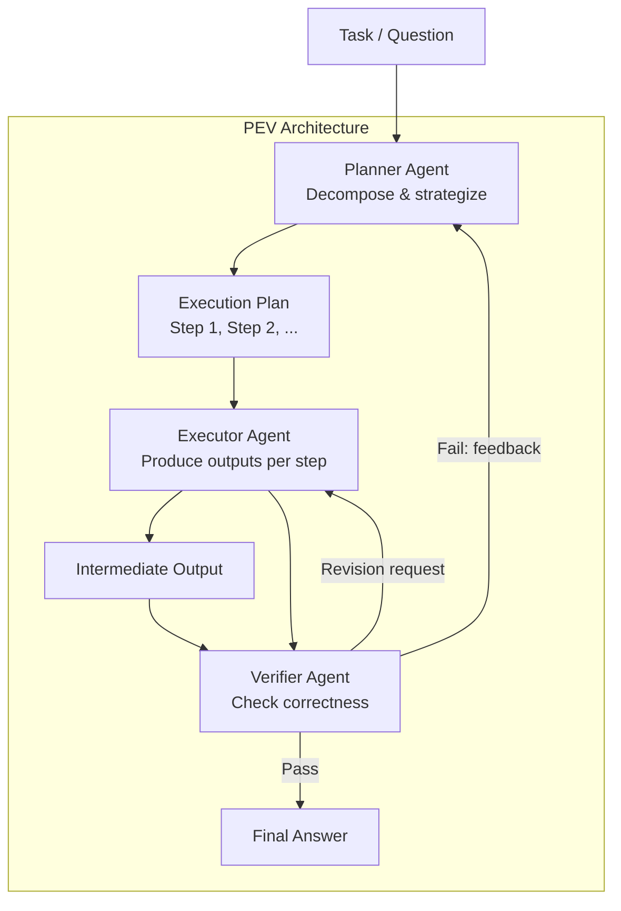
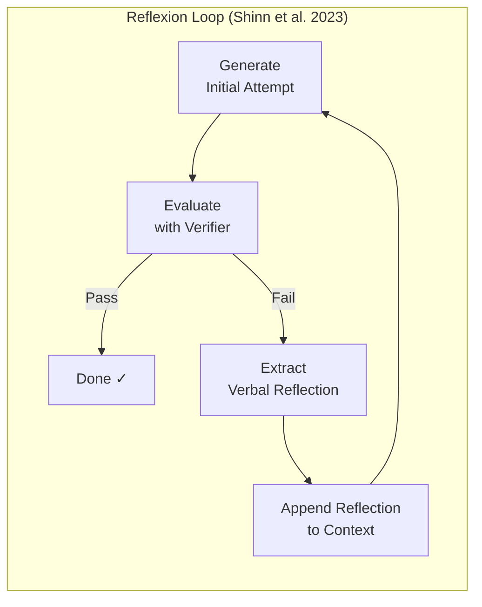
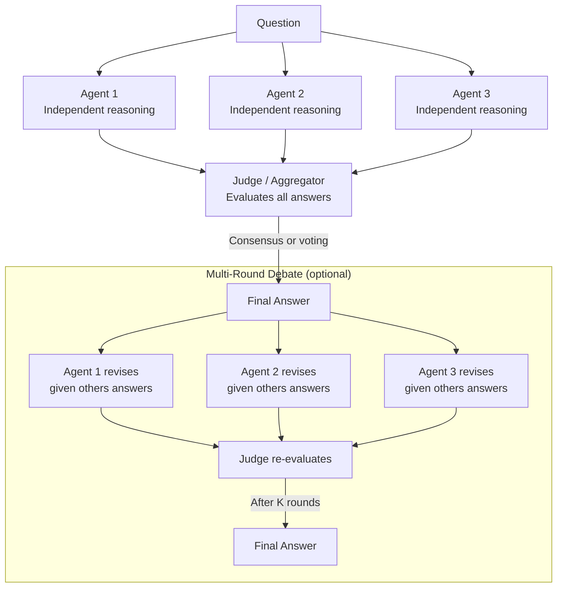
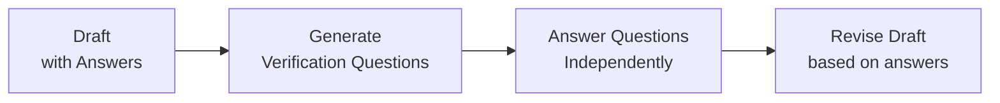

# Day 05: Multi-Agent Reflection -- Planner-Executor-Verifier, Reflexion, and Debate

> **Watch the animation**: <video src="https://raw.githubusercontent.com/Playitcooool/advanced-ai-daily/main/videos/05-multi-agent-reflection.webm" autoplay loop muted playsinline width="800"></video>

---

## One-Line Summary

Multi-agent reflection distributes cognitive labor across specialized agents -- a Planner decomposes tasks, an Executor produces outputs, a Verifier checks correctness, and a Debate system resolves disagreements -- achieving higher accuracy on complex reasoning tasks than any single agent, with architectures like Reflexion (Shinn et al. 2023), MetaGPT (Hong et al. 2023), and Chain-of-Verification (Dhuliawala et al. 2023).

---

<video src="https://raw.githubusercontent.com/Playitcooool/advanced-ai-daily/main/videos/05-multi-agent-reflection.webm" autoplay loop muted playsinline width="800"></video>


## Why This Matters

### The Single-Agent Limit

A single LLM must simultaneously generate, critique, and revise its own output. This creates three fundamental problems:

1. **Self-bias**: Models struggle to identify errors in their own reasoning because the same generative process produced both the answer and the critique.
2. **Role confusion**: One prompt attempting to cover planning, execution, and verification inevitably makes trade-offs that weaken each function.
3. **Error compounding**: Without an independent checkpoint, hallucinations and logical errors propagate unchecked through the entire pipeline.

### Multi-Agent's Core Insight

Multi-agent reflection asks: *Can we get better results by assigning distinct cognitive roles to separate agents, each with a focused system prompt and independent reasoning path?*

The answer is a strong yes. By separating generation from evaluation, and by introducing adversarial debate among agents, we create a system that catches errors a single model would miss, plans more carefully, and produces outputs that are more robust and verifiable.

---

## Architecture Walkthrough



---

## Reflexion Architecture



### Key Design Decisions

| Decision | Options | Trade-offs |
|---|---|---|
| Same model vs different model | Identical LLM with different prompts, or different LLMs | Different models yield more diverse critique but cost more |
| Shared memory | All agents access shared context, or pass messages via controller | Shared memory = richer context but more tokens |
| Termination | Fixed rounds, agreement-based, or confidence threshold | Agreement = better quality but risk of infinite loops |
| Failure memory | Store critique history for future, or start fresh each time | History prevents repeated mistakes, adds latency |

---

## Debate Architecture



### PEV vs Debate Comparison

| Dimension | PEV | Debate |
|---|---|---|
| Structure | Sequential pipeline (Plan → Execute → Verify) | Parallel generation + aggregation |
| Agent roles | Distinct and asymmetric | Symmetric, all agents play same role |
| Best for | Complex multi-step tasks requiring planning | Questions where diverse viewpoints matter |
| Compute pattern | Sequential agents, each depends on prior | Parallel agents, then aggregation |
| Error recovery | Verifier loops back to Planner | Judge picks best, or agents revise |
| Key paper | MetaGPT (2308.00352) | LLM Debate (2305.14333) |

---

## Chain-of-Verification (CoVe)



Chain-of-Verification (Dhuliawala et al., 2023) follows four steps:

1. **Generate a draft** response that may contain factual errors.
2. **Plan verification questions** that would check each claim in the draft.
3. **Execute verification** by answering each question independently from the draft (prevents the model from just repeating its own hallucinations).
4. **Generate a revised response** incorporating the verification results.

This is particularly effective at reducing hallucination because Step 3 forces the model to independently verify claims rather than re-deriving them from the same faulty reasoning path.

---

## Mathematical Formulation

### Reflexion Reward Model

Reflexion can be formalized as a policy improvement loop where the policy conditions on accumulated reflection history:

$$
\pi_\theta(a_t \mid s_t, h_t) \quad \text{where} \quad h_t = \{r_1, r_2, \ldots, r_{t-1}\}
$$

And each reflection $r_t$ is a function of the failure signal:

$$
r_t = \text{Reflect}(s_t, a_t, \text{feedback}_t)
$$

### Expected Improvement Over Rounds

If the acceptance rate per round is $p$ (probability that the verifier accepts), the expected number of rounds until acceptance follows a geometric distribution:

$$
E[\text{rounds}] = \frac{1}{p}
$$

With $m$ independent agents in a debate and majority voting requiring $> m/2$ agreement, the probability of a correct final answer (assuming each agent has individual accuracy $a$) is:

$$
P(\text{correct}) = \sum_{k=\lfloor m/2 \rfloor + 1}^{m} \binom{m}{k} a^k (1-a)^{m-k}
$$

For $m=3$ and $a=0.7$:

$$
P(\text{correct}) = \binom{3}{2}(0.7)^2(0.3)^1 + \binom{3}{3}(0.7)^3(0.3)^0 = 3 \cdot 0.49 \cdot 0.3 + 0.343 = 0.441 + 0.343 = 0.784
$$

Majority voting improves accuracy from 70% to 78.4%.

### Information-Theoretic Advantage

The mutual information between the final answer and the ground truth increases with agent diversity:

$$
I(Y_{\text{final}}; Y^*) \geq \max_i I(Y_i; Y^*) \quad \text{when agents have uncorrelated errors}
$$

This shows that diverse agents (uncorrelated errors) provide strictly more information about the true answer than any single agent.

---

## Python Code Implementation

```python
import numpy as np
from dataclasses import dataclass, field
from typing import Optional


@dataclass
class AgentMessage:
    """A message passed between agents in a multi-agent system."""
    sender: str
    content: str
    metadata: dict = field(default_factory=dict)


AgentFn = callable  # Type alias for agent functions


class ReflexionAgent:
    """
    Implements the Reflexion architecture (Shinn et al., 2023).

    Alternates between generation and self-reflection, accumulating
    verbal reflections in the context to improve future attempts.

    Paper: arXiv:2303.11366
    """

    def __init__(
        self,
        generator: AgentFn,
        reflector: AgentFn,
        verifier: AgentFn,
        max_rounds: int = 5,
    ):
        """
        Initialize ReflexionAgent.

        Args:
            generator: Function(prompt, context) -> str, generates an attempt.
            reflector: Function(prompt, attempt, feedback) -> str, produces reflection.
            verifier: Function(prompt, attempt) -> tuple[bool, str], checks correctness.
            max_rounds: Maximum number of reflection rounds.
        """
        self.generator = generator
        self.reflector = reflector
        self.verifier = verifier
        self.max_rounds = max_rounds

    def run(self, prompt: str) -> tuple[str, list[str]]:
        """
        Run the Reflexion loop.

        Args:
            prompt: The input problem or question.

        Returns:
            final_answer: The accepted answer string.
            reflections: List of all generated reflections.
        """
        context: list[str] = []
        reflections: list[str] = []

        for round_num in range(self.max_rounds):
            # Generate attempt
            context_block = "\n".join(context)
            attempt = self.generator(prompt, context_block)

            # Verify
            passed, feedback = self.verifier(prompt, attempt)

            if passed:
                return attempt, reflections

            # Reflect and accumulate failure memory
            reflection = self.reflector(prompt, attempt, feedback)
            reflections.append(reflection)
            context.append(f"Reflection {round_num + 1}: {reflection}")

        # Return best attempt if no round passed
        return attempt, reflections


class PEVSystem:
    """
    Planner-Executor-Verifier multi-agent architecture.

    Decomposes a task into a plan, executes each step,
    verifies the result, and loops back on failure.

    Inspired by MetaGPT (arXiv:2308.00352).
    """

    def __init__(
        self,
        planner: AgentFn,
        executor: AgentFn,
        verifier: AgentFn,
        max_retries: int = 3,
    ):
        """
        Initialize PEVSystem.

        Args:
            planner: Function(task) -> list[str], produces a step-by-step plan.
            executor: Function(task, plan, current_step, previous_outputs) -> str,
                      executes one step.
            verifier: Function(task, plan, outputs) -> tuple[bool, str],
                      checks final result.
            max_retries: Maximum number of planner-executor-verify cycles.
        """
        self.planner = planner
        self.executor = executor
        self.verifier = verifier
        self.max_retries = max_retries

    def run(self, task: str) -> tuple[str, dict]:
        """
        Run the PEV pipeline.

        Args:
            task: The problem to solve.

        Returns:
            final_output: The verified result.
            trace: Dictionary containing plan, outputs, and verification history.
        """
        trace: dict = {
            "plans": [],
            "outputs": [],
            "verifications": [],
        }

        for attempt in range(self.max_retries):
            # Step 1: Plan
            plan = self.planner(task)
            trace["plans"].append(plan)

            # Step 2: Execute each step
            outputs: list[str] = []
            for step_idx, step in enumerate(plan):
                step_output = self.executor(
                    task, plan, step_idx, outputs
                )
                outputs.append(step_output)
            trace["outputs"].append(outputs)

            # Step 3: Verify
            passed, feedback = self.verifier(task, plan, outputs)
            trace["verifications"].append({"passed": passed, "feedback": feedback})

            if passed:
                return "\n".join(outputs), trace

            # If failed, feed verifier feedback back to planner
            # (the planner is expected to incorporate feedback into the next plan)

        # Return last attempt even if not verified
        return "\n".join(outputs), trace


class DebateSystem:
    """
    Multi-agent debate system.

    Multiple agents independently generate answers, a judge
    aggregates them, and agents can revise based on others' answers.

    Paper: arXiv:2305.14333 (LLM Debates Improve Reasoning)
    """

    def __init__(
        self,
        agents: list[AgentFn],
        judge: callable,
        num_rounds: int = 2,
        voting: str = "majority",
    ):
        """
        Initialize DebateSystem.

        Args:
            agents: List of agent functions, each(prompt, debate_history) -> str.
            judge: Function(answers) -> str, selects or synthesizes final answer.
            num_rounds: Number of debate rounds (1 = single-shot, >1 = multi-round).
            voting: Aggregation strategy -- 'majority' or 'best'.
        """
        self.agents = agents
        self.judge = judge
        self.num_rounds = num_rounds
        self.voting = voting

    def run(self, prompt: str) -> tuple[str, list[list[str]]]:
        """
        Run the debate system.

        Args:
            prompt: The question or task.

        Returns:
            final_answer: The judge-selected or synthesized answer.
            all_rounds: List of rounds, each round is a list of agent answers.
        """
        debate_history: list[str] = []
        all_rounds: list[list[str]] = []

        for round_num in range(self.num_rounds):
            round_answers: list[str] = []

            for agent_idx, agent in enumerate(self.agents):
                # Each agent sees the debate history from prior rounds
                agent_answer = agent(prompt, debate_history)
                round_answers.append(agent_answer)

            all_rounds.append(round_answers)

            # Update debate history for next round
            for idx, answer in enumerate(round_answers):
                debate_history.append(f"Agent {idx} (Round {round_num + 1}): {answer}")

        # Final judgment
        final_answer = self.judge(all_rounds[-1])
        return final_answer, all_rounds


class ChainOfVerification:
    """
    Chain-of-Verification system.

    Generates a draft, plans verification questions,
    answers them independently, then revises.

    Paper: arXiv:2309.11495
    """

    def __init__(
        self,
        drafter: AgentFn,
        question_planner: AgentFn,
        question_answerer: AgentFn,
        reviser: AgentFn,
    ):
        """
        Initialize ChainOfVerification.

        Args:
            drafter: Function(prompt) -> str, generates initial draft.
            question_planner: Function(draft) -> list[str], generates verification questions.
            question_answerer: Function(question) -> str, answers a question independently.
            reviser: Function(draft, questions_and_answers) -> str, revises the draft.
        """
        self.drafter = drafter
        self.question_planner = question_planner
        self.question_answerer = question_answerer
        self.reviser = reviser

    def run(self, prompt: str) -> tuple[str, dict]:
        """
        Run the Chain-of-Verification pipeline.

        Args:
            prompt: The input question.

        Returns:
            final_answer: The revised, verified answer.
            trace: Verification trace.
        """
        # Step 1: Generate draft
        draft = self.drafter(prompt)

        # Step 2: Plan verification questions
        questions = self.question_planner(draft)

        # Step 3: Answer each question independently
        qa_pairs: list[dict] = []
        for q in questions:
            answer = self.question_answerer(q)
            qa_pairs.append({"question": q, "answer": answer})

        # Step 4: Revise based on verification
        revised = self.reviser(draft, qa_pairs)

        trace = {
            "draft": draft,
            "verification_questions": questions,
            "qa_pairs": qa_pairs,
            "revised": revised,
        }

        return revised, trace


# ------------------------------------------------------------------
# Example usage with mock agents
# ------------------------------------------------------------------
if __name__ == "__main__":

    # ---- Mock agents for Reflexion ----
    def mock_generator(prompt: str, context: str) -> str:
        if context:
            return "The answer is 42 (revised after reflection)."
        return "The answer is 41."

    def mock_reflector(prompt: str, attempt: str, feedback: str) -> str:
        return f"Error in '{attempt}': off by 1. Need to check boundary conditions."

    def mock_verifier(prompt: str, attempt: str) -> tuple[bool, str]:
        if "42" in attempt:
            return True, "Correct."
        return False, f"Incorrect. Got '{attempt}'."

    agent = ReflexionAgent(
        generator=mock_generator,
        reflector=mock_reflector,
        verifier=mock_verifier,
        max_rounds=5,
    )
    answer, reflections = agent.run("What is 6 * 7?")
    print(f"Reflexion final answer: {answer}")
    print(f"Reflections: {reflections}")
    print()

    # ---- Mock agents for Debate ----
    def mock_agent_1(prompt: str, history: list[str]) -> str:
        return "Answer A: 42"

    def mock_agent_2(prompt: str, history: list[str]) -> str:
        return "Answer B: 42"

    def mock_agent_3(prompt: str, history: list[str]) -> str:
        return "Answer C: 43"

    def mock_judge(answers: list[str]) -> str:
        # Simple majority vote
        from collections import Counter
        # Strip "Answer X: " prefix
        stripped = [a.split(": ")[1] if ": " in a else a for a in answers]
        counts = Counter(stripped)
        return counts.most_common(1)[0][0]

    debate = DebateSystem(
        agents=[mock_agent_1, mock_agent_2, mock_agent_3],
        judge=mock_judge,
        num_rounds=2,
        voting="majority",
    )
    final, rounds = debate.run("What is 6 * 7?")
    print(f"Debate final answer: {final}")
    print(f"Round 1 answers: {rounds[0]}")
    print(f"Round 2 answers: {rounds[1]}")
    print()

    # ---- Chain-of-Verification ----
    def mock_drafter(prompt: str) -> str:
        return "The capital of France is London."

    def mock_question_planner(draft: str) -> list[str]:
        return ["What is the capital of France?"]

    def mock_question_answerer(question: str) -> str:
        if "capital of France" in question:
            return "Paris"
        return "Unknown"

    def mock_reviser(draft: str, qa_pairs: list[dict]) -> str:
        for qa in qa_pairs:
            draft = draft.replace("London", qa["answer"])
        return draft

    cove = ChainOfVerification(
        drafter=mock_drafter,
        question_planner=mock_question_planner,
        question_answerer=mock_question_answerer,
        reviser=mock_reviser,
    )
    revised, trace = cove.run("What is the capital of France?")
    print(f"CoVe final answer: {revised}")
    print(f"Draft was: {trace['draft']}")
```

---

## Deep Dive

### The "Blind Spot" Problem

A single LLM has coherent but systematic biases. When asked to critique its own answer, it often:
- Fails to notice its own errors (self-consistent but wrong).
- Hallucinates problems that do not exist.
- Is overly lenient on its own reasoning.

A **separate critic agent**, especially with a different system prompt or different model variant, does not share the same reasoning path and therefore catches different error types.

### Agent Communication Patterns

| Pattern | Topology | Pros | Cons |
|---|---|---|---|
| Pipeline | A → B → C | Simple, deterministic | No loops, brittle |
| Star | Hub connects all agents | Centralized control | Hub is bottleneck |
| Mesh | All agents communicate | Maximum information sharing | O(n²) messages |
| Tree | Hierarchical delegation | Scales well, natural delegation | Root can be bottleneck |

### Cost vs Quality Trade-off

Multi-agent systems trade latency and cost for output quality. The decision to use multi-agent vs single-agent should be guided by:
- **Task complexity**: Multi-step, high-stakes tasks benefit most.
- **Error tolerance**: Low-tolerance domains (medical, legal, finance) benefit from verification.
- **Latency budget**: Each agent adds a full LLM call, multiplying latency.
- **Agent diversity benefit**: If agents are too similar, returns diminish quickly.

---

## Common Misconceptions

| Misconception | Reality |
|---|---|
| "More agents = always better" | Beyond ~5 agents, marginal gains shrink; diversity matters more than count |
| "Any LLM can be an agent" | Agent role requires specific prompting; not all models are equally good at planning vs generating vs critiquing |
| "Multi-agent eliminates hallucination" | Multi-agent reduces but does not eliminate hallucination; verification can also hallucinate |
| "Debate always produces consensus" | Agents can reinforce shared biases; structured debate rules are essential |
| "Reflexion requires training" | Original Reflexion uses only prompting; no fine-tuning needed |

---

## Exercises

1. **Implement a Reflexion loop for code generation**: Build a ReflexionAgent where the verifier runs the generated code in a sandbox and the reflector analyzes error messages. Measure how many rounds are needed to fix syntax vs logical errors.

2. **Build a PEV system for math word problems**: The planner decomposes the problem, the executor solves each sub-problem, and the verifier checks units, ranges, and logical consistency. Compare accuracy against a single-shot LLM.

3. **Experiment with debate round count**: Implement a debate system with 1, 2, 3, and 5 rounds. Track how answer quality changes with more rounds. Does quality saturate or continue improving?

4. **Cross-model debate**: Assign different models (e.g., GPT-4o, Claude 3.5, LLaMA 3) to debate roles. Does model diversity improve debate quality, or does it cause communication breakdown?

5. **CoVe vs Reflexion comparison**: Implement both Chain-of-Verification and Reflexion on the same QA dataset. Which approach reduces hallucination more effectively? When does each approach fail?

---

## References

| Paper | arXiv | Key Contribution |
|---|---|---|
| Reflexion: Language Agents with Verbal Reinforcement Learning | 2303.11366 | Self-reflection loop with verbal feedback accumulation |
| MetaGPT: Meta Programming for Multi-Agent Collaborative Framework | 2308.00352 | PEV-style multi-agent software development |
| LLM Debates: Improving Reasoning through Multi-Agent Discussion | 2305.14333 | Multi-agent debate improves reasoning accuracy |
| Chain-of-Verification: Reducing Hallucination in LLMs | 2309.11495 | Self-verification via independent question answering |

---

## Navigation

[[Day 04: Test-Time Compute]](04-test-time-compute.md) | **Day 05: Multi-Agent Reflection** | [[Day 06: Quantization]](06-quantization.md)
