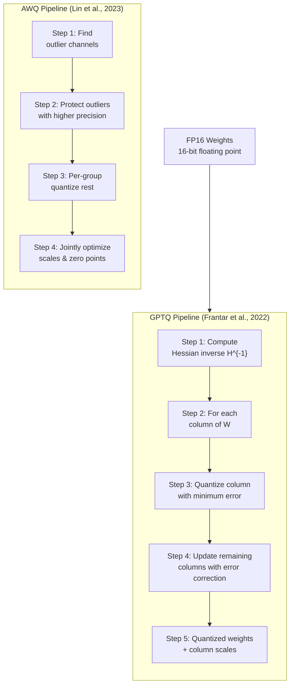
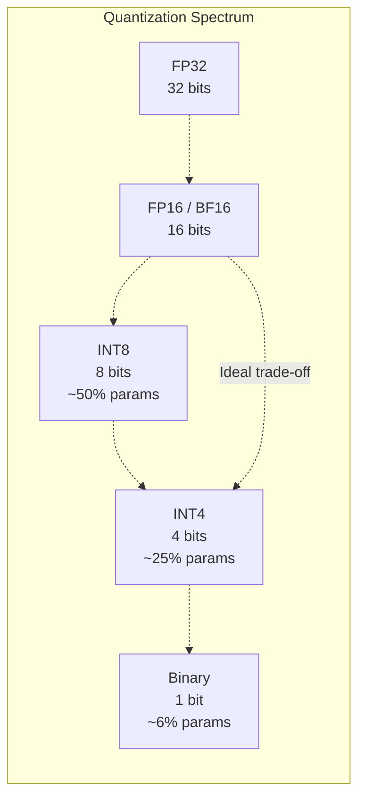

# Day 06: Quantization -- GPTQ, AWQ, Per-Group, and 1-bit LLMs

> **Watch the animation**: ---

## One-Line Summary

Quantization compresses model weights and activations from 16-bit floating point to 8-bit, 4-bit, or even 1-bit integers using sophisticated algorithms like GPTQ (2210.17323) and AWQ (2306.00978), enabling large models to run on consumer hardware with minimal quality loss through per-group scaling, outlier-aware quantization, and quantization-aware training.

---

## Why This Matters

### The Memory Bottleneck

Modern LLMs are overwhelmingly memory-bound during inference. A 70B parameter model in FP16 requires 140 GB of GPU memory -- far beyond a single consumer GPU. Loading these weights from memory for every token generation step dominates inference time. The arithmetic intensity of a single-token forward pass is extremely low: multiplying a (1 x d_model) vector by a (d_model x d_model) weight matrix requires 2*d_model^2 FLOPs but must read 2*d_model^2 bytes of weights. The GPU spends most of its cycles waiting for data, not computing.

### Quantization's Core Insight

Quantization asks: *Can we represent 16-bit floating point weights with far fewer bits without meaningfully degrading model quality?*

The answer is yes, but the naive approach (uniformly quantizing all weights with a single scale factor) fails because weight distributions are not uniform. Modern methods work by:
1. **Per-group quantization**: different weight groups get different scales, accommodating varying distributions
2. **Outlier-aware quantization**: protecting the most influential weights from quantization error (AWQ)
3. **Second-order correction**: using Hessian information to optimally distribute quantization error across layers (GPTQ)
4. **Quantization-aware training**: fine-tuning the model in its quantized form so it learns to compensate for quantization noise

---

## Architecture Walkthrough





---

## Mathematical Formulation

### Uniform Quantization

The simplest form of quantization maps a continuous range [a, b] to N discrete levels:

$$
q = \text{clip}\left(\left\lfloor \frac{x - a}{s} + 0.5 \right\rfloor, 0, N-1\right)
$$

$$
\hat{x} = s \cdot q + a \quad \text{where} \quad s = \frac{b - a}{N - 1}
$$

The quantization error is bounded by $|x - \hat{x}| \leq s/2$. The smaller the step size $s$ (the larger $N$), the smaller the error.

### Asymmetric (Affine) Quantization

More commonly, quantization uses an affine mapping with a scale and zero-point:

$$
q = \text{clip}\left(\left\lfloor \frac{x}{s} + z \right\rceil, q_{\min}, q_{\max}\right)
$$

$$
\hat{x} = s \cdot (q - z)
$$

Where:
- $s$: scale factor ($s > 0$)
- $z$: zero-point (usually integer, ensures 0.0 maps exactly to an integer quantized value)
- $q_{\min}, q_{\max}$: quantized min/max (e.g., -128 and 127 for INT8)

### Per-Group Quantization

Instead of a single scale for an entire weight matrix, per-group quantization divides weights into groups of size $g$ (typically $g = 64$ or $128$) and assigns each group its own scale:

$$
s_g = \frac{\max(|W_g|) - \min(|W_g|)}{N - 1}
$$

$$
\hat{W}_{i,j} = s_{\lfloor j/g \rfloor} \cdot \left(q_{i,j} - z_{\lfloor j/g \rfloor}\right)
$$

This is critical because different columns of weight matrices often have very different magnitudes. A single global scale would be dominated by the largest outliers and cause most weights to be compressed into a few quantization bins.

### GPTQ: Second-Order Error Correction

GPTQ's key innovation is using the Hessian (second derivative) of the loss to guide quantization decisions. For a weight matrix $W$ and input data $X$:

$$
H = 2XX^\top + \lambda I \quad \text{(Fisher information / Hessian)}
$$

$$
L(W) = \|WX - \hat{W}X\|^2_F
$$

The optimal quantization of each column minimizes:

$$
\min_q \sum_{j} (w_j - \hat{w}_j)^\top H (w_j - \hat{w}_j)
$$

GPTQ processes columns sequentially, and after quantizing column $j$, updates all remaining columns to compensate:

$$
w_k \leftarrow w_k - \frac{H^{-1}_{:,j} H^{-1}_{j,j} (w_j - \hat{w}_j)}{[H^{-1}]_{jj}}
$$

This is equivalent to solving a weighted least-squares problem where the weighting matrix is the inverse Hessian, so columns with higher curvature (more important for the loss) get smaller quantization errors.

### AWQ: Outlier-Aware Quantization

Activation-aware Weight Quantization observes that only ~1% of weight channels (approximately 1 in 128 rows in a linear layer) are "outliers" -- they correspond to activation channels with unusually large magnitudes and disproportionately large impact on output quality. AWQ preserves these outlier channels at higher precision:

$$
W'_{i,j} = W_{i,j} \cdot s_j \quad \text{where} \quad s_j = \begin{cases}
s_{\text{scale}} & \text{if channel } j \text{ is an outlier} \\
1 & \text{otherwise}
\end{cases}
$$

The scale $s_j$ is found via grid search to minimize the output reconstruction error:

$$
\min_{s} \|WX - (W' \oslash S)(SX)\|_F^2
$$

This weight-activation co-optimization means AWQ can achieve INT4 quality that matches or exceeds naive INT8.

### Quantization Noise SNR

The signal-to-noise ratio for uniform quantization of a signal with variance $\sigma^2$ and step size $s$:

$$
\text{SNR}_{\text{dB}} \approx 6.02 \cdot b + 1.76 \quad \text{where} \quad b = \log_2 N
$$

$$
\text{FP16 (15.5 effective bits): ~94 dB} \quad \text{INT8: ~50 dB} \quad \text{INT4: ~26 dB}
$$

Despite a 68 dB loss in INT4, LLMs are surprisingly resilient because:
1. Redundancy across layers masks individual weight noise
2. Only certain channels are critical (the "outlier" channels that AWQ protects)
3. The model can be fine-tuned post-quantization to adapt

---

## Quantization Formats

| Format | Bits | Levels | Memory (70B model) | Typical Use |
|---|:---:|:---:|:---:|---|
| FP32 | 32 | 4.3B | 280 GB | Training |
| FP16 / BF16 | 16 | 65,536 | 140 GB | Training, high-quality inference |
| INT8 | 8 | 256 | 70 GB | Serving, minimal quality loss |
| INT4 (GPTQ) | 4 | 16 | 35 GB | Local LLMs (default for 7B-13B) |
| INT4 (AWQ) | 4 | 16 | 35 GB | Near-FP16 quality |
| 1-bit | 1 | 2 | ~10 GB | Bonsai / TurboQuant |

---

## Python Code Implementation

```python
import torch
import torch.nn as nn
import torch.nn.functional as F
import numpy as np


# ------------------------------------------------------------------
# 1. Uniform Quantization
# ------------------------------------------------------------------

def asymmetric_quantize(
    x: torch.Tensor, bits: int = 8
) -> tuple[torch.Tensor, torch.Tensor, torch.Tensor]:
    """
    Asymmetric (affine) uniform quantization.

    Maps floating-point values to quantized integers using
    a learned scale and zero-point per tensor.

    Args:
        x: Input tensor of any shape (FP32 or FP16).
        bits: Number of quantization bits.

    Returns:
        q: Quantized integer tensor.
        scale: Per-tensor scale factor.
        zero_point: Per-tensor zero-point offset.
    """
    qmin = -(2 ** (bits - 1))
    qmax = 2 ** (bits - 1) - 1

    x_min, x_max = x.min().item(), x.max().item()

    # Prevent divide-by-zero when all values are equal
    if x_max == x_min:
        return x.long(), torch.tensor(1.0), torch.tensor(0)

    # Scale and zero-point
    scale = (x_max - x_min) / (qmax - qmin)
    zero_point = qmin - x_min / scale
    zero_point = round(zero_point)
    zero_point = max(qmin, min(qmax, zero_point))

    # Quantize
    q = (x / scale + zero_point).round()
    q = q.clamp(qmin, qmax)

    return q.long(), torch.tensor(scale), torch.tensor(zero_point)


def asymmetric_dequantize(
    q: torch.Tensor, scale: torch.Tensor, zero_point: torch.Tensor
) -> torch.Tensor:
    """
    Dequantize back to floating point.

    Args:
        q: Quantized integer tensor.
        scale: Scale factor from quantization.
        zero_point: Zero-point from quantization.

    Returns:
        dequantized: Reconstructed floating-point tensor.
    """
    return scale * (q.float() - zero_point)


# ------------------------------------------------------------------
# 2. Per-Group Quantization
# ------------------------------------------------------------------

def per_group_quantize(
    x: torch.Tensor, bits: int = 4, group_size: int = 64
) -> tuple[torch.Tensor, torch.Tensor, torch.Tensor]:
    """
    Per-group asymmetric quantization.

    The input tensor is divided into groups along the last dimension,
    and each group gets its own scale and zero-point.

    Args:
        x: Input tensor, last dimension must be divisible by group_size.
        bits: Number of quantization bits.
        group_size: Number of elements per quantization group.

    Returns:
        q: Quantized tensor (same shape as x).
        scales: Scale factors, shape (..., num_groups).
        zero_points: Zero-points, shape (..., num_groups).
    """
    assert x.shape[-1] % group_size == 0, (
        f"Last dimension {x.shape[-1]} not divisible by group_size {group_size}"
    )

    qmin = -(2 ** (bits - 1))
    qmax = 2 ** (bits - 1) - 1

    # Reshape to isolate groups
    original_shape = x.shape
    num_groups = x.shape[-1] // group_size
    x_grouped = x.view(-1, group_size)  # (num_total_groups, group_size)

    # Per-group scale and zero-point
    x_min = x_grouped.min(dim=-1, keepdim=True)[0]  # (num_groups, 1)
    x_max = x_grouped.max(dim=-1, keepdim=True)[0]

    scale = (x_max - x_min) / (qmax - qmin)
    scale = scale.clamp(min=1e-8)  # Numerical stability

    zero_point = qmin - x_min / scale
    zero_point = zero_point.round().clamp(qmin, qmax)

    # Quantize
    q = (x_grouped / scale + zero_point).round().clamp(qmin, qmax)

    # Rescale back
    q = q.view(*original_shape)
    scales = scale.view(*original_shape[:-1], num_groups)
    zero_points = zero_point.view(*original_shape[:-1], num_groups)

    return q.long(), scales, zero_points


def per_group_dequantize(
    q: torch.Tensor,
    scales: torch.Tensor,
    zero_points: torch.Tensor,
    group_size: int = 64,
) -> torch.Tensor:
    """
    Dequantize per-group quantized tensor.

    Args:
        q: Quantized tensor.
        scales: Group scales, shape matching q except last dim is num_groups.
        zero_points: Group zero-points, shape matching scales.
        group_size: Number of elements per group.

    Returns:
        dequantized: Reconstructed floating-point tensor.
    """
    # Expand scales/zero_points back to full tensor shape
    original_shape = q.shape
    num_groups = q.shape[-1] // group_size

    scales_expanded = scales.repeat_interleave(group_size, dim=-1)
    zero_points_expanded = zero_points.repeat_interleave(group_size, dim=-1)

    return scales_expanded * (q.float() - zero_points_expanded)


# ------------------------------------------------------------------
# 3. GPTQ-Style Quantization (Simplified Single-Layer)
# ------------------------------------------------------------------

class GPTQQuantizer:
    """
    Simplified GPTQ quantization for a single weight matrix.

    Implements the core GPTQ idea: use the inverse Hessian (approximated
    from calibration data) to guide per-column quantization with
    second-order error correction.

    Paper: arXiv:2210.17323 (GPTQ: Accurate Post-Training
    Quantization for Generative Pre-trained Transformers)
    """

    def __init__(self, weight_shape: tuple[int, int], group_size: int = 128, bits: int = 4):
        """
        Initialize the GPTQ quantizer.

        Args:
            weight_shape: (out_features, in_features) of the weight matrix.
            group_size: Quantization group size.
            bits: Number of quantization bits.
        """
        self.out_features, self.in_features = weight_shape
        self.group_size = group_size
        self.bits = bits
        self.qmin = -(2 ** (bits - 1))
        self.qmax = 2 ** (bits - 1) - 1

        # Hessian accumulator
        self.H = torch.zeros((self.in_features, self.in_features), dtype=torch.float64)
        self.n_samples = 0

    def add_batch(self, inp: torch.Tensor):
        """
        Accumulate calibration data for Hessian estimation.

        Args:
            inp: Calibration input, shape (n_samples, in_features).
        """
        inp = inp.double()
        if inp.ndim == 2:
            inp = inp.unsqueeze(0)

        self.H += inp.shape[0] * (inp.squeeze(0).T @ inp.squeeze(0))
        self.n_samples += inp.shape[0]

    def quantize(self, W: torch.Tensor) -> torch.Tensor:
        """
        Quantize weight matrix W using GPTQ algorithm.

        Args:
            W: Weight matrix, shape (out_features, in_features).

        Returns:
            W_q: Quantized weight matrix (still in float for display).
        """
        assert self.n_samples > 0, "No calibration data added."

        # Compute inverse Hessian with damping
        H = self.H.clone()
        damp = 0.01 * torch.diag(H).mean()
        H += damp * torch.eye(H.shape[0], device=H.device, dtype=H.dtype)

        # Cholesky decomposition for numerical stability
        try:
            L = torch.linalg.cholesky(H)
            H_inv = torch.cholesky_inverse(L)
        except torch.linalg.LinAlgError:
            H_inv = torch.linalg.pinv(H)

        W = W.double().clone()
        W_q = W.clone()

        # Process column by column
        for i in range(self.in_features):
            w_i = W[:, i].clone()  # i-th column

            # Find the group this column belongs to
            group_id = i // self.group_size
            group_start = group_id * self.group_size
            group_end = min(group_start + self.group_size, self.in_features)
            w_group = W[:, group_start:group_end].view(-1)

            gmin, gmax = w_group.min(), w_group.max()
            scale = (gmax - gmin) / (self.qmax - self.qmin)
            if scale < 1e-8:
                scale = torch.tensor(1e-8)
            zp = (gmin / scale).round().clamp(self.qmin, self.qmax)

            # Quantize
            q_i = (w_i / scale + zp).round().clamp(self.qmin, self.qmax)
            W_q[:, i] = q_i

            # GPTQ error correction: update remaining columns
            err = w_i - q_i * scale  # quantization error
            correction = err.unsqueeze(1) @ H_inv[i, i:].unsqueeze(0)
            W_q[:, i + 1:] -= correction  # Adjust future columns

        return W_q.float()


# ------------------------------------------------------------------
# 4. AWQ-Style Outlier-Aware Quantization (Simplified)
# ------------------------------------------------------------------

def find_outlier_channels(
    W: torch.Tensor, activation_stats: torch.Tensor, topk_pct: float = 1.0
) -> torch.Tensor:
    """
    Identify outlier weight channels based on activation statistics.

    Channels with the highest activation magnitudes are considered outliers.

    Args:
        W: Weight matrix, shape (out_features, in_features).
        activation_stats: Per-channel activation statistics, shape (in_features,).
        topk_pct: Percentage of top channels to treat as outliers.

    Returns:
        outlier_mask: Boolean mask, True for outlier channels.
    """
    k = max(1, int(activation_stats.shape[0] * topk_pct / 100.0))
    _, top_indices = torch.topk(activation_stats, k)

    outlier_mask = torch.zeros(W.shape[1], dtype=torch.bool)
    outlier_mask[top_indices] = True

    return outlier_mask


def awq_quantize(
    W: torch.Tensor,
    activation_stats: torch.Tensor,
    bits: int = 4,
    group_size: int = 64,
    topk_pct: float = 1.0,
) -> tuple[torch.Tensor, torch.Tensor]:
    """
    Simplified AWQ-style quantization.

    Scales outlier channels so they are protected during quantization.

    Args:
        W: Weight matrix, shape (out_features, in_features).
        activation_stats: Per-channel activation magnitudes.
        bits: Number of quantization bits.
        group_size: Quantization group size.
        topk_pct: Percentage of channels to treat as outliers.

    Returns:
        W_q: Quantized weight matrix.
        scales: Per-group scales.
    """
    qmin = -(2 ** (bits - 1))
    qmax = 2 ** (bits - 1) - 1

    # Find outlier channels
    outlier_mask = find_outlier_channels(W, activation_stats, topk_pct)

    # Grid search for optimal per-channel scales on outliers
    # For simplicity, scale outliers by a constant factor
    outlier_scale = 1.5  # Hyperparameter; in real AWQ, this is grid-searched

    scales = torch.ones(W.shape[1], device=W.device)
    scales[outlier_mask] = outlier_scale

    # Apply channel-wise scales to both weights and activations
    W_scaled = W * scales.unsqueeze(0)  # Broadcast scales across output dim

    # Per-group quantize the scaled weights
    W_q_per_group = torch.zeros_like(W_scaled)
    final_scales = torch.zeros(W.shape[1] // group_size, device=W.device)

    for g in range(W.shape[1] // group_size):
        start = g * group_size
        end = start + group_size
        w_group = W_scaled[:, start:end].view(-1)

        gmin, gmax = w_group.min(), w_group.max()
        gscale = (gmax - gmin) / (qmax - qmin)
        if gscale < 1e-8:
            gscale = torch.tensor(1e-8, device=gscale.device)
        gzp = (gmin / gscale).round().clamp(qmin, qmax)

        q_group = (w_group / gscale + gzp).round().clamp(qmin, qmax)
        W_q_per_group[:, start:end] = q_group.view(W.shape[0], group_size)
        final_scales[g] = gscale

    # De-scale back
    W_q = W_q_per_group / scales.unsqueeze(0)

    return W_q, final_scales


# ------------------------------------------------------------------
# 5. Quantization-Aware Training (QAT) Helper
# ------------------------------------------------------------------

class QuantizeDequantize(nn.Module):
    """
    Straight-through estimator (STE) fake quantization layer.

    Used during QAT: forward passes through quantize+dequantize
    to simulate quantization noise, but backward passes the gradient
    as if the layer were identity.

    This is the standard technique for quantization-aware training.
    """

    def __init__(self, bits: int = 8, per_channel: bool = False):
        """
        Initialize the fake quantization layer.

        Args:
            bits: Number of quantization bits.
            per_channel: Use per-channel scales.
        """
        super().__init__()
        self.bits = bits
        self.per_channel = per_channel
        self.qmin = -(2 ** (bits - 1))
        self.qmax = 2 ** (bits - 1) - 1
        self.register_buffer("scale", torch.tensor(1.0))
        self.register_buffer("zero_point", torch.tensor(0.0))

    def forward(self, x: torch.Tensor) -> torch.Tensor:
        """
        Fake quantize with straight-through estimator.

        Args:
            x: Input tensor.

        Returns:
            fake_quantized: Quantized then dequantized tensor (looks quantized
                for forward, but is differentiable for backward).
        """
        if self.per_channel:
            scale = self.scale.view(1, -1)
            zp = self.zero_point.view(1, -1)
        else:
            scale = self.scale
            zp = self.zero_point

        # Forward: quantize and dequantize
        q = (x / scale + zp).round().clamp(self.qmin, self.qmax)
        x_qdq = scale * (q - zp)

        # STE: x_qdq is non-differentiable, so we use the straight-through estimator
        # Output is x_qdq in forward, but gradient flows as if identity
        return x + (x_qdq - x).detach()


# ------------------------------------------------------------------
# 6. Quantized Linear Layer for Inference
# ------------------------------------------------------------------

class QuantizedLinear(nn.Module):
    """
    A linear layer that stores weights in INT4 and dequantizes at runtime.

    Simulates what a production inference engine would do:
    store compressed weights, dequantize on-the-fly during matrix
    multiplication.

    Args:
        in_features: Input dimension.
        out_features: Output dimension.
        bits: Quantization bits (default 4).
        group_size: Per-group quantization size (default 64).
    """

    def __init__(
        self, in_features: int, out_features: int,
        bits: int = 4, group_size: int = 64
    ):
        super().__init__()
        self.in_features = in_features
        self.out_features = out_features
        self.bits = bits
        self.group_size = group_size

        self.qmin = -(2 ** (bits - 1))
        self.qmax = 2 ** (bits - 1) - 1
        num_groups = in_features // group_size

        # Store quantized weights
        self.register_buffer(
            "qweight", torch.zeros((out_features, in_features), dtype=torch.long)
        )
        # Store scales and zero points per group
        self.register_buffer(
            "scales", torch.zeros(num_groups, dtype=torch.float32)
        )
        self.register_buffer(
            "zero_points", torch.zeros(num_groups, dtype=torch.float32)
        )

    @classmethod
    def from_linear(
        cls, linear: nn.Linear, bits: int = 4, group_size: int = 64
    ) -> "QuantizedLinear":
        """
        Create a QuantizedLinear from a standard nn.Linear.

        Args:
            linear: Standard PyTorch linear layer with FP16 weights.
            bits: Target quantization bits.
            group_size: Per-group quantization group size.

        Returns:
            qlayer: Quantized linear layer with compressed weights.
        """
        qlayer = cls(
            linear.in_features, linear.out_features, bits, group_size
        )
        weight = linear.weight.data.clone()  # (out, in)

        q, scales, zero_points = per_group_quantize(
            weight, bits=bits, group_size=group_size
        )

        qlayer.qweight.copy_(q)
        qlayer.scales.copy_(scales.squeeze())
        qlayer.zero_points.copy_(zero_points.squeeze())

        return qlayer

    def forward(self, x: torch.Tensor) -> torch.Tensor:
        """
        Dequantize weights and compute matrix multiplication.

        Args:
            x: Input tensor, shape (..., in_features).

        Returns:
            output: Output tensor, shape (..., out_features).
        """
        # Dequantize weights on-the-fly
        weight = per_group_dequantize(
            self.qweight,
            self.scales.unsqueeze(0),
            self.zero_points.unsqueeze(0),
            self.group_size,
        )

        # Standard matrix multiplication with dequantized weights
        return F.linear(x, weight)


# ------------------------------------------------------------------
# Example usage
# ------------------------------------------------------------------
if __name__ == "__main__":

    # ---- 1. Asymmetric Quantization ----
    print("=" * 60)
    print("1. Asymmetric Quantization")
    print("=" * 60)

    weights = torch.randn(256, 512) * 0.02  # Simulated weight matrix
    q, scale, zp = asymmetric_quantize(weights, bits=8)
    reconstructed = asymmetric_dequantize(q, scale, zp)
    error = (weights - reconstructed).abs().mean().item()
    print(f"INT8 quantization error (mean abs): {error:.6f}")
    memory_saved = (1 - 8/16) * 100
    print(f"Memory saved: {memory_saved:.0f}%")
    print()

    # ---- 2. Per-Group Quantization ----
    print("=" * 60)
    print("2. Per-Group Quantization (group_size=64)")
    print("=" * 60)

    weights = torch.randn(1024, 4096) * 0.02  # Simulated attention weight
    q_pg, scales, zero_pts = per_group_quantize(weights, bits=4, group_size=64)
    reconstructed_pg = per_group_dequantize(q_pg, scales, zero_pts, group_size=64)
    error_pg = (weights - reconstructed_pg).abs().mean().item()
    print(f"INT4 per-group quantization error (mean abs): {error_pg:.6f}")
    num_groups = weights.shape[-1] // 64
    print(f"Number of groups: {num_groups}")
    print()

    # ---- 3. Quantized Linear Layer ----
    print("=" * 60)
    print("3. Quantized Linear Layer")
    print("=" * 60)

    original_linear = nn.Linear(512, 256)
    qlayer = QuantizedLinear.from_linear(original_linear, bits=4, group_size=64)
    x = torch.randn(4, 32, 512)  # Simulated batched input
    original_out = original_linear(x)
    quant_out = qlayer(x)
    layer_error = (original_out - quant_out).abs().mean().item()
    print(f"Quantized linear layer error (mean abs): {layer_error:.6f}")

    # Memory comparison
    original_mem = original_linear.weight.numel() * 2  # FP16 = 2 bytes
    quant_mem = qlayer.qweight.numel() * (4//8) + qlayer.scales.numel() * 4  # 4-bit + scales
    print(f"Original weight memory: {original_mem} bytes (FP16)")
    print(f"Quantized weight memory: ~{qlayer.qweight.numel() // 2 + qlayer.scales.numel() * 4 + qlayer.zero_points.numel() * 4} bytes (INT4 + metadata)")
```

---

## Deep Dive

### Why GPTQ Outperforms Naive Per-Group Quantization

Naive per-group quantization treats each weight group independently. GPTQ's key advantage is **second-order error propagation awareness**: after quantizing a column, it updates all subsequent columns to compensate for the quantization error. This means the error is spread optimally across the remaining weights according to the curvature of the loss landscape (the Hessian).

In practice, GPTQ INT4 achieves ~0.2-0.3 perplexity degradation on WikiText-2 for a 7B model, while naive INT4 can cause 1-2 perplexity points of degradation or complete degradation for larger models.

### AWQ's Outlier Protection

The insight behind AWQ comes from empirical observation: in transformer attention and FFN layers, approximately 0.1%-1% of activation channels have magnitudes 10-100x larger than the median. These "outlier" channels carry disproportionate amounts of information. When quantized with the same precision as non-outlier channels, they suffer catastrophic information loss.

AWQ's solution: scale up the weights corresponding to outlier channels before quantization, so that the quantization bins are finer for these critical weights. This is equivalent to assigning more bits to the important channels without actually changing the bit-width globally.

### KV Cache Quantization

An important optimization not covered in the basics: the KV cache can be quantized independently of the model weights. Since the KV cache grows linearly with sequence length, it is often the memory bottleneck for long-context generation. Quantizing KV cache to INT8 can reduce cache memory by 50% with nearly zero quality impact, and INT4 quantization of KV cache is an active area of research.

### Quantization vs Pruning

Quantization and pruning are complementary compression techniques:

| Dimension | Quantization | Pruning |
|---|---|---|
| What gets compressed | Precision of weights | Number of weights |
| Typical compression | 4x (FP16 → INT4) | 2-4x sparsity |
| Hardware support | Widely supported on modern GPUs | Requires sparse kernels |
| Quality impact | Gradual, predictable | Sharp drop beyond critical sparsity |
| Best combined with | Per-group + AWQ + QAT | Unstructured + structured |

---

## Common Misconceptions

| Misconception | Reality |
|---|---|
| "INT4 always degrades quality significantly" | With GPTQ or AWQ, INT4 quality is often within 0.2-0.3 perplexity of FP16 for models 7B and above |
| "Quantization is just rounding" | Modern quantization involves Hessian-based error correction (GPTQ), outlier protection (AWQ), and grid-search optimization |
| "Once quantized, can't fine-tune" | Quantization-aware training (QAT) allows fine-tuning in the quantized space; GPTQ-style post-training quantization can be followed by brief fine-tuning |
| "All weights need the same precision" | Mixed-precision quantization (e.g., INT4 for most weights + INT8 for outliers) achieves the best speed-quality trade-off |
| "Activation quantization is the same as weight quantization" | Activations are dynamic and depend on input; they require different calibration strategies, often using running statistics over a calibration dataset |

---

## Exercises

1. **Compare quantization methods**: Quantize a small transformer's linear layers using (a) naive per-group INT4, (b) GPTQ-style INT4 with calibration data, and (c) AWQ-style with outlier protection. Compare the L2 reconstruction error and generation quality on a few prompts.

2. **Group size ablation**: Quantize a weight matrix with group sizes of 32, 64, 128, and 256. Plot the quantization error vs group size. How does smaller group size affect accuracy and memory overhead from scale storage?

3. **Implement quantized attention**: Build a multi-head attention layer that stores K and V caches in INT8. Measure the speedup from reduced memory bandwidth and the quality impact on perplexity.

4. **Mixed-precision quantization**: Implement a system that assigns INT4 to 99% of weights and INT8 to the top 1% of outlier channels. Compare quality and memory against uniform INT4.

5. **QAT from scratch**: Fine-tune a small model (e.g., 125M parameters) with quantization-aware training. Compare the quality of the QAT model with a post-training quantized model at INT8.

---

## References

| Paper | arXiv | Key Contribution |
|---|---|---|
| GPTQ: Accurate Post-Training Quantization for GPTs | 2210.17323 | Second-order error correction via inverse Hessian for accurate INT4 quantization |
| AWQ: Activation-aware Weight Quantization | 2306.00978 | Outlier channel protection via weight-activation co-scaling |

---

## Navigation

[[Day 05: Multi-Agent Reflection]](05-multi-agent-reflection.md) | **Day 06: Quantization** | [[Day 07: RBF Attention]](07-rbf-attention.md)
