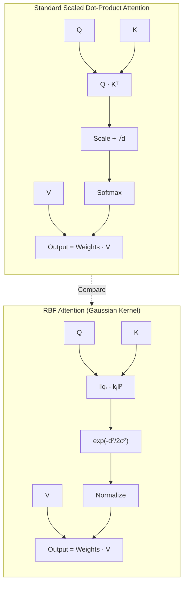
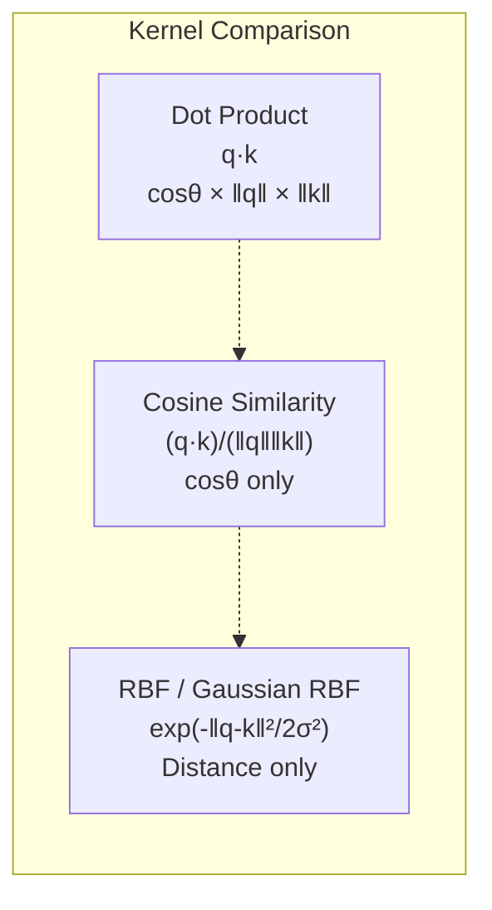
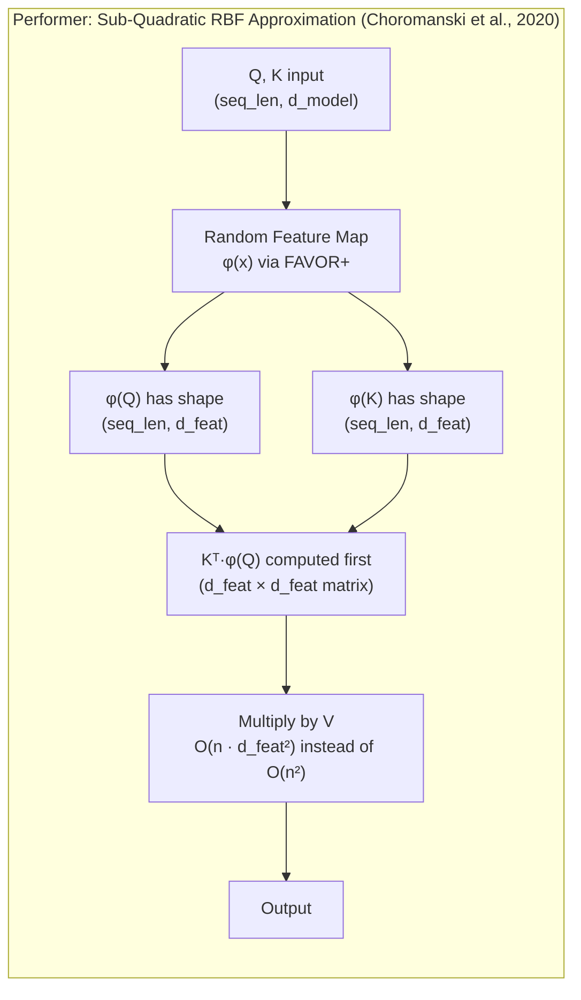

# Day 07: RBF Attention -- Radial Basis Function Attention Mechanisms

> **Watch the animation**: <video src="https://playitcooool.github.io/advanced-ai-daily/videos/07-rbf-attention.webm" autoplay loop muted playsinline width="800"></video>

---

## One-Line Summary

RBF Attention replaces the dot product in standard scaled softmax attention with a distance-based radial basis function kernel $K(Q, K) = \exp(-\|Q - K\|^2 / 2\sigma^2)$, shifting from correlation-based to similarity-based token matching, which provides better locality sensitivity, smoother attention distributions, and enables sub-quadratic approximations via random feature maps as in Performers (Choromanski et al. 2020).

---

## Why This Matters

### The Dot Product Problem

Standard Transformer attention uses the dot product as its similarity measure:

$$
\text{Attention}(Q, K, V) = \text{softmax}\left(\frac{QK^\top}{\sqrt{d}}\right) V
$$

The dot product works well because it is computationally efficient and mathematically convenient, but it has several limitations:

1. **Angle + magnitude conflation**: The dot product $q \cdot k = \|q\| \|k\| \cos\theta$ conflates the angle between vectors with their individual magnitudes. Large-magnitude tokens can dominate attention regardless of semantic similarity.
2. **Unbounded scores**: Dot product scores range from $-\infty$ to $+\infty$, making the softmax distribution highly sensitive to outliers in the pre-activation space.
3. **No inherent distance decay**: Dot product does not naturally decay with distance in embedding space, which makes attention less localized in the geometric sense.

### RBF Attention's Core Insight

RBF (Radial Basis Function) attention asks: *Can we measure token similarity using Euclidean distance instead of dot product, and does this give us better attention properties?*

The answer is a nuanced yes. By using a Gaussian RBF kernel:

$$
A_{ij} = \exp\left(-\frac{\|q_i - k_j\|^2}{2\sigma^2}\right)
$$

We get attention that:
- Only depends on **distance**, not magnitude (translation-invariant in embedding space)
- Has a **natural decay**: tokens far apart in the embedding space get exponentially smaller attention weights
- Produces **bounded scores**: $A_{ij} \in (0, 1]$, leading to more stable optimization
- Can be factorized into **linear-time approximations** via the Performer's random feature maps

---

## Architecture Walkthrough







---

## Mathematical Formulation

### Dot Product vs RBF Kernel

The standard dot product attention:

$$
A_{ij} = \text{softmax}_j\left(\frac{q_i \cdot k_j}{\sqrt{d}}\right)
$$

The RBF (Gaussian) attention:

$$
A_{ij} = \frac{\exp\left(-\frac{\|q_i - k_j\|^2}{2\sigma^2}\right)}{\sum_{m} \exp\left(-\frac{\|q_i - k_m\|^2}{2\sigma^2}\right)}
$$

### Expanding the RBF Kernel

Using the identity $\|a - b\|^2 = \|a\|^2 - 2a \cdot b + \|b\|^2$:

$$
\exp\left(-\frac{\|q_i - k_j\|^2}{2\sigma^2}\right) = \exp\left(-\frac{\|q_i\|^2}{2\sigma^2}\right) \cdot \exp\left(\frac{q_i \cdot k_j}{\sigma^2}\right) \cdot \exp\left(-\frac{\|k_j\|^2}{2\sigma^2}\right)
$$

The first term $\exp(-\|q_i\|^2 / 2\sigma^2)$ is constant across all $j$ for a fixed query $q_i$, so it cancels out in the softmax normalization. This means:

$$
\text{softmax}_j\left(-\frac{\|q_i - k_j\|^2}{2\sigma^2}\right) = \text{softmax}_j\left(\frac{q_i \cdot k_j}{\sigma^2} - \frac{\|k_j\|^2}{2\sigma^2}\right)
$$

This reveals a deep relationship: RBF attention is dot product attention with an additional **magnitude penalty** term $-\|k_j\|^2 / 2\sigma^2$ that suppresses attention on high-magnitude keys.

### Temperature and Bandwidth Interpretation

The parameter $\sigma$ (bandwidth) controls the effective temperature of the attention distribution:

$$
\text{As } \sigma \to 0: \quad A_{ij} \to \mathbb{1}[j = \arg\min_j \|q_i - k_j\|] \quad \text{(hard nearest neighbor)}
$$

$$
\text{As } \sigma \to \infty: \quad A_{ij} \to \frac{1}{N} \quad \text{(uniform attention)}
$$

This means $\sigma$ interpolates between a hard retrieval mechanism (attend only to the single closest key) and a uniform averaging over all keys.

### Performer: Random Feature Approximation (FAVOR+)

The key insight of Performers is that the Gaussian RBF kernel can be approximated using random feature maps, enabling sub-quadratic attention computation:

$$
\exp\left(-\frac{\|x - y\|^2}{2\sigma^2}\right) \approx \phi(x)^\top \phi(y)
$$

Where $\phi(x) \in \mathbb{R}^m$ is a random feature vector. Using the FAVOR+ mechanism:

$$
\phi(x) = \frac{1}{\sqrt{m}} \begin{bmatrix}
\exp\left(-\frac{\|x\|^2}{2\sigma^2}\right) \exp(\omega_1^\top x / \sigma) \\
\vdots \\
\exp\left(-\frac{\|x\|^2}{2\sigma^2}\right) \exp(\omega_m^\top x / \sigma)
\end{bmatrix}
$$

Where $\omega_1, \ldots, \omega_m \sim \mathcal{N}(0, I)$ are random projections.

With this approximation, attention can be rewritten:

$$
\text{Attention}(Q, K, V)_i = \frac{\sum_j \phi(q_i)^\top \phi(k_j) v_j}{\sum_j \phi(q_i)^\top \phi(k_j)} = \frac{\phi(q_i)^\top \left(\sum_j \phi(k_j) v_j^\top\right)^\top}{\phi(q_i)^\top \left(\sum_j \phi(k_j)\right)}
$$

The key is that $\sum_j \phi(k_j) v_j^\top$ can be pre-computed in $O(n \cdot m \cdot d_v)$ time, independent of sequence length for the final step. Total complexity becomes $O(n \cdot m \cdot (d + d_v))$ instead of $O(n^2 \cdot d)$.

### Cosine Attention (cosFormer)

The cosFormer (Chen et al., 2022) uses a cosine-based kernel with a reweighting mechanism to capture locality without explicit position encoding:

$$
A_{ij} = \frac{\cos(\theta_{ij}) \cdot \text{reweight}(i, j)}{\sum_m \cos(\theta_{im}) \cdot \text{reweight}(i, m)}
$$

Where $\theta_{ij}$ is the angle between $q_i$ and $k_j$, and the reweighting function incorporates positional information.

---

## Parameter Comparison

| Dimension | Standard Attention | RBF Attention | Performer (FAVOR+) |
|---|---|---|---|
| Kernel | $q \cdot k / \sqrt{d}$ | $\exp(-\|q-k\|^2/2\sigma^2)$ | Random feature approximation |
| Hyperparameters | None (just $\sqrt{d}$ scaling) | Bandwidth $\sigma$ | Number of random features $m$ |
| Score range | $(-\infty, +\infty)$ | $(0, 1]$ | $(0, \infty)$ |
| Magnitude sensitivity | High (conflates angle + magnitude) | None (translation invariant) | Depends on feature map normalization |
| Computational complexity | $O(n^2 d)$ | $O(n^2 d)$ + distance computation | $O(n \cdot m \cdot d)$ |
| Sub-quadratic version | FlashAttention (I/O optimization) | Not directly | FAVOR+ random features |
| Best for | General-purpose, well-tuned | Locality-sensitive tasks, smooth attention | Long sequences, sub-quadratic need |

---

## Python Code Implementation

```python
import torch
import torch.nn as nn
import torch.nn.functional as F
import math


# ------------------------------------------------------------------
# 1. Standard Scaled Dot-Product Attention (Reference)
# ------------------------------------------------------------------

def standard_attention(
    q: torch.Tensor,
    k: torch.Tensor,
    v: torch.Tensor,
    mask: torch.Tensor | None = None,
) -> torch.Tensor:
    """
    Standard scaled dot-product attention.

    Args:
        q: Query tensor, shape (batch, heads, seq_len, head_dim).
        k: Key tensor, shape (batch, heads, seq_len, head_dim).
        v: Value tensor, shape (batch, heads, seq_len, head_dim).
        mask: Optional attention mask.

    Returns:
        output: Attention output, shape (batch, heads, seq_len, head_dim).
    """
    d_k = q.size(-1)
    scores = torch.matmul(q, k.transpose(-2, -1)) / math.sqrt(d_k)

    if mask is not None:
        scores = scores.masked_fill(mask == 0, float("-inf"))

    weights = F.softmax(scores, dim=-1)
    return torch.matmul(weights, v)


# ------------------------------------------------------------------
# 2. RBF (Gaussian) Attention
# ------------------------------------------------------------------

def compute_pairwise_sq_dist(
    q: torch.Tensor, k: torch.Tensor
) -> torch.Tensor:
    """
    Efficiently compute pairwise squared Euclidean distances.

    Uses the identity: ||q - k||^2 = ||q||^2 - 2*q.k + ||k||^2

    Args:
        q: Query tensor, shape (..., seq_len_q, d).
        k: Key tensor, shape (..., seq_len_k, d).

    Returns:
        dist: Pairwise squared distance, shape (..., seq_len_q, seq_len_k).
    """
    q_sq = (q ** 2).sum(dim=-1, keepdim=True)  # (..., seq_q, 1)
    k_sq = (k ** 2).sum(dim=-1, keepdim=True)  # (..., seq_k, 1)

    # ||q - k||^2 = ||q||^2 + ||k||^2 - 2*q.k
    dist = q_sq + k_sq.transpose(-2, -1) - 2 * torch.matmul(q, k.transpose(-2, -1))

    # Clamp to avoid small negative values from floating point
    return dist.clamp(min=0.0)


def rbf_attention(
    q: torch.Tensor,
    k: torch.Tensor,
    v: torch.Tensor,
    sigma: float = 1.0,
    mask: torch.Tensor | None = None,
) -> torch.Tensor:
    """
    Radial Basis Function (Gaussian) attention.

    Uses exp(-||q - k||^2 / (2 * sigma^2)) as the attention kernel.

    Args:
        q: Query tensor, shape (batch, heads, seq_len, head_dim).
        k: Key tensor, shape (batch, heads, seq_len, head_dim).
        v: Value tensor, shape (batch, heads, seq_len, head_dim).
        sigma: RBF bandwidth parameter (controls attention sharpness).
        mask: Optional attention mask.

    Returns:
        output: Attention output, shape (batch, heads, seq_len, head_dim).
    """
    # Compute pairwise squared distances
    dist_sq = compute_pairwise_sq_dist(q, k)  # (batch, heads, seq_q, seq_k)

    # Apply Gaussian RBF kernel
    scores = -dist_sq / (2.0 * sigma ** 2)  # (batch, heads, seq_q, seq_k)

    if mask is not None:
        scores = scores.masked_fill(mask == 0, float("-inf"))

    weights = F.softmax(scores, dim=-1)
    return torch.matmul(weights, v)


# ------------------------------------------------------------------
# 3. Hybrid Attention: Dot Product + RBF Regularization
# ------------------------------------------------------------------

def hybrid_attention(
    q: torch.Tensor,
    k: torch.Tensor,
    v: torch.Tensor,
    alpha: float = 0.5,
    sigma: float = 1.0,
    mask: torch.Tensor | None = None,
) -> torch.Tensor:
    """
    Hybrid attention that blends dot product and RBF scores.

    Args:
        q: Query tensor, shape (batch, heads, seq_len, head_dim).
        k: Key tensor, shape (batch, heads, seq_len, head_dim).
        v: Value tensor, shape (batch, heads, seq_len, head_dim).
        alpha: Mixing coefficient (0 = pure dot product, 1 = pure RBF).
        sigma: RBF bandwidth parameter.
        mask: Optional attention mask.

    Returns:
        output: Attention output, shape (batch, heads, seq_len, head_dim).
    """
    d_k = q.size(-1)

    # Dot product scores (logits)
    dot_scores = torch.matmul(q, k.transpose(-2, -1)) / math.sqrt(d_k)

    # RBF scores (logits)
    dist_sq = compute_pairwise_sq_dist(q, k)
    rbf_scores = -dist_sq / (2.0 * sigma ** 2)

    # Blend
    combined_scores = (1 - alpha) * dot_scores + alpha * rbf_scores

    if mask is not None:
        combined_scores = combined_scores.masked_fill(mask == 0, float("-inf"))

    weights = F.softmax(combined_scores, dim=-1)
    return torch.matmul(weights, v)


# ------------------------------------------------------------------
# 4. Performer-style FAVOR+ Linear Attention (Simplified)
# ------------------------------------------------------------------

def favorable_feature_map(
    x: torch.Tensor,
    omega: torch.Tensor,
    sigma: float = 1.0,
    normalize: bool = True,
) -> torch.Tensor:
    """
    FAVOR+ random feature map for the Gaussian RBF kernel.

    Implements the unbiased estimator:
    phi(x) = exp(-||x||^2 / (2*sigma^2)) * (1/sqrt(m)) * exp(omega^T x / sigma)

    Args:
        x: Input tensor, shape (batch, heads, seq_len, d).
        omega: Random projection matrix, shape (d, m).
        sigma: RBF bandwidth parameter.
        normalize: Apply normalization for numerical stability.

    Returns:
        phi: Feature map, shape (batch, heads, seq_len, m).
    """
    # Magnitude term: exp(-||x||^2 / (2*sigma^2))
    norm_sq = (x ** 2).sum(dim=-1, keepdim=True)  # (b, h, seq, 1)
    magnitude = torch.exp(-norm_sq / (2.0 * sigma ** 2))

    # Random projection: exp(omega^T x / sigma)
    proj = torch.matmul(x, omega) / sigma  # (b, h, seq, m)

    # Combine
    phi = magnitude * torch.exp(proj)  # (b, h, seq, m)

    if normalize:
        # Numerical stability: divide by sqrt(sum of squares)
        normalizer = phi.sum(dim=-1, keepdim=True).clamp(min=1e-12)
        phi = phi / normalizer.sqrt()

    return phi


def performer_attention(
    q: torch.Tensor,
    k: torch.Tensor,
    v: torch.Tensor,
    num_features: int = 256,
    sigma: float = 1.0,
    seed: int = 42,
) -> torch.Tensor:
    """
    Performer-style linear attention using FAVOR+ random feature approximation.

    This achieves O(n * m * d) complexity instead of O(n^2 * d).

    Args:
        q: Query tensor, shape (batch, heads, seq_len, d).
        k: Key tensor, shape (batch, heads, seq_len, d).
        v: Value tensor, shape (batch, heads, seq_len, d_v).
        num_features: Number of random features m.
        sigma: RBF bandwidth parameter.
        seed: Random seed for reproducibility.

    Returns:
        output: Attention output, shape (batch, heads, seq_len, d_v).
    """
    batch_size, num_heads, seq_len, d_model = q.shape
    _, _, _, d_v = v.shape

    # Generate random projections (shared across all heads and batches)
    torch.manual_seed(seed)
    omega = torch.randn(d_model, num_features, device=q.device, dtype=q.dtype)

    # Compute feature maps
    phi_q = favorable_feature_map(q, omega, sigma)  # (b, h, n, m)
    phi_k = favorable_feature_map(k, omega, sigma)  # (b, h, n, m)

    # Compute KV aggregation: sum_j(phi(k_j) * v_j^T) -> (b, h, m, d_v)
    kv = torch.matmul(phi_k.transpose(-2, -1), v)  # (b, h, m, d_v)

    # Compute outputs: phi(q_i) * KV -> (b, h, n, d_v)
    numerator = torch.matmul(phi_q, kv)  # (b, h, n, d_v)

    # Normalization: sum_j(phi(k_j))
    denominator = torch.matmul(
        phi_q, phi_k.transpose(-2, -1).sum(dim=-2, keepdim=True)
    ).clamp(min=1e-12)  # (b, h, n, 1)

    output = numerator / denominator

    return output


# ------------------------------------------------------------------
# 5. Learnable Sigma RBF Attention Layer
# ------------------------------------------------------------------

class RBFMultiHeadAttention(nn.Module):
    """
    Multi-head attention with learnable RBF bandwidth parameter.

    Each head gets its own learnable sigma, allowing different
    attention heads to specialize in different scales of similarity.

    Args:
        d_model: Model dimension (must be divisible by num_heads).
        num_heads: Number of attention heads.
        init_sigma: Initial value for the RBF bandwidth.
    """

    def __init__(
        self, d_model: int, num_heads: int, init_sigma: float = 1.0
    ):
        super().__init__()
        assert d_model % num_heads == 0
        self.d_model = d_model
        self.num_heads = num_heads
        self.head_dim = d_model // num_heads

        self.w_q = nn.Linear(d_model, d_model)
        self.w_k = nn.Linear(d_model, d_model)
        self.w_v = nn.Linear(d_model, d_model)
        self.w_o = nn.Linear(d_model, d_model)

        # Learnable sigma per head
        self.sigma = nn.Parameter(torch.full((num_heads,), init_sigma))

    def forward(
        self, x: torch.Tensor, mask: torch.Tensor | None = None
    ) -> torch.Tensor:
        """
        Forward pass through RBF multi-head attention.

        Args:
            x: Input tensor, shape (batch, seq_len, d_model).
            mask: Optional attention mask, shape (batch, seq_len, seq_len).

        Returns:
            output: Attention output, shape (batch, seq_len, d_model).
        """
        batch_size, seq_len, _ = x.shape

        # Project to Q, K, V
        q = self.w_q(x).view(batch_size, seq_len, self.num_heads, self.head_dim)
        k = self.w_k(x).view(batch_size, seq_len, self.num_heads, self.head_dim)
        v = self.w_v(x).view(batch_size, seq_len, self.num_heads, self.head_dim)

        # Transpose to (batch, heads, seq, head_dim)
        q = q.transpose(1, 2)
        k = k.transpose(1, 2)
        v = v.transpose(1, 2)

        # Expand sigma to (1, heads, 1, 1) for broadcasting
        sigma = self.sigma.view(1, self.num_heads, 1, 1)
        sigma = sigma.clamp(min=1e-3)  # Prevent degenerate sigma

        out_per_head: list[torch.Tensor] = []
        for h in range(self.num_heads):
            dist_sq = compute_pairwise_sq_dist(q[:, h:h+1], k[:, h:h+1])
            scores = -dist_sq / (2.0 * sigma[:, h:h+1] ** 2)

            if mask is not None:
                scores = scores.masked_fill(mask == 0, float("-inf"))

            weights = F.softmax(scores, dim=-1)
            out_h = torch.matmul(weights, v[:, h:h+1])
            out_per_head.append(out_h)

        out = torch.cat(out_per_head, dim=1)  # (batch, heads, seq, head_dim)
        out = out.transpose(1, 2).contiguous().view(batch_size, seq_len, self.d_model)

        return self.w_o(out)


# ------------------------------------------------------------------
# Example usage
# ------------------------------------------------------------------
if __name__ == "__main__":

    torch.manual_seed(42)

    # ---- 1. Compare Standard vs RBF Attention ----
    print("=" * 60)
    print("1. Standard vs RBF Attention Comparison")
    print("=" * 60)

    batch, heads, seq_len, head_dim = 1, 2, 8, 16
    q = torch.randn(batch, heads, seq_len, head_dim)
    k = torch.randn(batch, heads, seq_len, head_dim)
    v = torch.randn(batch, heads, seq_len, head_dim)

    std_out = standard_attention(q, k, v)
    rbf_out = rbf_attention(q, k, v, sigma=1.0)

    print(f"Standard attention output norm: {std_out.norm().item():.4f}")
    print(f"RBF attention output norm:      {rbf_out.norm().item():.4f}")
    print(f"Output similarity (cosine):     {F.cosine_similarity(std_out, rbf_out, dim=-1).mean().item():.4f}")
    print()

    # ---- 2. Effect of sigma on attention distribution ----
    print("=" * 60)
    print("2. Effect of sigma on attention sharpness")
    print("=" * 60)

    q_single = torch.randn(1, 1, 1, 4)
    k_multi = torch.randn(1, 1, 10, 4)

    for sigma in [0.5, 1.0, 2.0, 5.0]:
        dist_sq = compute_pairwise_sq_dist(q_single, k_multi)
        scores = -dist_sq / (2.0 * sigma ** 2)
        weights = F.softmax(scores, dim=-1)
        entropy = -(weights * (weights + 1e-10).log()).sum().item()
        print(f"  sigma={sigma:.1f}: entropy={entropy:.4f}, max_weight={weights.max().item():.4f}")
    print()

    # ---- 3. Hybrid Attention ----
    print("=" * 60)
    print("3. Hybrid Attention (alpha sweep)")
    print("=" * 60)

    for alpha in [0.0, 0.25, 0.5, 0.75, 1.0]:
        hybrid_out = hybrid_attention(q, k, v, alpha=alpha, sigma=1.0)
        sim = F.cosine_similarity(std_out, hybrid_out, dim=-1).mean().item()
        print(f"  alpha={alpha:.2f}: similarity to standard = {sim:.4f}")
    print()

    # ---- 4. Performer Linear Attention ----
    print("=" * 60)
    print("4. Performer Linear Attention (long sequence)")
    print("=" * 60)

    long_seq_len = 1000
    q_long = torch.randn(1, 2, long_seq_len, 32)
    k_long = torch.randn(1, 2, long_seq_len, 32)
    v_long = torch.randn(1, 2, long_seq_len, 32)

    performer_out = performer_attention(q_long, k_long, v_long, num_features=256, sigma=1.0)
    print(f"  Performer output shape: {performer_out.shape}")
    print(f"  Performer output norm:  {performer_out.norm().item():.4f}")
    print()

    # ---- 5. Learnable Sigma RBF Attention ----
    print("=" * 60)
    print("5. Learnable Sigma RBF Attention Layer")
    print("=" * 60)

    x = torch.randn(2, 16, 64)  # (batch, seq, d_model)
    rbf_mha = RBFMultiHeadAttention(d_model=64, num_heads=4, init_sigma=1.0)
    output = rbf_mha(x)
    print(f"  Input shape:  {x.shape}")
    print(f"  Output shape: {output.shape}")
    print(f"  Learned sigma values per head: {rbf_mha.sigma.data.tolist()}")
```

---

## Deep Dive

### Why RBF Attention Produces Smoother Distributions

The RBF kernel $\exp(-\|q-k\|^2/2\sigma^2)$ is a smooth, infinitely differentiable function. In contrast, the dot product $q \cdot k$ is linear in each input. The nonlinearity of the RBF kernel means that:

1. **Outlier suppression**: Keys that are far from the query in Euclidean distance receive exponentially (not just linearly) smaller attention weights.
2. **Translation invariance**: Adding a constant vector to all query and key embeddings does not change the attention pattern, because distances are preserved. This is not true for dot product attention.
3. **Magnitude normalization**: Two vectors with the same direction but different magnitudes are treated identically. This is desirable when the direction of the embedding encodes semantic meaning while the magnitude is an artifact of the token frequency or other non-semantic factors.

### The Bandwidth Selection Problem

Choosing the right $\sigma$ is critical for RBF attention. If $\sigma$ is too small, attention becomes essentially hard nearest-neighbor (each query attends to its single closest key). If $\sigma$ is too large, attention approaches uniform distribution, losing all discriminative power.

In practice, $\sigma$ can be:
- **Tuned as a hyperparameter**: sweep values like 0.1, 0.5, 1.0, 2.0, 5.0
- **Learned per head**: as in the `RBFMultiHeadAttention` class, each head learns its own bandwidth
- **Set adaptively**: using the median heuristic (set $\sigma$ to the median of pairwise distances in the batch)

### When RBF Attention Outperforms Dot Product

RBF attention tends to outperform standard attention in:
- **Retrieval-augmented tasks**: where geometric proximity in embedding space directly correlates with relevance
- **Long-context coherence**: the distance-based decay naturally prevents distant irrelevant tokens from contributing
- **Noisy embeddings**: RBF is more robust to noise in the magnitude dimension of embeddings
- **Multi-modal alignment**: when aligning different modalities (text-image, text-audio), distance-based similarity can be more meaningful than dot product

### When Standard Attention Is Better

Standard attention remains superior for:
- **General pre-training**: the massive pre-training literature optimizes for dot product attention
- **Tasks requiring magnitude information**: when the magnitude of key vectors encodes useful signal (e.g., token importance)
- **When computational efficiency is critical**: the Performer approximation introduces approximation error, and exact RBF has the same $O(n^2)$ complexity as standard attention

---

## Common Misconceptions

| Misconception | Reality |
|---|---|
| "RBF attention is always better than dot product" | It depends on the task; dot product has been optimized over years of pre-training and has strong inductive biases for language |
| "RBF attention is sub-quadratic by default" | No -- only when combined with random feature approximations (Performer/FAVOR+); exact RBF attention is also O(n^2) |
| "Sigma does not matter much" | Sigma is the most critical hyperparameter in RBF attention; wrong sigma choices can cause either hard attention or uniform attention |
| "Performer approximation is lossless" | FAVOR+ is an unbiased estimator but has variance; with too few random features, the approximation error can be significant |
| "RBF and cosine attention are the same" | They are related but different: RBF uses Euclidean distance, cosine uses angular distance; they are equivalent only when inputs are normalized to unit sphere |

---

## Exercises

1. **Visualization**: Plot attention weight matrices for standard attention and RBF attention (with different sigma values) on the same input. How do the heatmaps differ? Is the RBF attention more diagonal-focused?

2. **Sigma ablation study**: Train a small Transformer with RBF attention using sigma values of 0.5, 1.0, 2.0, 5.0. Plot validation perplexity vs sigma. Where is the optimum?

3. **Learnable vs fixed sigma**: Compare the performance of a model with learnable sigma per head vs a fixed global sigma. Does the model learn different bandwidths for different heads? Do certain heads specialize in "local" vs "global" attention?

4. **Implement median heuristic**: Implement an adaptive sigma selector that sets $\sigma$ to the median of all pairwise distances in the batch. Compare this to learnable sigma in terms of validation accuracy and convergence speed.

5. **Performer vs standard attention speed benchmark**: For sequence lengths of 256, 512, 1024, 2048, and 4096, benchmark the wall-clock time of exact RBF attention vs Performer approximation. At what sequence length does the Performer become faster? How does the approximation error change with the number of random features?

---

## References

| Paper | arXiv | Key Contribution |
|---|---|---|
| Performers: Rethinking Attention with Performers | 2009.14794 | Sub-quadratic attention via random feature maps (FAVOR+) |
| cosFormer: Rethinking Softmax in Attention | 2202.08791 | Cosine-based kernel with locality reweighting |
| Attention Is All You Need | 1706.03762 | Original scaled dot-product attention formulation |

---

## Navigation

[[Day 06: Quantization]](06-quantization.md) | **Day 07: RBF Attention** | [[Day 08: Memory & KV Cache]](08-memory-kv-cache.md)
