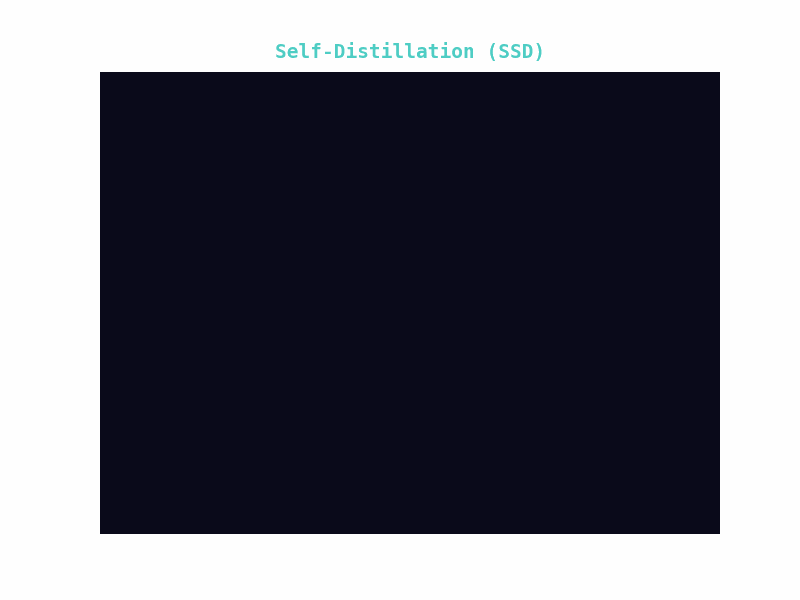
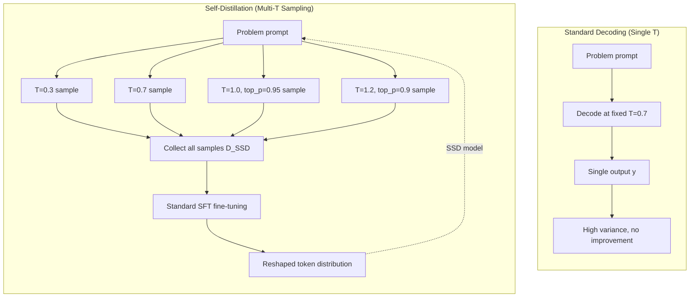
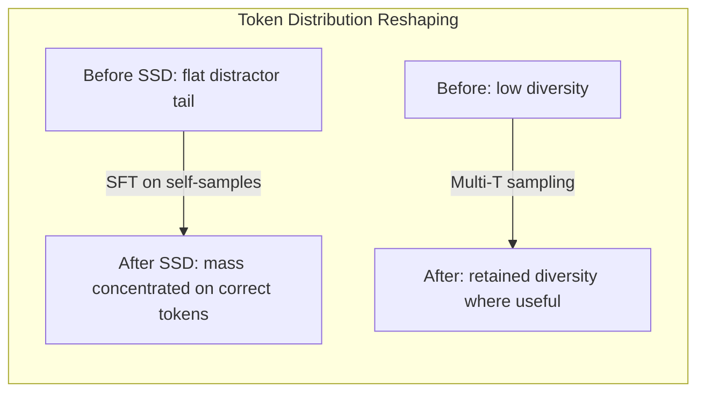

# Day 09: Simple Self-Distillation (SSD) -- Improving Code Generation Without Verifiers or RL

> **Watch the animation**: 

---

## One-Line Summary

Simple Self-Distillation (SSD) samples a model's own outputs at carefully chosen temperature and truncation settings, then fine-tunes via standard SFT to improve code generation -- Qwen3-30B-Instruct jumps from 42.4% to 55.3% pass@1 on LiveCodeBench v6, without any verifier, teacher model, or reinforcement learning.

---

## Why This Matters

### The Post-Training Arms Race

Most recent advances in LLM post-training rely on complex pipelines:
- **RLHF/RLVR**: Requires reward models, preference data, and careful reward shaping
- **Self-improvement with verifiers**: Depends on executable test cases or external validators
- **Teacher-student distillation**: Requires a stronger model to generate quality data

The fundamental question SSD asks: *Can a model improve at code generation using only its own raw outputs, with no external signal?*

### The Precision-Exploration Conflict

SSD's key insight is a **precision-exploration conflict** in LLM decoding:

At each token position during code generation, the model faces two competing demands:
- **Precision**: For syntactically critical tokens (keywords, operators, brackets), the model must output the exact right token
- **Exploration**: For semantic choices (algorithm approach, variable naming, logic branching), the model benefits from diverse sampling

Standard sampling with a single temperature setting cannot satisfy both simultaneously. High temperature improves exploration but destroys precision on critical tokens. Low temperature ensures precision but kills useful diversity.

### How SSD Resolves This

SSD resolves the conflict by **sampling at multiple temperature and truncation settings**, creating a diverse yet quality-filtered dataset:

1. **Sample broadly**: Generate N solutions per problem using different temperature and top-p/truncation configurations
2. **Implicit quality filtering**: Higher temperature samples naturally concentrate probability mass on correct completions for easier problems, while harder problems benefit from exploration
3. **Fine-tune on the mix**: Standard SFT on this self-generated dataset reshapes the token distribution in a context-dependent way

$$
D_{\text{SSD}} = \bigcup_{j=1}^{M} \left\{ \text{sample}(x_i; T_j, p_j) \right\}_{i=1}^{N_{\text{problems}}}
$$

$$
\theta_{\text{SSD}} = \arg\max_\theta \sum_{(x, y) \in D_{\text{SSD}}} \log p_\theta(y | x)
$$

After a single round of SFT on this self-generated data, the model's token distributions are reshaped:
- Distractor tails are suppressed where precision matters
- Useful diversity is preserved where exploration matters

---

## Architecture Walkthrough





---

## Mathematical Formulation

### The Precision-Exploration Tradeoff

Consider a code generation problem with input x and target solution y*. The LLM produces a token distribution p(y_t | y_{<t}, x) at each step t.

We can decompose the token positions into two sets:
- **Precision tokens** P: positions where only one or a few tokens are acceptable (syntax-critical positions)
- **Exploration tokens** E: positions where multiple valid continuations exist (semantic/logic choices)

With a single temperature T, the softmax output is:

$$
p_T(y_t) = \frac{\exp(z_{y_t} / T)}{\sum_{v} \exp(z_v / T)}
$$

The optimal temperature T* would:
- Set T -> 0 for tokens in P (deterministic precision)
- Set T high for tokens in E (maintain useful diversity)

Since we cannot condition T on the token position type, we get suboptimal behavior. However, by sampling at multiple temperatures:

$$
\{y^{(j)} \sim p_{T_j}(y | x)\}_{j=1}^M
$$

The union of these samples creates a training distribution that implicitly captures both regimes. The SFT objective then learns to:

$$
\nabla_\theta \mathcal{L}_{\text{SSD}} = -\sum_{j} \sum_t \nabla_\theta \log p_\theta(y^{(j)}_t | y^{(j)}_{<t}, x)
$$

This gradient pushes the model toward modes that appear across multiple temperature settings, effectively implementing a form of **consensus distillation**.

### Why Self-Samples Work

Consider a problem where the model's pass@N with N samples is already non-trivial. By construction, some fraction of the self-generated samples are correct. SFT on this mixture:

1. **Amplifies correct patterns**: Correct solutions appear multiple times across different temperature settings, so their token sequences receive stronger gradient updates
2. **Suppresses distractors**: Incorrect samples are diverse and don't reinforce each other, so their gradient signals cancel out
3. **Context-dependent reshaping**: The model learns *when* to be precise (where all temperatures agree) and *when* to explore (where temperatures diverge but still produce valid code)

Formally, the expected pass@1 after training is:

$$
\mathbb{E}[\text{pass@1}_{\text{post}}] \approx \mathbb{E}[\text{pass@1}_{\text{pre}}] + \alpha \cdot \text{pass@N}_{\text{pre}} \cdot (1 - \text{pass@1}_{\text{pre}})
$$

Where alpha captures the training efficiency factor. The gain is largest when:
- pass@N is non-negligible (the model *can* solve the problem, just not reliably)
- pass@1 is far from 1.0 (there's room for improvement)

This explains why SSD concentrates its gains on harder problems.

---

## Experimental Results Summary

| Model | Pre-SSD pass@1 | Post-SSD pass@1 | Absolute Gain |
|-------|---------------|-----------------|---------------|
| Qwen3-30B-Instruct | 42.4% | **55.3%** | +12.9% |
| Qwen3-8B-Instruct | baseline | **+9-11%** | +9-11% |
| Qwen3-4B-Instruct | baseline | **+8-10%** | +8-10% |
| Llama variants (4B-30B) | baseline | **+6-10%** | +6-10% |

Key findings:
- **No verifier needed**: Unlike self-improvement methods that filter by execution pass/fail
- **No teacher model needed**: The model distills from itself
- **No RL needed**: Standard SFT is sufficient
- **Gains concentrate on harder problems**: The pass@N > pass@1 gap is where self-samples add most value
- **Generalizes across model families**: Works on both Qwen and Llama
- **Works at all scales**: Gains observed at 4B, 8B, and 30B
- **Works on both instruct and thinking variants**

---

## Comparison of Post-Training Methods

| Method | External Signal | Complexity | Data Sources | Typical Gain on Code |
|--------|----------------|------------|-------------|---------------------|
| **SSD (this work)** | **None** | **Low** | **Self-generated** | **+8 to +13%** |
| RLVR (with verifiers) | Executable tests | High | Self-generated + filter | +10 to +15% |
| Teacher-student distillation | Stronger model | Medium | Teacher-generated | +5 to +12% |
| Self-improvement (STaR) | Verifier/filter | Medium | Self-generated + filter | +5 to +10% |
| RLHF (preference) | Human/AI preferences | High | Preference pairs | +2 to +5% |
| Standard SFT | Labeled data | Low | External datasets | +0 to +5% |

---

## Python Code Implementation

```python
import torch
import torch.nn as nn
import torch.nn.functional as F
from dataclasses import dataclass, field
from typing import Optional, Callable


# ------------------------------------------------------------------
# 1. Multi-Temperature Sampler (Self-Sample Generator)
# ------------------------------------------------------------------

@dataclass
class SampleConfig:
    """A single temperature/top-p configuration for sampling."""
    temperature: float
    top_p: float = 1.0
    max_new_tokens: int = 1024
    num_return_sequences: int = 4


class SelfDistillationSampler:
    """
    Generates self-samples at multiple temperature and truncation settings.

    The key insight of SSD: different temperature configurations capture
    different aspects of the model's capability -- low temperature captures
    precision-critical tokens, while high temperature enables exploration
    of diverse solution paths.

    Paper: arXiv:2604.01193 (Simple Self-Distillation Improves Code Generation)
    """

    def __init__(
        self,
        model: nn.Module,
        tokenizer,
        configs: Optional[list[SampleConfig]] = None,
        device: str = "cuda",
    ):
        """
        Args:
            model: The base LLM (frozen during sampling).
            tokenizer: Tokenizer with encode/decode methods.
            configs: List of temperature/top-p configurations.
            device: Device to run sampling on.
        """
        self.model = model
        self.tokenizer = tokenizer
        self.device = device
        self.configs = configs or [
            SampleConfig(temperature=0.3, top_p=1.0, num_return_sequences=2),
            SampleConfig(temperature=0.7, top_p=0.95, num_return_sequences=4),
            SampleConfig(temperature=1.0, top_p=0.95, num_return_sequences=4),
            SampleConfig(temperature=1.2, top_p=0.90, num_return_sequences=4),
        ]

    @torch.no_grad()
    def sample(
        self,
        prompts: list[str],
    ) -> list[tuple[str, str]]:
        """
        Generate self-samples for a list of code generation prompts.

        Args:
            prompts: List of problem descriptions / docstrings.

        Returns:
            pairs: List of (prompt, generated_solution) tuples.
        """
        all_pairs: list[tuple[str, str]] = []

        for config in self.configs:
            for prompt in prompts:
                input_ids = self.tokenizer.encode(prompt, return_tensors="pt")
                input_ids = input_ids.to(self.device)

                # Repeat input for num_return_sequences
                input_ids = input_ids.repeat(config.num_return_sequences, 1)

                outputs = self.model.generate(
                    input_ids,
                    max_new_tokens=config.max_new_tokens,
                    temperature=config.temperature,
                    top_p=config.top_p,
                    do_sample=True,
                    num_return_sequences=1,
                )

                for output in outputs:
                    generated = self.tokenizer.decode(
                        output[input_ids.shape[1]:],
                        skip_special_tokens=True,
                    )
                    all_pairs.append((prompt, generated))

        return all_pairs


# ------------------------------------------------------------------
# 2. SSD Fine-Tuning Dataset
# ------------------------------------------------------------------

class SSDDataset(torch.utils.data.Dataset):
    """
    Dataset for SSD fine-tuning.

    Each item is a (prompt, self_generated_solution) pair.
    The loss is standard language modeling loss conditioned on the prompt.
    """

    def __init__(
        self,
        pairs: list[tuple[str, str]],
        tokenizer,
        max_length: int = 2048,
    ):
        self.pairs = pairs
        self.tokenizer = tokenizer
        self.max_length = max_length

    def __len__(self):
        return len(self.pairs)

    def __getitem__(self, idx):
        prompt, solution = self.pairs[idx]
        full_text = f"{prompt}\n{solution}"

        encoded = self.tokenizer.encode(
            full_text,
            max_length=self.max_length,
            truncation=True,
            return_tensors="pt",
        ).squeeze(0)

        # Create labels: mask the prompt portion, only compute loss on solution
        prompt_encoded = self.tokenizer.encode(
            prompt, max_length=self.max_length, truncation=True
        )
        prompt_len = len(prompt_encoded)

        labels = encoded.clone()
        labels[:prompt_len] = -100  # Ignore prompt tokens in loss

        return {"input_ids": encoded, "labels": labels}


# ------------------------------------------------------------------
# 3. SSD Fine-Tuning Loop
# ------------------------------------------------------------------

def ssd_fine_tune(
    model: nn.Module,
    train_dataset: SSDDataset,
    learning_rate: float = 2e-5,
    batch_size: int = 4,
    num_epochs: int = 1,
    device: str = "cuda",
    gradient_accumulation_steps: int = 4,
) -> dict[str, list[float]]:
    """
    Fine-tune the model on self-generated samples using standard SFT.

    Args:
        model: The base LLM to fine-tune.
        train_dataset: Dataset of (prompt, solution) pairs.
        learning_rate: AdamW learning rate.
        batch_size: Per-device batch size.
        num_epochs: Number of fine-tuning epochs.
        device: Training device.
        gradient_accumulation_steps: Gradient accumulation steps.

    Returns:
        history: Dict with training loss per step.
    """
    model.train()
    model.to(device)

    optimizer = torch.optim.AdamW(model.parameters(), lr=learning_rate)
    dataloader = torch.utils.data.DataLoader(
        train_dataset, batch_size=batch_size, shuffle=True, drop_last=True
    )

    history: dict[str, list[float]] = {"loss": []}
    global_step = 0

    for epoch in range(num_epochs):
        total_loss = 0.0
        optimizer.zero_grad()

        for step, batch in enumerate(dataloader):
            input_ids = batch["input_ids"].to(device)
            labels = batch["labels"].to(device)
            attn_mask = (input_ids != 0).long().to(device)

            outputs = model(
                input_ids=input_ids,
                attention_mask=attn_mask,
                labels=labels,
            )
            loss = outputs.loss / gradient_accumulation_steps
            loss.backward()
            total_loss += loss.item() * gradient_accumulation_steps

            if (step + 1) % gradient_accumulation_steps == 0:
                optimizer.step()
                optimizer.zero_grad()
                loss_per_step = total_loss / gradient_accumulation_steps
                history["loss"].append(loss_per_step)
                total_loss = 0.0
                global_step += 1

                if global_step % 50 == 0:
                    avg_loss = sum(history["loss"][-50:]) / 50
                    print(f"  Step {global_step}: avg loss = {avg_loss:.4f}")

    return history


# ------------------------------------------------------------------
# 4. End-to-End SSD Pipeline
# ------------------------------------------------------------------

class SimpleSelfDistillation:
    """
    End-to-End Simple Self-Distillation pipeline.

    Usage:
        ssd = SimpleSelfDistillation(model, tokenizer)
        ssd.run(prompts)  # Sample -> SFT -> improved model

    Paper: arXiv:2604.01193
    """

    def __init__(
        self,
        model: nn.Module,
        tokenizer,
        device: str = "cuda",
        sample_configs: Optional[list[SampleConfig]] = None,
    ):
        self.model = model
        self.tokenizer = tokenizer
        self.device = device
        self.sampler = SelfDistillationSampler(
            model, tokenizer, configs=sample_configs, device=device
        )

    def run(
        self,
        prompts: list[str],
        learning_rate: float = 2e-5,
        batch_size: int = 4,
        num_epochs: int = 1,
        gradient_accumulation_steps: int = 4,
    ) -> dict:
        """
        Run the full SSD pipeline.

        Args:
            prompts: Code generation prompts to self-sample from.
            learning_rate: Fine-tuning learning rate.
            batch_size: Fine-tuning batch size.
            num_epochs: Fine-tuning epochs.
            gradient_accumulation_steps: Gradient accumulation.

        Returns:
            results: Dict with training history and sample count.
        """
        print("Phase 1: Self-sampling at multiple temperatures...")
        pairs = self.sampler.sample(prompts)
        print(f"  Generated {len(pairs)} self-samples")

        print("Phase 2: Building SSD dataset...")
        dataset = SSDDataset(pairs, self.tokenizer)
        print(f"  Dataset size: {len(dataset)}")

        print("Phase 3: Self-distillation fine-tuning (standard SFT)...")
        history = ssd_fine_tune(
            self.model,
            dataset,
            learning_rate=learning_rate,
            batch_size=batch_size,
            num_epochs=num_epochs,
            device=self.device,
            gradient_accumulation_steps=gradient_accumulation_steps,
        )

        print("Phase 4: Done. Model improved via self-distillation.")
        return {
            "n_samples": len(pairs),
            "history": history,
        }


# ------------------------------------------------------------------
# 5. Worked Example with a Toy Model
# ------------------------------------------------------------------

class TinyCodeLM(nn.Module):
    """Minimal language model for demonstrating the SSD pipeline."""

    def __init__(self, vocab_size: int = 1000, dim: int = 64, layers: int = 2):
        super().__init__()
        self.embed = nn.Embedding(vocab_size, dim)
        self.blocks = nn.ModuleList([
            nn.Sequential(
                nn.LayerNorm(dim),
                nn.Linear(dim, dim * 4),
                nn.GELU(),
                nn.Linear(dim * 4, dim),
            ) for _ in range(layers)
        ])
        self.head = nn.Linear(dim, vocab_size)

    def forward(self, x, attention_mask=None, labels=None):
        h = self.embed(x)
        for block in self.blocks:
            h = h + block(h)
        logits = self.head(h)

        if labels is not None:
            loss_fn = nn.CrossEntropyLoss(ignore_index=-100)
            loss = loss_fn(logits.view(-1, logits.size(-1)), labels.view(-1))
            return type("Output", (), {"loss": loss, "logits": logits})()
        return logits


class DummyTokenizer:
    """Minimal tokenizer for demonstration."""

    def __init__(self, vocab_size: int = 1000):
        self.vocab_size = vocab_size

    def encode(self, text: str, return_tensors=None, max_length=None,
               truncation=False, padding=False):
        # Hash-string-to-int for demo purposes
        ids = [(ord(c) % self.vocab_size) + 1 for c in text[:max_length or 128]]
        if not ids:
            ids = [0]
        if return_tensors == "pt":
            return torch.tensor([ids])
        return ids

    def decode(self, ids, skip_special_tokens=False):
        # Reverse mapping for demo
        chars = [chr((i - 1) % 126 + 1) for i in ids.tolist()
                 if hasattr(ids, "tolist") and i > 0]
        return "".join(chars)


if __name__ == "__main__":
    torch.manual_seed(42)

    # Create a tiny model
    model = TinyCodeLM(vocab_size=1000, dim=64, layers=2)
    tokenizer = DummyTokenizer()

    # Toy code generation prompts
    prompts = [
        "# Python: function to compute fibonacci\ndef fibonacci(n):",
        "# Python: function to check if palindrome\ndef is_palindrome(s):",
        "# Python: function to compute gcd\ndef gcd(a, b):",
    ]

    # Run the SSD pipeline
    ssd = SimpleSelfDistillation(
        model=model,
        tokenizer=tokenizer,
        device="cpu",
        sample_configs=[
            SampleConfig(temperature=0.3, top_p=1.0, num_return_sequences=1,
                         max_new_tokens=16),
            SampleConfig(temperature=0.7, top_p=0.95, num_return_sequences=1,
                         max_new_tokens=16),
            SampleConfig(temperature=1.0, top_p=0.95, num_return_sequences=1,
                         max_new_tokens=16),
        ],
    )

    result = ssd.run(
        prompts,
        learning_rate=1e-3,
        batch_size=2,
        num_epochs=1,
    )

    print(f"\nResult: {result['n_samples']} samples generated")
    print(f"Training losses: {result['history']['loss'][:5]}...")
```

---

## Code Walkthrough

### Step 1: Multi-Temperature Self-Sampling

```python
configs = [
    SampleConfig(temperature=0.3, top_p=1.0),   # Precision-focused
    SampleConfig(temperature=0.7, top_p=0.95),  # Balanced
    SampleConfig(temperature=1.0, top_p=0.95),  # Exploration-focused
    SampleConfig(temperature=1.2, top_p=0.90),  # High exploration
]
```

Each configuration captures different behavior:
- **Low T (0.3)**: High-confidence tokens dominate. Captures syntactically correct but possibly boilerplate solutions
- **Medium T (0.7-1.0)**: Balance of precision and diversity. Captures the widest range of correct solutions
- **High T (1.2)**: More creative/alternative approaches. Some incorrect, but captures solutions the model wouldn't produce at lower temperatures

### Step 2: Dataset Construction with Prompt Masking

```python
labels[:prompt_len] = -100  # Don't compute loss on the prompt
```

Only the self-generated solution portion contributes to the loss. This implements the standard instruction-tuning format where the model learns to complete the prompt rather than reconstruct it.

### Step 3: SFT Reshapes Token Distributions

The fine-tuning step is vanilla cross-entropy. No reward modeling, no GRPO, no DPO. The magic is entirely in the data:

- Correct self-samples appear more frequently (they're stable across temperatures)
- Incorrect samples are noisy and diverse (their signals cancel out)
- The model learns context-dependent precision: *where* to converge and *where* to maintain diversity

---

## Why This Is Important

SSD challenges the prevailing assumption that LLM improvement requires increasingly complex post-training: **no verifier, no teacher model, no RL**. It works because the model already has the capability distributed across its sampling distribution -- SSD simply concentrates it through a single round of SFT on multi-temperature self-samples.

Key limitations from the paper:
- Works best when the model already has non-negligible pass@N performance
- Gains diminish after a single round (the model converges to its self-consensus)
- Hard problems with pass@N near zero benefit less (no correct samples to amplify)

---

## Further Reading

- **SSD Paper**: [arXiv:2604.01193](https://arxiv.org/abs/2604.01193) -- Embarrassingly Simple Self-Distillation Improves Code Generation
- **STaR (Self-Taught Reasoner)**: [arXiv:2203.14465](https://arxiv.org/abs/2203.14465) -- Bootstrapping reasoning with self-generated rationales
- **ReST**: [arXiv:2308.08998](https://arxiv.org/abs/2308.08998) -- Self-Training with Reward-guided Sampling
- **GRPO (Day 01)**: [arXiv:2402.03300](https://arxiv.org/abs/2402.03300) -- Group Relative Policy Optimization (requires no critic, but needs reward signal)
