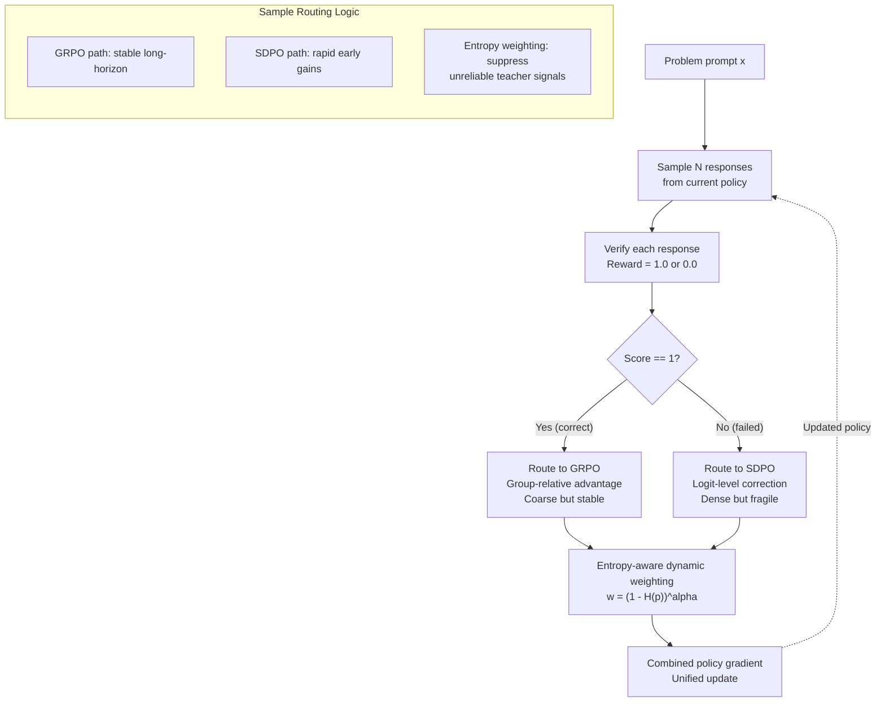
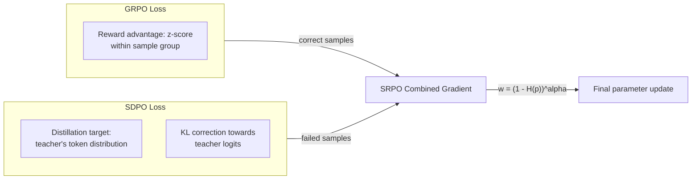

# Day 10: Sample-Routed Policy Optimization (SRPO) -- Unifying GRPO and Self-Distillation

> **Watch the animation**: <video src="https://raw.githubusercontent.com/Playitcooool/advanced-ai-daily/main/videos/10-srpo.webm" autoplay loop muted playsinline width="800"></video>

---

## One-Line Summary

SRPO unifies GRPO (reinforcement with verifiable rewards) and self-distillation into a single on-policy framework that routes correct samples to GRPO's group-relative update and failed samples to SDPO's targeted logit-level correction, achieving faster early improvement than GRPO and long-horizon stability beyond SDPO -- +3.4% over GRPO on Qwen3-8B across five math reasoning benchmarks.

---

## Why This Matters

### The Two Extremes of On-Policy RL

We've seen two complementary approaches to LLM policy optimization:

**GRPO** (Day 01): Uses group-relative advantage estimation within each sampling group. For each problem prompt, sample N responses, score them with a verifiable reward, and compute the advantage as a z-score within the group:

$$
A_i = \frac{r_i - \text{mean}(r_1, \ldots, r_N)}{\text{std}(r_1, \ldots, r_N)}
$$

GRPO's strength: stable over long training runs, no critic network needed.
GRPO's weakness: coarse credit assignment. A failed rollout gets the same negative advantage for every token, even if only a few tokens caused the error.

**Self-Distillation** (Day 09): Samples the model's own outputs at multiple temperatures, then fine-tunes via standard SFT. Correct samples are reinforced through their repeated appearance across temperatures.

Self-Distillation's strength: rapid early improvement, dense token-level supervision.
Self-Distillation's weakness: collapses during prolonged training because (1) distilling on already-correct samples creates optimization ambiguity, and (2) the self-teacher's signal reliability degrades over time.

### The Unification Insight

SRPO observes that **correct and failed samples need fundamentally different treatments**:

- **Correct samples**: Already know *what* to generate. The issue is *credit assignment* -- which tokens were the critical ones? GRPO's reward-aligned reinforcement is perfect for this.
- **Failed samples**: Know *what not to generate*. The issue is *targeted correction* -- exactly which tokens caused the failure? SDPO's logit-level supervision directly fixes the wrong predictions.

SRPO formalizes as:

$$
\mathcal{L}_{\text{SRPO}} = \sum_{i \in \text{correct}} \mathcal{L}_{\text{GRPO}}^{(i)} + \sum_{j \in \text{failed}} \mathcal{L}_{\text{SDPO}}^{(j)}
$$

With entropy-aware dynamic weighting:

$$
w_j = (1 - H(p_j))^\alpha
$$

where $H(p_j)$ is the entropy of the distillation teacher's output, so high-entropy (less confident) targets are down-weighted.

---

## Architecture Walkthrough





---

## Mathematical Formulation

### GRPO Loss (for correct samples)

For each problem with $N$ sampled outputs, compute rewards $r_1, \ldots, r_N$ and group-relative advantages:

$$
A_i = \frac{r_i - \mu_r}{\sigma_r}, \quad \text{where } \mu_r = \frac{1}{N}\sum_{i=1}^{N} r_i
$$

The GRPO policy gradient is:

$$
\mathcal{L}_{\text{GRPO}} = -\mathbb{E}_{x \sim \mathcal{D}, (o_i)_{i=1}^N \sim \pi_{\theta_{\text{old}}}(\cdot | x)} \left[ \frac{1}{N} \sum_{i=1}^{N} L_i^{\text{GRPO}} \right]
$$

$$
L_i^{\text{GRPO}} = \frac{1}{|o_i|} \sum_{t=1}^{|o_i|} \left[ \frac{\pi_\theta(o_{i,t} | x, o_{i,<t})}{\pi_{\theta_{\text{old}}}(o_{i,t} | x, o_{i,<t})} A_i - \beta \text{KL}(\pi_\theta \| \pi_{\text{ref}}) \right]
$$

### SDPO Loss (for failed samples)

For the top-$k$ incorrect samples (by quality score), use the highest-scoring sample as a teacher:

$$
\mathcal{L}_{\text{SDPO}} = \mathbb{E}_{(x, o^{\text{fail}}) \sim D_{\text{fail}}} \left[ \sum_{t=1}^{|o^{\text{fail}}|} \text{CE}(p_t^{\text{teacher}}, \pi_\theta(\cdot | x, o^{\text{fail}}_{<t})) \right]
$$

Where $p_t^{\text{teacher}}$ is the teacher model's token distribution at position $t$, and CE is cross-entropy.

### Entropy-Aware Dynamic Weighting

The teacher's output entropy measures signal reliability:

$$
H(p) = -\sum_v p(v) \log p(v)
$$

High-entropy teachers are uncertain -- their signal is unreliable. Low-entropy teachers are confident -- their corrections are trustworthy.

$$
w = (1 - H_{\text{norm}})^\alpha
$$

where $H_{\text{norm}} = H(p) / \log |V|$ normalizes to [0, 1], and $\alpha$ controls aggressiveness (typically $\alpha \in [0.5, 2.0]$).

### SRPO Unified Loss

Let $D_{\text{corr}}$ be correct samples and $D_{\text{fail}}$ be failed samples:

$$
\mathcal{L}_{\text{SRPO}} = \mathbb{E}_{x} \left[ \underbrace{\sum_{i \in D_{\text{corr}}} \mathcal{L}_{\text{GRPO}}^{(i)}}_{\text{Reinforce correct}} + \underbrace{\sum_{j \in D_{\text{fail}}} w_j \cdot \mathcal{L}_{\text{SDPO}}^{(j)}}_{\text{Correct failures with entropy weighting}} \right]
$$

This combines the best of both:
- Correct samples get GRPO reinforcement: "what went right, reinforce it"
- Failed samples get SDPO correction: "fix the specific wrong tokens"
- The entropy weight prevents SDPO from degrading when the teacher is uncertain

---

## Comparison of RLVR Methods

| Method | Early Improvement | Late-Stage Stability | Credit Assignment | Signal Reliability | Compute Cost |
|--------|------------------|---------------------|-------------------|-------------------|-------------|
| **SRPO** | **Fast** | **High** | **Adaptive** | **Entropy-gated** | **Baseline** |
| GRPO | Slow | High | Coarse (group-level) | Reward-based | Baseline |
| SDPO | Fast | Low (collapses) | Fine (logit-level) | Degrades over time | Baseline |
| PPO | Moderate | High | Token-level (critic) | Critic-dependent | +Critic cost |
| DPO | N/A (offline) | N/A | N/A | Preference-dependent | N/A |

SRPO achieves the rapid early convergence of SDPO with the long-horizon stability of GRPO, all without adding a critic network or preference data.

---

## Key Contributions

1. **Unification**: First framework to formally connect group-relative RL (GRPO) and self-distillation (SDPO) within a single optimization objective
2. **Sample routing**: Theoretical analysis showing that correct and failed samples require fundamentally different optimization strategies
3. **Entropy-aware weighting**: Dynamic mechanism that automatically suppresses noisy distillation targets without manual thresholds
4. **Empirical results**: +3.4% over GRPO on Qwen3-8B, +6.3% over SDPO, 17.2% lower per-step compute cost

---

## Python Code Implementation

```python
import torch
import torch.nn as nn
import torch.nn.functional as F
from dataclasses import dataclass
from typing import Optional


# ------------------------------------------------------------------
# 1. GRPO Advantage Computation (Recall from Day 01)
# ------------------------------------------------------------------

def grpo_advantages(rewards: torch.Tensor) -> torch.Tensor:
    """
    Compute group-relative advantage estimates.

    Args:
        rewards: Tensor of shape (batch_size, group_size, n_samples_per_group)
                 or equivalently: for each problem, a list of reward scores.
                 Simplified here: rewards of shape (n_rollouts,).

    Returns:
        advantages: Z-score normalized advantages.
    """
    # For a single group of N responses
    group_mean = rewards.mean()
    group_std = rewards.std(unbiased=False) + 1e-8
    return (rewards - group_mean) / group_std


def grpo_loss(
    log_probs: torch.Tensor,
    old_log_probs: torch.Tensor,
    advantages: torch.Tensor,
    ref_log_probs: Optional[torch.Tensor] = None,
    beta: float = 0.01,
    clip_epsilon: float = 0.2,
) -> torch.Tensor:
    """
    Compute the GRPO policy gradient loss.

    Args:
        log_probs: Current policy log probabilities, shape (n_tokens,).
        old_log_probs: Old policy log probabilities, shape (n_tokens,).
        advantages: Per-rollout advantages, shape (n_rollouts,).
        ref_log_probs: Reference model log probs for KL penalty.
        beta: KL penalty coefficient.
        clip_epsilon: PPO-style clipping epsilon.

    Returns:
        loss: Scalar GRPO loss.
    """
    ratio = (log_probs - old_log_probs).exp()
    clipped = ratio.clamp(1 - clip_epsilon, 1 + clip_epsilon)

    # Expand advantages to per-token level
    # Each rollout produces multiple tokens; advantage is per-rollout
    pg_loss = -torch.min(ratio * advantages, clipped * advantages).mean()

    kl_loss = torch.tensor(0.0, device=log_probs.device)
    if ref_log_probs is not None:
        kl_penalty = (ref_log_probs - log_probs).mean()
        kl_loss = beta * kl_penalty

    return pg_loss + kl_loss


# ------------------------------------------------------------------
# 2. SDPO Loss (Self-Distillation Policy Optimization)
# ------------------------------------------------------------------

def sdpo_loss(
    student_logits: torch.Tensor,
    teacher_logits: torch.Tensor,
    mask: Optional[torch.Tensor] = None,
    temperature: float = 1.0,
) -> torch.Tensor:
    """
    Compute the self-distillation policy optimization loss.

    This is a cross-entropy loss where the target is the teacher
    model's token distribution (the highest-scoring self-sample).

    Args:
        student_logits: Current student logits, shape (n_tokens, vocab_size).
        teacher_logits: Teacher model logits (from best self-sample),
                        shape (n_tokens, vocab_size).
        mask: Valid token mask, shape (n_tokens,).
        temperature: Distillation temperature.

    Returns:
        loss: Scalar SDPO loss.
    """
    student_dist = F.log_softmax(student_logits / temperature, dim=-1)
    teacher_dist = F.softmax(teacher_logits / temperature, dim=-1)

    # KL-divergence based distillation: sum teacher_dist * log(student_dist)
    per_token_kl = F.kl_div(student_dist, teacher_dist, reduction="none").sum(-1)

    if mask is not None:
        per_token_kl = per_token_kl[mask]

    return per_token_kl.mean()


# ------------------------------------------------------------------
# 3. Entropy-Aware Dynamic Weighting
# ------------------------------------------------------------------

def entropy_weight(
    teacher_logits: torch.Tensor,
    alpha: float = 1.0,
) -> torch.Tensor:
    """
    Compute entropy-aware dynamic weight for distillation signal.

    High-entropy teachers (uncertain) get lower weight;
    confident teachers get higher weight.

    Args:
        teacher_logits: Teacher logits, shape (..., vocab_size).
        alpha: Weighting aggressiveness parameter.

    Returns:
        weight: Scalar weight in [0, 1].
    """
    teacher_dist = F.softmax(teacher_logits, dim=-1)
    # Entropy H(p) = -sum p(x) log p(x)
    entropy = -(teacher_dist * (teacher_dist + 1e-10).log()).sum(-1)

    # Normalize to [0, 1] by dividing by log(vocab_size)
    vocab_size = teacher_logits.shape[-1]
    max_entropy = torch.log(torch.tensor(float(vocab_size)))
    norm_entropy = entropy / max_entropy

    # Weight = (1 - H_norm)^alpha
    weight = (1.0 - norm_entropy) ** alpha

    return weight.mean()  # Average over tokens


# ------------------------------------------------------------------
# 4. Sample Routing & SRPO Combined Loss
# ------------------------------------------------------------------

@dataclass
class SampleRoute:
    """Holds both correct and failed samples for routing."""
    correct_indices: list[int]
    failed_indices: list[int]


def route_samples(rewards: torch.Tensor) -> SampleRoute:
    """
    Route samples to GRPO (correct) or SDPO (failed) paths.

    Args:
        rewards: Per-sample binary rewards (1.0 = correct, 0.0 = failed).

    Returns:
        route: SampleRoute with indices for each path.
    """
    correct_idx = [i for i, r in enumerate(rewards) if r > 0.5]
    failed_idx = [i for i, r in enumerate(rewards) if r <= 0.5]
    return SampleRoute(correct=correct_idx, failed=failed_idx)


def srpo_loss(
    # GRPO inputs (for correct samples)
    correct_log_probs: torch.Tensor,
    correct_old_log_probs: torch.Tensor,
    correct_advantages: torch.Tensor,
    # SDPO inputs (for failed samples)
    failed_student_logits: torch.Tensor,
    failed_teacher_logits: torch.Tensor,
    failed_mask: torch.Tensor,
    # Hyperparameters
    beta: float = 0.01,
    alpha: float = 1.0,
    grpo_scale: float = 1.0,
    sdpo_scale: float = 1.0,
) -> tuple[torch.Tensor, dict]:
    """
    Compute the unified SRPO loss.

    This is the main contribution: correct samples get GRPO reinforcement,
    failed samples get entropy-weighted SDPO correction.

    Args:
        correct_log_probs: Student log probs on correct samples.
        correct_old_log_probs: Old policy log probs on correct samples.
        correct_advantages: GRPO advantages for correct samples.
        failed_student_logits: Student logits on failed samples.
        failed_teacher_logits: Teacher (best sample) logits on failed samples.
        failed_mask: Valid token mask for failed samples.
        beta: KL penalty for GRPO.
        alpha: Entropy weight exponent.
        grpo_scale: Scaling factor for GRPO loss.
        sdpo_scale: Scaling factor for SDPO loss.

    Returns:
        loss: Combined scalar loss.
        metrics: Dict with per-component losses and weight.
    """
    # GRPO component for correct samples
    g_loss = grpo_loss(
        correct_log_probs, correct_old_log_probs,
        correct_advantages, beta=beta
    ) * grpo_scale

    # Entropy-aware weight for SDPO
    w = entropy_weight(failed_teacher_logits, alpha=alpha)

    # SDPO component for failed samples
    s_loss = sdpo_loss(failed_student_logits, failed_teacher_logits,
                       mask=failed_mask)

    # Combined loss
    total_loss = g_loss + w * s_loss * sdpo_scale

    return total_loss, {
        "grpo_loss": g_loss.item(),
        "sdpo_loss": s_loss.item(),
        "entropy_weight": w.item(),
        "total_loss": total_loss.item(),
    }


# ------------------------------------------------------------------
# 5. End-to-End SRPO Training Step
# ------------------------------------------------------------------

class SRPOTrainer:
    """
    Sample-Routed Policy Optimization trainer.

    Unifies GRPO and self-distillation by routing correct samples to
    group-relative reinforcement and failed samples to logit-level correction.

    Paper: arXiv:2604.02288
    """

    def __init__(
        self,
        model: nn.Module,
        ref_model: nn.Module,
        temperature: float = 0.7,
        group_size: int = 4,
        beta: float = 0.01,
        alpha: float = 1.0,
        learning_rate: float = 1e-6,
        clip_epsilon: float = 0.2,
        device: str = "cuda",
    ):
        self.model = model
        self.ref_model = ref_model
        self.temperature = temperature
        self.group_size = group_size
        self.beta = beta
        self.alpha = alpha
        self.clip_epsilon = clip_epsilon
        self.device = device

        self.optimizer = torch.optim.AdamW(model.parameters(), lr=learning_rate)

    def generate_samples(self, prompts: list[str], group_size: int) -> list:
        """
        Generate group_size responses per prompt.

        Returns list of (prompt, response_text, reward) tuples.
        """
        samples = []
        # Placeholder: integrate with your model's generate method here
        # For demonstration, we return mock data
        for prompt in prompts:
            for _ in range(group_size):
                response = f"mock_response_for_{prompt[:10]}"
                reward = 1.0 if len(response) > 15 else 0.0  # Mock reward
                samples.append((prompt, response, reward))
        return samples

    def compute_log_probs(self, prompts, responses):
        """Get log probabilities under current and old policies."""
        # Placeholder: integrate with your tokenization + forward pass
        # In practice: tokenize -> model forward -> get log_probs
        batch_logits = torch.randn(len(prompts) * len(responses), 100)
        log_probs = F.log_softmax(batch_logits, dim=-1)
        return log_probs

    def training_step(self, prompts: list[str]) -> dict:
        """
        Execute one SRPO training step.

        Args:
            prompts: Batch of problem prompts.

        Returns:
            metrics: Training metrics for this step.
        """
        # Step 1: Sample from current policy
        samples = self.generate_samples(prompts, self.group_size)
        rewards = torch.tensor([s[2] for s in samples], device=self.device)

        # Step 2: Route samples
        route = route_samples(rewards)

        if not route.correct and not route.failed:
            return {"status": "no_samples", "loss": 0.0}

        # Compute log probabilities (mock implementation)
        all_log_probs = self.compute_log_probs(
            [s[0] for s in samples], [s[1] for s in samples]
        )

        # Step 3: GRPO for correct samples
        total_loss = torch.tensor(0.0, device=self.device, requires_grad=True)
        metrics = {}

        if route.correct:
            correct_rewards = rewards[route.correct]
            advantages = grpo_advantages(correct_rewards)
            g_loss = grpo_loss(
                log_probs=all_log_probs[route.correct].flatten(),
                old_log_probs=all_log_probs[route.correct].flatten(),
                advantages=advantages,
                beta=self.beta,
                clip_epsilon=self.clip_epsilon,
            )
            total_loss = total_loss + g_loss
            metrics["grpo_loss"] = g_loss.item()

        # Step 4: SDPO for failed samples (with entropy weighting)
        if route.failed:
            # Teacher = highest-scoring failed sample (best-effort correction)
            best_failed_idx = max(route.failed)
            student_logits = all_log_probs[route.failed]
            teacher_logits = all_log_probs[best_failed_idx:best_failed_idx+1]

            w = entropy_weight(teacher_logits, alpha=self.alpha)
            s_loss = sdpo_loss(
                student_logits.flatten(0, 1),
                teacher_logits.flatten(0, 1),
            )

            total_loss = total_loss + w * s_loss
            metrics["sdpo_loss"] = s_loss.item()
            metrics["entropy_weight"] = w.item()

        # Step 5: Backward pass
        self.optimizer.zero_grad()
        total_loss.backward()
        self.optimizer.step()

        metrics["total_loss"] = total_loss.item()
        n_correct = len(route.correct)
        n_failed = len(route.failed)
        metrics["n_correct"] = n_correct
        metrics["n_failed"] = n_failed

        return metrics


# ------------------------------------------------------------------
# 6. Minimal Reproducible Example
# ------------------------------------------------------------------

if __name__ == "__main__":
    torch.manual_seed(42)

    # Toy model for demonstration
    class TinyModel(nn.Module):
        def __init__(self, vocab=1000):
            super().__init__()
            self.linear = nn.Linear(64, vocab)

        def forward(self, x):
            return self.linear(x)

    model = TinyModel()
    ref_model = TinyModel()

    trainer = SRPOTrainer(
        model=model,
        ref_model=ref_model,
        temperature=0.7,
        group_size=4,
        beta=0.01,
        alpha=1.0,
        learning_rate=1e-4,
        device="cpu",
    )

    # Run a few training steps
    prompts = ["Solve: 2+2=?", "What is fibonacci(5)?", "Sort [3,1,4]"]

    for step in range(3):
        metrics = trainer.training_step(prompts)
        print(f"Step {step + 1}: {metrics}")

    # Demonstrate the core loss components directly
    print("\n--- SRPO Loss Component Demo ---")

    # Correct samples → GRPO
    correct_rewards = torch.tensor([1.0, 1.0, 0.5, 0.0])
    advantages = grpo_advantages(correct_rewards)
    print(f"  Rewards: {correct_rewards.tolist()}")
    print(f"  Advantages: {advantages.tolist()}")

    # Failed samples → SDPO with entropy weighting
    teacher_logits = torch.randn(10, 1000)
    student_logits = torch.randn(10, 1000)

    w = entropy_weight(teacher_logits, alpha=1.0)
    s_loss = sdpo_loss(student_logits, teacher_logits)

    print(f"  Teacher entropy weight: {w:.4f}")
    print(f"  SDPO loss: {s_loss:.4f}")
    print(f"  Weighted SDPO loss: {w * s_loss:.4f}")

    # Combined
    dummy_log_probs = torch.randn(20)
    dummy_old_log_probs = torch.randn(20)
    total, details = srpo_loss(
        correct_log_probs=dummy_log_probs[:10],
        correct_old_log_probs=dummy_old_log_probs[:10],
        correct_advantages=advantages,
        failed_student_logits=student_logits,
        failed_teacher_logits=teacher_logits,
        failed_mask=torch.ones(10, dtype=torch.bool),
    )
    print(f"  GRPO loss: {details['grpo_loss']:.4f}")
    print(f"  SDPO loss: {details['sdpo_loss']:.4f}")
    print(f"  Entropy weight: {details['entropy_weight']:.4f}")
    print(f"  Total SRPO loss: {details['total_loss']:.4f}")
```

---

## Code Walkthrough

### Step 1: Sample Routing

```python
route = route_samples(rewards)
# route.correct = indices where reward == 1.0
# route.failed = indices where reward == 0.0
```

The core innovation: instead of treating all samples the same way (as GRPO does) or distilling all of them (as SDPO does), we route based on correctness.

### Step 2: GRPO Reinforces What's Right

```python
correct_rewards = torch.tensor([1.0, 1.0, 0.5, 0.0])
advantages = grpo_advantages(correct_rewards)
# → positive advantage for above-average, negative for below-average
```

For correct samples, the group-relative advantage tells the model which of its correct solutions is "more correct" and deserves more reinforcement.

### Step 3: Entropy-Weighted Distillation Corrects What's Wrong

```python
w = (1 - H_normalized) ** alpha
```

When the teacher model is uncertain (high entropy), its correction signal is down-weighted. This prevents SDPO's late-stage collapse: as the self-teacher becomes less reliable, its influence naturally diminishes rather than causing destructive updates.

### The Big Picture

SRPO is elegant because it's just a routing decision applied to an existing optimization framework:
- GRPO handles the 60% of samples the model already gets right
- SDPO handles the 40% where the model fails
- Entropy weighting prevents either from dominating or destabilizing

This is what makes it a true **unification** -- not just averaging two losses, but applying the right optimization method to the right subset of data.

---

## Further Reading

- **SRPO Paper**: [arXiv:2604.02288](https://arxiv.org/abs/2604.02288) -- Unifying Group-Relative and Self-Distillation Policy Optimization via Sample Routing
- **GRPO (Day 01)**: [arXiv:2402.03300](https://arxiv.org/abs/2402.03300) -- DeepSeekMath: Pushing the Limits of Mathematical Reasoning
- **SSD (Day 09)**: [arXiv:2604.01193](https://arxiv.org/abs/2604.01193) -- Embarrassingly Simple Self-Distillation Improves Code Generation
- **STaR**: [arXiv:2203.14465](https://arxiv.org/abs/2203.14465) -- Self-Taught Reasoner
- **PPO**: [arXiv:1707.06347](https://arxiv.org/abs/1707.06347) -- Proximal Policy Optimization Algorithms
