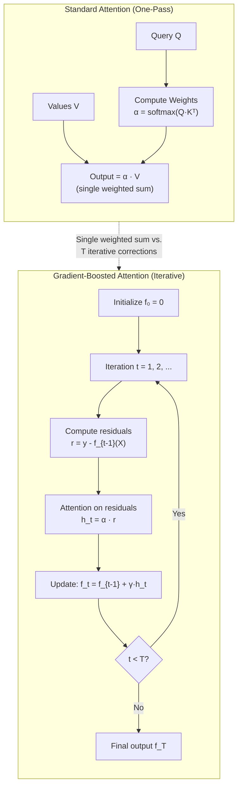
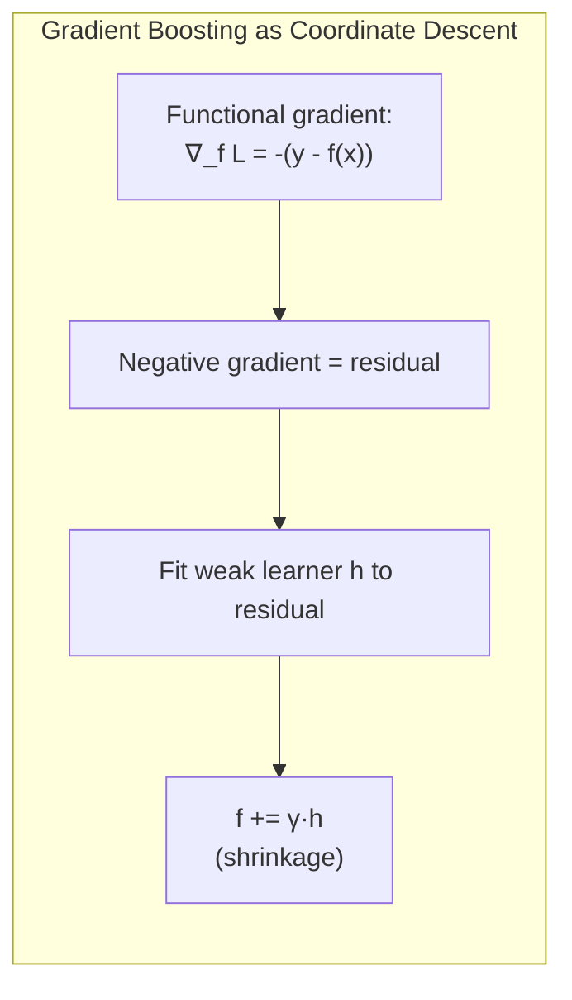
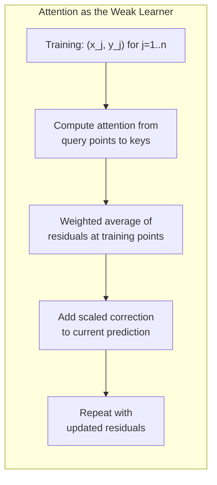

# Day 11: Gradient Boosting within a Single Attention Layer

> **Watch the animation**: <video src="https://raw.githubusercontent.com/Playitcooool/advanced-ai-daily/main/videos/11-gradient-boosted-attention.webm" autoplay loop muted playsinline width="800"></video>

---

## One-Line Summary

Gradient-boosted attention (GBoostAttn) replaces the single-pass softmax-weighted average of values with an iterative procedure: at each step, the attention mechanism computes a weighted average of the *current residuals* (errors from previous steps) and adds a fraction of this correction to the running output, just like gradient boosting builds an ensemble of weak learners that each correct the mistakes of the prior ones, achieving significantly better approximation quality within a single attention layer.

---

## Why This Matters

### The One-Pass Bottleneck

Transformer attention computes a single softmax-weighted average over values:

$$
\text{Attention}(Q, K, V)_i = \sum_{j=1}^{n} \alpha_{ij} v_j, \quad \alpha_{ij} = \frac{\exp(q_i \cdot k_j / \sqrt{d})}{\sum_{m} \exp(q_i \cdot k_m / \sqrt{d})}
$$

This is a **one-pass estimate**. Each query produces exactly one weighted sum of values -- there's no mechanism to refine or correct the output. If the initial attention weights are suboptimal (which they often are, especially early in training), there's no second chance to fix the error within the same layer.

### Gradient Boosting: A Refresher

Gradient boosting (Friedman, 2001) builds a strong predictor by iteratively adding weak learners that correct the *residuals* of the current ensemble:

$$
f_0(x) = 0, \quad r_i^{(t)} = y_i - f_{t-1}(x_i), \quad f_t(x) = f_{t-1}(x) + \gamma \cdot h_t(x)
$$

Where $h_t(x)$ is trained to predict the residuals $r^{(t)}$, and $\gamma$ is the learning rate (shrinkage). Each new learner focuses on what the ensemble got *wrong*.

### The Key Insight

The paper asks: **can we apply gradient boosting *inside* a single attention layer?** Instead of stacking more layers (deeper networks), can we iterate *within* the attention mechanism itself?

The answer is yes. At each boosting iteration $t$:

$$
h_t(q_i) = \sum_{j=1}^{n} \alpha_{ij}^{(t)} \cdot r_j^{(t)}, \quad f_t(q_i) = f_{t-1}(q_i) + \gamma \cdot h_t(q_i)
$$

Where $r_j^{(t)} = y_j - f_{t-1}(x_j)$ is the residual at training point $j$, and $\alpha_{ij}^{(t)}$ is the attention weight from query $i$ to key $j$. The "weak learner" at each step is nothing more than the **same attention mechanism**, but now attending to the *residuals* instead of the raw values.

---

## Architecture Walkthrough







---

## Mathematical Formulation

### Formal Algorithm

Given training data $\{(x_j, y_j)\}_{j=1}^n$ and query points $\{q_i\}_{i=1}^m$:

**Step 0:** Initialize $f_0(q_i) = 0$ for all $i$.

**Step t** (for $t = 1, \ldots, T$):

1. Compute residuals at training points: $r_j^{(t)} = y_j - f_{t-1}(x_j)$
2. Compute attention weights from queries to keys:

$$
\alpha_{ij}^{(t)} = \text{softmax}_j\left(\frac{q_i \cdot k_j}{\sqrt{d}}\right)
$$

3. Compute the "weak learner" output:

$$
h_t(q_i) = \sum_{j=1}^{n} \alpha_{ij}^{(t)} r_j^{(t)}
$$

4. Update with shrinkage:

$$
f_t(q_i) = f_{t-1}(q_i) + \gamma \cdot h_t(q_i)
$$

**Final output:** $f_T(q_i)$ after $T$ iterations.

### Why This Works: Connection to Kernel Methods

The attention mechanism is essentially a **kernel regressor**. The attention weights define a kernel matrix $K(q_i, x_j)$, and the output is:

$$
f(q_i) = \sum_{j=1}^{n} K(q_i, x_j) \cdot v_j
$$

For standard attention with softmax, the "kernel" is:

$$
K_{\text{attn}}(q_i, x_j) = \frac{\exp(q_i \cdot k_j / \sqrt{d})}{\sum_m \exp(q_i \cdot k_m / \sqrt{d})}
$$

In gradient boosting, each iteration applies the *same kernel* to the *current residuals*. After $T$ iterations:

$$
f_T = \gamma \sum_{t=1}^{T} (I - \gamma K)^{t-1} K y
$$

This is the **truncated Neumann series** of $(I - (I - \gamma K))^{-1} y$, which converges to $K^{-1} y$ (the optimal kernel regression solution) when $\gamma T$ is large enough and $\gamma$ is small enough.

In other words: **gradient-boosted attention approximates the inverse of the kernel matrix** through iterative refinement, while standard softmax attention only computes one step.

### Convergence Analysis

The reduction in squared loss at each step:

$$
\ell_t = \frac{1}{n} \sum_{j=1}^{n} (y_j - f_t(x_j))^2
$$

With a good kernel matrix $K$ (well-conditioned, high similarity between nearby points), the residual norm decreases geometrically:

$$
\|r^{(t+1)}\| \leq \rho \cdot \|r^{(t)}\|, \quad \rho = \|I - \gamma K\|_2 < 1
$$

where $\rho$ depends on the eigenvalues of the attention kernel matrix $K$.

### Comparison with Multi-Head Attention

| Aspect | Multi-Head Attention | Gradient-Boosted Attention |
|---|---|---|
| Strategy | Parallel: multiple heads, each computes one weighted sum | Sequential: same head iterates T times, correcting errors |
| Expressiveness | Width: diversity across heads | Depth: iterative refinement within one head |
| Compute | $O(H \cdot n^2 \cdot d)$ in parallel | $O(T \cdot n^2 \cdot d)$ sequentially |
| When each wins | When diversity helps (different feature types) | When precision matters (fine-grained approximation) |

### Connection to Day 07 (RBF Attention)

If we combine gradient boosting with RBF attention (Day 07), the kernel becomes:

$$
K_{\text{RBF}}(q_i, x_j) = \exp\left(-\frac{\|q_i - k_j\|^2}{2\sigma^2}\right)
$$

The Neumann series argument becomes even cleaner because the RBF kernel matrix is symmetric positive definite (under mild conditions), guaranteeing convergence for appropriate $\gamma$.

---

## Python Code Implementation

```python
import torch
import torch.nn as nn
import torch.nn.functional as F
import math


# ------------------------------------------------------------------
# 1. Standard Scaled Dot-Product Attention (Reference)
# ------------------------------------------------------------------

def standard_attention(
    q: torch.Tensor,
    k: torch.Tensor,
    v: torch.Tensor,
    mask: torch.Tensor | None = None,
) -> torch.Tensor:
    """Standard one-pass scaled dot-product attention."""
    d_k = q.size(-1)
    scores = torch.matmul(q, k.transpose(-2, -1)) / math.sqrt(d_k)
    if mask is not None:
        scores = scores.masked_fill(mask == 0, float("-inf"))
    weights = F.softmax(scores, dim=-1)
    return torch.matmul(weights, v)


# ------------------------------------------------------------------
# 2. Gradient-Boosted Attention
# ------------------------------------------------------------------

def gradient_boosted_attention(
    q: torch.Tensor,
    k: torch.Tensor,
    v: torch.Tensor,
    residual: torch.Tensor,
    mask: torch.Tensor | None = None,
) -> torch.Tensor:
    """
    Attention mechanism that attends to residuals instead of values.

    This is the core 'weak learner' in gradient-boosted attention.
    Instead of returning weighted values, it returns a weighted average
    of the current residuals, which serves as an error correction.

    Args:
        q: Query tensor, shape (batch, heads, seq_q, head_dim).
        k: Key tensor, shape (batch, heads, seq_k, head_dim).
        v: Value tensor (unused for residual computation, but kept for api
           compatibility with standard attention).
        residual: Residual tensor, shape (batch, heads, seq_k, head_dim).
            The current prediction error at each key position.
        mask: Optional attention mask.

    Returns:
        correction: Weighted residual correction, shape (batch, heads, seq_q, head_dim).
    """
    d_k = q.size(-1)
    scores = torch.matmul(q, k.transpose(-2, -1)) / math.sqrt(d_k)

    if mask is not None:
        scores = scores.masked_fill(mask == 0, float("-inf"))

    # Same softmax weights as standard attention
    weights = F.softmax(scores, dim=-1)

    # But instead of attending to V, attend to the residuals
    correction = torch.matmul(weights, residual)

    return correction


def boosted_attention_layer(
    q: torch.Tensor,
    k: torch.Tensor,
    v: torch.Tensor,
    n_iterations: int = 5,
    gamma: float = 0.5,
    mask: torch.Tensor | None = None,
) -> tuple[torch.Tensor, list[torch.Tensor]]:
    """
    Full gradient-boosted attention with T iterative corrections.

    Args:
        q: Query tensor, shape (batch, heads, seq_q, head_dim).
        k: Key tensor, shape (batch, heads, seq_k, head_dim).
        v: Value tensor, shape (batch, heads, seq_k, head_dim).
        n_iterations: Number of boosting iterations.
        gamma: Shrinkage / learning rate (smaller = more stable).
        mask: Optional attention mask.

    Returns:
        output: Final prediction after T iterations.
        history: Predictions at each iteration (for visualization).
    """
    batch_size, num_heads, seq_q, head_dim = q.shape

    # Initialize prediction as zeros (could also initialize with
    # standard attention as a warm start)
    prediction = torch.zeros_like(q)
    history = []

    # Residuals at key positions
    # We approximate v at key positions using self-attention
    self_weights = F.softmax(
        torch.matmul(k, k.transpose(-2, -1)) / math.sqrt(head_dim), dim=-1
    )
    v_at_keys = torch.matmul(self_weights, v)  # approximate values at key positions
    residual = v_at_keys  # initial residual = target values

    for t in range(n_iterations):
        # Attend to the current residuals
        correction = gradient_boosted_attention(q, k, v, residual, mask)
        prediction = prediction + gamma * correction
        history.append(prediction.clone())

        # Update residuals: how much of the key-position target
        # is still not captured?
        self_weights = F.softmax(
            torch.matmul(k, k.transpose(-2, -1)) / math.sqrt(head_dim), dim=-1
        )
        residual_at_keys = v_at_keys - gamma * torch.matmul(self_weights, residual)
        residual = residual_at_keys

    return prediction, history


# ------------------------------------------------------------------
# 3. Standard Warm-Start vs. Zero-Start
# ------------------------------------------------------------------

def boosted_attention_with_warm_start(
    q: torch.Tensor,
    k: torch.Tensor,
    v: torch.Tensor,
    n_iterations: int = 3,
    gamma: float = 0.3,
    mask: torch.Tensor | None = None,
) -> torch.Tensor:
    """
    Gradient-boosted attention initialized with standard attention.

    Instead of f_0 = 0, we set f_0 = standard attention and then
    apply boosting for residual correction.
    """
    d_k = q.size(-1)

    # Warm start: standard attention
    scores = torch.matmul(q, k.transpose(-2, -1)) / math.sqrt(d_k)
    if mask is not None:
        scores = scores.masked_fill(mask == 0, float("-inf"))
    weights = F.softmax(scores, dim=-1)
    prediction = torch.matmul(weights, v)

    # Compute initial residual via self-attention on keys
    self_weights = F.softmax(
        torch.matmul(k, k.transpose(-2, -1)) / math.sqrt(d_k), dim=-1
    )
    v_at_keys = torch.matmul(self_weights, v)
    residual = v_at_keys

    for t in range(n_iterations):
        correction_weights = weights.clone()  # reuse same attention pattern
        correction = torch.matmul(correction_weights, residual)
        prediction = prediction + gamma * correction
        residual = v_at_keys - gamma * torch.matmul(self_weights, residual)

    return prediction


# ------------------------------------------------------------------
# 4. Multi-Head Gradient-Boosted Attention Module
# ------------------------------------------------------------------

class BoostedMultiHeadAttention(nn.Module):
    """
    Multi-head attention with gradient boosting for iterative refinement.

    Each head independently applies T boosting iterations.
    The number of iterations T is a hyperparameter.
    During training, you can even learn T per head or per layer.

    Args:
        d_model: Model dimension.
        num_heads: Number of attention heads.
        n_iterations: Number of boosting steps.
        gamma: Shrinkage / learning rate.
        warm_start: If True, initialize with standard attention.
    """

    def __init__(
        self,
        d_model: int,
        num_heads: int,
        n_iterations: int = 5,
        gamma: float = 0.5,
        warm_start: bool = False,
    ):
        super().__init__()
        assert d_model % num_heads == 0
        self.d_model = d_model
        self.num_heads = num_heads
        self.head_dim = d_model // num_heads
        self.n_iterations = n_iterations
        self.gamma = gamma
        self.warm_start = warm_start

        self.w_q = nn.Linear(d_model, d_model)
        self.w_k = nn.Linear(d_model, d_model)
        self.w_v = nn.Linear(d_model, d_model)
        self.w_o = nn.Linear(d_model, d_model)

    def forward(
        self, x: torch.Tensor, mask: torch.Tensor | None = None
    ) -> torch.Tensor:
        """
        Forward pass.

        Args:
            x: Input tensor, shape (batch, seq_len, d_model).
            mask: Optional attention mask.

        Returns:
            output: Refined attention output, shape (batch, seq_len, d_model).
        """
        batch_size, seq_len, _ = x.shape

        q = self.w_q(x).view(batch_size, seq_len, self.num_heads, self.head_dim)
        k = self.w_k(x).view(batch_size, seq_len, self.num_heads, self.head_dim)
        v = self.w_v(x).view(batch_size, seq_len, self.num_heads, self.head_dim)

        q = q.transpose(1, 2)  # (batch, heads, seq, head_dim)
        k = k.transpose(1, 2)
        v = v.transpose(1, 2)

        output, _ = boosted_attention_layer(
            q, k, v, self.n_iterations, self.gamma, mask
        )

        # Concatenate heads
        output = output.transpose(1, 2).contiguous()
        output = output.view(batch_size, seq_len, self.d_model)
        return self.w_o(output)


# ------------------------------------------------------------------
# 5. Demonstration: Standard vs. Boosted
# ------------------------------------------------------------------

if __name__ == "__main__":
    torch.manual_seed(42)

    # Simple 1D regression problem
    n_train = 50
    n_query = 100

    x_train = torch.sort(torch.rand(n_train)).values
    target = torch.sin(2 * math.pi * x_train) + 0.3 * torch.cos(4 * math.pi * x_train)

    x_query = torch.linspace(0, 1, n_query)

    # Reshape for attention
    q = x_query.unsqueeze(-1).unsqueeze(0).unsqueeze(0)  # (1, 1, n_query, 1)
    k = x_train.unsqueeze(-1).unsqueeze(0).unsqueeze(0)  # (1, 1, n_train, 1)
    v = target.unsqueeze(-1).unsqueeze(0).unsqueeze(0)  # (1, 1, n_train, 1)

    # Standard attention
    std_out = standard_attention(q, k, v).squeeze()   # (n_query,)

    # Gradient-boosted attention
    boost_out, history = boosted_attention_layer(q, k, v, n_iterations=5, gamma=0.7)
    boost_out = boost_out.squeeze()

    # Compare errors
    target_fn = lambda x: torch.sin(2 * math.pi * x) + 0.3 * torch.cos(4 * math.pi * x)
    target_query = target_fn(x_query)

    std_mse = ((std_out - target_query) ** 2).mean()
    boost_mse = ((boost_out - target_query) ** 2).mean()

    print(f"Standard Attention MSE:  {std_mse:.6f}")
    print(f"Boosted Attention MSE:   {boost_mse:.6f}")
    print(f"Improvement:            {(1 - boost_mse / std_mse) * 100:.1f}%")

    # Show progressive improvement
    print("\nProgressive improvement:")
    for t, pred in enumerate(history):
        mse = ((pred.squeeze() - target_query) ** 2).mean().item()
        print(f"  Iter {t + 1}: MSE = {mse:.6f}")
```

---

## Key Takeaways

| Concept | Detail |
|---|---|
| **One-pass attention** | Standard softmax attention computes a single weighted average -- no mechanism for self-correction. |
| **Gradient boosting inside attention** | Iteratively apply the same attention mechanism, but attend to *residuals* instead of raw values. Each step corrects the error of the previous steps. |
| **Kernel matrix inverse** | The Neumann series interpretation shows that T boosting steps approximate $K^{-1}y$, while one standard attention step computes only $Ky$. |
| **Convergence guarantee** | For symmetric positive definite kernel matrices (e.g., RBF), the residual norm decreases geometrically with each iteration. |
| **Trade-off** | More iterations = better approximation but more sequential compute. Can't parallelize across iterations (unlike multi-head attention). |
| **Connection to previous days** | Combines naturally with RBF attention (Day 07) for guaranteed SPD kernel matrices, and with KV cache (Day 08) since cached key/value pairs serve as the training data for boosting. |

---

## References

- Chen, W. et al. "Gradient Boosting within a Single Attention Layer." arXiv preprint, 2026.
- Friedman, J. "Greedy function approximation: A gradient boosting machine." *Annals of Statistics*, 29(5):1189-1232, 2001.
- Vaswani, A. et al. "Attention Is All You Need." NeurIPS 2017.
- Choromanski, K. et al. "Rethinking Attention with Performers." ICLR 2021. (Day 07: RBF Attention)
