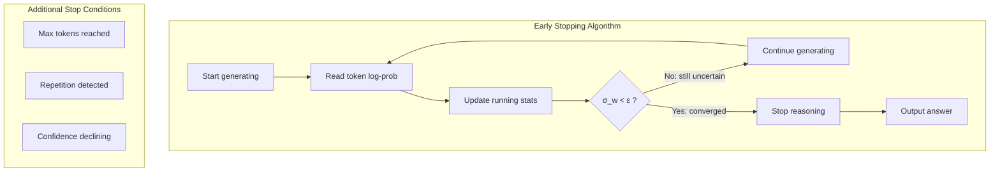

# Day 12: Early Stopping for Large Reasoning Models via Confidence Dynamics

> **Watch the animation**: 

---

## One-Line Summary

Instead of forcing large reasoning models (LRMs) to use a fixed number of reasoning tokens, we can monitor the **dynamics of their internal confidence** during generation and stop early once confidence converges -- saving up to 30-60% of compute while maintaining answer quality, and avoiding the performance degradation caused by "overthinking."

---

## Why This Matters

### The Overthinking Problem

Large reasoning models (e.g., DeepSeek-R1, o1/o3) generate long chains of thought before producing an answer. But more thinking isn't always better. Recent work has identified two regimes:

1. **Underthinking**: Too few tokens, the model hasn't figured out the solution yet
2. **Overthinking**: Too many tokens, the model starts second-guessing itself, introduces errors, or goes into loops

The standard approach is to set a **fixed maximum** token budget (e.g., 8K reasoning tokens). This is wasteful for easy problems and insufficient for hard ones.

### The Key Insight

The paper asks: **can the model's own confidence trajectory tell us when to stop?**

The answer is yes. By tracking confidence-related signals during generation, we can detect when the model has "figured it out" and stop immediately.

---

## What Does "Confidence" Mean During Reasoning?

### Token-Level Log Probability

At each generation step, the model produces a probability distribution over the vocabulary:

$$
P(x_t \mid x_{<t}) = \text{softmax}\left(\frac{z_t}{\tau}\right)
$$

The **maximum probability** (or log-probability) of the chosen token serves as a proxy for how confident the model is about its next thought:

$$
c_t = \max_v P(v \mid x_{<t})
$$

### Sequence-Level Self-Consistency

We can also measure confidence by generating $K$ parallel reasoning traces and computing agreement on the final answer:

$$
\text{Confidence}(a) = \frac{1}{K} \sum_{i=1}^{K} \mathbb{I}[\text{answer}(r_i) = a]
$$

Where $r_i$ is the $i$-th reasoning trace and $\mathbb{I}[\cdot]$ is the indicator function.

### Running Statistics (The Practical Signal)

The most robust approach uses **running statistics** of token-level confidence:

$$
\mu_t = \frac{1}{w} \sum_{k=t-w+1}^{t} c_k, \quad \sigma_t = \sqrt{\frac{1}{w} \sum_{k=t-w+1}^{t} (c_k - \mu_t)^2}
$$

Where $w$ is a window size (typically 5-10 tokens). **Low variance ($\sigma_t < \epsilon$) means the model's confidence has stabilized** -- it's either found the answer or is stuck.

---

## The Three Phases of Reasoning Confidence

```mermaid
flowchart LR
    subgraph Phase1["Phase 1: Exploration (0-10 steps)"]
        direction TB
        P1a["Low confidence"]
        P1b["High variance"]
        P1c["Exploring ideas"]
    end
    
    subgraph Phase2["Phase 2: Convergence (10-25 steps)"]
        direction TB
        P2a["Confidence rises"]
        P2b["Key insight found"]
        P2c["Variance drops"]
    end
    
    subgraph Phase3["Phase 3: Stabilization (25+ steps)"]
        direction TB
        P3a["Confidence plateaus"]
        P3b["Var ≈ 0 -- STOP HERE"]
        P3c["Overthinking: quality drops"]
    end
    
    Phase1 --> Phase2 --> Phase3
```





### Phase 1: Exploration (Steps 1-10)

- Confidence starts low ($c_t \approx 0.15-0.4$) with high variance
- The model is trying different reasoning strategies
- **Action**: Never stop here -- the model hasn't converged

### Phase 2: Rapid Convergence (Steps 11-25)

- Confidence rises rapidly as the model finds key insights
- Derivative $d c_t / dt$ is large and positive
- **Action**: Still not time to stop -- the model is actively improving

### Phase 3: Stabilization (Steps 26+)

- Confidence plateaus: $c_t \approx 0.85-0.90$
- Running variance drops below threshold: $\sigma_t < 0.025$
- **Action: STOP.** The model has found its answer.
- If forced to continue, quality *degrades* due to overthinking

---

## Mathematical Formulation

### The Stopping Criterion

Let $c_t$ be the confidence at step $t$. We define:

$$
\mathcal{S}(t) = \mathbb{I}\left[\sigma_{t-w:t} < \epsilon \quad \land \quad \mu_{t-w:t} > \theta \quad \land \quad t > t_{\min}\right]
$$

Where:
- $\sigma_{t-w:t}$ is the running standard deviation over window $w$
- $\mu_{t-w:t}$ is the running mean over window $w$
- $\epsilon$ is the stability threshold (typically 0.02-0.03)
- $\theta$ is the minimum confidence threshold (typically 0.8)
- $t_{\min}$ is the minimum reasoning steps (e.g., 15) to avoid premature stopping

We stop at the first $t$ where $\mathcal{S}(t) = 1$.

### Why Confidence Degrades Under Overthinking

The paper identifies that forced continuation beyond the convergence point causes:

1. **Error accumulation**: The model starts modifying its own reasoning, introducing subtle errors
2. **Self-doubt**: With already-solved problems, the model can "talk itself out of" good answers
3. **Repetition loops**: Without a natural stopping point, models start repeating patterns

The expected quality as a function of compute $T$:

$$
Q(T) \approx Q^* - \lambda \cdot \max(0, T - T^*)
$$

Where $T^*$ is the optimal stopping point (early), $Q^*$ is the peak quality, and $\lambda$ is the degradation rate from overthinking.

### Connection to Information Theory

The confidence dynamics connect to **Fisher Information**:

$$
\mathcal{I}(\theta) = \mathbb{E}\left[\left(\frac{\partial}{\partial \theta} \log P(x \mid \theta)\right)^2\right]
$$

As the model reasons, it accumulates information about the correct answer. The Fisher Information increases during Phase 2 and saturates during Phase 3. When the information gain per token falls below a threshold, continuing is wasteful.

This connects to Day 04 (Test-Time Compute) -- instead of uniformly scaling compute, we use information-theoretic principles to allocate compute efficiently per problem.

---

## Python Code Implementation

```python
import torch
import torch.nn.functional as F
from collections import deque


# ------------------------------------------------------------------
# 1. Confidence Tracker with Running Statistics
# ------------------------------------------------------------------

class RunningConfidenceTracker:
    """
    Tracks token-level confidence during generation and detects
    stabilization using running mean and variance.
    
    Args:
        window_size: Size of the sliding window (default: 5).
        stability_threshold: Max std to consider "converged" (default: 0.025).
        min_confidence: Minimum mean confidence to consider stopping (default: 0.8).
        min_steps: Minimum steps before allowing early stop (default: 15).
    """
    
    def __init__(
        self,
        window_size: int = 5,
        stability_threshold: float = 0.025,
        min_confidence: float = 0.8,
        min_steps: int = 15,
    ):
        self.window_size = window_size
        self.stability_threshold = stability_threshold
        self.min_confidence = min_confidence
        self.min_steps = min_steps
        
        # Sliding window of confidence values
        self.confidence_window: deque = deque(maxlen=window_size)
        self.history: list = []
        self.step = 0
    
    def update(self, logits: torch.Tensor) -> float:
        """
        Update tracker with the model's output logits.
        
        Args:
            logits: Model output logits, shape (vocab_size,).
        
        Returns:
            Current confidence value (max probability).
        """
        probs = F.softmax(logits, dim=-1)
        confidence = probs.max().item()
        
        self.confidence_window.append(confidence)
        self.history.append(confidence)
        self.step += 1
        
        return confidence
    
    def should_stop(self) -> bool:
        """
        Check if the model's confidence has stabilized.
        
        Returns:
            True if the model should stop reasoning.
        """
        if self.step < self.min_steps:
            return False
        if len(self.confidence_window) < self.window_size:
            return False
        
        values = list(self.confidence_window)
        mean_conf = sum(values) / len(values)
        std_conf = (sum((v - mean_conf)**2 for v in values) / len(values)) ** 0.5
        
        return (
            std_conf < self.stability_threshold
            and mean_conf > self.min_confidence
        )
    
    def get_stats(self) -> dict:
        """Get current confidence statistics."""
        values = list(self.confidence_window)
        if not values:
            return {"mean": 0, "std": 0, "step": self.step}
        
        mean = sum(values) / len(values)
        std = (sum((v - mean)**2 for v in values) / len(values)) ** 0.5
        return {"mean": mean, "std": std, "step": self.step}


# ------------------------------------------------------------------
# 2. Early Stopping Generation Loop
# ------------------------------------------------------------------

def generate_with_early_stopping(
    model,
    prompt: str,
    tokenizer,
    max_tokens: int = 1024,
    temperature: float = 0.7,
    tracker: RunningConfidenceTracker | None = None,
    verbose: bool = True,
) -> dict:
    """
    Generate text with confidence-based early stopping.
    
    Args:
        model: The language model.
        prompt: Input prompt string.
        tokenizer: Tokenizer for encoding/decoding.
        max_tokens: Fallback maximum token budget.
        temperature: Sampling temperature.
        tracker: Confidence tracker (uses defaults if None).
        verbose: Print stopping diagnostics.
    
    Returns:
        Dictionary with generated text, stopping reason, and stats.
    """
    if tracker is None:
        tracker = RunningConfidenceTracker()
    
    input_ids = tokenizer.encode(prompt, return_tensors="pt")
    generated_tokens = input_ids.clone()
    
    stopping_reason = "max_tokens"
    
    for step in range(max_tokens):
        with torch.no_grad():
            outputs = model(generated_tokens)
            logits = outputs.logits[0, -1, :]  # last token's logits
        
        # Track confidence
        confidence = tracker.update(logits)
        
        # Sample next token
        probs = F.softmax(logits / temperature, dim=-1)
        next_token = torch.multinomial(probs, num_samples=1)
        generated_tokens = torch.cat([generated_tokens, next_token.unsqueeze(0)], dim=1)
        
        # Check early stopping
        if tracker.should_stop():
            stopping_reason = "confidence_stabilized"
            break
        
        # Check for repetition loop
        if step > 20:
            recent = tracker.history[-10:]
            if len(set(round(c, 3) for c in recent)) < 3:
                stopping_reason = "repetition_detected"
                break
    
    # Decode the generated response
    generated_text = tokenizer.decode(generated_tokens[0], skip_special_tokens=True)
    
    result = {
        "text": generated_text,
        "stopping_reason": stopping_reason,
        "tokens_used": step + 1,
        "max_tokens": max_tokens,
        "savings_pct": (1 - (step + 1) / max_tokens) * 100,
        "final_confidence": tracker.history[-1] if tracker.history else 0,
        "confidence_trajectory": tracker.history,
    }
    
    if verbose:
        stats = tracker.get_stats()
        print(f"Stopped at step {step}: reason = {stopping_reason}")
        print(f"  Confidence: {confidence:.4f} | Mean: {stats['mean']:.4f} | Std: {stats['std']:.4f}")
        print(f"  Tokens saved: {result['savings_pct']:.1f}%")
    
    return result


# ------------------------------------------------------------------
# 3. Self-Consistency Based Early Stopping
# ------------------------------------------------------------------

def self_consistency_early_stopping(
    model,
    prompt: str,
    tokenizer,
    n_candidates: int = 5,
    agreement_threshold: float = 0.8,
    step_interval: int = 5,
    max_tokens: int = 1024,
) -> dict:
    """
    Self-consistency based early stopping.
    
    Generate multiple reasoning traces in parallel and check if they
    agree on the final answer. Stop when agreement is high enough.
    
    This is more expensive (requires N forward passes) but much more
    reliable than single-trace confidence.
    """
    # Generate partial traces at each checkpoint
    checkpoint_steps = list(range(step_interval, max_tokens, step_interval))
    
    for checkpoint in checkpoint_steps:
        answers = []
        for _ in range(n_candidates):
            # Generate up to checkpoint tokens
            input_ids = tokenizer.encode(prompt, return_tensors="pt")
            output = model.generate(
                input_ids,
                max_new_tokens=checkpoint,
                temperature=0.7,
                do_sample=True,
            )
            text = tokenizer.decode(output[0], skip_special_tokens=True)
            # Extract final answer (assumes model outputs with specific format)
            if "Answer:" in text:
                answers.append(text.split("Answer:")[-1].strip())
            else:
                answers.append(text.split("\n")[-1].strip())
        
        # Check agreement
        if not answers:
            continue
        
        most_common = max(set(answers), key=answers.count)
        agreement = answers.count(most_common) / len(answers)
        
        print(f"  Step {checkpoint}: agreement = {agreement:.2f} ({answers.count(most_common)}/{n_candidates})")
        
        if agreement >= agreement_threshold:
            print(f"  Early stop: {agreement:.0%} agreement at step {checkpoint}")
            return {
                "text": most_common,
                "stopping_reason": "self_consistency_converged",
                "tokens_used": checkpoint,
                "agreement": agreement,
                "n_agreeing": answers.count(most_common),
            }
    
    return {"text": answers[0] if answers else "", "stopping_reason": "max_tokens"}


# ------------------------------------------------------------------
# 4. Confidence-Aware Temperature Adjustment
# ------------------------------------------------------------------

def confidence_aware_generate(
    model,
    prompt: str,
    tokenizer,
    max_tokens: int = 1024,
    base_temperature: float = 0.7,
    min_temperature: float = 0.1,
) -> str:
    """
    Dynamically adjust temperature based on model confidence.
    
    When the model is uncertain (exploration phase), use higher
    temperature for diversity. As confidence rises (exploitation
    phase), reduce temperature for precision.
    
    This connects exploration strategies from Day 04 (Test-Time
    Compute) with the confidence dynamics framework.
    """
    input_ids = tokenizer.encode(prompt, return_tensors="pt")
    generated = input_ids.clone()
    tracker = RunningConfidenceTracker(window_size=3, min_steps=5)
    
    for step in range(max_tokens):
        with torch.no_grad():
            outputs = model(generated)
            logits = outputs.logits[0, -1, :]
        
        confidence = tracker.update(logits)
        
        # Temperature schedule: high when uncertain, low when confident
        # This is a form of simulated annealing during reasoning
        dynamic_temp = min_temperature + (base_temperature - min_temperature) * (1.0 - confidence)
        
        probs = F.softmax(logits / dynamic_temp, dim=-1)
        next_token = torch.multinomial(probs, num_samples=1)
        generated = torch.cat([generated, next_token.unsqueeze(0)], dim=1)
        
        if tracker.should_stop():
            break
    
    return tokenizer.decode(generated[0], skip_special_tokens=True)


if __name__ == "__main__":
    print("=== Early Stopping Demo ===\n")
    
    # Demo with synthetic confidence data
    print("1. Single-trace confidence tracking:")
    tracker = RunningConfidenceTracker(
        window_size=5,
        stability_threshold=0.025,
        min_confidence=0.8,
        min_steps=15,
    )
    
    np = __import__('numpy')  # Use numpy for demo data
    np.random.seed(42)
    
    # Simulate confidence trajectory (same as animation)
    conf_data = np.zeros(50)
    for t in range(11):
        conf_data[t] = 0.15 + 0.05 * t + np.random.normal(0, 0.04)
    for t in range(11, 26):
        p = (t - 11) / 14
        conf_data[t] = 0.5 + 0.35 * p + np.random.normal(0, 0.025)
    for t in range(26, 36):
        conf_data[t] = 0.87 + np.random.normal(0, 0.012)
    for t in range(36, 50):
        conf_data[t] = 0.87 - 0.005 * (t - 35) + np.random.normal(0, 0.018)
    conf_data = np.clip(conf_data, 0.05, 0.99)
    
    # Feed synthetic logits (logits that produce desired confidence)
    for t in range(50):
        c = conf_data[t]
        # Create logits where max prob = c
        logits = torch.zeros(1000)
        logits[0] = torch.tensor(c).log()  # This token has probability c
        logits[1:] = torch.tensor((1 - c) / 999).log()  # Rest share remaining prob
        
        tracker.update(logits)
        
        if tracker.should_stop():
            print(f"  STOPPED at step {tracker.step} (saved {(1 - tracker.step/50)*100:.0f}% tokens)")
            print(f"  Final confidence: {c:.4f}")
            stats = tracker.get_stats()
            print(f"  Window stats: mean={stats['mean']:.4f}, std={stats['std']:.4f}")
            break
    
    print(f"\n  Without early stopping: would use 50 tokens")
    print(f"  With early stopping: used {tracker.step} tokens")
    print(f"  Savings: {(1 - tracker.step/50)*100:.0f}%\n")
    
    # 2. Temperature scheduling
    print("2. Dynamic temperature adjustment:")
    print(f"  High uncertainty (conf=0.2): temp = 0.1 + 0.6 * 0.8 = {0.1 + 0.6*0.8:.2f}")
    print(f"  Medium     (conf=0.5): temp = 0.1 + 0.6 * 0.5 = {0.1 + 0.6*0.5:.2f}")
    print(f"  High conf  (conf=0.9): temp = 0.1 + 0.6 * 0.1 = {0.1 + 0.6*0.1:.2f}")
```

---

## Key Takeaways

| Concept | Detail |
|---|---|
| **Overthinking is real** | Forcing reasoning models to generate beyond their natural convergence point degrades answer quality. |
| **Confidence is a reliable signal** | Running statistics of token-level log-probabilities reveal when the model has "figured it out." |
| **Early stopping saves compute** | Stabilization typically occurs at 30-60% of the fixed budget, saving significant inference cost. |
| **Three phases** | Exploration (high variance) → Convergence (rising confidence) → Stabilization (low variance, STOP). |
| **Self-consistency** | Multi-trace agreement is a more expensive but highly reliable stopping criterion. |
| **Connected topics** | Builds on GRPO (Day 01, reward modeling), Test-Time Compute (Day 04, compute scaling), and SRPO (Day 10, balancing quality vs. efficiency). |

## Further Reading

- **Paper**: "Early Stopping for Large Reasoning Models via Confidence Dynamics" (arXiv:2604.04930)
- **Day 01 [GRPO](01-grpo.md)**: How reasoning models are trained with outcome rewards
- **Day 04 [Test-Time Compute](04-test-time-compute.md)**: Scaling computation during inference
- **Day 10 [SRPO](10-sample-routing.md)**: Balancing sample quality vs. generation cost
