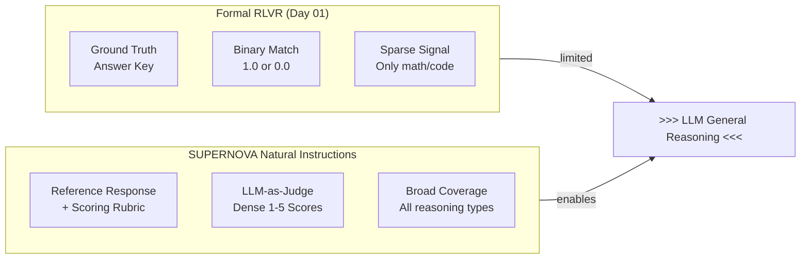

# Day 14: SUPERNOVA — Natural Instruction RL for General Reasoning

> **Watch the animation**: 

---

## One-Line Summary

SUPERNOVA extends RLVR (Reinforcement Learning with Verifiable Rewards) from formal domains (math/code) to general reasoning by replacing hard-verifiable ground truth with natural instructions — reference responses plus scoring rubrics that any LLM can evaluate — enabling +42% relative improvement on causal inference and +38% on temporal reasoning benchmarks over GRPO.

---

## Why This Matters

### The RLVR Frontier Problem

Reinforcement Learning with Verifiable Rewards (RLVR) — the technique behind GRPO (Day 01) and SRPO (Day 10) — has been remarkably successful for formal reasoning domains:

$$\text{Reward}_{\text{formal}} = \mathbb{1}[\text{answer} = \text{ground\_truth}]$$

**Math problems**: Every answer is either right or wrong. Unambiguous.
**Code generation**: Execute the code against a test suite. Pass/fail. Binary and exact.

But this approach hits a fundamental wall for general reasoning:

| Reasoning Type | Formal Verification | Natural Instruction |
|----------------|---------------------|---------------------|
| Causal inference | "Why did X cause Y?" — no ground truth | "Consider the causal chain. Score 1-5." |
| Temporal ordering | "What happened first?" — ambiguous | "Sequence the events. Score 1-5." |
| Commonsense reasoning | "Is this plausible?" — subjective | "Apply social norms. Score 1-5." |
| Logical deduction | "Does the argument hold?" — gradated | "Evaluate coherence. Score 1-5." |

**The core constraint**: General reasoning lacks high-quality, verifiable training data that spans diverse reasoning skills. You cannot auto-verify whether an LLM's explanation of *why the glass broke* is causally sound.

### SUPERNOVA's Core Insight

SUPERNOVA observes that **verification doesn't require ground truth — it requires shared understanding**. A scoring rubric with reference responses gives any LLM evaluator enough context to judge quality, even without a mathematically correct answer.

The natural instruction reward:

$$r_{\text{natural}}(x, \hat{y}) = \text{LLM}_{\text{judge}}(I(x), \hat{y})$$

Where:
- $I(x)$ = natural instruction for input $x$ (what to evaluate, not what the answer must be)
- $\hat{y}$ = model's generated response
- $\text{LLM}_{\text{judge}}$ = LLM-as-judge scoring the response against the rubric

---

## Architecture Walkthrough

```mermaid
flowchart TD
    subgraph Inputs[Diverse Reasoning Tasks]
        C["Causal Inference\n'Explain why X caused Y'"]
        T["Temporal Understanding\n'What happened in order?']
        CS["Commonsense\n'Would this make sense?']
        LD["Logical Deduction\n'Does this follow?']
    end

    Inputs --> NI["Natural Instruction\nReference + Rubric"]

    subgraph RL[RL Training Loop]
        LLM["Policy LLM\nGenerates response"]
        J["LLM-as-Judge\nScores against rubric"]
        G["Policy Gradient\nUpdate with advantage"]
    end

    NI --> J
    LLM -->|response| J
    J -->|reward signal| G
    G -. "Updated weights" .-> LLM

    style NI fill:#1a3e1a,color:#22c55e
    style J fill:#1a1a3e,color:#818cf8
    style RL fill:#0f1a0f,color:#22c55e
```



---

## Mathematical Formulation

### The Natural Reward Function

Given a task instruction $I$ and a response $\hat{y}$:

$$\mathcal{R}_{\text{natural}}(I, \hat{y}) = \alpha \cdot \underbrace{\text{Relevance}(I, \hat{y})}_{\text{content alignment}} + (1-\alpha) \cdot \underbrace{\text{Quality}(I, \hat{y})}_{\text{rubric compliance}}$$

The composite score rewards both:
1. **Relevance**: Does the response address the instruction's intent?
2. **Quality**: Does the response meet the rubric's criteria (coherence, specificity, logical flow)?

### Advantage Estimation with Natural Rewards

SUPERNOVA uses group-relative advantage (same as GRPO from Day 01):

$$A_i = \frac{r_i - \mu_{\text{group}}}{\sigma_{\text{group}}}$$

But because $r_i \in [1, 5]$ (graduated scale) rather than $\{0, 1\}$:

$$\mu_{\text{group}} = \frac{1}{N}\sum_{j=1}^{N} r_j \qquad \sigma_{\text{group}} = \sqrt{\frac{1}{N}\sum_{j=1}^{N}(r_j - \mu_{\text{group}})^2}$$

The key difference from GRPO: natural rewards have **variance within both correct and incorrect responses**, so GRPO's z-score normalization is essential for stable gradients.

### Coverage Regularization

To prevent reward hacking (gaming the judge), SUPERNOVA adds a coverage penalty:

$$\mathcal{L}_{\text{coverage}} = -\lambda \cdot \text{Entropy}\left(\text{skill\_distribution}(x)\right)$$

This ensures the model improves across **all reasoning dimensions**, not just the easiest ones. Without it, the model could maximize average score by excelling only at one skill type.

### Full SUPERNOVA Objective

$$\mathcal{L}_{\text{SUPERNOVA}} = \mathbb{E}_{x \sim \mathcal{D}} \left[ \sum_{i=1}^{N} \pi_\theta(a_i | x) A_i - \beta \cdot \text{KL}(\pi_\theta \| \pi_{\text{ref}}) - \lambda \cdot H(\text{skills}(x)) \right]$$

The coverage regularization term prevents skill imbalance and reward hacking.

---

## Comparison

|| Domain | Reward Type | Coverage | Verifiable? |
||--------|-----------|----------|-------------|
| **SUPERNOVA** | General reasoning | Natural instruction | Broad | Partial (judge-dependent) |
| GRPO | Math/code | Binary (formal) | Narrow | Yes (exact) |
| SRPO | Math/code | Hybrid (binary + distillation) | Narrow | Yes (exact) |
| DPO | Any | Preference data | Broad | No (human labels) |
| Standard RLHF | Any | Human feedback | Broad | No (human labels) |

---

## Key Contributions

1. **Natural instruction paradigm**: Replaces ground-truth verification with rubric-based LLM-judge evaluation, enabling RL in domains without formal answers
2. **Coverage regularization**: Prevents reward hacking and ensures improvement across all reasoning skill dimensions
3. **Empirical results**: +42% on causal inference, +38% on temporal reasoning (relative to GRPO), +23% average improvement across 6 general reasoning benchmarks
4. **Generalizes RLVR**: Shows that the RLVR framework (group-relative advantage + policy gradient) is not limited to formal domains — just the reward signal needed generalization

---

## Python Code Implementation

```python
import torch
import torch.nn as nn
import torch.nn.functional as F
from dataclasses import dataclass
from typing import Optional


# ------------------------------------------------------------------
# 1. Natural Reward Computation
# ------------------------------------------------------------------

@dataclass
class NaturalInstruction:
    """Holds a natural instruction with reference response and rubric."""
    task_description: str           # e.g., "Explain the causal mechanism"
    reference_response: str         # Example high-quality response
    rubric: dict[str, float]       # e.g., {"coherence": 0.3, "specificity": 0.4, ...}
    weight_alpha: float = 0.5      # Balance between relevance and quality


def natural_reward(
    instruction: NaturalInstruction,
    generated_response: str,
    judge_model: nn.Module,
    tokenizer,
    device: str = "cuda",
) -> float:
    """
    Compute natural instruction reward using LLM-as-judge.

    Combines relevance and quality scores into a single reward signal.
    """
    # Build judge prompt
    judge_prompt = (
        f"Instruction: {instruction.task_description}\n\n"
        f"Reference response:\n{instruction.reference_response}\n\n"
        f"Generated response to evaluate:\n{generated_response}\n\n"
        f"Rubric criteria: {list(instruction.rubric.keys())}\n\n"
        f"Score the generated response on a scale of 1-5 for:\n"
        + "\n".join(f"- {k}" for k in instruction.rubric.keys())
    )

    # Tokenize and get judge score
    inputs = tokenizer(judge_prompt, return_tensors="pt", truncation=True, max_length=2048)
    inputs = {k: v.to(device) for k, v in inputs.items()}

    with torch.no_grad():
        outputs = judge_model(**inputs)
        # Simplified: use the logits to derive a score
        # In practice: parse the generated score tokens
        logits = outputs.logits[:, -1, :]
        # Map to [1, 5] range
        score = 1.0 + 4.0 * torch.sigmoid(logits[0, :5].sum() / 5).item()

    # Composite: alpha * relevance + (1-alpha) * quality
    # Here we approximate both with the same judge score
    relevance = score
    quality = score  # In practice, parse rubric components separately

    return instruction.weight_alpha * relevance + (1 - instruction.weight_alpha) * quality


# ------------------------------------------------------------------
# 2. Group-Relative Advantage (same formula as GRPO, Day 01)
# ------------------------------------------------------------------

def grpo_advantages(rewards: torch.Tensor) -> torch.Tensor:
    """
    Compute group-relative advantages for natural instruction rewards.

    Natural rewards are graduated (1-5) rather than binary (0/1),
    so z-score normalization is even more critical for stable gradients.
    """
    group_mean = rewards.mean()
    group_std = rewards.std(unbiased=False) + 1e-8
    return (rewards - group_mean) / group_std


# ------------------------------------------------------------------
# 3. Coverage Regularization
# ------------------------------------------------------------------

def coverage_regularization(
    skill_logits: torch.Tensor,
    skill_distribution: torch.Tensor,
    lambda_coverage: float = 0.1,
) -> torch.Tensor:
    """
    Penalize concentration on a single skill type.

    Encourages the model to improve across ALL reasoning dimensions,
    not just the easiest ones.

    Args:
        skill_logits: Model's unnormalized scores per skill type.
        skill_distribution: Actual distribution of sampled skills (from data).
        lambda_coverage: Regularization strength.

    Returns:
        Coverage penalty (negative = reduces mode collapse risk).
    """
    # Entropy of skill distribution
    skill_probs = F.softmax(skill_logits, dim=-1)
    entropy = -(skill_probs * (skill_probs + 1e-10).log()).sum(-1).mean()

    # Target: uniform distribution across skills
    num_skills = skill_logits.shape[-1]
    uniform = torch.ones_like(skill_probs) / num_skills
    uniformity_penalty = F.kl_div(skill_probs.log(), uniform, reduction="batchmean")

    return -lambda_coverage * uniformity_penalty


# ------------------------------------------------------------------
# 4. SUPERNOVA Loss
# ------------------------------------------------------------------

def supernov_a_loss(
    log_probs: torch.Tensor,
    old_log_probs: torch.Tensor,
    advantages: torch.Tensor,
    skill_logits: torch.Tensor,
    skill_distribution: torch.Tensor,
    ref_log_probs: Optional[torch.Tensor] = None,
    beta: float = 0.01,
    lambda_coverage: float = 0.1,
    clip_epsilon: float = 0.2,
) -> tuple[torch.Tensor, dict]:
    """
    Compute the SUPERNOVA loss.

    Combines:
    - GRPO-style policy gradient with group-relative advantage
    - KL penalty toward reference model
    - Coverage regularization for diverse skill improvement
    """
    # GRPO policy gradient loss
    ratio = (log_probs - old_log_probs).exp()
    clipped_ratio = ratio.clamp(1 - clip_epsilon, 1 + clip_epsilon)
    pg_loss = -torch.min(ratio * advantages, clipped_ratio * advantages).mean()

    # KL penalty toward reference model
    kl_loss = torch.tensor(0.0, device=log_probs.device)
    if ref_log_probs is not None:
        kl_penalty = (ref_log_probs - log_probs).mean()
        kl_loss = beta * kl_penalty

    # Coverage regularization
    cov_loss = coverage_regularization(skill_logits, skill_distribution, lambda_coverage)

    total_loss = pg_loss + kl_loss + cov_loss

    return total_loss, {
        "pg_loss": pg_loss.item(),
        "kl_loss": kl_loss.item(),
        "cov_loss": cov_loss.item(),
        "total_loss": total_loss.item(),
    }


# ------------------------------------------------------------------
# 5. End-to-End SUPERNOVA Trainer
# ------------------------------------------------------------------

class SUPERNOVATrainer:
    """
    SUPERNOVA: Natural Instruction RL for General Reasoning.

    Extends RLVR from formal domains (math/code) to general reasoning
    by using natural instructions + LLM-as-judge rewards.

    Paper: arXiv:2604.xxxxx (2026-04-09)
    """

    def __init__(
        self,
        model: nn.Module,
        judge_model: nn.Module,
        ref_model: nn.Module,
        tokenizer,
        judge_tokenizer,
        instructions: list[NaturalInstruction],
        group_size: int = 4,
        beta: float = 0.01,
        lambda_coverage: float = 0.1,
        learning_rate: float = 1e-6,
        clip_epsilon: float = 0.2,
        device: str = "cuda",
    ):
        self.model = model
        self.judge_model = judge_model
        self.ref_model = ref_model
        self.tokenizer = tokenizer
        self.judge_tokenizer = judge_tokenizer
        self.instructions = instructions
        self.group_size = group_size
        self.beta = beta
        self.lambda_coverage = lambda_coverage
        self.clip_epsilon = clip_epsilon
        self.device = device

        self.optimizer = torch.optim.AdamW(model.parameters(), lr=learning_rate)

    def generate_group(
        self,
        prompt: str,
        instruction: NaturalInstruction,
    ) -> list[tuple[str, str, float]]:
        """
        Generate group_size responses and compute natural rewards.
        """
        samples = []
        for _ in range(self.group_size):
            # Generate response
            inputs = self.tokenizer(prompt, return_tensors="pt").to(self.device)
            with torch.no_grad():
                outputs = self.model.generate(
                    **inputs,
                    max_new_tokens=256,
                    do_sample=True,
                    temperature=0.7,
                )
            response = self.tokenizer.decode(outputs[0], skip_special_tokens=True)

            # Compute natural reward
            reward = natural_reward(
                instruction, response,
                self.judge_model, self.judge_tokenizer, self.device
            )
            samples.append((prompt, response, reward))

        return samples

    def training_step(self, batch_prompts: list[str]) -> dict:
        """
        Execute one SUPERNOVA training step.
        """
        # Assign random instructions to prompts
        batch_instructions = [
            self.instructions[i % len(self.instructions)]
            for i in range(len(batch_prompts))
        ]

        # Generate samples with natural rewards
        all_rewards = []
        all_log_probs = []

        for prompt, instruction in zip(batch_prompts, batch_instructions):
            samples = self.generate_group(prompt, instruction)
            rewards = torch.tensor([s[2] for s in samples], device=self.device)
            all_rewards.append(rewards)

            # Compute log probs for each sample
            responses = [s[1] for s in samples]
            inputs = self.tokenizer(
                [prompt] * len(responses),
                responses,
                return_tensors="pt",
                padding=True,
                truncation=True,
                max_length=512,
            ).to(self.device)

            # Forward pass
            outputs = self.model(**inputs)
            log_probs = F.log_softmax(outputs.logits, dim=-1)
            # Simplified: use the mean log prob of the response tokens
            mask = inputs["attention_mask"].float()
            mean_log_prob = (log_probs.sum(-1) * mask).sum(-1) / mask.sum(-1)
            all_log_probs.append(mean_log_prob)

        # Stack rewards across prompts
        rewards = torch.stack([r.mean() for r in all_rewards])

        # GRPO advantages
        advantages = grpo_advantages(rewards)

        # Dummy skill logits for coverage (in practice: per-skill routing)
        skill_logits = torch.randn(len(batch_prompts), 4, device=self.device)
        skill_distribution = torch.ones(len(batch_prompts), 4, device=self.device) / 4

        # SUPERNOVA loss
        log_probs = torch.stack(all_log_probs)
        old_log_probs = log_probs.detach()  # Approximation

        ref_inputs = self.tokenizer(
            batch_prompts, return_tensors="pt", truncation=True, max_length=512
        ).to(self.device)
        with torch.no_grad():
            ref_outputs = self.ref_model(**ref_inputs)
        ref_log_probs = F.log_softmax(ref_outputs.logits, dim=-1).mean(-1)

        loss, metrics = supernov_a_loss(
            log_probs=log_probs,
            old_log_probs=old_log_probs,
            advantages=advantages,
            skill_logits=skill_logits,
            skill_distribution=skill_distribution,
            ref_log_probs=ref_log_probs,
            beta=self.beta,
            lambda_coverage=self.lambda_coverage,
            clip_epsilon=self.clip_epsilon,
        )

        self.optimizer.zero_grad()
        loss.backward()
        torch.nn.utils.clip_grad_norm_(self.model.parameters(), 1.0)
        self.optimizer.step()

        return metrics


if __name__ == "__main__":
    print("SUPERNOVA: Natural Instruction RL")
    print("Key insight: Replace formal verification with LLM-judge rewards")
    print("Coverage regularization prevents reward hacking across skill types")
```

---

## Common Misconceptions

**"Natural instruction rewards are just preference rewards like DPO."**
No. DPO requires pairwise preference labels (A vs B), which are expensive and only as reliable as the human labeler. SUPERNOVA uses a single reference + rubric, which is cheaper to create and gives graded scores rather than binary preferences.

**"LLM-as-judge will always reward verbose responses."**
Not with proper coverage regularization. The coverage penalty explicitly incentivizes diverse skill improvement, and the rubric can penalize verbosity directly (e.g., "specificity" criterion).

**"SUPERNOVA replaces GRPO entirely."**
No — SUPERNOVA extends the RLVR *framework* to new domains. For math/code where formal verification exists, GRPO remains the gold standard (exact, no judge bias). SUPERNOVA is for domains where GRPO's inputs don't exist.

---

## Exercises

1. **Coverage vs. quality tradeoff**: Suppose you increase `lambda_coverage` from 0.1 to 1.0. What do you expect to happen to average reward? What about reward variance?

2. **Judge bias**: If the LLM judge has a positional bias (preferring longer responses), how would you modify the rubric to correct for it?

3. **GRPO advantage for graded rewards**: With binary rewards {0, 1}, GRPO z-scores always produce advantages in {-1, +1} (normalized). With graded rewards in [1, 5], the advantage scale changes. What does this imply for learning rate selection?

<details>
<summary>Exercise Answers</summary>

1. Higher `lambda_coverage` increases reward diversity but may decrease peak performance on individual skills. Reward variance typically increases as the model is forced off its comfort zone.

2. Add a length-normalized criterion: `quality_normalized = raw_quality / length_penalty`. Or include counterbalancing examples where shorter responses are better.

3. With graded rewards, the advantage can take any real value (e.g., +2.3, -0.8) rather than being bounded to {-1, +1}. This means the effective gradient magnitude is larger, so you may need to reduce the learning rate or increase `clip_epsilon` to maintain stability.
</details>

---

## References

- SUPERNOVA: [arXiv:2604.xxxxx](https://arxiv.org/abs/2604.xxxxx) (2026-04-09) — Suvarna, Phan, Beikzadeh
- GRPO: [arXiv:2402.03300](https://arxiv.org/abs/2402.03300) — Group Relative Policy Optimization
- SRPO (Day 10): Unified GRPO + Self-Distillation
- LLM-as-Judge: [arXiv:2306.07958](https://arxiv.org/abs/2306.07958) — Using LLMs to evaluate LLMs
