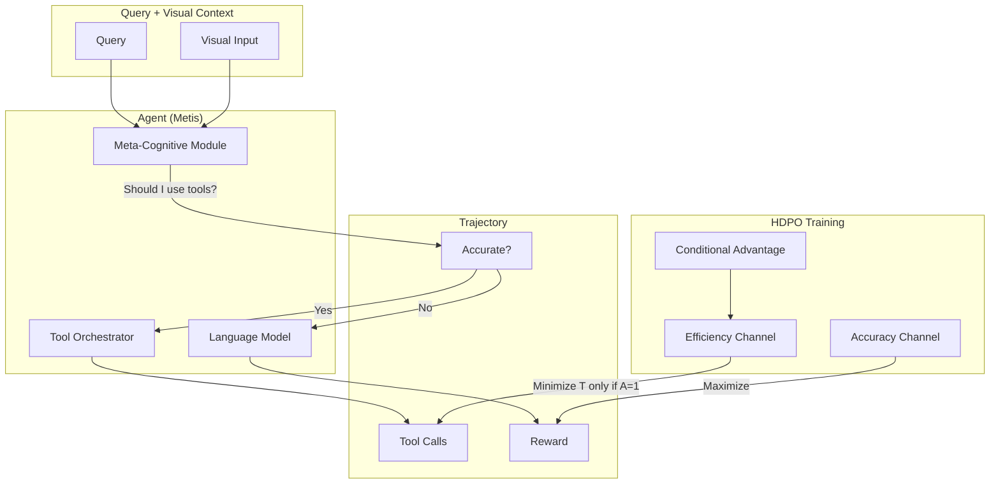

# Day 15: HDPO — Meta-Cognitive Tool Use in Agentic Models

> **Watch the animation**: <video src="https://playitcooool.github.io/advanced-ai-daily/videos/15-hdpo.webm" autoplay loop muted playsinline width="800"></video>

---

## One-Line Summary

HDPO (Hybrid Decoupled Policy Optimization) solves the agent tool-overuse problem by decoupling the accuracy reward from the efficiency reward — optimizing them through separate orthogonal channels with conditional advantage estimation — yielding orders-of-magnitude reduction in tool invocations while simultaneously improving task accuracy.

---

## Why This Matters

### The Agent's Meta-Cognitive Deficit

Modern agentic multimodal models can interact with external tools — calculators, search engines, code interpreters. But they suffer from a profound **meta-cognitive deficit**: they cannot distinguish between situations where:

- **Internal knowledge suffices** (no tool needed)
- **External utility is necessary** (tool required)

This leads to **blind tool invocation** — reflexive execution even when the visual context alone resolves the query.

### The Consequence: Latency Bottlenecks and Noise

```
Query: "What color is the car in this image?"
Agent: → [Tool: Web Search] → [Tool: Calculator] → [Tool: Translate]
```

Each unnecessary tool call:
1. Adds **latency** (sometimes 10-100x slower than internal reasoning)
2. Injects **extraneous noise** that derails sound reasoning
3. Wastes **computational resources**

### Why Traditional RL Fails

Previous RL approaches attempted to fix tool overuse with **scalarized rewards**:

$$R_{\text{total}} = R_{\text{acc}} - \lambda \cdot T_{\text{penalty}}$$

But this creates an **irreconcilable optimization dilemma**:

| Setting | Problem |
|---------|---------|
| $\lambda$ **too high** | Essential tool use suppressed — agent becomes afraid to use tools even when needed |
| $\lambda$ **too mild** | Penalty subsumed by accuracy reward variance during advantage normalization — useless against overuse |

The two objectives **compete** in a single scalar. You cannot simultaneously maximize accuracy and minimize tool use when the optimizer sees them as equally important.

---

## HDPO's Core Insight

**Reframe tool efficiency from a competing objective to a strictly conditional one.**

Instead of scalarizing both rewards into one, HDPO maintains **two orthogonal optimization channels**:

1. **Accuracy Channel**: Maximize task correctness (no penalty for tool use)
2. **Efficiency Channel**: Minimize tool use **only within accurate trajectories**

This decoupling means:
- The accuracy channel is unaffected by efficiency concerns
- The efficiency channel only activates when the trajectory is already correct
- A **cognitive curriculum** naturally emerges: first solve the problem, then learn to solve it more efficiently

---

## Architecture Walkthrough



### The Conditional Advantage Mechanism

The key innovation is **conditional advantage estimation**:

$$A_{\text{eff}}(s,a) = \begin{cases} R_{\text{eff}}(s,a) - V_{\text{eff}}(s) & \text{if trajectory is accurate} \\ 0 & \text{otherwise} \end{cases}$$

This means:
- **Only accurate trajectories** receive efficiency learning signal
- **Inaccurate trajectories** are ignored by the efficiency channel (no punishment for using tools when confused)
- The agent learns: "When I'm confident in my answer, I should double-check before invoking tools"

---

## Implementation

```python
import torch
import torch.nn as nn
from dataclasses import dataclass
from typing import Optional, Tuple

@dataclass
class HDPOConfig:
    """HDPO configuration for meta-cognitive tool use."""
    accuracy_weight: float = 1.0
    efficiency_weight: float = 0.1
    condition_lambda: float = 0.5  # Threshold for "accurate" trajectory


class HDPOAgent(nn.Module):
    """
    Agent with decoupled reward optimization for tool efficiency.
    
    Key insight: Two separate value heads, one conditional advantage function.
    """
    
    def __init__(self, model: nn.Module, config: HDPOConfig):
        super().__init__()
        self.model = model
        self.config = config
        
        # Shared backbone
        self.shared_encoder = model.encoder
        
        # Meta-cognitive module: decides if tools are needed
        self.meta_cognitive = nn.Sequential(
            nn.Linear(model.hidden_dim, 256),
            nn.ReLU(),
            nn.Linear(256, 1),  # Tool necessity score
            nn.Sigmoid()
        )
        
        # Two separate value heads for decoupled optimization
        self.accuracy_value = nn.Linear(model.hidden_dim, 1)
        self.efficiency_value = nn.Linear(model.hidden_dim, 1)
    
    def forward(self, tokens, visual_embeds) -> dict:
        """Forward pass returns both action logits and meta-cognitive decision."""
        hidden = self.shared_encoder(tokens, visual_embeds)
        
        # Meta-cognitive decision: should I use tools?
        tool_necessity = self.meta_cognitive(hidden)
        
        # Standard language modeling action
        action_logits = self.model.head(hidden)
        
        return {
            "action_logits": action_logits,
            "tool_necessity": tool_necessity,
            "hidden": hidden
        }
    
    def compute_hdpo_loss(
        self,
        trajectories: list,
        accuracy_rewards: torch.Tensor,
        tool_counts: torch.Tensor
    ) -> Tuple[torch.Tensor, dict]:
        """
        Compute HDPO loss with decoupled reward channels.
        
        Args:
            trajectories: List of (state, action, done) tuples
            accuracy_rewards: Reward for task accuracy [batch]
            tool_counts: Number of tool invocations [batch]
        
        Returns:
            Total loss and diagnostic metrics
        """
        batch_size = accuracy_rewards.shape[0]
        
        # Channel 1: Accuracy advantage (standard)
        V_acc = self.accuracy_value(self.last_hidden)
        A_acc = accuracy_rewards - V_acc.squeeze()
        
        # Channel 2: Efficiency advantage (CONDITIONAL on accuracy)
        V_eff = self.efficiency_value(self.last_hidden)
        
        # Efficiency reward: penalize tool use inversely
        efficiency_rewards = -self.config.efficiency_weight * tool_counts.float()
        
        # CONDITIONAL: Only propagate efficiency gradient if accurate
        is_accurate = (accuracy_rewards > self.config.condition_lambda).float()
        A_eff = efficiency_rewards - V_eff.squeeze()
        A_eff_cond = A_eff * is_accurate  # Zero if not accurate!
        
        # Policy gradient from both channels
        log_probs = torch.log_softmax(self.action_logits, dim=-1)
        
        policy_loss_acc = -(A_acc.detach() * log_probs).mean()
        policy_loss_eff = -(A_eff_cond.detach() * log_probs).mean()
        
        total_loss = self.config.accuracy_weight * policy_loss_acc + policy_loss_eff
        
        metrics = {
            "accuracy_advantage": A_acc.mean().item(),
            "efficiency_advantage": A_eff_cond.mean().item(),
            "accuracy_channel_loss": policy_loss_acc.item(),
            "efficiency_channel_loss": policy_loss_eff.item(),
            "fraction_accurate": is_accurate.mean().item()
        }
        
        return total_loss, metrics


def train_hdpo(agent: HDPOAgent, env, optimizer, config: HDPOConfig, num_steps: int):
    """Training loop for HDPO agent."""
    
    agent.train()
    optimizer = torch.optim.Adam(agent.parameters(), lr=3e-4)
    
    for step in range(num_steps):
        # Collect trajectories
        trajectories = []
        accuracy_rewards = []
        tool_counts = []
        
        for _ in range(config.batch_size):
            traj, acc_r, tools = collect_trajectory(agent, env)
            trajectories.append(traj)
            accuracy_rewards.append(acc_r)
            tool_counts.append(tools)
        
        accuracy_rewards = torch.stack(accuracy_rewards)
        tool_counts = torch.tensor(tool_counts)
        
        # Compute HDPO loss
        loss, metrics = agent.compute_hdpo_loss(
            trajectories, accuracy_rewards, tool_counts
        )
        
        optimizer.zero_grad()
        loss.backward()
        torch.nn.utils.clip_grad_norm_(agent.parameters(), 1.0)
        optimizer.step()
        
        if step % 100 == 0:
            print(f"Step {step}: "
                  f"Acc Adv={metrics['accuracy_advantage']:.3f}, "
                  f"Eff Adv={metrics['efficiency_advantage']:.3f}, "
                  f"Fraction Accurate={metrics['fraction_accurate']:.2%}")


# Example: Simple tool-use environment
class SimpleToolEnv:
    """
    Environment where agent must decide: use tool or answer internally?
    
    - Queries resolvable from context: reward 1.0 if answered correctly
    - Queries requiring tools: reward 1.0 only if tool was used
    """
    
    def __init__(self):
        self.queries = [
            {"context": "A red car", "query": "What color is the car?", "needs_tool": False},
            {"context": "population data", "query": "What's the population of Tokyo?", "needs_tool": True},
            # ... more queries
        ]
    
    def reset(self):
        self.current = random.choice(self.queries)
        return self.current["context"], self.current["query"]
    
    def step(self, action: str, tool_used: bool):
        needs_tool = self.current["needs_tool"]
        
        if action == "correct_answer":
            reward = 1.0 if not needs_tool else 0.0
        elif action == "use_tool":
            reward = 1.0 if needs_tool else 0.5  # Small penalty for unnecessary tool
        else:
            reward = 0.0
        
        return reward, tool_used
```

---

## Key Equations

### Traditional Scalarized RL (Fails)

$$R_{\text{total}} = R_{\text{acc}} - \lambda \cdot T_{\text{penalty}}$$

Problem: Single scalar couples both objectives. During advantage normalization, the efficiency signal is overwhelmed by accuracy variance.

### HDPO: Decoupled Channels

$$A_{\text{acc}}(s,a) = R_{\text{acc}}(s,a) - V_{\text{acc}}(s)$$

$$A_{\text{eff}}(s,a) = \begin{cases} R_{\text{eff}}(s,a) - V_{\text{eff}}(s) & \text{if } R_{\text{acc}} > \tau \\ 0 & \text{otherwise} \end{cases}$$

The efficiency advantage is **masked to zero** when the trajectory is inaccurate.

---

## Results: Metis Model

The resulting model, **Metis**, demonstrates:

| Metric | Baseline (Scalarized RL) | HDPO (Metis) |
|--------|-------------------------|--------------|
| Tool invocations | High (baseline) | **↓ Orders of magnitude** |
| Task accuracy | Moderate | **↑ Improved** |
| Self-reliance | Low | **↑ High** |

The cognitive curriculum emerges naturally: the agent first learns to solve problems correctly, then learns to do so with minimal tool assistance.

---

## Common Misconceptions

**Misconception**: "HDPO just adds a penalty for tool use."

**Reality**: The decoupling is fundamentally different. A penalty couples the objectives into one scalar that competes during optimization. HDPO's conditional advantage means the efficiency channel **never interferes** with accuracy learning — they optimize independently.

---

## Exercises

### Exercise 1: Scalarized vs Decoupled (Conceptual)

**Question**: In traditional scalarized RL with $\lambda = 0.1$, the accuracy reward has variance $\sigma^2_{\text{acc}} = 1.0$. What happens to the tool penalty signal during advantage normalization?

**Answer**: The tool penalty signal (typically in range $[-0.1, 0]$) is completely subsumed by the accuracy advantage variance. With normalized advantages $A_{\text{acc}} \sim \mathcal{N}(0, 1)$, a constant $-0.05$ penalty has negligible effect.

### Exercise 2: Implement Conditional Masking

**Task**: Write a function that computes conditional efficiency advantage:

```python
def conditional_efficiency_advantage(
    efficiency_rewards: torch.Tensor,
    accuracy_rewards: torch.Tensor,
    efficiency_values: torch.Tensor,
    threshold: float = 0.5
) -> torch.Tensor:
    """
    Compute efficiency advantage only for accurate trajectories.
    
    Args:
        efficiency_rewards: Raw efficiency rewards [batch]
        accuracy_rewards: Accuracy rewards [batch]
        efficiency_values: Value estimates for efficiency [batch]
        threshold: Accuracy threshold for masking
    
    Returns:
        Conditional efficiency advantages [batch]
    """
    # Your code here
    pass
```

**Hint**: Use `torch.where` to mask advantages for inaccurate trajectories.

---

## References

- [Act Wisely: Cultivating Meta-Cognitive Tool Use in Agentic Multimodal Models](https://arxiv.org/abs/2604.08545) — Yan et al., 2026
- [Day 01: GRPO](/tutorials/en/01-grpo.md) — Group Relative Policy Optimization foundation
- [Day 05: Multi-Agent Reflection](/tutorials/en/05-multi-agent-reflection.md) — Agent reasoning systems
- [Day 14: SUPERNOVA](/tutorials/en/14-supernova.md) — RL for general reasoning

---

## Next Steps

- **Day 16**: See how HDPO's conditional optimization compares to reinforcement learning approaches from Day 14
- **Practice**: Run the `SimpleToolEnv` simulation to watch the cognitive curriculum emerge
- **Extend**: Apply decoupled optimization to other competing objectives (speed vs accuracy, creativity vs factual accuracy)