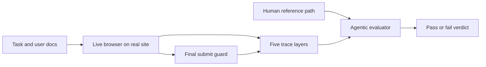

# Day 17: ClawBench — Can AI Agents Complete Everyday Online Tasks?

> **Watch the animation**: 

## One-Line Summary

ClawBench measures whether browser agents can finish real everyday online tasks on live production websites, and it shows that even strong frontier models remain far from reliable automation once tasks become write-heavy, state-changing, and safety-constrained.

---

## Why This Matters

### Existing Agent Benchmarks Are Often Too Clean

Recent web-agent systems look strong on benchmarks such as WebArena or OSWorld, but many of those settings simplify the world:

- offline or self-hosted websites
- fixed DOM structure
- limited dynamic content
- read-heavy tasks instead of write-heavy workflows

That makes evaluation convenient, but it also hides the actual failure modes people care about in daily life:

- filling long forms correctly
- uploading the right document
- navigating multi-page workflows
- handling popups, redirects, and dynamic rendering

### ClawBench Changes the Question

Instead of asking "Can an agent browse a simplified website?", ClawBench asks:

**Can an agent safely complete the kind of online tasks people actually delegate?**

The paper frames this with 153 tasks across 144 live platforms and 15 life categories, including purchases, appointments, and job applications.

---

## Core Insight

### 1. Realism Comes From Live Websites

ClawBench does not recreate websites in a sandbox. The agent operates on **production websites** in a real browser.

That means the benchmark includes the messy things real users face:

- dynamic JavaScript
- cookie banners
- varying form schemas
- multi-step navigation
- task-specific documents and payloads

This is why success on cleaner benchmarks does not transfer directly.

### 2. Safety Comes From Final-Request Interception

Live websites are realistic, but they create a risk: a successful task might trigger a real purchase, submission, or booking.

ClawBench solves this with a narrow intervention:

- the agent is allowed to browse normally
- outgoing network traffic is monitored
- the **final submission request** is intercepted and blocked

So the benchmark preserves nearly all of the real workflow while preventing irreversible side effects.

### 3. Evaluation Is Trace-Based, Not Guess-Based

The paper records five evidence layers for each run:

1. session replay
2. per-step screenshots
3. HTTP traffic
4. agent messages and tool calls
5. low-level browser actions

Then an **Agentic Evaluator** compares the agent trajectory with a human reference trajectory under a fixed rubric. This matters because web tasks often have multiple valid paths, so raw action matching is too brittle.

### 4. The Headline Result Is Harsh

The strongest model in the paper, **Claude Sonnet 4.6**, achieves only **33.3%** success rate on ClawBench. The paper also reports **GPT-5.4 at 6.5%** on this benchmark, despite both models being much stronger on established web-agent benchmarks.

That gap is the point: current agent stacks are still brittle on everyday online tasks.

---

## Architecture Walkthrough



### What Makes This Pipeline Different

- **Live execution** preserves real web complexity.
- **Guarded submission** keeps the benchmark safe.
- **Multi-layer traces** make failures inspectable.
- **Reference-based evaluation** avoids naive URL-only or screenshot-only scoring.

---

## Mathematical Formulation

### Binary Task Score

For each task $t$, the evaluator outputs:

$$\mathrm{Score}(t) \in \{0, 1\}$$

where:

- $1$ means the task was completed correctly
- $0$ means the task failed or diverged from the required outcome

### Success Rate

For a task set $T$, the overall success rate is:

$$\mathrm{SR}(T) = \frac{1}{|T|} \sum_{t \in T} \mathrm{Score}(t)$$

This is the main metric used in the paper.

### Trace-Grounded Evaluation

A useful abstraction of the evaluator is:

$$\mathcal{A}(x_t,\tau_a^{(t)},\tau_h^{(t)}) \rightarrow \{0,1\}$$

where:

- $x_t$ is the task instruction and verification conditions
- $\tau_a^{(t)}$ is the recorded agent trajectory
- $\tau_h^{(t)}$ is the recorded human reference trajectory

The key idea is that success is judged against **evidence and intent**, not just a final screenshot.

---

## Implementation

```python
from dataclasses import dataclass, field
from typing import Dict, List, Tuple


@dataclass
class TaskSpec:
    """A simplified ClawBench-style task."""
    task_id: str
    instruction: str
    required_fields: Dict[str, str]
    category: str


@dataclass
class TraceBundle:
    """Five layers of evidence captured during execution."""
    replay_frames: int
    screenshots: List[str] = field(default_factory=list)
    http_requests: List[Dict[str, str]] = field(default_factory=list)
    agent_messages: List[str] = field(default_factory=list)
    browser_actions: List[str] = field(default_factory=list)


class FinalSubmitGuard:
    """
    Blocks the irreversible submission request while preserving the rest
    of the browser workflow.
    """

    def intercept(self, request: Dict[str, str]) -> Tuple[bool, str]:
        if request.get("kind") == "final-submit":
            return True, "blocked final submit safely"
        return False, "allowed"


class AgenticEvaluator:
    """
    Scores a task by checking whether the final blocked payload matches
    the task requirements. This is much simpler than the real paper,
    but it captures the core evaluation idea.
    """

    def score(self, task: TaskSpec, traces: TraceBundle) -> Tuple[int, List[str]]:
        reasons: List[str] = []
        final_payload = None

        for req in traces.http_requests:
            if req.get("kind") == "final-submit":
                final_payload = req
                break

        if final_payload is None:
            return 0, ["no submission payload captured"]

        for key, expected in task.required_fields.items():
            actual = final_payload.get(key)
            if actual != expected:
                reasons.append(f"field mismatch: {key} expected={expected} got={actual}")

        if not traces.browser_actions:
            reasons.append("no browser actions recorded")
        if not traces.agent_messages:
            reasons.append("no reasoning trace recorded")

        return (1, ["pass"]) if not reasons else (0, reasons)


def success_rate(results: List[int]) -> float:
    return sum(results) / len(results) if results else 0.0


if __name__ == "__main__":
    task = TaskSpec(
        task_id="job-apply-001",
        instruction="Submit a job application with the provided resume.",
        required_fields={"name": "Ada Lovelace", "resume": "resume.pdf"},
        category="work",
    )

    traces = TraceBundle(
        replay_frames=412,
        screenshots=["step1.png", "step2.png"],
        http_requests=[
            {"kind": "navigate", "url": "https://jobs.example.com"},
            {
                "kind": "final-submit",
                "name": "Ada Lovelace",
                "resume": "resume.pdf",
            },
        ],
        agent_messages=["I found the upload form.", "I am ready to submit."],
        browser_actions=["click upload", "type name", "click submit"],
    )

    guard = FinalSubmitGuard()
    blocked, message = guard.intercept(traces.http_requests[-1])
    print(f"guard: blocked={blocked}, message={message}")

    evaluator = AgenticEvaluator()
    score, details = evaluator.score(task, traces)
    print(f"score={score}, details={details}")
    print(f"success rate={success_rate([score]):.3f}")
```

---

## What ClawBench Teaches Us

1. **Real-world browser agency is still brittle.**
2. **Write-heavy tasks are much harder than read-only browsing.**
3. **Safe evaluation needs network-level intervention, not just sandbox simulation.**
4. **Good agent evaluation should be traceable and diagnosable, not only outcome-based.**
5. **Benchmark wins on synthetic sites do not guarantee everyday usefulness.**

---

## Related Tutorials

- [Day 05: Multi-Agent Reflection](/tutorials/en/agent/05-multi-agent-reflection.md)
- [Day 15: HDPO — Meta-Cognitive Tool Use](/tutorials/en/agent/15-hdpo.md)

---

## References

- [ClawBench: Can AI Agents Complete Everyday Online Tasks?](https://arxiv.org/abs/2604.08523) — Zhang et al., 2026-04-09
- [ClawBench official site](https://www.clawbench.com/)

---

---

## Quick Quiz

Test your understanding of this topic.

### Q1. What is the core mechanism described in this tutorial?

- A. A new attention variant
- B. A training or inference algorithm
- C. A hardware optimization
- D. A dataset format

<details>
<summary>Reveal Answer</summary>

**Answer: B** — This tutorial focuses on a agent system.

*Explanation varies by tutorial — see the Core Insight section for the key takeaway.*

</details>

### Q2. When does this approach work best?

- A. Only on very large models
- B. Only on small models
- C. Under specific conditions detailed in the tutorial
- D. Always, regardless of setup

<details>
<summary>Reveal Answer</summary>

**Answer: C** — The tutorial describes specific conditions and tradeoffs. Review the "Why This Matters" and "Limitations" sections.

</details>

### Q3. What is the main takeaway?

- A. Use this instead of all other approaches
- B. This is a niche optimization with no practical use
- C. A specific mechanism with clear use cases and tradeoffs
- D. This has been superseded by a newer method

<details>
<summary>Reveal Answer</summary>

**Answer: C** — Every tutorial in this repo focuses on a specific mechanism with its own tradeoffs. Check the One-Line Summary at the top and the "What [Topic] Teaches Us" section at the bottom.

</details>
