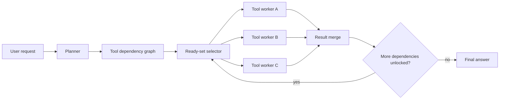

# Day 21: Parallel Tool Calling — Stop Making Agents Wait on Themselves

> **Watch the animation**: 

## One-Line Summary

Parallel tool calling lets an agent execute independent tool requests at the same time, so total latency tracks the longest dependency chain instead of the sum of every tool wait.

---

## Why This Matters

### Serial Tool Use Turns Smart Agents Into Slow Agents

A lot of agent loops still do something wasteful:

1. decide on one tool call
2. wait for it to finish
3. read the result
4. decide on the next tool call

That is correct when later steps depend on earlier outputs, but it is needlessly slow when the requests are independent:

- search for three sources
- fetch weather and calendar in parallel
- read multiple docs before writing a synthesis
- fan out retrieval across several indices

If the agent already knows the dependency structure, forcing serial execution just makes it wait on itself.

### The Frontier Signal Is Converging

This topic is worth a daily tutorial because the signal is broad rather than tied to one isolated demo:

- **arXiv**: recent work such as **W&D** and **SimpleTool** explicitly optimizes parallel tool or function execution
- **Hugging Face Papers**: both papers are surfaced there as current community-visible agent work
- **Reddit / r/LocalLLaMA**: practitioners are actively enabling `parallel_tool_calls` in local inference stacks because it changes real agent latency

So the durable concept is not merely "a new agent benchmark" or "a new tool model". It is:

**agent latency depends on scheduling, not only on model quality.**

---

## Core Insight

### 1. Tool Calls Form A Dependency Graph

An agent request often decomposes into sub-questions:

- gather evidence
- compute or transform values
- merge the results

Some of these steps depend on each other, but many do not. The right abstraction is therefore a **dependency graph**, not a single chain.

### 2. Parallelism Should Follow Readiness, Not Blind Fan-Out

The point is not "launch everything at once".

That would:

- waste tokens
- over-query tools
- create merge noise

Instead, the agent should:

1. plan which tool outputs are required
2. identify which calls are ready now
3. execute the ready set concurrently
4. merge results
5. unlock the next dependent layer

This is closer to DAG scheduling than to naive multi-threading.

### 3. The Latency Objective Changes Completely

In a serial loop, total time is approximately:

$$
T_{\mathrm{seq}} = \sum_{i=1}^{n} \tau_i
$$

where $\tau_i$ is the latency of tool call $i$.

In a layered parallel schedule, total time becomes:

$$
T_{\mathrm{par}} = \sum_{k=1}^{K} \max_{i \in L_k} \tau_i + \tau_{\mathrm{merge}}
$$

where $L_k$ is the set of tool calls in parallel layer $k$.

That means the optimization target shifts from "reduce every tool latency" to:

**shorten the critical path and keep merge overhead small.**

### 4. Better Scheduling Also Changes Training And Decoding

Recent systems attack this from different layers:

- **W&D** treats the problem as efficient deep-research agent orchestration
- **SimpleTool** pushes toward real-time function calling with parallel decoding

Different mechanisms, same lesson:

**agents need explicit structure for concurrent action, not just stronger next-token prediction.**

---

## Architecture Walkthrough



### What Changes Compared With A Basic Agent Loop

- The planner outputs **structure**, not just the next call.
- Execution happens in **layers of ready work**.
- Merging is a first-class step, because parallel calls create multiple partial results.
- The agent stops being "one tool call at a time" and starts behaving like a small workflow engine.

---

## Mathematical Formulation

### Dependency Graph

Let the tool plan be a directed acyclic graph:

$$
G = (V, E)
$$

where:

- $V$ is the set of tool calls
- $E$ contains precedence constraints

An edge $(u, v) \in E$ means tool call $v$ cannot start until $u$ finishes.

### Serial Execution Cost

If every call is executed one by one, the latency is:

$$
T_{\mathrm{seq}} = \sum_{i=1}^{n} \tau_i
$$

This ignores that many calls may have no dependency relation at all.

### Layered Parallel Execution Cost

Partition the DAG into ready layers $L_1, L_2, \dots, L_K$. Then:

$$
T_{\mathrm{par}} = \sum_{k=1}^{K} \max_{i \in L_k} \tau_i + \tau_{\mathrm{merge}}
$$

where:

- $\tau_i$ is the latency of call $i$
- $\tau_{\mathrm{merge}}$ is the result integration overhead

### Speedup

The latency speedup is:

$$
S = \frac{T_{\mathrm{seq}}}{T_{\mathrm{par}}}
$$

Parallel tool calling is useful only when:

- enough calls are independent
- merge overhead stays controlled
- tool quality does not degrade under concurrency

So this is a systems tradeoff, not a free lunch.

---

## Python Code Implementation

```python
import asyncio
import time
from dataclasses import dataclass, field


@dataclass
class ToolSpec:
    name: str
    latency: float
    deps: set[str] = field(default_factory=set)


async def run_tool(spec: ToolSpec) -> tuple[str, float]:
    await asyncio.sleep(spec.latency)
    return spec.name, spec.latency


def ready_set(specs: dict[str, ToolSpec], done: set[str], launched: set[str]) -> list[ToolSpec]:
    ready: list[ToolSpec] = []
    for spec in specs.values():
        if spec.name in launched:
            continue
        if spec.deps.issubset(done):
            ready.append(spec)
    return ready


async def run_parallel(specs: list[ToolSpec]) -> float:
    spec_map = {spec.name: spec for spec in specs}
    done: set[str] = set()
    launched: set[str] = set()
    started = time.perf_counter()

    while len(done) < len(specs):
        layer = ready_set(spec_map, done, launched)
        if not layer:
            raise ValueError("dependency cycle detected")

        launched.update(spec.name for spec in layer)
        results = await asyncio.gather(*(run_tool(spec) for spec in layer))
        done.update(name for name, _ in results)

    return time.perf_counter() - started


async def run_serial(specs: list[ToolSpec]) -> float:
    started = time.perf_counter()
    for spec in specs:
        await run_tool(spec)
    return time.perf_counter() - started


async def main() -> None:
    specs = [
        ToolSpec("search_web", 0.20),
        ToolSpec("read_docs", 0.30),
        ToolSpec("compute_quote", 0.10),
        ToolSpec("merge_answer", 0.05, {"search_web", "read_docs", "compute_quote"}),
    ]

    serial_time = await run_serial(specs)
    parallel_time = await run_parallel(specs)
    print(f"serial={serial_time:.3f}s")
    print(f"parallel={parallel_time:.3f}s")
    print(f"speedup={serial_time / parallel_time:.2f}x")


if __name__ == "__main__":
    asyncio.run(main())
```

This toy example captures the core behavior:

- three independent calls can run together
- the merge step waits for all of them
- total latency is dominated by the slowest branch in the ready set

---

## What Parallel Tool Calling Teaches Us

1. **Agent speed is partly a scheduling problem.**
2. **Independent tool calls should be treated as a graph, not a chain.**
3. **The right objective is critical-path latency, not raw call count alone.**
4. **Parallel execution still needs disciplined merge logic.**
5. **Better tool orchestration can improve user experience even without changing the base model.**

---

## Related Tutorials

- [Day 05: Multi-Agent Reflection](/tutorials/en/agent/05-multi-agent-reflection.md)
- [Day 15: HDPO — Meta-Cognitive Tool Use](/tutorials/en/agent/15-hdpo.md)
- [Day 17: ClawBench — Everyday Online Tasks for Agents](/tutorials/en/agent/17-clawbench.md)

---

## References

- [W&D: Scaling Parallel Tool Calling for Efficient Deep Research Agents](https://arxiv.org/abs/2602.07359) — 2026-02-10
- [SimpleTool: Parallel Decoding for Real-Time LLM Function Calling](https://arxiv.org/abs/2603.00030) — 2026-03-01
- [W&D on Hugging Face Papers](https://huggingface.co/papers/2602.07359)
- [SimpleTool on Hugging Face Papers](https://huggingface.co/papers/2603.00030)
- [LocalLLaMA discussion mentioning `parallel_tool_calls`](https://www.reddit.com/r/LocalLLaMA/comments/1sner7l/lazy_persons_model_param_management_for_llamacpp/)
