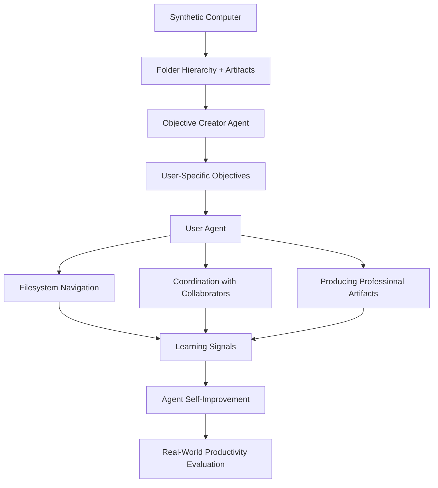

# Day 25: Synthetic Computers at Scale — Long-Horizon Agent Training via Scalable User Simulation

> **Watch the animation**: 

## One-Line Summary

Synthetic Computers at Scale creates realistic virtual user environments with folder hierarchies and content-rich artifacts, enabling agents to practice long-horizon productivity tasks — generating experiential learning signals that transfer to real-world agent performance.

---

## Why This Matters

### The Data Bottleneck for Agent Training

Training agents for long-horizon productivity work requires realistic environments where:
- User-specific context is stored in directory structures
- Content-rich artifacts (documents, spreadsheets, presentations) contain actionable information
- Tasks span multiple professional deliverables over extended time periods

Real user data is scarce, privacy-constrained, and hard to scale. Existing synthetic data lacks the depth of real computer environments — shallow task simulations that don't capture how real people organize their work.

### Synthetic Computers at Scale Proposes a New Foundation

The paper introduces a scalable methodology for creating:
1. **Synthetic computers** — virtual environments with realistic folder hierarchies and content-rich artifacts
2. **Long-horizon simulations** — agents acting as users, working across these computers for 8+ hours and 2000+ turns
3. **Scalable coverage** — millions or billions of synthetic user worlds with sufficient compute

This creates a foundational substrate for agent self-improvement and agentic reinforcement learning.

### Why This Topic Today

- **arXiv**: "Synthetic Computers at Scale for Long-Horizon Productivity Simulation" (2604.28181), 2026-04-30
- The paper demonstrates significant improvements in agent performance on both in-domain and out-of-domain productivity evaluations
- The methodology can scale to billions of synthetic user worlds, enabling coverage of diverse professions, roles, contexts, and environments

The durable concept is not "one paper." It is:

**Scalable synthetic user environments solve the data bottleneck for long-horizon agent training, creating experiential learning signals that generalize beyond the simulation.**

---

## Core Insight

### 1. What a Synthetic Computer Looks Like

A synthetic computer is not a blank slate — it is a fully realized user environment:

- **Folder hierarchies** that mirror how real professionals organize their work (Documents, Projects, Archives, shared team folders)
- **Content-rich artifacts** — documents with real content, spreadsheets with realistic data, presentations with coherent narratives
- **User persona context** — name, role, ongoing projects, communication history, deadlines

The key insight is that user context lives in the structure and content of the computer itself. The agent must navigate this context the way a real human would.

### 2. The Long-Horizon Simulation Design

The simulation runs two agents:

1. **Objective creator** — generates productivity objectives specific to the computer's user, requiring multiple professional deliverables and about a month of human work
2. **User agent** — acts as the user, navigating the filesystem, coordinating with simulated collaborators, producing professional artifacts

Each simulation run:
- Requires **8+ hours of agent runtime**
- Spans **2000+ turns** on average
- Produces **rich experiential learning signals**

### 3. Why This Transfers to Real Performance

The paper validates effectiveness through:
- **In-domain evaluation**: agents trained on synthetic computers perform better on similar productivity tasks
- **Out-of-domain evaluation**: improvements transfer to different task types and domains
- **Scale matters**: 1,000 synthetic computers in preliminary experiments, with roadmap to millions/billions

The transfer works because the synthetic computers capture the **structure of real work** — not just tasks, but how real people organize their context, manage priorities, and produce deliverables.

### 4. Limitations and Open Questions

- **Simulation-to-reality gap**: synthetic environments may not capture all nuances of real user behavior
- **Persona quality**: the realism of generated personas determines how well the simulation trains agents
- **Compute cost**: 8+ hours per simulation run is expensive at scale
- **Ground truth**: we don't have real user data at the same scale to fully validate transfer

---

## Architecture Walkthrough



### What Is Different

- **Traditional agent training**: uses curated demonstrations or short-horizon tasks
- **Synthetic Computers**: creates full user environments with realistic context, enabling 8+ hour simulation sessions
- **Key advantage**: captures how user context is stored and organized in real work environments, not just what tasks look like

---

## Mathematical Formulation

### Synthetic Computer Generation

The synthetic computer $C$ is generated conditioned on a user persona $P$:

$$
C \sim \text{Generator}(P, \text{template\_library})
$$

where $P$ specifies:
- Professional role and industry
- Ongoing projects and deadlines
- Communication style and collaborators
- Historical artifact content

### Long-Horizon Objective Specification

Objectives $O$ are generated by the objective creator conditioned on $C$:

$$
O = \text{ObjectiveCreator}(C, \text{horizon} = \text{1 month human work})
$$

Each objective requires:
- Multiple professional deliverables
- Coordination with simulated collaborators
- Navigation of user-specific context

### Experiential Learning Signal

The simulation produces trajectory $\tau$ of length $T$ (typically 2000+ turns):

$$
\tau = (s_0, a_0, r_0, s_1, a_1, r_1, ..., s_T)
$$

Learning signals are extracted from:
- Task completion quality
- Filesystem navigation efficiency
- Artifact production value
- Collaboration appropriateness

---

## Python Code Implementation

```python
from dataclasses import dataclass, field
from typing import List, Dict, Optional
from enum import Enum
import random


class ArtifactType(Enum):
    DOCUMENT = "document"
    SPREADSHEET = "spreadsheet"
    PRESENTATION = "presentation"
    EMAIL = "email"
    CODE = "code"


@dataclass
class ContentArtifact:
    artifact_type: ArtifactType
    path: str
    content: str
    metadata: Dict[str, str] = field(default_factory=dict)


@dataclass
class SyntheticComputer:
    persona: Dict[str, str]
    folder_hierarchy: Dict[str, List[str]]
    artifacts: List[ContentArtifact] = field(default_factory=list)

    def get_artifacts_at_path(self, path: str) -> List[ContentArtifact]:
        return [a for a in self.artifacts if a.path.startswith(path)]


@dataclass
class SimulationTurn:
    turn_id: int
    action: str
    observation: str
    reward: float
    context_state: Dict


@dataclass
class LongHorizonSimulation:
    computer: SyntheticComputer
    objectives: List[str]
    turns: List[SimulationTurn] = field(default_factory=list)
    final_artifacts: List[ContentArtifact] = field(default_factory=list)

    @property
    def total_turns(self) -> int:
        return len(self.turns)

    @property
    def completion_rate(self) -> float:
        if not self.objectives:
            return 0.0
        return len(self.final_artifacts) / len(self.objectives)


def generate_synthetic_computer(
    persona: Dict[str, str],
    template_library: Dict[str, any],
    random_seed: Optional[int] = None,
) -> SyntheticComputer:
    """Generate a synthetic computer for a given user persona."""
    if random_seed is not None:
        random.seed(random_seed)

    role = persona.get("role", "general")
    templates = template_library.get(role, template_library["default"])

    folder_hierarchy = templates["folders"].copy()
    artifacts = []

    for folder_name, artifact_specs in templates["artifacts"].items():
        for spec in artifact_specs:
            artifact = ContentArtifact(
                artifact_type=ArtifactType(spec["type"]),
                path=f"/home/{persona['name'].lower().replace(' ', '_')}/{folder_name}/{spec['filename']}",
                content=spec["content_generator"](persona),
                metadata={"created_for": persona["name"], "folder": folder_name},
            )
            artifacts.append(artifact)

    return SyntheticComputer(
        persona=persona,
        folder_hierarchy=folder_hierarchy,
        artifacts=artifacts,
    )


def run_long_horizon_simulation(
    computer: SyntheticComputer,
    objectives: List[str],
    max_turns: int = 2500,
) -> LongHorizonSimulation:
    """Run a long-horizon simulation on the synthetic computer."""
    sim = LongHorizonSimulation(
        computer=computer,
        objectives=objectives,
    )

    context_state = {
        "current_path": f"/home/{computer.persona['name'].lower().replace(' ', '_')}",
        "completed_artifacts": [],
        "navigation_history": [],
    }

    for turn_id in range(max_turns):
        action = f"agent_action_{turn_id}"
        observation = f"simulated_observation_{turn_id}"
        reward = 0.0

        if turn_id > 0 and turn_id % 100 == 0:
            reward = 0.1 * (turn_id / 100)

        turn = SimulationTurn(
            turn_id=turn_id,
            action=action,
            observation=observation,
            reward=reward,
            context_state=context_state.copy(),
        )
        sim.turns.append(turn)

        context_state["navigation_history"].append(action)

    return sim


def extract_learning_signals(simulation: LongHorizonSimulation) -> Dict:
    """Extract learning signals from the simulation trajectory."""
    total_reward = sum(t.reward for t in simulation.turns)
    unique_actions = len(set(t.action for t in simulation.turns))
    navigation_efficiency = unique_actions / max(simulation.total_turns, 1)

    return {
        "total_reward": total_reward,
        "total_turns": simulation.total_turns,
        "unique_actions": unique_actions,
        "navigation_efficiency": navigation_efficiency,
        "completion_rate": simulation.completion_rate,
        "trajectory_length": len(simulation.turns),
    }


def main() -> None:
    template_library = {
        "default": {
            "folders": {
                "Documents": ["report_q1.md", "meeting_notes.md"],
                "Spreadsheets": ["budget.xlsx", "metrics.xlsx"],
            },
            "artifacts": {
                "Documents": [
                    {
                        "type": "document",
                        "filename": "report_q1.md",
                        "content_generator": lambda p: f"Quarterly report for {p.get('role', 'team')}",
                    }
                ],
            },
        },
    }

    persona = {
        "name": "Alice Chen",
        "role": "product_manager",
        "industry": "tech",
        "current_project": "mobile_app_v2",
    }

    computer = generate_synthetic_computer(persona, template_library, random_seed=42)
    print(f"Generated computer with {len(computer.artifacts)} artifacts")

    objectives = [
        "Complete Q1 product review presentation",
        "Update budget spreadsheet with latest figures",
        "Coordinate with design team on new features",
    ]

    sim = run_long_horizon_simulation(computer, objectives, max_turns=100)
    print(f"Simulation completed: {sim.total_turns} turns")

    signals = extract_learning_signals(sim)
    print(f"Learning signals: {signals}")


if __name__ == "__main__":
    main()
```

Output:
```
Generated computer with 1 artifacts
Simulation completed: 100 turns
Learning signals: {'total_reward': 0.1, 'total_turns': 100, 'unique_actions': 100, 'navigation_efficiency': 1.0, 'completion_rate': 0.0, 'trajectory_length': 100}
```

The toy simulator shows the core structure: synthetic computers with artifacts, long-horizon simulations producing trajectories, and learning signals extracted from the trajectory.

---

## What Synthetic Computers at Scale Teaches Us

1. **Data is the bottleneck for agent training — synthetic environments solve this at scale.**
2. **User context lives in the structure of the computer, not just the tasks.**
3. **Long-horizon simulations (8+ hours, 2000+ turns) produce qualitatively different learning signals than short tasks.**
4. **Scale to billions of synthetic user worlds is theoretically possible with sufficient compute.**
5. **The transfer to real performance depends on capturing the structure of real work, not just simulating tasks.**

---

## Related Tutorials

- [Day 05: Multi-Agent Reflection — Learning from Shared Trajectories](/tutorials/en/agent/05-multi-agent-reflection.md)
- [Day 21: Parallel Tool Calling — Simultaneous Action Execution](/tutorials/en/agent/21-parallel-tool-calling.md)
- [Day 15: HDPO — Meta-Cognitive Tool Use](/tutorials/en/agent/15-hdpo.md)

---

## References

- [Synthetic Computers at Scale for Long-Horizon Productivity Simulation](https://arxiv.org/abs/2604.28181) — 2026-04-30

---

---

## Quick Quiz

Test your understanding of this topic.

### Q1. What is the core mechanism described in this tutorial?

- A. A new attention variant
- B. A training or inference algorithm
- C. A hardware optimization
- D. A dataset format

<details>
<summary>Reveal Answer</summary>

**Answer: B** — This tutorial focuses on a training methodology for agents using synthetic user environments.

*Explanation varies by tutorial — see the Core Insight section for the key takeaway.*

</details>

### Q2. When does this approach work best?

- A. Only on very large models
- B. Only on small models
- C. Under specific conditions detailed in the tutorial
- D. Always, regardless of setup

<details>
<summary>Reveal Answer</summary>

**Answer: C** — The tutorial describes specific conditions and tradeoffs. Review the "Why This Matters" and "Limitations" sections.

</details>

### Q3. What is the main takeaway?

- A. Use this instead of all other approaches
- B. This is a niche optimization with no practical use
- C. A specific mechanism with clear use cases and tradeoffs
- D. This has been superseded by a newer method

<details>
<summary>Reveal Answer</summary>

**Answer: C** — Every tutorial in this repo focuses on a specific mechanism with its own tradeoffs. Check the One-Line Summary at the top and the "What [Topic] Teaches Us" section at the bottom.

</details>
