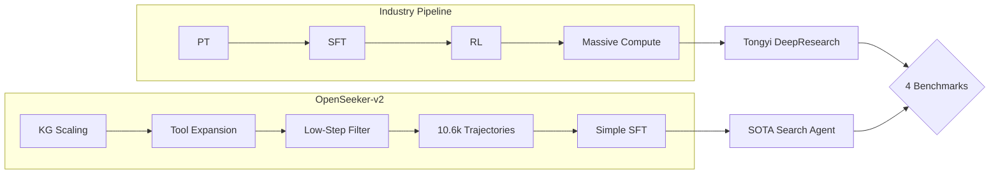

# Day 29: OpenSeeker-v2 — Frontier Search Agents via Simple SFT

> **Watch the animation**: 

## TL;DR

OpenSeeker-v2 achieves SOTA search agent performance with **only SFT** (no CPT/RL), using 10.6k informative trajectories — 3 data synthesis tricks: knowledge graph scaling, tool expansion, and low-step filtering. Outperforms Tongyi DeepResearch trained with heavy CPT+SFT+RL pipeline.

## 1. Background: The Search Agent Problem

Deep search capabilities are critical for frontier LLM agents — synthesizing information across the web, reasoning about multi-step queries, and providing accurate, up-to-date answers.

**The Industry Approach** typically involves:
- **Continual Pre-training (CPT)**: Domain-specific continued pretraining
- **Supervised Fine-Tuning (SFT)**: Task-specific training
- **Reinforcement Learning (RL)**: Preference optimization

This pipeline is **resource-intensive** and dominated by industrial labs with massive compute budgets.

> *"When fueled with informative and high-difficulty trajectories, a simple SFT approach could be surprisingly powerful."*
> — OpenSeeker-v2 Authors

## 2. The Core Insight

The key hypothesis: **data quality > training pipeline complexity**.

Academic teams lack resources for heavy CPT+RL pipelines. But what if carefully curated, high-quality training data could close the gap?

OpenSeeker-v2 demonstrates that **frontier-level search agents can emerge from simple SFT when trained on the right data**.

## 3. Three Data Synthesis Modifications

OpenSeeker-v2 introduces three simple but impactful modifications to data synthesis:

### 3.1 Knowledge Graph Scaling

Enriching the knowledge graph with **larger scale and higher quality** connections enables richer exploration paths during data generation.

- Larger KG → More diverse query trajectories
- Better coverage of entity relationships
- Enables multi-hop reasoning chains

### 3.2 Tool Set Expansion

Expanding the available tool set size for broader functionality coverage:

```
Tools: search, browse, extract, summarize, compare, calculate, ...
```

More tools → More realistic, complex agent workflows → Better generalization.

### 3.3 Strict Low-Step Filtering

Rigorous filtering of trajectories based on **step count quality**:

- Remove trajectories that are too short (insufficient reasoning)
- Remove trajectories that are too long (inefficient/loopy)
- Keep only "Goldilocks zone" trajectories with optimal depth

## 4. Architecture & Training

### Model Configuration

OpenSeeker-v2 is a **30B parameter** model using the **ReAct paradigm** (Reasoning + Acting).

### Training Setup

| Component | Detail |
|-----------|--------|
| Training Method | Simple SFT only (no CPT, no RL) |
| Data Scale | 10.6k high-quality trajectories |
| Paradigm | ReAct (interleaved reasoning and actions) |
| Base Model | Not specified (model-agnostic approach) |

### Why SFT Alone Works

The three data modifications ensure each trajectory provides:
- **High information content** (KG scaling)
- **Complex tool-use patterns** (tool expansion)
- **Clean reasoning chains** (low-step filtering)

This creates a training signal dense enough that SFT captures what RL would otherwise discover.

## 5. Results

OpenSeeker-v2 achieves SOTA across **4 benchmarks**:

| Benchmark | OpenSeeker-v2 | Tongyi DeepResearch |
|-----------|:---:|:---:|
| BrowseComp | **46.0%** | 43.4% |
| BrowseComp-ZH | **58.1%** | 46.7% |
| Humanity's Last Exam (HLE) | **34.6%** | 32.9% |
| xbench | **78.0%** | 75.0% |

**Note**: Tongyi DeepResearch uses heavy CPT+SFT+RL pipeline.

### Key Achievement

> *"OpenSeeker-v2 represents the first state-of-the-art search agent within its model scale and paradigm to be developed by a purely academic team using only SFT."*

## 6. Mermaid Diagram: Pipeline Comparison



## 7. Key Takeaways

1. **Data quality beats pipeline complexity** — 10.6k well-crafted trajectories can outperform massive compute pipelines
2. **SFT is underrated** — With right data, simple SFT rivals RL-based approaches
3. **Academic accessibility** — Frontier search agents are now achievable without industrial-scale resources
4. **Three data synthesis tricks** — KG scaling, tool expansion, and low-step filtering are general principles applicable to other agent training

## 8. Quick Quiz

**Q1**: What are the three data synthesis modifications introduced by OpenSeeker-v2?

**Q2**: Why does OpenSeeker-v2's simple SFT approach work despite lacking CPT and RL stages?

**Q3**: On which benchmark does OpenSeeker-v2 show the largest improvement over Tongyi DeepResearch?

---

## Further Reading

- [OpenSeeker-v2 Paper](https://arxiv.org/abs/2605.04036) (arXiv:2605.04036)
- [Multi-Agent Reflection](/tutorials/en/act/agent/05-multi-agent-reflection.md) — Day 05's agent coordination
- [Parallel Tool Calling](/tutorials/en/act/agent/21-parallel-tool-calling.md) — Day 21's agent efficiency techniques

*Next: Day 30 — Another paper from the frontier*
