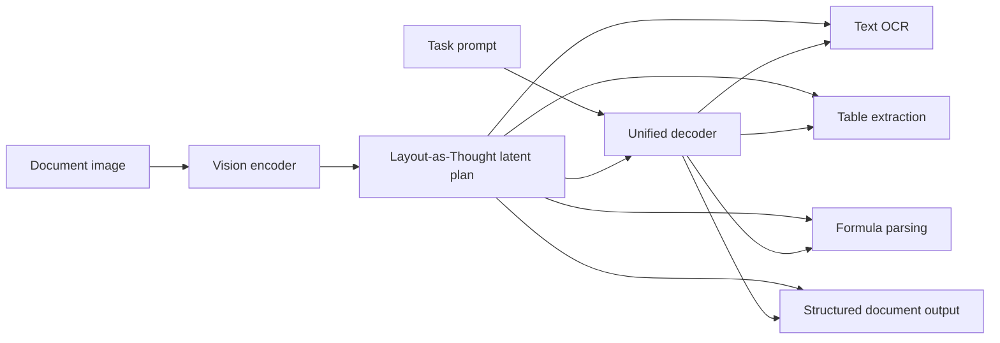

# Day 18: Qianfan-OCR - A Unified OCR Model That Thinks in Layout First

> **Watch the animation**: 

## One-Line Summary

Qianfan-OCR is a document understanding model that treats page layout as an explicit intermediate thought process, letting one decoder handle text OCR, tables, formulas, and structured parsing with less layout confusion than plain end-to-end token generation.

---

## Why This Matters

### OCR Is No Longer Just Text Recognition

Modern document AI has to solve several tasks at once:

- read dense paragraph text
- detect reading order across complex layouts
- recover tables, charts, and stamps
- preserve structure for downstream parsing

Classic OCR pipelines split this into many modules. That works, but every handoff introduces a new failure mode:

- detector misses a region
- reading order gets scrambled
- table cells lose alignment
- visual elements are flattened into plain text

### End-to-End VLMs Also Have a Weak Spot

Large vision-language models can read documents directly, but pure autoregressive decoding often mixes up *where* content is located with *what* content should be emitted next.

That creates the document analogue of reasoning drift:

- text from adjacent regions gets interleaved
- multi-column order breaks
- chart captions and body text leak into each other
- parsing quality falls on dense enterprise documents

Qianfan-OCR attacks this by making layout an explicit latent step instead of hoping the decoder will implicitly keep the page organized.

---

## Core Insight

### 1. Layout Becomes an Explicit Thought Trace

The model first builds a structured internal representation of page regions, order, and element types. The paper describes this as **Layout-as-Thought**.

Instead of directly mapping image patches to output tokens, the system inserts an intermediate latent plan:

1. detect and organize semantic regions
2. infer reading order and structure
3. decode the requested task from that plan

This is the main reason the method is teachable: it is not "just a bigger OCR model", it is an OCR model with an explicit planning bottleneck.

### 2. One Model Handles Many Document Tasks

The same backbone is used for:

- plain text OCR
- table extraction
- formula recognition
- chart and structured page parsing

The prompt tells the decoder which output mode to emit, while the latent layout representation stays shared.

### 3. Structure Improves Both Accuracy and Controllability

If layout is represented explicitly, the model no longer has to entangle spatial reasoning and text generation inside one opaque token stream.

That improves:

- reading order consistency
- robustness on mixed-layout pages
- reuse across multiple downstream document tasks

---

## Architecture Walkthrough



### Why This Is Different From a Plain OCR Stack

- The layout representation is **shared** across tasks.
- The decoder is **task-conditioned**, not separately retrained for every output type.
- The latent plan acts like a structural regularizer, reducing token-level confusion on complicated pages.

---

## Mathematical Formulation

### Standard End-to-End OCR

A plain autoregressive document model learns:

$$
p(y \mid x)
$$

where:

- $x$ is the document image
- $y$ is the emitted token sequence

This forces one model to solve perception, layout reasoning, and text generation all at once.

### Layout-As-Thought Factorization

Qianfan-OCR introduces an intermediate latent structure $z$:

$$
p(y \mid x, t) = \sum_z p(y \mid z, t) \, p(z \mid x)
$$

where:

- $x$ is the page image
- $z$ is the latent layout plan
- $t$ is the task prompt, such as OCR, table, or formula mode
- $y$ is the final decoded output

The key idea is that the hard visual parsing problem is decomposed into:

1. **layout inference**: $p(z \mid x)$
2. **task-specific decoding**: $p(y \mid z, t)$

### Why This Helps

When the page contains many competing regions, directly modeling $p(y \mid x)$ can create unstable decoding order. The latent plan reduces that burden by making structure explicit before token generation begins.

You can think of the gain as:

$$
\text{Document Quality} \approx f(\text{visual fidelity}, \text{layout consistency}, \text{task decoding})
$$

and Qianfan-OCR targets the middle term directly instead of treating it as an accidental byproduct.

---

## Python Code Implementation

```python
from dataclasses import dataclass
from typing import Literal


Task = Literal["ocr", "table", "formula"]


@dataclass
class Region:
    kind: str
    x1: int
    y1: int
    x2: int
    y2: int
    text_hint: str


class LayoutPlanner:
    """
    A simplified layout-as-thought planner.
    It converts unordered page regions into an explicit reading plan.
    """

    def infer_layout(self, regions: list[Region]) -> list[Region]:
        return sorted(regions, key=lambda r: (r.y1 // 80, r.x1))


class UnifiedDocumentDecoder:
    """
    A task-conditioned decoder that consumes the same layout plan
    and emits different document outputs.
    """

    def decode(self, layout: list[Region], task: Task) -> str:
        if task == "ocr":
            return "\n".join(region.text_hint for region in layout)

        if task == "table":
            rows = [region for region in layout if region.kind == "cell"]
            return "| cell |\n|---|\n" + "\n".join(f"| {cell.text_hint} |" for cell in rows)

        if task == "formula":
            formulas = [region.text_hint for region in layout if region.kind == "formula"]
            return "\n".join(formulas)

        raise ValueError(f"unsupported task: {task}")


if __name__ == "__main__":
    regions = [
        Region("title", 40, 20, 420, 70, "Quarterly Report"),
        Region("cell", 45, 180, 180, 220, "Revenue"),
        Region("cell", 190, 180, 320, 220, "$12.4M"),
        Region("formula", 40, 260, 320, 300, "margin = profit / revenue"),
        Region("text", 50, 100, 420, 150, "North America growth accelerated."),
    ]

    planner = LayoutPlanner()
    layout = planner.infer_layout(regions)

    decoder = UnifiedDocumentDecoder()
    print("OCR mode:\n", decoder.decode(layout, "ocr"))
    print("\nTable mode:\n", decoder.decode(layout, "table"))
    print("\nFormula mode:\n", decoder.decode(layout, "formula"))
```

---

## What Qianfan-OCR Teaches Us

1. **Document understanding benefits from explicit structure, not only larger decoders.**
2. **Layout is a reasoning problem, not merely a detection pre-processing step.**
3. **A shared latent plan can unify OCR, parsing, and table tasks inside one model family.**
4. **Prompt-conditioned document models become much more useful when spatial order is stabilized first.**
5. **Multimodal systems are increasingly moving toward "plan first, decode second" designs.**

---

## Related Tutorials

- [Day 08: Memory & KV Cache](/tutorials/en/memory/08-memory-kv-cache.md)
- [Day 12: Early Stopping for Large Reasoning Models](/tutorials/en/inference/12-early-stopping.md)

---

## References

- [Qianfan-OCR Technical Report](https://arxiv.org/abs/2603.13398) - Baidu OCR Team, 2026-03-11
- [Hugging Face Papers: Qianfan-OCR Technical Report](https://huggingface.co/papers/2603.13398)
- [Hugging Face model page: baidu/Qianfan-OCR](https://huggingface.co/baidu/Qianfan-OCR)
- [Reddit discussion on r/LocalLLaMA, 2026-03-18](https://www.reddit.com/r/LocalLLaMA/comments/1rx6x20/qianfanocr_4b_endtoend_document_ai_model_9312_on/)
