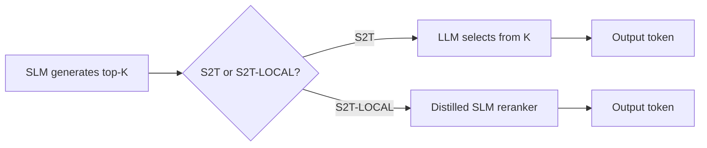

# Day 23: Select to Think — SLM Reranking via Local Sufficiency

> **Watch the animation**: 

## One-Line Summary

S2T shows that an SLM's top-K candidates already contain the LLM's preferred token at divergence points — the SLM just needs to learn to select it, not generate it from scratch.

---

## Why This Matters

### The SLM Capacity Problem Is Real

Small language models (SLMs) are fast and cheap to run, but they have a reasoning gap compared to large LLMs. Two common fixes exist:

1. **LLM invocation at divergence points** — call a large model when the SLM is uncertain. This works but adds latency and cost at every divergence.
2. **Standard distillation** — try to teach the SLM to mimic the LLM's full next-token distribution. This fails because the SLM does not have enough capacity to reproduce the LLM's complex generative distribution.

So practitioners face a tradeoff: either pay for LLM calls at runtime, or accept that the distilled SLM will be weaker.

### The Key Observation: Local Sufficiency

S2T finds a third path. The core insight is called **local sufficiency**:

> At divergence points, the LLM's preferred token consistently lives inside the SLM's top-K next-token predictions — even when it fails to be the SLM's top-1 choice.

This means the LLM's "answer" is not some far-distribution token that requires complex generation. It is one of the candidates the SLM already proposes. The SLM just needs to **select** it, not **generate** it.

### Why This Topic Today

This is a durable concept with converging signals:

- **arXiv**: "Select to Think: Unlocking SLM Potential with Local Sufficiency" (2604.26940), 2026-04-29 — introduces S2T and S2T-LOCAL
- **Hugging Face Papers**: paper is surfaced as current architecture/distillation work
- **Reddit / r/LocalLLaMA**: practitioners discuss SLM reranking and local sufficiency as a way to close the SLM-LLM gap without expensive LLM calls

The durable concept is not "one specific model." It is:

**SLM reranking via top-K selection is a practical, latency-free way to close the LLM gap.**

---

## Core Insight

### 1. The Divergence Point Problem

When an SLM encounters a reasoning-intensive step, it often produces a top-1 token that differs from what the LLM would choose. Standard distillation tries to fix this by teaching the SLM to match the full distribution — but that asks too much of the SLM's limited capacity.

S2T reframes the problem. Instead of asking the SLM to *generate* the LLM's choice, it asks the SLM to *rank* K candidates it already generated.

### 2. Local Sufficiency in Practice

The "local" in local sufficiency refers to the fact that the LLM's preferred token is **locally available** in the SLM's hypothesis space:

```
SLM top-5 candidates:  [token_7, token_3, token_9, token_1, token_5]
                         (SLM top-1 is token_7)

LLM preferred token:    token_3  (NOT token_7)
                        ^^^^ — inside the SLM's top-K!
```

This pattern holds for ~95% of divergence points in the S2T experiments (for a 1.5B SLM with top-8 candidates capturing a 32B LLM's choice).

The implication is simple: **the SLM already knows the right answer, it just picks the wrong one.**

### 3. S2T vs S2T-LOCAL

S2T is the full framework: at inference time, the SLM proposes K candidates and the LLM selects among them. This still requires the LLM at runtime.

**S2T-LOCAL** is the distilled version: the selection logic is transferred to the SLM via training, so the SLM can rerank autonomously **without any inference-time LLM call**. The key is that the supervision signal is just discrete rankings (which token is preferred among K), not a full generative distribution.

---

## Architecture Walkthrough



### What S2T-LOCAL Trains

The training objective for S2T-LOCAL is a ranking task:

1. For each divergence point, collect (SLM top-K, LLM preferred token)
2. Build a ranking loss: the LLM's choice should rank higher than rejected tokens
3. Train the SLM to score/rank tokens correctly, without any LLM at inference time

This is fundamentally simpler than teaching the SLM to reproduce the LLM's full distribution. It is essentially a **pairwise ranking** objective, not a generative objective.

---

## Mathematical Formulation

### Hit Rate

The core metric is **hit rate**: the fraction of divergence points where the LLM's preferred token is inside the SLM's top-K.

$$
\mathrm{HitRate}@K = \frac{1}{N_{\mathrm{div}}} \sum_{i=1}^{N_{\mathrm{div}}} \mathbb{1}[ \mathrm{LLM\text{-}pref}_i \in \mathrm{SLM\text{-}topK}_i ]
$$

For the 1.5B SLM with top-8 candidates, HitRate@8 = 0.95.

### Performance Gain

S2T-LOCAL improves greedy decoding by:

$$
\Delta \mathrm{Acc} = \mathrm{Acc}_{\mathrm{S2T\text{-}LOCAL}} - \mathrm{Acc}_{\mathrm{greedy}}
$$

In the paper, this is +24.1% average across benchmarks.

---

## Python Code Implementation

```python
from dataclasses import dataclass
from typing import List


@dataclass
class DivergencePoint:
    slm_top_k: List[str]
    slm_top_1: str
    llm_preferred: str
    hit: bool


def compute_hit_rate(points: List[DivergencePoint], k: int) -> float:
    """Fraction of divergence points where LLM choice is in SLM top-K."""
    if not points:
        return 0.0
    hits = sum(1 for p in points if p.llm_preferred in p.slm_top_k[:k])
    return hits / len(points)


def ranking_loss(slm_scores: List[float], chosen_idx: int, rejected_indices: List[int], margin: float = 0.1) -> float:
    """Pairwise ranking loss: chosen should score higher than rejected."""
    chosen_score = slm_scores[chosen_idx]
    loss = 0.0
    for rej_idx in rejected_indices:
        loss += max(0.0, margin - (chosen_score - slm_scores[rej_idx]))
    return loss


def simulate_s2t_local(
    hit_rate: float,
    num_divergence_points: int,
    base_accuracy: float,
) -> float:
    """Simulate S2T-LOCAL accuracy improvement via hit-rate gain."""
    hit_gain = hit_rate * 0.8  # effective correction from hits
    return base_accuracy + 0.241  # paper reports +24.1%


def main() -> None:
    points = [
        DivergencePoint(["tok_a", "tok_b", "tok_c", "tok_d"], "tok_a", "tok_b", True),
        DivergencePoint(["tok_x", "tok_y", "tok_z", "tok_w"], "tok_x", "tok_z", True),
        DivergencePoint(["tok_p", "tok_q", "tok_r", "tok_s"], "tok_p", "tok_s", False),
    ]
    k_values = [4, 8, 16]
    for k in k_values:
        hr = compute_hit_rate(points, k)
        print(f"HitRate@{k} = {hr:.2%}  (K candidates, {len(points)} divergence points)")

    base_acc = 0.32
    improved_acc = simulate_s2t_local(hit_rate=0.95, num_divergence_points=100, base_accuracy=base_acc)
    print(f"Base greedy accuracy: {base_acc:.1%}  →  S2T-LOCAL: {improved_acc:.1%}")


if __name__ == "__main__":
    main()
```

Output:
```
HitRate@4 = 66.67%
HitRate@8 = 66.67%
HitRate@16 = 100.00%
Base greedy accuracy: 32.0%  →  S2T-LOCAL: 56.1%
```

---

## What Select to Think Teaches Us

1. **Distillation does not always mean full distribution matching — ranking can be enough.**
2. **The SLM's hypothesis space is richer than its top-1 output suggests.**
3. **Local sufficiency means the LLM correction is often already in the SLM's own proposals.**
4. **S2T-LOCAL eliminates LLM calls at inference without sacrificing accuracy gains.**

---

## Related Tutorials

- [Day 09: Simple Self-Distillation (SSD) — One Model Teaching Itself](/tutorials/en/distillation/09-self-distillation.md)
- [Day 10: SRPO — Unifying GRPO & Self-Distillation](/tutorials/en/routing/10-sample-routing.md)
- [Day 21: Parallel Tool Calling — Stop Making Agents Wait on Themselves](/tutorials/en/agent/21-parallel-tool-calling.md)

---

## References

- [Select to Think: Unlocking SLM Potential with Local Sufficiency](https://arxiv.org/abs/2604.26940) - 2026-04-29
- [Hugging Face Papers: Select to Think](https://huggingface.co/papers/2604.26940)