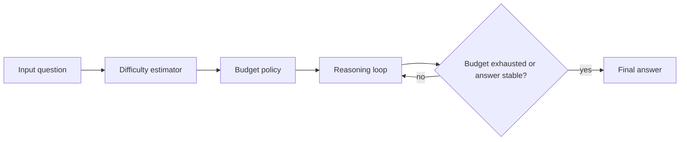
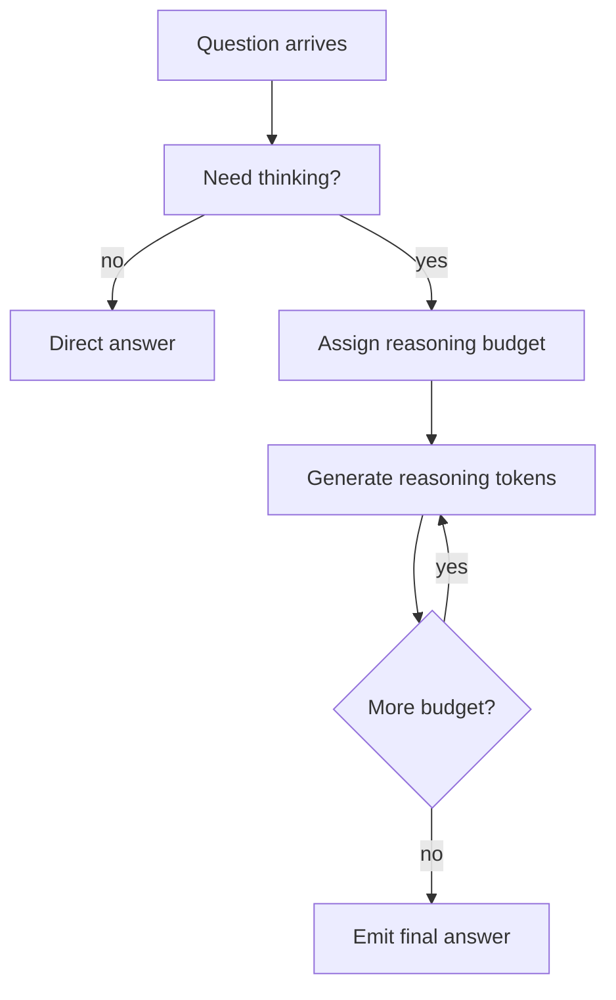

# Day 20: Adaptive Reasoning Budgets - Stopping LLMs from Overthinking

> **Watch the animation**: 

## One-Line Summary

Adaptive reasoning budgets let a model spend few thinking tokens on easy problems and many on hard ones, reducing latency and overthinking without collapsing performance on genuinely difficult tasks.

---

## Why This Matters

### Fixed Thinking Length Is A Bad Default

Reasoning models are increasingly deployed with an explicit "thinking mode", but fixed budgets create two opposite failures:

1. **Overthinking**: easy questions get thousands of unnecessary reasoning tokens
2. **Underthinking**: hard questions are cut off before the useful reasoning is finished

This is exactly the failure pattern highlighted by recent work such as **Plan-and-Budget** and **Think in Blocks**.

### The Frontier Has Shifted From "Can Models Reason?" To "Can They Reason Efficiently?"

This topic is worth a daily tutorial because the signal is broad, not isolated:

- **arXiv**: recent papers formalize budget allocation and adaptive reasoning depth
- **Hugging Face Papers**: the same papers are getting direct community visibility there
- **Reddit / r/LocalLLaMA**: practitioners are actively tuning Qwen-style `thinking_budget` and `reasoning-budget` controls to fight overthinking in real deployments

So the hot concept is not just one paper. It is the broader idea that **reasoning depth should be controllable and problem-dependent**.

---

## Core Insight

### 1. Reasoning Tokens Are A Compute Budget

A reasoning model often emits hidden or visible "thinking" tokens before the final answer. Those tokens are not free:

- they increase latency
- they increase serving cost
- they can make simple answers worse if the model starts second-guessing itself

So the number of reasoning tokens should be treated like a budget, not a fixed ritual.

### 2. The Right Budget Depends On Difficulty

A useful policy is:

- easy task -> short or zero reasoning trace
- medium task -> moderate reasoning trace
- hard task -> longer reasoning trace

This seems obvious, but many current inference pipelines still do something much simpler:

- always enable thinking mode
- set one global max budget
- hope the model self-regulates

That works poorly because the task distribution is not uniform.

### 3. Budgeting Can Happen At Multiple Levels

Different recent systems implement the same principle at different granularity:

- **global budget**: cap total reasoning tokens
- **block budget**: predict how many reasoning blocks to use
- **sub-question budget**: plan a decomposition, then assign different token budgets per sub-step

The high-level idea is the same:

**estimate where uncertainty lives, then spend compute there instead of everywhere.**

---

## Architecture Walkthrough



### A More Practical View



This is what makes the idea operational:

- not every task needs the same depth
- not every reasoning trace should run to a giant fixed cap
- the exit rule matters as much as the reasoning model itself

---

## Mathematical Formulation

### Difficulty-To-Budget Mapping

Let a difficulty estimator output a scalar score:

$$
d(x) \in [0, 1]
$$

where larger values mean the input $x$ appears harder.

We can map that score to a token budget:

$$
B(x) = B_{\min} + (B_{\max} - B_{\min}) \cdot d(x)
$$

where:

- $B_{\min}$ is the minimum reasoning budget
- $B_{\max}$ is the maximum reasoning budget
- $B(x)$ is the allocated reasoning budget for input $x$

### Block-Based Reasoning

If reasoning is partitioned into blocks instead of raw tokens, we can predict:

$$
K(x) = \left\lfloor K_{\max} \cdot d(x) \right\rfloor
$$

where $K(x)$ is the number of reasoning blocks.

This is the core move in block-based methods: first decide "how much thinking", then generate within that envelope.

### Efficiency-Aware Objective

A simple utility view is:

$$
U(x) = \mathrm{Acc}(x) - \lambda \cdot \mathrm{Cost}(x)
$$

where:

- $\mathrm{Acc}(x)$ is expected answer quality
- $\mathrm{Cost}(x)$ is token or latency cost
- $\lambda$ controls how expensive extra reasoning is

The deployment problem is to choose a budget policy that maximizes expected utility across the task distribution.

### Why Overthinking Appears

If the model is forced to continue past the useful reasoning point, quality can flatten or degrade:

$$
Q(T) \approx Q^\* - \gamma \cdot \max(0, T - T^\*)
$$

where:

- $T^\*$ is the useful reasoning length
- $Q^\*$ is peak quality
- $\gamma$ measures degradation after the optimum

This connects directly to Day 12: adaptive budgets are a broader policy layer, while early stopping is one concrete stopping mechanism.

---

## Python Code Implementation

```python
from dataclasses import dataclass
from typing import Iterable, List


@dataclass
class BudgetDecision:
    name: str
    difficulty: float
    reasoning_tokens: int
    answer_quality: float


class AdaptiveBudgetPolicy:
    """
    Maps a difficulty score in [0, 1] to a reasoning-token budget.
    """

    def __init__(self, min_budget: int = 0, max_budget: int = 12000) -> None:
        self.min_budget = min_budget
        self.max_budget = max_budget

    def allocate(self, difficulty: float) -> int:
        clipped = min(1.0, max(0.0, difficulty))
        return int(self.min_budget + clipped * (self.max_budget - self.min_budget))


def simulated_quality(difficulty: float, budget: int) -> float:
    """
    Toy quality curve:
    - hard problems need more tokens before quality rises
    - easy problems saturate early and may overthink
    """
    target = 1500 + int(9000 * difficulty)
    gap = abs(budget - target)
    base = 1.0 - min(gap / max(target, 1), 1.0)

    # Easy tasks degrade if we push too many reasoning tokens.
    if difficulty < 0.3 and budget > 4000:
        base -= 0.20

    return round(max(0.0, min(1.0, base)), 3)


def evaluate(policy: AdaptiveBudgetPolicy, items: Iterable[tuple[str, float]]) -> List[BudgetDecision]:
    decisions: List[BudgetDecision] = []
    for name, difficulty in items:
        budget = policy.allocate(difficulty)
        quality = simulated_quality(difficulty, budget)
        decisions.append(BudgetDecision(name, difficulty, budget, quality))
    return decisions


if __name__ == "__main__":
    policy = AdaptiveBudgetPolicy(min_budget=500, max_budget=12000)
    tasks = [
        ("easy arithmetic", 0.10),
        ("multi-hop QA", 0.45),
        ("olympiad math", 0.90),
    ]

    for item in evaluate(policy, tasks):
        print(
            f"{item.name:16s} "
            f"difficulty={item.difficulty:.2f} "
            f"budget={item.reasoning_tokens:5d} "
            f"quality={item.answer_quality:.3f}"
        )
```

---

## What Adaptive Reasoning Budgets Teach Us

1. **Reasoning quality is partly a compute-allocation problem, not only a model-size problem.**
2. **A single global thinking budget is usually the wrong systems policy.**
3. **Overthinking is not just a UX annoyance; it is a real efficiency and quality failure mode.**
4. **Budget control can be exposed as a product feature, a scheduler, or a learned policy.**
5. **The next generation of reasoning systems will likely combine planning, confidence signals, and explicit budget controls.**

---

## Related Tutorials

- [Day 04: Test-Time Compute Scaling](/tutorials/en/inference/04-test-time-compute.md)
- [Day 12: Early Stopping via Confidence Dynamics](/tutorials/en/inference/12-early-stopping.md)
- [Day 19: Looped Language Models - Reusing Depth for Latent Reasoning](/tutorials/en/architecture/19-looped-language-models.md)

---

## References

- [Plan and Budget: Effective and Efficient Test-Time Scaling on Large Language Model Reasoning](https://arxiv.org/abs/2505.16122) - 2025-05-22
- [Hugging Face Papers: Plan and Budget](https://huggingface.co/papers/2505.16122)
- [Think in Blocks: Adaptive Reasoning from Direct Response to Deep Reasoning](https://arxiv.org/abs/2508.15507) - 2025-08-21
- [Hugging Face Papers: Think in Blocks](https://huggingface.co/papers/2508.15507)
- [Qwen3 Technical Report](https://arxiv.org/abs/2505.09388) - 2025-05-14
- [Hugging Face Papers: Qwen3 Technical Report](https://huggingface.co/papers/2505.09388)
- [r/LocalLLaMA: How `thinking_budget` effect in Qwen3?](https://www.reddit.com/r/LocalLLaMA/comments/1kma57b/) - 2025-05-14
- [r/LocalLLaMA: llama.cpp now with a true reasoning budget!](https://www.reddit.com/r/LocalLLaMA/comments/1rr6wqb/llamacpp_now_with_a_true_reasoning_budget/) - 2026-03-11
- [r/LocalLLaMA: Qwen3.5 overthinking anxiety duct tape fix](https://www.reddit.com/r/LocalLLaMA/comments/1rv44vo/qwen35_overthinking_anxiety_duct_tape_fix/) - 2026-03-16
