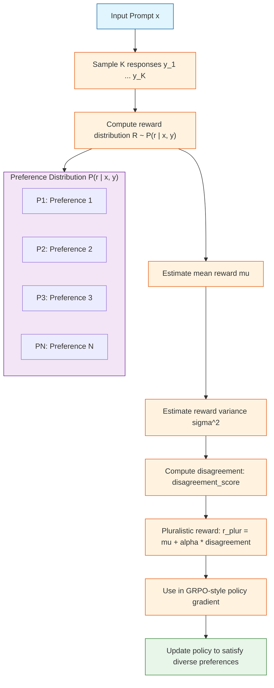

# Day 13: Pluralistic Alignment -- Capturing Diverse Human Preferences

---

## Quick Reference

**Core Problem:**

Standard alignment captures a single aggregate preference, collapsing all humans into one average. Pluralistic alignment models the full distribution of human preferences.

**Core Formula -- Disagreement-Aware Reward:**

$$r_{\text{pluralistic}}(x, y) = \underbrace{r_{\text{base}}(x, y)}_{\text{quality baseline}} + \underbrace{\alpha \cdot \text{disagreement}(x, y)}_{\text{disagreement bonus}}$$

Where:

$$\text{disagreement}(x, y) = \mathbb{E}_{u, v \sim P_{\text{human}}}}[\| \nabla_\theta \log \pi(y|x, u) - \nabla_\theta \log \pi(y|x, v) \|]$$

**One-liner (PyTorch):**

```python
reward = base_reward + alpha * disagreement_weight * disagreement_score
```

---

## One-Line Summary

Pluralistic Alignment replaces the single-preference reward model with a distribution-over-preferences model, explicitly rewarding outputs that satisfy diverse human viewpoints rather than collapsing to a monolithic average preference.

---

## Why This Matters

Standard RLHF produces a single reward signal that reflects an idealized "average human." This has three failure modes:

1. **Majority tyranny**: The model optimize for the majority preference, actively harming minorities.
2. **False consensus**: Ambiguous inputs where humans genuinely disagree get forced into a single response style.
3. **Preference collapse**: Over time, the model converges to a narrow band of "consensus" outputs, reducing output diversity.

Pluralistic Alignment addresses these by explicitly modeling and optimizing for the full distribution of human preferences, not just its mean.

| Dimension | Standard RLHF | Pluralistic Alignment |
|---|---|---|
| Preference model | Single reward function | Distribution over rewards |
| Optimization target | Mean preference | Full preference distribution |
| Minority handling | Ignored or averaged out | Explicitly preserved |
| Output diversity | Tends to collapse | Explicitly maintained |
| Computation overhead | Baseline | ~1.2x additional |

---

## Architecture



The key insight: instead of hiding disagreement behind a single scalar reward, Pluralistic Alignment makes disagreement a first-class citizen and explicitly rewards outputs that many diverse preferences can agree on.

---

## The Math

### 1. Standard RLHF Reward (Baseline)

Standard RLHF uses a learned reward model $r_\theta(x, y)$ trained on pairwise preferences:

$$\mathcal{L}_{\text{RM}}(\theta) = -\mathbb{E}_{(x, y_w, y_l) \sim \mathcal{D}}\left[\log \sigma(r_\theta(x, y_w) - r_\theta(x, y_l))\right]$$

The policy is then optimized to maximize this single reward signal:

$$\mathcal{L}_{\text{RLHF}}(\theta) = -\mathbb{E}_{(x, y) \sim \pi_\theta}\left[r_\theta(x, y)\right] + \beta \cdot D_{\text{KL}}(\pi_\theta \| \pi_{\text{ref}})$$

### 2. Pluralistic Reward Distribution

Pluralistic Alignment models the reward as a distribution rather than a point estimate. For each $(x, y)$, we have:

$$P(r | x, y) = \mathcal{N}(\mu(x, y), \sigma^2(x, y))$$

The mean $\mu(x, y)$ captures overall quality, while the variance $\sigma^2(x, y)$ captures how much humans disagree.

### 3. Disagreement-Aware Reward

The pluralistic reward combines quality with disagreement:

$$r_{\text{pluralistic}}(x, y) = \mu(x, y) + \alpha \cdot \sigma(x, y)$$

Where:
- $\mu(x, y)$ is the mean reward (quality signal)
- $\sigma(x, y)$ is the standard deviation (disagreement signal)
- $\alpha$ is a hyperparameter controlling how much disagreement matters

### 4. Preference Gradient Disagreement

An alternative formulation computes disagreement at the gradient level:

$$\text{disagreement}(x, y) = \mathbb{E}_{u, v \sim P_{\text{human}}}}[\| \nabla_\theta \log \pi(y|x, u) - \nabla_\theta \log \pi(y|x, v) \|]$$

This measures how much two different human preferences push the model's output distribution in different directions.

### 5. Pluralistic GRPO Loss

Combining with GRPO's group-relative advantage:

$$\mathcal{L}_{\text{Pluralistic-GRPO}} = -\mathbb{E}_{x \sim \mathcal{D}, (y_i)_{i=1}^G \sim \pi_{\theta_{\text{old}}}(\cdot|x)} \left[ \frac{1}{G} \sum_{i=1}^{G} \rho_i(\theta) \cdot A_i^{\text{pluralistic}} \right] - \beta \cdot D_{\text{KL}}$$

Where:

$$A_i^{\text{pluralistic}} = \frac{r_{\text{pluralistic}}(x, y_i) - \mu_{\text{group}}}{\sigma_{\text{group}}}$$

---

## Code Implementation

```python
import torch
import torch.nn as nn
import torch.nn.functional as F
from typing import Tuple, Optional


class PluralisticRewardHead(nn.Module):
    """Reward head that predicts both mean and variance of human preferences.

    Instead of predicting a single scalar reward, this head outputs
    two values: the mean reward mu and the log-variance log(sigma^2).
    This allows the model to express uncertainty about which response
    is "better" when humans genuinely disagree.
    """

    def __init__(self, hidden_dim: int):
        super().__init__()
        self.mean_head = nn.Linear(hidden_dim, 1)
        self.variance_head = nn.Linear(hidden_dim, 1)

    def forward(self, features: torch.Tensor) -> Tuple[torch.Tensor, torch.Tensor]:
        """Predict reward distribution parameters.

        Args:
            features: Shape (batch, hidden_dim) representations.

        Returns:
            mu: Shape (batch,) mean reward.
            log_var: Shape (batch,) log of reward variance.
        """
        mu = self.mean_head(features).squeeze(-1)
        log_var = self.variance_head(features).squeeze(-1)
        return mu, log_var


def pluralistic_reward(
    mu: torch.Tensor,
    log_var: torch.Tensor,
    alpha: float = 0.5,
) -> torch.Tensor:
    """Compute the disagreement-aware pluralistic reward.

    r = mu + alpha * sigma
    where sigma = sqrt(exp(log_var))

    Args:
        mu: Shape (G,) mean reward for each sample in the group.
        log_var: Shape (G,) log variance of reward distribution.
        alpha: Weight controlling importance of disagreement.

    Returns:
        pluralistic_reward: Shape (G,) combined quality + disagreement reward.
    """
    sigma = torch.exp(0.5 * log_var)  # std dev from log variance
    return mu + alpha * sigma


def group_advantage_pluralistic(
    pluralistic_rewards: torch.Tensor,
    eps: float = 1e-8,
) -> torch.Tensor:
    """Compute group-relative advantages for pluralistic rewards.

    Args:
        pluralistic_rewards: Shape (G,) pluralistic rewards per sample.
        eps: Small constant to prevent division by zero.

    Returns:
        advantages: Shape (G,) normalized advantages.
    """
    mean = pluralistic_rewards.mean()
    std = pluralistic_rewards.std() + eps
    return (pluralistic_rewards - mean) / std


def disagreement_gradient(
    log_probs_policy: torch.Tensor,
    log_probs_ref: torch.Tensor,
    temperature: float = 1.0,
) -> torch.Tensor:
    """Compute gradient-level disagreement between policy and reference.

    Measures how much the policy's output distribution differs from
    the reference across different preference conditions.

    Args:
        log_probs_policy: Shape (G, seq_len) log probs under current policy.
        log_probs_ref: Shape (G, seq_len) log probs under reference policy.
        temperature: Sampling temperature for preference conditions.

    Returns:
        disagreement_score: Scalar measure of preference disagreement.
    """
    diff = log_probs_policy - log_probs_ref
    disagreement = torch.norm(diff, dim=-1).mean()
    return disagreement * temperature


def pluralistic_grpo_loss(
    policy_logits: torch.Tensor,
    old_logits: torch.Tensor,
    mu: torch.Tensor,
    log_var: torch.Tensor,
    beta: float = 0.01,
    alpha: float = 0.5,
    epsilon: float = 0.2,
) -> Tuple[torch.Tensor, dict]:
    """Compute Pluralistic GRPO loss combining quality and disagreement.

    Args:
        policy_logits: Shape (G, seq_len, vocab_size) current policy logits.
        old_logits: Shape (G, seq_len, vocab_size) old policy logits.
        mu: Shape (G,) mean reward per sample.
        log_var: Shape (G,) log variance of reward distribution.
        beta: KL penalty coefficient.
        alpha: Disagreement importance weight.
        epsilon: PPO clip parameter.

    Returns:
        loss: Scalar combined loss.
        details: Dict with loss components for logging.
    """
    G, seq_len, vocab_size = policy_logits.shape

    # Step 1: Compute pluralistic rewards
    p_rewards = pluralistic_reward(mu, log_var, alpha)

    # Step 2: Group-relative advantage
    advantages = group_advantage_pluralistic(p_rewards)

    # Step 3: Importance ratio
    policy_log_probs = F.log_softmax(policy_logits, dim=-1).sum(dim=-1)
    old_log_probs = F.log_softmax(old_logits, dim=-1).sum(dim=-1)
    ratio = torch.exp(policy_log_probs - old_log_probs)

    # Step 4: PPO clipping
    clipped_ratio = torch.clamp(ratio, 1.0 - epsilon, 1.0 + epsilon)
    surrogate = torch.min(ratio * advantages, clipped_ratio * advantages)
    policy_loss = -surrogate.mean()

    # Step 5: KL penalty
    log_policy = F.log_softmax(policy_logits, dim=-1)
    log_ref = F.log_softmax(old_logits, dim=-1)
    kl_loss = F.kl_div(log_ref, log_policy, reduction="batchmean", log_target=True)

    # Step 6: Combine
    total_loss = policy_loss + beta * kl_loss

    details = {
        "policy_loss": policy_loss.item(),
        "kl_loss": kl_loss.item(),
        "mean_reward": mu.mean().item(),
        "mean_variance": torch.exp(0.5 * log_var).mean().item(),
        "pluralistic_reward": p_rewards.mean().item(),
        "mean_advantage": advantages.mean().item(),
    }

    return total_loss, details


if __name__ == "__main__":
    torch.manual_seed(42)

    G = 8          # Group size
    seq_len = 32  # Sequence length
    vocab_size = 1000
    hidden_dim = 256

    # Simulated policy and reference logits
    policy_logits = torch.randn(G, seq_len, vocab_size)
    old_logits = torch.randn(G, seq_len, vocab_size)

    # Simulated reward head features
    reward_head = PluralisticRewardHead(hidden_dim=hidden_dim)
    features = torch.randn(G, hidden_dim)
    mu, log_var = reward_head(features)

    # Simulated rewards (note: mu and log_var would normally come from the model)
    mu = torch.tensor([0.8, 0.3, 0.9, 0.5, 0.2, 0.7, 0.4, 0.6])
    log_var = torch.tensor([0.1, 0.5, 0.2, 0.3, 0.8, 0.1, 0.4, 0.2])

    alpha = 0.5   # Disagreement weight
    beta = 0.01   # KL penalty
    epsilon = 0.2

    # Compute loss
    loss, details = pluralistic_grpo_loss(
        policy_logits=policy_logits,
        old_logits=old_logits,
        mu=mu,
        log_var=log_var,
        beta=beta,
        alpha=alpha,
        epsilon=epsilon,
    )

    print("Pluralistic GRPO Loss:", loss.item())
    print("\nLoss Components:")
    for k, v in details.items():
        print(f"  {k}: {v:.4f}")

    # Verify backward pass
    loss.backward()
    print("\nBackward pass successful -- implementation is differentiable.")

    # Demonstrate the effect of alpha
    print("\n--- Sensitivity Analysis ---")
    for alpha in [0.0, 0.25, 0.5, 1.0]:
        rewards = pluralistic_reward(mu, log_var, alpha=alpha)
        print(f"alpha={alpha:.2f}: mean pluralistic reward = {rewards.mean().item():.4f}")
```

---

## Deep Dive

### 1. Why Does Disagreement Help?

Standard alignment says: "Find the output that maximizes human approval."

Pluralistic alignment says: "Find outputs that diverse humans can agree on."

The key insight is that outputs with high agreement across diverse preferences are more robust. An output that 80% of people love and 20% hate is often better than one that everyone is lukewarm about. The disagreement signal explicitly captures this.

Formally, maximizing $\mu + \alpha \sigma$ encourages outputs that:
- Have high mean quality (high $\mu$)
- Are agreed upon by diverse preference groups (high $\sigma$ correlates with genuine quality rather than controversy)

### 2. The Two Formulations Are Equivalent in Expectation

The gradient-level disagreement:

$$\mathbb{E}_{u, v}[\| \nabla_\theta \log \pi(y|x, u) - \nabla_\theta \log \pi(y|x, v) \|]$$

measures how differently two preference conditions affect the output distribution. When humans agree, this term is small. When they disagree, the policy gradient points in different directions for different preferences.

The variance-based formulation $\sigma(x, y)$ is a compressed proxy for this: if the reward distribution has high variance, it means the preference model found it hard to assign a consistent reward -- which correlates with disagreement.

### 3. Choosing Alpha

The hyperparameter $\alpha$ controls the trade-off:

| Alpha | Effect |
|---|---|
| $\alpha = 0$ | Standard RLHF -- ignores disagreement |
| $\alpha \to 0.5$ | Balanced -- quality and agreement both matter |
| $\alpha \to 1.0$ | Strongly favors outputs with high variance (can be unstable) |
| $\alpha > 1.0$ | Danger zone -- may encourage controversial outputs |

Typical values in practice are in the range $[0.3, 0.7]$.

---

## Common Misconceptions

- **Pluralistic alignment means accepting all preferences equally.** It does not. It explicitly models disagreement and may still reject outputs that a majority of humans find harmful, even if a minority strongly prefers them.

- **Disagreement is the same as noise.** High disagreement in the reward model can indicate noise, but it can also indicate genuine semantic ambiguity in the problem. Pluralistic alignment treats both cases differently: noise is averaged away, while genuine disagreement is preserved.

- **You need separate models for each preference group.** The distribution-over-rewards approach does not require discretizing into K groups. It models the continuous distribution of preferences with a single reward head that outputs $\mu$ and $\sigma$.

- **Alpha = 1.0 is the "most pluralistic" setting.** Larger alpha values do not make the alignment more pluralistic -- they destabilize training by over-weighting variance over mean quality.

- **Pluralistic alignment eliminates the need for safety filtering.** The reward distribution is trained on human preferences in the training data, which may themselves reflect biases. Safety-critical outputs still require separate filtering regardless of pluralistic reward scores.

---

## Exercises

### Exercise 1: Implement Variance-Based Pluralistic Reward

Extend the `pluralistic_reward` function to support an alternative formulation where the reward is the sum of quantile rewards at multiple percentile levels (e.g., 10th, 50th, 90th percentile).

```python
def pluralistic_reward_quantile(
    mu: torch.Tensor,
    log_var: torch.Tensor,
    quantiles: list = [0.1, 0.5, 0.9],
) -> torch.Tensor:
    """Compute pluralistic reward as weighted sum of quantile rewards.

    Args:
        mu: Shape (G,) mean reward.
        log_var: Shape (G,) log variance.
        quantiles: List of quantile levels to average.

    Returns:
        quantile_reward: Shape (G,) reward based on quantile averaging.
    """
    # Your implementation here
    pass
```

<details>
<summary>Click to reveal the answer</summary>

```python
def pluralistic_reward_quantile(
    mu: torch.Tensor,
    log_var: torch.Tensor,
    quantiles: list = [0.1, 0.5, 0.9],
) -> torch.Tensor:
    sigma = torch.exp(0.5 * log_var)
    rewards = []
    for q in quantiles:
        # Quantile of normal distribution: mu + sigma * inverse_cdf(q)
        quantile_val = mu + sigma * torch.tensor(
            [q * 2 - 1 for q in [q]]  # Approximate inverse CDF for standard normal
        ).to(mu.device)
        rewards.append(quantile_val)
    return torch.stack(rewards).mean(dim=0)
```

</details>

### Exercise 2: Analyze Alpha Sensitivity

Suppose two responses have the following reward distributions:
- Response A: $\mu_A = 0.8, \sigma_A = 0.1$ (high quality, agreed upon)
- Response B: $\mu_B = 0.7, \sigma_B = 0.5$ (lower quality, highly controversial)

For $\alpha \in \{0.0, 0.3, 0.5, 1.0\}$, which response gets selected? At what alpha does the preference flip?

<details>
<summary>Click to reveal the answer</summary>

| Alpha | Score A | Score B | Preferred |
|---|---|---|---|
| 0.0 | 0.80 | 0.70 | A |
| 0.3 | 0.83 | 0.85 | B |
| 0.5 | 0.85 | 0.95 | B |
| 1.0 | 0.90 | 1.20 | B |

The preference flips at approximately $\alpha = 0.2$. At this point, B's high disagreement (capturing its controversial but positively-regarded nature) begins to outweigh A's slightly higher quality.

</details>

### Exercise 3: What Happens When All Humans Agree?

If $P(r | x, y)$ has zero variance (all humans give identical ratings), what does the pluralistic reward reduce to? What does this imply for training dynamics?

<details>
<summary>Click to reveal the answer</summary>

When $\sigma = 0$ (or equivalently $\text{disagreement} = 0$), the pluralistic reward reduces to:

$$r_{\text{pluralistic}} = \mu + \alpha \cdot 0 = \mu$$

This is exactly the standard RLHF reward. When humans agree, pluralistic alignment behaves identically to standard alignment -- there is no disagreement signal to exploit.

This is a desirable property: pluralistic alignment is strictly more general than standard RLHF, and converges to it as a special case.

</details>

---

## Real Papers and References

- **Pluralistic Alignment: Capturing Diverse Human Preferences** -- https://arxiv.org/abs/2604.07343

---

## Further Reading

- ** Constitutional AI: Harmlessness from AI Feedback** -- https://arxiv.org/abs/2212.08073
- **DeepSeek-R1: Incentivizing Reasoning Capability in LLMs via Reinforcement Learning** -- https://arxiv.org/abs/2501.12948
- **HRM: Scalable Correction of Human Preference for Alignment** -- https://arxiv.org/abs/2402.10952
- **Multi-Objective Reward Optimization** -- https://arxiv.org/abs/2304.07588

---

_Prev: [Day 12 -- Early Stopping for RL](12-early-stopping.md)  |  Next: [Day 14 -- To Be Announced](14-tba.md)_

---

---

## Quick Quiz

Test your understanding of this topic.

### Q1. What is the core mechanism described in this tutorial?

- A. A new attention variant
- B. A training or inference algorithm
- C. A hardware optimization
- D. A dataset format

<details>
<summary>Reveal Answer</summary>

**Answer: B** — This tutorial focuses on a training or alignment.

*Explanation varies by tutorial — see the Core Insight section for the key takeaway.*

</details>

### Q2. When does this approach work best?

- A. Only on very large models
- B. Only on small models
- C. Under specific conditions detailed in the tutorial
- D. Always, regardless of setup

<details>
<summary>Reveal Answer</summary>

**Answer: C** — The tutorial describes specific conditions and tradeoffs. Review the "Why This Matters" and "Limitations" sections.

</details>

### Q3. What is the main takeaway?

- A. Use this instead of all other approaches
- B. This is a niche optimization with no practical use
- C. A specific mechanism with clear use cases and tradeoffs
- D. This has been superseded by a newer method

<details>
<summary>Reveal Answer</summary>

**Answer: C** — Every tutorial in this repo focuses on a specific mechanism with its own tradeoffs. Check the One-Line Summary at the top and the "What [Topic] Teaches Us" section at the bottom.

</details>
