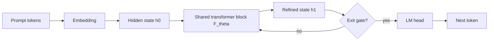

# Day 19: Looped Language Models - Reusing Depth for Latent Reasoning

> **Watch the animation**: 

## One-Line Summary

Looped language models reuse the same transformer block for multiple latent passes, so the model can spend more internal compute on hard tokens without paying for a much larger parameter count.

---

## Why This Matters

### Bigger Models Are Not The Only Way To Scale Reasoning

Standard transformers scale mostly by adding more parameters or more distinct layers:

- more width stores more knowledge
- more depth adds more computation steps
- more tokens expose more training data

That works, but it is expensive in all three places at once:

- memory footprint grows
- training cost grows
- inference cost is paid even on easy tokens

Looped models explore a different tradeoff:

**keep the parameter set mostly fixed, but reuse depth repeatedly when the problem needs more thought.**

### The Current Frontier Shift

This topic is hot right now because multiple recent papers are converging on the same idea from different angles:

- **Ouro** shows small looped LMs can match much larger dense baselines on reasoning-heavy tasks
- **LoopFormer** studies elastic-depth looped transformers with shortcut modulation
- **Loop, Think, & Generalize** pushes the recurrent-depth view further and analyzes implicit reasoning behavior, including when looping helps and when it can lead to overthinking

So this is no longer just an old recurrent-transformer idea resurfacing. It is turning into a concrete scaling direction.

---

## Core Insight

### 1. Reasoning Can Happen In Latent Space, Not Only In Token Space

Most long-form reasoning in public demos happens by generating more visible tokens. But that is not the only place computation can occur.

Looped models do extra work **inside** the hidden state:

1. read the prompt once
2. refine the same representation over several latent passes
3. decode only after the internal state is more settled

This is why the idea matters: the model can "think longer" without emitting a huge chain of thought.

### 2. Shared Weights Turn One Block Into Many Effective Depth Steps

Instead of using layers $L_1, L_2, L_3, \dots, L_N$ once each, a looped model may apply the same block $F_\theta$ repeatedly:

- pass 1: rough parse
- pass 2: reorganize evidence
- pass 3: sharpen the answer
- pass 4: stop only if the token is still uncertain

The block is shared, but the hidden state changes at each pass, so the model still performs multi-step computation.

### 3. Adaptive Exit Makes Compute Token-Dependent

A strong looped architecture usually does not force every token through the same number of passes.

That enables a better compute policy:

- easy tokens exit early
- difficult tokens stay in the loop longer
- average cost stays manageable

This makes looped depth feel like a latent version of test-time compute scaling.

---

## Architecture Walkthrough



### What Makes This Different From A Standard Deep Transformer

- The same block is reused across passes instead of stacking fully distinct layers.
- The hidden state carries forward the intermediate computation.
- Exit decisions can depend on token difficulty rather than a fixed architecture depth.

---

## Mathematical Formulation

### Recurrent Depth Update

Let the hidden state after embedding be:

$$
h^{(0)} = \mathrm{Embed}(x)
$$

and let one shared block update the state as:

$$
h^{(r+1)} = F_\theta\left(h^{(r)}, x\right)
$$

where:

- $x$ is the input context
- $h^{(r)}$ is the latent state after loop $r$
- $F_\theta$ is the same shared transformer block on every pass

### Adaptive Exit

An exit head decides whether more latent computation is needed:

$$
e^{(r)} = \sigma\left(w^\top h^{(r)} + b\right)
$$

where $e^{(r)}$ can be interpreted as the probability that the current state is ready to decode.

The total loop count becomes:

$$
R(x) = \min \{ r : e^{(r)} \ge \tau \}
$$

with threshold $\tau$ controlling how aggressively the model exits.

### Final Token Distribution

After the final latent pass, decoding happens once:

$$
p(y \mid x) = p_\phi\left(y \mid h^{(R(x))}\right)
$$

So the gain comes from spending more internal compute before token emission, not from simply generating more visible reasoning tokens.

### Why This Can Help

A useful intuition is:

$$
\text{Reasoning Quality} \approx f(\text{knowledge}, \text{latent depth}, \text{decode quality})
$$

Classic scaling mostly pushes the first term. Looped models try to improve the middle term directly.

---

## Python Code Implementation

```python
from dataclasses import dataclass
from typing import List


@dataclass
class TokenState:
    value: float
    uncertainty: float


class SharedReasoningBlock:
    """
    A tiny looped block.
    Each pass reduces uncertainty and sharpens the latent state.
    """

    def __init__(self, gain: float = 0.32, damping: float = 0.54) -> None:
        self.gain = gain
        self.damping = damping

    def step(self, state: TokenState, evidence: float) -> TokenState:
        refined_value = state.value + self.gain * (evidence - state.value)
        residual = abs(evidence - refined_value)
        refined_uncertainty = max(0.02, state.uncertainty * (self.damping + 0.45 * residual))
        return TokenState(refined_value, refined_uncertainty)


class LoopedDecoder:
    """
    Reuses one block until the token becomes confident enough to exit.
    """

    def __init__(self, threshold: float = 0.14, max_loops: int = 6) -> None:
        self.threshold = threshold
        self.max_loops = max_loops
        self.block = SharedReasoningBlock()

    def run(self, evidence: float) -> tuple[TokenState, List[TokenState]]:
        state = TokenState(value=0.0, uncertainty=1.0)
        trace = [state]

        for _ in range(self.max_loops):
            state = self.block.step(state, evidence)
            trace.append(state)
            if state.uncertainty <= self.threshold:
                break

        return state, trace


if __name__ == "__main__":
    decoder = LoopedDecoder()

    for label, evidence in [("easy", 0.35), ("medium", 0.62), ("hard", 0.91)]:
        final_state, trace = decoder.run(evidence)
        print(
            f"{label}: loops={len(trace) - 1}, "
            f"value={final_state.value:.3f}, "
            f"uncertainty={final_state.uncertainty:.3f}"
        )
```

---

## What Looped Language Models Teach Us

1. **Scaling reasoning does not have to mean scaling parameters linearly.**
2. **Latent-space computation can substitute for some token-space chain-of-thought.**
3. **Adaptive exit is the key systems trick that keeps recurrent depth practical.**
4. **More loops are not always better: current papers already highlight overthinking and stability as real failure modes.**
5. **This direction connects architecture, inference-time compute, and reasoning efficiency into one design space.**

---

## Related Tutorials

- [Day 04: Test-Time Compute Scaling](/tutorials/en/inference/04-test-time-compute.md)
- [Day 12: Early Stopping via Confidence Dynamics](/tutorials/en/inference/12-early-stopping.md)

---

## References

- [Scaling Latent Reasoning via Looped Language Models](https://arxiv.org/abs/2510.25741) - ByteDance Seed, 2025-10-29
- [Hugging Face Papers: Scaling Latent Reasoning via Looped Language Models](https://huggingface.co/papers/2510.25741)
- [LoopFormer: Elastic-Depth Looped Transformers for Latent Reasoning via Shortcut Modulation](https://huggingface.co/papers/2602.11451) - 2026-02-11
- [Loop, Think, & Generalize: Implicit Reasoning in Recurrent-Depth Transformers](https://arxiv.org/abs/2604.07822) - 2026-04-10
- [Reddit discussion on r/LocalLLaMA, 2025-10-31](https://www.reddit.com/r/LocalLLaMA/comments/1okguct/another_dim_of_scaling_bytedance_drops_ouro_14b/)

---

---

## Quick Quiz

Test your understanding of this topic.

### Q1. What is the core mechanism described in this tutorial?

- A. A new attention variant
- B. A training or inference algorithm
- C. A hardware optimization
- D. A dataset format

<details>
<summary>Reveal Answer</summary>

**Answer: B** — This tutorial focuses on a architectural mechanism.

*Explanation varies by tutorial — see the Core Insight section for the key takeaway.*

</details>

### Q2. When does this approach work best?

- A. Only on very large models
- B. Only on small models
- C. Under specific conditions detailed in the tutorial
- D. Always, regardless of setup

<details>
<summary>Reveal Answer</summary>

**Answer: C** — The tutorial describes specific conditions and tradeoffs. Review the "Why This Matters" and "Limitations" sections.

</details>

### Q3. What is the main takeaway?

- A. Use this instead of all other approaches
- B. This is a niche optimization with no practical use
- C. A specific mechanism with clear use cases and tradeoffs
- D. This has been superseded by a newer method

<details>
<summary>Reveal Answer</summary>

**Answer: C** — Every tutorial in this repo focuses on a specific mechanism with its own tradeoffs. Check the One-Line Summary at the top and the "What [Topic] Teaches Us" section at the bottom.

</details>
