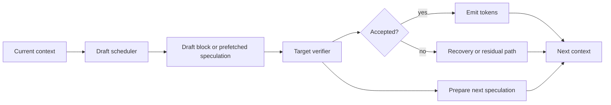

# Day 22: Parallel Drafting — Breaking the Draft Bottleneck in Speculative Decoding

> **Watch the animation**: 

## One-Line Summary

Parallel drafting is the next step after classic speculative decoding: instead of only verifying faster, it reduces or overlaps the draft-model latency that still sits on the critical path.

---

## Why This Matters

### Day 03 Solved One Bottleneck, Not The Whole Pipeline

Classic speculative decoding already gave us a strong idea:

1. let a cheap draft model guess several next tokens
2. let the large target model verify them in one pass
3. amortize target-model cost over multiple accepted tokens

That was a major speedup, and it is still one of the most durable inference ideas in the LLM stack.

But the pipeline still has a systems problem:

- the draft model often generates candidates autoregressively
- every speculation round still spends real time on drafting
- if drafting is too slow, target verification is no longer the only bottleneck

So the frontier question is no longer just:

**"How do we verify many tokens at once?"**

It is also:

**"How do we stop draft generation from remaining a serial wait?"**

### The Frontier Signal Is Converging Again

This is a good daily topic because the evidence clusters around the same mechanism:

- **arXiv**: papers such as **DFlash** and **Speculative Speculative Decoding** both attack draft-side latency
- **Hugging Face Papers**: both are surfaced there as current inference work
- **Reddit / r/LocalLLaMA**: practitioners are discussing speculative decoding setups in terms of practical latency, cache reuse, and real deployment gains

So the durable concept is not "one new decoding paper".

It is:

**speculative decoding is turning into a scheduling problem, not only an acceptance-rate problem.**

---

## Core Insight

### 1. Classic Speculative Decoding Still Pays A Serial Draft Cost

A standard round looks like this:

1. draft model generates $K$ candidate tokens
2. target model verifies the whole block
3. accepted tokens are emitted
4. the next round begins

Even though verification is batched, the draft side is still often a left-to-right mini-generation loop.

That means round time is closer to:

$$
T_{\mathrm{round}} \approx T_{\mathrm{draft}} + T_{\mathrm{verify}}
$$

If $T_{\mathrm{draft}}$ is nontrivial, speculative decoding leaves speed on the table.

### 2. DFlash Shrinks The Draft Stage With Block Generation

**DFlash** attacks the problem by replacing serial draft-token generation with a block-oriented generator.

Instead of asking a draft model to roll out one token after another, it tries to create a whole draft block in one shot.

The systems consequence is simple:

- fewer sequential draft steps
- lower draft-side latency per round
- more room for the verifier to dominate throughput again

This does not change the motivation of speculative decoding.
It changes **where the remaining latency comes from**.

### 3. SSD / Saguaro Hides Draft Latency Behind Verification

**Speculative Speculative Decoding (SSD, Saguaro)** pushes a different systems idea:

- while one round is being verified
- prepare or predict the next round of speculation work
- reuse that work if the verification outcome matches the prediction

So instead of only shrinking $T_{\mathrm{draft}}$, SSD tries to make parts of it overlap with verification:

$$
T_{\mathrm{round}}^{\mathrm{overlap}} \approx \max(T_{\mathrm{draft}}, T_{\mathrm{verify}}) + T_{\mathrm{miss}}
$$

where $T_{\mathrm{miss}}$ is the penalty when speculative preparation guessed wrong and has to recover.

### 4. The New Objective Is Critical-Path Compression

Once you see DFlash and SSD together, the pattern is clear:

- baseline SD: reduce target cost per emitted token
- DFlash: reduce draft cost directly
- SSD: overlap draft work with verification work

So the optimization target is no longer just acceptance probability.

It is:

**compress the critical path of one speculation round.**

---

## Architecture Walkthrough



### What Changes Relative To Day 03

- The draft side becomes a first-class optimization target.
- Verification is still central, but no longer the only place where batching matters.
- A good implementation now cares about **block generation**, **prefetching**, **cache reuse**, and **miss recovery**.
- The decoder starts looking less like a simple draft-check loop and more like a pipelined system.

---

## Mathematical Formulation

### Baseline Speculative Round

Let:

- $T_{\mathrm{draft}}$ be the time to produce a candidate block
- $T_{\mathrm{verify}}$ be the time for target verification
- $E[N]$ be the expected number of emitted tokens per round

Then the baseline throughput is approximately:

$$
\mathrm{Throughput}_{\mathrm{SD}} \approx \frac{E[N]}{T_{\mathrm{draft}} + T_{\mathrm{verify}}}
$$

### Parallel-Draft Variant

If block drafting reduces the sequential draft work to $T_{\mathrm{draft}}^{\mathrm{block}}$, then:

$$
\mathrm{Throughput}_{\mathrm{block}} \approx \frac{E[N]}{T_{\mathrm{draft}}^{\mathrm{block}} + T_{\mathrm{verify}}}
$$

with:

$$
T_{\mathrm{draft}}^{\mathrm{block}} < T_{\mathrm{draft}}
$$

### Overlapped Variant

If part of the next speculation round is prepared while verification runs, the effective round time becomes:

$$
T_{\mathrm{round}}^{\mathrm{overlap}} \approx \max(T_{\mathrm{draft}}, T_{\mathrm{verify}}) + p_{\mathrm{miss}} \cdot C_{\mathrm{recover}}
$$

where:

- $p_{\mathrm{miss}}$ is the probability that speculative preparation is unusable
- $C_{\mathrm{recover}}$ is the recovery cost

So the throughput is:

$$
\mathrm{Throughput}_{\mathrm{overlap}} \approx \frac{E[N]}{\max(T_{\mathrm{draft}}, T_{\mathrm{verify}}) + p_{\mathrm{miss}} C_{\mathrm{recover}}}
$$

### What The Tradeoff Really Is

Parallel drafting helps only when:

- the draft side is still expensive enough to matter
- overlap hits often enough to avoid large recovery costs
- extra scheduling complexity does not erase the latency gain

So this is not a purely probabilistic improvement.
It is a **pipeline design** improvement.

---

## Python Code Implementation

```python
from dataclasses import dataclass


@dataclass
class RoundStats:
    name: str
    accepted_tokens: float
    round_time_ms: float
    throughput_tok_per_s: float


def throughput(accepted_tokens: float, round_time_ms: float) -> float:
    return accepted_tokens / (round_time_ms / 1000.0)


def baseline_sd(draft_ms: float, verify_ms: float, accepted_tokens: float) -> RoundStats:
    round_time = draft_ms + verify_ms
    return RoundStats(
        name="baseline_sd",
        accepted_tokens=accepted_tokens,
        round_time_ms=round_time,
        throughput_tok_per_s=throughput(accepted_tokens, round_time),
    )


def block_drafting(draft_block_ms: float, verify_ms: float, accepted_tokens: float) -> RoundStats:
    round_time = draft_block_ms + verify_ms
    return RoundStats(
        name="block_drafting",
        accepted_tokens=accepted_tokens,
        round_time_ms=round_time,
        throughput_tok_per_s=throughput(accepted_tokens, round_time),
    )


def overlapped_sd(
    draft_ms: float,
    verify_ms: float,
    accepted_tokens: float,
    miss_probability: float,
    recovery_ms: float,
) -> RoundStats:
    round_time = max(draft_ms, verify_ms) + miss_probability * recovery_ms
    return RoundStats(
        name="overlapped_sd",
        accepted_tokens=accepted_tokens,
        round_time_ms=round_time,
        throughput_tok_per_s=throughput(accepted_tokens, round_time),
    )


def main() -> None:
    accepted_tokens = 3.2

    variants = [
        baseline_sd(draft_ms=5.0, verify_ms=7.0, accepted_tokens=accepted_tokens),
        block_drafting(draft_block_ms=2.4, verify_ms=7.0, accepted_tokens=accepted_tokens),
        overlapped_sd(
            draft_ms=5.0,
            verify_ms=7.0,
            accepted_tokens=accepted_tokens,
            miss_probability=0.15,
            recovery_ms=2.0,
        ),
    ]

    for item in variants:
        print(
            f"{item.name:16s} "
            f"time={item.round_time_ms:4.1f}ms "
            f"accepted={item.accepted_tokens:3.1f} "
            f"throughput={item.throughput_tok_per_s:6.1f} tok/s"
        )


if __name__ == "__main__":
    main()
```

This toy simulator is intentionally simple, but it captures the systems point:

- classic SD adds draft and verify time
- block drafting shortens the draft segment
- overlap tries to replace a sum with a max, plus miss penalty

That is the right mental model before touching real inference kernels.

---

## What Parallel Drafting Teaches Us

1. **Speculative decoding still has exploitable serial structure after the original speedup.**
2. **The draft path is now a real optimization surface, not just a helper model.**
3. **Block generation and overlap are two different ways to shorten the same critical path.**
4. **Cache misses and recovery logic become first-class systems costs.**
5. **The future of inference acceleration is increasingly about scheduling and pipeline design.**

---

## Related Tutorials

- [Day 03: Speculative Decoding -- Lossless Inference Speedup](/tutorials/en/inference/03-speculative-decoding.md)
- [Day 20: Adaptive Reasoning Budgets - Stopping LLMs from Overthinking](/tutorials/en/inference/20-adaptive-reasoning-budgets.md)
- [Day 21: Parallel Tool Calling — Stop Making Agents Wait on Themselves](/tutorials/en/agent/21-parallel-tool-calling.md)

---

## References

- [DFlash: Block Diffusion for Flash Speculative Decoding](https://arxiv.org/abs/2602.06036) - 2026-02-10
- [Hugging Face Papers: DFlash](https://huggingface.co/papers/2602.06036)
- [Speculative Decoding for Speculative Decoding](https://arxiv.org/abs/2603.03251) - 2026-03-03
- [Hugging Face Papers: Speculative Decoding for Speculative Decoding](https://huggingface.co/papers/2603.03251)
- [r/LocalLLaMA: DFlash speculative decoding on Apple Silicon, 4.1x prefill speedup](https://www.reddit.com/r/LocalLLaMA/comments/1skesyq/dflash_speculative_decoding_on_apple_silicon_41x/) - 2026-04-13
- [r/LocalLLaMA: Qwen3.6 thread with practical speculative decoding discussion](https://www.reddit.com/r/LocalLLaMA/comments/1so1533/qwen36_this_is_it/) - 2026-04-17

---

---

## Quick Quiz

Test your understanding of this topic.

### Q1. What is the core mechanism described in this tutorial?

- A. A new attention variant
- B. A training or inference algorithm
- C. A hardware optimization
- D. A dataset format

<details>
<summary>Reveal Answer</summary>

**Answer: B** — This tutorial focuses on a inference algorithm.

*Explanation varies by tutorial — see the Core Insight section for the key takeaway.*

</details>

### Q2. When does this approach work best?

- A. Only on very large models
- B. Only on small models
- C. Under specific conditions detailed in the tutorial
- D. Always, regardless of setup

<details>
<summary>Reveal Answer</summary>

**Answer: C** — The tutorial describes specific conditions and tradeoffs. Review the "Why This Matters" and "Limitations" sections.

</details>

### Q3. What is the main takeaway?

- A. Use this instead of all other approaches
- B. This is a niche optimization with no practical use
- C. A specific mechanism with clear use cases and tradeoffs
- D. This has been superseded by a newer method

<details>
<summary>Reveal Answer</summary>

**Answer: C** — Every tutorial in this repo focuses on a specific mechanism with its own tradeoffs. Check the One-Line Summary at the top and the "What [Topic] Teaches Us" section at the bottom.

</details>
