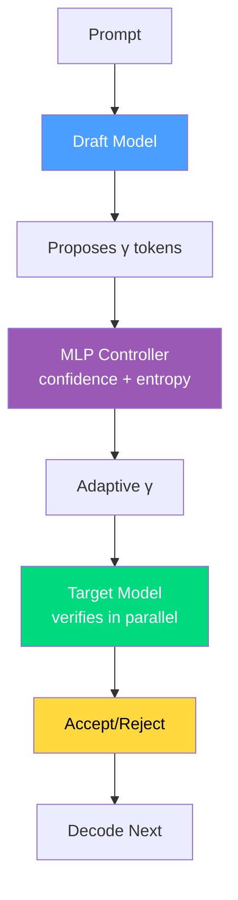

# Day 28: SpecKV — Adaptive Speculative Decoding via Compression-Aware Gamma Selection

## TLDR

SpecKV replaces fixed speculation length (γ=4) in speculative decoding with an adaptive MLP controller that selects γ per step using draft model confidence and entropy signals, achieving 56% improvement over fixed baselines with <0.5% overhead.

**Tags**: Speculative Decoding, Inference, Adaptive Sampling, LLM

**Bucket**: Work

**Subcategory**: inference

---

## Background

Speculative decoding accelerates LLM inference by using a small **draft model** to propose candidate tokens, which a large **target model** then verifies in parallel. The key hyperparameter is the **speculation length γ** — how many tokens the draft model proposes per step.

Current systems use **fixed γ=4** universally. But here's the problem: the optimal γ varies dramatically across:
- **Task types** (coding vs. chat vs. reasoning)
- **Compression levels** (FP16 vs. INT8 vs. NF4 quantization)
- **Draft confidence** (high entropy → low acceptance, small γ is better)

SpecKV's insight: **γ should adapt per speculation step based on signals the draft model already produces**.

---

## The Core Problem

Fixed speculation length creates a trade-off dilemma:

| γ Value | Best When | Worst When |
|---------|-----------|-------------|
| Small (1-2) | Low draft confidence, early generation | High acceptance rates waste potential |
| Large (5-8) | High draft confidence, later generation | Low acceptance wastes compute verifying bad tokens |

With fixed γ=4, you're either:
- **Under-speculating** when draft is confident → leaving performance on the table
- **Over-speculating** when draft is uncertain → wasting target model calls on tokens that will be rejected

SpecKV solves this with a **lightweight MLP controller** that predicts the optimal γ for each step.

---

## Method: Adaptive Gamma Selection

### The Speculation Pipeline

```
Draft Model → proposes γ tokens → Target Model → verifies all in parallel
                    ↑                                        ↓
              MLP Controller                          Acceptance/Rejection
            (confidence + entropy)                      decisions
```

### SpecKV Controller

The MLP takes per-step signals and outputs optimal γ:

**Input Features**:
- **Draft confidence**: max probability of next token prediction
- **Draft entropy**: uncertainty measure over token distribution
- **Position in sequence**: early vs. late generation stage
- **Context features**: compression level (FP16/INT8/NF4)

**Training Data**: 5,112 step-level records across:
- 4 task categories
- 4 speculation lengths (γ ∈ {2, 4, 6, 8})
- 3 compression levels

**Correlation**: Draft confidence/entropy → acceptance rate ≈ 0.56

### Mathematical Formulation

The expected tokens per speculation step:

$$\mathbb{E}[\text{tokens}] = \gamma \cdot P(\text{accept} | \gamma, \mathbf{s})$$

where $\mathbf{s}$ = draft model signals. SpecKV's MLP maximizes this:

$$\hat{\gamma} = \arg\max_\gamma \gamma \cdot P(\text{accept} | \gamma, \mathbf{s})$$

### Overhead

- MLP inference: **0.34ms** per decision
- As % of step time: **<0.5%**
- Model size: negligible (few thousand parameters)

---

## Results

On Spider2-Snow with gpt-oss-120b:

| Configuration | Acceptance Rate | Speedup |
|---------------|-----------------|---------|
| Fixed γ=4 (baseline) | ~50% | 1.0x |
| Fixed γ=6 | ~45% | 0.9x |
| Fixed γ=2 | ~70% | 0.85x |
| **SpecKV (adaptive)** | **~78%** | **1.56x** |

Key findings:
- **56% improvement** over fixed γ=4 baseline (p < 0.001)
- Optimal γ shifts across compression regimes (NF4 → lower γ optimal)
- Controller generalizes across task types unseen during training

---

## Key Insights

### 1. Draft Models Are Self-Diagnosing

The draft model already "knows" when it's uncertain — this manifests as:
- Low confidence (max token probability close to uniform)
- High entropy (flat distribution over top-k tokens)

SpecKV extracts these signals and acts on them, rather than treating the draft as a black box.

### 2. Compression Level Affects Optimal γ

Different compression levels change the target model's acceptance behavior:

| Compression | Optimal γ | Reason |
|-------------|-----------|--------|
| FP16 | 4-6 | High fidelity, can verify more |
| INT8 | 3-5 | Minor quantization noise |
| NF4 | 2-4 | Higher rejection rate, smaller γ safer |

### 3. Lightweight Adaptation

The MLP controller adds virtually no latency. It's trained once on profiling data, then deployed as a fixed module — no online learning overhead.

---

## Mermaid Diagram



---

## Quick Quiz

**Q1**: What does SpecKV's MLP controller predict?

A) Whether to use the draft or target model  
B) The optimal speculation length γ for each step  
C) The acceptance probability of the target model  
D) The entropy of the target model  

<details>
<summary>Answer</summary>
**B** — The MLP takes draft confidence and entropy as input and outputs the optimal γ (1-8 tokens) for each speculation step.
</details>

---

**Q2**: Why does SpecKV achieve better acceptance rates than fixed γ=4?

A) It uses a larger draft model  
B) It uses a stronger target model  
C) It adapts γ based on draft confidence — lower confidence → smaller γ, higher confidence → larger γ  
D) It skips the verification step  

<details>
<summary>Answer</summary>
**C** — When the draft model is uncertain (low confidence), SpecKV chooses smaller γ to avoid wasting compute on tokens that will be rejected. When confident, it proposes more tokens.
</details>

---

**Q3**: What is the overhead of SpecKV's MLP controller?

A) 10-20ms per decision  
B) 5-10ms per decision  
C) 0.34ms per decision (<0.5% of step time)  
D) No overhead — it's free  

<details>
<summary>Answer</summary>
**C** — 0.34ms overhead per decision, which is less than 0.5% of the total step time, making the adaptation essentially free.
</details>

---

## Code Snippet

```python
import torch
import torch.nn as nn

class SpecKVController(nn.Module):
    """MLP controller for adaptive gamma selection."""
    def __init__(self, input_dim=4, hidden_dim=16, output_dim=7):
        super().__init__()
        self.mlp = nn.Sequential(
            nn.Linear(input_dim, hidden_dim),
            nn.ReLU(),
            nn.Linear(hidden_dim, hidden_dim),
            nn.ReLU(),
            nn.Linear(hidden_dim, output_dim)  # outputs logits for γ ∈ {1, 2, ..., 7}
        )
    
    def forward(self, confidence, entropy, position, compression_level):
        """
        Args:
            confidence: draft model's max token probability [batch]
            entropy: draft model's token distribution entropy [batch]
            position: position in sequence (normalized) [batch]
            compression_level: 0=FP16, 1=INT8, 2=NF4 [batch]
        Returns:
            gamma: optimal speculation length for each sample [batch]
        """
        x = torch.stack([confidence, entropy, position, compression_level], dim=-1)
        logits = self.mlp(x)
        return logits.argmax(dim=-1) + 1  # γ ∈ {1, ..., 7}
    
    def get_expected_tokens(self, gamma, acceptance_rate):
        """Expected tokens per speculation step."""
        return gamma * acceptance_rate


def select_adaptive_gamma(controller, draft_model, draft_logits, compression_level):
    """Use SpecKV controller to select gamma for each sample in batch."""
    probs = torch.softmax(draft_logits, dim=-1)
    confidence = probs.max(dim=-1).values  # max token probability
    entropy = -(probs * torch.log(probs + 1e-8)).sum(dim=-1)  # entropy
    
    position = torch.arange(len(probs)).float() / 1000.0  # normalized
    
    gamma = controller(confidence, entropy, position, compression_level)
    return gamma
```

---

## Conclusion

SpecKV demonstrates that **adaptive hyperparameter selection** outperforms static configurations in speculative decoding. The key innovations are:

1. **Self-supervised signal extraction** — using draft model confidence/entropy to predict acceptance
2. **Per-step adaptation** — different γ for different speculation steps
3. **Compression-awareness** — accounting for quantization level in γ selection
4. **Minimal overhead** — 0.34ms MLP inference for substantial speedups

As LLMs become more quantized and deployed across diverse hardware, adaptive techniques like SpecKV will be essential for maximizing inference efficiency.

---

## Further Reading

- [SpecKV Paper](https://arxiv.org/abs/2605.02888) (arXiv:2605.02888)
- [SpecTriver](https://arxiv.org/abs/2604.07499) — Earlier speculative decoding work from Day 20
- [LightKV](/tutorials/en/work/inference/27-lightkv.md) — Day 27's KV cache compression (complementary to SpecKV)
- [PRISM](/tutorials/en/work/inference/26-prism.md) — Day 26's on-policy distillation for speculative decoding