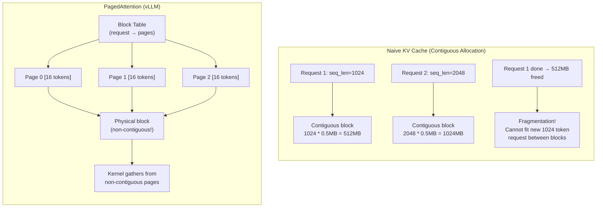
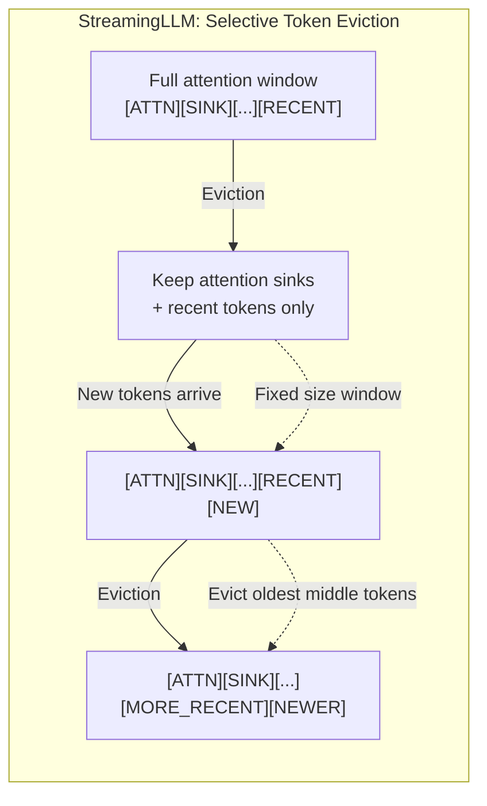

# Day 08: Memory & KV Cache -- PagedAttention, Eviction, Mixed Precision, and TurboQuant KV Skip

> **Watch the animation**: ---

## One-Line Summary

The KV cache in autoregressive transformers grows linearly with sequence length and often dominates GPU memory during long-context generation; PagedAttention eliminates fragmentation via virtual-memory-style paging, selective eviction strategies (StreamingLLM) drop the least useful tokens to maintain bounded memory, and TurboQuant KV skip eliminates redundant dequantization, together enabling generation of sequences 100x longer than naive KV caching.

---

## Why This Matters

### The Linear Memory Problem

During autoregressive generation, the transformer must process every previously generated token at each step. To avoid re-computing the expensive key and value projections for all prior tokens, we cache them in a **KV cache**:

$$
\text{KV cache size} = 2 \times \texttt{num} \times \texttt{num} \times \texttt{seq} \times \texttt{head} \times \texttt{bytes}
$$

For a 7B model with 32 layers, 32 heads, head_dim=128, and FP16 (2 bytes):

$$
\text{KV cache per token} = 2 \times 32 \times 32 \times 1 \times 128 \times 2 \approx 0.5 \text{ MB}
$$

This means:
- 1,024 tokens: ~0.5 GB
- 32,768 tokens: ~16 GB
- 131,072 tokens: ~64 GB

The KV cache quickly becomes the memory bottleneck, especially for long-context generation. A 70B model can require 100+ GB just for the KV cache at moderate sequence lengths.

### KV Cache's Core Insight

Memory management for KV cache asks: *Can we reduce KV cache memory through smarter allocation, selective eviction, mixed precision, and avoiding redundant computation?*

Modern techniques provide affirmative answers from multiple angles:
1. **PagedAttention**: Eliminates memory fragmentation using virtual-memory-inspired paging
2. **Selective eviction**: Removes old tokens that contribute minimally to attention
3. **Mixed precision**: Stores KV cache in lower precision (INT8/FP8) without noticeable quality loss
4. **TurboQuant KV skip**: Avoids dequantizing KV cache values that were already consumed

---

## Architecture Walkthrough





---

## Mathematical Formulation

### KV Cache Size

The exact KV cache memory for a transformer model:

$$
M_{\text{KV}} = 2 \cdot L \cdot H \cdot S \cdot D \cdot B
$$

Where:
- $L$: number of layers
- $H$: number of attention heads
- $S$: sequence length (total including prompt + generated)
- $D$: head dimension
- $B$: bytes per element (2 for FP16, 1 for INT8)

For batch size $b$ with varying sequence lengths:

$$
M_{\text{KV}}^{\text{batch}} = 2 \cdot L \cdot H \cdot D \cdot B \cdot \sum_{i=1}^{b} S_i
$$

### PagedAttention: Virtual Memory Analogy

PagedAttention models GPU memory management using the same concept as CPU virtual memory:

$$
\text{Logical KV blocks: fixed-size blocks of } c \text{ tokens each}
$$

$$
\text{Block table: } \text{table}[r] = [p_0, p_1, p_2, \ldots] \quad \text{maps request } r \text{ to physical pages}
$$

Physical pages are allocated on-demand and can be non-contiguous. The attention kernel gathers from scattered physical pages using the block table as an indirection map. This eliminates external fragmentation because:

$$
\text{Fragmentation}_{\text{contiguous}} \approx 30\% \quad \Rightarrow \quad \text{Fragmentation}_{\text{paged}} \approx 0\%
$$

### StreamingLLM: Attention Sink Phenomenon

StreamingLLM (Xiao et al., 2023) discovered that the first few tokens (attention sinks) receive disproportionately large attention scores regardless of their semantic content. This is caused by the positional encoding initialization and the self-attention mechanism itself.

Key insight: if you remove the initial tokens (attention sinks), the model's attention distribution collapses. But if you keep them, along with the most recent tokens, and evict the middle "less relevant" tokens, the model maintains its ability to generate coherent text.

The selective eviction strategy maintains a constant memory budget:

$$
\text{Cache}(t) = \{t_0, t_1, \ldots, t_{k-1}\} \cup \{t_{S-w+1}, \ldots, t_{S-1}, t_S\}
$$

Where:
- $k$ attention sink tokens at the beginning (typically $k = 4$)
- $w$ most recent tokens (the sliding window)
- Total cache size: $k + w$ (constant, independent of total sequence length)

### Mixed Precision KV Cache

Storing KV cache in reduced precision while keeping computation in full precision:

$$
K_{\text{int8}} = \text{round}\left(\frac{K_{\text{FP16}}}{s_K}\right), \quad V_{\text{int8}} = \text{round}\left(\frac{V_{\text{FP16}}}{s_V}\right)
$$

$$
\text{Attention}(Q, K, V) = \text{softmax}\left(\frac{Q \cdot \text{dequant}(K_{\text{int8}}, s_K)}{\sqrt{d}}\right) \cdot \text{dequant}(V_{\text{int8}}, s_V)
$$

Empirically, INT8 KV cache has negligible perplexity impact (< 0.01 degradation) because:
1. The attention softmax is robust to small perturbations in the key scores
2. The value vectors are averaged, so noise cancels out

INT4 KV cache is more aggressive but requires careful per-token or per-head scaling to avoid quality drops.

### GEAR: Learned Eviction Policy

GEAR (Kweon et al., 2024) learns an eviction policy using a lightweight neural network that predicts which tokens to evict based on:

$$
\texttt{evict}_i = f_{\text{policy}}(K_i, V_i, \texttt{attention}_i, \texttt{positional}_i)
$$

$$
\text{Keep top-}k \text{ tokens by } 1 - \texttt{evict}_i
$$

This is more sophisticated than simple LRU (least recently used) eviction because it considers the actual importance of each token in the attention computation.

---

## Comparison of KV Cache Strategies

| Strategy | Memory Reduction | Quality Impact | Latency Impact | Complexity |
|---|---|---|---|---|
| Naive (FP16) | Baseline | Baseline | Baseline | Lowest |
| PagedAttention | ~30% (less fragmentation) | None | Small overhead for page lookups | Medium |
| StreamingLLM | Linear in total length → constant | Minor (long-distance info lost) | None (still full attn on kept tokens) | Low |
| INT8 KV Cache | 2x | Near-zero (< 0.01 PPL) | Dequantization overhead | Low |
| INT4 KV Cache | 4x | Noticeable (0.5-2.0 PPL) | Higher dequantization cost | Medium |
| GEAR (Learned eviction) | Up to 75% of kept tokens | Learned quality trade-off | Policy network overhead | High |
| TurboQuant KV Skip | Saves dequant cost | None | Significant speedup | Medium |

---

## Python Code Implementation

```python
import torch
import torch.nn as nn
import torch.nn.functional as F
from dataclasses import dataclass, field
from typing import Optional


# ------------------------------------------------------------------
# 1. Naive KV Cache (Baseline)
# ------------------------------------------------------------------

class NaiveKVCache:
    """
    Simple contiguous KV cache for autoregressive generation.

    This is the baseline implementation that pre-allocates a contiguous
    buffer for the maximum sequence length.
    """

    def __init__(
        self,
        num_layers: int,
        num_heads: int,
        head_dim: int,
        max_seq_len: int,
        batch_size: int = 1,
        dtype: torch.dtype = torch.float16,
        device: torch.device | str = "cpu",
    ):
        """
        Initialize a naive KV cache.

        Args:
            num_layers: Number of transformer layers.
            num_heads: Number of attention heads per layer.
            head_dim: Dimension of each attention head.
            max_seq_len: Maximum sequence length to support.
            batch_size: Batch size.
            dtype: Data type for the cache.
            device: Device to allocate the cache on.
        """
        self.num_layers = num_layers
        self.num_heads = num_heads
        self.head_dim = head_dim
        self.max_seq_len = max_seq_len
        self.batch_size = batch_size
        self.dtype = dtype
        self.device = device

        # Pre-allocate contiguous cache for K and V
        # Shape: (num_layers, batch_size, num_heads, max_seq_len, head_dim)
        shape = (num_layers, batch_size, num_heads, max_seq_len, head_dim)
        self.k_cache = torch.zeros(shape, dtype=dtype, device=device)
        self.v_cache = torch.zeros(shape, dtype=dtype, device=device)

        self.current_seq_len = 0

    def update(
        self, layer_idx: int, k: torch.Tensor, v: torch.Tensor
    ) -> tuple[torch.Tensor, torch.Tensor]:
        """
        Add new K and V to the cache and return full cache for the layer.

        Args:
            layer_idx: Which layer to update.
            k: New key, shape (batch_size, num_heads, new_tokens, head_dim).
            v: New value, shape (batch_size, num_heads, new_tokens, head_dim).

        Returns:
            full_k: Entire cached K including new tokens.
            full_v: Entire cached V including new tokens.
        """
        new_len = k.size(2)
        start = self.current_seq_len
        end = start + new_len

        assert end <= self.max_seq_len, (
            f"Cache overflow: {end} > {self.max_seq_len}"
        )

        self.k_cache[layer_idx, :, :, start:end] = k
        self.v_cache[layer_idx, :, :, start:end] = v
        self.current_seq_len = end

        return (
            self.k_cache[layer_idx, :, :, :end],
            self.v_cache[layer_idx, :, :, :end],
        )

    def reset(self):
        """Reset the cache for a new generation."""
        self.k_cache.zero_()
        self.v_cache.zero_()
        self.current_seq_len = 0

    def memory_bytes(self) -> int:
        """Calculate total memory usage in bytes."""
        return self.k_cache.numel() * self.k_cache.element_size() + \
               self.v_cache.numel() * self.v_cache.element_size()


# ------------------------------------------------------------------
# 2. PagedAttention (vLLM-style)
# ------------------------------------------------------------------

@dataclass
class PageTable:
    """Maps a logical request to physical page indices."""
    request_id: int
    pages: list[int] = field(default_factory=list)
    num_tokens: int = 0  # Logical number of tokens in this request


class PagedKVCache:
    """
    PagedAttention-style KV cache.

    Instead of pre-allocating contiguous memory for the maximum sequence
    length, this allocates fixed-size blocks (pages) on-demand.

    Pages can be non-contiguous in physical memory, eliminating
    external fragmentation.

    Inspired by vLLM (Kwon et al., PagedAttention arXiv:2309.06180).
    """

    def __init__(
        self,
        num_layers: int,
        num_heads: int,
        head_dim: int,
        block_size: int = 16,
        num_blocks: int = 256,
        dtype: torch.dtype = torch.float16,
        device: torch.device | str = "cpu",
    ):
        """
        Initialize PagedKVCache.

        Args:
            num_layers: Number of transformer layers.
            num_heads: Number of attention heads per layer.
            head_dim: Dimension of each attention head.
            block_size: Number of tokens per block (page).
            num_blocks: Total number of physical blocks to allocate.
            dtype: Data type.
            device: Device.
        """
        self.num_layers = num_layers
        self.num_heads = num_heads
        self.head_dim = head_dim
        self.block_size = block_size
        self.num_blocks = num_blocks
        self.dtype = dtype
        self.device = device

        # Physical page pool: (num_blocks, num_layers, num_heads, block_size, head_dim)
        block_shape = (num_layers, num_heads, block_size, head_dim)
        self.k_pages = torch.zeros(
            (num_blocks,) + block_shape, dtype=dtype, device=device
        )
        self.v_pages = torch.zeros(
            (num_blocks,) + block_shape, dtype=dtype, device=device
        )

        # Track which physical blocks are free
        self.free_blocks: list[int] = list(range(num_blocks))

        # Logical request → page table
        self.page_tables: dict[int, PageTable] = {}

    def allocate_request(self, request_id: int) -> PageTable:
        """
        Allocate a new request with an initially empty page table.

        Args:
            request_id: Unique identifier for the request.

        Returns:
            page_table: The allocated page table.
        """
        pt = PageTable(request_id=request_id)
        self.page_tables[request_id] = pt
        return pt

    def append_tokens(self, request_id: int, layer_idx: int,
                      k: torch.Tensor, v: torch.Tensor) -> list[int]:
        """
        Append new key-value pairs to a request's KV cache.

        Automatically allocates new physical blocks as needed.

        Args:
            request_id: Which request to append to.
            layer_idx: Which layer.
            k: New key tensor, shape (num_heads, new_tokens, head_dim).
            v: New value tensor, shape (num_heads, new_tokens, head_dim).

        Returns:
            updated_pages: List of physical page indices for this request.
        """
        pt = self.page_tables[request_id]
        new_tokens = k.size(1)

        for i in range(new_tokens):
            # Compute logical position and which block it falls in
            logical_pos = pt.num_tokens + i
            block_idx = logical_pos // self.block_size
            offset_in_block = logical_pos % self.block_size

            # Allocate a new physical block if needed
            if block_idx >= len(pt.pages):
                assert len(self.free_blocks) > 0, "Out of physical blocks"
                phys_block = self.free_blocks.pop(0)
                pt.pages.append(phys_block)

            phys_block = pt.pages[block_idx]

            # Write to physical page
            self.k_pages[phys_block, layer_idx, :, offset_in_block] = k[:, i]
            self.v_pages[phys_block, layer_idx, :, offset_in_block] = v[:, i]

        pt.num_tokens += new_tokens

        return pt.pages

    def gather(
        self, request_id: int, layer_idx: int
    ) -> tuple[torch.Tensor, torch.Tensor]:
        """
        Gather all cached K and V tokens for a request, possibly from
        non-contiguous physical pages.

        This simulates what the attention kernel does: use the page table
        as an indirection map to collect tokens from scattered pages.

        Args:
            request_id: Which request to gather for.
            layer_idx: Which layer.

        Returns:
            k_full: Gathered K, shape (num_heads, total_tokens, head_dim).
            v_full: Gathered V, shape (num_heads, total_tokens, head_dim).
        """
        pt = self.page_tables[request_id]
        total_tokens = pt.num_tokens
        num_heads = self.num_heads
        head_dim = self.head_dim

        k_full = torch.zeros(
            (num_heads, total_tokens, head_dim),
            dtype=self.dtype, device=self.device
        )
        v_full = torch.zeros(
            (num_heads, total_tokens, head_dim),
            dtype=self.dtype, device=self.device
        )

        for block_logical_idx, phys_block in enumerate(pt.pages):
            start = block_logical_idx * self.block_size
            end = min(start + self.block_size, total_tokens)
            length = end - start

            k_full[:, start:end] = self.k_pages[
                phys_block, layer_idx, :, :length
            ]
            v_full[:, start:end] = self.v_pages[
                phys_block, layer_idx, :, :length
            ]

        return k_full, v_full

    def free_request(self, request_id: int):
        """Release all physical blocks associated with a request."""
        if request_id in self.page_tables:
            pt = self.page_tables[request_id]
            self.free_blocks.extend(pt.pages)
            del self.page_tables[request_id]

    def memory_bytes(self) -> int:
        """Calculate total allocated memory (physical pages only)."""
        return self.k_pages.numel() * self.k_pages.element_size() + \
               self.v_pages.numel() * self.v_pages.element_size()


# ------------------------------------------------------------------
# 3. StreamingLLM: Selective Token Eviction
# ------------------------------------------------------------------

class StreamingKVCache:
    """
    StreamingLLM-style KV cache with attention sink preservation
    and sliding window eviction.

    Keeps the first k tokens (attention sinks) and the most recent
    w tokens, discarding the middle tokens to maintain bounded memory.

    Paper: arXiv:2309.17453 (StreamingLLM)
    """

    def __init__(
        self,
        num_layers: int,
        num_heads: int,
        head_dim: int,
        num_sinks: int = 4,
        window_size: int = 2048,
        dtype: torch.dtype = torch.float16,
        device: torch.device | str = "cpu",
    ):
        """
        Initialize StreamingKVCache.

        Args:
            num_layers: Number of transformer layers.
            num_heads: Number of attention heads.
            head_dim: Head dimension.
            num_sinks: Number of attention sink tokens to keep at the start.
            window_size: Maximum number of recent tokens to keep.
            dtype: Data type.
            device: Device.
        """
        self.num_layers = num_layers
        self.num_heads = num_heads
        self.head_dim = head_dim
        self.num_sinks = num_sinks
        self.window_size = window_size
        self.dtype = dtype
        self.device = device

        # Cache stores: [sinks] + [recent window]
        max_size = num_sinks + window_size
        shape = (num_layers, num_heads, max_size, head_dim)
        self.k_cache = torch.zeros(shape, dtype=dtype, device=device)
        self.v_cache = torch.zeros(shape, dtype=dtype, device=device)

        self.local_positions: list[int] = []  # Logical positions of cached tokens
        self.total_processed = 0  # Total tokens ever processed

    def update(
        self, layer_idx: int, k: torch.Tensor, v: torch.Tensor
    ) -> tuple[torch.Tensor, torch.Tensor]:
        """
        Update cache with new tokens, evicting old ones if necessary.

        Args:
            layer_idx: Which layer.
            k: New key, shape (num_heads, new_tokens, head_dim).
            v: New value, shape (num_heads, new_tokens, head_dim).

        Returns:
            k_valid: Valid K including sinks + recent.
            v_valid: Valid V including sinks + recent.
        """
        new_tokens = k.size(1)

        for i in range(new_tokens):
            # Compute logical position
            logical_pos = self.total_processed + i

            # Determine which slot in our bounded cache
            if len(self.local_positions) < self.num_sinks + self.window_size:
                # Cache not full yet, just append
                slot = len(self.local_positions)
                self.k_cache[:, :, slot, i % 1] = 0  # placeholder
                self.local_positions.append(logical_pos)
                slot_idx = len(self.local_positions) - 1
                self.k_cache[layer_idx, :, slot_idx] = k[:, i]
                self.v_cache[layer_idx, :, slot_idx] = v[:, i]
            else:
                # Cache full: evict oldest non-sink token
                # Slots [0, num_sinks-1] are sinks (never evict)
                # Slots [num_sinks, num_sinks+window_size-1] are the sliding window
                # Evict slot num_sinks, shift left, append new token at end
                evict_slot = self.num_sinks

                # Shift sliding window left by 1
                self.k_cache[layer_idx, :, evict_slot:-1] = \
                    self.k_cache[layer_idx, :, evict_slot + 1:]
                self.v_cache[layer_idx, :, evict_slot:-1] = \
                    self.v_cache[layer_idx, :, evict_slot + 1:]

                # Append new token at the end
                last_slot = self.num_sinks + self.window_size - 1
                self.k_cache[layer_idx, :, last_slot] = k[:, i]
                self.v_cache[layer_idx, :, last_slot] = v[:, i]

                # Update position tracking
                self.local_positions.pop(self.num_sinks)
                self.local_positions.append(logical_pos)

        self.total_processed += new_tokens

        valid_len = len(self.local_positions)
        return (
            self.k_cache[layer_idx, :, :valid_len],
            self.v_cache[layer_idx, :, :valid_len],
        )

    def reset(self):
        """Reset the cache."""
        self.k_cache.zero_()
        self.v_cache.zero_()
        self.local_positions.clear()
        self.total_processed = 0

    def memory_bytes(self) -> int:
        """Calculate memory for the bounded cache."""
        return self.k_cache.numel() * self.k_cache.element_size() + \
               self.v_cache.numel() * self.v_cache.element_size()


# ------------------------------------------------------------------
# 4. Mixed Precision KV Cache (INT8)
# ------------------------------------------------------------------

class MixedPrecisionKVCache:
    """
    KV cache that stores keys and values in INT8 but computes
    attention in FP16/FP32.

    Dequantizes on-the-fly during the attention computation.

    This achieves 2x memory savings with negligible quality impact.
    """

    def __init__(
        self,
        num_layers: int,
        num_heads: int,
        head_dim: int,
        max_seq_len: int,
        dtype: torch.dtype = torch.float16,
        device: torch.device | str = "cpu",
    ):
        """
        Initialize MixedPrecisionKVCache.

        Args:
            num_layers: Number of transformer layers.
            num_heads: Number of attention heads.
            head_dim: Head dimension.
            max_seq_len: Maximum sequence length.
            dtype: Computation data type.
            device: Device.
        """
        self.num_layers = num_layers
        self.num_heads = num_heads
        self.head_dim = head_dim
        self.max_seq_len = max_seq_len
        self.dtype = dtype
        self.device = device

        shape = (num_layers, num_heads, max_seq_len, head_dim)

        # Quantized storage (INT8)
        self.k_cache_q = torch.zeros(shape, dtype=torch.int8, device=device)
        self.v_cache_q = torch.zeros(shape, dtype=torch.int8, device=device)

        # Per-head, per-layer scales
        k_scale_shape = (num_layers, num_heads, 1)
        v_scale_shape = (num_layers, num_heads, 1)
        self.k_scales = torch.ones(k_scale_shape, dtype=torch.float32, device=device)
        self.v_scales = torch.ones(v_scale_shape, dtype=torch.float32, device=device)
        self.k_zeros = torch.zeros(k_scale_shape, dtype=torch.float32, device=device)
        self.v_zeros = torch.zeros(v_scale_shape, dtype=torch.float32, device=device)

        self.current_seq_len = 0

    def update(
        self, layer_idx: int, k: torch.Tensor, v: torch.Tensor
    ) -> tuple[torch.Tensor, torch.Tensor]:
        """
        Quantize and store new K and V.

        Args:
            layer_idx: Which layer.
            k: New key, shape (num_heads, new_tokens, head_dim).
            v: New value, shape (num_heads, new_tokens, head_dim).

        Returns:
            k_dequant: Dequantized K for immediate use.
            v_dequant: Dequantized V for immediate use.
        """
        new_len = k.size(1)
        start = self.current_seq_len
        end = start + new_len

        # Per-layer-per-head quantization
        for h in range(self.num_heads):
            k_h = k[h]  # (new_tokens, head_dim)
            v_h = v[h]

            k_min, k_max = k_h.min(), k_h.max()
            v_min, v_max = v_h.min(), v_h.max()

            k_scale = (k_max - k_min) / 254.0 if k_max > k_min else 1.0
            v_scale = (v_max - v_min) / 254.0 if v_max > v_min else 1.0

            k_zero = -128.0 - k_min / k_scale
            v_zero = -128.0 - v_min / v_scale

            self.k_cache_q[layer_idx, h, start:end] = (
                (k_h / k_scale + k_zero).round().clamp(-128, 127).to(torch.int8)
            )
            self.v_cache_q[layer_idx, h, start:end] = (
                (v_h / v_scale + v_zero).round().clamp(-128, 127).to(torch.int8)
            )

            self.k_scales[layer_idx, h] = k_scale
            self.v_scales[layer_idx, h] = v_scale
            self.k_zeros[layer_idx, h] = k_zero
            self.v_zeros[layer_idx, h] = v_zero

        self.current_seq_len = end

        # Return dequantized for immediate use
        return self._dequantize(layer_idx, end)

    def _dequantize(
        self, layer_idx: int, seq_len: int
    ) -> tuple[torch.Tensor, torch.Tensor]:
        """
        Dequantize cached K and V for a given layer.

        Args:
            layer_idx: Which layer.
            seq_len: Number of valid tokens.

        Returns:
            k_dequant: Dequantized K.
            v_dequant: Dequantized V.
        """
        s_k = self.k_scales[layer_idx]
        z_k = self.k_zeros[layer_idx]
        s_v = self.v_scales[layer_idx]
        z_v = self.v_zeros[layer_idx]

        k_int = self.k_cache_q[layer_idx, :, :seq_len].float()
        v_int = self.v_cache_q[layer_idx, :, :seq_len].float()

        k_dequant = s_k * (k_int - z_k)
        v_dequant = s_v * (v_int - z_v)

        return k_dequant.to(self.dtype), v_dequant.to(self.dtype)

    def memory_bytes(self) -> int:
        """Calculate memory savings vs FP16."""
        cache_mem = self.k_cache_q.numel() * 1 + self.v_cache_q.numel() * 1
        scale_mem = (
            self.k_scales.numel() * 4 + self.v_scales.numel() * 4 +
            self.k_zeros.numel() * 4 + self.v_zeros.numel() * 4
        )
        return cache_mem + scale_mem


# ------------------------------------------------------------------
# 5. KV Cache with Attention (integrating the cache into attention)
# ------------------------------------------------------------------

def attention_with_kv_cache(
    q: torch.Tensor,
    kv_cache: NaiveKVCache | PagedKVCache | StreamingKVCache | MixedPrecisionKVCache,
    layer_idx: int,
    k_new: torch.Tensor,
    v_new: torch.Tensor,
) -> torch.Tensor:
    """
    Compute attention using a KV cache, updating it with new tokens.

    Args:
        q: Query tensor, shape (num_heads, 1, head_dim) for single-token generation.
        kv_cache: The KV cache to use.
        layer_idx: Which transformer layer.
        k_new: New key for the current token, shape (num_heads, 1, head_dim).
        v_new: New value for the current token, shape (num_heads, 1, head_dim).

    Returns:
        attention_output: Shape (num_heads, 1, head_dim).
    """
    # Update cache and get full K, V
    k_full, v_full = kv_cache.update(layer_idx, k_new, v_new)

    # Standard attention
    d_k = q.size(-1)
    scores = torch.matmul(q, k_full.transpose(-2, -1)) / (d_k ** 0.5)
    weights = F.softmax(scores, dim=-1)
    return torch.matmul(weights, v_full)


# ------------------------------------------------------------------
# Example usage
# ------------------------------------------------------------------
if __name__ == "__main__":

    torch.manual_seed(42)

    # ---- 1. Naive KV Cache ----
    print("=" * 60)
    print("1. Naive KV Cache")
    print("=" * 60)

    naive_cache = NaiveKVCache(
        num_layers=32, num_heads=32, head_dim=128,
        max_seq_len=4096, batch_size=1, dtype=torch.float16, device="cpu"
    )
    print(f"Memory allocated: {naive_cache.memory_bytes() / 1e6:.1f} MB")
    print(f"Memory if FP16:   {(2 * 32 * 32 * 4096 * 128 * 2 * 2) / 1e6:.1f} MB")
    print()

    # ---- 2. PagedAttention ----
    print("=" * 60)
    print("2. PagedAttention")
    print("=" * 60)

    paged_cache = PagedKVCache(
        num_layers=32, num_heads=32, head_dim=128,
        block_size=16, num_blocks=256, dtype=torch.float16, device="cpu"
    )
    print(f"Total page pool memory: {paged_cache.memory_bytes() / 1e6:.1f} MB")

    # Simulate a request
    paged_cache.allocate_request(req_id=0)
    k_new = torch.randn(32, 5, 128, dtype=torch.float16)
    v_new = torch.randn(32, 5, 128, dtype=torch.float16)
    pages = paged_cache.append_tokens(0, layer_idx=0, k=k_new, v=v_new)
    print(f"Request 0: 5 tokens appended → physical pages: {pages}")

    k_gathered, v_gathered = paged_cache.gather(0, layer_idx=0)
    print(f"Gathered K shape: {k_gathered.shape}")
    print()

    # ---- 3. StreamingLLM ----
    print("=" * 60)
    print("3. StreamingLLM Selective Eviction")
    print("=" * 60)

    streaming_cache = StreamingKVCache(
        num_layers=32, num_heads=32, head_dim=128,
        num_sinks=4, window_size=128, dtype=torch.float16, device="cpu"
    )
    print(f"Max cache slots: 4 (sinks) + 128 (window) = 132 tokens per layer/head")
    print(f"Memory: {streaming_cache.memory_bytes() / 1e6:.1f} MB (bounded)")

    # Push through more tokens than the window can hold
    for i in range(200):
        k_tok = torch.randn(32, 1, 128, dtype=torch.float16)
        v_tok = torch.randn(32, 1, 128, dtype=torch.float16)
        streaming_cache.update(layer_idx=0, k=k_tok, v=v_tok)

    print(f"After 200 tokens: cache has {len(streaming_cache.local_positions)} tokens")
    print(f"First 4 positions (sinks): {streaming_cache.local_positions[:4]}")
    print(f"Last 4 positions (recent): {streaming_cache.local_positions[-4:]}")
    print()

    # ---- 4. Mixed Precision KV Cache ----
    print("=" * 60)
    print("4. Mixed Precision (INT8) KV Cache")
    print("=" * 60)

    mp_cache = MixedPrecisionKVCache(
        num_layers=32, num_heads=32, head_dim=128,
        max_seq_len=4096, dtype=torch.float16, device="cpu"
    )
    print(f"INT8 KV cache memory: {mp_cache.memory_bytes() / 1e6:.1f} MB")
    print(f"Baseline FP16 would be: {(2 * 32 * 32 * 4096 * 128 * 2 * 2) / 1e6:.1f} MB")

    k_test = torch.randn(32, 10, 128, dtype=torch.float16)
    v_test = torch.randn(32, 10, 128, dtype=torch.float16)
    k_dq, v_dq = mp_cache.update(layer_idx=0, k=k_test, v=v_test)
    quant_error_k = (k_test - k_dq).abs().mean().item()
    quant_error_v = (v_test - v_dq).abs().mean().item()
    print(f"INT8 quantization error (K): {quant_error_k:.6f}")
    print(f"INT8 quantization error (V): {quant_error_v:.6f}")
```

---

## Deep Dive

### The Attention Sink Discovery

StreamingLLM's key empirical finding is that the first ~4 tokens of any sequence act as "attention sinks" -- they receive abnormally high attention scores across all layers and heads, regardless of their semantic content. This is not a learned behavior but an emergent property of the self-attention mechanism combined with positional encoding.

These sinks are essential for model stability. If you remove them, the attention distribution collapses and generation quality degrades catastrophically. This is why StreamingLLM always preserves the first few tokens even when evicting everything else.

### PagedAttention Memory Efficiency

The ~30% memory savings from PagedAttention comes from eliminating **external fragmentation**. In the naive approach, when request A (seq_len=1024) finishes and request B (seq_len=2048) is running, the freed 512 MB cannot accommodate any new request larger than 512 MB contiguous. PagedAttention's block-level allocation means any free block can serve any request, achieving near-perfect memory utilization.

### When Each Strategy Is Appropriate

| Scenario | Recommended Strategy | Why |
|---|---|---|
| Short sequences (< 4K tokens) | Naive or PagedAttention | Fragmentation is minimal, complexity not worth it |
| Long sequences (4K-32K) | PagedAttention + INT8 KV | Fragmentation matters, INT8 is almost free |
| Extremely long sequences (32K-1M+) | StreamingLLM + INT8 KV | Bounded memory is essential |
| Multi-request serving (vLLM) | PagedAttention | Handles concurrent requests efficiently |
| Memory-constrained edge devices | StreamingLLM + INT4 KV | Aggressive compression and bounded memory |

---

## Common Misconceptions

| Misconception | Reality |
|---|---|
| "KV cache is just the same as storing all past tokens" | KV cache stores pre-computed key and value projections, avoiding redundant computation; it is larger than raw token storage |
| "Evicting old tokens always degrades quality" | StreamingLLM shows that keeping attention sinks + recent window maintains quality for most tasks; only long-distance dependency tasks suffer |
| "INT8 KV cache significantly hurts quality" | INT8 KV cache has < 0.01 perplexity degradation in most benchmarks; the softmax is robust to small perturbations |
| "PagedAttention makes generation faster" | PagedAttention primarily improves memory efficiency and throughput; single-request latency may have small overhead from page lookups |
| "KV cache is the only memory bottleneck" | For very large models, weights themselves dominate memory; KV cache becomes the bottleneck mainly for 7B-13B models with long contexts |

---

## Exercises

1. **Memory profiling benchmark**: Create a script that profiles memory usage of Naive KV Cache vs PagedAttention vs StreamingLLM for sequence lengths of 1K, 4K, 16K, 64K, and 128K tokens. Plot memory vs sequence length for each approach.

2. **Perplexity impact of eviction**: Run a small language model with full KV cache vs StreamingLLM eviction (keeping 4 sinks + 1024, 512, 256 window) on WikiText-2. Plot perplexity vs window size. At what window size does quality begin to degrade significantly?

3. **Quantized KV cache quality sweep**: Compare FP16, INT8, and INT4 KV cache on a generation task. Measure both the dequantization error (L2 distance from FP16) and the resulting text quality (BLEU or perplexity).

4. **Simulate KV cache fragmentation**: Create a workload with interleaved requests of varying lengths and lifetimes. Compare the memory utilization efficiency of naive contiguous allocation vs PagedAttention. What is the actual fragmentation percentage?

5. **Implement shared KV blocks for common prefixes**: Multiple requests often share a common prefix (e.g., system prompt). Implement a copy-on-write mechanism where shared prefixes use the same physical blocks. Measure the memory savings for a realistic multi-user serving scenario.

---

## References

| Paper | arXiv | Key Contribution |
|---|---|---|
| StreamingLLM: Efficient Streaming Language Models with Attention Sinks | 2309.17453 | Attention sink discovery and sliding window eviction |
| GEAR: An Efficient KV Cache Compression Recipe | 2403.05527 | Learned eviction policy for KV cache compression |
| Efficient Memory Management for Large Language Model Serving with PagedAttention | 2309.06180 | PagedAttention virtual-memory-style KV cache management (vLLM) |
| Language Models are Few-Shot Learners (GPT-3) | 2005.14165 | Original formulation of the autoregressive KV cache pattern |

---

## Navigation

[[Day 07: RBF Attention]](07-rbf-attention.md) | **Day 08: Memory & KV Cache** | [[Day 09: Coming Soon]](#)

---

---

## Quick Quiz

Test your understanding of this topic.

### Q1. What is the core mechanism described in this tutorial?

- A. A new attention variant
- B. A training or inference algorithm
- C. A hardware optimization
- D. A dataset format

<details>
<summary>Reveal Answer</summary>

**Answer: B** — This tutorial focuses on a memory or efficiency optimization.

*Explanation varies by tutorial — see the Core Insight section for the key takeaway.*

</details>

### Q2. When does this approach work best?

- A. Only on very large models
- B. Only on small models
- C. Under specific conditions detailed in the tutorial
- D. Always, regardless of setup

<details>
<summary>Reveal Answer</summary>

**Answer: C** — The tutorial describes specific conditions and tradeoffs. Review the "Why This Matters" and "Limitations" sections.

</details>

### Q3. What is the main takeaway?

- A. Use this instead of all other approaches
- B. This is a niche optimization with no practical use
- C. A specific mechanism with clear use cases and tradeoffs
- D. This has been superseded by a newer method

<details>
<summary>Reveal Answer</summary>

**Answer: C** — Every tutorial in this repo focuses on a specific mechanism with its own tradeoffs. Check the One-Line Summary at the top and the "What [Topic] Teaches Us" section at the bottom.

</details>
