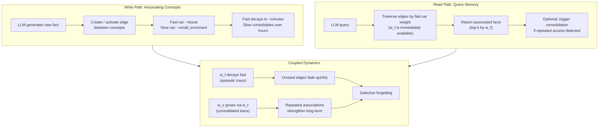

# Day 30: Memini -- Multi-Timescale Memory Dynamics for LLM External Knowledge

> **Watch the animation**: 

## One-Line Summary

Memini reframes LLM external memory as an associative directed graph where each edge carries coupled fast and slow variables inspired by the Benna-Fusi model of synaptic consolidation — yielding episodic sensitivity (immediate use of new knowledge), gradual consolidation (repetition strengthens long-term memory), and selective forgetting (unused edges fade) from a single mechanism.

---

## Why This Matters

### The Static LLM Problem

Large language models are trained once on a fixed dataset, then deployed into a world that never stops changing. Their weights are frozen; they cannot natively update their factual knowledge without costly retraining or fine-tuning.

The standard fix is **external memory** — a separate storage system (vector database, knowledge graph, retrieval index) that the LLM queries at inference time. But existing approaches treat memory as a passive lookup table: you store facts, you retrieve them, done.

**The biological paradox**: Biological memory doesn't work this way. Your brain doesn't store memories in fixed locations — it dynamically adjusts how strongly connections are held based on how often, how recently, and in what context they are used.

### What Memini Adds

Memini proposes that external memory should itself be a **learning system**, not just a storage system. Knowledge should reorganize through its own dynamics:

- New associations become immediately usable (episodic sensitivity)
- Repeated confirmations strengthen memory over time (gradual consolidation)
- Rarely-used knowledge fades gracefully (selective forgetting)

All three properties emerge from a single, principled mechanism: **coupled multi-timescale dynamics** on the memory graph.

---

## Architecture Walkthrough

### Core Data Structure: Associative Graph

Memini organizes external knowledge as a **directed graph**:

```
Nodes = concepts / entities
Edges = associations between concepts
Edge weights = two coupled variables (fast, slow)
```

When the LLM reads from memory, it traverses edges weighted by the **fast variable**. When it writes to memory, both fast and slow variables update. The slow variable carries the consolidated long-term trace.

### The Benna-Fusi Fast-Slow Coupled Update

The update rule for each edge follows the Benna-Fusi model of synaptic consolidation:

$$
w_f^{(t+1)} = w_f^{(t)} \cdot \alpha_f + \eta_f \cdot \delta
$$
$$
w_s^{(t+1)} = w_s^{(t)} \cdot \alpha_s + \eta_s \cdot \delta \cdot w_f^{(t)}
$$

Where:
- $w_f$ = fast variable (immediate, decays quickly)
- $w_s$ = slow variable (gradual, decays slowly)
- $\alpha_f > \alpha_s$ (fast decays faster)
- $\eta_f, \eta_s$ = learning rates
- $\delta$ = prediction error / reinforcement signal

The **key insight**: the slow variable depends on the fast variable, so new associations are immediately usable (high $w_f$) but only gradually consolidated (slow growth of $w_s$).

### Memory Operations



### Emergent Properties

**Episodic Sensitivity**: When a new edge is created, $w_f$ immediately spikes. The LLM can retrieve this association on the very next query — no "training" delay.

**Gradual Consolidation**: Each time the same edge is activated, $w_f$ briefly rises again, contributing a small increment to $w_s$. Over repeated access, $w_s$ accumulates — even if $w_f$ has decayed between accesses. The association becomes robust.

**Selective Forgetting**: If an edge is never accessed again, $w_f$ decays rapidly toward zero. The slow variable decays too, but much more slowly. In practice, this means: recently learned-but-unused facts fade fast; well-consolidated facts persist much longer.

---

## Key Results

From the paper (Memini, 2026):

| Property | Mechanism | Behavioral Outcome |
|:---------|:----------|:-------------------|
| Episodic sensitivity | High $w_f$ at write time | New knowledge usable immediately |
| Gradual consolidation | $w_s$ accumulates via repeated $w_f$ spikes | Facts strengthen with repeated access |
| Selective forgetting | Fast decay of $w_f$, slow decay of $w_s$ | Rare facts fade, core facts persist |
| Single mechanism | Benna-Fusi coupled update | All three from same equation |

---

## What This Enables

**Continuous knowledge updates without retraining**: Facts can be updated by activating the corresponding edge — no gradient computation, no model weights touched.

**Context-aware memory prioritization**: Concepts accessed frequently in the current conversation naturally strengthen their edges, making the memory respond to relevance.

**Graceful degradation**: As old facts decay, the system doesn't make sharp cutoffs — recent facts are weaker but still retrievable; only truly abandoned facts fully fade.

---

## Quick Quiz

**Q1**: In the Benna-Fusi update rule, what does the slow variable $w_s$ depend on that the fast variable $w_f$ does NOT?

**Q2**: If an edge is activated once and then never accessed again, which property describes why it fades from the memory?

**Q3**: Memini's memory is an *associative graph*, not a simple key-value store. What advantage does the graph structure give over a flat key-value lookup?

---

## See Also

- [Day 08: Memory & KV Cache](/tutorials/en/work/memory/08-memory-kv-cache.md) — PagedAttention and eviction strategies for GPU memory
- [Day 27: LightKV](/tutorials/en/work/inference/27-lightkv.md) — Lightweight KV cache compression for LVLMs

---

## References

- Pattichis & Dovrolis, "[Continual Knowledge Updating in LLM Systems: Learning Through Multi-Timescale Memory Dynamics](https://arxiv.org/abs/2605.05097)", arXiv 2605.05097 (2026)
