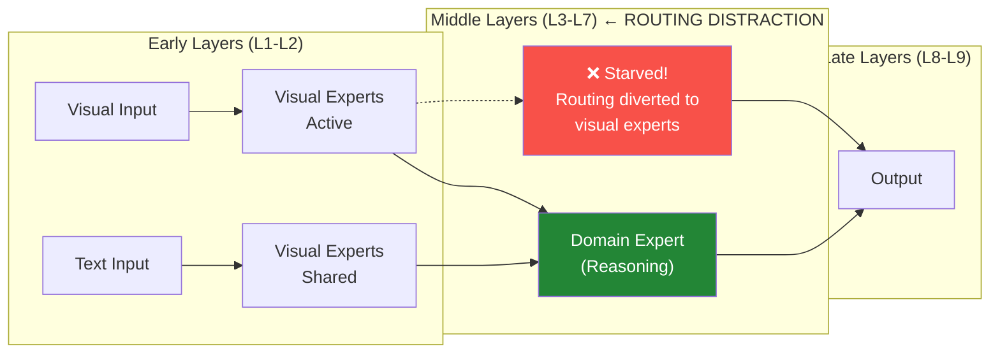

# Day 16: Seeing but Not Thinking — Routing Distraction in Multimodal MoE
# 第 16 天: 视觉感知却未思考 — 多模态 MoE 中的路由分心现象

> **Date**: 2026-04-12 | **Difficulty**: Advanced | **Category**: MoE + Multimodal
> **Watch**: 

## One-Line Summary | 一句话总结

Multimodal MoE models suffer from a "Seeing but Not Thinking" failure: they perceive images correctly but fail to reason, because visual inputs distract the routing mechanism from activating domain experts.

多模态 MoE 模型存在"看得见但不会思考"的缺陷：它们能正确感知图像内容，却在后续推理中失败——因为视觉输入干扰了路由机制，使其无法激活领域专家。

---

## Background | 背景

### Related Tutorials | 相关教程

- [Day 02: Mixture of Experts](/tutorials/en/moe/02-mixture-of-experts.md) — MoE fundamentals (experts, routing, top-k)
- [Day 07: RBF Attention](/tutorials/en/attention/07-rbf-attention.md) — routing mechanisms in attention

### Why This Matters | 为什么重要

MoE models route tokens to specialized "experts" (FFN sublayers). When the same model handles both images and text, intuition says visual tokens should activate visual experts and text tokens should activate language experts. But this paper discovers a **counterintuitive failure mode**: visual inputs actively suppress the domain experts needed for reasoning, even when solving problems identical to those the model solves easily in text form.

---

## Key Insight: Routing Distraction | 核心发现：路由分心

### The Phenomenon | 现象

```
Problem (Text):    "If a train travels 240 miles in 4 hours, how fast is it going?"
  → Answer: 60 mph ✓ (Model solves this correctly)

Problem (Image):    [Same word problem shown as image of text on paper]
  → Answer: FAIL ✗ (Model gets it wrong)
```

The model sees the same content but fails when it's presented visually. This is **not** a vision-language alignment problem — the model understands what's in the image. It fails specifically at the **reasoning step after perception**.

### Root Cause: Layer-wise Separation | 根因：层级分离

Analysis reveals that visual and text inputs route to different experts in **middle layers** (L3–L7), precisely where domain reasoning experts concentrate:



Key finding: **image inputs induce significant routing divergence from text inputs in middle layers**. The routing mechanism fails to activate task-relevant reasoning experts when processing visual tokens.

### Routing Distraction Hypothesis | 路由分心假设

When processing visual inputs, the router allocates too many slots to visual-domain experts, starving the domain experts responsible for general reasoning. This happens even when the task is purely reasoning (e.g., solving a math word problem).

### Validation: Routing-Guided Intervention | 验证：路由引导干预

The authors propose a simple intervention: **identify which expert handles general reasoning** (by analyzing routing patterns on text-only tasks), then **boost that expert's activation weight** when processing visual inputs.

```python
def routing_guided_intervention(router_weights, domain_expert_id, boost=1.3):
    """
    router_weights: [num_tokens, num_experts] routing scores
    domain_expert_id: index of the domain (reasoning) expert
    boost: multiplicative boost for domain expert activation
    """
    boosted = router_weights.clone()
    boosted[:, domain_expert_id] *= boost

    # Re-normalize so weights sum to 1
    boosted = boosted / boosted.sum(dim=-1, keepdim=True)
    return boosted
```

Results: **+3.17%** on complex visual reasoning tasks across three multimodal MoE models.

---

## Mathematical Formulation | 数学表述

### Standard MoE Routing | 标准 MoE 路由

For a token $\mathbf{h}_t$, the router computes:

$$P(e_i | \mathbf{h}_t) = \text{softmax}(\mathbf{W}_r \mathbf{h}_t)_i = \frac{\exp(\mathbf{w}_i^\top \mathbf{h}_t)}{\sum_{j=1}^{E} \exp(\mathbf{w}_j^\top \mathbf{h}_t)}$$

Top-$k$ experts are selected: $\mathcal{E}_t = \text{Top}_k(P(e | \mathbf{h}_t))$

### Routing Divergence Measurement | 路由散度度量

The divergence between visual and text routing at layer $\ell$:

$$\Delta_\ell = \frac{1}{T} \sum_{t=1}^{T} \| \mathbf{p}_t^\text{img} - \mathbf{p}_t^\text{text} \|_1$$

where $\mathbf{p}_t^\text{img}$ and $\mathbf{p}_t^\text{text}$ are the routing probability distributions for the same token in image vs. text modality.

Key finding: $\Delta_\ell$ peaks at middle layers ($\ell \in [3, 7]$), confirming layer-wise separation.

### Routing-Guided Intervention | 路由引导干预

The boosted routing probability:

$$P'(e_i | \mathbf{h}_t) = \text{softmax}\left( \mathbf{W}_r \mathbf{h}_t + \mathbf{b}_i^\text{boost} \right)_i$$

where $\mathbf{b}_i^\text{boost} = \gamma \cdot \mathbb{1}[i = e^*]$ and $e^*$ is the identified domain expert, $\gamma > 0$.

---

## Code | 代码

```python
import torch
import torch.nn as nn
import torch.nn.functional as F

class MultimodalMoERouter(nn.Module):
    """
    Standard MoE router with routing distraction analysis.
    """
    def __init__(self, d_model: int, num_experts: int, top_k: int = 2):
        super().__init__()
        self.num_experts = num_experts
        self.top_k = top_k
        self.gate = nn.Linear(d_model, num_experts, bias=False)

    def forward(self, x: torch.Tensor) -> tuple:
        """
        x: [batch, seq, d_model]
        Returns: top_k expert indices, top_k weights, routing probabilities
        """
        # Router scores: [batch, seq, num_experts]
        logits = self.gate(x)
        probs = F.softmax(logits, dim=-1)

        # Top-k selection
        top_k_probs, top_k_ids = torch.topk(probs, self.top_k, dim=-1)
        top_k_probs = top_k_probs / top_k_probs.sum(dim=-1, keepdim=True)  # renormalize

        return top_k_ids, top_k_probs, probs


class RoutingGuidedIntervention(nn.Module):
    """
    Applies routing-guided intervention to boost domain expert activation.
    """
    def __init__(self, d_model: int, num_experts: int, top_k: int = 2,
                 domain_expert_id: int = 1, boost_factor: float = 1.3):
        super().__init__()
        self.router = MultimodalMoERouter(d_model, num_experts, top_k)
        self.domain_expert_id = domain_expert_id
        self.boost_factor = boost_factor

    def compute_divergence(self, probs_img: torch.Tensor,
                           probs_text: torch.Tensor) -> torch.Tensor:
        """
        Compute L1 routing divergence between modalities.
        probs: [batch, seq, num_experts]
        """
        return (probs_img - probs_text).abs().mean(dim=[1, 2])

    def forward(self, x: torch.Tensor,
                is_visual: bool = False) -> tuple:
        """
        x: [batch, seq, d_model]
        is_visual: whether input is visual modality
        """
        top_k_ids, top_k_probs, probs = self.router(x)

        if is_visual and self.domain_expert_id is not None:
            # Boost domain expert activation for visual inputs
            boosted_probs = probs.clone()
            boosted_probs[:, self.domain_expert_id] *= self.boost_factor
            boosted_probs = boosted_probs / boosted_probs.sum(dim=-1, keepdim=True)

            # Recompute top-k
            top_k_probs_new, top_k_ids_new = torch.topk(
                boosted_probs, self.top_k, dim=-1
            )
            top_k_probs_new = top_k_probs_new / top_k_probs_new.sum(dim=-1, keepdim=True)
            return top_k_ids_new, top_k_probs_new, boosted_probs

        return top_k_ids, top_k_probs, probs


# --- Demo ---
if __name__ == "__main__":
    batch, seq, d_model = 2, 16, 64
    num_experts = 6
    x = torch.randn(batch, seq, d_model)

    model = RoutingGuidedIntervention(
        d_model=d_model,
        num_experts=num_experts,
        top_k=2,
        domain_expert_id=1,    # Expert 1 = domain reasoning expert
        boost_factor=1.3
    )

    # Text input: standard routing
    top_k_ids, top_k_probs, probs = model(x, is_visual=False)
    print(f"Text routing - Expert 1 activation: {probs[:, :, 1].mean().item():.3f}")

    # Visual input: boosted routing
    top_k_ids_v, top_k_probs_v, probs_v = model(x, is_visual=True)
    print(f"Visual (baseline) - Expert 1 activation: {probs_v[:, :, 1].mean().item():.3f}")

    # Without intervention (for comparison)
    model_no_int = MultimodalMoERouter(d_model, num_experts, top_k=2)
    _, _, probs_baseline = model_no_int(x)
    print(f"Visual (no intervention) - Expert 1 activation: {probs_baseline[:, :, 1].mean().item():.3f}")
```

---

## Key Takeaways | 核心要点

1. **"Seeing but Not Thinking"** is a genuine failure mode in multimodal MoE, not a hallucination or alignment issue
2. **Middle layers are the bottleneck** — routing divergence peaks at L3–L7, not early or late layers
3. **Domain experts = reasoning experts** — the expert that handles text reasoning also handles visual reasoning (same cognitive function)
4. **Simple intervention works** — boosting the domain expert by 1.3x improves visual reasoning by up to 3.17%
5. **Cross-task transfer** — domain expert identification transfers across tasks because it identifies cognitive functions, not sample-specific solutions

---

## References | 参考文献

- **Paper**: [Seeing but Not Thinking: Routing Distraction in Multimodal Mixture-of-Experts](https://arxiv.org/abs/2604.08541) — Xu et al., 2026-04-09
- **Related (Day 02)**: [Mixture of Experts](/tutorials/en/moe/02-mixture-of-experts.md)
- **Related (Day 07)**: [RBF Attention](/tutorials/en/attention/07-rbf-attention.md)

---

---

## Quick Quiz

Test your understanding of this topic.

### Q1. What is the core mechanism described in this tutorial?

- A. A new attention variant
- B. A training or inference algorithm
- C. A hardware optimization
- D. A dataset format

<details>
<summary>Reveal Answer</summary>

**Answer: B** — This tutorial focuses on a routing mechanism.

*Explanation varies by tutorial — see the Core Insight section for the key takeaway.*

</details>

### Q2. When does this approach work best?

- A. Only on very large models
- B. Only on small models
- C. Under specific conditions detailed in the tutorial
- D. Always, regardless of setup

<details>
<summary>Reveal Answer</summary>

**Answer: C** — The tutorial describes specific conditions and tradeoffs. Review the "Why This Matters" and "Limitations" sections.

</details>

### Q3. What is the main takeaway?

- A. Use this instead of all other approaches
- B. This is a niche optimization with no practical use
- C. A specific mechanism with clear use cases and tradeoffs
- D. This has been superseded by a newer method

<details>
<summary>Reveal Answer</summary>

**Answer: C** — Every tutorial in this repo focuses on a specific mechanism with its own tradeoffs. Check the One-Line Summary at the top and the "What [Topic] Teaches Us" section at the bottom.

</details>
