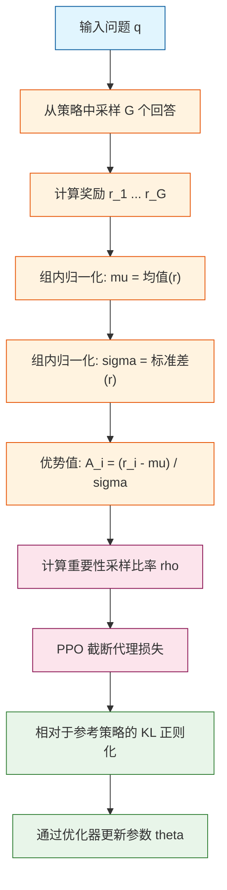

<video src="https://playitcooool.github.io/advanced-ai-daily/videos/01-grpo.webm" autoplay loop muted playsinline width="800"></video>


# 第 01 天：GRPO —— 组相对策略优化

---

## 快速参考

**核心公式：**

$$A_i = \frac{r_i - \mu}{\sigma}, \quad \mu = \frac{1}{G}\sum_{j=1}^{G} r_j, \quad \sigma = \sqrt{\frac{1}{G}\sum_{j=1}^{G}(r_j - \mu)^2}$$

**一行代码（PyTorch）：**

```python
advantages = (rewards - rewards.mean()) / (rewards.std() + 1e-8)
```

---

## 一句话概要

GRPO 通过在同一个输入上生成多个回答并利用组内相对排名来估计优势值，从而消除了 PPO 中价值网络（Critic）的需求。它是 DeepSeek-R1 的核心训练算法。

---

## 为什么这很重要

标准的近端策略优化（PPO）需要训练两个同等大小的网络：策略网络和价值网络。在 700 亿以上参数量级的大语言模型时代，维护一个与策略网络同等大小的价值网络会使显存占用翻倍，并引入额外的训练不稳定性来源。

GRPO 用从一组回答中计算得到的采样基线替代了学习到的价值网络。这将近显存使用减少了一半，并消除了整个辅助训练循环。

| 维度 | PPO | GRPO |
|---|---|---|
| 价值网络 | 需要（与策略网络等大） | 不需要 |
| 优势值来源 | 价值函数 V(s) | 组内排名与均值/标准差归一化 |
| 显存占用 | 约 2 倍策略模型 | 约 1.2 倍策略模型 |
| 训练稳定性 | 受价值网络精度影响大 | 更稳定，无需辅助网络 |
| 最佳适用场景 | 通用强化学习任务 | 可验证奖励（数学、代码、问答） |
| 基线 | 学习得到的 V(s) | 组内均值 |
| 信号归一化 | 固定或学习得到 | 通过组内标准差自动缩放 |

---

## 架构



核心洞察体现在节点 F 中：优势值估计纯粹通过比较组内回答产生，不需要外部价值网络。

---

## 数学推导

### 优势估计（组内相对）

对于问题 q 的 G 个回答，计算标量奖励 $r_1, \ldots, r_G$：

$$\mu = \frac{1}{G}\sum_{j=1}^{G} r_j$$

$$\sigma = \sqrt{\frac{1}{G}\sum_{j=1}^{G}(r_j - \mu)^2} + \epsilon$$

$$A_i = \frac{r_i - \mu}{\sigma}$$

组内均值 $\mu$ 替代了价值网络中的基线 $V(s)$。组内标准差 $\sigma$ 归一化了优势信号：当回答差异很大时放大梯度，回答相似时减小梯度。小常数 $\epsilon$ 防止除零。

### 带 PPO 截断的策略目标函数

重要性采样比率比较当前策略与旧策略：

$$\rho_i(\theta) = \frac{\pi_\theta(o_i \mid q)}{\pi_{\theta_{\text{old}}}(o_i \mid q)}$$

完整的 GRPO 损失将截断代理目标与 KL 正则化相结合：

$${\cal L}_{\text{GRPO}}(\theta) = \mathbb{E}\Big[\min\big(\rho_i(\theta) \cdot A_i,\ \text{clip}(\rho_i(\theta), 1 - \epsilon, 1 + \epsilon) \cdot A_i\big)\Big] - \beta \cdot D_{\text{KL}}(\pi_\theta \parallel \pi_{\text{ref}})$$

其中：

- $A_i$ 是第 i 个回答的组内归一化优势值
- $\epsilon$ 是 PPO 截断参数（通常为 0.2）
- $\beta$ 是 KL 惩罚系数
- $D_{\text{KL}}$ 是当前策略与参考策略之间的 KL 散度

---

## 代码实现

```python
import torch
import torch.nn.functional as F


def group_normalize(rewards: torch.Tensor, eps: float = 1e-8) -> torch.Tensor:
    """在不使用价值网络的情况下计算组内归一化优势值。

    对每组回答，减去组内均值并除以组内标准差，
    从而获得优势估计。

    参数:
        rewards: 形状 (G,) 组内每个回答的标量奖励。
        eps: 防止除零的小常数。

    返回:
        advantages: 形状 (G,) 每个回答的归一化优势值。
    """
    mean = rewards.mean(dim=0)
    std = rewards.std(dim=0) + eps
    advantages = (rewards - mean) / std
    return advantages


def ppo_clipped_loss(
    policy_log_probs: torch.Tensor,
    old_log_probs: torch.Tensor,
    advantages: torch.Tensor,
    epsilon: float = 0.2,
) -> torch.Tensor:
    """计算 PPO 截断代理损失。

    通过截断重要性采样比率，防止策略更新步长过大。

    参数:
        policy_log_probs: 形状 (G,) 当前策略的对数概率。
        old_log_probs: 形状 (G,) 旧策略的对数概率。
        advantages: 形状 (G,) 组内归一化优势值。
        epsilon: 截断阈值（默认 0.2）。

    返回:
        loss_scalar: 平均截断损失（取反后被优化器最小化）。
    """
    ratio = torch.exp(policy_log_probs - old_log_probs)
    clipped_ratio = torch.clamp(ratio, 1.0 - epsilon, 1.0 + epsilon)

    surrogate_unclipped = ratio * advantages
    surrogate_clipped = clipped_ratio * advantages

    # 取最小值以实现保守更新
    loss = torch.min(surrogate_unclipped, surrogate_clipped)
    return loss.mean()


def kl_penalty(
    policy_logits: torch.Tensor,
    ref_logits: torch.Tensor,
) -> torch.Tensor:
    """计算当前策略与参考策略之间的 KL 散度。

    此惩罚项防止策略过度偏离原始监督微调模型。

    参数:
        policy_logits: 形状 (G, 词表大小) 当前模型的 logits。
        ref_logits: 形状 (G, 词表大小) 参考模型的 logits。

    返回:
        kl_loss: 标量 KL 散度值。
    """
    log_policy = F.log_softmax(policy_logits, dim=-1)
    log_ref = F.log_softmax(ref_logits, dim=-1)
    kl = F.kl_div(log_ref, log_policy, reduction="batchmean", log_target=True)
    return kl


def grpo_loss(
    policy_logits: torch.Tensor,
    old_logits: torch.Tensor,
    rewards: torch.Tensor,
    beta: float,
    ref_logits: torch.Tensor | None = None,
    epsilon: float = 0.2,
) -> torch.Tensor:
    """完整的 GRPO 损失函数，结合组内归一化、PPO 截断和 KL 正则化。

    参数:
        policy_logits: 形状 (G, 词表大小) 当前策略的 logits。
        old_logits: 形状 (G, 词表大小) 采样时的旧策略 logits。
        rewards: 形状 (G,) 每个回答的标量奖励。
        beta: KL 惩罚系数。
        ref_logits: 形状 (G, 词表大小) 参考策略的 logits（可选）。
        epsilon: PPO 截断参数（默认 0.2）。

    返回:
        loss: 标量损失值（取反以便标准优化器进行最小化）。
    """
    # 步骤 1：计算当前策略和旧策略下的对数概率
    policy_log_probs = F.log_softmax(policy_logits, dim=-1).sum(dim=-1)
    old_log_probs = F.log_softmax(old_logits, dim=-1).sum(dim=-1)

    # 步骤 2：组内归一化优势值（无需价值网络！）
    advantages = group_normalize(rewards)

    # 步骤 3：PPO 截断目标
    clip_objective = ppo_clipped_loss(
        policy_log_probs, old_log_probs, advantages, epsilon
    )

    # 步骤 4：KL 正则化（可选但强烈推荐）
    kl = torch.tensor(0.0, device=policy_logits.device)
    if ref_logits is not None:
        kl = kl_penalty(policy_logits, ref_logits)

    # 步骤 5：合并目标（取反以实现标准最小化）
    total_loss = -(clip_objective - beta * kl)
    return total_loss


if __name__ == "__main__":
    torch.manual_seed(42)

    G = 8        # 每组回答的数量
    V = 1000     # 词表大小（模拟）

    # 模拟的虚拟数据
    policy_logits = torch.randn(G, V)
    old_logits = torch.randn(G, V)
    ref_logits = torch.randn(G, V)
    rewards = torch.tensor([0.9, 0.3, 0.7, 0.5, 0.1, 0.8, 0.2, 0.6])

    beta = 0.01  # KL 惩罚系数

    loss = grpo_loss(
        policy_logits=policy_logits,
        old_logits=old_logits,
        rewards=rewards,
        beta=beta,
        ref_logits=ref_logits,
        epsilon=0.2,
    )

    print(f"GRPO 损失值: {loss.item():.6f}")

    # 梯度验证：反向传播可以正常执行
    loss.backward()
    print("反向传播成功 —— 实现具备可微性。")
```

---

## 深入探究

### 1. 为什么组内归一化优势值有效？

GRPO 用采样基线（组内均值）替代了学习到的价值函数 $V(s)$。这在理论上是合理的，有两方面原因。

首先，组内均值 $\mu$ 是当前策略下期望奖励的**无偏估计量**。在经典的策略梯度理论中，任何从奖励中减去的基线 $b$ 都不会给梯度引入偏差，只要这个基线不依赖于具体动作。由于 $\mu$ 是基于整个组在分配优势值之前计算得到的，因此满足这一条件。

其次，除以组内标准差 $\sigma$ 提供了**自动奖励缩放**功能。在训练初期，策略生成的回答多样性很高，奖励差异很大，此时 $\sigma$ 较大，优势值被削弱，这防止了不稳定、过大的梯度更新。随着训练推进，策略逐步改进，回答之间变得更加相似，$\sigma$ 缩小，优势值增大，从而提供更精细的学习信号。

| 组内回答质量情况 | sigma 大小 | 对优势值的影响 |
|---|---|---|
| 所有回答相似 | 较小的 sigma | 优势值大，信号强 |
| 回答差异很大 | 较大的 sigma | 优势值被削弱，保守更新 |
| 全部都很差 | 均值低，sigma 小 | 强烈远离差的回答 |
| 全部都很好 | 均值高，sigma 小 | 强烈趋向好的回答 |

### 2. 局限性与边界情况

GRPO 设计优雅，但也存在已知的失效模式，实践者必须了解。

**组内零和问题。** GRPO 的优势估计是相对的而非绝对的。如果 G 个回答全部都很差，它们的优势值之和仍然为零。在差选项中，最好的回答仍然会得到正的优势值并被强化——尽管这个回答客观上仍然很差。解决方案包括引入绝对奖励阈值，或混合监督微调数据。

**奖励噪声敏感性。** 如果奖励模型本身存在噪声，组内的排名可能不可靠。当两个回答之间的奖励差异小于奖励噪声时，GRPO 可能会将策略推向错误方向。增大组大小 G 有助于通过平均化消除均值中的噪声，但无法修复两两比较中的排名错误。

| 局限性 | 根本原因 | 缓解策略 |
|---|---|---|
| 仅相对优势 | 均值中心化强制和为零 | 混合绝对奖励阈值 |
| 有噪声的奖励排名 | 不完美的奖励模型 | 增大组大小 G |
| 多步环境 | 无时间优势传播 | 对顺序强化学习使用 GAE 或价值网络 |
| 组内方差过小 | 所有回答几乎相同 | 采样时添加温度噪声 |

### 3. DeepSeek-R1 在 GRPO 之上的创新

DeepSeek-R1 以前所未有的规模应用了 GRPO，并引入了多项实用改进。

**基于规则的可验证奖励。** DeepSeek-R1 不依赖学习式的奖励模型，而是对数学和代码问题使用确定性的奖励信号：代码能否编译？能否通过单元测试？数学答案是否与标准答案一致？这在相应领域中完全消除了奖励模型的偏差。

**格式奖励。** 奖励信号还检查推理过程的结构属性：回答中是否包含清晰标注的思考部分和最终答案？推理过程是否结构清晰？这鼓励了模型涌现出推理能力，而无需显式的思维链监督。

| DeepSeek-R1 创新 | 目的 | 效果 |
|---|---|---|
| 基于规则的奖励 | 消除奖励模型偏差 | 确定、可靠的训练信号 |
| 格式奖励 | 鼓励推理结构 | 涌现式思维链行为 |
| 监督微调预热 | 稳定早期训练 | 更平滑过渡到纯 GRPO |
| 大组大小（G 大于等于 16） | 更可靠的统计量 | 更好的均值和方差估计 |

---

## 常见误区

- **GRPO 消除了所有类似价值计算。** 它消除了学习到的价值网络，但组内均值和标准差仍然充当隐式的价值估计。均值和标准差的计算充当了数据驱动的基线。

- **GRPO 始终优于 PPO。** GRPO 在具有可验证的离散奖励（数学、代码）的任务中表现出色。对于连续控制或序列决策，带有合适价值函数和 GAE 的 PPO 仍然更优。

- **组越大越好。** 虽然更大的 G 给出更可靠的统计量，但它也增加了每个训练步骤的显存和计算量。存在实际的权衡，DeepSeek-R1 选择 G = 16 作为最佳平衡点。

- **KL 惩罚在实践中是可选的。** 对于小型模型或较少训练步数，省略 KL 惩罚似乎可行。但对于大规模训练，没有 KL 正则化时，策略可能退化为通过漏洞最大化奖励的输出，而非真正的质量提升。

---

## 练习

### 练习一：实现优势值计算

编写一个函数，同时为多个问题计算组内归一化优势值，其中奖励的形状为 `(问题数量, G)`。

<details>
<summary>点击查看答案</summary>

```python
def multi_group_normalize(rewards: torch.Tensor, eps: float = 1e-8) -> torch.Tensor:
    """同时为多个问题计算优势值。

    参数:
        rewards: 形状 (问题数量, G)。
        eps: 小常数。

    返回:
        advantages: 形状 (问题数量, G)。
    """
    mean = rewards.mean(dim=-1, keepdim=True)
    std = rewards.std(dim=-1, keepdim=True) + eps
    return (rewards - mean) / std
```

</details>

### 练习二：除以标准差有什么好处？

假设在训练初期，一组 4 个回答的奖励为 `[0.1, 0.9, 0.2, 0.8]`。之后，策略改善后，奖励变为 `[0.85, 0.95, 0.88, 0.92]`。计算两种情况下的优势值，并解释标准差如何提供不同的学习信号。

<details>
<summary>点击查看答案</summary>

早期组（奖励差异大）：
- 均值 = 0.50，标准差 = 0.374
- 优势值：`[-1.07, 1.07, -0.80, 0.80]`

后期组（奖励相似且较高）：
- 均值 = 0.90，标准差 = 0.041
- 优势值：`[-1.22, 1.22, -0.49, 0.49]`

在后期组中，即使质量上的微小差异也能产生较大的优势值，因为此时标准差很小。这意味着当策略已经达到较高性能水平时，对于区分细微不同的回答质量，策略仍然能接收到强烈的梯度信号。

</details>

### 练习三：如果所有奖励完全相同会发生什么？

如果 G 个都回答获得了完全相同的奖励，优势值估计会发生什么？提出一种修复方案。

<details>
<summary>点击查看答案</summary>

当所有奖励完全相同时（对于所有 i，r_i = r），我们得到 均值 = r，标准差 = epsilon（接近零）。每个回答的优势值都变为 $(r - r) / \epsilon = 0 / \epsilon = 0$。所有梯度信号消失。

**修复方法一：** 添加最小标准差下限（例如 `std = max(奖励.std() + eps, 0.01)`）。这确保优势值保持为零但防止数值不稳定。

**修复方法二：** 当组方差低于某个阈值时，回退到学习到的价值函数基线。

**修复方法三：** 在采样时添加奖励噪声以确保多样性。

</details>

---

## 真实论文与参考文献

- **DeepSeek-R1：通过强化学习激励大语言模型的推理能力** -- https://arxiv.org/abs/2501.12948
- **DeepSeekMath：推动数学推理的极限** -- https://arxiv.org/abs/2402.03300
- **近端策略优化算法** -- https://arxiv.org/abs/1707.06347
- **高分辨率大语言模型对齐** -- https://arxiv.org/abs/2304.06767（DAPO，一种改进的 GRPO 变体）

---

## 延伸阅读

- **广义优势估计（GAE）** -- https://arxiv.org/abs/1506.02438
- **PPO 截断：代理目标解释** -- OpenAI Spinning Up 文档
- **使用人类反馈强化学习训练语言模型（RLHF）** -- https://arxiv.org/abs/2203.02155

---

_上一篇：无  |  下一篇：[第 02 天 —— 混合专家模型](02-mixture-of-experts.md)_
