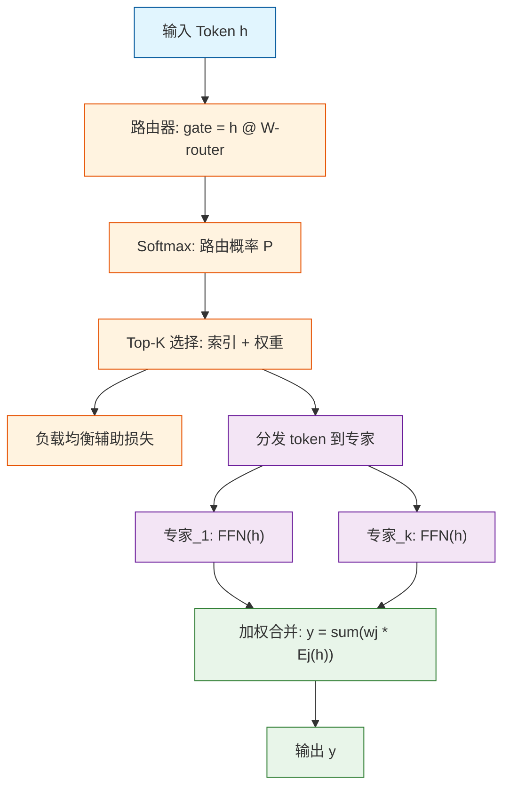

# 第 02 天：混合专家模型（MoE）

---

## 快速参考

**核心公式：**

$$y = \sum_{j=1}^{k} wj \cdot \text{Expert}_{e_j}(h), \quad wj = \frac{\text{softmax}(g)_j}{\sum_{m=1}^{k} \text{softmax}(g)_{e_m}}$$

**一行代码（PyTorch 路由）：**

```python
top_k_weights, top_k_indices = torch.topk(softmax(router(h)), k=2, dim=-1)
```

---

## 一句话概要

混合专家模型（MoE）将每个前馈网络（FFN）层替换为一组 K 个独立的专家网络和一个可训练的路由器，路由器为每个 token 仅选择排名最高的 k 个专家，使得模型能够扩展到万亿级参数量，同时保持每个 token 的计算量恒定，且大致等同于稠密模型。

---

## 为什么这很重要

传统的稠密 Transformer 扩展时，参数量和每个 token 的计算量同时增长：参数量翻倍意味着每个 token 每层的乘加运算也翻倍。一个 3000 亿参数的稠密模型每层每个 token 需要 3000 亿次浮点运算，这对于训练和推理来说都过于昂贵。

MoE 将这两个规模脱钩。你可以在众多专家中存储数千亿参数，但每个 token 只激活其中一小部分。这意味着你可以拥有巨型模型的表征能力，同时只付出小得多的计算成本。

| 维度 | 稠密 Transformer | MoE Transformer |
|---|---|---|
| 每层参数量 | d_model x d_ff | N x d_model x d_ff（N 个专家） |
| 每 token 激活参数量 | d_model x d_ff | k x d_model x d_ff（k 个专家） |
| 总参数量 | 与模型大小线性比例 | 与专家数量 N 成比例 |
| 每 token FLOPs | 固定，与所有参数成比例 | 总参数的 k/N |
| 显存占用 | 与激活参数成比例 | 与总参数成比例 |
| 训练稳定性 | 已被充分理解 | 对路由坍缩敏感 |
| 分布式训练 | 标准 all-reduce | 专家并行 + all-to-all |
| 实际案例 | LLaMA 3、Mistral 7B | Mixtral 8x7B、DeepSeek-V3 |

---

## 架构



每个 token 遵循稀疏路径：路由器从 N 个专家中仅选择 K 个。负载均衡辅助损失（节点 E）通过鼓励均匀的 token 分布来防止路由坍缩。

---

## 数学推导

### 路由器与 Top-K 选择

对于每个输入 token $h$，路由器在所有 $N$ 个专家上计算选择分数：

$$\texttt{gate-logits} = h \cdot W_{\text{router}}$$

其中 $W_{\text{router}}$ 的形状为 $(d_{\text{model}}, N)$。通过 softmax 获取路由概率：

$$P = \text{softmax}\left(\frac{\texttt{gate-logits}}{\tau}\right)$$

Top-K 选择选取概率最高的 $k$ 个专家并重新归一化：

$$T = \text{top-k}(P) = \{e_1, e_2, \ldots, e_k\}$$

$$wj = \frac{P_{e_j}}{\sum_{m=1}^{k} P_{e_m}}$$

温度参数 $\tau$ 控制路由的锐度。较低的温度给出更确定的路由（一个专家占主导）。较高的温度给出更柔和的路由（多个专家贡献更加均衡）。

### 专家输出计算

最终输出是选中专家输出的加权和：

$$y = \sum_{j=1}^{k} wj \cdot \text{Expert}_{e_j}(h)$$

每个专家是一个标准的前馈网络：

$$\text{Expert}_i(h) = \text{ReLU}(h \cdot W_{\text{gate}}^{(i)} + b_{\text{gate}}^{(i)}) \cdot W_{\text{down}}^{(i)}$$

每个 token 的总前向浮点运算约为 $k \cdot (2 \cdot d_{\text{model}} \cdot d_{\text{ff}})$，而不是 $N \cdot d_{\text{ff}}$。

### 负载均衡辅助损失

如果没有显式的负载均衡损失，路由倾向于退化：少数热门专家接收大部分 token，而其他专家利用率不足。辅助损失可以防止这种坍缩：

$$f_i = \frac{\text{路由到专家 } i \text{ 的 token 数量}}{\text{总 token 数量}}$$

$$P_i = \text{专家 } i \text{ 的平均路由概率}$$

$${\cal L}_{\text{aux}} = \alpha \cdot N \cdot \sum_{i=1}^{N} f_i \cdot P_i$$

其中 $\alpha$ 是权重系数（通常为 0.01）。当 $f_i$ 和 $P_i$ 都均匀等于 $1/N$ 时，损失最小化。

---

## 代码实现

```python
import torch
import torch.nn as nn
import torch.nn.functional as F


class Expert(nn.Module):
    """单个专家网络 —— 一个标准的前馈网络模块。

    在实践中，专家通常是 SwiGLU 或门控 ReLU 的 FFN，
    与稠密 Transformer 中使用的相同。
    """

    def __init__(self, d_model: int, d_ff: int):
        super().__init__()
        self.w_gate = nn.Linear(d_model, d_ff, bias=False)
        self.w_down = nn.Linear(d_ff, d_model, bias=False)

    def forward(self, x: torch.Tensor) -> torch.Tensor:
        """应用专家 FFN 门控和降维投影。

        参数:
            x: 形状 (batch * seq_len, d_model) 的输入 token。

        返回:
            output: 形状 (batch * seq_len, d_model) 的输出。
        """
        return self.w_down(F.relu(self.w_gate(x)))


class MoELayer(nn.Module):
    """混合专家层，支持 Top-K 路由和负载均衡。

    这实现了 Switch Transformer / Mixtral 风格
    MoE 层的简化版本。
    """

    def __init__(
        self,
        d_model: int,
        d_ff: int,
        num_experts: int,
        top_k: int = 2,
        capacity_factor: float = 1.25,
        aux_loss_weight: float = 0.01,
        noise_std: float = 0.0,
    ):
        """初始化 MoE 层。

        参数:
            d_model: 模型维度。
            d_ff: 每专家的前馈隐藏维度。
            num_experts: 专家网络总数。
            top_k: 每个 token 选择的专家数量。
            capacity_factor: 专家容量倍增系数（1.0 = 精确平均）。
            aux_loss_weight: 负载均衡辅助损失权重。
            noise_std: 路由噪声标准差（用于训练）。
        """
        super().__init__()
        self.num_experts = num_experts
        self.top_k = top_k
        self.capacity_factor = capacity_factor
        self.aux_loss_weight = aux_loss_weight
        self.noise_std = noise_std

        # 路由器：线性投影到 num_experts 个分数
        self.router = nn.Linear(d_model, num_experts, bias=False)

        # 创建独立的专家
        self.experts = nn.ModuleList(
            [Expert(d_model, d_ff) for _ in range(num_experts)]
        )

    def forward(
        self, x: torch.Tensor
    ) -> tuple[torch.Tensor, torch.Tensor]:
        """MoE 层的前向传播。

        参数:
            x: 形状 (batch, seq_len, d_model) 的输入 token。

        返回:
            output: 形状 (batch, seq_len, d_model) 的组合专家输出。
            aux_loss: 标量辅助损失。
        """
        batch_size, seq_len, d_model = x.shape

        # 展平以便统一处理所有 token
        flat_x = x.reshape(-1, d_model)  # (BT, d_model)

        # 步骤 1：计算路由分数
        gate_logits = self.router(flat_x)  # (BT, num_experts)

        # 训练期间添加噪声用于探索
        if self.training and self.noise_std > 0:
            noise = torch.randn_like(gate_logits) * self.noise_std
            gate_logits = gate_logits + noise

        # 步骤 2：通过 softmax 获取路由概率
        routing_weights = F.softmax(gate_logits, dim=-1)  # (BT, num_experts)

        # 步骤 3：负载均衡辅助损失
        aux_loss = self.compute_auxiliary_loss(routing_weights)

        # 步骤 4：Top-K 选择
        top_k_weights, top_k_indices = torch.topk(
            routing_weights, self.top_k, dim=-1
        )  # (BT, top_k)

        # 归一化选中的权重使它们和为 1
        top_k_weights = top_k_weights / top_k_weights.sum(
            dim=-1, keepdim=True
        )

        # 步骤 5：分发和计算
        output = torch.zeros_like(flat_x)  # (BT, d_model)

        # 分别处理每个专家
        for expert_idx in range(self.num_experts):
            # 找出哪些 token 选择了此专家
            selected_mask = (top_k_indices == expert_idx)  # (BT, top_k)
            selected_positions = selected_mask.any(dim=-1)  # (BT,)

            if not selected_positions.any():
                continue

            # 收集此专家的 token
            expert_input = flat_x[selected_positions]  # (n_tokens_i, d_model)

            # 收集这些 token 的权重
            expert_weights = (top_k_weights * selected_mask.float()).sum(
                dim=-1
            )  # (n_tokens_i,)

            # 计算专家输出
            expert_output = self.experts[expert_idx](expert_input)

            # 按路由概率加权并散射回原位
            expert_output = expert_output * expert_weights.unsqueeze(-1)
            output[selected_positions] += expert_output

        # 重塑回原始维度
        output = output.reshape(batch_size, seq_len, d_model)

        return output, aux_loss

    def compute_auxiliary_loss(
        self, routing_weights: torch.Tensor
    ) -> torch.Tensor:
        """计算负载均衡辅助损失。

        这鼓励 token 在专家之间均匀分布，
        以防止专家坍缩。

        参数:
            routing_weights: 形状 (num_tokens, num_experts) 路由概率。

        返回:
            aux_loss: 标量辅助损失值。
        """
        num_tokens = routing_weights.size(0)
        N = self.num_experts

        # f_i: 路由到专家 i 的实际 token 占比（基于 Top-K）
        _, top_k_indices = torch.topk(
            routing_weights, self.top_k, dim=-1
        )

        expert_counts = torch.zeros(N, device=routing_weights.device)
        for i in range(N):
            expert_counts[i] = (top_k_indices == i).float().sum()
        f = expert_counts / (num_tokens * self.top_k)

        # P_i: 专家 i 的平均路由概率
        P = routing_weights.mean(dim=0)  # (num_experts,)

        # 损失: alpha * N * sum(f_i * P_i)
        aux_loss = self.aux_loss_weight * N * torch.sum(f * P)

        return aux_loss


class MoETransformerBlock(nn.Module):
    """带有 MoE FFN 层的简化 Transformer 块。

    将注意力机制与基于 MoE 的 FFN 结合，
    形成完整的 Transformer 层。
    """

    def __init__(
        self,
        d_model: int,
        n_heads: int,
        num_experts: int,
        d_ff: int,
        top_k: int = 2,
        capacity_factor: float = 1.25,
        aux_loss_weight: float = 0.01,
    ):
        super().__init__()
        self.self_attn = nn.MultiheadAttention(
            d_model, n_heads, batch_first=True
        )
        self.moe = MoELayer(
            d_model=d_model,
            d_ff=d_ff,
            num_experts=num_experts,
            top_k=top_k,
            capacity_factor=capacity_factor,
            aux_loss_weight=aux_loss_weight,
            noise_std=0.1,
        )
        self.norm1 = nn.LayerNorm(d_model)
        self.norm2 = nn.LayerNorm(d_model)

    def forward(
        self, x: torch.Tensor
    ) -> tuple[torch.Tensor, torch.Tensor]:
        """带有残差连接和层归一化的前向传播。

        返回:
            output: 形状 (batch, seq_len, d_model)。
            aux_loss: 标量 MoE 辅助损失。
        """
        # Pre-LN 残差注意力
        attn_in = self.norm1(x)
        attn_out, _ = self.self_attn(attn_in, attn_in, attn_in)
        x = x + attn_out

        # Pre-LN 残差 MoE
        moe_in = self.norm2(x)
        moe_out, aux_loss = self.moe(moe_in)
        x = x + moe_out

        return x, aux_loss


if __name__ == "__main__":
    torch.manual_seed(42)

    # 小型模拟配置
    batch_size = 4
    seq_len = 32
    d_model = 256
    n_heads = 4
    num_experts = 8
    d_ff = 512
    top_k = 2

    # 创建 MoE Transformer 块
    block = MoETransformerBlock(
        d_model=d_model,
        n_heads=n_heads,
        num_experts=num_experts,
        d_ff=d_ff,
        top_k=top_k,
        capacity_factor=1.25,
        aux_loss_weight=0.01,
    )

    print(f"MoE 配置:")
    print(f"  专家数量: {num_experts}")
    print(f"  Top-K 路由: {top_k}")
    print(
        f"  每专家参数: "
        f"{sum(p.numel() for p in block.moe.experts[0].parameters())/1e6:.2f}M"
    )
    print(
        f"  MoE 总参数: "
        f"{sum(p.numel() for p in block.moe.parameters())/1e6:.2f}M"
    )
    print(
        f"  每 token 激活参数: "
        f"{sum(p.numel() for p in block.moe.experts[0].parameters())/1e6 * top_k:.2f}M"
    )
    print()

    # 随机输入
    x = torch.randn(batch_size, seq_len, d_model)

    print(f"输入形状: {x.shape}")

    # 前向传播
    block.train()
    output, aux_loss = block(x)

    print(f"输出形状: {output.shape}")
    print(f"辅助损失（负载均衡）: {aux_loss.item():.6f}")
    print()

    # 检查是否可以反向传播（包括辅助损失）
    total_loss = output.sum() + aux_loss
    total_loss.backward()
    print("反向传播成功 —— MoE 层完全可微。")

    # 演示负载均衡: 检查 token 分布
    expert_counts = torch.zeros(num_experts)
    with torch.no_grad():
        for _ in range(100):
            x = torch.randn(batch_size * seq_len, d_model)
            gate_logits = block.moe.router(x)
            _, indices = torch.topk(gate_logits, top_k, dim=-1)
            for e in range(num_experts):
                expert_counts[e] += (indices == e).float().sum()

    expert_counts /= expert_counts.sum()
    pct = ", ".join(f"{c:.1%}" for c in expert_counts.tolist())
    print(f"专家利用率（100 个批次）: {pct}")
    print(
        f"标准差: {expert_counts.std().item():.4f} "
        f"（越低 = 平衡越好）"
    )
```

---

## 深入探究

### 1. 为什么路由不会总是坍缩？

理论上的风险是：优化器会发现一个惰性解：将所有内容路由到一个易于训练的专家并停止学习。在实践中，辅助损失通过直接惩罚非均匀分布来防止这一点。

但仅有辅助损失是不够的。关键洞察在于：不同的专家在训练过程中对不同类型的 token 自然形成专业化分工，因为它们接收到不同的梯度信号：

- **数学 token** 路由给学习算术模式的专家。
- **代码 token** 路由给学习语法结构的专家。
- **散文 token** 路由给学习语言模式的专家。
- **混合 token** 路由给通用或回退专家。

这种专业化自然涌现，因为路由器学会了将 token 表示与专家能力相匹配，而每个专家的权重是由它所接收的特定 token 子集塑造的。

| 路由结果 | 原因 | 解决方案 |
|---|---|---|
| 健康（均匀分布，约 12.5%） | 辅助损失 + 噪声 + 数据多样 | 无需处理 |
| 部分坍缩（70/15/5/10） | 辅助损失权重不够 | 增大 alpha |
| 完全坍缩（95/5/0/0） | 无辅助损失，无噪声 | 同时添加辅助损失和路由噪声 |

### 2. 分布式训练中的专家并行

当 N 个专家无法放入单个 GPU 时，MoE 引入了专门的分布式训练模式。专家并行（EP）将不同的专家分布到不同的 GPU 上。

Token 必须通过 all-to-all 通信被路由到正确的 GPU，这成为了主要瓶颈。DeepSeek-V3 进一步通过 DualPipe 优化，实现了计算与通信的重叠，以及高速路由，允许 token 在不需要任何专家时完全跳过 MoE 层。

| 分布式策略 | 通信成本 | 适用场景 |
|---|---|---|
| 数据并行 | 梯度的 all-reduce | 小型模型、少量专家 |
| 专家并行 | all-to-all token 分发 | 大量专家、多 GPU |
| 混合张量并行 + 专家并行 | 节点内 TP，节点间 EP | 大规模生产训练 |
| 流水线并行 | 前向传递分段 | 带宽有限的多节点 |

### 3. MoE 变体：从 Switch 到 DeepSeek-V3

不同的 MoE 实现做出了不同的工程权衡。

**Switch Transformers** 使用 Top-1 路由和严格的容量限制。每个专家在每批次中只能处理固定数量的 token。溢出的 token 被丢弃。这简化了分布式训练，但浪费了被丢弃 token 上的计算。

**Mixtral 8x7B** 使用 Top-2 路由且无容量限制（容量因子 1.0）。每个选中的专家处理其分配的所有 token。这避免了 token 丢弃，但需要更仔细的负载平衡。

**DeepSeek-V3** 使用 256 个细粒度专家，并采用共享专家和多 token 预测。共享专家对所有 token 进行激活，补充了 top-k 路由的专家，捕获通用模式的信号。

| 变体 | 专家数量 | Top-K | 容量限制 | 特色 |
|---|---|---|---|---|
| Switch Transformer | 最高 2048 | 1 | 硬上限，丢弃 token | 开创性稀疏 MoE |
| Mixtral 8x7B | 8 | 2 | 无（1.0） | 开源、经过实战检验 |
| DeepSeek-V3 | 256 | 6-8 | 细粒度专家 | 共享专家 + 高速路由 |
| GShard | 最高 128 | 2 | 自适应容量 | Google 规模 MoE |

---

## 常见误区

- **MoE 总是比稠密模型更快。** 虽然 MoE 每个 token 使用的浮点运算更少，但它需要从显存中加载所有专家权重。在单个 GPU 上，由于显存带宽的限制，MoE 推理实际上可能更慢。收益在于以恒定的计算成本获得更大的表征能力，而非原始速度。

- **专家越多，质量越好。** 增加专家会提高参数预算，但也使路由更加困难。如果专家太小（参数不足）或路由过于分散，质量反而会下降。Mixtral 发现在 470 亿参数预算下，8 个专家和 top-2 是最优选择。

- **专家并行意味着专家独立训练。** 专家确实接收不同的 token，但路由器的梯度取决于所有专家的输出。路由器必须学会恰当地分配 token，这需要流经被选中专家的梯度。训练并非独立的。

- **Token 丢弃很少见，可以忽略。** 在使用不平衡路由训练时，如果容量因子设置过低，10% 到 30% 的 token 丢弃率很常见。这直接影响训练质量。请务必监控丢弃率，并保守设置容量因子（1.25 及以上）。

---

## 练习

### 练习一：计算 FLOPs 节省

一个稠密 Transformer 的 d_model = 4096，d_ff = 14336。一个 MoE 变体具有相同的 d_model 和每个专家的 d_ff，但有 8 个专家和 top-2 路由。计算单次 FFN 前向传播中 MoE 与稠密模型的 FLOPs 比率。

<details>
<summary>点击查看答案</summary>

稠密 FFN 每 token 的 FLOPs：约为 2 x d_model x d_ff = 2 x 4096 x 14336 = 117,436,928 FLOPs。

MoE FFN 每 token 的 FLOPs：约为 2 x k x d_model x d_ff = 2 x 2 x 4096 x 14336 = 117,436,928 FLOPs。

等等——每 token 的 FLOPs 实际上是相同的，因为我们激活了 2 个与单个稠密 FFN 同等大小的专家。关键洞察在于：MoE 的总参数是 8 倍（8 x 4096 x 14336 = 939,524,096），但我们每个 token 只计算了其中的 2/8。因此 MoE 以相同的每 token 计算成本获得了 8 倍的参数容量。

</details>

### 练习二：实现噪声路由

修改 MoE 的前向方法，在 Top-K 选择前添加 Gumbel 噪声，而非高斯噪声。Gumbel 噪声的计算公式为：`-log(-log(uniform(0, 1)))`。

<details>
<summary>点击查看答案</summary>

```python
# 将高斯噪声替换为 Gumbel 噪声
gumbel_noise = -torch.log(-torch.log(torch.rand_like(gate_logits) + 1e-20) + 1e-20)
gate_logits = gate_logits + noise_scale * gumbel_noise
routing_weights = F.softmax(gate_logits / temperature, dim=-1)
```

Gumbel 噪声在离散选择任务中更受青睐，因为它提供了对分类采样的更平滑近似，使训练期间的梯度流更加稳定。

</details>

### 练习三：设置 top_k = num_experts 会发生什么？

如果将 top_k 设置为等于专家总数，你会观察到什么 MoE 行为？为什么这样有用？

<details>
<summary>点击查看答案</summary>

当 top_k = num_experts 时，所有专家都会被每个 token 激活。这使得 MoE 层等效于一个稠密的 FFN，其中 N 个 FFN 副本以它们的 softmax 权重求和。总浮点运算变为单个专家成本的 N 倍。

这主要用于：
1. **基线对比**：训练一个稠密版本，以便在全计算预算下比较质量。
2. **高资源推理**：当计算不是约束时，激活所有专家可以最大化质量。
3. **架构验证**：通过检查全部专家激活是否优于 top-k，验证专家池是否足够多样。

</details>

---

## 真实论文与参考文献

- **Switch Transformers：扩展至万亿参数模型** -- https://arxiv.org/abs/2101.03961
- **Mixtral of Experts** -- https://arxiv.org/abs/2401.04088
- **GShard：通过条件计算扩展巨型模型** -- https://arxiv.org/abs/2006.16668
- **Outrageously Large Neural Networks** -- https://arxiv.org/abs/1701.06538（原始 MoE 概念）

---

## 延伸阅读

- **DeepSeek-V3 技术报告** -- https://arxiv.org/abs/2412.19437
- **稀疏混合专家模型：综述** -- https://arxiv.org/abs/2209.00085
- **StableMoe：MoE 架构的稳定路由策略** -- https://arxiv.org/abs/2209.03852

---

_上一篇：[第 01 天 —— GRPO](01-grpo.md)  |  下一篇：[第 03 天 —— 投机解码](03-speculative-decoding.md)_
