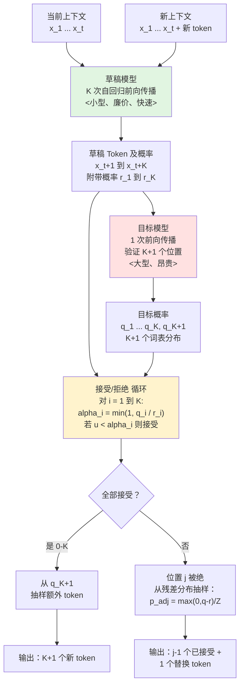
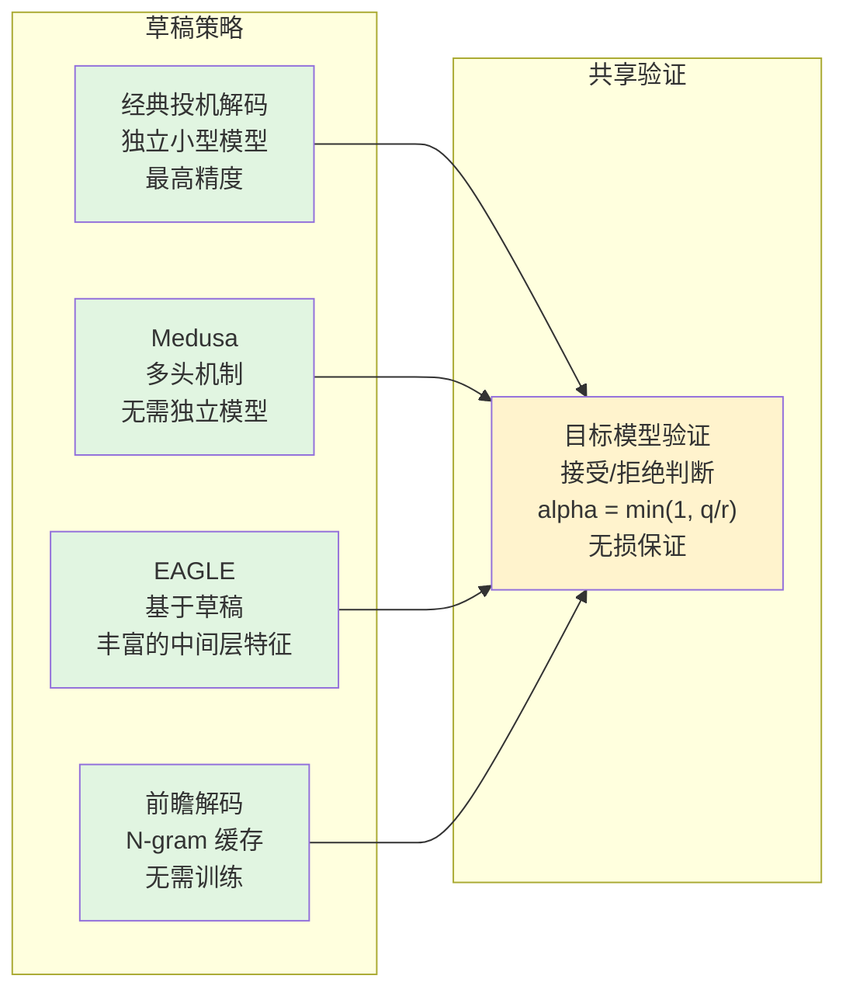

# 第 03 天：投机解码（Speculative Decoding）—— 无损推理加速

> **观看动画演示**：

## 快速参考

| 术语 | 定义 |
|---|---|
| 草稿模型（Draft Model） | 小型模型（速度快 3-10 倍），自回归生成 K 个候选 token |
| 目标模型（Target Model） | 大型模型，在一次前向传播中验证所有 K 个候选 |
| 接受率 $\alpha_i$ | $\alpha_i = \min(1, q_i / r_i)$ 接受第 i 个草稿 token 的概率 |
| K | 每轮生成的草稿 token 数量 |
| 残差分布（Residual Distribution） | $\max(0, q - r) / Z$ —— 当草稿 token 被拒绝时抽样，以保精确分布 |

## 一句话概要

投机解码使用小型草稿模型并行预测 K 个候选 token，然后用大型目标模型在一次前向传播中验证所有 K 个 token，以特定概率接受每个 token，保证输出分布在数学上等同于直接从目标模型采样的结果。

## 为什么重要

自回归语言模型本质上是**内存带宽受限**的，而非计算受限。从 GPU 显存中流式传输权重占据了绝大部分延迟，对单个 token 的隐藏状态进行实际矩阵乘法的计算量却非常小。投机解码通过让廉价的草稿模型猜测下一个 token 是什么，并让目标模型一次性检查所有猜测，将昂贵的目标模型权重流式传输均摊到多个 token 上。这种方法可以实现 **2 到 4 倍的吞吐量提升且零质量损失**，因为输出分布在数学上被严格证明与目标模型完全匹配。

## 架构图



## 数学原理

### 接受概率

对于位置 $i$ 的草稿 token $x_i$，草稿模型分配的概率为 $r_i$，目标模型分配的概率为 $q_i$。接受概率为：

$$\alpha_i = \min\left(1, \frac{q_i}{r_i}\right)$$

包含三种情况：

| 情况 | 条件 | 接受概率 | 含义 |
|---|---|---|---|
| 1 | $q_i > r_i$ | $\alpha_i = 1$ | 目标模型更自信 —— 始终接受 |
| 2 | $q_i \lessapprox r_i$ | $\alpha_i \approx 1$ | 基本一致 —— 几乎总是接受 |
| 3 | $q_i \ll r_i$ | $\alpha_i < 1$ | 草稿过于自信 —— 可能拒绝 |

### 分布精确性证明

核心定理：投机解码产生的输出在分布上**完全等同于**直接从目标模型采样。

当草稿 token $x_i$ 的草稿概率为 $r_i$，以概率 $\alpha_i = \frac{q_i}{r_i}$ 被接受时，有效概率为：

$$P(\text{接受 } x_i) = r_i \cdot \frac{q_i}{r_i} = q_i$$

当被拒绝时，我们从残差分布中抽样：

$$p_{\text{adj}}(x) = \frac{\max\left(0,\; q(x) - r(x)\right)}{Z}$$

归一化常数为：

$$Z = \sum_{x} \max\left(0,\; q(x) - r(x)\right)$$

输出 token $x$ 的总概率为：

$$P(x) = \underbrace{r(x) \cdot \min\left(1, \frac{q(x)}{r(x)}\right)}_{\text{被接受}} + \underbrace{\left(1 - \sum_{y} r(y) \cdot \alpha(y)\right) \cdot \frac{\max(0, q(x) - r(x))}{Z}}_{\text{被拒绝后重新抽样}} = q(x) \quad \blacksquare$$

### 期望接受率与加速比

假设接受率近似为常数 $\alpha$，每轮接受 token 的期望数量为：

$$\mathbb{E}[N_{\text{accepted}}] = \sum_{i=1}^{K} \alpha^i \cdot \alpha^{i-1} = \frac{1 - \alpha^K}{1 - \alpha}$$

每次目标模型前向传播产生的总 token 数为 $\mathbb{E}[N_{\text{accepted}}] + 1$（全部接受时额外产生 1 个 bonus token）。

| 接受率 alpha | K=4: 期望 token 数 | 加速比 |
|---|---|---|
| 0.95 | 6.7 | 6.9x |
| 0.90 | 4.0 | 4.1x |
| 0.80 | 2.9 | 3.1x |
| 0.70 | 2.2 | 2.5x |
| 0.50 | 1.0 | 1.4x |

### 最优 K 值选择

$$K_{\text{optimal}} \approx \frac{-\log(0.1)}{-\log(\alpha)}$$

该公式给出保证至少有一次接受概率达到 90% 的 $K$ 值。

| 草稿质量（alpha） | 0.5 | 0.7 | 0.8 | 0.9 | 0.95 |
|---|---|---|---|---|---|
| 推荐 K | 1-3 | 3-5 | 4-7 | 5-10 | 8-12 |

实践中，$K = 3$ 到 $8$ 是最佳范围：超过该值后，由于拒绝概率的复合效应，收益递减。

## 完整 Python 实现

```python
"""
投机解码（Speculative Decoding）—— 无损推理加速
第 03 天教程 —— Advanced AI Daily
"""

import torch
import torch.nn.functional as F
import numpy as np


def speculative_verify(
    draft_tokens: torch.Tensor,
    draft_probs: torch.Tensor,
    target_logits: torch.Tensor,
    temperature: float = 1.0,
) -> tuple[torch.Tensor, int, int | None]:
    """
    根据目标模型的分布验证草稿 token。

    实现投机解码的核心验证算法，
    保证输出分布在数学上与单独从目标模型抽样完全一致。

    参数:
        draft_tokens: 形状 (K,) 草稿模型生成的 token ID
        draft_probs:  形状 (K,) 草稿模型对自身预测的分配概率
        target_logits: 形状 (K+1, 词表大小) 目标模型的 logits，
                       对应位置 t+1 到 t+K+1
        temperature:   采样温度（默认 1.0）

    返回:
        accepted_tokens: 本轮接受的 token ID
        n_accepted: 接受的草稿 token 数量（0 到 K）
        replacement_token: 若发生拒绝，从残差分布中抽样的替换 token
                          （若全部接受则为 None）
    """
    K = draft_tokens.size(0)

    # 获取带温度缩放的目标概率
    target_probs = F.softmax(target_logits / temperature, dim=-1)  # (K+1, 词表)

    accepted_tokens: list[int] = []
    n_accepted = 0
    replacement_token: int | None = None

    # --- 依次验证每个草稿 token ---
    for i in range(K):
        r_i = draft_probs[i].item()  # 草稿模型对其预测的概率
        q_i = target_probs[i, draft_tokens[i]].item()  # 目标模型对草稿 token 的概率

        # 接受概率: alpha_i = min(1, q_i / r_i)
        alpha_i = min(1.0, q_i / r_i) if r_i > 1e-10 else 0.0

        if torch.rand(1).item() < alpha_i:
            # 接受该 token
            accepted_tokens.append(draft_tokens[i].item())
            n_accepted += 1
        else:
            # 拒绝该 token —— 从残差分布中抽样
            # p_adjusted(x) = max(0, q(x) - r(x)) / Z
            # 其中 r(x) 仅对草稿 token 非零

            r_expanded = torch.zeros_like(target_probs[i])
            r_expanded[draft_tokens[i]] = r_i

            adjusted = torch.clamp(target_probs[i] - r_expanded, min=0.0)
            adjusted_sum = adjusted.sum()

            if adjusted_sum > 1e-10:
                adjusted = adjusted / adjusted_sum
                replacement_token = torch.multinomial(adjusted, 1).item()
            else:
                # 边界情况：直接从目标分布抽样
                replacement_token = torch.multinomial(target_probs[i], 1).item()
            break

    accepted_tensor = torch.tensor(accepted_tokens, dtype=torch.long)
    return accepted_tensor, n_accepted, replacement_token


def speculative_decoding_step(
    draft_model,
    target_model,
    context: torch.Tensor,
    max_draft_length: int = 4,
    temperature: float = 1.0,
) -> tuple[torch.Tensor, int]:
    """
    执行一步投机解码。

    草稿模型自回归生成 max_draft_length 个候选 token，
    然后目标模型在一次前向传播中验证它们。

    参数:
        draft_model: 较小的草稿模型（须支持前向传播并返回 logits）
        target_model: 大型目标模型
        context: 形状 (1, seq_len) 当前 token 序列
        max_draft_length: 最大草稿 token 数量（K）
        temperature: 采样温度

    返回:
        new_tokens: 本轮追加的所有 token（0 到 K+1 个）
        n_accepted: 接受的草稿 token 数量
    """
    draft_tokens_list: list[int] = []
    draft_probs_list: list[float] = []

    current = context.clone()

    # --- 阶段 1：草稿生成（小模型自回归）---
    with torch.no_grad():
        for _ in range(max_draft_length):
            draft_logits = draft_model(current)  # (1, seq, 词表)
            next_logits = draft_logits[0, -1, :]
            next_probs = F.softmax(next_logits / temperature, dim=-1)

            # 从草稿分布中抽样一个 token
            draft_token = torch.multinomial(next_probs, 1)
            draft_prob = next_probs[draft_token].item()

            draft_tokens_list.append(draft_token.item())
            draft_probs_list.append(draft_prob)

            current = torch.cat([current, draft_token.unsqueeze(0)], dim=-1)

    draft_tokens = torch.tensor(draft_tokens_list, dtype=torch.long, device=context.device)
    draft_probs = torch.tensor(draft_probs_list, dtype=torch.float32, device=context.device)

    # --- 阶段 2：目标模型验证（一次大模型前向传播）---
    with torch.no_grad():
        target_input = torch.cat([context, draft_tokens.unsqueeze(0)], dim=-1)
        target_logits = target_model(target_input)  # (1, seq+K, 词表)

        # 提取草稿位置和额外一个位置的 logits
        verify_logits = target_logits[0, -max_draft_length - 1:, :]

    # --- 阶段 3：接受/拒绝 ---
    accepted_tokens, n_accepted, replacement = speculative_verify(
        draft_tokens, draft_probs, verify_logits, temperature
    )

    # --- 构建输出 token ---
    if replacement is not None:
        # 发生拒绝：追加已接受 + 替换 token
        new_tokens = torch.cat([
            accepted_tokens,
            torch.tensor([replacement], device=context.device),
        ])
    else:
        # 全部 K 个接受 + 一个 bonus token
        bonus_logits = verify_logits[-1, :]  # 位置 t+K+1
        bonus_probs = F.softmax(bonus_logits / temperature, dim=-1)
        bonus_token = torch.multinomial(bonus_probs, 1)
        new_tokens = torch.cat([accepted_tokens, bonus_token])

    return new_tokens, n_accepted


class MockModel:
    """
    用于演示投机解码的模拟模型。
    在实际应用中，这些应该是真实的 Transformer 模型。
    """

    def __init__(self, vocab_size: int, hidden_size: int, is_large: bool = True):
        self.vocab_size = vocab_size
        self.hidden_size = hidden_size
        self.is_large = is_large
        self.proj = torch.nn.Linear(hidden_size, vocab_size)

        if is_large:
            print(f"  目标模型：词表 {vocab_size}，隐藏层 {hidden_size}（大型）")
        else:
            print(f"  草稿模型：词表 {vocab_size}，隐藏层 {hidden_size}（小型）")

    def forward(self, token_ids: torch.Tensor) -> torch.Tensor:
        """
        模拟前向传播，将 token 嵌入投影到 logits。
        """
        batch, seq = token_ids.shape
        embeddings = token_ids.unsqueeze(-1).expand(-1, -1, self.hidden_size).float()
        positional_bias = torch.arange(seq, device=token_ids.device).unsqueeze(0).unsqueeze(-1)
        features = embeddings + 0.01 * positional_bias
        return self.proj(features)

    def __call__(self, x: torch.Tensor) -> torch.Tensor:
        return self.forward(x)


# ------------------------------------------------------------------
# 对比测试：标准自回归 vs 投机解码
# ------------------------------------------------------------------
if __name__ == "__main__":
    torch.manual_seed(42)
    np.random.seed(42)

    vocab_size = 1000
    context_tokens = torch.tensor([[1, 2, 3, 4, 5]])

    # 创建不同容量的模拟模型
    print("初始化模型...")
    draft_model = MockModel(vocab_size, hidden_size=64, is_large=False)
    target_model = MockModel(vocab_size, hidden_size=256, is_large=True)
    print()

    K = 4
    n_rounds = 10

    # --- 运行投机解码 ---
    print(f"运行投机解码（K={K}，{n_rounds} 轮）...")
    print("=" * 60)

    context = context_tokens.clone()
    all_spec_tokens: list[int] = []
    total_draft = 0
    total_accepted = 0

    for round_idx in range(n_rounds):
        new_tokens, n_accepted = speculative_decoding_step(
            draft_model, target_model, context,
            max_draft_length=K, temperature=1.0,
        )
        context = torch.cat([context, new_tokens.unsqueeze(0)], dim=-1)
        all_spec_tokens.extend(new_tokens.tolist())

        total_draft += K
        total_accepted += n_accepted

        bonus = 1 if new_tokens.shape[0] > n_accepted else 0
        print(
            f"  第 {round_idx + 1:2d} 轮：草稿 {K} 个，"
            f"接受 {n_accepted}+{bonus} = {new_tokens.shape[0]} 个 token"
        )

    accept_rate = total_accepted / total_draft if total_draft > 0 else 0
    tokens_per_target = len(all_spec_tokens) / n_rounds

    print()
    print("结果统计：")
    print(f"  总草稿 token 数：   {total_draft}")
    print(f"  总接受 token 数：   {total_accepted}")
    print(f"  接受率：            {accept_rate:.1%}")
    print(f"  生成总 token 数：   {len(all_spec_tokens)}")
    print(f"  目标模型调用次数：  {n_rounds} 次"
          f"（标准方式需 {len(all_spec_tokens)} 次）")
    print(f"  每次目标传播产出：  {tokens_per_target:.2f} 个 token")

    # 标准自回归对比
    print()
    print("与标准自回归的对比：")
    print(f"  标准自回归：{len(all_spec_tokens)} 次目标模型前向传播")
    print(f"  投机解码：  {n_rounds} 次目标传播 + {total_draft} 次草稿传播")
    print(f"  草稿模型约为目标的 {256 / 64:.0f} 分之一")
    draft_equiv = total_draft / (256 / 64)
    speedup = len(all_spec_tokens) / (n_rounds + draft_equiv)
    print(f"  估算加速比：{speedup:.2f}x")
```

## 投机解码的变体



| 变体 | 草稿机制 | 接受率 | 是否需要训练 | 分布保证 |
|---|---|---|---|---|
| 经典方法 | 独立小型模型 | 高（70-90%） | 需要蒸馏 | 精确 |
| Medusa | 附加 LM 头 | 中（40-60%） | 训练 K 个头 | 近似 |
| EAGLE | 基于特征的 MLP | （60-85%） | 训练特征网络 | 精确 |
| 前瞻解码 | N-gram 缓存 | 可变（20-80%） | 无 | 精确 |

## 深入解析

### 1. 无损验证的数学本质

投机解码中的拒绝采样机制不是启发式方法——它是精确的数学构造。在每一步中：

- 草稿 token $x$ 以概率 $r(x) \cdot \frac{q(x)}{r(x)} = q(x)$ 被接受，贡献正确的目标概率
- 草稿 token 被拒绝时，残差分布 $\frac{\max(0, q(x) - r(x))}{Z}$ 精确捕获剩余的概率质量

这种分解确保对每个输出 token 都有 $P(x) = q(x)$，意味着生成的序列在统计上与目标模型单独生成的结果不可区分。

### 2. 草稿模型设计原则

一个好的草稿模型必须同时满足三个条件：

- **速度快**：比目标模型快 3-10 倍。如果草稿太慢，减少目标调用次数所节省的时间将被草稿计算消耗殆尽。
- **对齐性好**：草稿的概率估计应与目标模型相关，即使 top-1 token 不同也没关系。高接受率比高 top-1 准确率更重要。
- **校准准确**：过度自信的草稿（给目标模型认为只有 0.1% 的 token 分配 99% 的概率）会破坏接受率。校准良好、略微保守的草稿表现最佳。

| 草稿策略 | 设置成本 | 接受率 | 最佳使用场景 |
|---|---|---|---|
| 蒸馏小型模型 | 中等 | 70-90% | 通用推理，有专用硬件 |
| 同一模型，更少层数 | 低 | 50-70% | 单 GPU，无额外模型存储 |
| N-gram 缓存 | 无 | 20-80% | 重复/模板化生成 |
| Medusa 头 | 低 | 40-60% | 单模型部署限制 |
| EAGLE 特征 | 中等 | 60-85% | 高精度单模型部署 |

### 3. 温度对接受率的影响

温度从根本上改变了接受率的分布：

- **低温度（$\approx 0.1$）**：两个分布都集中在 top-1 token 上。接受变为二元结果——要么完美一致（$\alpha \approx 1$），要么几乎必然拒绝（$\alpha \approx 0$）。加速比方差高。
- **高温度（$\approx 2.0$）**：两个分布都变得平坦。$q(x)/r(x)$ 比值在 token 间更接近 1，但具体 token 的共识度下降。
- **最佳范围（$T = 0.5$ 到 $1.0$）**：足够的集中性使草稿预测有意义，足够的分散性以维持合理的接受率。

## 常见误区

| 误区 | 事实 |
|---|---|
| "投机解码会改变输出分布" | 错误。拒绝采样机制使其在数学上完全精确。 |
| "草稿模型需要非常准确" | 不准确。它需要良好的概率校准，而非高 top-1 准确率。 |
| "K 越大越好" | 不对。超过 K=8 后接受概率复合恶化，且显存开销增大。 |
| "投机解码只能使用独立模型" | Medusa、EAGLE 和前瞻解码都不需要独立模型。 |
| "投机解码在所有场景下都有帮助" | 在计算受限的工作负载（大批量服务）、极短序列或草稿匹配不佳时反而有害。 |

## 练习题

1. **接受率分析**：使用提供的代码以 $K = 1, 2, 4, 8$ 运行，绘制接受率分布图。是否与论预期一致？
2. **温度扫描实验**：系统地将温度从 0.1 调整到 2.0，测量有效加速比。为你的草稿模型找到最优温度。
3. **草稿模型对比**：实现 Medusa 风格的多头草稿（单模型、多输出头），并将其接受率与独立模型方法进行比较。
4. **批量投机解码**：修改实现以在单个批次中处理不同 $K$ 值的多个提示。测量吞吐量改进。
5. **自适应 K**：实现一个机制，根据最近 5 轮观察到的接受率动态调整 $K$。与固定 $K$ 基线比较。

## 扩展阅读

| 论文 | 作者 | 年份 | 核心贡献 |
|---|---|---|---|
| [Fast Inference from Transformers via Speculative Decoding](https://arxiv.org/abs/2211.17192) | Chen 等 | 2022 | 原始投机解码算法及证明 |
| [Medusa: Simple LLM Inference Acceleration](https://arxiv.org/abs/2401.10774) | Cai 等 | 2024 | 多头投机解码方法 |
| [EAGLE: Feature-Based Speculative Sampling](https://arxiv.org/abs/2406.16858) | Li 等 | 2024 | 无需独立模型的基于特征草稿 |
| [Lookahead Decoding](https://arxiv.org/abs/2402.02057) | Fu 等 | 2024 | 基于 N-gram 缓存的解码加速 |
| [Speculative Decoding: A Survey](https://arxiv.org/abs/2409.15385) | 多位作者 | 2024 | 全面综述各类方法 |

---

上一篇: [第 02 天：混合专家模型（MoE）](02-mixture-of-experts.md)  |  下一篇: [第 04 天：测试时计算（Test-Time Compute）](04-test-time-compute.md)_
