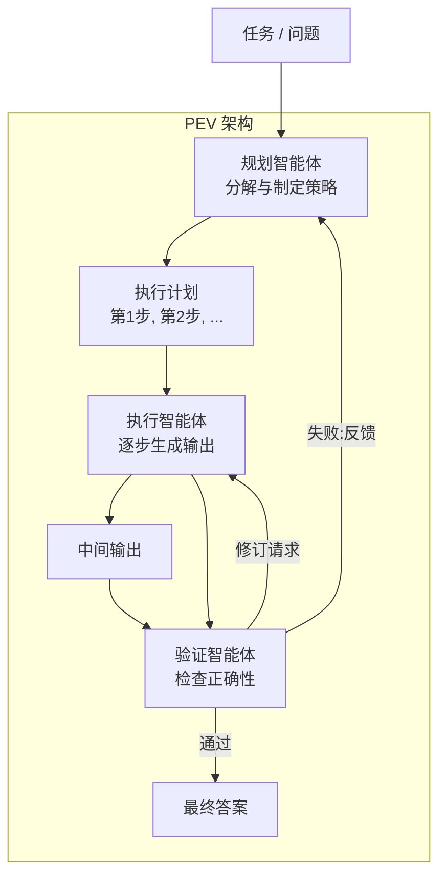
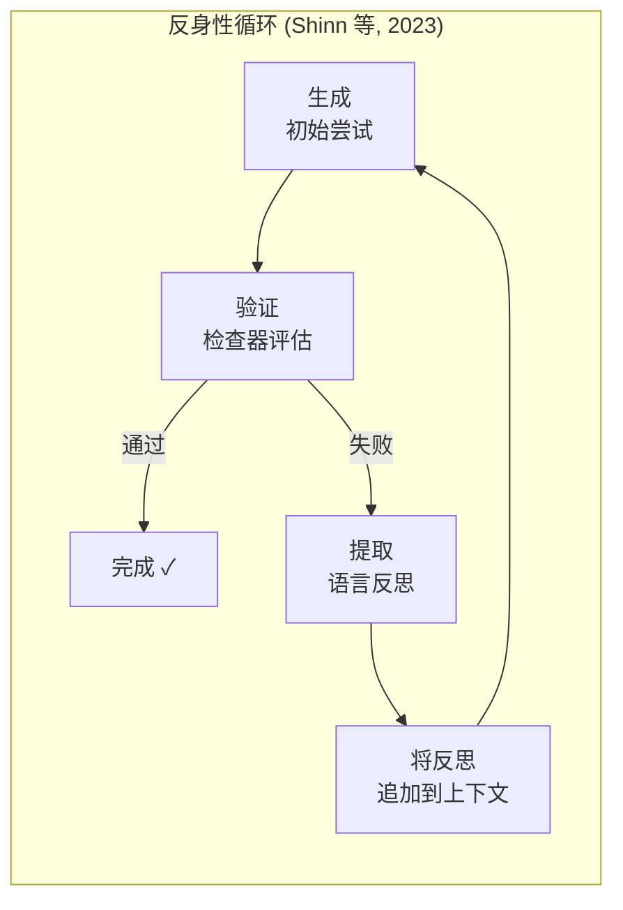
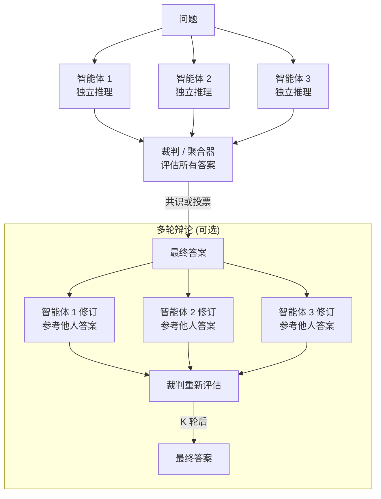
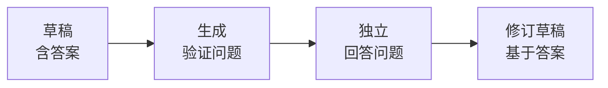

# Day 05: 多智能体反思 -- 规划-执行-验证、反身性与辩论

> **观看动画**: <video src="https://raw.githubusercontent.com/Playitcooool/advanced-ai-daily/main/videos/05-multi-agent-reflection.webm" autoplay loop muted playsinline width="800"></video>

---

## 一句话摘要

多智能体反思将认知劳动分配给专业化的智能体 -- 规划者分解任务、执行者生成输出、验证者检查正确性、辩论系统解决分歧 -- 在复杂推理任务上取得比单一智能体更高的准确率，其架构包括反身性（Shinn 等，2023）、MetaGPT（Hong 等，2023）和验证链（Dhuliawala 等，2023）。

---

<video src="https://raw.githubusercontent.com/Playitcooool/advanced-ai-daily/main/videos/05-multi-agent-reflection.webm" autoplay loop muted playsinline width="800"></video>


## 为什么这很重要

### 单智能体的局限

单一 LLM 必须同时生成、批评和修订自己的输出。这会产生三个根本性问题：

1. **自我偏见**：模型很难发现自己推理中的错误，因为同一个生成过程既产生了答案，又产生了批评。
2. **角色混淆**：一个提示词试图覆盖规划、执行和验证，不可避免地会在每个功能上做出妥协。
3. **误差累积**：没有独立的检查点，幻觉和逻辑错误会在整个流程中不受控制地传播。

### 多智能体的核心洞察

多智能体反思提出：*我们能否将不同的认知角色分配给独立的智能体，每个智能体拥有聚焦的系统提示词和独立的推理路径，从而获得更好的结果？*

答案是强烈的肯定。通过将生成与评估分离，并引入智能体之间的对抗性辩论，我们创建了一个能捕获单一模型会错过的错误的系统，能更仔细地规划，并生成更健壮、更可验证的输出。

---

## 架构走查



---

## 反身性架构



### 关键设计决策

| 决策 | 选项 | 权衡 |
|---|---|---|
| 同一模型 vs 不同模型 | 相同 LLM 不同提示词，或不同 LLM | 不同模型产生更多样化的批评，但成本更高 |
| 共享记忆 | 所有智能体访问共享上下文，或通过控制器传递消息 | 共享记忆 = 更丰富的上下文但消耗更多 token |
| 终止条件 | 固定轮数、达成共识或置信度阈值 | 共识 = 更好的质量但有陷入无限循环的风险 |
| 失败记忆 | 存储批评历史供未来使用，或每次都重新开始 | 历史记录防止重蹈覆辙，但增加延迟 |

---

## 辩论架构



### PEV vs 辩论比较

| 维度 | PEV | 辩论 |
|---|---|---|
| 结构 | 顺序流水线（规划 → 执行 → 验证） | 并行生成 + 聚合 |
| 智能体角色 | 明确且不对称 | 对称，所有智能体扮演相同角色 |
| 最佳用途 | 需要规划的复杂多步骤任务 | 适合需要多元观点的问题 |
| 计算模式 | 顺序智能体，每个依赖前一个 | 并行智能体，然后聚合 |
| 错误恢复 | 验证者反馈给规划者 | 裁判选择最佳答案，或智能体修订 |
| 关键论文 | MetaGPT (2308.00352) | LLM 辩论 (2305.14333) |

---

## 验证链 (CoVe)



验证链（Dhuliawala 等，2023）遵循四个步骤：

1. **生成草稿**：可能包含事实性错误的初始回答。
2. **规划验证问题**：检查草稿中每个声明的问题。
3. **执行验证**：独立于草稿回答每个问题（防止模型只是重复自己的幻觉）。
4. **生成修订版回答**：整合验证结果。

这在减少幻觉方面特别有效，因为步骤 3 迫使模型独立验证声明，而不是从相同的错误推理路径重新推导。

---

## 数学公式

### 反身性奖励模型

反身性可以形式化为一个策略改进循环，其中策略基于累积的反思历史：

$$
\pi_\theta(a_t \mid s_t, h_t) \quad \text{其中} \quad h_t = \{r_1, r_2, \ldots, r_{t-1}\}
$$

每次反思 $r_t$ 是失败信号的函数：

$$
r_t = \text{Reflect}(s_t, a_t, \text{feedback}_t)
$$

### 轮次期望改进

如果每轮的接受率为 $p$（验证者通过的概率），则直到被接受的期望轮数服从几何分布：

$$
E[\text{轮数}] = \frac{1}{p}
$$

对于辩论中的 $m$ 个独立智能体和多数投票（要求 $> m/2$ 同意），假设每个智能体的独立准确率为 $a$，则最终正确答案的概率为：

$$
P(\text{正确}) = \sum_{k=\lfloor m/2 \rfloor + 1}^{m} \binom{m}{k} a^k (1-a)^{m-k}
$$

对于 $m=3$ 和 $a=0.7$：

$$
P(\text{正确}) = \binom{3}{2}(0.7)^2(0.3)^1 + \binom{3}{3}(0.7)^3(0.3)^0 = 3 \cdot 0.49 \cdot 0.3 + 0.343 = 0.441 + 0.343 = 0.784
$$

多数投票将准确率从 70% 提升到 78.4%。

### 信息论优势

最终答案与真实值之间的互信息随着智能体多样性的增加而增加：

$$
I(Y_{\text{final}}; Y^*) \geq \max_i I(Y_i; Y^*) \quad \text{当智能体具有不相关误差时}
$$

这表明多样化智能体（不相关误差）比任何单一智能体提供更多关于真实答案的信息。

---

## Python 代码实现

```python
import numpy as np
from dataclasses import dataclass, field
from typing import Optional


@dataclass
class AgentMessage:
    """多智能体系统中智能体之间传递的消息。"""
    sender: str
    content: str
    metadata: dict = field(default_factory=dict)


AgentFn = callable  # 智能体函数的类型别名


class ReflexionAgent:
    """
    实现反身性架构 (Shinn 等, 2023)。

    在生成和自我反思之间交替进行，
    在上下文中累积语言反思以改进未来的尝试。

    论文: arXiv:2303.11366
    """

    def __init__(
        self,
        generator: AgentFn,
        reflector: AgentFn,
        verifier: AgentFn,
        max_rounds: int = 5,
    ):
        """
        初始化反身性智能体。

        Args:
            generator: 函数(prompt, context) -> str, 生成一次尝试。
            reflector: 函数(prompt, attempt, feedback) -> str, 产生反思。
            verifier: 函数(prompt, attempt) -> tuple[bool, str], 检查正确性。
            max_rounds: 最大反思轮数。
        """
        self.generator = generator
        self.reflector = reflector
        self.verifier = verifier
        self.max_rounds = max_rounds

    def run(self, prompt: str) -> tuple[str, list[str]]:
        """
        运行反身性循环。

        Args:
            prompt: 输入问题或任务。

        Returns:
            final_answer: 被接受的答案字符串。
            reflections: 所有生成的反思列表。
        """
        context: list[str] = []
        reflections: list[str] = []

        for round_num in range(self.max_rounds):
            # 生成尝试
            context_block = "\n".join(context)
            attempt = self.generator(prompt, context_block)

            # 验证
            passed, feedback = self.verifier(prompt, attempt)

            if passed:
                return attempt, reflections

            # 反思并累积失败记忆
            reflection = self.reflector(prompt, attempt, feedback)
            reflections.append(reflection)
            context.append(f"反思 {round_num + 1}: {reflection}")

        # 如果没有通过任何轮次，返回最后一次尝试
        return attempt, reflections


class PEVSystem:
    """
    规划-执行-验证多智能体架构。

    将任务分解为计划，执行每一步，验证结果，并在失败时回环。

    受 MetaGPT (arXiv:2308.00352) 启发。
    """

    def __init__(
        self,
        planner: AgentFn,
        executor: AgentFn,
        verifier: AgentFn,
        max_retries: int = 3,
    ):
        """
        初始化 PEV 系统。

        Args:
            planner: 函数(task) -> list[str], 生成分步计划。
            executor: 函数(task, plan, current_step, previous_outputs) -> str,
                      执行一个步骤。
            verifier: 函数(task, plan, outputs) -> tuple[bool, str],
                      检查最终结果。
            max_retries: 规划-执行-验证循环的最大重试次数。
        """
        self.planner = planner
        self.executor = executor
        self.verifier = verifier
        self.max_retries = max_retries

    def run(self, task: str) -> tuple[str, dict]:
        """
        运行 PEV 流水线。

        Args:
            task: 要解决的问题。

        Returns:
            final_output: 已验证的结果。
            trace: 包含计划、输出和验证历史的字典。
        """
        trace: dict = {
            "plans": [],
            "outputs": [],
            "verifications": [],
        }

        for attempt in range(self.max_retries):
            # 步骤 1: 规划
            plan = self.planner(task)
            trace["plans"].append(plan)

            # 步骤 2: 执行每一步
            outputs: list[str] = []
            for step_idx, step in enumerate(plan):
                step_output = self.executor(
                    task, plan, step_idx, outputs
                )
                outputs.append(step_output)
            trace["outputs"].append(outputs)

            # 步骤 3: 验证
            passed, feedback = self.verifier(task, plan, outputs)
            trace["verifications"].append({"passed": passed, "feedback": feedback})

            if passed:
                return "\n".join(outputs), trace

            # 如果失败，将验证者反馈回规划者

        # 返回最后一次尝试，即使未通过验证
        return "\n".join(outputs), trace


class DebateSystem:
    """
    多智能体辩论系统。

    多个智能体独立生成答案，裁判聚合它们，
    智能体可以基于他人的答案进行修订。

    论文: arXiv:2305.14333 (LLM 辩论改进推理)
    """

    def __init__(
        self,
        agents: list[AgentFn],
        judge: callable,
        num_rounds: int = 2,
        voting: str = "majority",
    ):
        """
        初始化辩论系统。

        Args:
            agents: 智能体函数列表，每个函数(prompt, debate_history) -> str。
            judge: 函数(answers) -> str, 选择或合成最终答案。
            num_rounds: 辩论轮数（1 = 单轮，>1 = 多轮）。
            voting: 聚合策略 -- 'majority' (多数) 或 'best' (最佳)。
        """
        self.agents = agents
        self.judge = judge
        self.num_rounds = num_rounds
        self.voting = voting

    def run(self, prompt: str) -> tuple[str, list[list[str]]]:
        """
        运行辩论系统。

        Args:
            prompt: 问题或任务。

        Returns:
            final_answer: 裁判选定或合成的答案。
            all_rounds: 轮次列表，每轮是智能体答案的列表。
        """
        debate_history: list[str] = []
        all_rounds: list[list[str]] = []

        for round_num in range(self.num_rounds):
            round_answers: list[str] = []

            for agent_idx, agent in enumerate(self.agents):
                agent_answer = agent(prompt, debate_history)
                round_answers.append(agent_answer)

            all_rounds.append(round_answers)

            # 更新辩论历史供下一轮使用
            for idx, answer in enumerate(round_answers):
                debate_history.append(f"智能体 {idx} (第 {round_num + 1} 轮): {answer}")

        # 最终裁决
        final_answer = self.judge(all_rounds[-1])
        return final_answer, all_rounds


class ChainOfVerification:
    """
    验证链系统。

    生成草稿，规划验证问题，独立回答它们，然后修订。

    论文: arXiv:2309.11495
    """

    def __init__(
        self,
        drafter: AgentFn,
        question_planner: AgentFn,
        question_answerer: AgentFn,
        reviser: AgentFn,
    ):
        """
        初始化验证链。

        Args:
            drafter: 函数(prompt) -> str, 生成初始草稿。
            question_planner: 函数(draft) -> list[str], 生成验证问题。
            question_answerer: 函数(question) -> str, 独立回答问题。
            reviser: 函数(draft, questions_and_answers) -> str, 修订草稿。
        """
        self.drafter = drafter
        self.question_planner = question_planner
        self.question_answerer = question_answerer
        self.reviser = reviser

    def run(self, prompt: str) -> tuple[str, dict]:
        """
        运行验证链流水线。

        Args:
            prompt: 输入问题。

        Returns:
            final_answer: 已修订、已验证的答案。
            trace: 验证轨迹。
        """
        # 步骤 1: 生成草稿
        draft = self.drafter(prompt)

        # 步骤 2: 规划验证问题
        questions = self.question_planner(draft)

        # 步骤 3: 独立回答每个问题
        qa_pairs: list[dict] = []
        for q in questions:
            answer = self.question_answerer(q)
            qa_pairs.append({"question": q, "answer": answer})

        # 步骤 4: 基于验证进行修订
        revised = self.reviser(draft, qa_pairs)

        trace = {
            "draft": draft,
            "verification_questions": questions,
            "qa_pairs": qa_pairs,
            "revised": revised,
        }

        return revised, trace


# ------------------------------------------------------------------
# 示例用法 -- 使用模拟智能体
# ------------------------------------------------------------------
if __name__ == "__main__":

    # ---- 反身性的模拟智能体 ----
    def mock_generator(prompt: str, context: str) -> str:
        if context:
            return "答案是 42（经过反思后修订）。"
        return "答案是 41。"

    def mock_reflector(prompt: str, attempt: str, feedback: str) -> str:
        return f"'{attempt}' 中的错误：差 1。需要检查边界条件。"

    def mock_verifier(prompt: str, attempt: str) -> tuple[bool, str]:
        if "42" in attempt:
            return True, "正确。"
        return False, f"不正确。得到 '{attempt}'。"

    agent = ReflexionAgent(
        generator=mock_generator,
        reflector=mock_reflector,
        verifier=mock_verifier,
        max_rounds=5,
    )
    answer, reflections = agent.run("6 × 7 等于多少？")
    print(f"反身性最终答案: {answer}")
    print(f"反思列表: {reflections}")
    print()

    # ---- 辩论的模拟智能体 ----
    def mock_agent_1(prompt: str, history: list[str]) -> str:
        return "答案 A: 42"

    def mock_agent_2(prompt: str, history: list[str]) -> str:
        return "答案 B: 42"

    def mock_agent_3(prompt: str, history: list[str]) -> str:
        return "答案 C: 43"

    def mock_judge(answers: list[str]) -> str:
        # 简单多数投票
        from collections import Counter
        stripped = [a.split(": ")[1] if ": " in a else a for a in answers]
        counts = Counter(stripped)
        return counts.most_common(1)[0][0]

    debate = DebateSystem(
        agents=[mock_agent_1, mock_agent_2, mock_agent_3],
        judge=mock_judge,
        num_rounds=2,
        voting="majority",
    )
    final, rounds = debate.run("6 × 7 等于多少？")
    print(f"辩论最终答案: {final}")
    print(f"第 1 轮答案: {rounds[0]}")
    print(f"第 2 轮答案: {rounds[1]}")
    print()

    # ---- 验证链 ----
    def mock_drafter(prompt: str) -> str:
        return "法国的首都是伦敦。"

    def mock_question_planner(draft: str) -> list[str]:
        return ["法国的首都是什么？"]

    def mock_question_answerer(question: str) -> str:
        if "法国的首都" in question:
            return "巴黎"
        return "未知"

    def mock_reviser(draft: str, qa_pairs: list[dict]) -> str:
        for qa in qa_pairs:
            draft = draft.replace("伦敦", qa["answer"])
        return draft

    cove = ChainOfVerification(
        drafter=mock_drafter,
        question_planner=mock_question_planner,
        question_answerer=mock_question_answerer,
        reviser=mock_reviser,
    )
    revised, trace = cove.run("法国的首都是什么？")
    print(f"CoVe 最终答案: {revised}")
    print(f"草稿为: {trace['draft']}")
```

---

## 深度分析

### "盲点"问题

单一 LLM 具有连贯但系统性的偏见。当被要求批评自己的答案时，它经常：
- 无法发现自己的错误（自我一致但错误）。
- 幻想不存在的问题。
- 对自己的推理过于宽容。

一个**独立的批评智能体**，尤其是具有不同系统提示词或不同模型变体的智能体，不共享相同的推理路径，因此能捕获不同类型的错误。

### 智能体通信模式

| 模式 | 拓扑 | 优点 | 缺点 |
|---|---|---|---|
| 流水线 | A → B → C | 简单、确定 | 无循环、脆弱 |
| 星型 | 中心连接所有智能体 | 集中控制 | 中心是瓶颈 |
| 网状 | 所有智能体通信 | 最大信息共享 | O(n²) 消息量 |
| 树型 | 分层委派 | 扩展性好、自然委派 | 根节点可能成为瓶颈 |

### 成本与质量的权衡

多智能体系统以延迟和成本换取输出质量。决定使用多智能体还是单智能体应基于：
- **任务复杂度**：多步骤、高风险任务受益最多。
- **错误容忍度**：低容忍领域（医疗、法律、金融）受益于验证。
- **延迟预算**：每个智能体增加一次完整的 LLM 调用，延迟成倍增加。
- **智能体多样性收益**：如果智能体过于相似，收益会迅速递减。

---

## 常见误区

| 误区 | 现实 |
|---|---|
| "智能体越多 = 总是更好" | 超过约 5 个智能体后，边际收益递减；多样性比数量更重要 |
| "任何 LLM 都可以作为智能体" | 智能体角色需要特定的提示词；并非所有模型在规划、生成和批评方面同样出色 |
| "多智能体消除了幻觉" | 多智能体减少但不消除幻觉；验证者也可能产生幻觉 |
| "辩论总能达成共识" | 智能体可能强化共享偏见；结构化的辩论规则至关重要 |
| "反身性需要训练" | 原始反身性仅使用提示词；不需要微调 |

---

## 练习

1. **为代码生成实现反身性循环**：构建一个反身性智能体，其中验证者在沙盒中运行生成的代码，反思者分析错误消息。测量修复语法错误和逻辑错误各需要多少轮。

2. **构建数学应用题的 PEV 系统**：规划者分解问题，执行者解决每个子问题，验证者检查单位、范围和逻辑一致性。与一次性 LLM 比较准确率。

3. **实验辩论轮数**：实现具有 1、2、3 和 5 轮的辩论系统。跟踪答案质量如何随轮数变化。质量是趋于饱和还是持续改善？

4. **跨模型辩论**：为辩论角色分配不同模型（如 GPT-4o、Claude 3.5、LLaMA 3）。模型多样性能提高辩论质量，还是会引发通信中断？

5. **CoVe 与反身性比较**：在同一个 QA 数据集上同时实现验证链和反身性。哪种方法在减少幻觉方面更有效？每种方法何时失效？

---

## 参考文献

| 论文 | arXiv | 关键贡献 |
|---|---|---|
| Reflexion: Language Agents with Verbal Reinforcement Learning | 2303.11366 | 带有语言反馈累积的自我反思循环 |
| MetaGPT: Meta Programming for Multi-Agent Collaborative Framework | 2308.00352 | PEV 风格的多智能体软件开发 |
| LLM Debates: Improving Reasoning through Multi-Agent Discussion | 2305.14333 | 多智能体辩论提高推理准确率 |
| Chain-of-Verification: Reducing Hallucination in LLMs | 2309.11495 | 通过独立问答进行自我验证 |

---

## 导航

[[Day 04: 测试时计算]](04-test-time-compute.md) | **Day 05: 多智能体反思** | [[Day 06: 量化]](06-quantization.md)
