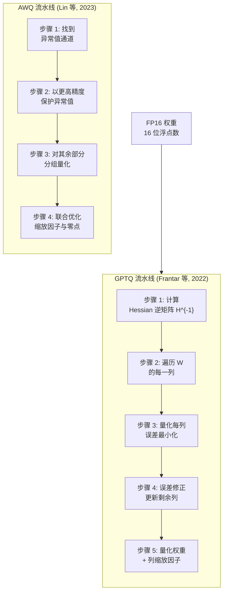
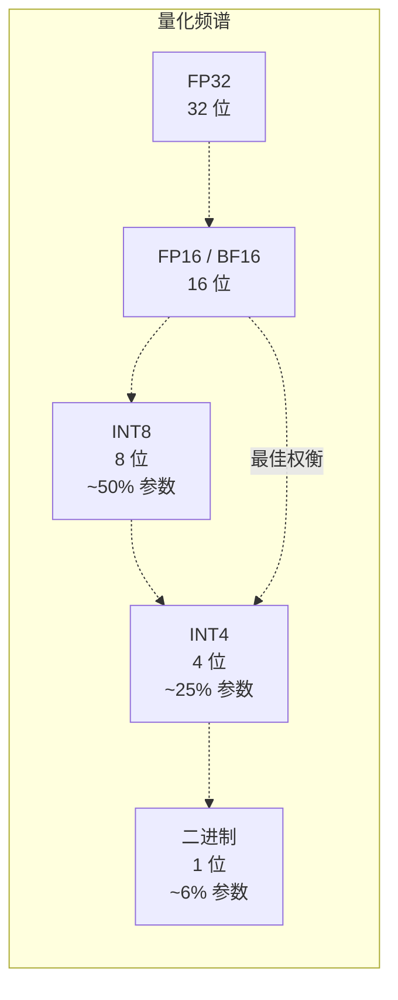

# Day 06: 量化 -- GPTQ、AWQ、分组量化与 1-bit 大模型

> **观看动画**: <video src="https://raw.githubusercontent.com/Playitcooool/advanced-ai-daily/main/videos/06-quantization.webm" autoplay loop muted playsinline width="800"></video>

---

## 一句话摘要

量化使用 GPTQ（2210.17323）和 AWQ（2306.00978）等精密算法将模型权重和激活值从 16 位浮点数压缩到 8 位、4 位甚至 1 位整数，通过分组缩放、异常值感知量化和量化感知训练，使大型模型能够在消费级硬件上以最小的质量损失运行。

---

## 为什么这很重要

### 内存瓶颈

现代 LLM 在推理过程中主要是内存受限。一个 70B 参数模型在 FP16 下需要 140 GB 显存 -- 远超单个消费级 GPU 的能力。在每个 token 生成步骤中从内存加载这些权重占据了推理时间的主体。单 token 前向传递的计算密度极低：用 (1 x d_model) 向量乘以 (d_model x d_model) 权重矩阵需要 2*d_model^2 FLOPs，但必须读取 2*d_model^2 字节的权重。GPU 大部分时间都在等待数据，而非计算。

### 量化的核心洞察

量化提出：*我们能否用更少的位数表示 16 位浮点权重，而不会显著降低模型质量？*

答案是肯定的，但朴素方法（用单一缩放因子均匀量化所有权重）会失败，因为权重分布不是均匀的。现代方法通过以下方式实现：
1. **分组量化**：不同权重组获得不同的缩放因子，容纳不同的分布
2. **异常值感知量化**：保护最具影响力的权重免受量化误差影响（AWQ）
3. **二阶修正**：使用 Hessian 信息在层间最优分配量化误差（GPTQ）
4. **量化感知训练**：在量化形式下微调模型，使其学会补偿量化噪声

---

## 架构走查





---

## 数学公式

### 均匀量化

最简单的量化形式将连续范围 [a, b] 映射到 N 个离散级别：

$$
q = \text{clip}\left(\left\lfloor \frac{x - a}{s} + 0.5 \right\rfloor, 0, N-1\right)
$$

$$
\hat{x} = s \cdot q + a \quad \text{其中} \quad s = \frac{b - a}{N - 1}
$$

量化误差的上界为 $|x - \hat{x}| \leq s/2$。步长 $s$ 越小（$N$ 越大），误差越小。

### 非对称（仿射）量化

更常见的做法是使用带缩放因子和零点的仿射映射：

$$
q = \text{clip}\left(\left\lfloor \frac{x}{s} + z \right\rceil, q_{\min}, q_{\max}\right)
$$

$$
\hat{x} = s \cdot (q - z)
$$

其中：
- $s$：缩放因子（$s > 0$）
- $z$：零点（通常为整数，确保 0.0 精确映射到一个整数量化值）
- $q_{\min}, q_{\max}$：量化最小/最大值（例如 INT8 为 -128 和 127）

### 分组量化

分组量化不是为整个权重矩阵分配单一缩放因子，而是将权重分为大小为 $g$ 的组（通常 $g = 64$ 或 $128$），并为每组分配独立的缩放因子：

$$
s_g = \frac{\max(|W_g|) - \min(|W_g|)}{N - 1}
$$

$$
\hat{W}_{i,j} = s_{\lfloor j/g \rfloor} \cdot \left(q_{i,j} - z_{\lfloor j/g \rfloor}\right)
$$

这至关重要，因为权重矩阵的不同列通常具有截然不同的量级。单一全局缩放因子会被最大的异常值支配，导致大多数权重被压缩到少数量化区间中。

### GPTQ：二阶误差修正

GPTQ 的关键创新是使用损失函数的 Hessian（二阶导数）来指导量化决策。对于权重矩阵 $W$ 和输入数据 $X$：

$$
H = 2XX^\top + \lambda I \quad \text{(Fisher 信息 / Hessian)}
$$

$$
L(W) = \|WX - \hat{W}X\|^2_F
$$

每列的最优量化最小化以下目标：

$$
\min_q \sum_{j} (w_j - \hat{w}_j)^\top H (w_j - \hat{w}_j)
$$

GPTQ 按列顺序处理，量化第 $j$ 列后，更新所有剩余列以补偿：

$$
w_k \leftarrow w_k - \frac{H^{-1}_{:,j} [H^{-1}]_{j,j}}{[H^{-1}]_{jj}} (w_j - \hat{w}_j)
$$

这等价于求解一个加权最小二乘问题，其中权重矩阵是逆 Hessian，因此曲率较高（对损失更重要）的列会获得更小的量化误差。

### AWQ：异常值感知量化

激活感知权重量化观察到，只有约 1% 的权重通道（线性层中约 1/128 行）是"异常值" -- 它们对应于具有异常大的幅值且对输出质量有不成比例大影响的激活通道。AWQ 以更高的精度保护这些异常值通道：

$$
W'_{i,j} = W_{i,j} \cdot s_j \quad \text{其中} \quad s_j = \begin{cases}
s_{\text{scale}} & \text{如果通道 } j \text{ 是异常值} \\
1 & \text{否则}
\end{cases}
$$

通过网格搜索找到缩放因子 $s_j$ 以最小化输出重建误差：

$$
\min_{s} \|WX - (W' \oslash S)(SX)\|_F^2
$$

这种权重-激活联合优化意味着 AWQ 可以实现匹敌甚至超过朴素 INT8 的 INT4 质量。

### 量化噪声信噪比

具有方差 $\sigma^2$ 和步长 $s$ 的信号均匀量化的信噪比：

$$
\text{SNR}_{\text{dB}} \approx 6.02 \cdot b + 1.76 \quad \text{其中} \quad b = \log_2 N
$$

$$
\text{FP16 (15.5 有效位): ~94 dB} \quad \text{INT8: ~50 dB} \quad \text{INT4: ~26 dB}
$$

尽管 INT4 损失了 68 dB，LLM 仍然具有惊人的弹性，因为：
1. 跨层的冗余掩盖了单独的权重噪声
2. 只有特定通道是关键（AWQ 保护的"异常值"通道）
3. 模型可以在量化后进行微调以适应

---

## 量化格式

| 格式 | 位 | 级别数 | 内存 (70B 模型) | 典型用途 |
|---|:---:|:---:|:---:|---|
| FP32 | 32 | 43 亿 | 280 GB | 训练 |
| FP16 / BF16 | 16 | 65,536 | 140 GB | 训练、高质量推理 |
| INT8 | 8 | 256 | 70 GB | 服务、最小质量损失 |
| INT4 (GPTQ) | 4 | 16 | 35 GB | 本地 LLM (7B-13B 默认) |
| INT4 (AWQ) | 4 | 16 | 35 GB | 接近 FP16 质量 |
| 1-bit | 1 | 2 | ~10 GB | Bonsai / TurboQuant |

---

## Python 代码实现

```python
import torch
import torch.nn as nn
import torch.nn.functional as F
import numpy as np


# ------------------------------------------------------------------
# 1. 均匀量化
# ------------------------------------------------------------------

def asymmetric_quantize(
    x: torch.Tensor, bits: int = 8
) -> tuple[torch.Tensor, torch.Tensor, torch.Tensor]:
    """
    非对称（仿射）均匀量化。

    使用学习到的缩放因子和零点将浮点值映射为量化整数。

    Args:
        x: 任意形状的输入张量（FP32 或 FP16）。
        bits: 量化位数。

    Returns:
        q: 量化整数张量。
        scale: 每张量缩放因子。
        zero_point: 每张量零点偏移。
    """
    qmin = -(2 ** (bits - 1))
    qmax = 2 ** (bits - 1) - 1

    x_min, x_max = x.min().item(), x.max().item()

    if x_max == x_min:
        return x.long(), torch.tensor(1.0), torch.tensor(0)

    scale = (x_max - x_min) / (qmax - qmin)
    zero_point = qmin - x_min / scale
    zero_point = round(zero_point)
    zero_point = max(qmin, min(qmax, zero_point))

    q = (x / scale + zero_point).round()
    q = q.clamp(qmin, qmax)

    return q.long(), torch.tensor(scale), torch.tensor(zero_point)


def asymmetric_dequantize(
    q: torch.Tensor, scale: torch.Tensor, zero_point: torch.Tensor
) -> torch.Tensor:
    """
    反量化回浮点数。

    Args:
        q: 量化整数张量。
        scale: 量化时的缩放因子。
        zero_point: 量化时的零点。

    Returns:
        dequantized: 重建的浮点张量。
    """
    return scale * (q.float() - zero_point)


# ------------------------------------------------------------------
# 2. 分组量化
# ------------------------------------------------------------------

def per_group_quantize(
    x: torch.Tensor, bits: int = 4, group_size: int = 64
) -> tuple[torch.Tensor, torch.Tensor, torch.Tensor]:
    """
    分组非对称量化。

    输入张量沿最后一个维度被分为多个组，
    每组获得独立的缩放因子和零点。

    Args:
        x: 输入张量，最后一个维度必须能被 group_size 整除。
        bits: 量化位数。
        group_size: 每个量化的组大小。

    Returns:
        q: 量化张量（与 x 相同形状）。
        scales: 缩放因子，形状 (..., num_groups)。
        zero_points: 零点，形状 (..., num_groups)。
    """
    assert x.shape[-1] % group_size == 0, (
        f"最后一个维度 {x.shape[-1]} 不能被 group_size {group_size} 整除"
    )

    qmin = -(2 ** (bits - 1))
    qmax = 2 ** (bits - 1) - 1

    original_shape = x.shape
    num_groups = x.shape[-1] // group_size
    x_grouped = x.view(-1, group_size)

    x_min = x_grouped.min(dim=-1, keepdim=True)[0]
    x_max = x_grouped.max(dim=-1, keepdim=True)[0]

    scale = (x_max - x_min) / (qmax - qmin)
    scale = scale.clamp(min=1e-8)

    zero_point = qmin - x_min / scale
    zero_point = zero_point.round().clamp(qmin, qmax)

    q = (x_grouped / scale + zero_point).round().clamp(qmin, qmax)
    q = q.view(*original_shape)
    scales = scale.view(*original_shape[:-1], num_groups)
    zero_points = zero_point.view(*original_shape[:-1], num_groups)

    return q.long(), scales, zero_points


def per_group_dequantize(
    q: torch.Tensor,
    scales: torch.Tensor,
    zero_points: torch.Tensor,
    group_size: int = 64,
) -> torch.Tensor:
    """
    反量化分组量化张量。

    Args:
        q: 量化张量。
        scales: 组缩放因子，形状与 q 匹配但最后维度是 num_groups。
        zero_points: 组零点，形状与 scales 匹配。
        group_size: 每组元素数量。

    Returns:
        dequantized: 重建的浮点张量。
    """
    num_groups = q.shape[-1] // group_size

    scales_expanded = scales.repeat_interleave(group_size, dim=-1)
    zero_points_expanded = zero_points.repeat_interleave(group_size, dim=-1)

    return scales_expanded * (q.float() - zero_points_expanded)


# ------------------------------------------------------------------
# 3. GPTQ 风格量化（简化的单层）
# ------------------------------------------------------------------

class GPTQQuantizer:
    """
    简化的单层 GPTQ 量化器。

    实现 GPTQ 核心思想：使用逆 Hessian 矩阵（从校准数据中近似）
    指导每列量化并进行二阶误差修正。

    论文: arXiv:2210.17323
    """

    def __init__(self, weight_shape: tuple[int, int], group_size: int = 128, bits: int = 4):
        """
        初始化 GPTQ 量化器。

        Args:
            weight_shape: 权重矩阵的 (out_features, in_features)。
            group_size: 量化组大小。
            bits: 量化位数。
        """
        self.out_features, self.in_features = weight_shape
        self.group_size = group_size
        self.bits = bits
        self.qmin = -(2 ** (bits - 1))
        self.qmax = 2 ** (bits - 1) - 1

        self.H = torch.zeros((self.in_features, self.in_features), dtype=torch.float64)
        self.n_samples = 0

    def add_batch(self, inp: torch.Tensor):
        """
        累积校准数据用于 Hessian 估计。

        Args:
            inp: 校准输入，形状 (n_samples, in_features)。
        """
        inp = inp.double()
        if inp.ndim == 2:
            inp = inp.unsqueeze(0)

        self.H += inp.shape[0] * (inp.squeeze(0).T @ inp.squeeze(0))
        self.n_samples += inp.shape[0]

    def quantize(self, W: torch.Tensor) -> torch.Tensor:
        """
        使用 GPTQ 算法量化权重矩阵 W。

        Args:
            W: 权重矩阵，形状 (out_features, in_features)。

        Returns:
            W_q: 量化后的权重矩阵（仍为浮点数用于显示）。
        """
        assert self.n_samples > 0, "未添加校准数据。"

        H = self.H.clone()
        damp = 0.01 * torch.diag(H).mean()
        H += damp * torch.eye(H.shape[0], device=H.device, dtype=H.dtype)

        try:
            L = torch.linalg.cholesky(H)
            H_inv = torch.cholesky_inverse(L)
        except torch.linalg.LinAlgError:
            H_inv = torch.linalg.pinv(H)

        W = W.double().clone()
        W_q = W.clone()

        for i in range(self.in_features):
            w_i = W[:, i].clone()

            group_id = i // self.group_size
            group_start = group_id * self.group_size
            group_end = min(group_start + self.group_size, self.in_features)
            w_group = W[:, group_start:group_end].view(-1)

            gmin, gmax = w_group.min(), w_group.max()
            scale = (gmax - gmin) / (self.qmax - self.qmin)
            if scale < 1e-8:
                scale = torch.tensor(1e-8)
            zp = (gmin / scale).round().clamp(self.qmin, self.qmax)

            q_i = (w_i / scale + zp).round().clamp(self.qmin, self.qmax)
            W_q[:, i] = q_i

            # GPTQ 误差修正
            err = w_i - q_i * scale
            correction = err.unsqueeze(1) @ H_inv[i, i:].unsqueeze(0)
            W_q[:, i + 1:] -= correction

        return W_q.float()


# ------------------------------------------------------------------
# 4. AWQ 风格异常值感知量化（简化）
# ------------------------------------------------------------------

def find_outlier_channels(
    W: torch.Tensor, activation_stats: torch.Tensor, topk_pct: float = 1.0
) -> torch.Tensor:
    """
    基于激活统计信息识别异常值权重通道。

    具有最高激活幅值的通道被视为异常值。

    Args:
        W: 权重矩阵，形状 (out_features, in_features)。
        activation_stats: 每通道激活统计信息，形状 (in_features,)。
        topk_pct: 被视为异常值的顶部通道百分比。

    Returns:
        outlier_mask: 布尔掩码，异常值通道为 True。
    """
    k = max(1, int(activation_stats.shape[0] * topk_pct / 100.0))
    _, top_indices = torch.topk(activation_stats, k)

    outlier_mask = torch.zeros(W.shape[1], dtype=torch.bool)
    outlier_mask[top_indices] = True

    return outlier_mask


def awq_quantize(
    W: torch.Tensor,
    activation_stats: torch.Tensor,
    bits: int = 4,
    group_size: int = 64,
    topk_pct: float = 1.0,
) -> tuple[torch.Tensor, torch.Tensor]:
    """
    简化的 AWQ 风格量化。

    缩放异常值通道以在量化过程中保护它们。

    Args:
        W: 权重矩阵，形状 (out_features, in_features)。
        activation_stats: 每通道激活幅值。
        bits: 量化位数。
        group_size: 量化组大小。
        topk_pct: 被视为异常值的通道百分比。

    Returns:
        W_q: 量化权重矩阵。
        scales: 每组缩放因子。
    """
    qmin = -(2 ** (bits - 1))
    qmax = 2 ** (bits - 1) - 1

    outlier_mask = find_outlier_channels(W, activation_stats, topk_pct)

    outlier_scale = 1.5

    scales = torch.ones(W.shape[1], device=W.device)
    scales[outlier_mask] = outlier_scale

    W_scaled = W * scales.unsqueeze(0)

    W_q_per_group = torch.zeros_like(W_scaled)
    final_scales = torch.zeros(W.shape[1] // group_size, device=W.device)

    for g in range(W.shape[1] // group_size):
        start = g * group_size
        end = start + group_size
        w_group = W_scaled[:, start:end].view(-1)

        gmin, gmax = w_group.min(), w_group.max()
        gscale = (gmax - gmin) / (qmax - qmin)
        if gscale < 1e-8:
            gscale = torch.tensor(1e-8, device=gscale.device)
        gzp = (gmin / gscale).round().clamp(qmin, qmax)

        q_group = (w_group / gscale + gzp).round().clamp(qmin, qmax)
        W_q_per_group[:, start:end] = q_group.view(W.shape[0], group_size)
        final_scales[g] = gscale

    W_q = W_q_per_group / scales.unsqueeze(0)

    return W_q, final_scales


# ------------------------------------------------------------------
# 5. 量化感知训练 (QAT) 辅助类
# ------------------------------------------------------------------

class QuantizeDequantize(nn.Module):
    """
    直通估计器 (STE) 伪量化层。

    在 QAT 期间使用：前向传播通过量化+反量化
    来模拟量化噪声，但反向传播时梯度如同恒等映射。

    这是量化感知训练的标准技术。
    """

    def __init__(self, bits: int = 8, per_channel: bool = False):
        """
        初始化伪量化层。

        Args:
            bits: 量化位数。
            per_channel: 使用每通道缩放因子。
        """
        super().__init__()
        self.bits = bits
        self.per_channel = per_channel
        self.qmin = -(2 ** (bits - 1))
        self.qmax = 2 ** (bits - 1) - 1
        self.register_buffer("scale", torch.tensor(1.0))
        self.register_buffer("zero_point", torch.tensor(0.0))

    def forward(self, x: torch.Tensor) -> torch.Tensor:
        """
        使用直通估计器进行伪量化。

        Args:
            x: 输入张量。

        Returns:
            fake_quantized: 量化后反量化的张量（前向看起来已量化，
                但反向可微）。
        """
        if self.per_channel:
            scale = self.scale.view(1, -1)
            zp = self.zero_point.view(1, -1)
        else:
            scale = self.scale
            zp = self.zero_point

        q = (x / scale + zp).round().clamp(self.qmin, self.qmax)
        x_qdq = scale * (q - zp)

        return x + (x_qdq - x).detach()


# ------------------------------------------------------------------
# 6. 用于推理的量化线性层
# ------------------------------------------------------------------

class QuantizedLinear(nn.Module):
    """
    以 INT4 存储权重并在运行时反量化的线性层。

    模拟生产推理引擎的做法：
    存储压缩权重，在矩阵乘法期间即时反量化。

    Args:
        in_features: 输入维度。
        out_features: 输出维度。
        bits: 量化位数（默认 4）。
        group_size: 分组量化大小（默认 64）。
    """

    def __init__(
        self, in_features: int, out_features: int,
        bits: int = 4, group_size: int = 64
    ):
        super().__init__()
        self.in_features = in_features
        self.out_features = out_features
        self.bits = bits
        self.group_size = group_size

        self.qmin = -(2 ** (bits - 1))
        self.qmax = 2 ** (bits - 1) - 1
        num_groups = in_features // group_size

        self.register_buffer(
            "qweight", torch.zeros((out_features, in_features), dtype=torch.long)
        )
        self.register_buffer(
            "scales", torch.zeros(num_groups, dtype=torch.float32)
        )
        self.register_buffer(
            "zero_points", torch.zeros(num_groups, dtype=torch.float32)
        )

    @classmethod
    def from_linear(
        cls, linear: nn.Linear, bits: int = 4, group_size: int = 64
    ) -> "QuantizedLinear":
        """
        从标准 nn.Linear 创建 QuantizedLinear。

        Args:
            linear: 具有 FP16 权重的标准 PyTorch 线性层。
            bits: 目标量化位数。
            group_size: 分组量化组大小。

        Returns:
            qlayer: 具有压缩权重的量化线性层。
        """
        qlayer = cls(
            linear.in_features, linear.out_features, bits, group_size
        )
        weight = linear.weight.data.clone()

        q, scales, zero_points = per_group_quantize(
            weight, bits=bits, group_size=group_size
        )

        qlayer.qweight.copy_(q)
        qlayer.scales.copy_(scales.squeeze())
        qlayer.zero_points.copy_(zero_points.squeeze())

        return qlayer

    def forward(self, x: torch.Tensor) -> torch.Tensor:
        """
        反量化权重并计算矩阵乘法。

        Args:
            x: 输入张量，形状 (..., in_features)。

        Returns:
            output: 输出张量，形状 (..., out_features)。
        """
        weight = per_group_dequantize(
            self.qweight,
            self.scales.unsqueeze(0),
            self.zero_points.unsqueeze(0),
            self.group_size,
        )

        return F.linear(x, weight)


# ------------------------------------------------------------------
# 示例用法
# ------------------------------------------------------------------
if __name__ == "__main__":

    # ---- 1. 非对称量化 ----
    print("=" * 60)
    print("1. 非对称量化")
    print("=" * 60)

    weights = torch.randn(256, 512) * 0.02
    q, scale, zp = asymmetric_quantize(weights, bits=8)
    reconstructed = asymmetric_dequantize(q, scale, zp)
    error = (weights - reconstructed).abs().mean().item()
    print(f"INT8 量化误差（平均绝对值）: {error:.6f}")
    memory_saved = (1 - 8/16) * 100
    print(f"节省内存: {memory_saved:.0f}%")
    print()

    # ---- 2. 分组量化 ----
    print("=" * 60)
    print("2. 分组量化 (group_size=64)")
    print("=" * 60)

    weights = torch.randn(1024, 4096) * 0.02
    q_pg, scales, zero_pts = per_group_quantize(weights, bits=4, group_size=64)
    reconstructed_pg = per_group_dequantize(q_pg, scales, zero_pts, group_size=64)
    error_pg = (weights - reconstructed_pg).abs().mean().item()
    print(f"INT4 分组量化误差（平均绝对值）: {error_pg:.6f}")
    num_groups = weights.shape[-1] // 64
    print(f"组数: {num_groups}")
    print()

    # ---- 3. 量化线性层 ----
    print("=" * 60)
    print("3. 量化线性层")
    print("=" * 60)

    original_linear = nn.Linear(512, 256)
    qlayer = QuantizedLinear.from_linear(original_linear, bits=4, group_size=64)
    x = torch.randn(4, 32, 512)
    original_out = original_linear(x)
    quant_out = qlayer(x)
    layer_error = (original_out - quant_out).abs().mean().item()
    print(f"量化线性层误差（平均绝对值）: {layer_error:.6f}")

    original_mem = original_linear.weight.numel() * 2
    quant_mem = qlayer.qweight.numel() // 2 + qlayer.scales.numel() * 4 + qlayer.zero_points.numel() * 4
    print(f"原始权重内存: {original_mem} 字节 (FP16)")
    print(f"量化权重内存: 约 {quant_mem} 字节 (INT4 + 元数据)")
```

---

## 深度分析

### 为什么 GPTQ 优于朴素的分组量化

朴素的分组量化独立处理每个权重组。GPTQ 的关键优势是**二阶误差传播感知**：量化一列后，它会更新所有后续列以补偿量化误差。这意味着根据损失曲面的曲率（Hessian），误差被最优地分布在剩余权重之间。

在实践中，GPTQ INT4 在 7B 模型上的 WikiText-2 困惑度降低约 0.2-0.3，而朴素 INT4 可能导致 1-2 个困惑度点的降低，或者对更大模型造成完全退化。

### AWQ 的异常值保护

AWQ 背后的洞察来自经验观察：在 Transformer 注意力和 FFN 层中，约 0.1%-1% 的激活通道的幅值比中位数大 10-100 倍。这些"异常值"通道承载着不成比例的大量信息。当与**非异常值**通道以相同精度量化时，它们会遭受灾难性信息损失。

AWQ 的解决方案：在量化之前扩大异常值通道对应的权重，使得这些关键权重的量化区间更精细。这等效于在不实际改变全局位宽的情况下为重要通道分配更多位。

### KV 缓存量化

基础知识中未涵盖的一个重要优化：KV 缓存可以独立于模型权重进行量化。由于 KV 缓存随序列长度线性增长，它通常是长上下文生成的内存瓶颈。将 KV 缓存量化为 INT8 可以减少 50% 的缓存内存，几乎不影响质量，而 KV 缓存的 INT4 量化是当前研究热点。

### 量化 vs 剪枝

量化和剪枝是互补的压缩技术：

| 维度 | 量化 | 剪枝 |
|---|---|---|
| 压缩什么 | 权重精度 | 权重数量 |
| 典型压缩率 | 4 倍 (FP16 → INT4) | 2-4 倍稀疏度 |
| 硬件支持 | 现代 GPU 广泛支持 | 需要稀疏内核 |
| 质量影响 | 渐进式、可预测 | 超过临界稀疏度后急剧下降 |
| 最佳结合方式 | 分组 + AWQ + QAT | 非结构化 + 结构化 |

---

## 常见误区

| 误区 | 现实 |
|---|---|
| "INT4 总是导致质量严重下降" | 使用 GPTQ 或 AWQ，INT4 质量通常在 7B 及以上模型上与 FP16 的困惑度相差 0.2-0.3 以内 |
| "量化只是四舍五入" | 现代量化涉及基于 Hessian 的误差修正（GPTQ）、异常值保护（AWQ）和网格搜索优化 |
| "一旦量化就无法微调" | 量化感知训练（QAT）允许在量化空间中进行微调；GPTQ 风格的训练后量化可以跟随简短的微调 |
| "所有权重需要相同的精度" | 混合精度量化（如 99% 的 INT4 + 1% 的 INT8 异常值）实现最佳的速度-质量权衡 |
| "激活量化与权重量化相同" | 激活是动态的且依赖于输入；它们需要不同的校准策略，通常使用校准数据集上的运行统计量 |

---

## 练习

1. **比较量化方法**：使用 (a) 朴素分组 INT4、(b) 带校准数据的 GPTQ 风格 INT4 和 (c) 带异常值保护的 AWQ 风格量化小型 Transformer 的线性层。比较 L2 重建误差和几个提示词上的生成质量。

2. **组大小消融**：使用组大小 32、64、128 和 256 量化权重矩阵。绘制量化误差与组大小的关系图。更小的组大小如何影响准确性和缩放因子存储的内存开销？

3. **实现量化注意力**：构建一个以 INT8 存储 K 和 V 缓存的多头注意力层。测量减少内存带宽带来的加速效果和 perplexity 上的质量影响。

4. **混合精度量化**：实现一个系统，为 99% 的权重分配 INT4，为前 1% 的异常值通道分配 INT8。比较与统一 INT4 的质量和内存。

5. **从头开始的 QAT**：使用量化感知训练微调小型模型（如 125M 参数）。比较 QAT 模型与 INT8 训练后量化模型的质量。

---

## 参考文献

| 论文 | arXiv | 关键贡献 |
|---|---|---|
| GPTQ: Accurate Post-Training Quantization for GPTs | 2210.17323 | 通过逆 Hessian 矩阵进行二阶误差修正，实现精确的 INT4 量化 |
| AWQ: Activation-aware Weight Quantization | 2306.00978 | 通过权重-激活联合缩放保护异常值通道 |

---

## 导航

[[Day 05: 多智能体反思]](05-multi-agent-reflection.md) | **Day 06: 量化** | [[Day 07: RBF 注意力]](07-rbf-attention.md)
