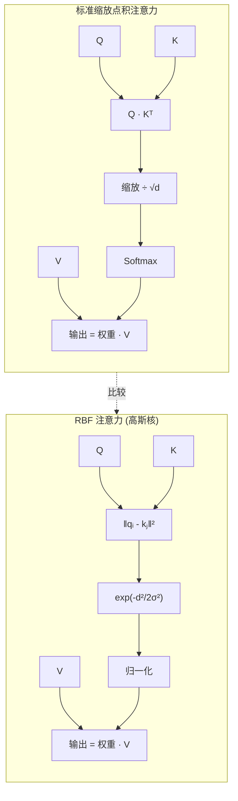
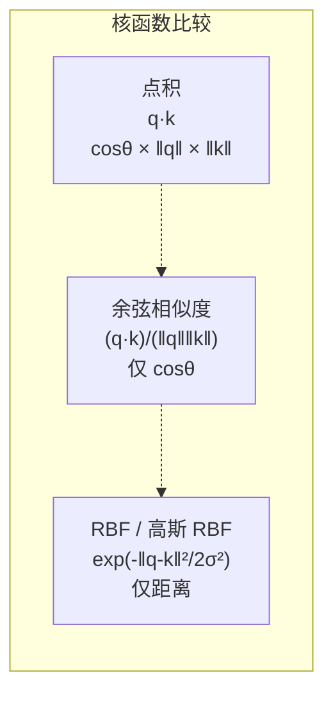
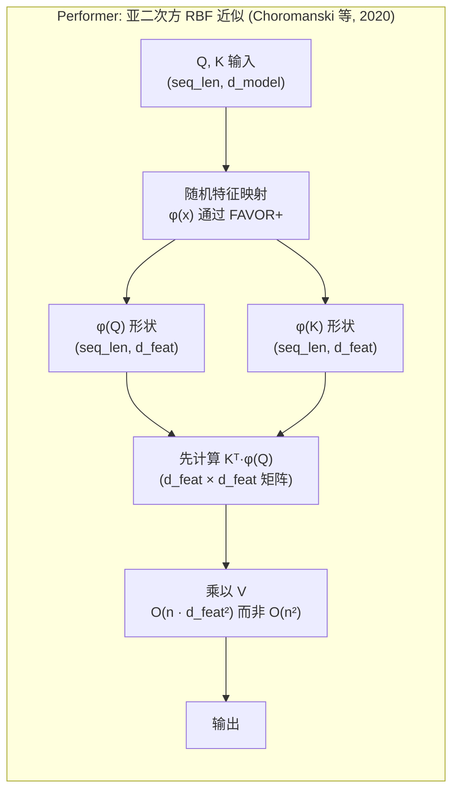

# Day 07: RBF 注意力 -- 径向基函数注意力机制

> **观看动画**: <video src="https://playitcooool.github.io/advanced-ai-daily/videos/07-rbf-attention.webm" autoplay loop muted playsinline width="800"></video>

---

## 一句话摘要

RBF 注意力使用基于距离的径向基函数核 $K(Q, K) = \exp(-\|Q - K\|^2 / 2\sigma^2)$ 替换标准缩放 softmax 注意力中的点积，从基于相关性切换到基于相似度的 token 匹配，提供更好的局部敏感性、更平滑的注意力分布，并通过 Performer（Choromanski 等，2020）的随机特征映射实现亚二次方近似。

---

## 为什么这很重要

### 点积的问题

标准 Transformer 注意力使用点积作为其相似度度量：

$$
\text{Attention}(Q, K, V) = \text{softmax}\left(\frac{QK^\top}{\sqrt{d}}\right) V
$$

点积之所以有效，是因为它在计算上高效且数学上方便，但它有几个局限性：

1. **角度与幅值混淆**：点积 $q \cdot k = \|q\| \|k\| \cos\theta$ 将向量之间的角度与它们各自的幅值混淆在一起。大幅值的 token 可以主导注意力，而不管语义相似度如何。
2. **无界分数**：点积分数范围从 $-\infty$ 到 $+\infty$，使得 softmax 分布对预激活空间中的异常值高度敏感。
3. **没有固有的距离衰减**：点积不会在嵌入空间中自然随距离衰减，这使得注意力在几何意义上不够局部化。

### RBF 注意力的核心洞察

RBF（径向基函数）注意力提出：*我们能否使用欧几里得距离而不是点积来测量 token 相似度，这是否能给我们更好的注意力特性？*

答案是微妙的肯定。通过使用高斯 RBF 核：

$$
A_{ij} = \exp\left(-\frac{\|q_i - k_j\|^2}{2\sigma^2}\right)
$$

我们得到的注意力具有以下特性：
- 仅依赖于**距离**，而非幅值（在嵌入空间中平移不变）
- 具有**自然衰减**：嵌入空间中距离较远的 token 获得指数级更小的注意力权重
- 产生**有界分数**：$A_{ij} \in (0, 1]$，导致更稳定的优化
- 可以通过 Performer 的随机特征映射**分解为线性时间近似**

---

## 架构走查







---

## 数学公式

### 点积 vs RBF 核

标准点积注意力：

$$
A_{ij} = \text{softmax}_j\left(\frac{q_i \cdot k_j}{\sqrt{d}}\right)
$$

RBF（高斯）注意力：

$$
A_{ij} = \frac{\exp\left(-\frac{\|q_i - k_j\|^2}{2\sigma^2}\right)}{\sum_{m} \exp\left(-\frac{\|q_i - k_m\|^2}{2\sigma^2}\right)}
$$

### 展开 RBF 核

利用恒等式 $\|a - b\|^2 = \|a\|^2 - 2a \cdot b + \|b\|^2$：

$$
\exp\left(-\frac{\|q_i - k_j\|^2}{2\sigma^2}\right) = \exp\left(-\frac{\|q_i\|^2}{2\sigma^2}\right) \cdot \exp\left(\frac{q_i \cdot k_j}{\sigma^2}\right) \cdot \exp\left(-\frac{\|k_j\|^2}{2\sigma^2}\right)
$$

第一项 $\exp(-\|q_i\|^2 / 2\sigma^2)$ 对于固定的查询 $q_i$ 在所有 $j$ 上是常数，因此在 softmax 归一化中会抵消。这意味着：

$$
\text{softmax}_j\left(-\frac{\|q_i - k_j\|^2}{2\sigma^2}\right) = \text{softmax}_j\left(\frac{q_i \cdot k_j}{\sigma^2} - \frac{\|k_j\|^2}{2\sigma^2}\right)
$$

这揭示了一个深刻的关系：RBF 注意力是带有附加**幅值惩罚**项 $-\|k_j\|^2 / 2\sigma^2$ 的点积注意力，该抑制项会抑制对大幅值键的注意力。

### 温度与带宽解释

参数 $\sigma$（带宽）控制注意力分布的有效温度：

$$
\text{当 } \sigma \to 0: \quad A_{ij} \to \mathbb{1}[j = \arg\min_j \|q_i - k_j\|] \quad \text{(硬最近邻)}
$$

$$
\text{当 } \sigma \to \infty: \quad A_{ij} \to \frac{1}{N} \quad \text{(均匀注意力)}
$$

这意味着 $\sigma$ 在硬检索机制（仅关注单个最近的键）和对所有键的均匀平均之间进行插值。

### Performer：随机特征近似 (FAVOR+)

Performer 的关键洞察是高斯 RBF 核可以使用随机特征映射进行近似，实现亚二次方注意力计算：

$$
\exp\left(-\frac{\|x - y\|^2}{2\sigma^2}\right) \approx \phi(x)^\top \phi(y)
$$

其中 $\phi(x) \in \mathbb{R}^m$ 是随机特征向量。使用 FAVOR+ 机制：

$$
\phi(x) = \frac{1}{\sqrt{m}} \begin{bmatrix}
\exp\left(-\frac{\|x\|^2}{2\sigma^2}\right) \exp(\omega_1^\top x / \sigma) \\
\vdots \\
\exp\left(-\frac{\|x\|^2}{2\sigma^2}\right) \exp(\omega_m^\top x / \sigma)
\end{bmatrix}
$$

其中 $\omega_1, \ldots, \omega_m \sim \mathcal{N}(0, I)$ 是随机投影。

通过这种近似，注意力可以重写为：

$$
\text{Attention}(Q, K, V)_i = \frac{\sum_j \phi(q_i)^\top \phi(k_j) v_j}{\sum_j \phi(q_i)^\top \phi(k_j)} = \frac{\phi(q_i)^\top \left(\sum_j \phi(k_j) v_j^\top\right)^\top}{\phi(q_i)^\top \left(\sum_j \phi(k_j)\right)}
$$

关键在于 $\sum_j \phi(k_j) v_j^\top$ 可以在 $O(n \cdot m \cdot d_v)$ 时间内预先计算，最终步骤与序列长度无关。总复杂度变为 $O(n \cdot m \cdot (d + d_v))$ 而不是 $O(n^2 \cdot d)$。

### 余弦注意力 (cosFormer)

cosFormer（Chen 等，2022）使用带有权重调整机制的余弦核来捕获局部性，无需显式位置编码：

$$
A_{ij} = \frac{\cos(\theta_{ij}) \cdot \text{reweight}(i, j)}{\sum_m \cos(\theta_{im}) \cdot \text{reweight}(i, m)}
$$

其中 $\theta_{ij}$ 是 $q_i$ 和 $k_j$ 之间的角度，权重函数包含位置信息。

---

## 参数对比

| 维度 | 标准注意力 | RBF 注意力 | Performer (FAVOR+) |
|---|---|---|---|
| 核函数 | $q \cdot k / \sqrt{d}$ | $\exp(-\|q-k\|^2/2\sigma^2)$ | 随机特征近似 |
| 超参数 | 无（仅 $\sqrt{d}$ 缩放） | 带宽 $\sigma$ | 随机特征数量 $m$ |
| 分数范围 | $(-\infty, +\infty)$ | $(0, 1]$ | $(0, \infty)$ |
| 幅值敏感性 | 高（角度与幅值混淆） | 无（平移不变） | 取决于特征映射归一化 |
| 计算复杂度 | $O(n^2 d)$ | $O(n^2 d)$ + 距离计算 | $O(n \cdot m \cdot d)$ |
| 亚二次方版本 | FlashAttention（I/O 优化） | 不能直接 | FAVOR+ 随机特征 |
| 最佳用途 | 通用、调优成熟 | 局部敏感任务、平滑注意力 | 长序列、亚二次方需求 |

---

## Python 代码实现

```python
import torch
import torch.nn as nn
import torch.nn.functional as F
import math


# ------------------------------------------------------------------
# 1. 标准缩放点积注意力（参考实现）
# ------------------------------------------------------------------

def standard_attention(
    q: torch.Tensor,
    k: torch.Tensor,
    v: torch.Tensor,
    mask: torch.Tensor | None = None,
) -> torch.Tensor:
    """
    标准缩放点积注意力。

    Args:
        q: 查询张量，形状 (batch, heads, seq_len, head_dim)。
        k: 键张量，形状 (batch, heads, seq_len, head_dim)。
        v: 值张量，形状 (batch, heads, seq_len, head_dim)。
        mask: 可选的注意力掩码。

    Returns:
        output: 注意力输出，形状 (batch, heads, seq_len, head_dim)。
    """
    d_k = q.size(-1)
    scores = torch.matmul(q, k.transpose(-2, -1)) / math.sqrt(d_k)

    if mask is not None:
        scores = scores.masked_fill(mask == 0, float("-inf"))

    weights = F.softmax(scores, dim=-1)
    return torch.matmul(weights, v)


# ------------------------------------------------------------------
# 2. RBF（高斯）注意力
# ------------------------------------------------------------------

def compute_pairwise_sq_dist(
    q: torch.Tensor, k: torch.Tensor
) -> torch.Tensor:
    """
    高效计算成对平方欧几里得距离。

    利用恒等式：||q - k||^2 = ||q||^2 - 2*q.k + ||k||^2

    Args:
        q: 查询张量，形状 (..., seq_len_q, d)。
        k: 键张量，形状 (..., seq_len_k, d)。

    Returns:
        dist: 成对平方距离，形状 (..., seq_len_q, seq_len_k)。
    """
    q_sq = (q ** 2).sum(dim=-1, keepdim=True)
    k_sq = (k ** 2).sum(dim=-1, keepdim=True)

    dist = q_sq + k_sq.transpose(-2, -1) - 2 * torch.matmul(q, k.transpose(-2, -1))

    return dist.clamp(min=0.0)


def rbf_attention(
    q: torch.Tensor,
    k: torch.Tensor,
    v: torch.Tensor,
    sigma: float = 1.0,
    mask: torch.Tensor | None = None,
) -> torch.Tensor:
    """
    径向基函数（高斯）注意力。

    使用 exp(-||q - k||^2 / (2 * sigma^2)) 作为注意力核。

    Args:
        q: 查询张量，形状 (batch, heads, seq_len, head_dim)。
        k: 键张量，形状 (batch, heads, seq_len, head_dim)。
        v: 值张量，形状 (batch, heads, seq_len, head_dim)。
        sigma: RBF 带宽参数（控制注意力锐度）。
        mask: 可选的注意力掩码。

    Returns:
        output: 注意力输出，形状 (batch, heads, seq_len, head_dim)。
    """
    dist_sq = compute_pairwise_sq_dist(q, k)

    scores = -dist_sq / (2.0 * sigma ** 2)

    if mask is not None:
        scores = scores.masked_fill(mask == 0, float("-inf"))

    weights = F.softmax(scores, dim=-1)
    return torch.matmul(weights, v)


# ------------------------------------------------------------------
# 3. 混合注意力：点积 + RBF 正则化
# ------------------------------------------------------------------

def hybrid_attention(
    q: torch.Tensor,
    k: torch.Tensor,
    v: torch.Tensor,
    alpha: float = 0.5,
    sigma: float = 1.0,
    mask: torch.Tensor | None = None,
) -> torch.Tensor:
    """
    混合注意力，融合点积和 RBF 分数。

    Args:
        q: 查询张量，形状 (batch, heads, seq_len, head_dim)。
        k: 键张量，形状 (batch, heads, seq_len, head_dim)。
        v: 值张量，形状 (batch, heads, seq_len, head_dim)。
        alpha: 混合系数（0 = 纯点积，1 = 纯 RBF）。
        sigma: RBF 带宽参数。
        mask: 可选的注意力掩码。

    Returns:
        output: 注意力输出，形状 (batch, heads, seq_len, head_dim)。
    """
    d_k = q.size(-1)

    dot_scores = torch.matmul(q, k.transpose(-2, -1)) / math.sqrt(d_k)

    dist_sq = compute_pairwise_sq_dist(q, k)
    rbf_scores = -dist_sq / (2.0 * sigma ** 2)

    combined_scores = (1 - alpha) * dot_scores + alpha * rbf_scores

    if mask is not None:
        combined_scores = combined_scores.masked_fill(mask == 0, float("-inf"))

    weights = F.softmax(combined_scores, dim=-1)
    return torch.matmul(weights, v)


# ------------------------------------------------------------------
# 4. Performer 风格 FAVOR+ 线性注意力（简化）
# ------------------------------------------------------------------

def favorable_feature_map(
    x: torch.Tensor,
    omega: torch.Tensor,
    sigma: float = 1.0,
    normalize: bool = True,
) -> torch.Tensor:
    """
    高斯 RBF 核的 FAVOR+ 随机特征映射。

    实现无偏估计器：
    phi(x) = exp(-||x||^2 / (2*sigma^2)) * (1/sqrt(m)) * exp(omega^T x / sigma)

    Args:
        x: 输入张量，形状 (batch, heads, seq_len, d)。
        omega: 随机投影矩阵，形状 (d, m)。
        sigma: RBF 带宽参数。
        normalize: 是否应用归一化以提高数值稳定性。

    Returns:
        phi: 特征映射，形状 (batch, heads, seq_len, m)。
    """
    norm_sq = (x ** 2).sum(dim=-1, keepdim=True)
    magnitude = torch.exp(-norm_sq / (2.0 * sigma ** 2))

    proj = torch.matmul(x, omega) / sigma

    phi = magnitude * torch.exp(proj)

    if normalize:
        normalizer = phi.sum(dim=-1, keepdim=True).clamp(min=1e-12)
        phi = phi / normalizer.sqrt()

    return phi


def performer_attention(
    q: torch.Tensor,
    k: torch.Tensor,
    v: torch.Tensor,
    num_features: int = 256,
    sigma: float = 1.0,
    seed: int = 42,
) -> torch.Tensor:
    """
    使用 FAVOR+ 随机特征近似的 Performer 风格线性注意力。

    实现 O(n * m * d) 复杂度而非 O(n^2 * d)。

    Args:
        q: 查询张量，形状 (batch, heads, seq_len, d)。
        k: 键张量，形状 (batch, heads, seq_len, d)。
        v: 值张量，形状 (batch, heads, seq_len, d_v)。
        num_features: 随机特征数量 m。
        sigma: RBF 带宽参数。
        seed: 随机种子用于可重复性。

    Returns:
        output: 注意力输出，形状 (batch, heads, seq_len, d_v)。
    """
    batch_size, num_heads, seq_len, d_model = q.shape

    torch.manual_seed(seed)
    omega = torch.randn(d_model, num_features, device=q.device, dtype=q.dtype)

    phi_q = favorable_feature_map(q, omega, sigma)
    phi_k = favorable_feature_map(k, omega, sigma)

    # KV 聚合
    kv = torch.matmul(phi_k.transpose(-2, -1), v)

    # 计算输出
    numerator = torch.matmul(phi_q, kv)

    # 归一化
    denominator = torch.matmul(
        phi_q, phi_k.transpose(-2, -1).sum(dim=-2, keepdim=True)
    ).clamp(min=1e-12)

    output = numerator / denominator

    return output


# ------------------------------------------------------------------
# 5. 可学习 Sigma 的 RBF 注意力层
# ------------------------------------------------------------------

class RBFMultiHeadAttention(nn.Module):
    """
    带可学习 RBF 带宽参数的多头注意力。

    每个头拥有独立的可学习 sigma，使不同的注意力头
    能够专门化不同尺度的相似度。

    Args:
        d_model: 模型维度（必须能被 num_heads 整除）。
        num_heads: 注意力头的数量。
        init_sigma: RBF 带宽的初始值。
    """

    def __init__(
        self, d_model: int, num_heads: int, init_sigma: float = 1.0
    ):
        super().__init__()
        assert d_model % num_heads == 0
        self.d_model = d_model
        self.num_heads = num_heads
        self.head_dim = d_model // num_heads

        self.w_q = nn.Linear(d_model, d_model)
        self.w_k = nn.Linear(d_model, d_model)
        self.w_v = nn.Linear(d_model, d_model)
        self.w_o = nn.Linear(d_model, d_model)

        # 每个头可学习的 sigma
        self.sigma = nn.Parameter(torch.full((num_heads,), init_sigma))

    def forward(
        self, x: torch.Tensor, mask: torch.Tensor | None = None
    ) -> torch.Tensor:
        """
        RBF 多头注意力的前向传播。

        Args:
            x: 输入张量，形状 (batch, seq_len, d_model)。
            mask: 可选的注意力掩码，形状 (batch, seq_len, seq_len)。

        Returns:
            output: 注意力输出，形状 (batch, seq_len, d_model)。
        """
        batch_size, seq_len, _ = x.shape

        q = self.w_q(x).view(batch_size, seq_len, self.num_heads, self.head_dim)
        k = self.w_k(x).view(batch_size, seq_len, self.num_heads, self.head_dim)
        v = self.w_v(x).view(batch_size, seq_len, self.num_heads, self.head_dim)

        q = q.transpose(1, 2)
        k = k.transpose(1, 2)
        v = v.transpose(1, 2)

        sigma = self.sigma.view(1, self.num_heads, 1, 1)
        sigma = sigma.clamp(min=1e-3)

        out_per_head: list[torch.Tensor] = []
        for h in range(self.num_heads):
            dist_sq = compute_pairwise_sq_dist(q[:, h:h+1], k[:, h:h+1])
            scores = -dist_sq / (2.0 * sigma[:, h:h+1] ** 2)

            if mask is not None:
                scores = scores.masked_fill(mask == 0, float("-inf"))

            weights = F.softmax(scores, dim=-1)
            out_h = torch.matmul(weights, v[:, h:h+1])
            out_per_head.append(out_h)

        out = torch.cat(out_per_head, dim=1)
        out = out.transpose(1, 2).contiguous().view(batch_size, seq_len, self.d_model)

        return self.w_o(out)


# ------------------------------------------------------------------
# 示例用法
# ------------------------------------------------------------------
if __name__ == "__main__":

    torch.manual_seed(42)

    # ---- 1. 比较标准注意力与 RBF 注意力 ----
    print("=" * 60)
    print("1. 标准注意力与 RBF 注意力比较")
    print("=" * 60)

    batch, heads, seq_len, head_dim = 1, 2, 8, 16
    q = torch.randn(batch, heads, seq_len, head_dim)
    k = torch.randn(batch, heads, seq_len, head_dim)
    v = torch.randn(batch, heads, seq_len, head_dim)

    std_out = standard_attention(q, k, v)
    rbf_out = rbf_attention(q, k, v, sigma=1.0)

    print(f"标准注意力输出范数: {std_out.norm().item():.4f}")
    print(f"RBF 注意力输出范数:   {rbf_out.norm().item():.4f}")
    print(f"输出相似度（余弦）:   {F.cosine_similarity(std_out, rbf_out, dim=-1).mean().item():.4f}")
    print()

    # ---- 2. sigma 对注意力分布的影响 ----
    print("=" * 60)
    print("2. sigma 对注意力锐度的影响")
    print("=" * 60)

    q_single = torch.randn(1, 1, 1, 4)
    k_multi = torch.randn(1, 1, 10, 4)

    for sigma in [0.5, 1.0, 2.0, 5.0]:
        dist_sq = compute_pairwise_sq_dist(q_single, k_multi)
        scores = -dist_sq / (2.0 * sigma ** 2)
        weights = F.softmax(scores, dim=-1)
        entropy = -(weights * (weights + 1e-10).log()).sum().item()
        print(f"  sigma={sigma:.1f}: 熵={entropy:.4f}, 最大权重={weights.max().item():.4f}")
    print()

    # ---- 3. 混合注意力 ----
    print("=" * 60)
    print("3. 混合注意力（alpha 扫描）")
    print("=" * 60)

    for alpha in [0.0, 0.25, 0.5, 0.75, 1.0]:
        hybrid_out = hybrid_attention(q, k, v, alpha=alpha, sigma=1.0)
        sim = F.cosine_similarity(std_out, hybrid_out, dim=-1).mean().item()
        print(f"  alpha={alpha:.2f}: 与标准的相似度 = {sim:.4f}")
    print()

    # ---- 4. Performer 线性注意力 ----
    print("=" * 60)
    print("4. Performer 线性注意力（长序列）")
    print("=" * 60)

    long_seq_len = 1000
    q_long = torch.randn(1, 2, long_seq_len, 32)
    k_long = torch.randn(1, 2, long_seq_len, 32)
    v_long = torch.randn(1, 2, long_seq_len, 32)

    performer_out = performer_attention(q_long, k_long, v_long, num_features=256, sigma=1.0)
    print(f"  Performer 输出形状: {performer_out.shape}")
    print(f"  Performer 输出范数: {performer_out.norm().item():.4f}")
    print()

    # ---- 5. 可学习 Sigma 的 RBF 注意力层 ----
    print("=" * 60)
    print("5. 可学习 Sigma 的 RBF 注意力层")
    print("=" * 60)

    x = torch.randn(2, 16, 64)
    rbf_mha = RBFMultiHeadAttention(d_model=64, num_heads=4, init_sigma=1.0)
    output = rbf_mha(x)
    print(f"  输入形状:  {x.shape}")
    print(f"  输出形状: {output.shape}")
    print(f"  各头学到的 sigma 值: {rbf_mha.sigma.data.tolist()}")
```

---

## 深度分析

### 为什么 RBF 注意力产生更平滑的分布

RBF 核 $\exp(-\|q-k\|^2/2\sigma^2)$ 是平滑的无穷次可微函数。相比之下，点积 $q \cdot k$ 在每个输入上是线性的。RBF 核的非线性意味着：

1. **异常值抑制**：在欧几里得距离上远离查询的键获得指数级（而非仅仅是线性）更小的注意力权重。
2. **平移不变性**：将所有查询和键嵌入添加常数向量不会改变注意力模式，因为距离被保留。这对点积注意力不成立。
3. **幅值归一化**：具有相同方向但不同幅值的两个向量被等同对待。当嵌入的方向编码语义含义而幅值是 token 频率或其他非语义因素的产物时，这是理想的。

### 带宽选择问题

选择合适的 $\sigma$ 对 RBF 注意力至关重要。如果 $\sigma$ 太小，注意力基本上变成硬最近邻（每个查询只关注其最近的键）。如果 $\sigma$ 太大，注意力趋近均匀分布，失去所有判别能力。

在实践中，$\sigma$ 可以：
- **作为超参数调优**：扫描 0.1、0.5、1.0、2.0、5.0 等值
- **每头学习**：如 `RBFMultiHeadAttention` 类中，每个头学习自己的带宽
- **自适应设置**：使用中位数启发法（将 $\sigma$ 设为批中成对距离的中位数）

### RBF 注意力何时优于点积

RBF 注意力倾向于在以下场景中优于标准注意力：
- **检索增强任务**：嵌入空间中的几何接近度与相关性直接相关
- **长上下文连贯性**：基于距离的衰减自然防止遥远的不相关 token 贡献
- **有噪声的嵌入**：RBF 对嵌入幅值维度的噪声更鲁棒
- **多模态对齐**：在对其不同模态（文本-图像、文本-音频）时，基于距离的相似度可能比点积更有意义

### 标准注意力何时更好

标准注意力在以下场景中仍然更优：
- **通用预训练**：海量预训练文献针对点积注意力进行了优化
- **需要幅值信息的任务**：当键向量的幅值编码有用信号时
- **当计算效率至关重要时**：Performer 近似会引入近似误差，而精确 RBF 与标准注意力具有相同的 $O(n^2)$ 复杂度

---

## 常见误区

| 误区 | 现实 |
|---|---|
| "RBF 注意力总是优于点积" | 取决于任务；点积已经过多年预训练优化，并具有语言建模的强大归纳偏置 |
| "RBF 注意力默认是亚二次方的" | 不是 -- 只有结合随机特征近似（Performer/FAVOR+）时才是；精确 RBF 注意力也是 O(n^2) |
| "Sigma 不太重要" | Sigma 是 RBF 注意力中最关键的超参数；错误的 sigma 选择可能导致硬注意力或均匀注意力 |
| "Performer 近似是无损的" | FAVOR+ 是无偏估计器但有方差；随机特征太少时，近似误差可能很大 |
| "RBF 和余弦注意力相同" | 它们相关但不同：RBF 使用欧几里得距离，余弦使用角度距离；只有当输入归一化到单位球面时它们才等价 |

---

## 练习

1. **可视化**：在相同输入上绘制标准注意力和 RBF 注意力（不同 sigma 值）的注意力权重矩阵。热力图有何不同？RBF 注意力是否更集中于对角线？

2. **Sigma 消融研究**：使用 sigma 值 0.5、1.0、2.0、5.0 训练一个带有 RBF 注意力的小型 Transformer。绘制验证困惑度与 sigma 的关系图。最优点在哪里？

3. **可学习 vs 固定 sigma**：比较每头可学习 sigma 的模型与固定全局 sigma 模型的性能。模型是否为不同的头学习了不同的带宽？是否有某些头专门用于"局部"与"全局"注意力？

4. **实现中位数启发法**：实现一个自适应 sigma 选择器，将 $\sigma$ 设为批次中所有成对距离的中位数。将此与可学习 sigma 在验证准确率和收敛速度方面进行比较。

5. **Performer vs 标准注意力速度基准**：对于序列长度 256、512、1024、2048 和 4096，对精确 RBF 注意力和 Performer 近似的运行时间进行基准测试。在哪个序列长度下 Performer 变得更快？近似误差如何随随机特征数量变化？

---

## 参考文献

| 论文 | arXiv | 关键贡献 |
|---|---|---|
| Performers: Rethinking Attention with Performers | 2009.14794 | 通过随机特征映射 (FAVOR+) 实现亚二次方注意力 |
| cosFormer: Rethinking Softmax in Attention | 2202.08791 | 带局部性权重调整的余弦核 |
| Attention Is All You Need | 1706.03762 | 原始缩放点积注意力公式 |

---

## 导航

[[Day 06: 量化]](06-quantization.md) | **Day 07: RBF 注意力** | [[Day 08: 内存与 KV 缓存]](08-memory-kv-cache.md)
