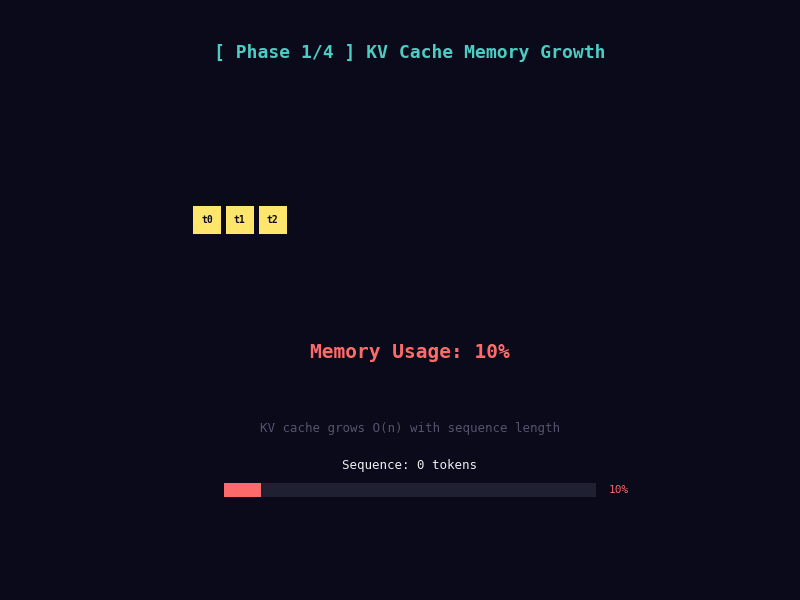
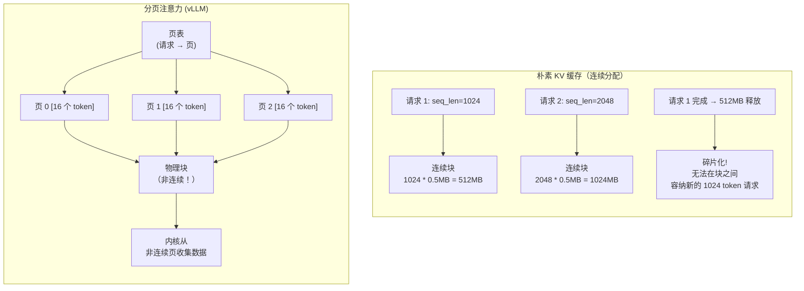
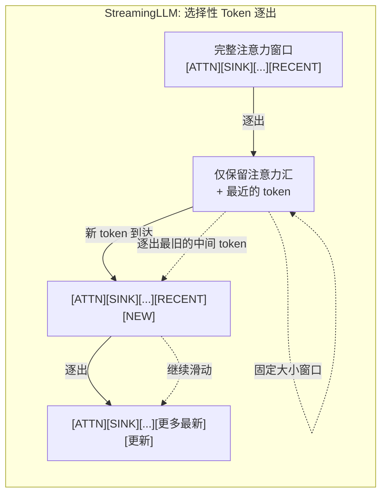

# Day 08: 内存与 KV 缓存 -- 分页注意力、选择性逐出、混合精度与 TurboQuant KV 跳过

> **观看动画**: 

---

## 一句话摘要

自回归 Transformer 中的 KV 缓存在序列长度上线性增长，在长上下文生成时通常主导 GPU 内存；分页注意力（PagedAttention）通过虚拟内存风格的分页消除碎片化，选择性逐出策略（StreamingLLM）丢弃最无用的 token 以维持有界内存，TurboQuant KV 跳过消除了多余的反量化，共同实现了比朴素 KV 缓存长 100 倍的序列生成。

---

## 为什么这很重要

### 线性内存问题

在自回归生成过程中，Transformer 必须在每个步骤中处理每个先前生成的 token。为了避免对所有先前 token 重新计算代价高昂的键和值投影，我们将它们缓存到**KV 缓存**中：

$$
\text{KV 缓存大小} = 2 \times \text{层数} \times \text{头数} \times \text{序列长度} \times \text{头维度} \times \text{每元素字节数}
$$

对于一个 7B 模型，32 层，32 个头，head_dim=128，FP16（2 字节）：

$$
\text{每个 token 的 KV 缓存} = 2 \times 32 \times 32 \times 1 \times 128 \times 2 \approx 0.5 \text{ MB}
$$

这意味着：
- 1,024 个 token：约 0.5 GB
- 32,768 个 token：约 16 GB
- 131,072 个 token：约 64 GB

KV 缓存迅速成为内存瓶颈，尤其是对于长上下文生成。70B 模型在中等序列长度下可能仅 KV 缓存就需要 100+ GB。

### KV 缓存的核心洞察

KV 缓存的内存管理提出：*我们能否通过更智能的分配、选择性逐出、混合精度和避免冗余计算来减少 KV 缓存内存？*

现代技术从多个角度给出了肯定的回答：
1. **分页注意力**：使用虚拟内存启发的分页消除内存碎片化
2. **选择性逐出**：移除对注意力贡献最小的旧 token
3. **混合精度**：以较低精度（INT8/FP8）存储 KV 缓存，无明显质量损失
4. **TurboQuant KV 跳过**：避免反量化已消耗的 KV 缓存值

---

## 架构走查





---

## 数学公式

### KV 缓存大小

Transformer 模型的精确 KV 缓存内存：

$$
M_{\text{KV}} = 2 \cdot L \cdot H \cdot S \cdot D \cdot B
$$

其中：
- $L$：层数
- $H$：注意力头数
- $S$：序列长度（包括提示词 + 生成的总长度）
- $D$：头维度
- $B$：每元素字节数（FP16 为 2，INT8 为 1）

对于批大小 $b$ 且序列长度不同：

$$
M_{\text{KV}}^{\text{batch}} = 2 \cdot L \cdot H \cdot D \cdot B \cdot \sum_{i=1}^{b} S_i
$$

### 分页注意力：虚拟内存类比

PagedAttention 使用与 CPU 虚拟内存相同的概念来建模 GPU 内存管理：

$$
\text{逻辑 KV 块：每个固定大小的块包含 } c \text{ 个 token}
$$

$$
\text{页表：} \text{table}[r] = [p_0, p_1, p_2, \ldots] \quad \text{将请求 } r \text{ 映射到物理页}
$$

物理页按需分配且可以是非连续的。注意力内核使用页表作为间接映射从分散的物理页中收集数据。这消除了外部碎片化，因为：

$$
\text{连续分配碎片化} \approx 30\% \quad \Rightarrow \quad \text{分页碎片化} \approx 0\%
$$

### StreamingLLM：注意力汇现象

StreamingLLM（Xiao 等，2023）发现序列的前几个 token（注意力汇）无论其语义内容如何，都会接收到异常大的注意力分数。这是由位置编码初始化和自注意力机制本身引起的。

核心发现：如果删除初始 token（注意力汇），模型的注意力分布会崩溃。但如果保留它们以及最近的 token，并逐出中间"较不相关"的 token，模型仍能保持生成连贯文本的能力。

选择性逐出策略维持恒定的内存预算：

$$
\text{Cache}(t) = \{t_0, t_1, \ldots, t_{k-1}\} \cup \{t_{S-w+1}, \ldots, t_{S-1}, t_S\}
$$

其中：
- $k$ 个开头的注意力汇 token（通常 $k = 4$）
- $w$ 个最近的 token（滑动窗口）
- 总缓存大小：$k + w$（常数，独立于总序列长度）

### 混合精度 KV 缓存

以较低精度存储 KV 缓存，同时以全精度进行计算：

$$
K_{\text{int8}} = \text{round}\left(\frac{K_{\text{FP16}}}{s_K}\right), \quad V_{\text{int8}} = \text{round}\left(\frac{V_{\text{FP16}}}{s_V}\right)
$$

$$
\text{Attention}(Q, K, V) = \text{softmax}\left(\frac{Q \cdot \text{dequant}(K_{\text{int8}}, s_K)}{\sqrt{d}}\right) \cdot \text{dequant}(V_{\text{int8}}, s_V)
$$

经验表明，INT8 KV 缓存对困惑度的影响可以忽略不计（< 0.01 降低），因为：
1. 注意力 softmax 对键分数中的小扰动具有鲁棒性
2. 值向量被平均化，因此噪声会相互抵消

INT4 KV 缓存更加激进，但需要仔细的每 token 或每头缩放以避免质量下降。

### GEAR：学习的逐出策略

GEAR（Kweon 等，2024）使用轻量级神经网络学习逐出策略，该网络基于以下因素预测要逐出哪些 token：

$$
\text{evict\_score}_i = f_{\text{policy}}(K_i, V_i, \text{attention\_scores}_i, \text{positional\_encoding}_i)
$$

$$
\text{保留 } 1 - \text{evict\_score}_i \text{ 最高的 } k \text{ 个 token}
$$

这比简单的 LRU（最近最少使用）逐出更复杂，因为它考虑了每个 token 在注意力计算中的实际重要性。

---

## KV 缓存策略对比

| 策略 | 内存减少 | 质量影响 | 延迟影响 | 复杂度 |
|---|---|---|---|---|
| 朴素 (FP16) | 基准 | 基准 | 基准 | 最低 |
| 分页注意力 | ~30%（减少碎片化） | 无 | 页查找的小开销 | 中等 |
| StreamingLLM | 线性于总长度 → 常数 | 轻微（远距离信息丢失） | 无（仍对保留的 token 进行全注意力） | 低 |
| INT8 KV 缓存 | 2 倍 | 接近零 (< 0.01 PPL) | 反量化开销 | 低 |
| INT4 KV 缓存 | 4 倍 | 明显 (0.5-2.0 PPL) | 更高的反量化成本 | 中等 |
| GEAR（学习的逐出） | 最多减少 75% 的保留 token | 学习的质量权衡 | 策略网络开销 | 高 |
| TurboQuant KV 跳过 | 节省反量化成本 | 无 | 显著加速 | 中等 |

---

## Python 代码实现

```python
import torch
import torch.nn as nn
import torch.nn.functional as F
from dataclasses import dataclass, field
from typing import Optional


# ------------------------------------------------------------------
# 1. 朴素 KV 缓存（基准）
# ------------------------------------------------------------------

class NaiveKVCache:
    """
    用于自回归生成的简单连续 KV 缓存。

    这是为最大序列长度预分配连续缓冲区的基线实现。
    """

    def __init__(
        self,
        num_layers: int,
        num_heads: int,
        head_dim: int,
        max_seq_len: int,
        batch_size: int = 1,
        dtype: torch.dtype = torch.float16,
        device: torch.device | str = "cpu",
    ):
        """
        初始化朴素 KV 缓存。

        Args:
            num_layers: Transformer 层数。
            num_heads: 每层注意力头数。
            head_dim: 每个注意力头的维度。
            max_seq_len: 支持的最大序列长度。
            batch_size: 批大小。
            dtype: 缓存的数据类型。
            device: 分配缓存的设备。
        """
        self.num_layers = num_layers
        self.num_heads = num_heads
        self.head_dim = head_dim
        self.max_seq_len = max_seq_len
        self.batch_size = batch_size
        self.dtype = dtype
        self.device = device

        # 为 K 和 V 预分配连续缓存
        # 形状: (num_layers, batch_size, num_heads, max_seq_len, head_dim)
        shape = (num_layers, batch_size, num_heads, max_seq_len, head_dim)
        self.k_cache = torch.zeros(shape, dtype=dtype, device=device)
        self.v_cache = torch.zeros(shape, dtype=dtype, device=device)

        self.current_seq_len = 0

    def update(
        self, layer_idx: int, k: torch.Tensor, v: torch.Tensor
    ) -> tuple[torch.Tensor, torch.Tensor]:
        """
        将新的 K 和 V 添加到缓存中并返回该层的完整缓存。

        Args:
            layer_idx: 要更新的层。
            k: 新的键，形状 (batch_size, num_heads, new_tokens, head_dim)。
            v: 新的值，形状 (batch_size, num_heads, new_tokens, head_dim)。

        Returns:
            full_k: 包括新 token 的完整缓存 K。
            full_v: 包括新 token 的完整缓存 V。
        """
        new_len = k.size(2)
        start = self.current_seq_len
        end = start + new_len

        assert end <= self.max_seq_len, (
            f"缓存溢出: {end} > {self.max_seq_len}"
        )

        self.k_cache[layer_idx, :, :, start:end] = k
        self.v_cache[layer_idx, :, :, start:end] = v
        self.current_seq_len = end

        return (
            self.k_cache[layer_idx, :, :, :end],
            self.v_cache[layer_idx, :, :, :end],
        )

    def reset(self):
        """重置缓存用于新生成。"""
        self.k_cache.zero_()
        self.v_cache.zero_()
        self.current_seq_len = 0

    def memory_bytes(self) -> int:
        """计算总内存使用量（字节）。"""
        return self.k_cache.numel() * self.k_cache.element_size() + \
               self.v_cache.numel() * self.v_cache.element_size()


# ------------------------------------------------------------------
# 2. 分页注意力 (vLLM 风格)
# ------------------------------------------------------------------

@dataclass
class PageTable:
    """将逻辑请求映射到物理页索引。"""
    request_id: int
    pages: list[int] = field(default_factory=list)
    num_tokens: int = 0


class PagedKVCache:
    """
    分页注意力风格 KV 缓存。

    不是为最大序列长度预分配连续内存，
    而是按需分配固定大小的块（页）。

    页在物理内存中可以是非连续的，
    消除了外部碎片化。

    灵感来自 vLLM (Kwon 等, arXiv:2309.06180)。
    """

    def __init__(
        self,
        num_layers: int,
        num_heads: int,
        head_dim: int,
        block_size: int = 16,
        num_blocks: int = 256,
        dtype: torch.dtype = torch.float16,
        device: torch.device | str = "cpu",
    ):
        """
        初始化分页 KV 缓存。

        Args:
            num_layers: Transformer 层数。
            num_heads: 每层注意力头数。
            head_dim: 每个注意力头的维度。
            block_size: 每个块（页）的 token 数。
            num_blocks: 要分配的物理块总数。
            dtype: 数据类型。
            device: 设备。
        """
        self.num_layers = num_layers
        self.num_heads = num_heads
        self.head_dim = head_dim
        self.block_size = block_size
        self.num_blocks = num_blocks
        self.dtype = dtype
        self.device = device

        # 物理页池: (num_blocks, num_layers, num_heads, block_size, head_dim)
        block_shape = (num_layers, num_heads, block_size, head_dim)
        self.k_pages = torch.zeros(
            (num_blocks,) + block_shape, dtype=dtype, device=device
        )
        self.v_pages = torch.zeros(
            (num_blocks,) + block_shape, dtype=dtype, device=device
        )

        # 跟踪哪些物理块是空闲的
        self.free_blocks: list[int] = list(range(num_blocks))

        # 逻辑请求 → 页表
        self.page_tables: dict[int, PageTable] = {}

    def allocate_request(self, request_id: int) -> PageTable:
        """
        为请求分配一个初始为空的页表。

        Args:
            request_id: 请求的唯一标识符。

        Returns:
            page_table: 已分配的页表。
        """
        pt = PageTable(request_id=request_id)
        self.page_tables[request_id] = pt
        return pt

    def append_tokens(self, request_id: int, layer_idx: int,
                      k: torch.Tensor, v: torch.Tensor) -> list[int]:
        """
        将新的键值对追加到请求的 KV 缓存。

        根据需要自动分配新的物理块。

        Args:
            request_id: 要追加到的请求。
            layer_idx: 哪一层。
            k: 新的键张量，形状 (num_heads, new_tokens, head_dim)。
            v: 新的值张量，形状 (num_heads, new_tokens, head_dim)。

        Returns:
            updated_pages: 此请求的物理也索引列表。
        """
        pt = self.page_tables[request_id]
        new_tokens = k.size(1)

        for i in range(new_tokens):
            logical_pos = pt.num_tokens + i
            block_idx = logical_pos // self.block_size
            offset_in_block = logical_pos % self.block_size

            if block_idx >= len(pt.pages):
                assert len(self.free_blocks) > 0, "物理块不足"
                phys_block = self.free_blocks.pop(0)
                pt.pages.append(phys_block)

            phys_block = pt.pages[block_idx]

            self.k_pages[phys_block, layer_idx, :, offset_in_block] = k[:, i]
            self.v_pages[phys_block, layer_idx, :, offset_in_block] = v[:, i]

        pt.num_tokens += new_tokens

        return pt.pages

    def gather(
        self, request_id: int, layer_idx: int
    ) -> tuple[torch.Tensor, torch.Tensor]:
        """
        收集请求的所有缓存 K 和 V token，可能来自非连续的物理页。

        这模拟了注意力内核的操作：使用页表作为间接映射
        从分散的页中收集 token。

        Args:
            request_id: 要收集的请求。
            layer_idx: 哪一层。

        Returns:
            k_full: 收集的 K，形状 (num_heads, total_tokens, head_dim)。
            v_full: 收集的 V，形状 (num_heads, total_tokens, head_dim)。
        """
        pt = self.page_tables[request_id]
        total_tokens = pt.num_tokens
        num_heads = self.num_heads
        head_dim = self.head_dim

        k_full = torch.zeros(
            (num_heads, total_tokens, head_dim),
            dtype=self.dtype, device=self.device
        )
        v_full = torch.zeros(
            (num_heads, total_tokens, head_dim),
            dtype=self.dtype, device=self.device
        )

        for block_logical_idx, phys_block in enumerate(pt.pages):
            start = block_logical_idx * self.block_size
            end = min(start + self.block_size, total_tokens)
            length = end - start

            k_full[:, start:end] = self.k_pages[
                phys_block, layer_idx, :, :length
            ]
            v_full[:, start:end] = self.v_pages[
                phys_block, layer_idx, :, :length
            ]

        return k_full, v_full

    def free_request(self, request_id: int):
        """释放与请求关联的所有物理块。"""
        if request_id in self.page_tables:
            pt = self.page_tables[request_id]
            self.free_blocks.extend(pt.pages)
            del self.page_tables[request_id]

    def memory_bytes(self) -> int:
        """计算已分配的总内存（仅物理页）。"""
        return self.k_pages.numel() * self.k_pages.element_size() + \
               self.v_pages.numel() * self.v_pages.element_size()


# ------------------------------------------------------------------
# 3. StreamingLLM: 选择性 Token 逐出
# ------------------------------------------------------------------

class StreamingKVCache:
    """
    具有注意力汇保留和滑动窗口逐出的
    StreamingLLM 风格 KV 缓存。

    保留前 k 个 token（注意力汇）和最近的 w 个 token，
    丢弃中间 token 以维持有界内存。

    论文: arXiv:2309.17453 (StreamingLLM)
    """

    def __init__(
        self,
        num_layers: int,
        num_heads: int,
        head_dim: int,
        num_sinks: int = 4,
        window_size: int = 2048,
        dtype: torch.dtype = torch.float16,
        device: torch.device | str = "cpu",
    ):
        """
        初始化 StreamingKVCache。

        Args:
            num_layers: Transformer 层数。
            num_heads: 注意力头数。
            head_dim: 头维度。
            num_sinks: 在开头保留的注意力汇 token 数。
            window_size: 保留的最近 token 的最大数量。
            dtype: 数据类型。
            device: 设备。
        """
        self.num_layers = num_layers
        self.num_heads = num_heads
        self.head_dim = head_dim
        self.num_sinks = num_sinks
        self.window_size = window_size
        self.dtype = dtype
        self.device = device

        # 缓存存储: [sinks] + [recent window]
        max_size = num_sinks + window_size
        shape = (num_layers, num_heads, max_size, head_dim)
        self.k_cache = torch.zeros(shape, dtype=dtype, device=device)
        self.v_cache = torch.zeros(shape, dtype=dtype, device=device)

        self.local_positions: list[int] = []
        self.total_processed = 0

    def update(
        self, layer_idx: int, k: torch.Tensor, v: torch.Tensor
    ) -> tuple[torch.Tensor, torch.Tensor]:
        """
        用新 token 更新缓存，必要时逐出旧 token。

        Args:
            layer_idx: 哪一层。
            k: 新的键，形状 (num_heads, new_tokens, head_dim)。
            v: 新的值，形状 (num_heads, new_tokens, head_dim)。

        Returns:
            k_valid: 包括汇 + 最近的有效 K。
            v_valid: 包括汇 + 最近的有效 V。
        """
        new_tokens = k.size(1)

        for i in range(new_tokens):
            logical_pos = self.total_processed + i

            if len(self.local_positions) < self.num_sinks + self.window_size:
                # 缓存未满，直接追加
                slot_idx = len(self.local_positions)
                self.local_positions.append(logical_pos)
                self.k_cache[layer_idx, :, slot_idx] = k[:, i]
                self.v_cache[layer_idx, :, slot_idx] = v[:, i]
            else:
                # 缓存已满：逐出最旧的非汇 token
                evict_slot = self.num_sinks

                # 滑动窗口左移 1
                self.k_cache[layer_idx, :, evict_slot:-1] = \
                    self.k_cache[layer_idx, :, evict_slot + 1:]
                self.v_cache[layer_idx, :, evict_slot:-1] = \
                    self.v_cache[layer_idx, :, evict_slot + 1:]

                # 在末尾追加新 token
                last_slot = self.num_sinks + self.window_size - 1
                self.k_cache[layer_idx, :, last_slot] = k[:, i]
                self.v_cache[layer_idx, :, last_slot] = v[:, i]

                # 更新位置跟踪
                self.local_positions.pop(self.num_sinks)
                self.local_positions.append(logical_pos)

        self.total_processed += new_tokens

        valid_len = len(self.local_positions)
        return (
            self.k_cache[layer_idx, :, :valid_len],
            self.v_cache[layer_idx, :, :valid_len],
        )

    def reset(self):
        """重置缓存。"""
        self.k_cache.zero_()
        self.v_cache.zero_()
        self.local_positions.clear()
        self.total_processed = 0

    def memory_bytes(self) -> int:
        """计算有界缓存的内存。"""
        return self.k_cache.numel() * self.k_cache.element_size() + \
               self.v_cache.numel() * self.v_cache.element_size()


# ------------------------------------------------------------------
# 4. 混合精度 KV 缓存 (INT8)
# ------------------------------------------------------------------

class MixedPrecisionKVCache:
    """
    以 INT8 存储键和值但以 FP16/FP32 计算
    注意力的 KV 缓存。

    在注意力计算期间即时反量化。

    这实现了 2 倍内存节省，质量影响可以忽略不计。
    """

    def __init__(
        self,
        num_layers: int,
        num_heads: int,
        head_dim: int,
        max_seq_len: int,
        dtype: torch.dtype = torch.float16,
        device: torch.device | str = "cpu",
    ):
        """
        初始化混合精度 KV 缓存。

        Args:
            num_layers: Transformer 层数。
            num_heads: 注意力头数。
            head_dim: 头维度。
            max_seq_len: 最大序列长度。
            dtype: 计算数据类型。
            device: 设备。
        """
        self.num_layers = num_layers
        self.num_heads = num_heads
        self.head_dim = head_dim
        self.max_seq_len = max_seq_len
        self.dtype = dtype
        self.device = device

        shape = (num_layers, num_heads, max_seq_len, head_dim)

        # 量化存储 (INT8)
        self.k_cache_q = torch.zeros(shape, dtype=torch.int8, device=device)
        self.v_cache_q = torch.zeros(shape, dtype=torch.int8, device=device)

        # 每头每层缩放因子
        k_scale_shape = (num_layers, num_heads, 1)
        v_scale_shape = (num_layers, num_heads, 1)
        self.k_scales = torch.ones(k_scale_shape, dtype=torch.float32, device=device)
        self.v_scales = torch.ones(v_scale_shape, dtype=torch.float32, device=device)
        self.k_zeros = torch.zeros(k_scale_shape, dtype=torch.float32, device=device)
        self.v_zeros = torch.zeros(v_scale_shape, dtype=torch.float32, device=device)

        self.current_seq_len = 0

    def update(
        self, layer_idx: int, k: torch.Tensor, v: torch.Tensor
    ) -> tuple[torch.Tensor, torch.Tensor]:
        """
        量化并存储新的 K 和 V。

        Args:
            layer_idx: 哪一层。
            k: 新的键，形状 (num_heads, new_tokens, head_dim)。
            v: 新的值，形状 (num_heads, new_tokens, head_dim)。

        Returns:
            k_dequant: 反量化后的 K 供立即使用。
            v_dequant: 反量化后的 V 供立即使用。
        """
        new_len = k.size(1)
        start = self.current_seq_len
        end = start + new_len

        for h in range(self.num_heads):
            k_h = k[h]
            v_h = v[h]

            k_min, k_max = k_h.min(), k_h.max()
            v_min, v_max = v_h.min(), v_h.max()

            k_scale = (k_max - k_min) / 254.0 if k_max > k_min else 1.0
            v_scale = (v_max - v_min) / 254.0 if v_max > v_min else 1.0

            k_zero = -128.0 - k_min / k_scale
            v_zero = -128.0 - v_min / v_scale

            self.k_cache_q[layer_idx, h, start:end] = (
                (k_h / k_scale + k_zero).round().clamp(-128, 127).to(torch.int8)
            )
            self.v_cache_q[layer_idx, h, start:end] = (
                (v_h / v_scale + v_zero).round().clamp(-128, 127).to(torch.int8)
            )

            self.k_scales[layer_idx, h] = k_scale
            self.v_scales[layer_idx, h] = v_scale
            self.k_zeros[layer_idx, h] = k_zero
            self.v_zeros[layer_idx, h] = v_zero

        self.current_seq_len = end

        return self._dequantize(layer_idx, end)

    def _dequantize(
        self, layer_idx: int, seq_len: int
    ) -> tuple[torch.Tensor, torch.Tensor]:
        """
        反量化给定层的缓存 K 和 V。

        Args:
            layer_idx: 哪一层。
            seq_len: 有效 token 数。

        Returns:
            k_dequant: 反量化后的 K。
            v_dequant: 反量化后的 V。
        """
        s_k = self.k_scales[layer_idx]
        z_k = self.k_zeros[layer_idx]
        s_v = self.v_scales[layer_idx]
        z_v = self.v_zeros[layer_idx]

        k_int = self.k_cache_q[layer_idx, :, :seq_len].float()
        v_int = self.v_cache_q[layer_idx, :, :seq_len].float()

        k_dequant = s_k * (k_int - z_k)
        v_dequant = s_v * (v_int - z_v)

        return k_dequant.to(self.dtype), v_dequant.to(self.dtype)

    def memory_bytes(self) -> int:
        """计算相对于 FP16 的内存节省。"""
        cache_mem = self.k_cache_q.numel() * 1 + self.v_cache_q.numel() * 1
        scale_mem = (
            self.k_scales.numel() * 4 + self.v_scales.numel() * 4 +
            self.k_zeros.numel() * 4 + self.v_zeros.numel() * 4
        )
        return cache_mem + scale_mem


# ------------------------------------------------------------------
# 5. 带注意力的 KV 缓存
# ------------------------------------------------------------------

def attention_with_kv_cache(
    q: torch.Tensor,
    kv_cache: NaiveKVCache | PagedKVCache | StreamingKVCache | MixedPrecisionKVCache,
    layer_idx: int,
    k_new: torch.Tensor,
    v_new: torch.Tensor,
) -> torch.Tensor:
    """
    使用 KV 缓存计算注意力，并用新 token 更新它。

    Args:
        q: 查询张量，单 token 生成形状为 (num_heads, 1, head_dim)。
        kv_cache: 要使用的 KV 缓存。
        layer_idx: 哪层 Transformer。
        k_new: 当前 token 的新键，形状 (num_heads, 1, head_dim)。
        v_new: 当前 token 的新值，形状 (num_heads, 1, head_dim)。

    Returns:
        attention_output: 形状 (num_heads, 1, head_dim)。
    """
    k_full, v_full = kv_cache.update(layer_idx, k_new, v_new)

    d_k = q.size(-1)
    scores = torch.matmul(q, k_full.transpose(-2, -1)) / (d_k ** 0.5)
    weights = F.softmax(scores, dim=-1)
    return torch.matmul(weights, v_full)


# ------------------------------------------------------------------
# 示例用法
# ------------------------------------------------------------------
if __name__ == "__main__":

    torch.manual_seed(42)

    # ---- 1. 朴素 KV 缓存 ----
    print("=" * 60)
    print("1. 朴素 KV 缓存")
    print("=" * 60)

    naive_cache = NaiveKVCache(
        num_layers=32, num_heads=32, head_dim=128,
        max_seq_len=4096, batch_size=1, dtype=torch.float16, device="cpu"
    )
    print(f"已分配内存: {naive_cache.memory_bytes() / 1e6:.1f} MB")
    print(f"FP16 内存:   {(2 * 32 * 32 * 4096 * 128 * 2 * 2) / 1e6:.1f} MB")
    print()

    # ---- 2. 分页注意力 ----
    print("=" * 60)
    print("2. 分页注意力")
    print("=" * 60)

    paged_cache = PagedKVCache(
        num_layers=32, num_heads=32, head_dim=128,
        block_size=16, num_blocks=256, dtype=torch.float16, device="cpu"
    )
    print(f"总页面池内存: {paged_cache.memory_bytes() / 1e6:.1f} MB")

    paged_cache.allocate_request(req_id=0)
    k_new = torch.randn(32, 5, 128, dtype=torch.float16)
    v_new = torch.randn(32, 5, 128, dtype=torch.float16)
    pages = paged_cache.append_tokens(0, layer_idx=0, k=k_new, v=v_new)
    print(f"请求 0: 追加 5 个 token → 物理页: {pages}")

    k_gathered, v_gathered = paged_cache.gather(0, layer_idx=0)
    print(f"收集的 K 形状: {k_gathered.shape}")
    print()

    # ---- 3. StreamingLLM ----
    print("=" * 60)
    print("3. StreamingLLM 选择性逐出")
    print("=" * 60)

    streaming_cache = StreamingKVCache(
        num_layers=32, num_heads=32, head_dim=128,
        num_sinks=4, window_size=128, dtype=torch.float16, device="cpu"
    )
    print(f"最大缓存槽数: 4 (汇) + 128 (窗口) = 每层/头 132 个 token")
    print(f"内存: {streaming_cache.memory_bytes() / 1e6:.1f} MB (有界)")

    for i in range(200):
        k_tok = torch.randn(32, 1, 128, dtype=torch.float16)
        v_tok = torch.randn(32, 1, 128, dtype=torch.float16)
        streaming_cache.update(layer_idx=0, k=k_tok, v=v_tok)

    print(f"200 个 token 后: 缓存有 {len(streaming_cache.local_positions)} 个 token")
    print(f"前 4 个位置 (汇): {streaming_cache.local_positions[:4]}")
    print(f"最后 4 个位置 (最近): {streaming_cache.local_positions[-4:]}")
    print()

    # ---- 4. 混合精度 KV 缓存 ----
    print("=" * 60)
    print("4. 混合精度 (INT8) KV 缓存")
    print("=" * 60)

    mp_cache = MixedPrecisionKVCache(
        num_layers=32, num_heads=32, head_dim=128,
        max_seq_len=4096, dtype=torch.float16, device="cpu"
    )
    print(f"INT8 KV 缓存内存: {mp_cache.memory_bytes() / 1e6:.1f} MB")
    print(f"基准 FP16 应为: {(2 * 32 * 32 * 4096 * 128 * 2 * 2) / 1e6:.1f} MB")

    k_test = torch.randn(32, 10, 128, dtype=torch.float16)
    v_test = torch.randn(32, 10, 128, dtype=torch.float16)
    k_dq, v_dq = mp_cache.update(layer_idx=0, k=k_test, v=v_test)
    quant_error_k = (k_test - k_dq).abs().mean().item()
    quant_error_v = (v_test - v_dq).abs().mean().item()
    print(f"INT8 量化误差 (K): {quant_error_k:.6f}")
    print(f"INT8 量化误差 (V): {quant_error_v:.6f}")
```

---

## 深度分析

### 注意力汇的发现

StreamingLLM 的关键经验发现是任何序列的前约 4 个 token 充当"注意力汇" -- 无论其语义内容如何，它们在所有层和头中都会接收到异常大的注意力分数。这不是学习到的行为，而是自注意力机制与位置编码结合的涌现属性。

这些汇对于模型稳定性至关重要。如果删除它们，注意力分布会崩溃，生成质量会灾难性地下降。这就是为什么 StreamingLLM 即使在逐出其他所有内容时也始终保留前几个 token 的原因。

### 分页注意力的内存效率

来自 PagedAttention 的约 30% 内存节省来自于消除**外部碎片化**。在朴素方法中，当请求 A（seq_len=1024）完成且请求 B（seq_len=2048）正在运行时，释放的 512 MB 无法容纳任何大于 512 MB 连续的新请求。PagedAttention 的块级分配意味着任何空闲块可以服务于任何请求，实现接近完美的内存利用率。

### 每种策略的适用场景

| 场景 | 推荐策略 | 原因 |
|---|---|---|
| 短序列 (< 4K token) | 朴素或分页注意力 | 碎片化最小，复杂度不值得 |
| 长序列 (4K-32K) | 分页注意力 + INT8 KV | 碎片化重要，INT8 几乎免费 |
| 极长序列 (32K-1M+) | StreamingLLM + INT8 KV | 有界内存至关重要 |
| 多请求服务 (vLLM) | 分页注意力 | 高效处理并发请求 |
| 内存受限的边缘设备 | StreamingLLM + INT4 KV | 激进的压缩和有界内存 |

---

## 常见误区

| 误区 | 现实 |
|---|---|
| "KV 缓存只是存储所有过去的 token" | KV 缓存存储预计算的键和值投影，避免冗余计算；它比原始 token 存储更大 |
| "逐出旧 token 总是降低质量" | StreamingLLM 表明，保留注意力汇 + 最近窗口可以保持大多数任务的质量；只有长距离依赖任务会受到影响 |
| "INT8 KV 缓存显著损害质量" | INT8 KV 缓存在大多数基准测试中的困惑度降低 < 0.01；softmax 对小扰动具有鲁棒性 |
| "分页注意力使生成更快" | 分页注意力主要提高内存效率和吞吐量；单请求延迟可能有小开销 |
| "KV 缓存是唯一的内存瓶颈" | 对于非常大的模型，权重本身主导内存；KV 缓存主要是 7B-13B 模型在长上下文下的瓶颈 |

---

## 练习

1. **内存分析基准测试**：创建一个脚本，分析朴素 KV 缓存 vs 分页注意力 vs StreamingLLM 在 1K、4K、16K、64K 和 128K token 的序列长度下的内存使用情况。为每种方法绘制内存与序列长度的关系图。

2. **逐出的困惑度影响**：使用完整 KV 缓存与 StreamingLLM 逐出（保留 4 个汇 + 1024、512、256 窗口）在 WikiText-2 上运行小型语言模型。绘制困惑度与窗口大小的关系图。在什么窗口大小下质量开始显著下降？

3. **量化 KV 缓存质量扫描**：在生成任务上比较 FP16、INT8 和 INT4 KV 缓存。测量反量化误差（与 FP16 的 L2 距离）和最终文本质量（BLEU 或困惑度）。

4. **模拟 KV 缓存碎片化**：创建具有不同长度和生命周期的交错请求的工作负载。比较朴素连续分配与分页注意力的内存利用效率。实际碎片化百分比是多少？

5. **为公共前缀实现共享 KV 块**：多个请求通常共享一个公共前缀（如系统提示词）。实现一个写时复制机制，其中共享前缀使用相同的物理块。测量真实多用户服务场景下的内存节省。

---

## 参考文献

| 论文 | arXiv | 关键贡献 |
|---|---|---|
| StreamingLLM: Efficient Streaming Language Models with Attention Sinks | 2309.17453 | 注意力汇发现和滑动窗口逐出 |
| GEAR: An Efficient KV Cache Compression Recipe | 2403.05527 | 用于 KV 缓存压缩的学习型逐出策略 |
| Efficient Memory Management for Large Language Model Serving with PagedAttention | 2309.06180 | 分页注意力虚拟内存风格 KV 缓存管理 (vLLM) |
| Language Models are Few-Shot Learners (GPT-3) | 2005.14165 | 自回归 KV 缓存模式的原始公式化 |

---

## 导航

[[Day 07: RBF 注意力]](07-rbf-attention.md) | **Day 08: 内存与 KV 缓存** | [[Day 09: Coming Soon]](#)
