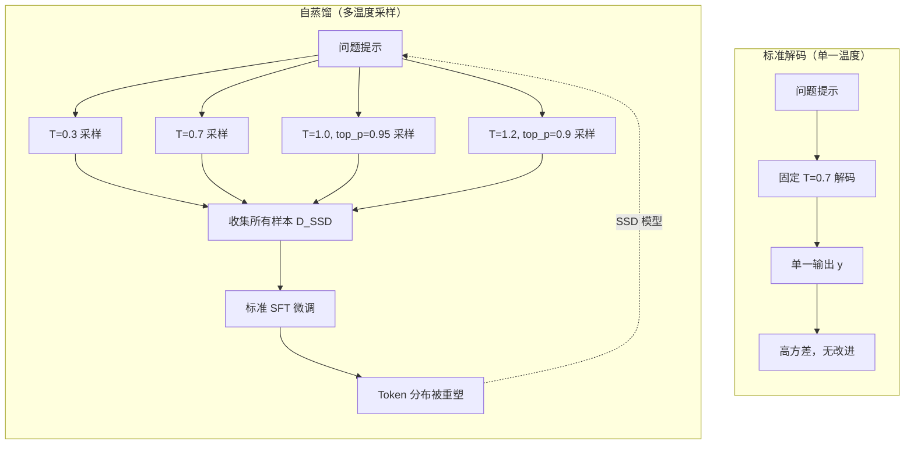
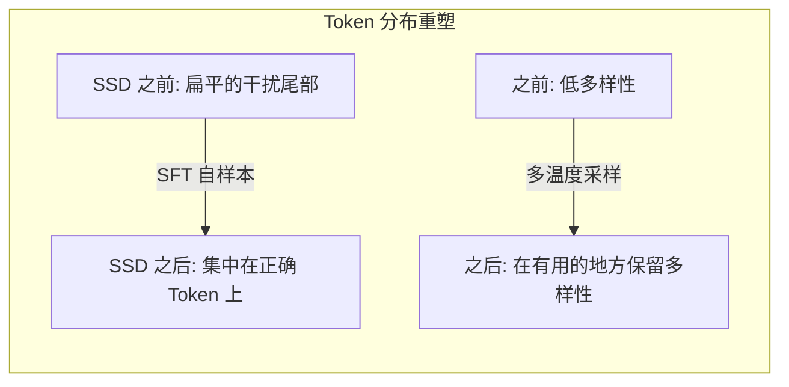

# Day 09: 简单自蒸馏（SSD）-- 无需验证器或 RL 即可提升代码生成能力

> **观看动画**: <video src="https://raw.githubusercontent.com/Playitcooool/advanced-ai-daily/main/videos/09-self-distillation.webm" autoplay loop muted playsinline width="800"></video>

---

## 一句话总结

简单自蒸馏（SSD）在精心选择的温度和截断设置下对模型自身输出进行采样，然后通过标准的监督微调（SFT）来改善代码生成——Qwen3-30B-Instruct 在 LiveCodeBench v6 上的 pass@1 从 42.4% 跃升至 55.3%，整个过程不需要任何验证器、教师模型或强化学习。

---

## 为什么重要

### 后训练技术的军备竞赛

最近 LLM 后训练的大部分进展依赖复杂的流水线：
- **RLHF/RLVR**：需要奖励模型、偏好数据和仔细的奖励设计
- **带验证器的自提升**：依赖可执行的测试用例或外部验证器
- **师生蒸馏**：需要更强的模型来生成高质量数据

SSD 提出的基本问题是：*模型能否仅凭自身的原始输出，不借助任何外部信号来提升代码生成能力？*

### 精度-探索冲突

SSD 的核心洞察是 LLM 解码中存在一个**精度-探索冲突**：

在代码生成的每个 Token 位置，模型面临两个相互竞争的需求：
- **精度**：对于语法关键的 Token（关键字、运算符、括号），模型必须输出完全正确的 Token
- **探索**：对于语义选择（算法思路、变量命名、逻辑分支），模型受益于多样化的采样

单一温度设置无法同时满足两者。高温提升探索但破坏关键 Token 的精度。低温确保精度但扼杀有用的多样性。

### SSD 如何解决这一冲突

SSD 通过**在多种温度和截断设置下采样**来解决冲突，创建一个多样但有质量保证的数据集：

1. **广泛采样**：对每个问题使用不同的温度和 top-p/截断配置生成 N 个解
2. **隐式质量过滤**：高温采样自然地将概率集中在较简单问题上正确的补全上，而较难问题得益于探索
3. **混合微调**：对这批自生成数据进行标准 SFT，以上下文感知的方式重塑 Token 分布

$$
D_{\text{SSD}} = \bigcup_{j=1}^{M} \left\{ \text{sample}(x_i; T_j, p_j) \right\}_{i=1}^{N_{\text{problems}}}
$$

$$
\theta_{\text{SSD}} = \arg\max_\theta \sum_{(x, y) \in D_{\text{SSD}}} \log p_\theta(y | x)
$$

经过一轮 SFT 后，模型的 Token 分布被重塑：
- 在需要精度的地方抑制了干扰尾部
- 在需要探索的地方保留了有用的多样性

---

## 架构详解





---

## 数学公式

### 精度-探索权衡

考虑一个代码生成问题，输入 x，目标解 y*。LLM 在每步 t 产生 Token 分布 p(y_t | y_{<t}, x)。

我们可以将 Token 位置分解为两个集合：
- **精度 Token** P：只有一个或少数 Token 可接受的位置（语法关键位置）
- **探索 Token** E：多个有效延续共存的位置（语义/逻辑选择）

使用单一温度 T，softmax 输出为：

$$
p_T(y_t) = \frac{\exp(z_{y_t} / T)}{\sum_{v} \exp(z_v / T)}
$$

最优温度 T* 应该：
- 对 P 中的 Token 设 T -> 0（确定性精度）
- 对 E 中的 Token 设 T 较高（保持有用的多样性）

由于我们无法根据 Token 位置类型来调节 T，因此得到的是次优行为。然而，通过在多个温度下采样：

$$
\{y^{(j)} \sim p_{T_j}(y | x)\}_{j=1}^M
$$

这些样本的并集创建了一个隐式捕获两种机制的训练分布。SFT 目标随后学会：

$$
\nabla_\theta \mathcal{L}_{\text{SSD}} = -\sum_{j} \sum_t \nabla_\theta \log p_\theta(y^{(j)}_t | y^{(j)}_{<t}, x)
$$

这个梯度将模型推向在多种温度设置下都出现的模式，实际上实现了一种**共识蒸馏**。

### 为什么自采样有效

考虑一个模型 pass@N（N 次采样）已经非平庸的问题。根据构造，部分自生成的样本是正确的。对这个混合进行 SFT：

1. **放大正确模式**：正确的解在不同温度设置下多次出现，因此其 Token 序列接收到更强的梯度更新
2. **抑制干扰项**：错误的样本是多样的，不会互相强化，因此它们的梯度信号相互抵消
3. **上下文感知重塑**：模型学会*何时*精确（所有温度一致的地方）和*何时*探索（温度不同但仍产生有效代码的地方）

形式上，训练后的期望 pass@1：

$$
\mathbb{E}[\text{pass@1}_{\text{post}}] \approx \mathbb{E}[\text{pass@1}_{\text{pre}}] + \alpha \cdot \text{pass@N}_{\text{pre}} \cdot (1 - \text{pass@1}_{\text{pre}})
$$

其中 alpha 捕获训练效率因子。当以下情况时增益最大：
- pass@N 非平庸（模型*能*解决问题，只是不可靠）
- pass@1 远非 1.0（有提升空间）

这解释了为什么 SSD 的增益集中在更难的问题上。

---

## 实验结果摘要

| 模型 | SSD 前 pass@1 | SSD 后 pass@1 | 绝对增益 |
|------|-------------|-------------|---------|
| Qwen3-30B-Instruct | 42.4% | **55.3%** | +12.9% |
| Qwen3-8B-Instruct | 基线 | **+9-11%** | +9-11% |
| Qwen3-4B-Instruct | 基线 | **+8-10%** | +8-10% |
| Llama 系列 (4B-30B) | 基线 | **+6-10%** | +6-10% |

关键发现：
- **无需验证器**：不像自提升方法需要通过执行 pass/fail 来过滤
- **无需教师模型**：从自身蒸馏
- **无需 RL**：标准 SFT 即可
- **增益集中在更难的问题上**：pass@N > pass@1 的差距是自样本最有价值的地方
- **跨模型家族泛化**：对 Qwen 和 Llama 都有效
- **所有规模都有效**：4B、8B 和 30B 都观测到了增益
- **对 instruct 和 thinking 变体都有效**

---

## 后训练方法对比

| 方法 | 外部信号 | 复杂度 | 数据来源 | 代码能力典型增益 |
|------|---------|-------|---------|----------------|
| **SSD (本文)** | **无** | **低** | **自生成** | **+8 到 +13%** |
| RLVR (带验证器) | 可执行测试 | 高 | 自生成 + 过滤 | +10 到 +15% |
| 师生蒸馏 | 更强模型 | 中 | 教师生成 | +5 到 +12% |
| 自提升 (STaR) | 验证器/过滤器 | 中 | 自生成 + 过滤 | +5 到 +10% |
| RLHF (偏好) | 人类/AI 偏好 | 高 | 偏好对 | +2 到 +5% |
| 标准 SFT | 标注数据 | 低 | 外部数据集 | +0 到 +5% |

---

## Python 代码实现

```python
import torch
import torch.nn as nn
import torch.nn.functional as F
from dataclasses import dataclass, field
from typing import Optional, Callable


# ------------------------------------------------------------------
# 1. 多温度采样器（自样本生成器）
# ------------------------------------------------------------------

@dataclass
class SampleConfig:
    """单个温度/top-p 配置。"""
    temperature: float
    top_p: float = 1.0
    max_new_tokens: int = 1024
    num_return_sequences: int = 4


class SelfDistillationSampler:
    """
    在多种温度和截断设置下生成自样本。

    SSD 的核心洞察：不同的温度配置捕获模型能力的不同方面——
    低温度捕获精度关键的 Token，高温度启用多样化解法路径的探索。

    论文: arXiv:2604.01193 (Simple Self-Distillation Improves Code Generation)
    """

    def __init__(
        self,
        model: nn.Module,
        tokenizer,
        configs: Optional[list[SampleConfig]] = None,
        device: str = "cuda",
    ):
        """
        参数:
            model: 基础 LLM（采样期间冻结）。
            tokenizer: 带有 encode/decode 方法的分词器。
            configs: 温度/top-p 配置列表。
            device: 采样运行设备。
        """
        self.model = model
        self.tokenizer = tokenizer
        self.device = device
        self.configs = configs or [
            SampleConfig(temperature=0.3, top_p=1.0, num_return_sequences=2),
            SampleConfig(temperature=0.7, top_p=0.95, num_return_sequences=4),
            SampleConfig(temperature=1.0, top_p=0.95, num_return_sequences=4),
            SampleConfig(temperature=1.2, top_p=0.90, num_return_sequences=4),
        ]

    @torch.no_grad()
    def sample(
        self,
        prompts: list[str],
    ) -> list[tuple[str, str]]:
        """
        为一系列代码生成提示生成自样本。

        参数:
            prompts: 问题描述/文档字符串列表。

        返回:
            pairs: (提示, 生成的解) 元组列表。
        """
        all_pairs: list[tuple[str, str]] = []

        for config in self.configs:
            for prompt in prompts:
                input_ids = self.tokenizer.encode(prompt, return_tensors="pt")
                input_ids = input_ids.to(self.device)

                # 为 num_return_sequences 重复输入
                input_ids = input_ids.repeat(config.num_return_sequences, 1)

                outputs = self.model.generate(
                    input_ids,
                    max_new_tokens=config.max_new_tokens,
                    temperature=config.temperature,
                    top_p=config.top_p,
                    do_sample=True,
                    num_return_sequences=1,
                )

                for output in outputs:
                    generated = self.tokenizer.decode(
                        output[input_ids.shape[1]:],
                        skip_special_tokens=True,
                    )
                    all_pairs.append((prompt, generated))

        return all_pairs


# ------------------------------------------------------------------
# 2. SSD 微调数据集
# ------------------------------------------------------------------

class SSDDataset(torch.utils.data.Dataset):
    """
    SSD 微调数据集。

    每个样本是一个 (提示, 自生成解) 对。
    损失是条件于提示的标准语言建模损失。
    """

    def __init__(
        self,
        pairs: list[tuple[str, str]],
        tokenizer,
        max_length: int = 2048,
    ):
        self.pairs = pairs
        self.tokenizer = tokenizer
        self.max_length = max_length

    def __len__(self):
        return len(self.pairs)

    def __getitem__(self, idx):
        prompt, solution = self.pairs[idx]
        full_text = f"{prompt}\n{solution}"

        encoded = self.tokenizer.encode(
            full_text,
            max_length=self.max_length,
            truncation=True,
            return_tensors="pt",
        ).squeeze(0)

        # 创建标签: 掩码提示部分，只对解的部分计算损失
        prompt_encoded = self.tokenizer.encode(
            prompt, max_length=self.max_length, truncation=True
        )
        prompt_len = len(prompt_encoded)

        labels = encoded.clone()
        labels[:prompt_len] = -100  # 忽略提示部分

        return {"input_ids": encoded, "labels": labels}


# ------------------------------------------------------------------
# 3. SSD 微调循环
# ------------------------------------------------------------------

def ssd_fine_tune(
    model: nn.Module,
    train_dataset: SSDDataset,
    learning_rate: float = 2e-5,
    batch_size: int = 4,
    num_epochs: int = 1,
    device: str = "cuda",
    gradient_accumulation_steps: int = 4,
) -> dict[str, list[float]]:
    """
    使用标准 SFT 对自生成样本进行微调。

    参数:
        model: 待微调的基础 LLM。
        train_dataset: (提示, 解) 对的数据集。
        learning_rate: AdamW 学习率。
        batch_size: 单设备批量大小。
        num_epochs: 微调轮数。
        device: 训练设备。
        gradient_accumulation_steps: 梯度累积步数。

    返回:
        history: 包含每步训练损失的字典。
    """
    model.train()
    model.to(device)

    optimizer = torch.optim.AdamW(model.parameters(), lr=learning_rate)
    dataloader = torch.utils.data.DataLoader(
        train_dataset, batch_size=batch_size, shuffle=True, drop_last=True
    )

    history: dict[str, list[float]] = {"loss": []}
    global_step = 0

    for epoch in range(num_epochs):
        total_loss = 0.0
        optimizer.zero_grad()

        for step, batch in enumerate(dataloader):
            input_ids = batch["input_ids"].to(device)
            labels = batch["labels"].to(device)
            attn_mask = (input_ids != 0).long().to(device)

            outputs = model(
                input_ids=input_ids,
                attention_mask=attn_mask,
                labels=labels,
            )
            loss = outputs.loss / gradient_accumulation_steps
            loss.backward()
            total_loss += loss.item() * gradient_accumulation_steps

            if (step + 1) % gradient_accumulation_steps == 0:
                optimizer.step()
                optimizer.zero_grad()
                loss_per_step = total_loss / gradient_accumulation_steps
                history["loss"].append(loss_per_step)
                total_loss = 0.0
                global_step += 1

                if global_step % 50 == 0:
                    avg_loss = sum(history["loss"][-50:]) / 50
                    print(f"  步骤 {global_step}: 平均损失 = {avg_loss:.4f}")

    return history


# ------------------------------------------------------------------
# 4. 端到端 SSD 流水线
# ------------------------------------------------------------------

class SimpleSelfDistillation:
    """
    端到端简单自蒸馏流水线。

    用法:
        ssd = SimpleSelfDistillation(model, tokenizer)
        ssd.run(prompts)  # 采样 -> SFT -> 改进的模型

    论文: arXiv:2604.01193
    """

    def __init__(
        self,
        model: nn.Module,
        tokenizer,
        device: str = "cuda",
        sample_configs: Optional[list[SampleConfig]] = None,
    ):
        self.model = model
        self.tokenizer = tokenizer
        self.device = device
        self.sampler = SelfDistillationSampler(
            model, tokenizer, configs=sample_configs, device=device
        )

    def run(
        self,
        prompts: list[str],
        learning_rate: float = 2e-5,
        batch_size: int = 4,
        num_epochs: int = 1,
        gradient_accumulation_steps: int = 4,
    ) -> dict:
        """
        运行完整的 SSD 流水线。

        参数:
            prompts: 用于自采样的代码生成提示。
            learning_rate: 微调学习率。
            batch_size: 微调批量大小。
            num_epochs: 微调轮数。
            gradient_accumulation_steps: 梯度累积。

        返回:
            results: 包含训练历史和样本数的字典。
        """
        print("阶段 1: 在多种温度下自采样...")
        pairs = self.sampler.sample(prompts)
        print(f"  生成了 {len(pairs)} 个自样本")

        print("阶段 2: 构建 SSD 数据集...")
        dataset = SSDDataset(pairs, self.tokenizer)
        print(f"  数据集大小: {len(dataset)}")

        print("阶段 3: 自蒸馏微调（标准 SFT）...")
        history = ssd_fine_tune(
            self.model,
            dataset,
            learning_rate=learning_rate,
            batch_size=batch_size,
            num_epochs=num_epochs,
            device=self.device,
            gradient_accumulation_steps=gradient_accumulation_steps,
        )

        print("阶段 4: 完成。模型通过自蒸馏得到提升。")
        return {
            "n_samples": len(pairs),
            "history": history,
        }


# ------------------------------------------------------------------
# 5. 玩具模型的完整示例
# ------------------------------------------------------------------

class TinyCodeLM(nn.Module):
    """极小的语言模型，用于演示 SSD 流水线。"""

    def __init__(self, vocab_size: int = 1000, dim: int = 64, layers: int = 2):
        super().__init__()
        self.embed = nn.Embedding(vocab_size, dim)
        self.blocks = nn.ModuleList([
            nn.Sequential(
                nn.LayerNorm(dim),
                nn.Linear(dim, dim * 4),
                nn.GELU(),
                nn.Linear(dim * 4, dim),
            ) for _ in range(layers)
        ])
        self.head = nn.Linear(dim, vocab_size)

    def forward(self, x, attention_mask=None, labels=None):
        h = self.embed(x)
        for block in self.blocks:
            h = h + block(h)
        logits = self.head(h)

        if labels is not None:
            loss_fn = nn.CrossEntropyLoss(ignore_index=-100)
            loss = loss_fn(logits.view(-1, logits.size(-1)), labels.view(-1))
            return type("Output", (), {"loss": loss, "logits": logits})()
        return logits


class DummyTokenizer:
    """用于演示的最小分词器。"""

    def __init__(self, vocab_size: int = 1000):
        self.vocab_size = vocab_size

    def encode(self, text: str, return_tensors=None, max_length=None,
               truncation=False, padding=False):
        ids = [(ord(c) % self.vocab_size) + 1 for c in text[:max_length or 128]]
        if not ids:
            ids = [0]
        if return_tensors == "pt":
            return torch.tensor([ids])
        return ids

    def decode(self, ids, skip_special_tokens=False):
        chars = [chr((i - 1) % 126 + 1) for i in ids.tolist()
                 if hasattr(ids, "tolist") and i > 0]
        return "".join(chars)


if __name__ == "__main__":
    torch.manual_seed(42)

    # 创建一个极小模型
    model = TinyCodeLM(vocab_size=1000, dim=64, layers=2)
    tokenizer = DummyTokenizer()

    # 玩具代码生成提示
    prompts = [
        "# Python: 计算斐波那契的函数\ndef fibonacci(n):",
        "# Python: 检查回文的函数\ndef is_palindrome(s):",
        "# Python: 计算最大公约数的函数\ndef gcd(a, b):",
    ]

    # 运行 SSD 流水线
    ssd = SimpleSelfDistillation(
        model=model,
        tokenizer=tokenizer,
        device="cpu",
        sample_configs=[
            SampleConfig(temperature=0.3, top_p=1.0, num_return_sequences=1,
                         max_new_tokens=16),
            SampleConfig(temperature=0.7, top_p=0.95, num_return_sequences=1,
                         max_new_tokens=16),
            SampleConfig(temperature=1.0, top_p=0.95, num_return_sequences=1,
                         max_new_tokens=16),
        ],
    )

    result = ssd.run(
        prompts,
        learning_rate=1e-3,
        batch_size=2,
        num_epochs=1,
    )

    print(f"\n结果: 生成了 {result['n_samples']} 个样本")
    print(f"训练损失: {result['history']['loss'][:5]}...")
```

---

## 代码详解

### 步骤 1: 多温度自采样

```python
configs = [
    SampleConfig(temperature=0.3, top_p=1.0),   # 精度导向
    SampleConfig(temperature=0.7, top_p=0.95),  # 平衡
    SampleConfig(temperature=1.0, top_p=0.95),  # 探索导向
    SampleConfig(temperature=1.2, top_p=0.90),  # 高度探索
]
```

每个配置捕获不同的行为：
- **低温度 (0.3)**：高置信度 Token 占主导。捕获语法正确但可能是模板化的解法
- **中温度 (0.7-1.0)**：精确度和多样性的平衡。捕获最广泛的正确解法
- **高温度 (1.2)**：更多创造性/替代性方法。有些不正确，但捕获了低温度下模型不会产生出的解法

### 步骤 2: 带提示掩码的数据集构建

```python
labels[:prompt_len] = -100  # 不对提示部分计算损失
```

只有自生成的解法部分贡献损失。这实现了标准的指令微调格式，模型学会完成提示而不是重建它。

### 步骤 3: SFT 重塑 Token 分布

微调步骤是纯粹的交叉熵。没有奖励建模，没有 GRPO，没有 DPO。魔法完全在数据中：

- 正确的自采样出现更频繁（它们在多种温度下都稳定）
- 错误的样本是噪声且多样的（它们的信号互相抵消）
- 模型学会上下文感知的精度：*哪里*该收敛，*哪里*该保持多样性

---

## 为什么这很重要

SSD 挑战了 LLM 改进需要越来越复杂的后训练的普遍假设：**不需要验证器、不需要教师模型、不需要 RL**。它的原理在于：模型的能力已经分布在其采样分布中——SSD 仅通过对多温度自样本的一轮 SFT 就将其集中起来。

论文中指出的关键限制：
- 当模型已有非平庸的 pass@N 性能时效果最佳
- 一轮之后增益衰减（模型收敛到自身的共识）
- pass@N 接近零的极难问题受益较少（没有正确的样本来放大）

---

## 延伸阅读

- **SSD 论文**: [arXiv:2604.01193](https://arxiv.org/abs/2604.01193) -- Embarrassingly Simple Self-Distillation Improves Code Generation
- **STaR (Self-Taught Reasoner)**: [arXiv:2203.14465](https://arxiv.org/abs/2203.14465) -- 用自生成的推理引导提升推理能力
- **ReST**: [arXiv:2308.08998](https://arxiv.org/abs/2308.08998) -- Reward-guided Self-Training
- **GRPO (Day 01)**: [arXiv:2402.03300](https://arxiv.org/abs/2402.03300) -- Group Relative Policy Optimization（不需要 critic，但需要奖励信号）
