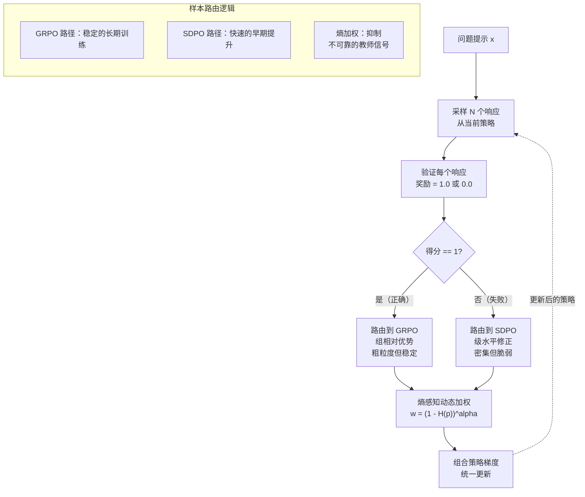
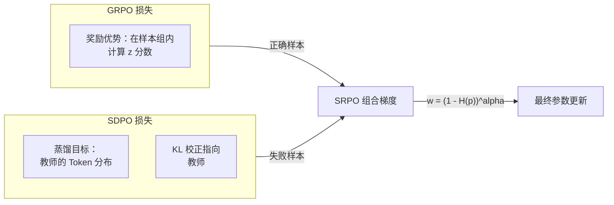

# Day 10: 样本路由策略优化（SRPO）-- 统一 GRPO 与自蒸馏

> **观看动画**: <video src="https://raw.githubusercontent.com/Playitcooool/advanced-ai-daily/main/videos/10-srpo.webm" autoplay loop muted playsinline width="800"></video>

---

## 一句话总结

SRPO 将 GRPO（带可验证奖励的强化学习）与自蒸馏统一到一个在策略框架中，将正确样本路由到 GRPO 的组相对更新，将失败样本路由到 SDPO 的目标级修正，实现比 GRPO 更快的早期提升和超越 SDPO 的长期稳定性——在 Qwen3-8B 上五个数学推理基准上超越 GRPO 3.4%。

---

## 为什么重要

### 在同策略 RL 中的两个极端

我们已经了解过两种互补的 LLM 策略优化方法：

**GRPO**（Day 01）：在每组采样内使用组相对优势估计。对每个问题提示，采样 N 个响应，用可验证奖励评分，然后在组内将优势计算为 z 分数：

$$
A_i = \frac{r_i - \text{mean}(r_1, \ldots, r_N)}{\text{std}(r_1, \ldots, r_N)}
$$

GRPO 的优势：长期训练稳定，无需 critic 网络。
GRPO 的劣势：粗粒度信用分配。失败的回滚对每个 Token 都施加相同的负优势，即使只有少数令牌导致了错误。

**自蒸馏**（Day 09）：在多种温度下采样模型自身的输出，然后通过标准 SFT 微调。正确的样本通过在不同温度下的重复出现被强化。

自蒸馏的优势：快速早期提升，密集的 Token 级监督。
自蒸馏的劣势：在长期训练期间会崩溃，因为（1）在已正确样本上的自蒸馏会产生优化模糊，（2）自教师信号的可靠性会随着训练逐步退化。

### 统一洞察

SRPO 观察到**正确和失败的样本需要根本不同的处理方式**：

- **正确样本**：已经知道*应该生成什么*。问题是*信用分配*——哪些 Token 是关键？GRPO 的奖励对齐强化非常适合这一点。
- **失败样本**：知道*不该生成什么*。问题是*目标修正*——究竟是哪些 Token 导致了失败？SDPO 的级水平监督直接修复不正确的预测。

SRPO 的形式化为：

$$
\mathcal{L}_{\text{SRPO}} = \sum_{i \in \text{correct}} \mathcal{L}_{\text{GRPO}}^{(i)} + \sum_{j \in \text{failed}} \mathcal{L}_{\text{SDPO}}^{(j)}
$$

带熵感知动态加权：

$$
w_j = (1 - H(p_j))^\alpha
$$

其中 $H(p_j)$ 是蒸馏教师输出的熵，因此高熵（不太可靠）的目标会被降权，而置信度高的目标会被加权。

---

## 架构详解





---

## 数学公式

### GRPO 损失（用于正确样本）

对每个包含 $N$ 个采样输出的问题，计算奖励 $r_1, \ldots, r_N$ 和组相对优势：

$$
A_i = \frac{r_i - \mu_r}{\sigma_r}, \quad \text{其中 } \mu_r = \frac{1}{N}\sum_{i=1}^{N} r_i
$$

GRPO 策略梯度为：

$$
\mathcal{L}_{\text{GRPO}} = -\mathbb{E}_{x \sim \mathcal{D}, (o_i)_{i=1}^N \sim \pi_{\theta_{\text{old}}}(\cdot | x)} \left[ \frac{1}{N} \sum_{i=1}^{N} L_i^{\text{GRPO}} \right]
$$

$$
L_i^{\text{GRPO}} = \frac{1}{|o_i|} \sum_{t=1}^{|o_i|} \left[ \frac{\pi_\theta(o_{i,t} | x, o_{i,<t})}{\pi_{\theta_{\text{old}}}(o_{i,t} | x, o_{i,<t})} A_i - \beta \text{KL}(\pi_\theta \| \pi_{\text{ref}}) \right]
$$

### SDPO 损失（用于失败样本）

对 top-$k$ 不正确样本（按质量得分），使用得分最高的样本作为教师：

$$
\mathcal{L}_{\text{SDPO}} = \mathbb{E}_{(x, o^{\text{fail}}) \sim D_{\text{fail}}} \left[ \sum_{t=1}^{|o^{\text{fail}}|} \text{CE}(p_t^{\text{teacher}}, \pi_\theta(\cdot | x, o^{\text{fail}}_{<t})) \right]
$$

其中 $p_t^{\text{teacher}}$ 是教师模型在位置 $t$ 的 Token 分布，CE 是交叉熵。

### 熵感知动态加权

教师输出的熵衡量信号可靠性：

$$
H(p) = -\sum_v p(v) \log p(v)
$$

高熵教师不确定——其信号不可靠。低熵教师置信度高——其修正可信赖。

$$
w = (1 - H_{\text{norm}})^\alpha
$$

其中 $H_{\text{norm}} = H(p) / \log |V|$ 归一化到 [0, 1]，$\alpha$ 控制激进程度（典型值 $\alpha \in [0.5, 2.0]$）。

### SRPO 统一损失

设 $D_{\text{corr}}$ 为正确样本，$D_{\text{fail}}$ 为失败样本：

$$
\mathcal{L}_{\text{SRPO}} = \mathbb{E}_{x} \left[ \underbrace{\sum_{i \in D_{\text{corr}}} \mathcal{L}_{\text{GRPO}}^{(i)}}_{\text{强化正确}} + \underbrace{\sum_{j \in D_{\text{fail}}} w_j \cdot \mathcal{L}_{\text{SDPO}}^{(j)}}_{\text{用熵加权修正失败}} \right]
$$

这结合了两种方法的最优：
- 正确样本获得 GRPO 强化：「哪里对了，就强化它」
- 失败样本获得 SDPO 修正：「修复具体的错误 Token」
- 熵加权防止 SDPO 在教师不确定时导致退化

---

## RLVR 方法对比

| 方法 | 早期提升 | 晚期稳定性 | 信用分配 | 信号可靠性 | 计算成本 |
|------|---------|-----------|---------|-----------|---------|
| **SRPO** | **快** | **高** | **自适应** | **熵门控** | **基线** |
| GRPO | 慢 | 高 | 粗粒度（组级） | 基于奖励 | 基线 |
| SDPO | 快 | 低（崩溃） | 细粒度（级水平） | 随时间退化 | 基线 |
| PPO | 中等 | 高 | Token 级（critic） | 依赖 critic | +critic 成本 |
| DPO | N/A（离线） | N/A | N/A | 依赖偏好数据 | N/A |

SRPO 实现了 SDPO 的快速早期收敛和 GRPO 的长期稳定性，同时不添加 critic 网络或偏好数据。

---

## 关键贡献

1. **统一**：首次正式将组相对 RL（GRPO）与自蒸馏（SDPO）连接在同一个优化目标内
2. **样本路由**：理论分析表明正确和失败样本需要根本不同的优化策略
3. **熵感知加权**：动态机制自动抑制噪声蒸馏目标，无需手动阈值
4. **实验结果**：在 Qwen3-8B 上超越 GRPO 3.4%，超越 SDPO 6.3%，单步计算成本降低 17.2%

---

## Python 代码实现

```python
import torch
import torch.nn as nn
import torch.nn.functional as F
from dataclasses import dataclass
from typing import Optional


# ------------------------------------------------------------------
# 1. GRPO 优势计算（回顾 Day 01）
# ------------------------------------------------------------------

def grpo_advantages(rewards: torch.Tensor) -> torch.Tensor:
    """
    计算组相对优势估计。

    参数:
        rewards: 每个样本的奖励得分张量。

    返回:
        advantages: z 分数标准化的优势。
    """
    group_mean = rewards.mean()
    group_std = rewards.std(unbiased=False) + 1e-8
    return (rewards - group_mean) / group_std


def grpo_loss(
    log_probs: torch.Tensor,
    old_log_probs: torch.Tensor,
    advantages: torch.Tensor,
    ref_log_probs: Optional[torch.Tensor] = None,
    beta: float = 0.01,
    clip_epsilon: float = 0.2,
) -> torch.Tensor:
    """
    计算 GRPO 策略梯度损失。

    参数:
        log_probs: 当前策略对数概率，形状 (n_tokens,)。
        old_log_probs: 旧策略对数概率，形状 (n_tokens,)。
        advantages: 每次回滚的优势，形状 (n_rollouts,)。
        ref_log_probs: 参考模型对数概率用于 KL 惩罚。
        beta: KL 惩罚系数。
        clip_epsilon: PPO 风格裁剪 epsilon。

    返回:
        loss: 标量 GRPO 损失。
    """
    ratio = (log_probs - old_log_probs).exp()
    clipped = ratio.clamp(1 - clip_epsilon, 1 + clip_epsilon)

    pg_loss = -torch.min(ratio * advantages, clipped * advantages).mean()

    kl_loss = torch.tensor(0.0, device=log_probs.device)
    if ref_log_probs is not None:
        kl_penalty = (ref_log_probs - log_probs).mean()
        kl_loss = beta * kl_penalty

    return pg_loss + kl_loss


# ------------------------------------------------------------------
# 2. SDPO 损失（自蒸馏策略优化）
# ------------------------------------------------------------------

def sdpo_loss(
    student_logits: torch.Tensor,
    teacher_logits: torch.Tensor,
    mask: Optional[torch.Tensor] = None,
    temperature: float = 1.0,
) -> torch.Tensor:
    """
    计算自蒸馏策略优化损失。

    这是一个交叉熵损失，目标是教师模型的 Token 分布（来自最高分的自样本）。

    参数:
        student_logits: 当前学生对数概率，形状 (n_tokens, vocab_size)。
        teacher_logits: 教师模型对数概率，形状 (n_tokens, vocab_size)。
        mask: 有效 Token 掩码，形状 (n_tokens,)。
        temperature: 蒸馏温度。

    返回:
        loss: 标量 SDPO 损失。
    """
    student_dist = F.log_softmax(student_logits / temperature, dim=-1)
    teacher_dist = F.softmax(teacher_logits / temperature, dim=-1)

    # 基于 KL 散度的蒸馏: sum teacher_dist * log(student_dist)
    per_token_kl = F.kl_div(student_dist, teacher_dist, reduction="none").sum(-1)

    if mask is not None:
        per_token_kl = per_token_kl[mask]

    return per_token_kl.mean()


# ------------------------------------------------------------------
# 3. 熵感知动态加权
# ------------------------------------------------------------------

def entropy_weight(
    teacher_logits: torch.Tensor,
    alpha: float = 1.0,
) -> torch.Tensor:
    """
    计算蒸馏信号的熵感知动态权重。

    高熵教师（不确定）获得更低权重；
    置信度高的教师获得更高权重。

    参数:
        teacher_logits: 教师对数概率，形状 (..., vocab_size)。
        alpha: 加权激进程度参数。

    返回:
        weight: 标量权重，范围 [0, 1]。
    """
    teacher_dist = F.softmax(teacher_logits, dim=-1)
    # 熵 H(p) = -sum p(x) log p(x)
    entropy = -(teacher_dist * (teacher_dist + 1e-10).log()).sum(-1)

    # 归一化到 [0, 1]，除以 log(vocab_size)
    vocab_size = teacher_logits.shape[-1]
    max_entropy = torch.log(torch.tensor(float(vocab_size)))
    norm_entropy = entropy / max_entropy

    # 权重 = (1 - H_norm)^alpha
    weight = (1.0 - norm_entropy) ** alpha

    return weight.mean()  # 在 Token 上取平均


# ------------------------------------------------------------------
# 4. 样本路由与 SRPO 组合损失
# ------------------------------------------------------------------

@dataclass
class SampleRoute:
    """持有正确和失败样本用于路由。"""
    correct: list[int]
    failed: list[int]


def route_samples(rewards: torch.Tensor) -> SampleRoute:
    """
    将样本路由到 GRPO（正确）或 SDPO（失败）路径。

    参数:
        rewards: 每个样本的二元奖励（1.0 = 正确, 0.0 = 失败）。

    返回:
        route: SampleRoute，包含每条路径的索引。
    """
    correct_idx = [i for i, r in enumerate(rewards) if r > 0.5]
    failed_idx = [i for i, r in enumerate(rewards) if r <= 0.5]
    return SampleRoute(correct=correct_idx, failed=failed_idx)


def srpo_loss(
    # GRPO 输入（用于正确样本）
    correct_log_probs: torch.Tensor,
    correct_old_log_probs: torch.Tensor,
    correct_advantages: torch.Tensor,
    # SDPO 输入（用于失败样本）
    failed_student_logits: torch.Tensor,
    failed_teacher_logits: torch.Tensor,
    failed_mask: torch.Tensor,
    # 超参数
    beta: float = 0.01,
    alpha: float = 1.0,
    grpo_scale: float = 1.0,
    sdpo_scale: float = 1.0,
) -> tuple[torch.Tensor, dict]:
    """
    计算统一的 SRPO 损失。

    这是核心贡献：正确样本获得 GRPO 强化，
    失败样本获得熵加权 SDPO 修正。

    参数:
        correct_log_probs: 正确样本上的学生对数概率。
        correct_old_log_probs: 正确样本上的旧策略对数概率。
        correct_advantages: 正确样本的 GRPO 优势。
        failed_student_logits: 失败样本上的学生对数概率。
        failed_teacher_logits: 失败样本上的教师（最优样本）对数概率。
        failed_mask: 失败样本的有效 Token 掩码。
        beta: GRPO 的 KL 惩罚。
        alpha: 熵加权指数。
        grpo_scale: GRPO 损失缩放因子。
        sdpo_scale: SDPO 损失缩放因子。

    返回:
        loss: 组合标量损失。
        metrics: 包含各分量损失和权重的字典。
    """
    # 正确样本的 GRPO 分量
    g_loss = grpo_loss(
        correct_log_probs, correct_old_log_probs,
        correct_advantages, beta=beta
    ) * grpo_scale

    # 失败样本的熵感知权重
    w = entropy_weight(failed_teacher_logits, alpha=alpha)

    # 失败样本的 SDPO 分量
    s_loss = sdpo_loss(failed_student_logits, failed_teacher_logits,
                       mask=failed_mask)

    # 组合损失
    total_loss = g_loss + w * s_loss * sdpo_scale

    return total_loss, {
        "grpo_loss": g_loss.item(),
        "sdpo_loss": s_loss.item(),
        "entropy_weight": w.item(),
        "total_loss": total_loss.item(),
    }


# ------------------------------------------------------------------
# 5. 端到端 SRPO 训练步骤
# ------------------------------------------------------------------

class SRPOTrainer:
    """
    样本路由策略优化训练器。

    通过将正确样本路由到组相对强化，失败样本路由到概率级修正，
    统一 GRPO 和自蒸馏。

    论文: arXiv:2604.02288
    """

    def __init__(
        self,
        model: nn.Module,
        ref_model: nn.Module,
        temperature: float = 0.7,
        group_size: int = 4,
        beta: float = 0.01,
        alpha: float = 1.0,
        learning_rate: float = 1e-6,
        clip_epsilon: float = 0.2,
        device: str = "cuda",
    ):
        self.model = model
        self.ref_model = ref_model
        self.temperature = temperature
        self.group_size = group_size
        self.beta = beta
        self.alpha = alpha
        self.clip_epsilon = clip_epsilon
        self.device = device

        self.optimizer = torch.optim.AdamW(model.parameters(), lr=learning_rate)

    def generate_samples(self, prompts: list[str], group_size: int) -> list:
        """
        每个提示生成 group_size 个响应。

        返回 (提示, 响应文本, 奖励) 元组列表。
        """
        samples = []
        # 占位符：在此处集成模型的 generate 方法
        # 为演示，返回模拟数据
        for prompt in prompts:
            for _ in range(group_size):
                response = f"mock_response_for_{prompt[:10]}"
                reward = 1.0 if len(response) > 15 else 0.0  # 模拟奖励
                samples.append((prompt, response, reward))
        return samples

    def compute_log_probs(self, prompts, responses):
        """获取当前和旧策略下的对数概率。"""
        # 占位符：集成分词 + 前向传播
        # 实践中：分词 -> 模型前向传播 -> 获取对数概率
        batch_logits = torch.randn(len(prompts) * len(responses), 100)
        log_probs = F.log_softmax(batch_logits, dim=-1)
        return log_probs

    def training_step(self, prompts: list[str]) -> dict:
        """
        执行一次 SRPO 训练步骤。

        参数:
            prompts: 问题提示批次。

        返回:
            metrics: 此步骤的训练指标。
        """
        # 步骤 1: 从当前策略采样
        samples = self.generate_samples(prompts, self.group_size)
        rewards = torch.tensor([s[2] for s in samples], device=self.device)

        # 步骤 2: 路由样本
        route = route_samples(rewards)

        if not route.correct and not route.failed:
            return {"status": "no_samples", "loss": 0.0}

        # 计算对数概率（模拟实现）
        all_log_probs = self.compute_log_probs(
            [s[0] for s in samples], [s[1] for s in samples]
        )

        # 步骤 3: 正确样本的 GRPO
        total_loss = torch.tensor(0.0, device=self.device, requires_grad=True)
        metrics = {}

        if route.correct:
            correct_rewards = rewards[route.correct]
            advantages = grpo_advantages(correct_rewards)
            g_loss = grpo_loss(
                log_probs=all_log_probs[route.correct].flatten(),
                old_log_probs=all_log_probs[route.correct].flatten(),
                advantages=advantages,
                beta=self.beta,
                clip_epsilon=self.clip_epsilon,
            )
            total_loss = total_loss + g_loss
            metrics["grpo_loss"] = g_loss.item()

        # 步骤 4: 失败样本的 SDPO（带熵加权）
        if route.failed:
            # 教师 = 得分最高的失败样本（尽力修正）
            best_failed_idx = max(route.failed)
            student_logits = all_log_probs[route.failed]
            teacher_logits = all_log_probs[best_failed_idx:best_failed_idx+1]

            w = entropy_weight(teacher_logits, alpha=self.alpha)
            s_loss = sdpo_loss(
                student_logits.flatten(0, 1),
                teacher_logits.flatten(0, 1),
            )

            total_loss = total_loss + w * s_loss
            metrics["sdpo_loss"] = s_loss.item()
            metrics["entropy_weight"] = w.item()

        # 步骤 5: 反向传播
        self.optimizer.zero_grad()
        total_loss.backward()
        self.optimizer.step()

        metrics["total_loss"] = total_loss.item()
        n_correct = len(route.correct)
        n_failed = len(route.failed)
        metrics["n_correct"] = n_correct
        metrics["n_failed"] = n_failed

        return metrics


# ------------------------------------------------------------------
# 6. 极简可复现示例
# ------------------------------------------------------------------

if __name__ == "__main__":
    torch.manual_seed(42)

    # 用于演示的玩具模型
    class TinyModel(nn.Module):
        def __init__(self, vocab=1000):
            super().__init__()
            self.linear = nn.Linear(64, vocab)

        def forward(self, x):
            return self.linear(x)

    model = TinyModel()
    ref_model = TinyModel()

    trainer = SRPOTrainer(
        model=model,
        ref_model=ref_model,
        temperature=0.7,
        group_size=4,
        beta=0.01,
        alpha=1.0,
        learning_rate=1e-4,
        device="cpu",
    )

    # 运行几个训练步骤
    prompts = ["求解: 2+2=?", "fibonacci(5) 是多少?", "排序 [3,1,4]"]

    for step in range(3):
        metrics = trainer.training_step(prompts)
        print(f"步骤 {step + 1}: {metrics}")

    # 直接展示核心损失分量
    print("\n--- SRPO 损失分量演示 ---")

    # 正确样本 → GRPO
    correct_rewards = torch.tensor([1.0, 1.0, 0.5, 0.0])
    advantages = grpo_advantages(correct_rewards)
    print(f"  奖励: {correct_rewards.tolist()}")
    print(f"  优势: {advantages.tolist()}")

    # 失败样本 → 带熵加权的 SDPO
    teacher_logits = torch.randn(10, 1000)
    student_logits = torch.randn(10, 1000)

    w = entropy_weight(teacher_logits, alpha=1.0)
    s_loss = sdpo_loss(student_logits, teacher_logits)

    print(f"  教师熵权重: {w:.4f}")
    print(f"  SDPO 损失: {s_loss:.4f}")
    print(f"  加权 SDPO 损失: {w * s_loss:.4f}")

    # 组合
    dummy_log_probs = torch.randn(20)
    dummy_old_log_probs = torch.randn(20)
    total, details = srpo_loss(
        correct_log_probs=dummy_log_probs[:10],
        correct_old_log_probs=dummy_old_log_probs[:10],
        correct_advantages=advantages,
        failed_student_logits=student_logits,
        failed_teacher_logits=teacher_logits,
        failed_mask=torch.ones(10, dtype=torch.bool),
    )
    print(f"  GRPO 损失: {details['grpo_loss']:.4f}")
    print(f"  SDPO 损失: {details['sdpo_loss']:.4f}")
    print(f"  熵权重: {details['entropy_weight']:.4f}")
    print(f"  总 SRPO 损失: {details['total_loss']:.4f}")
```

---

## 代码详解

### 步骤 1: 样本路由

```python
route = route_samples(rewards)
# route.correct = 奖励 == 1.0 的索引
# route.failed = 奖励 == 0.0 的索引
```

核心创新：不像 GRPO 那样对所有样本做相同处理，也不像 SDPO 那样蒸馏所有样本，我们根据正确性进行路由。

### 步骤 2: GRPO 强化正确的

```python
correct_rewards = torch.tensor([1.0, 1.0, 0.5, 0.0])
advantages = grpo_advantages(correct_rewards)
# → 高于平均的获得正优势，低于平均的获得负优势
```

对于正确样本，组相对优势告诉模型哪个正确解"更正确"，值得更多强化。

### 步骤 3: 熵加权蒸馏修正错误的

```python
w = (1 - H_normalized) ** alpha
```

当教师模型不确定时（高熵），其修正信号被降权。这防止了 SDPO 的晚期崩溃：随着自教师变得不那么可靠，其影响自然衰减，而不是造成破坏性更新。

### 大局观

SRPO 的优雅之处在于它只是在现有优化框架上应用了一个路由决策：
- GRPO 处理模型已经能回答对的 60% 样本
- SDPO 处理模型失败的 40% 样本
- 熵加权防止任何一方主导或不稳定

这才是真正的**统一**——不仅仅是平均两个损失，而是将正确的优化方法应用到正确的数据子集上。

---

## 延伸阅读

- **SRPO 论文**: [arXiv:2604.02288](https://arxiv.org/abs/2604.02288) -- Unifying Group-Relative and Self-Distillation Policy Optimization via Sample Routing
- **GRPO (Day 01)**: [arXiv:2402.03300](https://arxiv.org/abs/2402.03300) -- DeepSeekMath: Pushing the Limits of Mathematical Reasoning
- **SSD (Day 09)**: [arXiv:2604.01193](https://arxiv.org/abs/2604.01193) -- Embarrassingly Simple Self-Distillation Improves Code Generation
- **STaR**: [arXiv:2203.14465](https://arxiv.org/abs/2203.14465) -- Self-Taught Reasoner
- **PPO**: [arXiv:1707.06347](https://arxiv.org/abs/1707.06347) -- Proximal Policy Optimization Algorithms
