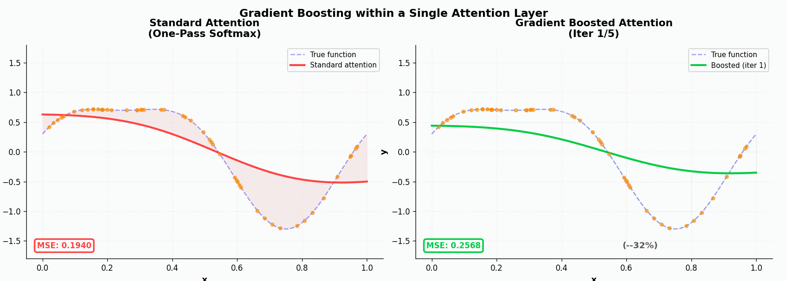
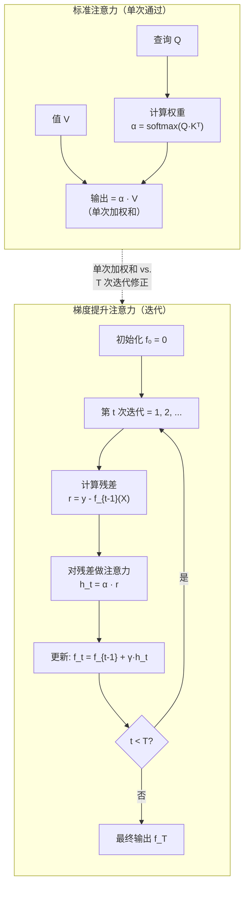
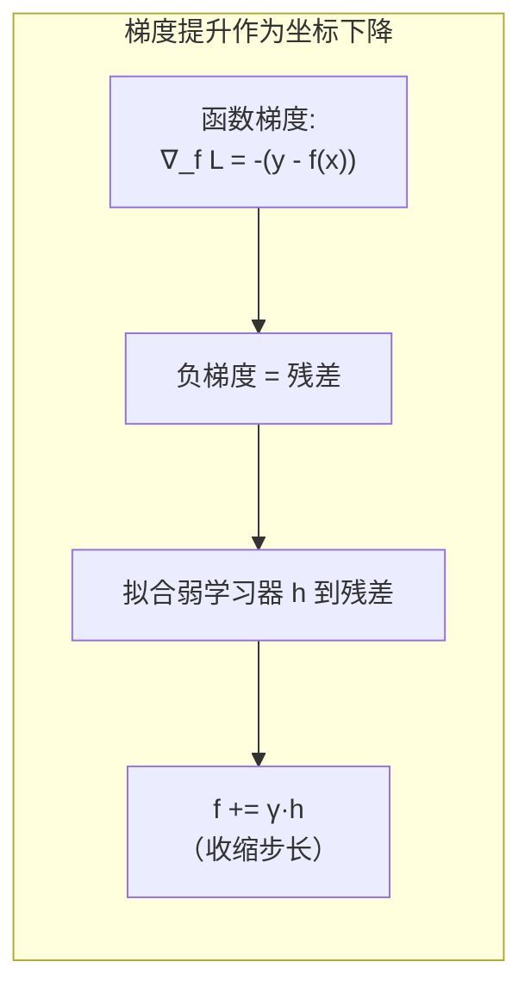
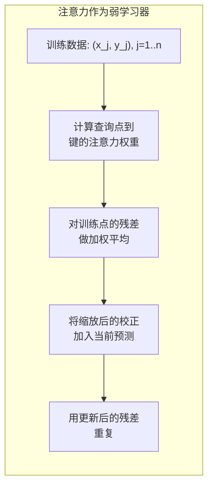

# Day 11: 单次注意力层内的梯度提升

> **观看动画**: 

---

## 一句话总结

梯度提升注意力（GBoostAttn）将单次 softmax 加权平均替换为一个迭代过程：在每一步中，注意力机制计算当前残差（上一步预测的误差）的加权平均，并将一部分校正值加到运行输出中，就像梯度提升通过构建多个弱学习器逐步纠正前序模型的错误一样，在单个注意力层内部实现了显著更优的逼近质量。

---

## 为什么这很重要

### 单次通过的瓶颈

Transformer 注意力计算单次 softmax 加权平均：

$$
\text{Attention}(Q, K, V)_i = \sum_{j=1}^{n} \alpha_{ij} v_j, \quad \alpha_{ij} = \frac{\exp(q_i \cdot k_j / \sqrt{d})}{\sum_{m} \exp(q_i \cdot k_m / \sqrt{d})}
$$

这是一个**单次估计**。每个查询只产生一次值的加权和——没有机制去精炼或修正输出。如果初始注意力权重不是最优的（训练早期尤其如此），在同一层内没有第二次修正的机会。

### 梯度提升回顾

梯度提升（Friedman, 2001）通过迭代地添加弱学习器来纠正当前集合的残差，从而构建一个强预测器：

$$
f_0(x) = 0, \quad r_i^{(t)} = y_i - f_{t-1}(x_i), \quad f_t(x) = f_{t-1}(x) + \gamma \cdot h_t(x)
$$

其中 $h_t(x)$ 被训练来预测残差 $r^{(t)}$，$\gamma$ 是学习率（收缩系数）。每个新的学习器都专注于集合之前的错误。

### 核心洞察

论文提出了一个问题：**我们能否在单个注意力层内部应用梯度提升？** 与其堆叠更多层（更深的网络），能否在注意力机制内部进行迭代？

答案是肯定的。在每一次提升迭代 $t$ 中：

$$
h_t(q_i) = \sum_{j=1}^{n} \alpha_{ij}^{(t)} \cdot r_j^{(t)}, \quad f_t(q_i) = f_{t-1}(q_i) + \gamma \cdot h_t(q_i)
$$

其中 $r_j^{(t)} = y_j - f_{t-1}(x_j)$ 是训练点 $j$ 上的残差，$\alpha_{ij}^{(t)}$ 是从查询 $i$ 到键 $j$ 的注意力权重。每一步中的"弱学习器"不过是**同一个注意力机制**，但它现在关注的是残差而非原始值。

---

## 架构详解







---

## 数学公式

### 形式化算法

给定训练数据 $\{(x_j, y_j)\}_{j=1}^n$ 和查询点 $\{q_i\}_{i=1}^m$：

**步骤 0：** 初始化 $f_0(q_i) = 0$（对所有 $i$）。

**步骤 t**（$t = 1, \ldots, T$）：

1. 计算训练点的残差：$r_j^{(t)} = y_j - f_{t-1}(x_j)$
2. 计算从查询到键的注意力权重：

$$
\alpha_{ij}^{(t)} = \text{softmax}_j\left(\frac{q_i \cdot k_j}{\sqrt{d}}\right)
$$

3. 计算"弱学习器"输出：

$$
h_t(q_i) = \sum_{j=1}^{n} \alpha_{ij}^{(t)} r_j^{(t)}
$$

4. 使用收缩系数更新：

$$
f_t(q_i) = f_{t-1}(q_i) + \gamma \cdot h_t(q_i)
$$

**最终输出：** $f_T(q_i)$，经过 $T$ 次迭代。

### 为什么有效：与核方法的联系

注意力机制本质上是一个**核回归器**。注意力权重定义了一个核矩阵 $K(q_i, x_j)$，输出为：

$$
f(q_i) = \sum_{j=1}^{n} K(q_i, x_j) \cdot v_j
$$

对于带 softmax 的标准注意力，其"核"为：

$$
K_{\text{attn}}(q_i, x_j) = \frac{\exp(q_i \cdot k_j / \sqrt{d})}{\sum_m \exp(q_i \cdot k_m / \sqrt{d})}
$$

在梯度提升中，每一步将*相同的核*应用于*当前残差*。经过 $T$ 次迭代：

$$
f_T = \gamma \sum_{t=1}^{T} (I - \gamma K)^{t-1} K y
$$

这是 $(I - (I - \gamma K))^{-1} y$ 的**截断 Neumann 级数**，当 $\gamma T$ 足够大且 $\gamma$ 足够小时，它收敛于 $K^{-1} y$（最优核回归解）。

换句话说：**梯度提升注意力通过迭代精炼逼近核矩阵的逆，而标准 softmax 注意力只计算一步。**

### 收敛性分析

每一步的平方损失减少：

$$
\ell_t = \frac{1}{n} \sum_{j=1}^{n} (y_j - f_t(x_j))^2
$$

对于良好的核矩阵 $K$（条件数好、近邻点之间相似度高），残差范数几何级数递减：

$$
\|r^{(t+1)}\| \leq \rho \cdot \|r^{(t)}\|, \quad \rho = \|I - \gamma K\|_2 < 1
$$

其中 $\rho$ 取决于注意力核矩阵 $K$ 的特征值。

### 与多头注意力的对比

| 方面 | 多头注意力 | 梯度提升注意力 |
|---|---|---|
| 策略 | 并行：多个头各自计算一次加权和 | 串行：同一个头迭代 T 次，逐步修正误差 |
| 表达能力 | 宽度：跨头的多样性 | 深度：在一个头内进行迭代精炼 |
| 计算量 | $O(H \cdot n^2 \cdot d)$ 并行 | $O(T \cdot n^2 \cdot d)$ 顺序执行 |
| 各自优势 | 当多样性有帮助时（不同特征类型） | 当精度很重要时（细粒度逼近） |

### 与 Day 07（RBF 注意力）的联系

如果将梯度提升与 RBF 注意力（Day 07）结合，核变为：

$$
K_{\text{RBF}}(q_i, x_j) = \exp\left(-\frac{\|q_i - k_j\|^2}{2\sigma^2}\right)
$$

Neumann 级数的论证会变得更加清晰，因为 RBF 核矩阵在温和条件下是对称正定的，保证了适当的 $\gamma$ 下的收敛性。

---

## Python 代码实现

```python
import torch
import torch.nn as nn
import torch.nn.functional as F
import math


# ------------------------------------------------------------------
# 1. 标准缩放点积注意力（参考）
# ------------------------------------------------------------------

def standard_attention(
    q: torch.Tensor,
    k: torch.Tensor,
    v: torch.Tensor,
    mask: torch.Tensor | None = None,
) -> torch.Tensor:
    """标准的单次缩放点积注意力。"""
    d_k = q.size(-1)
    scores = torch.matmul(q, k.transpose(-2, -1)) / math.sqrt(d_k)
    if mask is not None:
        scores = scores.masked_fill(mask == 0, float("-inf"))
    weights = F.softmax(scores, dim=-1)
    return torch.matmul(weights, v)


# ------------------------------------------------------------------
# 2. 梯度提升注意力
# ------------------------------------------------------------------

def gradient_boosted_attention(
    q: torch.Tensor,
    k: torch.Tensor,
    v: torch.Tensor,
    residual: torch.Tensor,
    mask: torch.Tensor | None = None,
) -> torch.Tensor:
    """
    对残差而非值进行注意力的机制。

    这是梯度提升注意力中的核心"弱学习器"。
    它不返回加权值，而是返回当前残差的加权平均，
    作为误差校正项。

    参数:
        q: 查询张量, shape (batch, heads, seq_q, head_dim).
        k: 键张量, shape (batch, heads, seq_k, head_dim).
        v: 值张量（在残差计算中不使用，保留以兼容标准注意力API）。
        residual: 残差张量, shape (batch, heads, seq_k, head_dim).
            每个键位置的当前预测误差。
        mask: 可选的注意力掩码.

    返回:
        correction: 加权残差校正, shape (batch, heads, seq_q, head_dim).
    """
    d_k = q.size(-1)
    scores = torch.matmul(q, k.transpose(-2, -1)) / math.sqrt(d_k)

    if mask is not None:
        scores = scores.masked_fill(mask == 0, float("-inf"))

    # 与标准注意力相同的 softmax 权重
    weights = F.softmax(scores, dim=-1)

    # 但不是对 V 做注意力，而是对残差做注意力
    correction = torch.matmul(weights, residual)

    return correction


def boosted_attention_layer(
    q: torch.Tensor,
    k: torch.Tensor,
    v: torch.Tensor,
    n_iterations: int = 5,
    gamma: float = 0.5,
    mask: torch.Tensor | None = None,
) -> tuple[torch.Tensor, list[torch.Tensor]]:
    """
    完整的梯度提升注意力，执行 T 次迭代校正。

    参数:
        q: 查询张量, shape (batch, heads, seq_q, head_dim).
        k: 键张量, shape (batch, heads, seq_k, head_dim).
        v: 值张量, shape (batch, heads, seq_k, head_dim).
        n_iterations: 提升迭代次数.
        gamma: 收缩/学习率（越小越稳定）.
        mask: 可选的注意力掩码.

    返回:
        output: T 次迭代后的最终预测.
        history: 每次迭代的预测（用于可视化）.
    """
    batch_size, num_heads, seq_q, head_dim = q.shape

    # 初始化预测为零（也可以用标准注意力做热启动）
    prediction = torch.zeros_like(q)
    history = []

    # 键位置上的残差
    # 我们用键的自注意力来近似 v 在键位置的值
    self_weights = F.softmax(
        torch.matmul(k, k.transpose(-2, -1)) / math.sqrt(head_dim), dim=-1
    )
    v_at_keys = torch.matmul(self_weights, v)  # 近似键位置的值
    residual = v_at_keys  # 初始残差 = 目标值

    for t in range(n_iterations):
        # 对当前残差做注意力
        correction = gradient_boosted_attention(q, k, v, residual, mask)
        prediction = prediction + gamma * correction
        history.append(prediction.clone())

        # 更新残差：键位置的目标还有多少未被捕获？
        self_weights = F.softmax(
            torch.matmul(k, k.transpose(-2, -1)) / math.sqrt(head_dim), dim=-1
        )
        residual_at_keys = v_at_keys - gamma * torch.matmul(self_weights, residual)
        residual = residual_at_keys

    return prediction, history


# ------------------------------------------------------------------
# 3. 热启动 vs. 零启动
# ------------------------------------------------------------------

def boosted_attention_with_warm_start(
    q: torch.Tensor,
    k: torch.Tensor,
    v: torch.Tensor,
    n_iterations: int = 3,
    gamma: float = 0.3,
    mask: torch.Tensor | None = None,
) -> torch.Tensor:
    """
    用标准注意力初始化的梯度提升注意力。

    不使用 f_0 = 0，而是设置 f_0 = 标准注意力，
    然后在此基础上进行残差校正提升。
    """
    d_k = q.size(-1)

    # 热启动：标准注意力
    scores = torch.matmul(q, k.transpose(-2, -1)) / math.sqrt(d_k)
    if mask is not None:
        scores = scores.masked_fill(mask == 0, float("-inf"))
    weights = F.softmax(scores, dim=-1)
    prediction = torch.matmul(weights, v)

    # 通过键的自注意力计算初始残差
    self_weights = F.softmax(
        torch.matmul(k, k.transpose(-2, -1)) / math.sqrt(d_k), dim=-1
    )
    v_at_keys = torch.matmul(self_weights, v)
    residual = v_at_keys

    for t in range(n_iterations):
        correction_weights = weights.clone()  # 复用相同注意力模式
        correction = torch.matmul(correction_weights, residual)
        prediction = prediction + gamma * correction
        residual = v_at_keys - gamma * torch.matmul(self_weights, residual)

    return prediction


# ------------------------------------------------------------------
# 4. 多头梯度提升注意力模块
# ------------------------------------------------------------------

class BoostedMultiHeadAttention(nn.Module):
    """
    带梯度提升迭代精炼的多头注意力。

    每个头独立地应用 T 次提升迭代。
    迭代次数 T 是一个超参数。
    训练时，你甚至可以学习每个头或每层的 T 值。

    参数:
        d_model: 模型维度.
        num_heads: 注意力头数量.
        n_iterations: 提升步数.
        gamma: 收缩/学习率.
        warm_start: 如果为 True, 用标准注意力初始化.
    """

    def __init__(
        self,
        d_model: int,
        num_heads: int,
        n_iterations: int = 5,
        gamma: float = 0.5,
        warm_start: bool = False,
    ):
        super().__init__()
        assert d_model % num_heads == 0
        self.d_model = d_model
        self.num_heads = num_heads
        self.head_dim = d_model // num_heads
        self.n_iterations = n_iterations
        self.gamma = gamma
        self.warm_start = warm_start

        self.w_q = nn.Linear(d_model, d_model)
        self.w_k = nn.Linear(d_model, d_model)
        self.w_v = nn.Linear(d_model, d_model)
        self.w_o = nn.Linear(d_model, d_model)

    def forward(
        self, x: torch.Tensor, mask: torch.Tensor | None = None
    ) -> torch.Tensor:
        """
        前向传播.

        参数:
            x: 输入张量, shape (batch, seq_len, d_model).
            mask: 可选的注意力掩码.

        返回:
            output: 精炼后的注意力输出, shape (batch, seq_len, d_model).
        """
        batch_size, seq_len, _ = x.shape

        q = self.w_q(x).view(batch_size, seq_len, self.num_heads, self.head_dim)
        k = self.w_k(x).view(batch_size, seq_len, self.num_heads, self.head_dim)
        v = self.w_v(x).view(batch_size, seq_len, self.num_heads, self.head_dim)

        q = q.transpose(1, 2)  # (batch, heads, seq, head_dim)
        k = k.transpose(1, 2)
        v = v.transpose(1, 2)

        output, _ = boosted_attention_layer(
            q, k, v, self.n_iterations, self.gamma, mask
        )

        # 拼接多头
        output = output.transpose(1, 2).contiguous()
        output = output.view(batch_size, seq_len, self.d_model)
        return self.w_o(output)


# ------------------------------------------------------------------
# 5. 演示：标准 vs. 提升
# ------------------------------------------------------------------

if __name__ == "__main__":
    torch.manual_seed(42)

    # 简单的一维回归问题
    n_train = 50
    n_query = 100

    x_train = torch.sort(torch.rand(n_train)).values
    target = torch.sin(2 * math.pi * x_train) + 0.3 * torch.cos(4 * math.pi * x_train)

    x_query = torch.linspace(0, 1, n_query)

    # 重塑为注意力所需形状
    q = x_query.unsqueeze(-1).unsqueeze(0).unsqueeze(0)  # (1, 1, n_query, 1)
    k = x_train.unsqueeze(-1).unsqueeze(0).unsqueeze(0)  # (1, 1, n_train, 1)
    v = target.unsqueeze(-1).unsqueeze(0).unsqueeze(0)  # (1, 1, n_train, 1)

    # 标准注意力
    std_out = standard_attention(q, k, v).squeeze()   # (n_query,)

    # 梯度提升注意力
    boost_out, history = boosted_attention_layer(q, k, v, n_iterations=5, gamma=0.7)
    boost_out = boost_out.squeeze()

    # 比较误差
    target_fn = lambda x: torch.sin(2 * math.pi * x) + 0.3 * torch.cos(4 * math.pi * x)
    target_query = target_fn(x_query)

    std_mse = ((std_out - target_query) ** 2).mean()
    boost_mse = ((boost_out - target_query) ** 2).mean()

    print(f"标准注意力 MSE:  {std_mse:.6f}")
    print(f"提升注意力 MSE:   {boost_mse:.6f}")
    print(f"改进幅度:        {(1 - boost_mse / std_mse) * 100:.1f}%")

    # 展示逐步提升
    print("\n逐步改进过程:")
    for t, pred in enumerate(history):
        mse = ((pred.squeeze() - target_query) ** 2).mean().item()
        print(f"  第 {t + 1} 次迭代: MSE = {mse:.6f}")
```

---

## 要点总结

| 概念 | 说明 |
|---|---|
| **单次注意力** | 标准 softmax 注意力只计算一次加权平均——没有自我修正的机制。 |
| **注意力内的梯度提升** | 迭代地应用同一个注意力机制，但对残差而非原始值做注意力。每一步都纠正前一步的误差。 |
| **核矩阵的逆** | Neumann 级数的解释表明，T 次提升步近似于 $K^{-1}y$，而单次标准注意力只计算 $Ky$。 |
| **收敛保证** | 对于对称正定核矩阵（如 RBF），残差范数在每次迭代中几何级数递减。 |
| **权衡** | 更多迭代 = 更好的逼近但更多的顺序计算。无法跨迭代并行化（与多头注意力不同）。 |
| **与前几日的联系** | 与 RBF 注意力（Day 07）天然结合可获得保证的 SPD 核矩阵，与 KV 缓存（Day 08）结合时缓存的键值对可作为提升的训练数据。 |

---

## 参考文献

- Chen, W. et al. "Gradient Boosting within a Single Attention Layer." arXiv 预印本, 2026.
- Friedman, J. "Greedy function approximation: A gradient boosting machine." *Annals of Statistics*, 29(5):1189-1232, 2001.
- Vaswani, A. et al. "Attention Is All You Need." NeurIPS 2017.
- Choromanski, K. et al. "Rethinking Attention with Performers." ICLR 2021.（Day 07: RBF 注意力）
