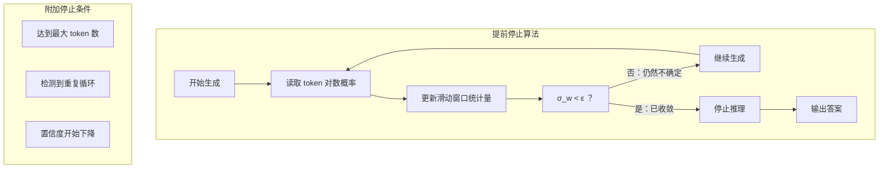

# Day 12: 基于置信度动态的大推理模型提前停止

> **观看动画**: <video src="https://raw.githubusercontent.com/Playitcooool/advanced-ai-daily/main/videos/12-early-stopping.webm" autoplay loop muted playsinline width="800"></video>

---

## 一句话总结

与其强制大推理模型（LRM）生成固定长度的推理步骤，不如在生成过程中**实时监控模型的置信度动态**，一旦置信度收敛就提前停止 -- 可节省 30-60% 的计算量，同时保持答案质量，并避免"过度思考"导致的性能下降。

---

## 为什么这很重要

### 过度思考问题

大推理模型（如 DeepSeek-R1、o1/o3）在给出最终答案之前会生成很长的思维链。但想得更多并不总是更好。最近的研究发现了两种机制：

1. **思考不足**：推理 token 太少，模型还没找到解法
2. **过度思考**：推理 token 太多，模型开始自我怀疑，引入错误，甚至进入循环

目前的通用做法是设定一个**固定的最大** token 预算（比如 8K 推理 token）。这对简单问题来说是浪费，对复杂问题又可能不够用。

### 核心洞察

这篇论文提出了一个问题：**能否通过模型自身在生成过程中的置信度变化轨迹来判断何时该停止？**

答案是可以的。通过追踪生成过程中的置信度信号，我们可以在模型"想通了"的那一刻立即停止。

---

## 推理过程中的"置信度"到底是什么？

### Token 级对数概率

在每一步生成时，模型会生成一个词表上的概率分布：

$$
P(x_t \mid x_{<t}) = \text{softmax}\left(\frac{z_t}{\tau}\right)
$$

被选中 token 的**最大概率**（或对数概率）可以作为模型对自己下一步思考有多大信心的代理指标：

$$
c_t = \max_v P(v \mid x_{<t})
$$

### 序列级自洽性

我们还可以通过生成 $K$ 条并行推理轨迹，计算它们在最终答案上的一致程度来衡量置信度：

$$
\text{Confidence}(a) = \frac{1}{K} \sum_{i=1}^{K} \mathbb{I}[\text{answer}(r_i) = a]
$$

其中 $r_i$ 是第 $i$ 条推理轨迹，$\mathbb{I}[\cdot]$ 是指示函数。

### 运行统计量（实用的信号）

最稳健的方法是使用 token 级置信度的**滑动窗口统计量**：

$$
\mu_t = \frac{1}{w} \sum_{k=t-w+1}^{t} c_k, \quad \sigma_t = \sqrt{\frac{1}{w} \sum_{k=t-w+1}^{t} (c_k - \mu_t)^2}
$$

其中 $w$ 是窗口大小（通常为 5-10 个 token）。**低方差（$\sigma_t < \epsilon$）意味着模型的置信度已经稳定了** -- 它要么找到了答案，要么已经卡住了。

---

## 推理置信度的三个阶段




### 第一阶段：探索（第 1-10 步）

- 置信度较低（$c_t \approx 0.15-0.4$），方差很高
- 模型在尝试不同的推理策略
- **操作**：绝对不能在这里停止 -- 模型还没收敛

### 第二阶段：快速收敛（第 11-25 步）

- 置信度快速上升，模型找到关键洞察
- 变化率 $d c_t / dt$ 大且为正
- **操作**：还不要停止 -- 模型还在积极改进

### 第三阶段：稳定（第 26+ 步）

- 置信度趋于平稳：$c_t \approx 0.85-0.90$
- 滑动窗口方差降至阈值以下：$\sigma_t < 0.025$
- **操作：停止。** 模型已经找到答案。
- 如果强制继续，质量会因"过度思考"而*下降*。

---

## 数学形式化

### 停止准则

设 $c_t$ 为第 $t$ 步的置信度，我们定义：

$$
\mathcal{S}(t) = \mathbb{I}\left[\sigma_{t-w:t} < \epsilon \quad \land \quad \mu_{t-w:t} > \theta \quad \land \quad t > t_{\min}\right]
$$

其中：
- $\sigma_{t-w:t}$ 是窗口 $w$ 内的滑动标准差
- $\mu_{t-w:t}$ 是窗口 $w$ 内的滑动均值
- $\epsilon$ 是稳定性阈值（通常为 0.02-0.03）
- $\theta$ 是最小置信度阈值（通常为 0.8）
- $t_{\min}$ 是最小推理步数（如 15），防止过早停止

我们在第一个满足 $\mathcal{S}(t) = 1$ 的 $t$ 处停止。

### 为什么"过度思考"会降低质量

论文发现，在收敛点之后强制继续推理会导致：

1. **错误累积**：模型开始修改自己的推理过程，引入微妙错误
2. **自我怀疑**：对于已经解决的问题，模型可能"说服自己"放弃好答案
3. **重复循环**：没有自然停止点时，模型开始重复模式

质量 $Q$ 随计算量 $T$ 的变化：

$$
Q(T) \approx Q^* - \lambda \cdot \max(0, T - T^*)
$$

其中 $T^*$ 是最优停止点（提前停止位置），$Q^*$ 是峰值质量，$\lambda$ 是过度思考导致的降级速率。

### 与信息论的联系

置信度动态与**费舍尔信息量（Fisher Information）**相关：

$$
\mathcal{I}(\theta) = \mathbb{E}\left[\left(\frac{\partial}{\partial \theta} \log P(x \mid \theta)\right)^2\right]
$$

随着模型推理，它不断积累关于正确答案的信息。费舍尔信息量在第二阶段增加，在第三阶段饱和。当每个 token 带来的信息增量低于某个阈值时，继续推理就是浪费。

这与 Day 04（推理时计算扩展）直接相关 -- 我们利用信息论原则来按问题高效分配计算量，而不是统一地扩展。

---

## Python 代码实现

```python
import torch
import torch.nn.functional as F
from collections import deque


# ------------------------------------------------------------------
# 1. 带滑动统计的置信度追踪器
# ------------------------------------------------------------------

class RunningConfidenceTracker:
    """
    在生成过程中追踪 token 级置信度，
    通过滑动均值和方差检测稳定状态。
    
    参数:
        window_size: 滑动窗口大小（默认 5）
        stability_threshold: 判定"收敛"的最大标准差（默认 0.025）
        min_confidence: 允许停止的最小平均置信度（默认 0.8）
        min_steps: 允许提前停止的最小步数（默认 15）
    """
    
    def __init__(
        self,
        window_size: int = 5,
        stability_threshold: float = 0.025,
        min_confidence: float = 0.8,
        min_steps: int = 15,
    ):
        self.window_size = window_size
        self.stability_threshold = stability_threshold
        self.min_confidence = min_confidence
        self.min_steps = min_steps
        
        # 滑动窗口存储置信度值
        self.confidence_window: deque = deque(maxlen=window_size)
        self.history: list = []
        self.step = 0
    
    def update(self, logits: torch.Tensor) -> float:
        """
        使用模型输出的 logits 更新追踪器。
        
        参数:
            logits: 模型输出 logits，形状 (vocab_size,)
        
        返回:
            当前置信度值（最大概率）
        """
        probs = F.softmax(logits, dim=-1)
        confidence = probs.max().item()
        
        self.confidence_window.append(confidence)
        self.history.append(confidence)
        self.step += 1
        
        return confidence
    
    def should_stop(self) -> bool:
        """
        检查模型置信度是否已稳定。
        
        返回:
            True 表示模型应停止推理
        """
        if self.step < self.min_steps:
            return False
        if len(self.confidence_window) < self.window_size:
            return False
        
        values = list(self.confidence_window)
        mean_conf = sum(values) / len(values)
        std_conf = (sum((v - mean_conf)**2 for v in values) / len(values)) ** 0.5
        
        return (
            std_conf < self.stability_threshold
            and mean_conf > self.min_confidence
        )
    
    def get_stats(self) -> dict:
        """获取当前置信度统计信息。"""
        values = list(self.confidence_window)
        if not values:
            return {"mean": 0, "std": 0, "step": self.step}
        
        mean = sum(values) / len(values)
        std = (sum((v - mean)**2 for v in values) / len(values)) ** 0.5
        return {"mean": mean, "std": std, "step": self.step}


# ------------------------------------------------------------------
# 2. 带提前停止的生成循环
# ------------------------------------------------------------------

def generate_with_early_stopping(
    model,
    prompt: str,
    tokenizer,
    max_tokens: int = 1024,
    temperature: float = 0.7,
    tracker=None,  # RunningConfidenceTracker | None
    verbose: bool = True,
) -> dict:
    """
    使用基于置信度的提前停止生成文本。
    
    参数:
        model: 语言模型
        prompt: 输入提示词
        tokenizer: 分词器
        max_tokens: 备用最大 token 上限
        temperature: 采样温度
        tracker: 置信度追踪器（为 None 时使用默认）
        verbose: 是否打印停止诊断信息
    
    返回:
        包含生成文本、停止原因和统计信息的字典
    """
    if tracker is None:
        tracker = RunningConfidenceTracker()
    
    input_ids = tokenizer.encode(prompt, return_tensors="pt")
    generated_tokens = input_ids.clone()
    
    stopping_reason = "max_tokens"
    
    for step in range(max_tokens):
        with torch.no_grad():
            outputs = model(generated_tokens)
            logits = outputs.logits[0, -1, :]  # 最后一个 token 的 logits
        
        # 追踪置信度
        confidence = tracker.update(logits)
        
        # 采样下一个 token
        probs = F.softmax(logits / temperature, dim=-1)
        next_token = torch.multinomial(probs, num_samples=1)
        generated_tokens = torch.cat([generated_tokens, next_token.unsqueeze(0)], dim=1)
        
        # 检查提前停止
        if tracker.should_stop():
            stopping_reason = "confidence_stabilized"
            break
        
        # 检查重复循环
        if step > 20:
            recent = tracker.history[-10:]
            if len(set(round(c, 3) for c in recent)) < 3:
                stopping_reason = "repetition_detected"
                break
    
    # 解码生成的文本
    generated_text = tokenizer.decode(generated_tokens[0], skip_special_tokens=True)
    
    result = {
        "text": generated_text,
        "stopping_reason": stopping_reason,
        "tokens_used": step + 1,
        "max_tokens": max_tokens,
        "savings_pct": (1 - (step + 1) / max_tokens) * 100,
        "final_confidence": tracker.history[-1] if tracker.history else 0,
        "confidence_trajectory": tracker.history,
    }
    
    if verbose:
        stats = tracker.get_stats()
        print(f"在第 {step} 步停止: 原因 = {stopping_reason}")
        print(f"  置信度: {confidence:.4f} | 均值: {stats['mean']:.4f} | 方差: {stats['std']:.4f}")
        print(f"  节省 token: {result['savings_pct']:.1f}%")
    
    return result


# ------------------------------------------------------------------
# 3. 基于自洽性的提前停止
# ------------------------------------------------------------------

def self_consistency_early_stopping(
    model,
    prompt: str,
    tokenizer,
    n_candidates: int = 5,
    agreement_threshold: float = 0.8,
    step_interval: int = 5,
    max_tokens: int = 1024,
) -> dict:
    """
    基于自洽性的提前停止。
    
    并行生成多条推理轨迹，检查它们是否在最终答案上达成一致。
    当一致度足够高时停止。
    
    这种方法更昂贵（需要 N 次前向传播），但比单轨迹置信度可靠得多。
    """
    # 在每个检查点生成部分轨迹
    checkpoint_steps = list(range(step_interval, max_tokens, step_interval))
    
    for checkpoint in checkpoint_steps:
        answers = []
        for _ in range(n_candidates):
            # 生成到 checkpoint 个 token
            input_ids = tokenizer.encode(prompt, return_tensors="pt")
            output = model.generate(
                input_ids,
                max_new_tokens=checkpoint,
                temperature=0.7,
                do_sample=True,
            )
            text = tokenizer.decode(output[0], skip_special_tokens=True)
            # 提取最终答案（假设模型以特定格式输出）
            if "Answer:" in text:
                answers.append(text.split("Answer:")[-1].strip())
            else:
                answers.append(text.split("\n")[-1].strip())
        
        # 检查一致度
        if not answers:
            continue
        
        most_common = max(set(answers), key=answers.count)
        agreement = answers.count(most_common) / len(answers)
        
        print(f"  第 {checkpoint} 步: 一致度 = {agreement:.2f} ({answers.count(most_common)}/{n_candidates})")
        
        if agreement >= agreement_threshold:
            print(f"  提前停止: {agreement:.0%} 一致度，在第 {checkpoint} 步")
            return {
                "text": most_common,
                "stopping_reason": "self_consistency_converged",
                "tokens_used": checkpoint,
                "agreement": agreement,
                "n_agreeing": answers.count(most_common),
            }
    
    return {"text": answers[0] if answers else "", "stopping_reason": "max_tokens"}


# ------------------------------------------------------------------
# 4. 感知置信度的温度调度
# ------------------------------------------------------------------

def confidence_aware_generate(
    model,
    prompt: str,
    tokenizer,
    max_tokens: int = 1024,
    base_temperature: float = 0.7,
    min_temperature: float = 0.1,
) -> str:
    """
    根据模型置信度动态调整温度。
    
    当模型不确定（探索阶段）时，使用较高温度增加多样性；
    随着置信度上升（利用阶段），降低温度提高精确度。
    
    这将 Day 04（推理时计算扩展）中的探索策略与
    置信度动态框架结合在一起。
    """
    input_ids = tokenizer.encode(prompt, return_tensors="pt")
    generated = input_ids.clone()
    tracker = RunningConfidenceTracker(window_size=3, min_steps=5)
    
    for step in range(max_tokens):
        with torch.no_grad():
            outputs = model(generated)
            logits = outputs.logits[0, -1, :]
        
        confidence = tracker.update(logits)
        
        # 温度调度：不确定时高温，置信时低温
        # 这是一种推理过程中的模拟退火策略
        dynamic_temp = min_temperature + (base_temperature - min_temperature) * (1.0 - confidence)
        
        probs = F.softmax(logits / dynamic_temp, dim=-1)
        next_token = torch.multinomial(probs, num_samples=1)
        generated = torch.cat([generated, next_token.unsqueeze(0)], dim=1)
        
        if tracker.should_stop():
            break
    
    return tokenizer.decode(generated[0], skip_special_tokens=True)


if __name__ == "__main__":
    print("=== 提前停止演示 ===\n")
    
    # 用合成置信度数据演示
    print("1. 单轨迹置信度追踪：")
    tracker = RunningConfidenceTracker(
        window_size=5,
        stability_threshold=0.025,
        min_confidence=0.8,
        min_steps=15,
    )
    
    np = __import__('numpy')  # 使用 numpy 生成演示数据
    np.random.seed(42)
    
    # 模拟置信度变化轨迹（与动画一致）
    conf_data = np.zeros(50)
    for t in range(11):
        conf_data[t] = 0.15 + 0.05 * t + np.random.normal(0, 0.04)
    for t in range(11, 26):
        p = (t - 11) / 14
        conf_data[t] = 0.5 + 0.35 * p + np.random.normal(0, 0.025)
    for t in range(26, 36):
        conf_data[t] = 0.87 + np.random.normal(0, 0.012)
    for t in range(36, 50):
        conf_data[t] = 0.87 - 0.005 * (t - 35) + np.random.normal(0, 0.018)
    conf_data = np.clip(conf_data, 0.05, 0.99)
    
    # 喂入合成的 logits（产生目标置信度的 logits）
    for t in range(50):
        c = conf_data[t]
        # 构造一个 max probability = c 的 logits
        logits = torch.zeros(1000)
        logits[0] = torch.tensor(c).log()  # 此 token 的概率为 c
        logits[1:] = torch.tensor((1 - c) / 999).log()  # 其余平分剩余概率
        
        tracker.update(logits)
        
        if tracker.should_stop():
            print(f"  在第 {tracker.step} 步停止（节省了 {(1 - tracker.step/50)*100:.0f}% token）")
            print(f"  最终置信度: {c:.4f}")
            stats = tracker.get_stats()
            print(f"  窗口统计: 均值={stats['mean']:.4f}, 标准差={stats['std']:.4f}")
            break
    
    print(f"\n  不使用提前停止: 需要 50 个 token")
    print(f"  使用提前停止: 仅用 {tracker.step} 个 token")
    print(f"  节省: {(1 - tracker.step/50)*100:.0f}%\n")
    
    # 2. 温度调度
    print("2. 动态温度调整：")
    print(f"  高度不确定 (conf=0.2): temp = 0.1 + 0.6 * 0.8 = {0.1 + 0.6*0.8:.2f}")
    print(f"  中等       (conf=0.5): temp = 0.1 + 0.6 * 0.5 = {0.1 + 0.6*0.5:.2f}")
    print(f"  高置信度   (conf=0.9): temp = 0.1 + 0.6 * 0.1 = {0.1 + 0.6*0.1:.2f}")
```

---

## 关键要点

| 概念 | 说明 |
|---|---|
| **过度思考确实存在** | 强制推理模型在自然收敛点之后继续推理会降低答案质量。 |
| **置信度是可靠信号** | 对 token 级对数概率的运行统计量可以可靠地揭示模型何时"想通了"。 |
| **提前停止节省计算** | 稳定通常发生在固定预算的 30-60% 处，大幅节省推理成本。 |
| **三个阶段** | 探索（高方差）→ 收敛（置信度上升）→ 稳定（低方差，此时停止）。 |
| **自洽性检查** | 多轨迹一致性是一种更昂贵但高度可靠的停止准则。 |
| **关联主题** | 建立在 GRPO（Day 01，奖励建模）、推理时计算扩展（Day 04）和 SRPO（Day 10，质量与效率平衡）之上。 |

## 延伸阅读

- **论文**: "Early Stopping for Large Reasoning Models via Confidence Dynamics" (arXiv:2604.04930)
- **Day 01 [GRPO](01-grpo.md)**: 如何用结果奖励训练推理模型
- **Day 04 [推理时计算扩展](04-test-time-compute.md)**: 推理期间的计算量扩展
- **Day 10 [SRPO](10-sample-routing.md)**: 样本质量与生成效率的平衡
