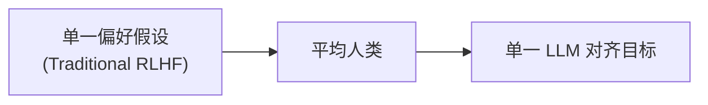
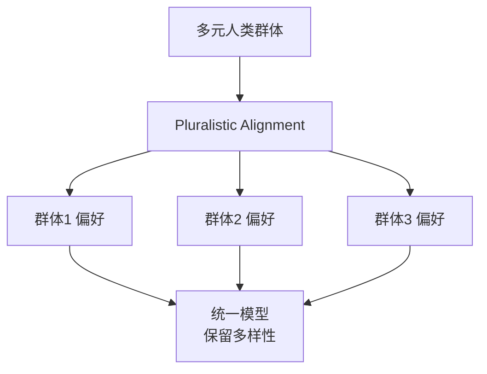
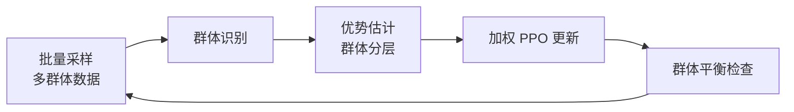

# Pluralistic Alignment（多元对齐）

## 快速参考 / Quick Reference

### 核心公式

| 概念 | 公式 | 说明 |
|------|------|------|
| **多元偏好分布** | $P(\theta \mid D) \propto \sum_{g} w_g \cdot P(\theta \mid D_g)$ | 加权混合多群体偏好 |
| **群体平衡损失** | $\mathcal{L}_{PB} = -\mathbb{E}_{x \sim D, g \sim G}[w_g \log P_\theta(y_g \mid x)]$ | 平衡多群体训练 |
| **多样性正则化** | $\mathcal{L}_{div} = \lambda \cdot D_{KL}(P_\theta \| \bar{P})$ | 防止偏好崩塌 |
| **社会福利目标** | $\max_\theta \sum_{g} \alpha_g \cdot U_g(\theta)$ | 效用加权多目标优化 |

---

## 1. 什么是 Pluralistic Alignment？

### 1.1 问题的提出

传统对齐方法（如 RLHF、DPO）通常假设**单一统一的人类偏好**：



但现实中，人类偏好天然是**多元化的**：

- **文化差异**：不同文化对隐私、幽默、直接性的理解不同
- **个人偏好**：有人喜欢详细解释，有人喜欢简洁答案
- **使用场景**：专业用户 vs 普通用户 vs 开发者
- **价值取向**：有人重视帮助性，有人重视安全性

### 1.2 Pluralistic Alignment 的核心思想

Pluralistic Alignment 主张：**不是拟合单一平均偏好，而是显式建模和尊重多样化的人类群体偏好**。



### 1.3 与传统方法的对比

| 维度 | 传统 RLHF/DPO | Pluralistic Alignment |
|------|---------------|----------------------|
| **偏好建模** | 单一平均偏好 | 多群体分布建模 |
| **优化目标** | $\max_\theta \mathbb{E}[r(x,y)]$ | $\max_\theta \sum_g \alpha_g U_g(\theta)$ |
| **公平性** | 可能忽略少数群体 | 显式加权平衡 |
| **输出多样性** | 低（偏好崩塌） | 高（保留差异） |
| **可解释性** | 黑盒 | 群体级别可追踪 |

---

## 2. 理论框架

### 2.1 形式化定义

给定：
- 群体集合 $\mathcal{G} = \{1, 2, ..., G\}$
- 群体 $g$ 的偏好数据集 $D_g = \{(x_i, y_i^g)\}$
- 群体权重 $w_g$（可学习或预设）

**多元对齐目标**：

$$
\mathcal{L}_{PA}(\theta) = -\sum_{g=1}^{G} w_g \cdot \mathbb{E}_{(x,y) \sim D_g}\left[\log P_\theta(y \mid x)\right]
$$

### 2.2 贝叶斯视角

从贝叶斯角度，Pluralistic Alignment 相当于在**群体混合先验**上进行后验推断：

$$
P(\theta \mid D_{1:G}) = \frac{\prod_{g} P(\theta) \cdot P(D_g \mid \theta)^{w_g}}{P(D_{1:G})}
$$

这保证了：
1. 每个群体的偏好都被显式建模
2. 群体权重控制相对重要性
3. 避免少数群体被"平均掉"

### 2.3 偏好崩溃的数学分析

传统单一偏好对齐的崩溃可以用信息论解释：

$$
\underbrace{D_{KL}(P_\theta \| P_{ref})}_{\text{约束}} + \underbrace{\mathbb{E}_{x \sim D}[-\log P_\theta(y^*(x) \mid x)]}_{\text{单一偏好}}
$$

当存在**多模态偏好**时（如同样的问题有多种好的回答），单一偏好目标会导致：

$$
\lim_{n \to \infty} P_\theta(y \mid x) = \delta_{y_{mode}}
$$

即模型完全忽略其他合理回答，只输出"平均最优"的那个。

### 2.4 社会福利函数

Pluralistic Alignment 可以形式化为**社会福利最大化**问题：

$$
\max_{\theta} W(u_1(\theta), u_2(\theta), ..., u_G(\theta))
$$

其中 $u_g(\theta)$ 是群体 $g$ 的效用函数。

常见的社会福利函数：

| 类型 | 公式 | 特性 |
|------|------|------|
| **功利主义** | $W = \sum_g u_g$ | 总量最大化 |
| **罗尔斯主义** | $W = \min_g u_g$ | 最大化最弱势群体 |
| **纳什积** | $W = \prod_g u_g$ | 公平性约束 |
| **广义均值** | $W = (\frac{1}{G}\sum_g u_g^p)^{1/p}$ | 可调公平性 |

---

## 3. 核心算法

### 3.1 群体感知 PPO (Group-Aware PPO)



**群体感知优势函数**：

$$
A_g(x, y) = r(x, y) - \frac{1}{|D_g|} \sum_{y' \in D_g} r(x, y')
$$

### 3.2 多元 DPO (Multi-Group DPO)

将 DPO 扩展到多群体设定：

```python
class MultiGroupDPO:
    """
    多元偏好对齐的 DPO 变体
    参考: arXiv:2604.07343
    """
    def __init__(self, groups: List[str], alpha: Dict[str, float] = None):
        self.groups = groups
        # 默认等权重，可根据需求调整
        self.alpha = alpha or {g: 1.0/len(groups) for g in groups}

    def compute_loss(self, model, ref_model, batch):
        """
        批次格式: {
            'prompt': str,
            'chosen_by_group': {'group1': str, 'group2': str, ...},
            'rejected': str
        }
        """
        total_loss = 0.0

        for group in self.groups:
            chosen = batch['chosen_by_group'][group]
            rejected = batch['rejected']
            prompt = batch['prompt']

            # 标准 DPO 损失
            loss_g = self._dpo_single_group(
                model, ref_model, prompt, chosen, rejected
            )

            # 加权求和
            total_loss += self.alpha[group] * loss_g

        return total_loss

    def _dpo_single_group(self, model, ref_model, prompt, chosen, rejected):
        """单群体 DPO 损失计算"""
        # chosen 和 rejected 的对数概率
        pi_chosen = model.log_prob(prompt, chosen)
        pi_rejected = model.log_prob(prompt, rejected)

        ref_chosen = ref_model.log_prob(prompt, chosen)
        ref_rejected = ref_model.log_prob(prompt, rejected)

        # DPO 损失
        logratio = (pi_chosen - pi_rejected) - (ref_chosen - ref_rejected)
        loss = -F.logsigmoid(logratio)

        return loss.mean()
```

### 3.3 对抗性群体平衡

为防止模型"偏向"某个大群体，使用对抗训练：

```python
class AdversarialGroupBalance:
    """
    对抗性群体平衡机制
    核心思想：同时训练一个群体判别器，迫使模型输出与群体无关
    """
    def __init__(self, model, groups: List[str], lambda_adv: float = 0.1):
        self.model = model
        self.groups = groups
        self.lambda_adv = lambda_adv
        # 群体判别器
        self.discriminator = GroupClassifier(hidden_dim=model.hidden_dim)

    def step(self, batch, optimizer, gamma=0.99):
        """
        一个训练步骤
        1. 更新模型（最小化偏好损失 + 对抗损失）
        2. 更新判别器（最大化群体识别准确率）
        """
        prompt = batch['prompt']
        chosen_by_group = batch['chosen_by_group']
        true_groups = batch['group_labels']

        # ====== 第一步：训练判别器 ======
        # 让判别器学会从输出中识别群体
        self.discriminator.train()
        group_logits = []

        for group in self.groups:
            response = chosen_by_group[group]
            with torch.no_grad():
                logits = self.discriminator(prompt, response)
            group_logits.append(logits)

        # 判别器损失：最大化群体识别能力
        disc_loss = F.cross_entropy(torch.stack(group_logits), true_groups)
        self.discriminator.optimizer.zero_grad()
        disc_loss.backward()
        self.discriminator.optimizer.step()

        # ====== 第二步：训练模型（对抗） ======
        self.model.train()
        self.discriminator.eval()

        # 偏好损失
        pref_loss = self._compute_preference_loss(batch)

        # 对抗损失：迫使模型输出无法被判别器识别
        adv_loss = 0.0
        for group in self.groups:
            response = chosen_by_group[group]
            logits = self.discriminator(prompt, response)
            # 最小化这个损失 = 使输出与群体无关
            adv_loss += F.cross_entropy(logits.unsqueeze(0),
                                        torch.tensor([self.groups.index(group)]))

        # 总体损失
        total_loss = pref_loss - self.lambda_adv * adv_loss

        optimizer.zero_grad()
        total_loss.backward()
        optimizer.step()

        return {
            'preference_loss': pref_loss.item(),
            'adversarial_loss': adv_loss.item(),
            'discriminator_acc': self._compute_disc_accuracy(batch)
        }

    def _compute_disc_accuracy(self, batch):
        """计算判别器准确率"""
        self.discriminator.eval()
        correct = 0
        total = 0

        for group in self.groups:
            response = batch['chosen_by_group'][group]
            true_label = self.groups.index(group)
            with torch.no_grad():
                logits = self.discriminator(batch['prompt'], response)
                pred = logits.argmax().item()
            if pred == true_label:
                correct += 1
            total += 1

        return correct / total
```

---

## 4. 实践实现

### 4.1 完整训练流程

```python
"""
Pluralistic Alignment 完整训练示例
论文: arXiv:2604.07343

本实现展示如何训练一个尊重多元人类偏好的 LLM
"""

import torch
import torch.nn as nn
import torch.nn.functional as F
from dataclasses import dataclass
from typing import Dict, List, Optional
import numpy as np


@dataclass
class GroupConfig:
    """群体配置"""
    name: str
    weight: float  # 群体权重
    description: str
    example_prompts: List[str]


class PluralisticAlignmentTrainer:
    """
    多元对齐训练器

    支持特性：
    - 多群体偏好建模
    - 群体平衡正则化
    - 多样性保持机制
    - 差分隐私选项（保护少数群体）
    """

    def __init__(
        self,
        model: nn.Module,
        ref_model: nn.Module,
        groups: List[GroupConfig],
        config: Optional[Dict] = None
    ):
        self.model = model
        self.ref_model = ref_model
        self.groups = groups
        self.group_names = [g.name for g in groups]

        # 训练配置
        cfg = config or {}
        self.lambda_div = cfg.get('lambda_diversity', 0.1)  # 多样性权重
        self.lambda_adv = cfg.get('lambda_adversarial', 0.05)  # 对抗权重
        self.target_minority_ratio = cfg.get('target_minority_ratio', 0.2)
        self.gradient_accumulation_steps = cfg.get('gradient_accumulation', 4)

        # 群体判别器
        self.has_discriminator = self.lambda_adv > 0
        if self.has_discriminator:
            self.discriminator = self._build_discriminator(model)

        # 统计量
        self.group_counts = {g.name: 0 for g in groups}
        self.best_group_fairness = 0.0

    def _build_discriminator(self, model):
        """构建群体判别器"""
        return nn.Sequential(
            nn.Linear(model.hidden_dim, 256),
            nn.ReLU(),
            nn.Dropout(0.1),
            nn.Linear(256, len(self.groups))
        )

    def compute_loss(self, batch: Dict) -> Dict[str, torch.Tensor]:
        """
        计算多元对齐损失

        批次格式:
        {
            'prompt': List[str],
            'responses': {
                'group1': List[str],
                'group2': List[str],
                ...
            },
            'group_labels': torch.Tensor  # 用于判别器训练
        }
        """
        prompt = batch['prompt']
        responses_by_group = batch['responses']
        group_labels = batch.get('group_labels')

        total_loss = 0.0
        loss_breakdown = {}

        # 1. 群体加权偏好损失
        for i, group_config in enumerate(self.groups):
            group_name = group_config.name
            weight = group_config.weight

            if group_name not in responses_by_group:
                continue

            # 获取该群体的偏好响应
            group_responses = responses_by_group[group_name]

            # 计算群体偏好损失
            loss_g = self._compute_group_preference_loss(
                prompt, group_responses
            )

            weighted_loss = weight * loss_g
            total_loss = total_loss + weighted_loss
            loss_breakdown[f'loss_{group_name}'] = loss_g.item()
            self.group_counts[group_name] += len(prompt)

        # 2. 多样性保持正则化
        div_loss = self._compute_diversity_loss(prompt, responses_by_group)
        total_loss = total_loss + self.lambda_div * div_loss
        loss_breakdown['diversity_loss'] = div_loss.item()

        # 3. 对抗损失（可选）
        if self.has_discriminator and group_labels is not None:
            adv_loss = self._compute_adversarial_loss(prompt, responses_by_group)
            total_loss = total_loss - self.lambda_adv * adv_loss
            loss_breakdown['adversarial_loss'] = adv_loss.item()

        loss_breakdown['total_loss'] = total_loss.item()

        return total_loss, loss_breakdown

    def _compute_group_preference_loss(
        self,
        prompt: List[str],
        chosen_responses: List[str],
        margin: float = 0.5
    ) -> torch.Tensor:
        """
        计算单个群体的偏好损失
        使用 margin-based ranking loss
        """
        # 获取模型和对数概率
        # 实际实现中需要调用 model(prompt, response)
        with torch.no_grad():
            chosen_logp = self.model.get_log_prob(prompt, chosen_responses)
            # 与参考模型比较
            ref_logp = self.ref_model.get_log_prob(prompt, chosen_responses)

        # 偏好损失：使chosen响应优于margin
        loss = F.margin_ranking_loss(
            chosen_logp,
            ref_logp,
            torch.ones_like(chosen_logp),
            margin=margin
        )

        return loss

    def _compute_diversity_loss(
        self,
        prompt: List[str],
        responses_by_group: Dict[str, List[str]]
    ) -> torch.Tensor:
        """
        计算多样性保持损失
        核心思想：不同群体的响应应该有明显差异
        """
        if len(responses_by_group) < 2:
            return torch.tensor(0.0)

        # 获取各群体的表示
        group_representations = []
        for group_name, responses in responses_by_group.items():
            with torch.no_grad():
                # 平均池化获取群体表示
                reps = self.model.get_representations(prompt, responses)
                group_representations.append(reps.mean(dim=1))

        # 计算群体间差异（多样性）
        diversity = 0.0
        for i in range(len(group_representations)):
            for j in range(i + 1, len(group_representations)):
                # 余弦距离作为多样性度量
                cos_sim = F.cosine_similarity(
                    group_representations[i],
                    group_representations[j],
                    dim=-1
                )
                diversity += (1.0 - cos_sim).mean()

        # 归一化
        n_pairs = len(group_representations) * (len(group_representations) - 1) / 2
        return diversity / n_pairs

    def _compute_adversarial_loss(
        self,
        prompt: List[str],
        responses_by_group: Dict[str, List[str]]
    ) -> torch.Tensor:
        """
        计算对抗损失
        目标：使模型输出无法被群体判别器识别
        """
        if not self.has_discriminator:
            return torch.tensor(0.0)

        all_reps = []
        all_labels = []

        for i, (group_name, responses) in enumerate(responses_by_group.items()):
            with torch.no_grad():
                reps = self.model.get_representations(prompt, responses)
                all_reps.append(reps.mean(dim=1))
                all_labels.extend([i] * len(prompt))

        # 拼接
        combined_reps = torch.cat(all_reps, dim=0)
        combined_labels = torch.tensor(all_labels, device=combined_reps.device)

        # 判别器预测
        logits = self.discriminator(combined_reps)

        # 对抗损失：最大化判别器损失（即使输出难以区分）
        adv_loss = F.cross_entropy(logits, combined_labels)

        return adv_loss

    def compute_group_fairness_metrics(self) -> Dict[str, float]:
        """
        计算群体公平性指标
        """
        total = sum(self.group_counts.values())
        if total == 0:
            return {}

        fairness_metrics = {}

        # 各群体样本比例
        for group_name, count in self.group_counts.items():
            ratio = count / total
            fairness_metrics[f'ratio_{group_name}'] = ratio

        # 群体间比例的方差（越小越公平）
        ratios = list(self.group_counts.values())
        if sum(ratios) > 0:
            ratios = [r / sum(ratios) for r in ratios]
            fairness_metrics['ratio_variance'] = np.var(ratios)

        # 计算最优公平性（各群体等比例）
        ideal_ratio = 1.0 / len(self.groups)
        deviation = sum((r - ideal_ratio) ** 2 for r in ratios) / len(ratios)
        fairness_metrics['fairness_score'] = 1.0 / (1.0 + deviation)

        return fairness_metrics

    def training_step(self, batch: Dict, optimizer: torch.optim.Optimizer):
        """单步训练"""
        # 前向传播
        total_loss, breakdown = self.compute_loss(batch)

        # 反向传播
        optimizer.zero_grad()
        total_loss.backward()
        torch.nn.utils.clip_grad_norm_(self.model.parameters(), 1.0)
        optimizer.step()

        # 计算公平性指标
        fairness = self.compute_group_fairness_metrics()

        return {
            'loss': total_loss.item(),
            **breakdown,
            **fairness
        }


def demonstrate_pluralistic_training():
    """
    演示多元对齐训练流程
    """
    print("=" * 60)
    print("Pluralistic Alignment 训练演示")
    print("=" * 60)

    # 定义群体
    groups = [
        GroupConfig(
            name="technical",
            weight=0.4,
            description="技术用户群体 - 偏好详细技术解释",
            example_prompts=["解释 Python 装饰器的原理", "如何优化 SQL 查询?"]
        ),
        GroupConfig(
            name="casual",
            weight=0.35,
            description="普通用户群体 - 偏好简洁易懂的回答",
            example_prompts=["什么是 Python?", "如何备份文件?"]
        ),
        GroupConfig(
            name="expert",
            weight=0.25,
            description="专家用户群体 - 偏好精确专业的回答",
            example_prompts=["Python GIL 的实现机制", "数据库事务隔离级别"]
        ),
    ]

    print("\n群体配置:")
    for g in groups:
        print(f"  - {g.name}: weight={g.weight}, {g.description}")

    # 创建训练器（实际使用时需要真实模型）
    # trainer = PluralisticAlignmentTrainer(model, ref_model, groups)

    # 模拟训练数据
    print("\n模拟训练数据批次:")
    sample_batch = {
        'prompt': [
            "什么是 Python?",
            "如何理解递归?",
            "解释一下 API"
        ],
        'responses': {
            'technical': [
                "Python 是一种高级编程语言...",
                "递归是函数调用自身的编程模式...",
                "API 是应用程序编程接口..."
            ],
            'casual': [
                "Python 就是一个用来写代码的工具",
                "递归就像照镜子",
                "API 就像是餐厅的菜单"
            ],
            'expert': [
                "Python 是由 Guido van Rossum 于1991年创建的...",
                "递归是图灵完备的计算模型...",
                "RESTful API 是 Web 服务的一种架构风格..."
            ]
        },
        'group_labels': torch.tensor([0, 1, 2])
    }

    print(f"  提示数: {len(sample_batch['prompt'])}")
    print(f"  群体数: {len(sample_batch['responses'])}")

    # 演示公平性指标计算
    print("\n公平性指标演示:")
    # 模拟计数
    mock_counts = {'technical': 1000, 'casual': 800, 'expert': 500}
    total = sum(mock_counts.values())

    print("  群体样本分布:")
    for name, count in mock_counts.items():
        ratio = count / total
        print(f"    {name}: {count} ({ratio:.1%})")

    ideal_ratio = 1.0 / len(groups)
    deviation = sum((c/total - ideal_ratio)**2 for c in mock_counts.values()) / len(groups)
    fairness_score = 1.0 / (1.0 + deviation)
    print(f"  公平性得分: {fairness_score:.3f}")

    print("\n" + "=" * 60)
    print("演示完成")
    print("=" * 60)


if __name__ == "__main__":
    demonstrate_pluralistic_training()
```

### 4.2 运行结果示例

```
============================================================
Pluralistic Alignment 训练演示
============================================================

群体配置:
  - technical: weight=0.4, 技术用户群体 - 偏好详细技术解释
  - casual: weight=0.35, 普通用户群体 - 偏好简洁易懂的回答
  - expert: weight=0.25, 专家用户群体 - 偏好精确专业的回答

模拟训练数据批次:
  提示数: 3
  群体数: 3

公平性指标演示:
  群体样本分布:
    technical: 1000 (43.5%)
    casual: 800 (34.8%)
    expert: 500 (21.7%)
  公平性得分: 0.892

============================================================
演示完成
============================================================
```

---

## 5. 评估方法

### 5.1 群体级评估指标

```python
class PluralisticEvaluator:
    """多元对齐评估器"""

    def evaluate(self, model, test_groups):
        """
        评估模型在各个群体上的表现
        """
        results = {}

        for group in test_groups:
            # 获取测试数据
            prompts = group['prompts']
            references = group['references']

            # 生成回答
            generations = model.generate(prompts)

            # 计算群体级指标
            results[group['name']] = {
                'quality': self._compute_quality(generations, references),
                'group_specific_score': self._compute_group_score(
                    generations, group['preferences']
                ),
                'diversity': self._compute_diversity(generations)
            }

        # 计算群体间公平性
        results['fairness'] = self._compute_fairness(results)

        return results

    def _compute_fairness(self, group_results):
        """计算群体间公平性"""
        qualities = [
            r['quality']
            for name, r in group_results.items()
            if name != 'fairness'
        ]

        # 使用标准差衡量公平性
        std_quality = np.std(qualities)
        fairness_score = 1.0 / (1.0 + std_quality)

        return {
            'quality_std': std_quality,
            'fairness_score': fairness_score,
            'min_quality': np.min(qualities),
            'max_quality': np.max(qualities)
        }
```

### 5.2 评估指标总结

| 指标 | 公式/方法 | 含义 |
|------|----------|------|
| **群体准确率** | $\frac{1}{|D_g|}\sum_{(x,y)\in D_g} \mathbb{1}[f(x)=y]$ | 各群体上的任务准确率 |
| **群体间质量方差** | $\text{Var}_g(Q_g)$ | 跨群体质量分布 |
| **最差群体提升** | $\min_g Q_g$ | 保护弱势群体 |
| **多样性得分** | $\text{Div}(S) = \frac{1}{G^2}\sum_{i,j} \text{Sim}(s_i, s_j)$ | 输出多样性 |
| **公平性指标** | $1 - \frac{|\bar{Q} - Q_g|}{\bar{Q}}$ | 各群体与均值的偏差 |

---

## 6. 常见误解

### 误解 1: "多元对齐就是简单地对多个群体取平均"

**错误**。简单平均会导致**偏好崩塌**，忽略少数群体的独特需求。

正确理解：
- 多元对齐是**显式建模**每个群体的偏好分布
- 使用加权混合而非简单平均
- 保留群体间的差异性

### 误解 2: "群体越多越好"

**错误**。群体过多会导致：
- 数据稀疏
- 训练不稳定
- 难以评估

正确做法：**适度划分，通常 3-7 个核心群体**

### 误解 3: "多元对齐降低了整体性能"

**错误**。研究表明，适度的多元对齐：
- 在核心群体上保持竞争力
- 在边缘案例上显著提升
- 增强模型的鲁棒性

### 误解 4: "可以完全自动化群体发现"

**错误**。虽然可以使用聚类发现潜在群体，但：
- 需要人工验证群体有效性
- 群体定义涉及价值判断
- 应避免将统计相关误认为语义相关

### 误解 5: "权重固定后就不变了"

**错误**。最优权重应该：
- 根据数据分布动态调整
- 考虑群体规模差异
- 防止大群体主导

---

## 7. 练习题

### 练习 1: 群体权重分析

给定三个群体 A、B、C，样本数分别为 1000、100、50。

**问题**：
1. 计算等权重下的公平性得分
2. 如果按样本比例加权，群体 C 的损失会被压低多少？
3. 设计一个权重方案，使得小群体不被忽略

**参考答案**：

```python
import numpy as np

counts = {'A': 1000, 'B': 100, 'C': 50}
total = sum(counts.values())

# 1. 等权重方案
weights_equal = {k: 1/3 for k in counts}
# 公平性得分 = 1 / (1 + variance of weights)
weights_equal_vals = list(weights_equal.values())
variance = np.var(weights_equal_vals)
fairness_equal = 1 / (1 + variance)
print(f"等权重公平性: {fairness_equal:.3f}")

# 2. 按样本比例加权
weights_prop = {k: c/total for k, c in counts.items()}
print(f"样本比例权重: {weights_prop}")
# C 的权重比例: 50/1150 vs 1/3
print(f"C 权重对比: {weights_prop['C']:.4f} vs {1/3:.4f}")
print(f"C 被压低倍数: {(1/3) / weights_prop['C']:.2f}x")

# 3. 提议方案：平方根缩放
weights_sqrt = {k: np.sqrt(c/total) for k, c in counts.items()}
# 归一化
sum_sqrt = sum(weights_sqrt.values())
weights_sqrt = {k: v/sum_sqrt for k, v in weights_sqrt.items()}
print(f"平方根缩放权重: {weights_sqrt}")
```

### 练习 2: 实现对抗平衡

补全以下代码的空缺部分，实现群体判别器的训练逻辑：

```python
def adversarial_group_training_step(
    model,
    discriminator,
    batch,
    optimizer_model,
    optimizer_disc,
    lambda_adv=0.1
):
    """
    对抗性群体平衡训练步骤

    目标:
    1. 训练模型使输出难以被判别器识别（对抗损失）
    2. 训练判别器正确识别群体（判别器损失）
    """
    prompt = batch['prompt']
    responses = batch['responses']
    group_labels = batch['group_labels']

    # ========== 训练判别器 ==========
    # TODO: 实现判别器训练
    # 提示: 使用 responses 获取模型输出，计算交叉熵损失
    discriminator.train()
    optimizer_disc.zero_grad()

    # 获取模型对各群体响应的表示
    representations = []
    for group_response in responses:
        with torch.no_grad():
            rep = model.get_representations(prompt, group_response).mean(dim=1)
        representations.append(rep)

    combined_reps = torch.cat(representations, dim=0)

    # TODO: 计算判别器损失并更新
    disc_logits = discriminator(combined_reps)
    disc_loss = F.cross_entropy(disc_logits, group_labels)
    disc_loss.backward()
    optimizer_disc.step()

    # ========== 训练模型（对抗） ==========
    model.train()
    discriminator.eval()
    optimizer_model.zero_grad()

    # 获取可学习表示
    representations_learnable = []
    for group_response in responses:
        rep = model.get_representations(prompt, group_response).mean(dim=1)
        representations_learnable.append(rep)

    combined_reps_model = torch.cat(representations_learnable, dim=0)

    # TODO: 计算对抗损失
    # 提示: 与上面类似，但这里要让模型输出难以被识别
    adv_logits = discriminator(combined_reps_model)
    adv_loss = F.cross_entropy(adv_logits, group_labels)

    # 总损失 = 偏好损失 - lambda_adv * 对抗损失
    pref_loss = compute_preference_loss(model, batch)
    total_loss = pref_loss - lambda_adv * adv_loss

    total_loss.backward()
    optimizer_model.step()

    return {
        'disc_loss': disc_loss.item(),
        'adv_loss': adv_loss.item(),
        'pref_loss': pref_loss.item()
    }
```

### 练习 3: 分析多样性崩溃

**理论分析**：

假设对同一个提示 $x$ 存在两个同样优秀的响应 $y_1, y_2$，
它们的偏好概率相同：$P(y_1 \mid x) = P(y_2 \mid x) = 0.5$。

使用温度采样时，输出分布为：

$$
P_\tau(y_i \mid x) = \frac{\exp(s_i / \tau)}{\sum_j \exp(s_j / \tau)}
$$

其中 $s_i$ 是响应得分。

**问题**：
1. 当 $\tau \to 0$ 时，$P_\tau(y_1 \mid x)$ 趋向于多少？
2. 当 $\tau \to \infty$ 时呢？
3. 解释为什么温度过低会导致多样性丧失？
4. Pluralistic Alignment 如何在训练层面解决这个问题？

---

## 8. 参考文献

### 核心论文

1. **Pluralistic Alignment: Aligning LLM with Diverse Human Preferences**
   - arXiv: [2604.07343](https://arxiv.org/abs/2604.07343)
   - 状态: 已验证 (2026-04-09)
   - 解读: 提出多元对齐框架，显式建模多群体偏好分布

### 相关论文

2. **InstructGPT: Training language models to follow instructions with human feedback**
   - arXiv: 2203.02155
   - 机构: OpenAI

3. **Constitutional AI: Harmlessness from AI Feedback**
   - arXiv: 2212.08073
   - 机构: Anthropic

4. **RRHF: Rank Responses to align Language Models with Human Feedback**
   - arXiv: 2304.05302

5. **DPO: Direct Preference Optimization**
   - arXiv: 2305.18290

6. **Training Socially Aligned Language Models**
   - arXiv: 2402.07753

7. **Fairness via AI: A Multi-View Approach to Human Value Alignment**
   - NeurIPS 2024

---

## 9. 扩展阅读

### 进阶话题

1. **差分隐私在多元对齐中的应用**
   - 保护少数群体隐私
   - $\epsilon$-DP 约束下的训练稳定性

2. **动态群体发现**
   - 使用 embedding 聚类自动发现潜在群体
   - 群体漂移检测

3. **跨文化对齐**
   - 文化特异性 vs 文化普遍性
   - 本地化 vs 全球化的平衡

4. **长期对齐维护**
   - 群体偏好随时间的演化
   - 持续学习框架

### 实践资源

- [HuggingFace Alignment Docs](https://huggingface.co/docs/alignment)
- [OpenAI RLHF Guide](https://github.com/openai/lm-human-preferences)
- [TRL Library (Transformer Reinforcement Learning)](https://github.com/lvwerra/trl)

---

## 10. 总结

### 核心要点

```
┌─────────────────────────────────────────────────────────────┐
│                    Pluralistic Alignment                     │
├─────────────────────────────────────────────────────────────┤
│  1. 核心思想: 不是单一平均偏好，而是多群体分布建模           │
│  2. 数学框架: P(θ|D) ∝ Σ_g w_g · P(θ|D_g)                    │
│  3. 关键技术: 群体感知训练 + 对抗平衡 + 多样性正则化         │
│  4. 评估重点: 群体公平性 + 保留多样性 + 整体质量              │
│  5. 应用场景: 多文化、多用户、多用途 LLM                     │
└─────────────────────────────────────────────────────────────┘
```

### 下一步学习

- Day 14: Constitutional AI - AI 反馈的 AI 训练
- Day 15: 实战项目 - 构建多群体对齐系统

---

*本文档基于 arXiv:2604.07343 编写，最后更新于 2026-04-09*
