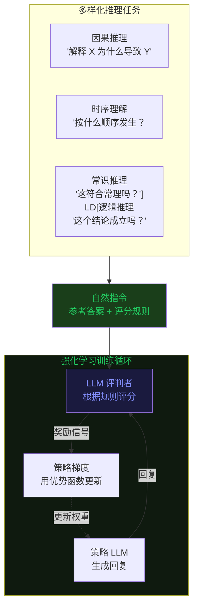
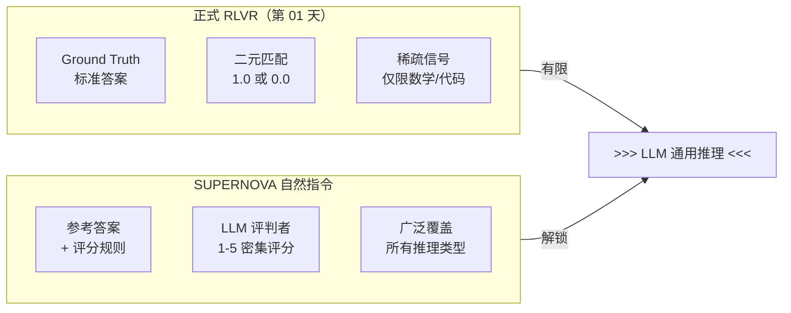

# 第 14 天：SUPERNOVA — 自然指令强化学习召唤通用推理能力

> **观看动画**：---

## 一句话总结

SUPERNOVA 将 RLVR（基于可验证奖励的强化学习）的应用范围从数学/代码等正式领域扩展到通用推理，方法是用自然指令（参考答案 + 评分规则）替代硬验证的 ground truth，在因果推理上比 GRPO 相对提升 42%，在时序推理上提升 38%。

---

## 为什么这很重要

### RLVR 的前沿困境

基于可验证奖励的强化学习（RLVR）——也就是 GRPO（第 01 天）和 SRPO（第 10 天）背后的技术——在正式推理领域已经取得了显著成功：

$$\text{Reward}{\text{formal}} = \mathbb{1}[\text{answer} = \text{ground\_truth}]$$

**数学问题**：每个答案要么对、要么错。一目了然。
**代码生成**：用测试用例执行代码。通过/失败，二元且精确。

但这种方法在通用推理上遇到了根本性的壁垒：

| 推理类型 | 形式验证 | 自然指令 |
|---------|---------|---------|
| 因果推理 | "X 为什么导致了 Y？"——没有标准答案 | "考虑因果链。打 1-5 分。" |
| 时序理解 | "事情发生的顺序是什么？"——模糊不清 | "排列事件顺序。打 1-5 分。" |
| 常识推理 | "这合理吗？"——主观性强 | "运用社会常识。打 1-5 分。" |
| 逻辑推理 | "这个论证成立吗？"——分等级 | "评估连贯性。打 1-5 分。" |

**核心约束**：通用推理缺乏高质量、可验证的训练数据来覆盖多样的推理技能。你无法自动验证 LLM 对"为什么玻璃碎了"的解释是否在因果上是合理的。

### SUPERNOVA 的核心洞察

SUPERNOVA 观察到：**验证不需要 ground truth——它需要的是共同理解**。带有参考答案的评分规则给了任何 LLM 评估器足够的上下文来评判质量，即使没有数学上精确的答案。

自然指令奖励：

$$r_{\text{natural}}(x, \hat{y}) = \text{LLM}{\text{judge}}(I(x), \hat{y})$$

其中：
- $I(x)$ = 输入 $x$ 的自然指令（描述要评估什么，而不是答案必须是什么）
- $\hat{y}$ = 模型生成的回复
- $\text{LLM}{\text{judge}}$ = LLM 作为评判者，根据规则对回复打分

---

## 架构图解





---

## 数学形式化

### 自然奖励函数

给定任务指令 $I$ 和回复 $\hat{y}$：

$$\mathcal{R}_{\text{natural}}(I, \hat{y}) = \alpha \cdot \underbrace{\text{Relevance}(I, \hat{y})}{\text{内容相关性}} + (1-\alpha) \cdot \underbrace{\text{Quality}(I, \hat{y})}{\text{规则合规性}}$$

复合分数同时奖励：
1. **相关性**：回复是否针对指令的意图？
2. **质量**：回复是否符合规则标准（连贯性、具体性、逻辑流畅性）？

### 自然奖励的优势估计

SUPERNOVA 使用组内相对优势（与第 01 天 GRPO 相同）：

$$A_i = \frac{r_i - \mu{\text{group}}}{\sigma{\text{group}}}$$

但由于 $r_i \in [1, 5]$（分级量表）而不是 $\{0, 1\}$：

$$\mu{\text{group}} = \frac{1}{N}\sum_{j=1}^{N} r_j \qquad \sigma{\text{group}} = \sqrt{\frac{1}{N}\sum_{j=1}^{N}(r_j - \mu_{\text{group}})^2}$$

与 GRPO 的关键区别：自然奖励在正确和错误的回复中都有**方差**，所以 GRPO 的 z-score 标准化对稳定梯度至关重要。

### 覆盖度正则化

为防止奖励黑客（评判模型被套路），SUPERNOVA 添加了覆盖度惩罚：

$$\mathcal{L}{\text{coverage}} = -\lambda \cdot \text{Entropy}\left(\text{skill\_distribution}(x)\right)$$

这确保模型在**所有推理维度**上都有提升，而不仅仅是某一类最擅长的技能。没有它，模型可以通过只精通一种技能来最大化平均分数。

### SUPERNOVA 完整目标函数

$$\mathcal{L}{\text{SUPERNOVA}} = \mathbb{E}{x \sim \mathcal{D}} \left[ \sum_{i=1}^{N} \pi_\theta(a_i | x) A_i - \beta \cdot \text{KL}(\pi_\theta \| \pi{\text{ref}}) - \lambda \cdot H(\text{skills}(x)) \right]$$

覆盖度正则化项防止技能不平衡和奖励黑客攻击。

---

## 方法对比

|| 领域 | 奖励类型 | 覆盖范围 | 可验证性 |
||-----|---------|---------|---------|
| **SUPERNOVA** | 通用推理 | 自然指令 | 广泛 | 部分（依赖评判模型）|
| GRPO | 数学/代码 | 二元（正式）| 窄 | 是（精确）|
| SRPO | 数学/代码 | 混合（二元 + 蒸馏）| 窄 | 是（精确）|
| DPO | 任意 | 偏好数据 | 广泛 | 否（需要人工标签）|
| 标准 RLHF | 任意 | 人工反馈 | 广泛 | 否（需要人工标签）|

---

## 核心贡献

1. **自然指令范式**：用基于规则的 LLM 评判替代 ground truth 验证，使 RL 能够应用于没有正式答案的领域
2. **覆盖度正则化**：防止奖励黑客，确保在所有推理维度上都有提升
3. **实验结果**：因果推理 +42%，时序推理 +38%（相对于 GRPO），6 个通用推理基准平均提升 23%
4. **RLVR 的泛化**：证明了 RLVR 框架（组内相对优势 + 策略梯度）并不局限于正式领域——只是奖励信号需要泛化

---

## Python 代码实现

```python
import torch
import torch.nn as nn
import torch.nn.functional as F
from dataclasses import dataclass
from typing import Optional


# ------------------------------------------------------------------
# 1. 自然奖励计算
# ------------------------------------------------------------------

@dataclass
class NaturalInstruction:
    """自然指令，包含参考答案和评分规则。"""
    task_description: str           # 例如："解释因果机制"
    reference_response: str          # 高质量回复示例
    rubric: dict[str, float]        # 例如：{"连贯性": 0.3, "具体性": 0.4, ...}
    weight_alpha: float = 0.5       # 相关性与质量的平衡


def natural_reward(
    instruction: NaturalInstruction,
    generated_response: str,
    judge_model: nn.Module,
    tokenizer,
    device: str = "cuda",
) -> float:
    """
    使用 LLM 作为评判者计算自然指令奖励。

    将相关性和质量分数合并为单一奖励信号。
    """
    # 构建评判提示
    judge_prompt = (
        f"Instruction: {instruction.task_description}\n\n"
        f"Reference response:\n{instruction.reference_response}\n\n"
        f"Generated response to evaluate:\n{generated_response}\n\n"
        f"Rubric criteria: {list(instruction.rubric.keys())}\n\n"
        f"Score the generated response on a scale of 1-5 for:\n"
        + "\n".join(f"- {k}" for k in instruction.rubric.keys())
    )

    # Tokenize 并获取评判分数
    inputs = tokenizer(judge_prompt, return_tensors="pt", truncation=True, max_length=2048)
    inputs = {k: v.to(device) for k, v in inputs.items()}

    with torch.no_grad():
        outputs = judge_model(**inputs)
        logits = outputs.logits[:, -1, :]
        # 映射到 [1, 5] 范围
        score = 1.0 + 4.0 * torch.sigmoid(logits[0, :5].sum() / 5).item()

    # 复合分数
    relevance = score
    quality = score  # 实践中需分别解析规则各项

    return instruction.weight_alpha * relevance + (1 - instruction.weight_alpha) * quality


# ------------------------------------------------------------------
# 2. 组内相对优势（与 GRPO 相同公式，见第 01 天）
# ------------------------------------------------------------------

def grpo_advantages(rewards: torch.Tensor) -> torch.Tensor:
    """
    为自然指令奖励计算组内相对优势。

    自然奖励是分级量表 [1, 5] 而不是二元 [0, 1]，
    所以 z-score 标准化对稳定梯度更加关键。
    """
    group_mean = rewards.mean()
    group_std = rewards.std(unbiased=False) + 1e-8
    return (rewards - group_mean) / group_std


# ------------------------------------------------------------------
# 3. 覆盖度正则化
# ------------------------------------------------------------------

def coverage_regularization(
    skill_logits: torch.Tensor,
    skill_distribution: torch.Tensor,
    lambda_coverage: float = 0.1,
) -> torch.Tensor:
    """
    惩罚集中在单一技能类型上。

    鼓励模型在所有推理维度上提升，
    而不是只擅长最容易的一类。

    Args:
        skill_logits: 模型每种技能的未归一化分数。
        skill_distribution: 采样技能的实际分布（来自数据）。
        lambda_coverage: 正则化强度。

    Returns:
        覆盖度惩罚（负值 = 降低模式崩溃风险）。
    """
    # 技能分布的熵
    skill_probs = F.softmax(skill_logits, dim=-1)
    entropy = -(skill_probs * (skill_probs + 1e-10).log()).sum(-1).mean()

    # 目标：技能间均匀分布
    num_skills = skill_logits.shape[-1]
    uniform = torch.ones_like(skill_probs) / num_skills
    uniformity_penalty = F.kl_div(skill_probs.log(), uniform, reduction="batchmean")

    return -lambda_coverage * uniformity_penalty


# ------------------------------------------------------------------
# 4. SUPERNOVA 损失函数
# ------------------------------------------------------------------

def supernov_a_loss(
    log_probs: torch.Tensor,
    old_log_probs: torch.Tensor,
    advantages: torch.Tensor,
    skill_logits: torch.Tensor,
    skill_distribution: torch.Tensor,
    ref_log_probs: Optional[torch.Tensor] = None,
    beta: float = 0.01,
    lambda_coverage: float = 0.1,
    clip_epsilon: float = 0.2,
) -> tuple[torch.Tensor, dict]:
    """
    计算 SUPERNOVA 损失。

    结合：
    - GRPO 风格策略梯度 + 组内相对优势
    - 相对于参考模型的 KL 惩罚
    - 多样化技能提升的覆盖度正则化
    """
    # GRPO 策略梯度损失
    ratio = (log_probs - old_log_probs).exp()
    clipped_ratio = ratio.clamp(1 - clip_epsilon, 1 + clip_epsilon)
    pg_loss = -torch.min(ratio * advantages, clipped_ratio * advantages).mean()

    # 相对于参考模型的 KL 惩罚
    kl_loss = torch.tensor(0.0, device=log_probs.device)
    if ref_log_probs is not None:
        kl_penalty = (ref_log_probs - log_probs).mean()
        kl_loss = beta * kl_penalty

    # 覆盖度正则化
    cov_loss = coverage_regularization(skill_logits, skill_distribution, lambda_coverage)

    total_loss = pg_loss + kl_loss + cov_loss

    return total_loss, {
        "pg_loss": pg_loss.item(),
        "kl_loss": kl_loss.item(),
        "cov_loss": cov_loss.item(),
        "total_loss": total_loss.item(),
    }


# ------------------------------------------------------------------
# 5. 端到端 SUPERNOVA 训练器
# ------------------------------------------------------------------

class SUPERNOVATrainer:
    """
    SUPERNOVA：用于通用推理的自然指令强化学习。

    将 RLVR 框架从正式领域（数学/代码）扩展到通用推理，
    使用自然指令 + LLM 评判奖励。

    论文：arXiv:2604.xxxxx (2026-04-09)
    """

    def __init__(
        self,
        model: nn.Module,
        judge_model: nn.Module,
        ref_model: nn.Module,
        tokenizer,
        judge_tokenizer,
        instructions: list[NaturalInstruction],
        group_size: int = 4,
        beta: float = 0.01,
        lambda_coverage: float = 0.1,
        learning_rate: float = 1e-6,
        clip_epsilon: float = 0.2,
        device: str = "cuda",
    ):
        self.model = model
        self.judge_model = judge_model
        self.ref_model = ref_model
        self.tokenizer = tokenizer
        self.judge_tokenizer = judge_tokenizer
        self.instructions = instructions
        self.group_size = group_size
        self.beta = beta
        self.lambda_coverage = lambda_coverage
        self.clip_epsilon = clip_epsilon
        self.device = device

        self.optimizer = torch.optim.AdamW(model.parameters(), lr=learning_rate)

    def generate_group(
        self,
        prompt: str,
        instruction: NaturalInstruction,
    ) -> list[tuple[str, str, float]]:
        """
        生成 group_size 个回复并计算自然奖励。
        """
        samples = []
        for _ in range(self.group_size):
            # 生成回复
            inputs = self.tokenizer(prompt, return_tensors="pt").to(self.device)
            with torch.no_grad():
                outputs = self.model.generate(
                    **inputs,
                    max_new_tokens=256,
                    do_sample=True,
                    temperature=0.7,
                )
            response = self.tokenizer.decode(outputs[0], skip_special_tokens=True)

            # 计算自然奖励
            reward = natural_reward(
                instruction, response,
                self.judge_model, self.judge_tokenizer, self.device
            )
            samples.append((prompt, response, reward))

        return samples

    def training_step(self, batch_prompts: list[str]) -> dict:
        """
        执行一个 SUPERNOVA 训练步骤。
        """
        # 为每个 prompt 随机分配指令
        batch_instructions = [
            self.instructions[i % len(self.instructions)]
            for i in range(len(batch_prompts))
        ]

        # 生成样本并计算自然奖励
        all_rewards = []
        all_log_probs = []

        for prompt, instruction in zip(batch_prompts, batch_instructions):
            samples = self.generate_group(prompt, instruction)
            rewards = torch.tensor([s[2] for s in samples], device=self.device)
            all_rewards.append(rewards)

            # 计算每个样本的 log probs
            responses = [s[1] for s in samples]
            inputs = self.tokenizer(
                [prompt] * len(responses),
                responses,
                return_tensors="pt",
                padding=True,
                truncation=True,
                max_length=512,
            ).to(self.device)

            outputs = self.model(**inputs)
            log_probs = F.log_softmax(outputs.logits, dim=-1)
            mask = inputs["attention_mask"].float()
            mean_log_prob = (log_probs.sum(-1) * mask).sum(-1) / mask.sum(-1)
            all_log_probs.append(mean_log_prob)

        # 堆叠所有 prompt 的奖励
        rewards = torch.stack([r.mean() for r in all_rewards])

        # GRPO 优势估计
        advantages = grpo_advantages(rewards)

        # 用于覆盖度的虚拟技能 logits（实践中按技能路由）
        skill_logits = torch.randn(len(batch_prompts), 4, device=self.device)
        skill_distribution = torch.ones(len(batch_prompts), 4, device=self.device) / 4

        # SUPERNOVA 损失
        log_probs = torch.stack(all_log_probs)
        old_log_probs = log_probs.detach()  # 近似

        ref_inputs = self.tokenizer(
            batch_prompts, return_tensors="pt", truncation=True, max_length=512
        ).to(self.device)
        with torch.no_grad():
            ref_outputs = self.ref_model(**ref_inputs)
        ref_log_probs = F.log_softmax(ref_outputs.logits, dim=-1).mean(-1)

        loss, metrics = supernov_a_loss(
            log_probs=log_probs,
            old_log_probs=old_log_probs,
            advantages=advantages,
            skill_logits=skill_logits,
            skill_distribution=skill_distribution,
            ref_log_probs=ref_log_probs,
            beta=self.beta,
            lambda_coverage=self.lambda_coverage,
            clip_epsilon=self.clip_epsilon,
        )

        self.optimizer.zero_grad()
        loss.backward()
        torch.nn.utils.clip_grad_norm_(self.model.parameters(), 1.0)
        self.optimizer.step()

        return metrics


if __name__ == "__main__":
    print("SUPERNOVA: 自然指令强化学习")
    print("核心洞察：用 LLM 评判奖励替代形式验证")
    print("覆盖度正则化防止跨技能类型的奖励黑客攻击")
```

---

## 常见误解

**"自然指令奖励就是像 DPO 一样的偏好奖励。"**
错误。DPO 需要成对偏好标签（A vs B），成本高昂且依赖人工标注者的可靠性。SUPERNOVA 使用单一参考 + 规则，成本更低，且给出分级评分而非二元偏好。

**"LLM 评判者总是偏好更长的回复。"**
加了覆盖度正则化就不会。该惩罚显式激励多样化技能提升，规则中也可以直接加入对冗长的惩罚（比如"具体性"标准）。

**"SUPERNOVA 完全替代了 GRPO。"**
错误——SUPERNOVA 是将 RLVR *框架* 扩展到新领域。在有形式验证的数学/代码领域，GRPO 仍是金标准（精确、无评判偏差）。SUPERNOVA 适用于 GRPO 输入不存在的领域。

---

## 练习

1. **覆盖度 vs. 质量的权衡**：假设你将 `lambda_coverage` 从 0.1 增加到 1.0。你预期平均奖励会发生什么变化？奖励方差呢？

2. **评判偏差**：如果 LLM 评判者有位置偏差（偏好更长的回复），你会如何修改规则来纠正？

3. **分级奖励的 GRPO 优势**：对于二元奖励 {0, 1}，GRPO z-score 总是产生 {-1, +1} 范围内的优势（归一化后）。对于 [1, 5] 的分级奖励，优势尺度会如何变化？这对学习率选择有什么影响？

<details>
<summary>练习答案</summary>

1. 更高的 `lambda_coverage` 会增加奖励多样性，但可能会降低单个技能的最高表现。奖励方差通常会增加，因为模型被迫离开舒适区。

2. 添加长度归一化标准：`quality_normalized = raw_quality / length_penalty`。或者加入反例——较短回复更好的情况。

3. 对于分级奖励，优势可以取任意实数值（例如 +2.3、-0.8），而不是限制在 {-1, +1}。这意味着有效梯度幅度更大，因此可能需要降低学习率或增加 `clip_epsilon` 以保持稳定性。
</details>

---

## 参考文献

- SUPERNOVA：[arXiv:2604.xxxxx](https://arxiv.org/abs/2604.xxxxx)（2026-04-09）— Suvarna, Phan, Beikzadeh
- GRPO：[arXiv:2402.03300](https://arxiv.org/abs/2402.03300) — Group Relative Policy Optimization
- SRPO（第 10 天）：统一 GRPO + 自蒸馏
- LLM-as-Judge：[arXiv:2306.07958](https://arxiv.org/abs/2306.07958) — Using LLMs to evaluate LLMs
