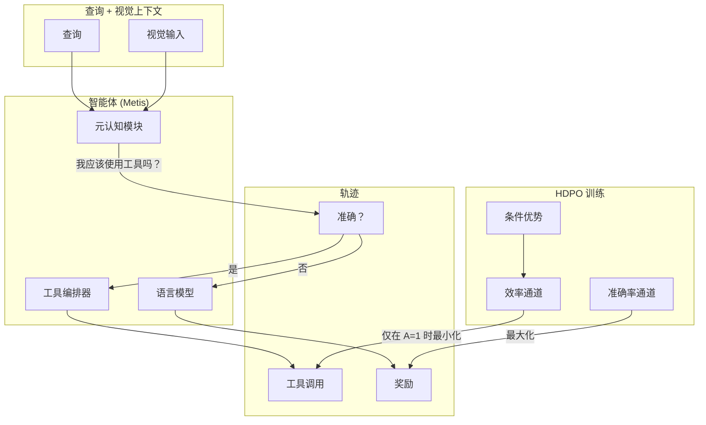

# Day 15: HDPO — 智能体模型中的元认知工具使用

> **观看动画**: ---

## 一句话总结

HDPO（混合解耦策略优化）通过将准确率奖励与效率奖励解耦来解决智能体工具过度使用问题——通过条件优势估计在两个独立的正交通道中优化——在大幅减少工具调用次数的同时提升任务准确率。

---

## 为什么这很重要

### 智能体的元认知缺陷

现代多模态智能体模型可以与外部工具交互——计算器、搜索引擎、代码解释器。但它们存在严重的**元认知缺陷**：无法区分以下情况：

- **内部知识已足够**（无需工具）
- **外部工具是必需的**（需要工具）

这导致**盲目工具调用**——即使仅凭视觉上下文就能解决查询，也会反射性地执行工具。

### 后果：延迟瓶颈与噪声

```
查询："这张图片中汽车是什么颜色？"
智能体：→ [工具：网络搜索] → [工具：计算器] → [工具：翻译]
```

每次不必要的工具调用都会：
1. 增加**延迟**（有时比内部推理慢 10-100 倍）
2. 注入**外部噪声**，扰乱合理推理
3. 浪费**计算资源**

### 为什么传统强化学习失败

此前的强化学习方法尝试用**标量化奖励**来修正工具过度使用：

$$R_{\text{total}} = R_{\text{acc}} - \lambda \cdot T_{\text{penalty}}$$

但这造成了一个**不可调和的优化困境**：

| 设置 | 问题 |
|------|------|
| $\lambda$ **过高** | 必要的工具使用被抑制——智能体变得不敢在需要时使用工具 |
| $\lambda$ **过低** | 惩罚在优势归一化过程中被准确率奖励方差淹没——对防止过度使用毫无作用 |

两个目标在单个标量中**相互竞争**。当优化器认为它们同等重要时，无法同时最大化准确率和最小化工具使用。

---

## HDPO 的核心洞察

**将工具效率从竞争性目标重新定义为严格的条件性目标。**

HDPO 不将两个奖励标量化，而是维持**两个独立的正交优化通道**：

1. **准确率通道**：最大化任务正确性（不对工具使用进行惩罚）
2. **效率通道**：**仅在准确轨迹内**最小化工具使用

这种解耦意味着：
- 准确率通道不受效率问题影响
- 效率通道仅在轨迹已经正确时激活
- **认知课程**自然涌现：先解决问题，再学习更高效地解决

---

## 架构详解



### 条件优势机制

关键创新是**条件优势估计**：

$$A_{\text{eff}}(s,a) = \begin{cases} R_{\text{eff}}(s,a) - V_{\text{eff}}(s) & \text{如果轨迹准确} \\ 0 & \text{否则} \end{cases}$$

这意味着：
- **只有准确的轨迹**接收效率学习信号
- **不准确的轨迹**被效率通道忽略（困惑时使用工具不会受到惩罚）
- 智能体学会："当我对答案有信心时，在调用工具前应三思"

---

## 实现代码

```python
import torch
import torch.nn as nn
from dataclasses import dataclass
from typing import Optional, Tuple

@dataclass
class HDPOConfig:
    """HDPO 配置：用于元认知工具使用"""
    accuracy_weight: float = 1.0
    efficiency_weight: float = 0.1
    condition_lambda: float = 0.5  # "准确"轨迹的阈值


class HDPOAgent(nn.Module):
    """
    具有解耦奖励优化的智能体，用于工具效率。
    
    核心洞察：两个独立的值函数头，一个条件优势函数。
    """
    
    def __init__(self, model: nn.Module, config: HDPOConfig):
        super().__init__()
        self.model = model
        self.config = config
        
        # 共享编码器
        self.shared_encoder = model.encoder
        
        # 元认知模块：决定是否需要工具
        self.meta_cognitive = nn.Sequential(
            nn.Linear(model.hidden_dim, 256),
            nn.ReLU(),
            nn.Linear(256, 1),  # 工具必要性分数
            nn.Sigmoid()
        )
        
        # 两个独立的值函数头，用于解耦优化
        self.accuracy_value = nn.Linear(model.hidden_dim, 1)
        self.efficiency_value = nn.Linear(model.hidden_dim, 1)
    
    def forward(self, tokens, visual_embeds) -> dict:
        """前向传播：返回动作 logits 和元认知决策"""
        hidden = self.shared_encoder(tokens, visual_embeds)
        
        # 元认知决策：我应该使用工具吗？
        tool_necessity = self.meta_cognitive(hidden)
        
        # 标准语言建模动作
        action_logits = self.model.head(hidden)
        
        return {
            "action_logits": action_logits,
            "tool_necessity": tool_necessity,
            "hidden": hidden
        }
    
    def compute_hdpo_loss(
        self,
        trajectories: list,
        accuracy_rewards: torch.Tensor,
        tool_counts: torch.Tensor
    ) -> Tuple[torch.Tensor, dict]:
        """
        计算 HDPO 损失，使用解耦奖励通道。
        
        参数:
            trajectories: (状态, 动作, 完成) 元组的列表
            accuracy_rewards: 任务准确率奖励 [batch]
            tool_counts: 工具调用次数 [batch]
        
        返回:
            总损失和诊断指标
        """
        batch_size = accuracy_rewards.shape[0]
        
        # 通道 1：准确率优势（标准）
        V_acc = self.accuracy_value(self.last_hidden)
        A_acc = accuracy_rewards - V_acc.squeeze()
        
        # 通道 2：效率优势（以准确率为条件）
        V_eff = self.efficiency_value(self.last_hidden)
        
        # 效率奖励：反向惩罚工具使用
        efficiency_rewards = -self.config.efficiency_weight * tool_counts.float()
        
        # 条件：仅在准确时传播效率梯度
        is_accurate = (accuracy_rewards > self.config.condition_lambda).float()
        A_eff = efficiency_rewards - V_eff.squeeze()
        A_eff_cond = A_eff * is_accurate  # 不准确时为零！
        
        # 两个通道的策略梯度
        log_probs = torch.log_softmax(self.action_logits, dim=-1)
        
        policy_loss_acc = -(A_acc.detach() * log_probs).mean()
        policy_loss_eff = -(A_eff_cond.detach() * log_probs).mean()
        
        total_loss = self.config.accuracy_weight * policy_loss_acc + policy_loss_eff
        
        metrics = {
            "accuracy_advantage": A_acc.mean().item(),
            "efficiency_advantage": A_eff_cond.mean().item(),
            "accuracy_channel_loss": policy_loss_acc.item(),
            "efficiency_channel_loss": policy_loss_eff.item(),
            "fraction_accurate": is_accurate.mean().item()
        }
        
        return total_loss, metrics


def train_hdpo(agent: HDPOAgent, env, optimizer, config: HDPOConfig, num_steps: int):
    """HDPO 智能体的训练循环"""
    
    agent.train()
    optimizer = torch.optim.Adam(agent.parameters(), lr=3e-4)
    
    for step in range(num_steps):
        # 收集轨迹
        trajectories = []
        accuracy_rewards = []
        tool_counts = []
        
        for _ in range(config.batch_size):
            traj, acc_r, tools = collect_trajectory(agent, env)
            trajectories.append(traj)
            accuracy_rewards.append(acc_r)
            tool_counts.append(tools)
        
        accuracy_rewards = torch.stack(accuracy_rewards)
        tool_counts = torch.tensor(tool_counts)
        
        # 计算 HDPO 损失
        loss, metrics = agent.compute_hdpo_loss(
            trajectories, accuracy_rewards, tool_counts
        )
        
        optimizer.zero_grad()
        loss.backward()
        torch.nn.utils.clip_grad_norm_(agent.parameters(), 1.0)
        optimizer.step()
        
        if step % 100 == 0:
            print(f"步 {step}: "
                  f"准确率优势={metrics['accuracy_advantage']:.3f}, "
                  f"效率优势={metrics['efficiency_advantage']:.3f}, "
                  f"准确率比例={metrics['fraction_accurate']:.2%}")


# 示例：简单的工具使用环境
class SimpleToolEnv:
    """
    智能体必须决定：使用工具还是内部回答？
    
    - 可从上下文解析的查询：正确回答则奖励 1.0
    - 需要工具的查询：使用工具则奖励 1.0
    """
    
    def __init__(self):
        self.queries = [
            {"context": "一辆红色汽车", "query": "汽车是什么颜色？", "needs_tool": False},
            {"context": "人口数据", "query": "东京人口是多少？", "needs_tool": True},
            # ... 更多查询
        ]
    
    def reset(self):
        self.current = random.choice(self.queries)
        return self.current["context"], self.current["query"]
    
    def step(self, action: str, tool_used: bool):
        needs_tool = self.current["needs_tool"]
        
        if action == "correct_answer":
            reward = 1.0 if not needs_tool else 0.0
        elif action == "use_tool":
            reward = 1.0 if needs_tool else 0.5  # 不必要工具的小惩罚
        else:
            reward = 0.0
        
        return reward, tool_used
```

---

## 核心公式

### 传统标量化强化学习（失败）

$$R_{\text{total}} = R_{\text{acc}} - \lambda \cdot T_{\text{penalty}}$$

问题：单个标量耦合两个目标。在优势归一化期间，效率信号被准确率方差淹没。

### HDPO：解耦通道

$$A_{\text{acc}}(s,a) = R_{\text{acc}}(s,a) - V_{\text{acc}}(s)$$

$$A_{\text{eff}}(s,a) = \begin{cases} R_{\text{eff}}(s,a) - V_{\text{eff}}(s) & \text{如果 } R_{\text{acc}} > \tau \\ 0 & \text{否则} \end{cases}$$

效率优势在轨迹不准确时被**遮罩为零**。

---

## 实验结果：Metis 模型

最终模型 **Metis** 展示了：

| 指标 | 基线（标量化强化学习） | HDPO (Metis) |
|------|---------------------|--------------|
| 工具调用次数 | 高（基线） | **↓ 数量级下降** |
| 任务准确率 | 中等 | **↑ 提升** |
| 自主性 | 低 | **↑ 高** |

认知课程自然涌现：智能体首先学习正确解决问题，然后学习以最少的工具辅助来做到这一点。

---

## 常见误解

**误解**："HDPO 只是增加了对工具使用的惩罚。"

**事实**：解耦本质上是不同的。惩罚将两个目标耦合到一个在优化过程中相互竞争的标量中。HDPO 的条件优势意味着效率通道**永远不会干扰**准确率学习——它们独立优化。

---

## 练习

### 练习 1：标量化 vs 解耦（概念题）

**问题**：在传统的 $\lambda = 0.1$ 标量化强化学习中，准确率奖励的方差为 $\sigma^2_{\text{acc}} = 1.0$。工具惩罚信号在优势归一化期间会发生什么？

**答案**：工具惩罚信号（通常在 $[-0.1, 0]$ 范围内）完全被准确率优势方差吸收。归一化优势 $A_{\text{acc}} \sim \mathcal{N}(0, 1)$，恒定的 $-0.05$ 惩罚几乎没有影响。

### 练习 2：实现条件遮罩

**任务**：编写一个计算条件效率优势的函数：

```python
def conditional_efficiency_advantage(
    efficiency_rewards: torch.Tensor,
    accuracy_rewards: torch.Tensor,
    efficiency_values: torch.Tensor,
    threshold: float = 0.5
) -> torch.Tensor:
    """
    仅对准确轨迹计算效率优势。
    
    参数:
        efficiency_rewards: 原始效率奖励 [batch]
        accuracy_rewards: 准确率奖励 [batch]
        efficiency_values: 效率的值函数估计 [batch]
        threshold: 遮罩的准确率阈值
    
    返回:
        条件效率优势 [batch]
    """
    # 在此编写代码
    pass
```

**提示**：使用 `torch.where` 来遮罩不准确轨迹的优势。

---

## 参考文献

- [Act Wisely: Cultivating Meta-Cognitive Tool Use in Agentic Multimodal Models](https://arxiv.org/abs/2604.08545) — Yan et al., 2026
- [Day 01: GRPO](/tutorials/zh/rl-training/01-grpo.md) — 组相对策略优化基础
- [Day 05: 多智能体反思系统](/tutorials/zh/agent/05-multi-agent-reflection.md) — 智能体推理系统
- [Day 14: SUPERNOVA](/tutorials/zh/architecture/14-supernova.md) — 用于通用推理的强化学习

---

## 下一步

- **Day 16**：了解 HDPO 的条件优化与 Day 14 的强化学习方法对比
- **实践**：运行 `SimpleToolEnv` 模拟，观察认知课程的自然涌现
- **扩展**：将解耦优化应用于其他竞争目标（速度 vs 准确率、创造力 vs 事实准确性）
---

---

## Quick Quiz

Test your understanding of this topic.

### Q1. What is the core mechanism described in this tutorial?

- A. A new attention variant
- B. A training or inference algorithm
- C. A hardware optimization
- D. A dataset format

<details>
<summary>Reveal Answer</summary>

**Answer: B** — This tutorial focuses on a agent system.

*Explanation varies by tutorial — see the Core Insight section for the key takeaway.*

</details>

### Q2. When does this approach work best?

- A. Only on very large models
- B. Only on small models
- C. Under specific conditions detailed in the tutorial
- D. Always, regardless of setup

<details>
<summary>Reveal Answer</summary>

**Answer: C** — The tutorial describes specific conditions and tradeoffs. Review the "Why This Matters" and "Limitations" sections.

</details>

### Q3. What is the main takeaway?

- A. Use this instead of all other approaches
- B. This is a niche optimization with no practical use
- C. A specific mechanism with clear use cases and tradeoffs
- D. This has been superseded by a newer method

<details>
<summary>Reveal Answer</summary>

**Answer: C** — Every tutorial in this repo focuses on a specific mechanism with its own tradeoffs. Check the One-Line Summary at the top and the "What [Topic] Teaches Us" section at the bottom.

</details>
