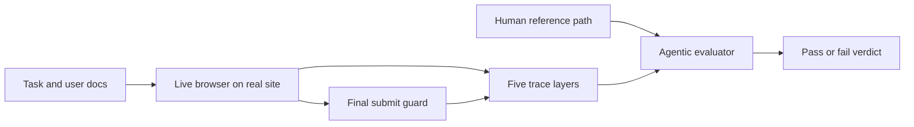

# Day 17: ClawBench — AI 智能体真的能完成日常在线任务吗？

> **观看动画**: 

## 一句话总结

ClawBench 用真实生产网站上的日常在线任务来衡量浏览器智能体的实际能力，而它给出的结论很直接：一旦任务变成写入型、会改变状态、并且需要安全拦截的真实流程，当前最强的一线模型离“可靠自动化”还很远。

---

## 为什么这很重要

### 现有很多智能体基准太“干净”了

最近网页智能体在 WebArena、OSWorld 之类基准上的表现看起来不错，但这些环境通常做了不少简化：

- 离线或自托管网站
- 固定 DOM 结构
- 较少动态内容
- 偏读取型任务，而不是写入型流程

这让评测更容易，但也掩盖了用户真正关心的失败模式：

- 能不能正确填长表单
- 能不能上传正确文件
- 能不能完成多页流程
- 能不能处理弹窗、跳转和动态渲染

### ClawBench 换了一个更现实的问题

它不是问“智能体能否浏览一个简化网站”，而是在问：

**智能体能否安全地完成用户真正愿意委托的在线任务？**

论文给出的规模是：**153 个任务、144 个真实平台、15 个生活类别**，包括购物、预约、求职等典型日常流程。

---

## 核心洞察

### 1. 真实性来自“活网站”

ClawBench 不在沙箱里复刻网站，而是让智能体直接操作**真实生产网站**。

这意味着它保留了现实世界最麻烦的部分：

- 动态 JavaScript
- cookie 弹窗
- 变化的表单结构
- 多步骤导航
- 与用户文档相关的填写内容

这也是为什么在更干净的 benchmark 上表现好的模型，迁移到这里会明显掉速。

### 2. 安全性来自“最终请求拦截”

真实网站很有价值，但也带来风险：如果智能体真的完成了任务，可能会触发真实购买、真实预约、真实提交。

ClawBench 的处理方式很巧：

- 智能体前面的浏览与填写都照常进行
- 监控外发网络请求
- 在**最终提交请求**发出前进行拦截和阻断

所以它保留了几乎完整的真实流程，同时避免不可逆副作用。

### 3. 评估依赖轨迹证据，而不是猜结果

论文对每次运行记录五层证据：

1. session replay
2. 每一步截图
3. HTTP 流量
4. 智能体消息与工具调用
5. 底层浏览器动作

然后再由 **Agentic Evaluator** 把智能体轨迹和人工参考轨迹放在同一规则下比对。这样做的关键在于：网页任务往往存在多条可行路径，仅靠动作序列对齐太脆弱。

### 4. 结果非常残酷

论文中最强的模型 **Claude Sonnet 4.6**，在 ClawBench 上也只有 **33.3%** 成功率。论文同时给出 **GPT-5.4 为 6.5%**。而图示说明这两类模型在一些既有网页智能体基准上通常明显更强。

这正是论文想强调的结论：当前智能体系统在“日常真实在线任务”上依然很脆弱。

---

## 架构流程



### 这个流程为什么不一样

- **真实执行**：保留真实网站复杂度
- **提交拦截**：保证评测安全
- **多层轨迹**：让失败可追踪
- **参考轨迹比对**：避免只看 URL 或截图的粗糙评估

---

## 数学表述

### 二值任务分数

对每个任务 $t$，评估器输出：

$$\mathrm{Score}(t) \in \{0, 1\}$$

其中：

- $1$ 表示任务正确完成
- $0$ 表示任务失败，或在关键步骤上偏离要求

### 总体成功率

对任务集合 $T$，总体成功率定义为：

$$\mathrm{SR}(T) = \frac{1}{|T|} \sum_{t \in T} \mathrm{Score}(t)$$

这就是论文的核心主指标。

### 基于轨迹证据的评估

可以把评估器抽象写成：

$$\mathcal{A}(x_t,\tau_a^{(t)},\tau_h^{(t)}) \rightarrow \{0,1\}$$

其中：

- $x_t$ 是任务说明与验证条件
- $\tau_a^{(t)}$ 是记录到的智能体轨迹
- $\tau_h^{(t)}$ 是记录到的人工参考轨迹

重点在于：成功不是靠“最后像不像”，而是靠**证据、字段和流程一致性**来判定。

---

## 实现代码

```python
from dataclasses import dataclass, field
from typing import Dict, List, Tuple


@dataclass
class TaskSpec:
    """一个简化版的 ClawBench 任务定义。"""
    task_id: str
    instruction: str
    required_fields: Dict[str, str]
    category: str


@dataclass
class TraceBundle:
    """执行过程中记录的五层证据。"""
    replay_frames: int
    screenshots: List[str] = field(default_factory=list)
    http_requests: List[Dict[str, str]] = field(default_factory=list)
    agent_messages: List[str] = field(default_factory=list)
    browser_actions: List[str] = field(default_factory=list)


class FinalSubmitGuard:
    """
    阻断不可逆的最终提交请求，但保留前面的真实浏览流程。
    """

    def intercept(self, request: Dict[str, str]) -> Tuple[bool, str]:
        if request.get("kind") == "final-submit":
            return True, "blocked final submit safely"
        return False, "allowed"


class AgenticEvaluator:
    """
    通过检查被拦截的最终 payload 是否满足任务要求来打分。
    真实论文中的评估更复杂，但这个版本保留了核心思想。
    """

    def score(self, task: TaskSpec, traces: TraceBundle) -> Tuple[int, List[str]]:
        reasons: List[str] = []
        final_payload = None

        for req in traces.http_requests:
            if req.get("kind") == "final-submit":
                final_payload = req
                break

        if final_payload is None:
            return 0, ["no submission payload captured"]

        for key, expected in task.required_fields.items():
            actual = final_payload.get(key)
            if actual != expected:
                reasons.append(f"field mismatch: {key} expected={expected} got={actual}")

        if not traces.browser_actions:
            reasons.append("no browser actions recorded")
        if not traces.agent_messages:
            reasons.append("no reasoning trace recorded")

        return (1, ["pass"]) if not reasons else (0, reasons)


def success_rate(results: List[int]) -> float:
    return sum(results) / len(results) if results else 0.0


if __name__ == "__main__":
    task = TaskSpec(
        task_id="job-apply-001",
        instruction="Submit a job application with the provided resume.",
        required_fields={"name": "Ada Lovelace", "resume": "resume.pdf"},
        category="work",
    )

    traces = TraceBundle(
        replay_frames=412,
        screenshots=["step1.png", "step2.png"],
        http_requests=[
            {"kind": "navigate", "url": "https://jobs.example.com"},
            {
                "kind": "final-submit",
                "name": "Ada Lovelace",
                "resume": "resume.pdf",
            },
        ],
        agent_messages=["I found the upload form.", "I am ready to submit."],
        browser_actions=["click upload", "type name", "click submit"],
    )

    guard = FinalSubmitGuard()
    blocked, message = guard.intercept(traces.http_requests[-1])
    print(f"guard: blocked={blocked}, message={message}")

    evaluator = AgenticEvaluator()
    score, details = evaluator.score(task, traces)
    print(f"score={score}, details={details}")
    print(f"success rate={success_rate([score]):.3f}")
```

---

## ClawBench 告诉了我们什么

1. **真实浏览器智能体仍然很脆弱。**
2. **写入型任务明显比只读浏览困难得多。**
3. **安全评测需要网络层拦截，而不只是沙箱模拟。**
4. **好的智能体评估必须可追踪、可诊断，而不只是看最后结果。**
5. **在合成环境里赢 benchmark，不等于在真实日常任务里可靠。**

---

## 相关教程

- [Day 05: 多智能体反思系统](/tutorials/zh/agent/05-multi-agent-reflection.md)
- [Day 15: HDPO — 元认知工具使用](/tutorials/zh/agent/15-hdpo.md)

---

## 参考资料

- [ClawBench: Can AI Agents Complete Everyday Online Tasks?](https://arxiv.org/abs/2604.08523) — Zhang et al., 2026-04-09
- [ClawBench 官方网站](https://www.clawbench.com/)
