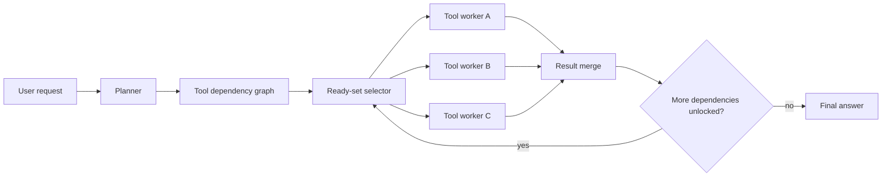

# 第 21 天：并行工具调用 — 别让智能体自己等自己

> **观看动画**: 

## 一句话总结

并行工具调用会让智能体把彼此独立的工具请求同时执行，因此总延迟更接近最长依赖链，而不是所有工具等待时间的总和。

---

## 为什么这很重要

### 串行工具调用，会把聪明智能体变成慢智能体

很多智能体循环现在还在做一件很浪费的事：

1. 先决定一个工具调用
2. 等它返回
3. 读结果
4. 再决定下一个工具调用

如果后一步真的依赖前一步，这当然没问题；但如果这些请求本来就互相独立，这种串行等待就只是白白增加延迟：

- 同时搜索三个来源
- 并行读取天气和日历
- 先读多份文档，再统一写结论
- 对多个索引同时做检索

只要智能体已经知道依赖结构，强行串行执行，本质上就是在让它“等自己”。

### 前沿信号已经开始收敛

这个主题值得做日报，不是因为某一个孤立 demo，而是三路信号都在收敛：

- **arXiv**：像 **W&D** 和 **SimpleTool** 这样的近期工作，已经明确把并行工具调用 / 并行函数调用当作核心问题来优化
- **Hugging Face Papers**：这两篇工作都已经出现在 Hugging Face Papers，说明它们具备直接的社区可见度
- **Reddit / r/LocalLLaMA**：本地部署者已经在实际推理栈里主动打开 `parallel_tool_calls`，因为它会直接改变 agent 延迟表现

所以今天真正值得讲的 durable concept 不是“某篇 paper 很火”，而是：

**智能体延迟不仅取决于模型能力，也取决于调度方式。**

---

## 核心洞察

### 1. 工具调用天然构成依赖图

一个 agent 请求往往会被拆成多个子任务：

- 收集证据
- 计算或转换数值
- 汇总结果

其中有些步骤互相依赖，但很多步骤其实并不依赖。更合适的抽象因此不是单条链，而是**依赖图**。

### 2. 并行应当基于“就绪集”，而不是盲目全量扇出

重点不是“把所有工具一次性全打出去”。

那样会：

- 浪费 token
- 过度查询工具
- 把结果合并阶段搞得很嘈杂

更合理的流程是：

1. 先规划需要哪些工具输出
2. 找出当前已经就绪的调用
3. 并发执行这一层 ready set
4. 合并结果
5. 解锁下一层依赖

这更接近 DAG 调度，而不是粗暴并发。

### 3. 延迟目标函数会完全变化

在串行循环里，总时间大约是：

$$
T_{\mathrm{seq}} = \sum_{i=1}^{n} \tau_i
$$

其中 $\tau_i$ 表示第 $i$ 个工具调用的延迟。

而在分层并行的调度里，总时间变成：

$$
T_{\mathrm{par}} = \sum_{k=1}^{K} \max_{i \in L_k} \tau_i + \tau_{\mathrm{merge}}
$$

其中 $L_k$ 表示第 $k$ 个并行层里的工具集合。

这意味着优化目标不再只是“把每个工具都做快”，而是：

**缩短关键路径，并控制合并开销。**

### 4. 更好的调度也会反过来改变训练和解码设计

近期系统是从不同层面切这个问题的：

- **W&D** 更偏 deep research agent 的高效编排
- **SimpleTool** 更偏实时函数调用里的并行解码

机制不同，但核心教训一致：

**智能体若想支持并发行动，需要显式结构，而不只是更强的 next-token prediction。**

---

## 架构流程



### 和基础 agent loop 相比，真正变化在哪里

- planner 输出的不只是“下一步调用什么”，而是**结构化依赖**
- 执行阶段按**就绪层**并发推进
- merge 变成一等公民，因为并行调用会产生多个局部结果
- agent 不再只是“一次调一个工具”，而更像一个小型 workflow engine

---

## 数学形式化

### 依赖图

把工具计划写成一个有向无环图：

$$
G = (V, E)
$$

其中：

- $V$ 是工具调用集合
- $E$ 是前后依赖约束

如果 $(u, v) \in E$，表示调用 $v$ 必须等到 $u$ 完成之后才能启动。

### 串行执行成本

如果所有工具都按顺序一个个执行，总延迟就是：

$$
T_{\mathrm{seq}} = \sum_{i=1}^{n} \tau_i
$$

这会忽略一个事实：很多调用之间本来就没有依赖关系。

### 分层并行执行成本

把 DAG 按 ready layer 划成 $L_1, L_2, \dots, L_K$，则：

$$
T_{\mathrm{par}} = \sum_{k=1}^{K} \max_{i \in L_k} \tau_i + \tau_{\mathrm{merge}}
$$

其中：

- $\tau_i$ 是调用 $i$ 的延迟
- $\tau_{\mathrm{merge}}$ 是结果合并开销

### 加速比

延迟加速比可以写成：

$$
S = \frac{T_{\mathrm{seq}}}{T_{\mathrm{par}}}
$$

并行工具调用只有在下面这些条件下才真正有价值：

- 有足够多的独立调用
- merge 开销可控
- 并发不会明显破坏工具质量

所以这本质上是一个系统权衡，而不是白拿的收益。

---

## Python 代码实现

```python
import asyncio
import time
from dataclasses import dataclass, field


@dataclass
class ToolSpec:
    name: str
    latency: float
    deps: set[str] = field(default_factory=set)


async def run_tool(spec: ToolSpec) -> tuple[str, float]:
    await asyncio.sleep(spec.latency)
    return spec.name, spec.latency


def ready_set(specs: dict[str, ToolSpec], done: set[str], launched: set[str]) -> list[ToolSpec]:
    ready: list[ToolSpec] = []
    for spec in specs.values():
        if spec.name in launched:
            continue
        if spec.deps.issubset(done):
            ready.append(spec)
    return ready


async def run_parallel(specs: list[ToolSpec]) -> float:
    spec_map = {spec.name: spec for spec in specs}
    done: set[str] = set()
    launched: set[str] = set()
    started = time.perf_counter()

    while len(done) < len(specs):
        layer = ready_set(spec_map, done, launched)
        if not layer:
            raise ValueError("dependency cycle detected")

        launched.update(spec.name for spec in layer)
        results = await asyncio.gather(*(run_tool(spec) for spec in layer))
        done.update(name for name, _ in results)

    return time.perf_counter() - started


async def run_serial(specs: list[ToolSpec]) -> float:
    started = time.perf_counter()
    for spec in specs:
        await run_tool(spec)
    return time.perf_counter() - started


async def main() -> None:
    specs = [
        ToolSpec("search_web", 0.20),
        ToolSpec("read_docs", 0.30),
        ToolSpec("compute_quote", 0.10),
        ToolSpec("merge_answer", 0.05, {"search_web", "read_docs", "compute_quote"}),
    ]

    serial_time = await run_serial(specs)
    parallel_time = await run_parallel(specs)
    print(f"serial={serial_time:.3f}s")
    print(f"parallel={parallel_time:.3f}s")
    print(f"speedup={serial_time / parallel_time:.2f}x")


if __name__ == "__main__":
    asyncio.run(main())
```

这个玩具例子保留了核心机制：

- 三个独立调用可以并行跑
- merge 步骤要等它们全部完成
- 总延迟由 ready set 里最慢的那条分支主导

---

## 并行工具调用告诉了我们什么

1. **智能体速度有一部分其实是调度问题。**
2. **独立工具调用应该被看作图，而不是链。**
3. **真正该优化的是关键路径延迟，而不只是调用次数。**
4. **并行执行一定要配套干净的 merge 逻辑。**
5. **即使底层模型不变，更好的工具编排也能明显改善用户体验。**

---

## 相关教程

- [Day 05: 多智能体反思系统](/tutorials/zh/agent/05-multi-agent-reflection.md)
- [Day 15: HDPO — 元认知工具使用](/tutorials/zh/agent/15-hdpo.md)
- [Day 17: ClawBench — 日常在线任务智能体基准](/tutorials/zh/agent/17-clawbench.md)

---

## 参考资料

- [W&D: Scaling Parallel Tool Calling for Efficient Deep Research Agents](https://arxiv.org/abs/2602.07359) — 2026-02-10
- [SimpleTool: Parallel Decoding for Real-Time LLM Function Calling](https://arxiv.org/abs/2603.00030) — 2026-03-01
- [W&D on Hugging Face Papers](https://huggingface.co/papers/2602.07359)
- [SimpleTool on Hugging Face Papers](https://huggingface.co/papers/2603.00030)
- [LocalLLaMA 里提到 `parallel_tool_calls` 的讨论](https://www.reddit.com/r/LocalLLaMA/comments/1sner7l/lazy_persons_model_param_management_for_llamacpp/)
