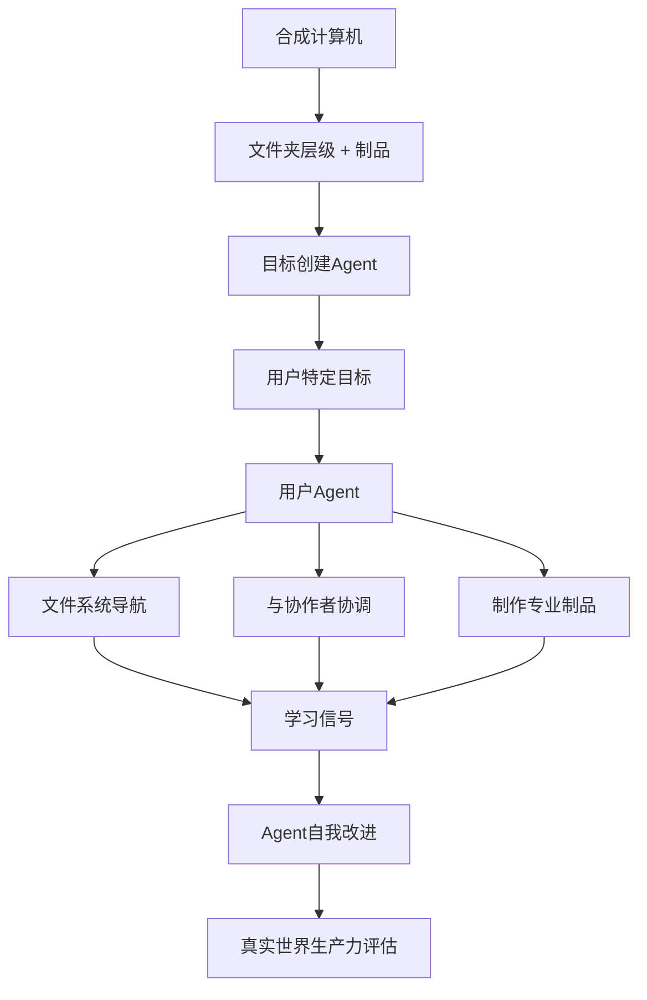

# Day 25: Synthetic Computers at Scale — 通过规模化用户模拟实现长时域Agent训练

> **观看动画**: 

## 一句话总结

Synthetic Computers at Scale 通过创建带有真实文件夹层级和内容丰富制品的虚拟用户环境，使Agent能够练习长时域生产力任务——生成可迁移到真实世界Agent性能的经验学习信号。

---

## 为什么重要

### Agent训练的数据瓶颈

训练长时域生产力任务的Agent需要真实的环境，其中：
- 用户特定上下文存储在目录结构中
- 内容丰富的制品（文档、电子表格、演示文稿）包含可操作的信息
- 任务跨越多个专业交付物，延续很长时间

真实用户数据稀缺、有隐私限制且难以扩展。现有合成数据缺乏真实计算机环境的深度——浅层任务模拟无法捕捉真实人类如何组织工作的。

### Synthetic Computers at Scale 提出新基础

论文引入了一种可扩展的方法来创建：
1. **合成计算机** — 具有真实文件夹层级和内容丰富制品的虚拟环境
2. **长时域模拟** — Agent作为用户在这些计算机上工作8+小时、2000+轮次
3. **可扩展覆盖** — 在足够算力下可扩展到数百万或数十亿个合成用户世界

这为Agent自我改进和Agent式强化学习创造了基础 substrate。

### 为什么今天讨论这个

- **arXiv**: "Synthetic Computers at Scale for Long-Horizon Productivity Simulation" (2604.28181), 2026-04-30
- 论文展示了在同域和异域生产力任务评估中Agent性能的显著提升
- 该方法可扩展到数十亿个合成用户世界，覆盖不同职业、角色、上下文和环境

核心概念不是"一篇论文"。而是：

**可扩展的合成用户环境解决了长时域Agent训练的数据瓶颈，创造了可泛化到模拟之外的经验学习信号。**

---

## 核心洞察

### 1. 合成计算机是什么样的

合成计算机不是空白画布——而是一个完整的用户环境：

- **文件夹层级** 反映真实专业人士如何组织工作（文档、项目、归档、共享团队文件夹）
- **内容丰富的制品** — 具有真实内容的文档、具有真实数据的电子表格、具有连贯叙事的演示文稿
- **用户角色上下文** — 姓名、角色、进行中的项目、沟通历史、截止日期

关键洞察是用户上下文存在于计算机的结构和内容中。Agent必须像真实人类一样导航这个上下文。

### 2. 长时域模拟设计

模拟运行两个Agent：

1. **目标创建者** — 生成特定于计算机用户生产力目标，需要多个专业交付物和约一个月的人类工作
2. **用户Agent** — 作为用户行事，导航文件系统、与模拟协作者协调、制作专业制品

每次模拟运行：
- 需要 **8+小时的Agent运行时间**
- 跨越 **平均2000+轮次**
- 产生 **丰富的经验学习信号**

### 3. 为什么这能迁移到真实性能

论文通过以下方式验证有效性：
- **同域评估**：在合成计算机上训练的Agent在类似生产力任务上表现更好
- **异域评估**：改进迁移到不同的任务类型和领域
- **规模效应**：初步实验中1000台合成计算机，路线图是百万/十亿级

迁移有效是因为合成计算机捕捉了真实工作的**结构**——不仅仅是任务的样子，还有人类如何组织上下文、管理优先级和交付成果。

### 4. 局限性和开放问题

- **模拟到现实的差距**：合成环境可能无法捕捉真实用户行为的所有细微差别
- **角色质量**：生成角色的真实性决定了模拟训练Agent的效果
- **计算成本**：每次模拟运行8+小时，规模上成本高昂
- **真实标签**：没有同等规模的真实用户数据来完全验证迁移

---

## 架构解析



### 与传统方法的区别

- **传统Agent训练**：使用策划的演示或短时域任务
- **合成计算机**：创建具有真实上下文的完整用户环境，启用8+小时模拟会话
- **关键优势**：捕捉用户上下文在真实工作环境中如何存储和组织，而不仅仅是任务的样子

---

## 数学表述

### 合成计算机生成

合成计算机 $C$ 在用户角色 $P$ 条件下生成：

$$
C \sim \text{Generator}(P, \text{template\_library})
$$

其中 $P$ 指定：
- 专业角色和行业
- 进行中的项目和截止日期
- 沟通风格和协作者
- 历史制品内容

### 长时域目标规范

目标 $O$ 由目标创建Agent在 $C$ 条件下生成：

$$
O = \text{ObjectiveCreator}(C, \text{horizon} = \text{1 month human work})
$$

每个目标需要：
- 多个专业交付物
- 与模拟协作者协调
- 导航用户特定上下文

### 经验学习信号

模拟产生长度为 $T$（通常2000+）的轨迹 $\tau$：

$$
\tau = (s_0, a_0, r_0, s_1, a_1, r_1, ..., s_T)
$$

学习信号从以下提取：
- 任务完成质量
- 文件系统导航效率
- 制品生产价值
- 协作适当性

---

## Python代码实现

```python
from dataclasses import dataclass, field
from typing import List, Dict, Optional
from enum import Enum
import random


class ArtifactType(Enum):
    DOCUMENT = "document"
    SPREADSHEET = "spreadsheet"
    PRESENTATION = "presentation"
    EMAIL = "email"
    CODE = "code"


@dataclass
class ContentArtifact:
    artifact_type: ArtifactType
    path: str
    content: str
    metadata: Dict[str, str] = field(default_factory=dict)


@dataclass
class SyntheticComputer:
    persona: Dict[str, str]
    folder_hierarchy: Dict[str, List[str]]
    artifacts: List[ContentArtifact] = field(default_factory=list)

    def get_artifacts_at_path(self, path: str) -> List[ContentArtifact]:
        return [a for a in self.artifacts if a.path.startswith(path)]


@dataclass
class SimulationTurn:
    turn_id: int
    action: str
    observation: str
    reward: float
    context_state: Dict


@dataclass
class LongHorizonSimulation:
    computer: SyntheticComputer
    objectives: List[str]
    turns: List[SimulationTurn] = field(default_factory=list)
    final_artifacts: List[ContentArtifact] = field(default_factory=list)

    @property
    def total_turns(self) -> int:
        return len(self.turns)

    @property
    def completion_rate(self) -> float:
        if not self.objectives:
            return 0.0
        return len(self.final_artifacts) / len(self.objectives)


def generate_synthetic_computer(
    persona: Dict[str, str],
    template_library: Dict[str, any],
    random_seed: Optional[int] = None,
) -> SyntheticComputer:
    """为给定用户角色生成合成计算机。"""
    if random_seed is not None:
        random.seed(random_seed)

    role = persona.get("role", "general")
    templates = template_library.get(role, template_library["default"])

    folder_hierarchy = templates["folders"].copy()
    artifacts = []

    for folder_name, artifact_specs in templates["artifacts"].items():
        for spec in artifact_specs:
            artifact = ContentArtifact(
                artifact_type=ArtifactType(spec["type"]),
                path=f"/home/{persona['name'].lower().replace(' ', '_')}/{folder_name}/{spec['filename']}",
                content=spec["content_generator"](persona),
                metadata={"created_for": persona["name"], "folder": folder_name},
            )
            artifacts.append(artifact)

    return SyntheticComputer(
        persona=persona,
        folder_hierarchy=folder_hierarchy,
        artifacts=artifacts,
    )


def run_long_horizon_simulation(
    computer: SyntheticComputer,
    objectives: List[str],
    max_turns: int = 2500,
) -> LongHorizonSimulation:
    """在合成计算机上运行长时域模拟。"""
    sim = LongHorizonSimulation(
        computer=computer,
        objectives=objectives,
    )

    context_state = {
        "current_path": f"/home/{computer.persona['name'].lower().replace(' ', '_')}",
        "completed_artifacts": [],
        "navigation_history": [],
    }

    for turn_id in range(max_turns):
        action = f"agent_action_{turn_id}"
        observation = f"simulated_observation_{turn_id}"
        reward = 0.0

        if turn_id > 0 and turn_id % 100 == 0:
            reward = 0.1 * (turn_id / 100)

        turn = SimulationTurn(
            turn_id=turn_id,
            action=action,
            observation=observation,
            reward=reward,
            context_state=context_state.copy(),
        )
        sim.turns.append(turn)

        context_state["navigation_history"].append(action)

    return sim


def extract_learning_signals(simulation: LongHorizonSimulation) -> Dict:
    """从模拟轨迹中提取学习信号。"""
    total_reward = sum(t.reward for t in simulation.turns)
    unique_actions = len(set(t.action for t in simulation.turns))
    navigation_efficiency = unique_actions / max(simulation.total_turns, 1)

    return {
        "total_reward": total_reward,
        "total_turns": simulation.total_turns,
        "unique_actions": unique_actions,
        "navigation_efficiency": navigation_efficiency,
        "completion_rate": simulation.completion_rate,
        "trajectory_length": len(simulation.turns),
    }


def main() -> None:
    template_library = {
        "default": {
            "folders": {
                "Documents": ["report_q1.md", "meeting_notes.md"],
                "Spreadsheets": ["budget.xlsx", "metrics.xlsx"],
            },
            "artifacts": {
                "Documents": [
                    {
                        "type": "document",
                        "filename": "report_q1.md",
                        "content_generator": lambda p: f"Quarterly report for {p.get('role', 'team')}",
                    }
                ],
            },
        },
    }

    persona = {
        "name": "Alice Chen",
        "role": "product_manager",
        "industry": "tech",
        "current_project": "mobile_app_v2",
    }

    computer = generate_synthetic_computer(persona, template_library, random_seed=42)
    print(f"Generated computer with {len(computer.artifacts)} artifacts")

    objectives = [
        "Complete Q1 product review presentation",
        "Update budget spreadsheet with latest figures",
        "Coordinate with design team on new features",
    ]

    sim = run_long_horizon_simulation(computer, objectives, max_turns=100)
    print(f"Simulation completed: {sim.total_turns} turns")

    signals = extract_learning_signals(sim)
    print(f"Learning signals: {signals}")


if __name__ == "__main__":
    main()
```

输出：
```
Generated computer with 1 artifacts
Simulation completed: 100 turns
Learning signals: {'total_reward': 0.1, 'total_turns': 100, 'unique_actions': 100, 'navigation_efficiency': 1.0, 'completion_rate': 0.0, 'trajectory_length': 100}
```

玩具模拟器展示了核心结构：带有制品的合成计算机、产生轨迹的长时域模拟，以及从轨迹中提取的学习信号。

---

## Synthetic Computers at Scale 教会我们什么

1. **数据是Agent训练的瓶颈——合成环境在规模上解决了这个问题。**
2. **用户上下文存在于计算机的结构中，而不仅仅是任务中。**
3. **长时域模拟（8+小时，2000+轮次）产生与短任务质量上不同的学习信号。**
4. **在足够算力下，理论上可以扩展到数十亿个合成用户世界。**
5. **迁移到真实性能取决于捕捉真实工作的结构，而不仅仅是模拟任务。**

---

## 相关教程

- [Day 05: Multi-Agent Reflection — 从共享轨迹中学习](/tutorials/zh/agent/05-multi-agent-reflection.md)
- [Day 21: Parallel Tool Calling — 并行动作执行](/tutorials/zh/agent/21-parallel-tool-calling.md)
- [Day 15: HDPO — 元认知工具使用](/tutorials/zh/agent/15-hdpo.md)

---

## 参考资料

- [Synthetic Computers at Scale for Long-Horizon Productivity Simulation](https://arxiv.org/abs/2604.28181) — 2026-04-30

---

---

## 快速测验

测试你对本主题的理解。

### Q1. 本教程描述的核心机制是什么？

- A. 一种新的注意力变体
- B. 一种训练或推理算法
- C. 一种硬件优化
- D. 一种数据集格式

<details>
<summary>显示答案</summary>

**答案：B** — 本教程专注于使用合成用户环境进行Agent训练的方法论。

*解释因教程而异——参见核心洞察部分的关键要点。*

</details>

### Q2. 这种方法在什么情况下效果最好？

- A. 仅在非常大的模型上
- B. 仅在非常小的模型上
- C. 在教程中详述的特定条件下
- D. 无论设置如何都适用

<details>
<summary>显示答案</summary>

**答案：C** — 教程描述了特定条件和权衡。回顾"为什么重要"和"局限性"部分。

</details>

### Q3. 主要收获是什么？

- A. 用这个代替所有其他方法
- B. 这是一个没有实际用途的利基优化
- C. 一种具有明确用例和权衡的特定机制
- D. 已被较新方法取代

<details>
<summary>显示答案</summary>

**答案：C** — 本仓库中的每个教程都专注于具有自己权衡的特定机制。查看顶部的"一句话总结"和底部的"[主题名]教会我们什么"部分。

</details>
