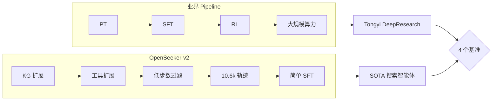

# Day 29: OpenSeeker-v2 — 通过简单 SFT 打造前沿搜索智能体

> **观看动画**: 

OpenSeeker-v2 仅用 **SFT**（无 CPT/RL），通过 10.6k 高信息密度轨迹实现了 SOTA 搜索智能体表现 — 3 个数据合成技巧：知识图谱扩展、工具集扩展、低步数过滤。在 4 个基准上超越 Tongyi DeepResearch（后者使用 heavy CPT+SFT+RL  pipeline）。

## 1. 背景：搜索智能体问题

深度搜索能力是前沿 LLM 智能体的核心竞争力 — 跨 Web 整合信息、多步推理、为用户提供准确且最新的答案。

**业界标准方案** 通常包含：
- **持续预训练 (CPT)**：领域特定的持续预训练
- **监督微调 (SFT)**：任务特定训练
- **强化学习 (RL)**：偏好优化

这套 pipeline **资源密集**，只有拥有大量算力的工业实验室才能玩转。

> *"当使用信息丰富、高难度的轨迹数据时，简单的 SFT 方法可以展现出惊人的强大能力。"*
> — OpenSeeker-v2 作者

## 2. 核心洞察

关键假设：**数据质量 > 训练 pipeline 复杂度**

学术团队缺乏 heavy CPT+RL pipeline 的算力。但如果精心筛选的高质量训练数据能够弥补这一差距呢？

OpenSeeker-v2 证明了：**只要训练数据足够好，前沿级搜索智能体可以从简单 SFT 中涌现**。

## 3. 三个数据合成技巧

OpenSeeker-v2 引入三个简单但有效的数据合成改进：

### 3.1 知识图谱扩展

扩大知识图谱的规模和高质量连接，使数据生成过程中的探索路径更加丰富。

- 更大 KG → 更多样化的查询轨迹
- 更全面的实体关系覆盖
- 支持多跳推理链

### 3.2 工具集扩展

扩展可用工具集大小，覆盖更广泛的功能：

```
工具集：搜索、浏览、提取、摘要、比较、计算、...
```

更多工具 → 更真实、更复杂的智能体工作流 → 更好泛化能力。

### 3.3 低步数过滤

基于**步数质量**对轨迹进行严格过滤：

- 剔除过短的轨迹（推理不充分）
- 剔除过长的轨迹（低效/循环）
- 只保留"金发姑娘区"轨迹——最优推理深度

## 4. 模型架构与训练

### 模型配置

OpenSeeker-v2 是 **30B 参数**模型，使用 **ReAct 范式**（推理 + 行动交替）。

### 训练配置

| 组件 | 详情 |
|------|------|
| 训练方法 | 纯 SFT（无 CPT，无 RL） |
| 数据规模 | 10.6k 高质量轨迹 |
| 范式 | ReAct（交错推理与行动） |
| 基座模型 | 未指定（方法与模型无关） |

### 为什么纯 SFT 有效

三个数据改进确保每条轨迹提供：
- **高信息含量**（KG 扩展）
- **复杂工具使用模式**（工具扩展）
- **干净推理链**（低步数过滤）

这创造了足够密集的训练信号，使 SFT 能捕获 RL 原本会发现的东西。

## 5. 实验结果

OpenSeeker-v2 在 **4 个基准**上达到 SOTA：

| 基准 | OpenSeeker-v2 | Tongyi DeepResearch |
|------|:---:|:---:|
| BrowseComp | **46.0%** | 43.4% |
| BrowseComp-ZH | **58.1%** | 46.7% |
| Humanity's Last Exam (HLE) | **34.6%** | 32.9% |
| xbench | **78.0%** | 75.0% |

**注**：Tongyi DeepResearch 使用 heavy CPT+SFT+RL pipeline。

### 核心成就

> *"OpenSeeker-v2 是首个在同规模、同范式下，仅由学术团队用纯 SFT 打造的前沿搜索智能体。"*

## 6. Mermaid 图：Pipeline 对比



## 7. 核心要点

1. **数据质量 > pipeline 复杂度** — 10.6k 精心设计的轨迹可以超越大规模算力 pipeline
2. **SFT 被低估了** — 有了正确的数据，简单 SFT 能媲美 RL 方法
3. **学术可及性** — 前沿搜索智能体现在无需工业级资源即可实现
4. **三个数据合成技巧** — KG 扩展、工具扩展、低步数过滤是通用原则，可迁移到其他智能体训练

## 8. 快速测验

**Q1**：OpenSeeker-v2 引入了哪三个数据合成改进？

**Q2**：OpenSeeker-v2 为什么能在没有 CPT 和 RL 的情况下仅靠 SFT 生效？

**Q3**：OpenSeeker-v2 在哪个基准上相对 Tongyi DeepResearch 提升最大？

---

## 延伸阅读

- [OpenSeeker-v2 论文](https://arxiv.org/abs/2605.04036) (arXiv:2605.04036)
- [多智能体反思系统](/tutorials/zh/act/agent/05-multi-agent-reflection.md) — Day 05 的智能体协作
- [并行工具调用](/tutorials/zh/act/agent/21-parallel-tool-calling.md) — Day 21 的智能体效率技巧

*下一篇：Day 30 — 来自前沿的另一篇论文*
