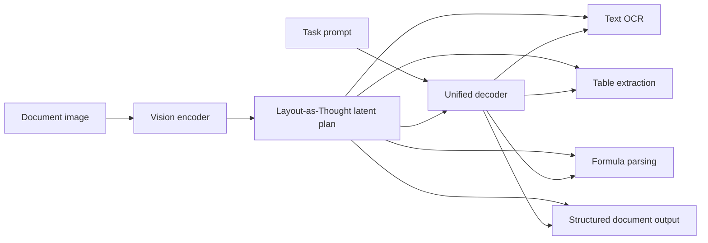

# Day 18: Qianfan-OCR - 先理解版面，再统一解码的 OCR 模型

> **观看动画**: 

## 一句话总结

Qianfan-OCR 把文档版面结构当成一个显式的中间思考过程，再让统一解码器去完成文本识别、表格抽取、公式识别和结构化解析，因此相比纯端到端 token 生成，它更不容易在复杂页面上发生版面混淆。

---

## 为什么这很重要

### OCR 早就不只是“识别文字”

现代文档 AI 往往要同时解决几类问题：

- 读取密集正文
- 处理复杂版面的阅读顺序
- 恢复表格、图表和印章
- 保留结构供下游解析使用

传统 OCR 流水线通常把这些问题拆成很多模块分别处理。这样做能工作，但每一次模块交接都会引入新的失败点：

- 检测器漏掉区域
- 阅读顺序被打乱
- 表格单元格对齐丢失
- 视觉元素被压平成普通文本

### 纯端到端 VLM 也有明显短板

大视觉语言模型可以直接读文档，但如果完全依赖自回归解码，它常常会把“内容在哪里”和“下一步该输出什么”混在一起。

在文档场景里，这会表现成一种版面级漂移：

- 相邻区域文本互相串行
- 多栏顺序出错
- 图注和正文相互污染
- 在企业票据、报告、复杂表单上解析质量下降

Qianfan-OCR 的切入点就是：不要假设解码器会自动学会稳定版面，而是把版面结构先显式表示出来。

---

## 核心洞察

### 1. 版面结构变成显式“思考轨迹”

模型会先构建页面区域、顺序和元素类型的结构化内部表示。论文把这一步称为 **Layout-as-Thought**。

它不是直接从图像 patch 一路生成最终 token，而是插入了一个中间计划层：

1. 检测并组织语义区域
2. 推断阅读顺序与结构关系
3. 再根据任务要求输出结果

这也是它最值得讲的地方：它不是“更大的 OCR 模型”，而是“带显式规划瓶颈的 OCR 模型”。

### 2. 一个模型覆盖多种文档任务

同一套主干可以完成：

- 普通文本 OCR
- 表格抽取
- 公式识别
- 结构化页面解析

任务 prompt 负责告诉解码器当前要输出哪种形式，而版面潜在表示是共享的。

### 3. 显式结构同时提升准确率和可控性

如果版面先被单独表示出来，模型就不必把空间推理和文本生成硬塞进同一条隐式 token 流里。

这样通常会改善：

- 阅读顺序一致性
- 混合版面页面上的鲁棒性
- 对多种文档下游任务的复用能力

---

## 架构流程



### 它和普通 OCR 流水线有什么不同

- 版面表示在多个任务之间是**共享的**
- 解码器是**任务条件化**的，而不是每种输出都重新训练一套
- 这个潜在计划层像结构正则项一样，降低复杂页面上的 token 混淆

---

## 数学表述

### 标准端到端 OCR

普通自回归文档模型学习的是：

$$
p(y \mid x)
$$

其中：

- $x$ 是文档图像
- $y$ 是输出 token 序列

这意味着同一个模型必须同时处理视觉感知、版面推理和文本生成。

### Layout-as-Thought 的分解方式

Qianfan-OCR 在中间引入一个潜在结构 $z$：

$$
p(y \mid x, t) = \sum_z p(y \mid z, t) \, p(z \mid x)
$$

其中：

- $x$ 是页面图像
- $z$ 是潜在版面计划
- $t$ 是任务 prompt，比如 OCR、表格或公式模式
- $y$ 是最终输出

关键思想就是把困难问题拆成两步：

1. **版面推断**：$p(z \mid x)$
2. **任务解码**：$p(y \mid z, t)$

### 为什么这会更稳

当页面上有很多互相竞争的区域时，直接建模 $p(y \mid x)$ 容易让解码顺序变得不稳定。中间计划层先把结构显式化，再开始 token 生成，可以减轻这个负担。

可以把整体质量粗略理解成：

$$
\text{Document Quality} \approx f(\text{visual fidelity}, \text{layout consistency}, \text{task decoding})
$$

Qianfan-OCR 直接优化中间这项，也就是版面一致性，而不是把它当成解码器偶然学出来的副产物。

---

## Python 代码实现

```python
from dataclasses import dataclass
from typing import Literal


Task = Literal["ocr", "table", "formula"]


@dataclass
class Region:
    kind: str
    x1: int
    y1: int
    x2: int
    y2: int
    text_hint: str


class LayoutPlanner:
    """
    一个简化版 layout-as-thought 规划器。
    它会把无序页面区域整理成显式阅读计划。
    """

    def infer_layout(self, regions: list[Region]) -> list[Region]:
        return sorted(regions, key=lambda r: (r.y1 // 80, r.x1))


class UnifiedDocumentDecoder:
    """
    任务条件化解码器。
    同一份版面计划可以产出不同文档任务结果。
    """

    def decode(self, layout: list[Region], task: Task) -> str:
        if task == "ocr":
            return "\n".join(region.text_hint for region in layout)

        if task == "table":
            rows = [region for region in layout if region.kind == "cell"]
            return "| cell |\n|---|\n" + "\n".join(f"| {cell.text_hint} |" for cell in rows)

        if task == "formula":
            formulas = [region.text_hint for region in layout if region.kind == "formula"]
            return "\n".join(formulas)

        raise ValueError(f"unsupported task: {task}")


if __name__ == "__main__":
    regions = [
        Region("title", 40, 20, 420, 70, "Quarterly Report"),
        Region("cell", 45, 180, 180, 220, "Revenue"),
        Region("cell", 190, 180, 320, 220, "$12.4M"),
        Region("formula", 40, 260, 320, 300, "margin = profit / revenue"),
        Region("text", 50, 100, 420, 150, "North America growth accelerated."),
    ]

    planner = LayoutPlanner()
    layout = planner.infer_layout(regions)

    decoder = UnifiedDocumentDecoder()
    print("OCR mode:\n", decoder.decode(layout, "ocr"))
    print("\nTable mode:\n", decoder.decode(layout, "table"))
    print("\nFormula mode:\n", decoder.decode(layout, "formula"))
```

---

## Qianfan-OCR 给我们的启发

1. **文档理解的提升不只来自更大的解码器，也来自显式结构建模。**
2. **版面本身就是一种推理问题，不只是预处理检测步骤。**
3. **共享潜在计划层可以把 OCR、解析、表格抽取统一到一个模型族里。**
4. **先稳定空间顺序，再做 prompt 条件化输出，会让文档模型更实用。**
5. **越来越多多模态系统正在走向“先规划，再解码”的设计。**

---

## 相关教程

- [Day 08: 内存与 KV 缓存](/tutorials/zh/memory/08-memory-kv-cache.md)
- [Day 12: 基于置信度动态的大推理模型提前停止](/tutorials/zh/inference/12-early-stopping.md)

---

## 参考资料

- [Qianfan-OCR Technical Report](https://arxiv.org/abs/2603.13398) - Baidu OCR Team, 2026-03-11
- [Hugging Face Papers: Qianfan-OCR Technical Report](https://huggingface.co/papers/2603.13398)
- [Hugging Face model page: baidu/Qianfan-OCR](https://huggingface.co/baidu/Qianfan-OCR)
- [Reddit discussion on r/LocalLLaMA, 2026-03-18](https://www.reddit.com/r/LocalLLaMA/comments/1rx6x20/qianfanocr_4b_endtoend_document_ai_model_9312_on/)
